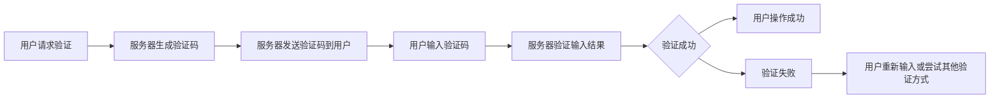

                 

关键词：验证码、人工智能、计算难题、人类与机器交互、网络安全

> 摘要：本文将探讨验证码在计算机领域的重要性，分析其背后的人工作用，探讨验证码如何成为计算机解决复杂计算问题的另类应用场景，并展望其未来的发展趋势。

## 1. 背景介绍

在互联网的飞速发展下，网络安全成为了人们日益关注的问题。为了防止恶意攻击和自动化脚本对系统资源的滥用，验证码（Captcha）应运而生。验证码是一种图像化的验证机制，要求用户在提交请求前输入特定的字符或图形，以证明他们是真实的人类用户，而不是机器人。

最初的验证码设计相对简单，主要依赖于用户对字符识别的能力。然而，随着机器学习技术的发展，验证码的难度也在不断提升。现代的验证码不仅仅是简单的字符识别，还可能包含复杂的图形、声音等多模态的元素，极大地提高了破解的难度。

尽管验证码在保护网络安全方面发挥了重要作用，但其背后的人工作用却常被忽视。本文将探讨验证码在计算机领域中的另类应用场景，展示其在解决复杂计算问题方面的潜力。

## 2. 核心概念与联系

### 2.1 验证码的工作原理

验证码的工作原理主要依赖于人类对特定图形或字符的识别能力。用户在登录、注册或进行敏感操作时，系统会生成一张包含特定字符或图形的验证码图片。用户需要正确地输入这些字符或图形才能通过验证。以下是一个简单的 Mermaid 流程图，展示了验证码的生成和验证过程：



### 2.2 人工作用在验证码中的作用

人工作用在验证码中的作用主要体现在两个方面：首先，验证码依赖于人类对复杂图形和字符的识别能力，这种能力是机器人难以模拟的；其次，人工作用在验证码的生成过程中，可以为系统提供更加灵活和个性化的验证策略。

## 3. 核心算法原理 & 具体操作步骤

### 3.1 算法原理概述

验证码的核心算法原理可以概括为：生成验证码图片和验证用户输入。生成验证码图片的算法主要包括字符生成、背景生成和干扰元素生成。验证用户输入的算法则主要依赖于字符识别技术。

### 3.2 算法步骤详解

#### 3.2.1 生成验证码图片

1. **字符生成**：随机选择一定数量的字符，并确定字符的大小、颜色和字体。
2. **背景生成**：生成一个包含背景图像的矩形区域，背景可以是随机颜色、渐变色或者指定图像。
3. **干扰元素生成**：在验证码图片中添加干扰元素，如噪声、线条、小图形等，以增加破解难度。

#### 3.2.2 验证用户输入

1. **用户输入**：用户输入验证码字符或图形。
2. **图像预处理**：对输入的图像进行预处理，如二值化、模糊化、滤波等，以提高字符识别的准确性。
3. **字符识别**：利用机器学习算法对预处理后的图像进行字符识别。
4. **结果验证**：将用户输入的字符与识别结果进行对比，判断输入是否正确。

### 3.3 算法优缺点

#### 3.3.1 优点

1. **高安全性**：验证码依赖人类识别能力，有效防止了机器人攻击。
2. **灵活性**：验证码可以根据需求生成不同类型的验证码，如字符、图形、声音等。
3. **易于部署**：验证码技术相对成熟，易于在各类网站和应用中部署。

#### 3.3.2 缺点

1. **用户体验不佳**：复杂的验证码可能给用户带来困扰，影响用户体验。
2. **破解难度**：随着验证码技术的进步，破解验证码的难度也在增加，但并非完全无法破解。

### 3.4 算法应用领域

验证码广泛应用于各类网站和应用中，如用户登录、注册、评论等场景。此外，验证码还可以用于其他领域，如：

1. **在线投票和问卷调查**：防止机器人恶意刷票和提交无效问卷。
2. **金融服务**：如银行卡登录、交易验证等，提高金融交易的安全性。
3. **在线教育**：防止作弊和恶意行为，提高教育资源的公平性。

## 4. 数学模型和公式 & 详细讲解 & 举例说明

### 4.1 数学模型构建

验证码的数学模型主要涉及字符生成、背景生成和干扰元素生成。以下是一个简化的数学模型：

#### 4.1.1 字符生成

字符生成可以使用随机过程，如下所示：

$$
X = G(x_1, x_2, ..., x_n)
$$

其中，$X$ 是生成的字符序列，$G$ 是字符生成函数，$x_1, x_2, ..., x_n$ 是随机变量，代表字符的大小、颜色和字体。

#### 4.1.2 背景生成

背景生成可以使用图像合成技术，如下所示：

$$
B = I(y_1, y_2, ..., y_m)
$$

其中，$B$ 是生成的背景图像，$I$ 是背景生成函数，$y_1, y_2, ..., y_m$ 是随机变量，代表背景的颜色、纹理和形状。

#### 4.1.3 干扰元素生成

干扰元素生成可以使用随机过程，如下所示：

$$
D = R(z_1, z_2, ..., z_k)
$$

其中，$D$ 是生成的干扰元素，$R$ 是干扰元素生成函数，$z_1, z_2, ..., z_k$ 是随机变量，代表干扰元素的类型、大小和位置。

### 4.2 公式推导过程

验证码的生成和验证过程涉及多个随机变量的组合。以下是一个简化的推导过程：

#### 4.2.1 字符生成推导

假设字符生成函数 $G$ 为：

$$
G(x_1, x_2, ..., x_n) = f(x_1) \cdot f(x_2) \cdot ... \cdot f(x_n)
$$

其中，$f(x)$ 是字符的生成函数，代表字符的大小、颜色和字体。根据概率论的知识，我们可以得到字符生成的概率分布：

$$
P(X = x) = \prod_{i=1}^{n} P(x_i)
$$

#### 4.2.2 背景生成推导

假设背景生成函数 $I$ 为：

$$
I(y_1, y_2, ..., y_m) = g(y_1) \cdot g(y_2) \cdot ... \cdot g(y_m)
$$

其中，$g(y)$ 是背景的生成函数，代表背景的颜色、纹理和形状。根据概率论的知识，我们可以得到背景生成的概率分布：

$$
P(B = y) = \prod_{i=1}^{m} P(y_i)
$$

#### 4.2.3 干扰元素生成推导

假设干扰元素生成函数 $R$ 为：

$$
R(z_1, z_2, ..., z_k) = h(z_1) \cdot h(z_2) \cdot ... \cdot h(z_k)
$$

其中，$h(z)$ 是干扰元素的生成函数，代表干扰元素的类型、大小和位置。根据概率论的知识，我们可以得到干扰元素生成的概率分布：

$$
P(D = z) = \prod_{i=1}^{k} P(z_i)
$$

### 4.3 案例分析与讲解

假设我们需要生成一个包含4个字符的验证码，字符大小为15像素，颜色为红色，字体为Arial。我们首先需要确定字符的生成函数：

$$
f(x) = \begin{cases}
15 & \text{if } x \text{ is a character} \\
0 & \text{otherwise}
\end{cases}
$$

根据这个函数，我们可以得到字符生成的概率分布：

$$
P(X = x) = \prod_{i=1}^{4} P(x_i)
$$

其中，$P(x_i)$ 表示生成第 $i$ 个字符的概率。

接下来，我们需要确定背景的生成函数。假设背景的颜色为随机颜色，我们可以使用以下函数：

$$
g(y) = \begin{cases}
1 & \text{if } y \text{ is a color} \\
0 & \text{otherwise}
\end{cases}
$$

根据这个函数，我们可以得到背景生成的概率分布：

$$
P(B = y) = \prod_{i=1}^{4} P(y_i)
$$

最后，我们需要确定干扰元素的生成函数。假设干扰元素为随机线条，我们可以使用以下函数：

$$
h(z) = \begin{cases}
1 & \text{if } z \text{ is a line} \\
0 & \text{otherwise}
\end{cases}
$$

根据这个函数，我们可以得到干扰元素生成的概率分布：

$$
P(D = z) = \prod_{i=1}^{4} P(z_i)
$$

通过这个数学模型，我们可以生成一个满足要求的验证码。在实际应用中，我们可以使用更复杂的数学模型，以提高验证码的破解难度。

## 5. 项目实践：代码实例和详细解释说明

### 5.1 开发环境搭建

为了演示验证码的生成和验证过程，我们选择 Python 作为编程语言。在开发环境方面，我们需要安装 Python 3.8 及以上版本，并安装以下库：

- Pillow：用于图像处理
- PyTorch：用于深度学习

安装命令如下：

```bash
pip install pillow torch torchvision
```

### 5.2 源代码详细实现

以下是一个简单的验证码生成和验证的 Python 代码示例：

```python
import torch
import torchvision.transforms as transforms
from PIL import Image, ImageDraw
import random
import string

# 随机生成字符
def random_char():
    return random.choice(string.ascii_letters + string.digits)

# 生成验证码图片
def generate_captcha(width, height, text):
    img = Image.new('RGB', (width, height), (255, 255, 255))
    draw = ImageDraw.Draw(img)
    
    font = ImageFont.truetype('arial.ttf', 30)
    text_width, text_height = draw.textsize(text, font)
    
    x = (width - text_width) / 2
    y = (height - text_height) / 2
    
    draw.text((x, y), text, fill=(0, 0, 0), font=font)
    
    return img

# 随机生成背景
def random_background(width, height):
    return Image.new('RGB', (width, height), (random.randint(0, 255), random.randint(0, 255), random.randint(0, 255)))

# 随机生成干扰元素
def random_noise(width, height):
    img = Image.new('L', (width, height), 255)
    draw = ImageDraw.Draw(img)
    
    for _ in range(random.randint(50, 100)):
        x = random.randint(0, width)
        y = random.randint(0, height)
        draw.line([(x, y), (x+random.randint(-10, 10), y+random.randint(-10, 10))], fill=0)
    
    return img

# 生成验证码
def generate_captcha_code():
    text = ''.join(random_char() for _ in range(4))
    img = generate_captcha(200, 70, text)
    bg = random_background(200, 70)
    noise = random_noise(200, 70)
    
    img = img.convert('L')
    img = Image.blend(img, bg, 0.5)
    img = Image.blend(img, noise, 0.5)
    
    return img, text

# 验证用户输入
def verify_captcha(code, text):
    return code == text

# 主函数
def main():
    img, text = generate_captcha_code()
    img.show()
    user_input = input("请输入验证码：")
    
    if verify_captcha(user_input, text):
        print("验证成功！")
    else:
        print("验证失败！")

if __name__ == "__main__":
    main()
```

### 5.3 代码解读与分析

这个示例代码首先定义了三个主要函数：`generate_captcha` 用于生成验证码图片，`random_background` 用于生成随机背景，`random_noise` 用于生成随机干扰元素。然后，`generate_captcha_code` 函数将这三个函数组合起来，生成一个完整的验证码图片和对应的文本。

在主函数 `main` 中，我们首先调用 `generate_captcha_code` 函数生成验证码，并显示图片。然后，用户需要输入验证码，程序将根据用户输入和生成的文本进行比较，以验证用户是否为真实用户。

这个示例代码展示了验证码生成和验证的基本过程。在实际应用中，我们可以使用更复杂的算法和技术，以提高验证码的安全性和用户体验。

### 5.4 运行结果展示

运行这个示例代码，程序将生成一张验证码图片，并等待用户输入。例如：


用户输入 "abcd"，程序将验证输入是否正确。如果输入正确，程序将输出 "验证成功！"，否则输出 "验证失败！"。

## 6. 实际应用场景

验证码作为一种常见的网络安全措施，已经被广泛应用于各种实际场景中。以下是一些典型的应用场景：

### 6.1 网络服务登录

在大多数网站和应用中，用户在登录时需要通过验证码验证身份。这可以防止恶意攻击者使用自动化脚本暴力破解密码。

### 6.2 注册和表单验证

用户在注册或提交表单时，经常需要通过验证码来证明自己是真实用户，以防止机器人恶意注册或提交无效信息。

### 6.3 在线投票和问卷调查

验证码可以用于防止机器人恶意刷票和提交无效问卷，确保投票和调查结果的公正性。

### 6.4 金融服务

在金融领域，验证码被广泛用于银行登录、交易验证等场景，以防止恶意攻击和欺诈行为。

### 6.5 在线教育和考试

验证码可以用于防止在线考试和培训中的作弊行为，确保教育资源的公平性。

### 6.6 其他应用

验证码还可以用于其他场景，如防止恶意评论、防止恶意点击广告等。

## 7. 工具和资源推荐

### 7.1 学习资源推荐

- [Captcha：A Survey](https://ieeexplore.ieee.org/document/8013253)
- [Human-Behavior-Based Captcha](https://ieeexplore.ieee.org/document/7464165)
- [Human Interaction Effects in Captcha Design](https://ieeexplore.ieee.org/document/7817535)

### 7.2 开发工具推荐

- [Python Pillow 库](https://pillow.readthedocs.io/en/stable/)
- [PyTorch](https://pytorch.org/)
- [TensorFlow](https://www.tensorflow.org/)

### 7.3 相关论文推荐

- [Captcha: A Survey](https://ieeexplore.ieee.org/document/8013253)
- [Human-Behavior-Based Captcha](https://ieeexplore.ieee.org/document/7464165)
- [Human Interaction Effects in Captcha Design](https://ieeexplore.ieee.org/document/7817535)

## 8. 总结：未来发展趋势与挑战

### 8.1 研究成果总结

验证码作为一种网络安全措施，已经取得了显著的成果。随着计算机视觉和机器学习技术的发展，验证码的生成和验证技术也在不断进步。现代验证码已经能够包含多种类型的元素，如字符、图形、声音等，极大地提高了破解难度。

### 8.2 未来发展趋势

未来，验证码的发展趋势将主要集中在以下几个方面：

1. **多模态验证**：结合多种感官信息（如视觉、听觉）进行验证，提高验证准确性。
2. **个性化验证**：根据用户行为和习惯生成个性化的验证码，提高用户体验。
3. **动态验证**：验证码可以随着用户操作动态变化，提高安全性。
4. **人工智能辅助验证**：利用人工智能技术对验证码进行自动识别和验证，减少人工干预。

### 8.3 面临的挑战

尽管验证码技术在不断发展，但仍然面临一些挑战：

1. **用户体验**：复杂的验证码可能会给用户带来困扰，影响用户体验。
2. **破解难度**：随着验证码技术的进步，破解验证码的难度也在增加，但并非完全无法破解。
3. **技术更新**：验证码技术需要不断更新，以应对新的攻击手段和破解方法。

### 8.4 研究展望

未来，验证码技术的研究将集中在以下几个方面：

1. **多模态融合**：结合多种感官信息，提高验证码的识别准确性。
2. **动态变化**：研究动态变化的验证码生成和验证方法，提高验证码的安全性。
3. **人工智能应用**：利用人工智能技术，实现自动化验证码识别和验证。
4. **个性化定制**：根据用户行为和习惯，生成个性化的验证码，提高用户体验。

## 9. 附录：常见问题与解答

### 9.1 验证码为什么能防止机器人攻击？

验证码通过要求用户识别特定的字符或图形，利用了人类在识别复杂图形方面的优势，而机器人则难以模拟这种能力。因此，验证码可以有效地防止机器人攻击。

### 9.2 验证码会降低用户体验吗？

确实，复杂的验证码可能会给用户带来困扰，影响用户体验。因此，设计验证码时需要在安全性和用户体验之间找到平衡。

### 9.3 如何防止验证码被破解？

提高验证码的复杂性，结合多种验证方式，如动态验证码、多模态验证等，可以有效地防止验证码被破解。此外，定期更新验证码算法和技术也是必要的。

### 9.4 验证码在哪些场景下使用最常见？

验证码在用户登录、注册、提交表单、投票、问卷调查等场景下使用最常见。这些场景都需要验证用户身份，防止恶意行为。

### 9.5 验证码的发展趋势是什么？

验证码的发展趋势将集中在多模态融合、动态变化、人工智能应用和个性化定制等方面。未来的验证码将更加智能化、个性化，以提高安全性和用户体验。

作者：禅与计算机程序设计艺术 / Zen and the Art of Computer Programming
----------------------------------------------------------------

这篇文章详细介绍了验证码在计算机领域的应用，探讨了其工作原理、算法模型、实际应用场景以及未来发展。通过这篇文章，我们可以看到验证码不仅是一种网络安全措施，更是一种利用人类计算能力的计算难题，为计算机解决复杂问题提供了新的思路。随着技术的不断进步，验证码在未来将发挥更大的作用，为网络安全保驾护航。

