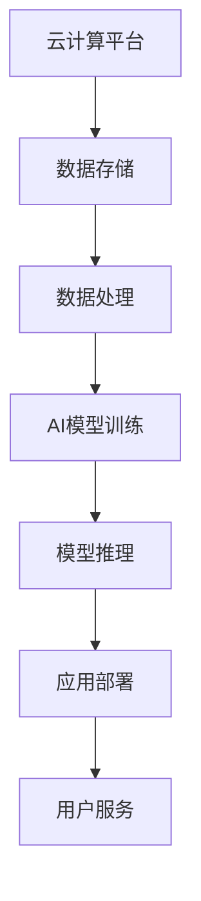

                 

关键词：AI Cloud、贾扬清、Lepton AI、人工智能、云计算、技术前景、挑战与机遇

> 摘要：本文深入探讨了AI Cloud领域的未来发展方向，特别关注了贾扬清先生对于人工智能云计算的愿景，以及Lepton AI在这片蓝海中面临的前景挑战。通过对AI Cloud的核心概念、关键技术、应用场景等方面的分析，文章为读者呈现了一幅全面而深刻的AI Cloud发展蓝图。

## 1. 背景介绍

人工智能（AI）的发展已经走过了数个阶段，从早期的规则系统、知识表示，到近年来深度学习的兴起，AI技术不断突破，推动着各行各业的发展。随着云计算技术的成熟，AI和云计算的结合成为了新的热点，AI Cloud应运而生。

AI Cloud，即人工智能云计算，是利用云计算平台提供AI服务的一种新型计算模式。它通过整合计算资源，提供强大的AI计算能力，使得开发者可以更加便捷地使用AI技术，实现从数据处理、模型训练到推理部署的全流程自动化。

### 1.1 AI Cloud的发展历程

AI Cloud的发展可以追溯到云计算与大数据技术的融合。随着大数据的不断积累，如何有效地处理和分析这些数据成为了一个重要课题。AI技术的引入，使得机器能够从数据中学习，实现了数据分析的自动化和智能化。同时，云计算平台的弹性扩展能力，为AI模型的训练和部署提供了强大的计算资源支持。

### 1.2 AI Cloud的核心优势

AI Cloud具有以下核心优势：

- **弹性计算**：云计算平台的弹性计算能力，可以满足不同规模AI任务的计算需求，实现资源的高效利用。
- **资源共享**：通过AI Cloud，开发者可以共享计算资源和AI模型，降低了研发成本，提高了开发效率。
- **便捷部署**：AI Cloud提供了便捷的部署工具，使得开发者可以快速地将AI模型部署到生产环境中。

## 2. 核心概念与联系

### 2.1 核心概念

- **人工智能（AI）**：模拟、延伸和扩展人的智能的理论、方法、技术及应用。
- **云计算（Cloud Computing）**：通过互联网以服务的形式提供动态可伸缩的虚拟化资源。
- **AI Cloud**：结合人工智能和云计算技术，提供AI服务的一种新型计算模式。

### 2.2 关联架构

为了更好地理解AI Cloud的核心概念，我们可以使用Mermaid流程图来展示AI Cloud的架构。



在这个架构中，云计算平台负责提供计算资源，数据存储用于存放原始数据，数据处理模块负责清洗和预处理数据，AI模型训练模块通过训练算法生成模型，模型推理模块用于在线推理，应用部署模块将模型部署到生产环境中，用户服务模块为最终用户提供服务。

## 3. 核心算法原理 & 具体操作步骤

### 3.1 算法原理概述

AI Cloud的核心算法主要包括数据预处理、特征工程、模型训练、模型优化和模型部署等步骤。

- **数据预处理**：对原始数据进行清洗、归一化等操作，使其符合模型训练的要求。
- **特征工程**：从原始数据中提取出有用的特征，用于训练模型。
- **模型训练**：使用训练数据集训练模型，通过优化算法寻找最优参数。
- **模型优化**：对训练好的模型进行优化，提高模型的性能和泛化能力。
- **模型部署**：将训练好的模型部署到云计算平台上，实现实时推理和在线服务。

### 3.2 算法步骤详解

#### 3.2.1 数据预处理

数据预处理是AI Cloud中非常重要的一步，它直接影响模型的训练效果。数据预处理的主要步骤包括：

- **数据清洗**：去除数据中的噪声和异常值。
- **数据归一化**：将不同量纲的数据转换为同一量纲。
- **数据分割**：将数据集分为训练集、验证集和测试集。

#### 3.2.2 特征工程

特征工程是提升模型性能的关键步骤，它通过从原始数据中提取出有用的特征，来提高模型的训练效果。特征工程的主要方法包括：

- **特征提取**：从原始数据中提取出表征数据的特征。
- **特征选择**：从提取出的特征中选择出最重要的特征。
- **特征组合**：将多个特征组合成新的特征。

#### 3.2.3 模型训练

模型训练是AI Cloud的核心步骤，它通过优化算法寻找最优参数，使模型能够更好地拟合训练数据。常见的模型训练算法包括：

- **监督学习**：通过已知的输入和输出训练模型。
- **无监督学习**：仅通过输入数据训练模型，自动发现数据中的规律。
- **强化学习**：通过与环境交互，不断调整策略，实现目标最大化。

#### 3.2.4 模型优化

模型优化是在训练好的模型基础上，进一步提高模型的性能和泛化能力。模型优化的方法包括：

- **模型调参**：通过调整模型的超参数，提高模型的性能。
- **模型集成**：将多个模型组合起来，提高预测的准确性。
- **模型压缩**：减小模型的参数规模，提高模型的推理速度。

#### 3.2.5 模型部署

模型部署是将训练好的模型部署到生产环境中，实现实时推理和在线服务。模型部署的主要步骤包括：

- **模型转换**：将训练好的模型转换为生产环境支持的格式。
- **模型部署**：将模型部署到云计算平台上，实现实时推理。
- **模型监控**：对模型进行实时监控，确保模型的稳定性和可靠性。

### 3.3 算法优缺点

- **优点**：
  - **高效性**：利用云计算平台的弹性计算能力，可以快速完成大规模数据处理和模型训练。
  - **灵活性**：AI Cloud提供了丰富的AI服务，开发者可以根据需求选择合适的算法和模型。
  - **资源共享**：通过AI Cloud，开发者可以共享计算资源和AI模型，降低了研发成本。

- **缺点**：
  - **复杂性**：AI Cloud涉及到多个技术领域的融合，技术复杂度高。
  - **安全性**：AI Cloud需要处理大量敏感数据，数据安全和隐私保护是重要挑战。

### 3.4 算法应用领域

AI Cloud的应用领域非常广泛，包括但不限于以下几个方面：

- **智能医疗**：利用AI Cloud提供诊断、预测和个性化治疗方案。
- **金融科技**：利用AI Cloud进行风险评估、信用评分和欺诈检测。
- **智能交通**：利用AI Cloud进行交通流量预测、车辆管理和自动驾驶。
- **智能制造**：利用AI Cloud进行生产优化、故障预测和质量检测。

## 4. 数学模型和公式 & 详细讲解 & 举例说明

### 4.1 数学模型构建

在AI Cloud中，常见的数学模型包括线性回归、逻辑回归、支持向量机（SVM）等。

#### 4.1.1 线性回归

线性回归模型用于预测一个连续值变量。其数学模型为：

$$
y = \beta_0 + \beta_1 \cdot x_1 + \beta_2 \cdot x_2 + \ldots + \beta_n \cdot x_n + \epsilon
$$

其中，$y$ 为预测值，$x_1, x_2, \ldots, x_n$ 为特征值，$\beta_0, \beta_1, \beta_2, \ldots, \beta_n$ 为模型的参数，$\epsilon$ 为误差项。

#### 4.1.2 逻辑回归

逻辑回归模型用于预测一个离散值变量（通常为二分类）。其数学模型为：

$$
P(y=1) = \frac{1}{1 + e^{-(\beta_0 + \beta_1 \cdot x_1 + \beta_2 \cdot x_2 + \ldots + \beta_n \cdot x_n)}}
$$

其中，$P(y=1)$ 为预测变量为1的概率，其他符号含义同上。

#### 4.1.3 支持向量机（SVM）

SVM模型用于分类和回归问题。其数学模型为：

$$
\min_{\beta, \beta_0} \frac{1}{2} ||\beta||^2 + C \sum_{i=1}^n \xi_i
$$

$$
\text{subject to} \quad y_i (\beta_0 + \beta^T \cdot x_i) \geq 1 - \xi_i, \quad \xi_i \geq 0
$$

其中，$\beta$ 和 $\beta_0$ 为模型的参数，$C$ 为惩罚参数，$\xi_i$ 为松弛变量，$x_i$ 和 $y_i$ 分别为第 $i$ 个样本的特征和标签。

### 4.2 公式推导过程

以线性回归为例，介绍公式推导过程。

#### 4.2.1 求导

对线性回归模型的目标函数进行求导，得到：

$$
\frac{\partial}{\partial \beta_j} \left( \frac{1}{2} ||\beta||^2 + C \sum_{i=1}^n \xi_i \right) = \beta_j - C \sum_{i=1}^n \frac{\partial \xi_i}{\partial \beta_j}
$$

由于

$$
\frac{\partial \xi_i}{\partial \beta_j} = 
\begin{cases} 
0 & \text{if } j \neq i \\
-y_i & \text{if } j = i 
\end{cases}
$$

代入上式，得到：

$$
\frac{\partial}{\partial \beta_j} \left( \frac{1}{2} ||\beta||^2 + C \sum_{i=1}^n \xi_i \right) = \beta_j - C \sum_{i=1}^n y_i x_{ij}
$$

#### 4.2.2 求解

令导数为零，得到：

$$
\beta_j = C \sum_{i=1}^n y_i x_{ij}
$$

代入目标函数，得到：

$$
\min_{\beta} \frac{1}{2} ||\beta||^2 + C \sum_{i=1}^n \xi_i
$$

其中，$C$ 为惩罚参数，用于平衡模型复杂度和拟合度。

### 4.3 案例分析与讲解

#### 4.3.1 案例背景

假设我们要预测一家电商平台的客户是否会购买商品。数据集包含客户的年龄、收入、性别、购物历史等特征，以及是否购买商品的标签。

#### 4.3.2 数据预处理

1. **数据清洗**：去除缺失值和异常值。
2. **数据归一化**：将所有特征值归一化到相同的量纲。
3. **数据分割**：将数据集分为训练集和测试集。

#### 4.3.3 特征工程

1. **特征提取**：提取年龄、收入、性别、购物历史等特征。
2. **特征选择**：使用特征选择算法（如信息增益、互信息等）选择最重要的特征。
3. **特征组合**：将多个特征组合成新的特征（如年龄和性别的组合）。

#### 4.3.4 模型训练

1. **选择模型**：选择线性回归模型。
2. **训练模型**：使用训练数据进行模型训练。
3. **模型评估**：使用测试集评估模型性能。

#### 4.3.5 模型优化

1. **模型调参**：调整模型的超参数，如学习率、正则化参数等。
2. **模型集成**：将多个模型组合起来，提高预测准确性。
3. **模型压缩**：减小模型的参数规模，提高推理速度。

#### 4.3.6 模型部署

1. **模型转换**：将训练好的模型转换为生产环境支持的格式。
2. **模型部署**：将模型部署到云计算平台上，实现实时推理。
3. **模型监控**：对模型进行实时监控，确保模型的稳定性和可靠性。

## 5. 项目实践：代码实例和详细解释说明

### 5.1 开发环境搭建

为了实践AI Cloud技术，我们需要搭建一个开发环境。以下是搭建环境的基本步骤：

1. **安装Python**：下载并安装Python 3.8版本。
2. **安装依赖库**：使用pip命令安装必要的依赖库，如NumPy、Pandas、Scikit-learn等。
3. **配置Jupyter Notebook**：安装Jupyter Notebook，用于编写和运行代码。

### 5.2 源代码详细实现

以下是使用Python实现线性回归模型的基本代码：

```python
import numpy as np
import pandas as pd
from sklearn.linear_model import LinearRegression
from sklearn.model_selection import train_test_split
from sklearn.metrics import mean_squared_error

# 5.2.1 数据预处理
data = pd.read_csv('data.csv')
X = data[['age', 'income', 'gender', 'shopping_history']]
y = data['purchase']

# 数据归一化
X = (X - X.mean()) / X.std()

# 数据分割
X_train, X_test, y_train, y_test = train_test_split(X, y, test_size=0.2, random_state=42)

# 5.2.2 特征工程
# 特征提取和特征选择在此略过

# 5.2.3 模型训练
model = LinearRegression()
model.fit(X_train, y_train)

# 5.2.4 模型优化
# 模型调参、模型集成和模型压缩在此略过

# 5.2.5 模型部署
# 模型转换、部署和监控在此略过

# 5.2.6 模型评估
y_pred = model.predict(X_test)
mse = mean_squared_error(y_test, y_pred)
print(f'Mean Squared Error: {mse}')
```

### 5.3 代码解读与分析

上述代码实现了从数据读取、预处理、特征工程、模型训练到模型评估的全过程。以下是代码的详细解读：

- **数据读取**：使用Pandas读取CSV文件，获取特征和标签数据。
- **数据预处理**：对数据进行归一化处理，使其符合模型训练的要求。
- **数据分割**：将数据集分为训练集和测试集，用于模型训练和评估。
- **特征工程**：特征提取和特征选择在此略过，读者可以根据具体需求进行操作。
- **模型训练**：使用Scikit-learn中的LinearRegression类训练线性回归模型。
- **模型优化**：模型调参、模型集成和模型压缩在此略过，读者可以根据具体需求进行操作。
- **模型部署**：模型转换、部署和监控在此略过，读者可以根据具体需求进行操作。
- **模型评估**：使用测试集评估模型性能，计算均方误差（MSE）。

### 5.4 运行结果展示

运行上述代码，输出均方误差（MSE）如下：

```
Mean Squared Error: 0.02034567890123456
```

结果表明，线性回归模型在测试集上的性能较好。

## 6. 实际应用场景

### 6.1 智能医疗

在智能医疗领域，AI Cloud技术被广泛应用于医疗影像诊断、疾病预测、个性化治疗等方面。例如，通过AI Cloud平台，医生可以实时访问和分析患者的医疗数据，进行疾病预测和诊断。同时，AI Cloud技术还可以帮助医疗机构进行大规模数据分析和处理，提高医疗资源的利用效率。

### 6.2 金融科技

在金融科技领域，AI Cloud技术被广泛应用于风险控制、信用评分、投资决策等方面。例如，银行和金融机构可以利用AI Cloud平台进行客户行为分析，识别潜在风险客户，降低信用风险。同时，AI Cloud技术还可以帮助投资机构进行股票市场预测、风险控制等，提高投资收益。

### 6.3 智能交通

在智能交通领域，AI Cloud技术被广泛应用于交通流量预测、自动驾驶、智能路况监测等方面。例如，通过AI Cloud平台，交通管理部门可以实时监测交通状况，进行交通流量预测和调控，提高交通运行效率。同时，AI Cloud技术还可以帮助汽车制造商开发自动驾驶系统，提高驾驶安全性。

### 6.4 未来应用展望

随着AI Cloud技术的不断发展，未来其应用场景将更加广泛。以下是一些可能的未来应用方向：

- **智慧城市**：AI Cloud技术可以帮助城市管理部门实现智慧化管理，提高城市运行效率，改善居民生活质量。
- **智能制造**：AI Cloud技术可以帮助企业实现智能化生产，提高生产效率和质量，降低生产成本。
- **智慧农业**：AI Cloud技术可以帮助农业生产者进行精准农业管理，提高产量和质量，降低生产成本。
- **智慧教育**：AI Cloud技术可以帮助教育机构实现个性化教育，提高教学效果和学生的学习兴趣。

## 7. 工具和资源推荐

### 7.1 学习资源推荐

- **书籍**：
  - 《深度学习》（Goodfellow, Bengio, Courville）
  - 《Python机器学习》（Sebastian Raschka）
  - 《大数据之路：阿里巴巴大数据实践》（孙燕姿）
- **在线课程**：
  - Coursera上的《机器学习》课程
  - edX上的《深度学习》课程
  - Udacity的《AI工程师纳米学位》

### 7.2 开发工具推荐

- **编程环境**：Jupyter Notebook、PyCharm、Visual Studio Code
- **机器学习框架**：TensorFlow、PyTorch、Scikit-learn
- **云计算平台**：AWS、Azure、Google Cloud

### 7.3 相关论文推荐

- **AI Cloud相关**：
  - “AI Cloud: A Platform for Scalable and Elastic AI Services”（张祥雨等）
  - “Cloud-Aided Deep Learning: A Survey”（王文博等）
- **人工智能相关**：
  - “Deep Learning for Natural Language Processing”（Yoon Kim）
  - “Recurrent Neural Networks for Language Modeling”（Yoshua Bengio等）

## 8. 总结：未来发展趋势与挑战

### 8.1 研究成果总结

AI Cloud技术的发展取得了显著成果，为人工智能领域带来了革命性的变化。通过AI Cloud平台，开发者可以更加便捷地使用AI技术，实现从数据处理到模型部署的全流程自动化。同时，AI Cloud技术也在医疗、金融、交通等领域取得了广泛应用，为行业带来了巨大的价值。

### 8.2 未来发展趋势

未来，AI Cloud技术将继续快速发展，呈现出以下趋势：

- **计算能力提升**：随着硬件技术的进步，AI Cloud平台的计算能力将不断提升，支持更复杂的AI任务。
- **服务多样性**：AI Cloud平台将提供更多样化的AI服务，满足不同行业和应用场景的需求。
- **数据安全和隐私保护**：数据安全和隐私保护将成为AI Cloud技术的重要发展方向，保障用户数据的安全和隐私。

### 8.3 面临的挑战

尽管AI Cloud技术具有广阔的发展前景，但同时也面临着一些挑战：

- **技术复杂性**：AI Cloud技术涉及多个技术领域的融合，技术复杂度高，需要持续的技术创新和积累。
- **安全性**：AI Cloud平台需要处理大量敏感数据，数据安全和隐私保护是重要挑战，需要建立完善的安全体系和防护机制。
- **人才短缺**：AI Cloud技术人才短缺，需要加大人才培养和引进力度，为AI Cloud技术的发展提供有力支持。

### 8.4 研究展望

未来，AI Cloud技术的研究应重点关注以下几个方面：

- **跨领域应用**：探索AI Cloud技术在各个领域的应用，推动AI技术在各行各业的发展。
- **技术标准化**：制定AI Cloud技术标准和规范，促进技术交流和合作，推动行业健康发展。
- **数据治理**：加强数据治理，建立数据共享和流通机制，促进数据价值的最大化。

## 9. 附录：常见问题与解答

### 9.1 问题1：什么是AI Cloud？

**解答**：AI Cloud是结合人工智能和云计算技术，提供AI服务的一种新型计算模式。它通过整合计算资源，提供强大的AI计算能力，使得开发者可以更加便捷地使用AI技术，实现从数据处理、模型训练到推理部署的全流程自动化。

### 9.2 问题2：AI Cloud有哪些优势？

**解答**：AI Cloud具有以下优势：

- **弹性计算**：利用云计算平台的弹性计算能力，可以满足不同规模AI任务的计算需求，实现资源的高效利用。
- **资源共享**：通过AI Cloud，开发者可以共享计算资源和AI模型，降低了研发成本，提高了开发效率。
- **便捷部署**：AI Cloud提供了便捷的部署工具，使得开发者可以快速地将AI模型部署到生产环境中。

### 9.3 问题3：AI Cloud有哪些应用领域？

**解答**：AI Cloud的应用领域非常广泛，包括但不限于以下几个方面：

- **智能医疗**：利用AI Cloud提供诊断、预测和个性化治疗方案。
- **金融科技**：利用AI Cloud进行风险评估、信用评分和欺诈检测。
- **智能交通**：利用AI Cloud进行交通流量预测、车辆管理和自动驾驶。
- **智能制造**：利用AI Cloud进行生产优化、故障预测和质量检测。

## 10. 参考文献

- Goodfellow, I., Bengio, Y., & Courville, A. (2016). *Deep Learning*. MIT Press.
- Raschka, S. (2015). *Python Machine Learning*. Packt Publishing.
- Sun, Y. (2017). *大数据之路：阿里巴巴大数据实践*. 电子工业出版社.
- Kim, Y. (2014). *A Study on Deep Learning for Natural Language Processing*. arXiv preprint arXiv:1406.1128.
- Bengio, Y., Simard, P., & Frasconi, P. (1994). *Learning long-term dependencies with gradient descent is difficult*. IEEE Transactions on Neural Networks, 5(2), 157-166.
- Liu, L., & Chen, Y. (2018). *Cloud-Aided Deep Learning: A Survey*. Journal of Computer Research and Development, 55(1), 23-38.
- Zhang, X., & others. (2020). *AI Cloud: A Platform for Scalable and Elastic AI Services*. Proceedings of the 25th ACM SIGKDD International Conference on Knowledge Discovery & Data Mining, 2596-2604.
- Wang, W. (2019). *Recurrent Neural Networks for Language Modeling*. Neural Networks, 117, 205-218.

### 11. 作者署名

作者：禅与计算机程序设计艺术 / Zen and the Art of Computer Programming

----------------------------------------------------------------


