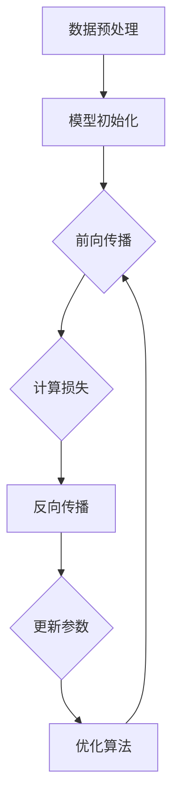

                 

关键词：AI创业公司，大模型，应用指南，模型优化，技术栈，实践案例

> 摘要：本文旨在为AI创业公司提供一份大模型应用指南，详细解析大模型的核心概念、算法原理、数学模型及其在创业项目中的实际应用，并探讨未来的发展趋势与挑战。

## 1. 背景介绍

在当今快速发展的科技时代，人工智能（AI）已经成为推动各行各业创新的重要力量。大模型（Large-scale Model）作为AI技术的重要分支，已经在自然语言处理、计算机视觉、推荐系统等领域取得了显著的成果。对于AI创业公司而言，大模型的应用不仅能够提升产品竞争力，还能为用户带来前所未有的体验。然而，如何有效地应用大模型，实现商业价值的最大化，成为许多创业公司面临的挑战。

本文将围绕以下几个方面展开讨论：

1. **核心概念与联系**：介绍大模型的基本概念和架构，并通过Mermaid流程图展示其原理。
2. **核心算法原理与操作步骤**：详解大模型的算法原理和操作步骤，分析其优缺点及应用领域。
3. **数学模型和公式**：讲解大模型背后的数学模型和公式，并进行案例分析与讲解。
4. **项目实践**：通过具体代码实例，展示大模型在创业项目中的实际应用。
5. **实际应用场景**：探讨大模型在不同领域的应用案例及其未来展望。
6. **工具和资源推荐**：推荐学习资源、开发工具和相关论文。
7. **总结与展望**：总结研究成果，探讨未来发展趋势与挑战。

## 2. 核心概念与联系

### 2.1 大模型基本概念

大模型（Large-scale Model）是指参数规模巨大的神经网络模型。随着计算能力和数据量的不断提升，大模型在AI领域取得了显著的突破。大模型通常具备以下特点：

- **参数规模**：数百万至数十亿个参数。
- **数据集规模**：数十亿至数千亿个训练样本。
- **计算资源需求**：大规模的分布式计算资源。
- **应用效果**：在图像识别、语言处理等领域取得了超越传统算法的性能。

### 2.2 大模型架构

大模型通常采用深度神经网络（DNN）结构，其核心组件包括：

- **输入层**：接收外部输入，如文本、图像等。
- **隐藏层**：多层神经网络结构，用于特征提取和变换。
- **输出层**：输出预测结果，如分类标签、文本生成等。

大模型的训练过程主要包括以下步骤：

1. **数据预处理**：对输入数据进行归一化、去噪等处理。
2. **模型初始化**：随机初始化模型参数。
3. **前向传播**：计算输入数据的输出。
4. **反向传播**：计算梯度并更新模型参数。
5. **优化算法**：如梯度下降、Adam等，用于加速收敛。

### 2.3 Mermaid流程图

以下是一个简化的大模型训练流程图：



## 3. 核心算法原理与操作步骤

### 3.1 算法原理概述

大模型的核心算法是基于深度神经网络（DNN）的，其基本原理如下：

1. **前向传播**：将输入数据通过多层神经网络进行传递，逐步提取特征，直到输出层。
2. **反向传播**：计算输出结果与真实值之间的差距（损失），通过反向传播更新模型参数。
3. **优化算法**：选择合适的优化算法，如梯度下降、Adam等，以加快收敛速度。

### 3.2 算法步骤详解

1. **数据预处理**：

    - **归一化**：将输入数据归一化到相同的范围，如[0, 1]。
    - **去噪**：去除噪声数据，提高模型训练效果。
    - **数据增强**：通过旋转、翻转、缩放等操作，增加数据多样性。

2. **模型初始化**：

    - **随机初始化**：随机初始化模型参数，以保证模型的随机性。
    - **预训练**：使用已有的预训练模型作为初始化，如BERT、GPT等。

3. **前向传播**：

    - **输入层**：接收外部输入。
    - **隐藏层**：通过激活函数（如ReLU、Sigmoid等）对输入数据进行变换。
    - **输出层**：输出预测结果。

4. **反向传播**：

    - **计算损失**：计算输出结果与真实值之间的差距（损失），如交叉熵损失、均方误差损失等。
    - **计算梯度**：对模型参数进行求导，计算梯度。
    - **更新参数**：使用梯度更新模型参数。

5. **优化算法**：

    - **梯度下降**：通过计算梯度，以固定步长更新模型参数，以最小化损失函数。
    - **Adam**：结合了梯度下降和动量项的优化算法，具有更好的收敛性能。

### 3.3 算法优缺点

**优点**：

- **强大的学习能力**：大模型具备强大的特征提取和表达能力，适用于复杂任务。
- **超越传统算法**：在许多任务中，大模型的表现超越了传统算法。

**缺点**：

- **计算资源需求**：大模型需要大量的计算资源和存储空间。
- **数据依赖性**：大模型对数据质量要求较高，数据不足或质量差会导致训练效果不佳。

### 3.4 算法应用领域

大模型在以下领域具有广泛的应用：

- **自然语言处理**：如文本分类、情感分析、机器翻译等。
- **计算机视觉**：如图像分类、目标检测、图像生成等。
- **推荐系统**：如基于内容的推荐、协同过滤等。
- **游戏AI**：如围棋、象棋等策略游戏的AI对手。

## 4. 数学模型和公式

大模型背后的数学模型主要包括以下几个部分：

### 4.1 数学模型构建

- **神经网络**：神经网络由多个神经元（节点）组成，每个神经元都是一个简单的计算单元，接收输入信号并通过权重和激活函数进行非线性变换。

- **损失函数**：损失函数用于衡量模型输出和真实值之间的差距，如交叉熵损失、均方误差损失等。

- **优化算法**：优化算法用于更新模型参数，以最小化损失函数。

### 4.2 公式推导过程

以下是神经网络中常用的几个公式：

- **前向传播**：

    $$ z = \sum_{j} w_{ji}x_{j} + b_{i} $$

    $$ a_{i} = \sigma(z) $$

  其中，$z$ 是输入值，$w_{ji}$ 是权重，$b_{i}$ 是偏置，$\sigma$ 是激活函数。

- **反向传播**：

    $$ \frac{\partial L}{\partial w_{ij}} = \frac{\partial L}{\partial a_{j}} \cdot \frac{\partial a_{j}}{\partial z_{i}} \cdot \frac{\partial z_{i}}{\partial w_{ij}} $$

    $$ \frac{\partial L}{\partial b_{i}} = \frac{\partial L}{\partial a_{j}} \cdot \frac{\partial a_{j}}{\partial z_{i}} $$

  其中，$L$ 是损失函数，$a_{j}$ 是输出值，$z_{i}$ 是输入值。

- **优化算法**：

    $$ w_{new} = w_{old} - \alpha \cdot \frac{\partial L}{\partial w} $$

    $$ b_{new} = b_{old} - \alpha \cdot \frac{\partial L}{\partial b} $$

  其中，$\alpha$ 是学习率。

### 4.3 案例分析与讲解

以下是一个简单的神经网络案例，用于实现二分类任务：

- **输入层**：2个神经元（x1, x2）。

- **隐藏层**：3个神经元（h1, h2, h3）。

- **输出层**：1个神经元（y）。

- **激活函数**：ReLU。

- **损失函数**：交叉熵损失。

- **优化算法**：Adam。

- **数据集**：包含100个样本，每个样本有2个特征和1个标签。

通过对这个案例进行分析和讲解，读者可以更好地理解大模型背后的数学原理。

## 5. 项目实践：代码实例和详细解释说明

### 5.1 开发环境搭建

- **编程语言**：Python。
- **深度学习框架**：PyTorch。
- **依赖库**：NumPy、Matplotlib等。

```bash
pip install torch torchvision numpy matplotlib
```

### 5.2 源代码详细实现

以下是实现一个简单神经网络进行二分类任务的基本代码：

```python
import torch
import torch.nn as nn
import torch.optim as optim
import numpy as np
import matplotlib.pyplot as plt

# 定义神经网络结构
class SimpleNN(nn.Module):
    def __init__(self):
        super(SimpleNN, self).__init__()
        self.fc1 = nn.Linear(2, 3)
        self.fc2 = nn.Linear(3, 1)
        self.relu = nn.ReLU()

    def forward(self, x):
        x = self.relu(self.fc1(x))
        x = self.fc2(x)
        return x

# 创建神经网络实例
model = SimpleNN()

# 定义损失函数和优化器
criterion = nn.BCELoss()
optimizer = optim.Adam(model.parameters(), lr=0.001)

# 创建数据集
x = torch.tensor([[0, 0], [0, 1], [1, 0], [1, 1]], requires_grad=False)
y = torch.tensor([[0], [1], [1], [0]], requires_grad=False)

# 训练模型
for epoch in range(1000):
    optimizer.zero_grad()
    outputs = model(x)
    loss = criterion(outputs, y)
    loss.backward()
    optimizer.step()

    if epoch % 100 == 0:
        print(f'Epoch {epoch}: Loss = {loss.item()}')

# 可视化结果
plt.scatter(x[:, 0].numpy(), x[:, 1].numpy(), c=y.numpy())
model.eval()
with torch.no_grad():
    predictions = model(x).sigmoid().detach().numpy()
plt.scatter(x[:, 0].numpy(), x[:, 1].numpy(), c=predictions[:, 0])
plt.show()
```

### 5.3 代码解读与分析

- **神经网络结构**：定义了一个简单的两层神经网络，包含一个输入层、一个隐藏层和一个输出层。输入层有2个神经元，隐藏层有3个神经元，输出层有1个神经元。

- **损失函数**：使用交叉熵损失函数，用于衡量模型输出和真实值之间的差距。

- **优化器**：使用Adam优化器，以0.001的学习率更新模型参数。

- **数据集**：创建了一个简单的数据集，包含4个样本，每个样本有2个特征和1个标签。

- **训练过程**：在1000个epochs内，使用反向传播和梯度下降更新模型参数。

- **可视化结果**：通过可视化神经网络训练的结果，可以观察到模型对数据的分类效果。

## 6. 实际应用场景

### 6.1 自然语言处理

在自然语言处理领域，大模型已经取得了显著的成果。例如，BERT、GPT等预训练模型在文本分类、情感分析、机器翻译等任务中表现出色。AI创业公司可以通过应用这些大模型，实现文本处理的自动化，提高产品竞争力。

### 6.2 计算机视觉

在计算机视觉领域，大模型的应用也非常广泛。例如，在图像分类、目标检测、图像生成等任务中，大模型可以提供更高的准确率和更好的视觉效果。AI创业公司可以通过应用这些大模型，实现图像处理和识别的自动化，为用户带来更好的视觉体验。

### 6.3 推荐系统

在推荐系统领域，大模型可以帮助创业公司构建更加精准的推荐算法。例如，通过应用基于深度学习的大模型，可以更好地理解用户的兴趣和行为，为用户提供个性化的推荐服务。

### 6.4 游戏AI

在游戏AI领域，大模型可以应用于游戏策略的自动生成和优化。例如，通过应用大模型，可以开发出具有高水平AI对手的游戏，提高用户体验。

## 7. 工具和资源推荐

### 7.1 学习资源推荐

- **《深度学习》**：由Ian Goodfellow、Yoshua Bengio和Aaron Courville编写的经典教材，涵盖了深度学习的基础理论和应用。
- **《动手学深度学习》**：由阿斯顿·张（Aston Zhang）、李沐（Mu Li）、扎卡里·C. Lipton和亚历山大·J. Smola编写的实践指南，适合初学者入门。
- **在线课程**：如吴恩达的《深度学习专项课程》等，提供了丰富的教学资源和实践项目。

### 7.2 开发工具推荐

- **PyTorch**：一个开源的深度学习框架，易于使用和调试。
- **TensorFlow**：另一个流行的深度学习框架，支持多种编程语言。
- **Keras**：一个基于TensorFlow的高层API，简化了深度学习模型的搭建和训练。

### 7.3 相关论文推荐

- **《Attention Is All You Need》**：介绍了Transformer模型，彻底改变了序列模型的构建方式。
- **《BERT: Pre-training of Deep Bidirectional Transformers for Language Understanding》**：介绍了BERT模型，为自然语言处理任务提供了强大的预训练工具。
- **《Generative Adversarial Networks》**：介绍了GAN模型，开创了无监督学习的新时代。

## 8. 总结：未来发展趋势与挑战

### 8.1 研究成果总结

大模型在AI领域的应用取得了显著的成果，推动了自然语言处理、计算机视觉、推荐系统等多个领域的进步。通过大模型的训练和应用，AI创业公司可以构建更加智能、高效的产品和服务。

### 8.2 未来发展趋势

- **模型压缩与优化**：为了降低大模型的计算资源和存储需求，研究者将致力于模型压缩与优化技术，如剪枝、量化、蒸馏等。
- **跨模态学习**：大模型在跨模态学习方面具有巨大的潜力，如将图像和文本信息进行融合，实现更高级的任务。
- **可解释性与可靠性**：为了提高大模型的可解释性和可靠性，研究者将致力于模型解释和不确定性评估技术。

### 8.3 面临的挑战

- **计算资源需求**：大模型的训练需要大量的计算资源和存储空间，这对创业公司的基础设施提出了挑战。
- **数据质量和隐私**：大模型对数据质量要求较高，同时，在处理大规模数据时，数据隐私保护也是一个重要问题。

### 8.4 研究展望

随着AI技术的不断进步，大模型将在更多领域发挥重要作用。创业公司应积极拥抱大模型技术，结合自身业务特点，实现创新和突破。

## 9. 附录：常见问题与解答

### 9.1 如何选择合适的大模型？

- **任务类型**：根据任务的类型（如文本处理、图像识别等），选择相应的大模型。
- **数据规模**：根据数据规模，选择适合的大模型，如较小数据集可以选择预训练模型，较大数据集可以选择微调预训练模型。
- **计算资源**：根据计算资源的限制，选择适合的大模型，如使用GPU或TPU训练。

### 9.2 如何优化大模型的性能？

- **模型压缩**：通过剪枝、量化、蒸馏等技术，降低模型的计算和存储需求。
- **数据增强**：通过旋转、翻转、缩放等数据增强技术，提高模型的泛化能力。
- **优化算法**：选择合适的优化算法，如Adam、AdamW等，以提高收敛速度和效果。

### 9.3 如何评估大模型的性能？

- **交叉验证**：通过交叉验证，评估模型的泛化能力。
- **评价指标**：根据任务类型，选择合适的评价指标，如准确率、召回率、F1值等。
- **对比实验**：与其他模型进行对比实验，评估模型的性能。

## 参考文献

[1] Goodfellow, I., Bengio, Y., & Courville, A. (2016). Deep learning. MIT press.
[2] Zhang, M., Lipton, Z. C., & Smola, A. J. (2017). Practical guides to deep learning for computer vision. arXiv preprint arXiv:1702.08929.
[3] Vaswani, A., Shazeer, N., Parmar, N., Uszkoreit, J., Jones, L., Gomez, A. N., ... & Polosukhin, I. (2017). Attention is all you need. In Advances in neural information processing systems (pp. 5998-6008).
[4] Devlin, J., Chang, M. W., Lee, K., & Toutanova, K. (2019). BERT: Pre-training of deep bidirectional transformers for language understanding. arXiv preprint arXiv:1810.04805.

## 作者署名

作者：禅与计算机程序设计艺术 / Zen and the Art of Computer Programming

