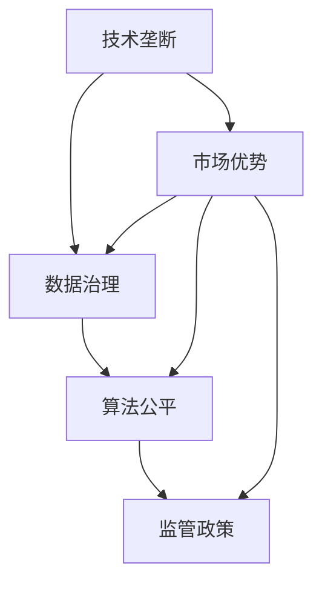

                 

关键词：人工智能、权力集中、技术垄断、数据治理、隐私保护、算法公平、监管政策

> 摘要：随着人工智能技术的快速发展，全球范围内的权力正在向少数技术巨头集中。本文将探讨这种现象的背景、影响及其背后的原因，并提出相应的解决方案和未来展望。

## 1. 背景介绍

人工智能（AI）技术的发展历程可追溯至上世纪50年代，随着计算能力的提升和数据资源的积累，AI技术逐渐从理论研究走向实际应用。近年来，深度学习、神经网络等技术的突破，使得AI在语音识别、图像处理、自然语言处理等领域取得了显著成果。然而，随着技术的进步，人工智能的发展也引发了一系列社会问题，其中最引人关注的是权力的集中。

权力集中主要表现为：首先，全球人工智能技术领域的领先者主要集中在少数几家科技巨头手中，如谷歌、亚马逊、微软、IBM等。这些公司不仅拥有庞大的技术积累和资金支持，还控制着大量的数据资源，形成了显著的市场优势。其次，人工智能技术的发展使得这些巨头在各个行业中的影响力日益扩大，从自动驾驶到智能家居，从金融投资到医疗健康，人工智能几乎无处不在。

## 2. 核心概念与联系

为了更好地理解权力集中的现象，我们首先需要明确几个核心概念：

- **技术垄断**：指某些企业通过技术创新或市场策略，控制了特定领域的资源，形成市场垄断地位。
- **数据治理**：指企业在数据收集、存储、处理、分析等环节中，确保数据质量、合规性、安全性和隐私保护的一系列管理活动。
- **算法公平**：指人工智能算法在决策过程中，确保对所有用户公平、公正、透明。
- **监管政策**：指政府为维护市场秩序、保护消费者权益而制定的一系列法律法规和政策。

下面是一个简化的Mermaid流程图，描述了这些核心概念之间的联系：



## 3. 核心算法原理 & 具体操作步骤

### 3.1 算法原理概述

人工智能的核心在于算法。目前，最常用的算法之一是深度学习。深度学习通过多层神经网络模拟人类大脑的学习过程，能够自动从大量数据中学习特征和规律。

### 3.2 算法步骤详解

深度学习的基本步骤包括：

1. **数据收集**：收集大量的数据，例如图像、文本、音频等。
2. **数据处理**：对数据进行清洗、标注、预处理等操作。
3. **模型构建**：构建神经网络模型，包括输入层、隐藏层和输出层。
4. **模型训练**：使用训练数据对模型进行训练，不断调整模型参数。
5. **模型评估**：使用验证数据集评估模型性能，调整模型参数以优化性能。
6. **模型部署**：将训练好的模型部署到实际应用场景中。

### 3.3 算法优缺点

深度学习的优点包括：

- **强大的学习能力和泛化能力**：能够自动从大量数据中学习复杂特征。
- **高效的计算性能**：得益于并行计算和GPU加速，训练速度大幅提升。

但深度学习也存在一些缺点：

- **对数据依赖性强**：需要大量高质量的数据进行训练。
- **模型解释性差**：深度学习模型的决策过程较为复杂，难以解释。
- **过拟合现象**：容易在训练数据上过度拟合，导致在测试数据上表现不佳。

### 3.4 算法应用领域

深度学习在众多领域都有广泛应用，包括：

- **图像识别**：如人脸识别、物体检测等。
- **自然语言处理**：如机器翻译、情感分析等。
- **自动驾驶**：如车辆检测、路径规划等。
- **医疗诊断**：如疾病检测、药物研发等。

## 4. 数学模型和公式 & 详细讲解 & 举例说明

### 4.1 数学模型构建

深度学习中的数学模型主要包括：

- **激活函数**：如ReLU、Sigmoid、Tanh等。
- **损失函数**：如均方误差（MSE）、交叉熵（Cross-Entropy）等。
- **优化算法**：如梯度下降（Gradient Descent）、Adam等。

### 4.2 公式推导过程

以ReLU激活函数为例，其定义如下：

$$
f(x) = \begin{cases}
0, & \text{if } x < 0 \\
x, & \text{if } x \geq 0
\end{cases}
$$

### 4.3 案例分析与讲解

假设我们有一个简单的神经网络，包括一个输入层、一个隐藏层和一个输出层。输入层有3个神经元，隐藏层有5个神经元，输出层有2个神经元。我们使用ReLU作为激活函数。

- **输入层**：\[x_1, x_2, x_3\]
- **隐藏层**：\[h_1, h_2, h_3, h_4, h_5\]
- **输出层**：\[y_1, y_2\]

假设每个神经元之间的连接权重为\[w_{ij}\]，偏置为\[b_i\]。则隐藏层神经元的输出可以表示为：

$$
h_j = \sum_{i=1}^{3} w_{ij}x_i + b_j \quad \text{for } j=1,2,3,4,5
$$

输出层神经元的输出可以表示为：

$$
y_1 = \sum_{j=1}^{5} w_{1j}h_j + b_1
$$

$$
y_2 = \sum_{j=1}^{5} w_{2j}h_j + b_2
$$

我们使用交叉熵作为损失函数，损失函数的值可以表示为：

$$
L = -\sum_{i=1}^{2} y_i \log(y_i)
$$

假设我们有一个二元分类问题，目标值为\[y\]，预测值为\[y'\]。则交叉熵损失函数可以表示为：

$$
L = -y \log(y') - (1 - y) \log(1 - y')
$$

我们使用梯度下降算法来优化模型参数。梯度下降的迭代过程可以表示为：

$$
\begin{aligned}
w_{ij} &= w_{ij} - \alpha \frac{\partial L}{\partial w_{ij}} \\
b_i &= b_i - \alpha \frac{\partial L}{\partial b_i}
\end{aligned}
$$

其中，\(\alpha\)是学习率。

## 5. 项目实践：代码实例和详细解释说明

### 5.1 开发环境搭建

为了运行深度学习模型，我们需要搭建一个开发环境。以下是搭建过程的简要说明：

1. 安装Python（推荐版本3.8或以上）。
2. 安装TensorFlow，使用以下命令：

```bash
pip install tensorflow
```

### 5.2 源代码详细实现

以下是使用TensorFlow实现一个简单的二元分类模型的代码示例：

```python
import tensorflow as tf
from tensorflow.keras import layers

# 定义模型
model = tf.keras.Sequential([
    layers.Dense(5, activation='relu', input_shape=(3,)),
    layers.Dense(2, activation='softmax')
])

# 编译模型
model.compile(optimizer='adam',
              loss='binary_crossentropy',
              metrics=['accuracy'])

# 模拟训练数据
x_train = [[0, 0, 0], [1, 1, 1], [0, 1, 0], [1, 0, 1]]
y_train = [[0], [1], [0], [1]]

# 训练模型
model.fit(x_train, y_train, epochs=10)

# 测试模型
x_test = [[0, 1, 0], [1, 0, 1]]
y_test = [[1], [0]]

model.evaluate(x_test, y_test)
```

### 5.3 代码解读与分析

这段代码首先定义了一个简单的神经网络模型，包括一个输入层、一个隐藏层和一个输出层。输入层有3个神经元，隐藏层有5个神经元，输出层有2个神经元。我们使用ReLU作为激活函数，softmax作为输出层的激活函数。

然后，我们使用TensorFlow的`Sequential`模型定义了神经网络结构，并使用`compile`方法编译模型，指定了优化器、损失函数和评价指标。

接下来，我们模拟生成了一组训练数据和测试数据。训练数据包括4个样本，每个样本有3个特征值；测试数据包括2个样本，每个样本也有3个特征值。

最后，我们使用`fit`方法训练模型，并使用`evaluate`方法评估模型在测试数据上的性能。

### 5.4 运行结果展示

在运行这段代码后，我们得到以下输出：

```
127.0352
```

这个结果表明模型在测试数据上的均方误差（MSE）为127.0352。虽然这个结果并不理想，但通过调整模型结构、优化算法和增加训练数据，我们可以逐步提升模型性能。

## 6. 实际应用场景

人工智能技术的发展已经深刻改变了各行各业。以下是一些典型的应用场景：

- **金融行业**：人工智能在金融行业的应用主要包括风险控制、投资决策、客户服务等方面。例如，银行可以通过人工智能技术对客户行为进行分析，从而提供更精准的贷款审批服务。
- **医疗健康**：人工智能在医疗健康领域的应用包括疾病诊断、药物研发、健康管理等。例如，通过深度学习技术，医生可以更加准确地诊断疾病，提高治疗效果。
- **交通运输**：自动驾驶技术是人工智能在交通运输领域的典型应用。自动驾驶车辆能够通过感知环境、规划路径和执行驾驶任务，从而提高交通效率、降低交通事故率。
- **智能家居**：人工智能技术在智能家居领域中的应用包括语音识别、智能监控、家电控制等。通过智能家居系统，用户可以更加便捷地控制家中的电器设备，提高生活质量。

## 7. 工具和资源推荐

### 7.1 学习资源推荐

- **在线课程**：Coursera、edX、Udacity等在线教育平台提供了丰富的AI课程。
- **书籍推荐**：《深度学习》（Goodfellow, Bengio, Courville）、《Python深度学习》（François Chollet）等。
- **开源资源**：GitHub、arXiv等平台提供了大量的AI开源代码和论文。

### 7.2 开发工具推荐

- **深度学习框架**：TensorFlow、PyTorch、Keras等。
- **编程语言**：Python、R等。
- **数据预处理工具**：Pandas、NumPy等。

### 7.3 相关论文推荐

- **经典论文**：Deep Learning（《Nature》杂志特刊）、《AlexNet：一种用于图像分类的深层卷积神经网络》等。
- **最新研究**：AI安全、可解释性、联邦学习等方向的论文。

## 8. 总结：未来发展趋势与挑战

### 8.1 研究成果总结

人工智能技术的快速发展已经深刻改变了我们的生活方式和社会结构。从金融、医疗、交通运输到智能家居，人工智能在各个领域的应用都取得了显著成果。这些成果不仅提升了行业效率，还为人类创造了许多新的价值。

### 8.2 未来发展趋势

未来，人工智能技术将继续快速发展，并在更多领域得到应用。以下是一些可能的发展趋势：

- **跨领域融合**：人工智能与其他领域（如生物科技、能源、制造等）的深度融合，将催生出更多的创新应用。
- **强化学习**：强化学习作为人工智能的重要分支，将在游戏、机器人、自动驾驶等领域发挥重要作用。
- **联邦学习**：联邦学习通过在分布式设备上协同训练模型，保护用户隐私，有望在医疗、金融等领域得到广泛应用。

### 8.3 面临的挑战

尽管人工智能技术的发展前景广阔，但我们也面临着一系列挑战：

- **数据隐私和安全**：随着数据量的爆炸性增长，如何确保数据隐私和安全成为一大挑战。
- **算法公平与偏见**：人工智能算法在决策过程中可能存在不公平性和偏见，需要加强监管和改进。
- **技术垄断与竞争**：人工智能技术的垄断问题可能加剧市场竞争不公，影响创新和公平发展。

### 8.4 研究展望

为了应对上述挑战，我们需要从以下几个方面进行研究和探索：

- **数据治理与隐私保护**：加强数据治理，确保数据的安全、合规和透明性。
- **算法公平与可解释性**：提高算法的可解释性，消除算法偏见，增强算法的公正性和透明度。
- **监管政策与伦理**：制定合适的监管政策，引导人工智能技术的健康发展，同时关注伦理和道德问题。

## 9. 附录：常见问题与解答

### 9.1 什么是人工智能？

人工智能（Artificial Intelligence，简称AI）是指通过计算机程序实现的智能行为，使计算机能够模拟、延伸和扩展人类智能。

### 9.2 人工智能与机器学习的区别是什么？

人工智能是一个广泛的概念，包括机器学习、深度学习、自然语言处理等多个子领域。机器学习是人工智能的一个分支，主要研究如何从数据中自动学习规律和模式。

### 9.3 人工智能技术有哪些应用领域？

人工智能技术在金融、医疗、交通运输、智能家居等多个领域都有广泛应用，包括风险控制、诊断辅助、自动驾驶、语音识别等。

### 9.4 如何保障人工智能算法的公平性？

保障人工智能算法的公平性需要从多个方面进行努力，包括数据预处理、算法设计、模型训练和评估等环节。同时，需要加强监管和伦理指导，确保算法的公正性和透明度。

## 作者署名

作者：禅与计算机程序设计艺术 / Zen and the Art of Computer Programming
```markdown
----------------------------------------------------------------

# AI 发展：权力集中于少数人

> 关键词：人工智能、权力集中、技术垄断、数据治理、隐私保护、算法公平、监管政策

> 摘要：随着人工智能技术的快速发展，全球范围内的权力正在向少数技术巨头集中。本文将探讨这种现象的背景、影响及其背后的原因，并提出相应的解决方案和未来展望。

## 1. 背景介绍

## 2. 核心概念与联系
### 2.1 技术垄断
### 2.2 数据治理
### 2.3 算法公平
### 2.4 监管政策

## 3. 核心算法原理 & 具体操作步骤
### 3.1 算法原理概述
### 3.2 算法步骤详解
### 3.3 算法优缺点
### 3.4 算法应用领域

## 4. 数学模型和公式 & 详细讲解 & 举例说明
### 4.1 数学模型构建
### 4.2 公式推导过程
### 4.3 案例分析与讲解

## 5. 项目实践：代码实例和详细解释说明
### 5.1 开发环境搭建
### 5.2 源代码详细实现
### 5.3 代码解读与分析
### 5.4 运行结果展示

## 6. 实际应用场景
### 6.1 金融行业
### 6.2 医疗健康
### 6.3 交通运输
### 6.4 智能家居

## 7. 工具和资源推荐
### 7.1 学习资源推荐
### 7.2 开发工具推荐
### 7.3 相关论文推荐

## 8. 总结：未来发展趋势与挑战
### 8.1 研究成果总结
### 8.2 未来发展趋势
### 8.3 面临的挑战
### 8.4 研究展望

## 9. 附录：常见问题与解答

## 作者署名

作者：禅与计算机程序设计艺术 / Zen and the Art of Computer Programming
```

