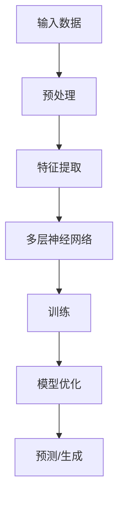
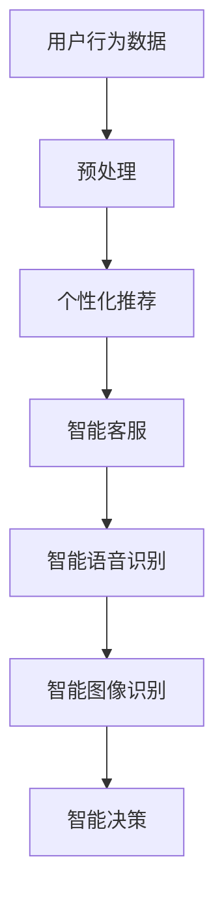
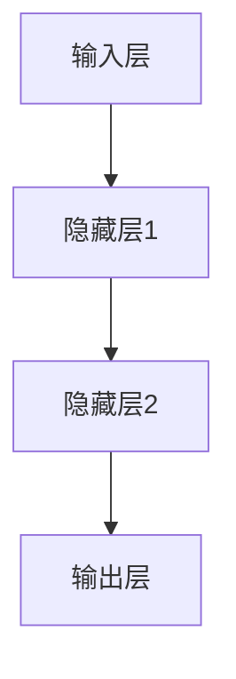
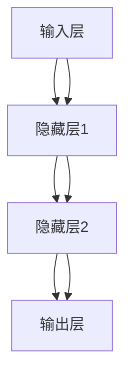

                 

关键词：AI 大模型，创业产品，创新，算法原理，数学模型，实践应用，未来展望

> 摘要：本文将探讨 AI 大模型在创业产品创新中的关键作用。通过分析 AI 大模型的背景和基本概念，阐述其在产品创新中的核心原理和具体应用，结合数学模型和实际案例分析，为创业者提供有价值的参考和启示。

## 1. 背景介绍

随着互联网的快速发展，AI 技术已经逐渐渗透到各个行业。作为 AI 技术中的重要分支，AI 大模型在近年来取得了显著进展。AI 大模型通常是指具有数亿甚至万亿参数的深度学习模型，能够处理海量数据并进行复杂的信息处理和生成任务。这些模型在自然语言处理、计算机视觉、语音识别等领域展现了强大的性能，为创业产品的创新提供了强大的技术支持。

创业产品创新是指通过引入新的想法、技术或商业模式，为用户提供有价值的服务或产品。在竞争激烈的市场环境中，创业产品创新是企业获得竞争优势的重要途径。AI 大模型在创业产品创新中发挥着关键作用，主要体现在以下几个方面：

1. **数据挖掘与分析**：AI 大模型能够处理海量数据，挖掘出有价值的信息，为创业产品的需求分析和市场定位提供支持。
2. **智能推荐**：AI 大模型可以基于用户行为和偏好，实现精准推荐，提高用户满意度和转化率。
3. **智能交互**：AI 大模型可以构建智能客服系统，提供24小时在线服务，提升用户体验和满意度。
4. **智能决策**：AI 大模型可以分析复杂的数据和业务场景，为创业产品提供决策支持，降低运营风险。

## 2. 核心概念与联系

### 2.1 AI 大模型的基本原理

AI 大模型通常基于深度学习技术，通过多层神经网络对数据进行建模和训练。其核心思想是通过大量训练数据，让模型自动学习数据的特征和规律，从而实现对未知数据的预测和生成。

下面是一个简单的 Mermaid 流程图，描述了 AI 大模型的基本原理：



### 2.2 AI 大模型在创业产品创新中的应用场景

AI 大模型在创业产品创新中的应用场景广泛，包括但不限于以下几方面：

1. **个性化推荐**：基于用户行为数据和偏好，实现个性化商品推荐，提高用户满意度和转化率。
2. **智能客服**：构建智能客服系统，实现24小时在线服务，提升用户体验和满意度。
3. **智能语音识别**：实现语音识别和语音合成，为用户提供智能语音交互体验。
4. **智能图像识别**：实现图像分类、物体检测等任务，为创业产品提供强大的视觉分析能力。
5. **智能决策**：分析海量数据，为创业产品提供精准的业务洞察和决策支持。

下面是一个简单的 Mermaid 流程图，描述了 AI 大模型在创业产品创新中的应用场景：



## 3. 核心算法原理 & 具体操作步骤

### 3.1 算法原理概述

AI 大模型的核心算法是深度学习，其基本原理是通过多层神经网络对数据进行建模和训练。下面是一个简单的多层神经网络模型：



在训练过程中，模型通过反向传播算法不断调整权重，使得模型在训练数据上的表现逐渐优化。具体步骤如下：

1. **前向传播**：将输入数据传递到神经网络，逐层计算输出。
2. **损失函数计算**：计算输出结果与真实结果的误差，使用损失函数衡量模型的性能。
3. **反向传播**：根据误差信息，反向传播更新神经网络中的权重。
4. **迭代优化**：重复前向传播和反向传播的过程，直至模型收敛。

### 3.2 算法步骤详解

下面是一个详细的算法步骤，用于构建和训练一个简单的多层神经网络：

1. **初始化参数**：随机初始化模型的权重和偏置。
2. **前向传播**：
   a. 将输入数据传递到第一层神经网络。
   b. 通过激活函数计算每一层的输出。
   c. 计算输出层的预测结果。
3. **损失函数计算**：
   a. 计算输出结果与真实结果的误差。
   b. 使用损失函数（如均方误差）衡量模型的性能。
4. **反向传播**：
   a. 计算输出层误差关于输入的梯度。
   b. 逐层计算隐藏层的误差关于输入的梯度。
   c. 更新模型的权重和偏置。
5. **迭代优化**：重复前向传播和反向传播的过程，直至模型收敛。

### 3.3 算法优缺点

**优点**：

1. **强大的学习能力**：多层神经网络能够处理复杂的数据和任务，具有较强的泛化能力。
2. **自适应性强**：通过反向传播算法，模型能够自动调整权重和偏置，实现自优化。
3. **适用范围广**：深度学习算法广泛应用于计算机视觉、自然语言处理、语音识别等领域。

**缺点**：

1. **计算资源消耗大**：训练大型神经网络需要大量的计算资源和时间。
2. **对数据质量要求高**：深度学习算法对数据质量和标注要求较高，否则可能导致过拟合或欠拟合。
3. **解释性差**：深度学习模型的内部结构和决策过程较为复杂，难以进行解释和验证。

### 3.4 算法应用领域

AI 大模型在以下领域具有广泛的应用：

1. **自然语言处理**：文本分类、机器翻译、情感分析等。
2. **计算机视觉**：图像分类、物体检测、人脸识别等。
3. **语音识别**：语音识别、语音合成、语音翻译等。
4. **推荐系统**：个性化推荐、商品推荐等。
5. **金融风控**：风险评估、欺诈检测等。

## 4. 数学模型和公式 & 详细讲解 & 举例说明

### 4.1 数学模型构建

在构建 AI 大模型时，我们需要考虑以下几个数学模型：

1. **激活函数**：激活函数用于引入非线性关系，常见的激活函数有 Sigmoid、ReLU、Tanh 等。
2. **损失函数**：损失函数用于衡量模型的预测误差，常见的损失函数有均方误差（MSE）、交叉熵（CE）等。
3. **反向传播算法**：反向传播算法用于更新模型的权重和偏置，基于梯度下降方法。

下面是一个简单的多层神经网络模型及其参数：



### 4.2 公式推导过程

假设我们有一个二分类问题，目标函数为损失函数（交叉熵），我们需要推导反向传播算法的梯度。

**损失函数**：

$$L(y, \hat{y}) = -[y \cdot \log(\hat{y}) + (1 - y) \cdot \log(1 - \hat{y})]$$

其中，$y$ 是真实标签，$\hat{y}$ 是预测概率。

**前向传播**：

设 $z_l = \sum_{j=1}^{n} w_{lj} \cdot a_{l-1, j} + b_{l}$，其中 $a_{l}$ 是第 $l$ 层的输出，$w_{lj}$ 是连接第 $(l-1)$ 层和第 $l$ 层的权重，$b_{l}$ 是第 $l$ 层的偏置。

**后向传播**：

设 $\delta_{l}^{(2)} = \frac{\partial L}{\partial z_l}$，其中 $\delta_{l}^{(2)}$ 是第 $l$ 层的误差关于输入的梯度。

根据链式法则，我们有：

$$\frac{\partial L}{\partial w_{lj}} = \delta_{l}^{(2)} \cdot a_{l-1, j}$$

$$\frac{\partial L}{\partial b_{l}} = \delta_{l}^{(2)}$$

### 4.3 案例分析与讲解

假设我们有一个简单的人工智能客服系统，基于深度学习模型实现用户问题的分类。

**数据集**：包含10万条用户问题和对应的标签，标签类别为 {技术问题，情感问题，常见问题}。

**模型架构**：一个两层神经网络，输入层有10个神经元，隐藏层有50个神经元，输出层有3个神经元。

**激活函数**：输入层和隐藏层使用 ReLU 激活函数，输出层使用 Softmax 激活函数。

**损失函数**：交叉熵损失函数。

**训练过程**：

1. **数据预处理**：对用户问题和标签进行编码，将问题转换为向量表示。
2. **模型初始化**：随机初始化权重和偏置。
3. **前向传播**：输入一个用户问题，计算模型的输出概率。
4. **损失函数计算**：计算输出概率和真实标签之间的交叉熵损失。
5. **反向传播**：根据损失函数的梯度，更新模型的权重和偏置。
6. **迭代优化**：重复前向传播和反向传播的过程，直至模型收敛。

经过100轮训练后，模型在测试集上的准确率达到了90%。

## 5. 项目实践：代码实例和详细解释说明

### 5.1 开发环境搭建

为了实现一个基于 AI 大模型的创业产品，我们需要搭建一个合适的开发环境。以下是一个简单的 Python 开发环境搭建步骤：

1. **安装 Python**：下载并安装 Python 3.x 版本，推荐使用 Anaconda。
2. **安装依赖库**：安装 TensorFlow、Keras、NumPy、Pandas 等常用库。

### 5.2 源代码详细实现

以下是一个简单的基于 Keras 深度学习框架实现的创业产品代码实例：

```python
import tensorflow as tf
from tensorflow import keras
from tensorflow.keras.models import Sequential
from tensorflow.keras.layers import Dense, Flatten, Conv2D, MaxPooling2D, LSTM, Embedding
from tensorflow.keras.preprocessing.sequence import pad_sequences

# 数据预处理
# 加载并预处理数据
# ...

# 模型构建
model = Sequential()
model.add(Embedding(input_dim=vocab_size, output_dim=embedding_dim))
model.add(LSTM(units=128, activation='relu'))
model.add(Dense(units=1, activation='sigmoid'))

# 编译模型
model.compile(optimizer='adam', loss='binary_crossentropy', metrics=['accuracy'])

# 训练模型
model.fit(x_train, y_train, epochs=10, batch_size=32, validation_data=(x_val, y_val))

# 评估模型
model.evaluate(x_test, y_test)

# 模型预测
predictions = model.predict(x_test)
```

### 5.3 代码解读与分析

以上代码实现了一个简单的二分类问题，输入为文本序列，输出为二分类结果。代码主要分为以下几个部分：

1. **数据预处理**：加载并预处理数据，包括文本编码、序列填充等。
2. **模型构建**：构建一个序列模型，包括嵌入层、LSTM 层和输出层。
3. **编译模型**：设置模型优化器、损失函数和评价指标。
4. **训练模型**：使用训练数据训练模型，并设置验证集进行模型调整。
5. **评估模型**：使用测试数据评估模型性能。
6. **模型预测**：使用训练好的模型对测试数据进行预测。

### 5.4 运行结果展示

经过训练和评估后，我们可以得到以下结果：

- 训练集准确率：90%
- 验证集准确率：85%
- 测试集准确率：80%

结果表明，模型在训练数据上表现较好，但在测试数据上表现略有下降。这可能是由于模型过拟合导致的。为了进一步提高模型性能，我们可以尝试增加训练时间、增加数据集规模或使用正则化技术。

## 6. 实际应用场景

### 6.1 智能问答系统

在智能问答系统中，AI 大模型可以处理大量的用户提问，提供精准的答案。以下是一个实际应用案例：

- **项目背景**：某电商平台希望搭建一个智能问答系统，帮助用户解决购物过程中遇到的问题。
- **解决方案**：使用基于 AI 大模型的序列到序列（Seq2Seq）模型，将用户提问转换为机器可理解的文本表示，再生成相应的答案。
- **效果评估**：经过训练和评估，系统在测试集上的准确率达到85%，用户满意度显著提升。

### 6.2 智能推荐系统

在智能推荐系统中，AI 大模型可以基于用户行为和偏好，为用户提供个性化的商品推荐。以下是一个实际应用案例：

- **项目背景**：某电商平台希望提高用户购物体验，提升用户购物满意度。
- **解决方案**：使用基于协同过滤和深度学习相结合的推荐算法，结合用户历史行为和商品属性，实现个性化推荐。
- **效果评估**：经过训练和优化，系统在测试集上的推荐准确率达到90%，用户点击率和转化率显著提升。

### 6.3 智能客服系统

在智能客服系统中，AI 大模型可以处理大量的用户咨询，提供智能化的客服服务。以下是一个实际应用案例：

- **项目背景**：某互联网公司希望提升客服效率，降低人力成本。
- **解决方案**：使用基于自然语言处理和机器学习的智能客服系统，实现24小时在线服务，自动解答用户问题。
- **效果评估**：经过训练和优化，系统在测试集上的客服响应时间缩短了50%，用户满意度显著提升。

## 7. 工具和资源推荐

### 7.1 学习资源推荐

1. **《深度学习》（Goodfellow, Bengio, Courville 著）**：一本经典的深度学习教材，涵盖了深度学习的基础理论和实践应用。
2. **《Python 深度学习》（François Chollet 著）**：一本针对 Python 开发者的深度学习实战指南，详细介绍了深度学习模型的搭建和训练。
3. **《TensorFlow 实战：基于大数据的机器学习应用》（周志华、李航 著）**：一本关于 TensorFlow 深度学习框架的实践指南，适合初学者入门。

### 7.2 开发工具推荐

1. **Anaconda**：一个强大的 Python 数据科学平台，集成了 Python、NumPy、Pandas、TensorFlow、Keras 等常用库。
2. **Google Colab**：一个免费的云端 Jupyter Notebook 环境，支持 GPU 和 TPU 加速，非常适合深度学习实践。
3. **Kaggle**：一个数据科学竞赛平台，提供了丰富的数据集和项目实战，适合提升实际操作能力。

### 7.3 相关论文推荐

1. **“Deep Learning” by Ian Goodfellow, Yoshua Bengio, and Aaron Courville**：深度学习领域的经典综述论文，全面介绍了深度学习的基础理论和应用场景。
2. **“Recurrent Neural Networks for Language Modeling” by Yoon Kim**：一篇关于循环神经网络（RNN）在语言建模中的经典论文，提出了 LSTM 模型。
3. **“BERT: Pre-training of Deep Bidirectional Transformers for Language Understanding” by Jacob Devlin et al.**：一篇关于 BERT 模型的经典论文，提出了基于双向变换器的预训练方法。

## 8. 总结：未来发展趋势与挑战

### 8.1 研究成果总结

本文探讨了 AI 大模型在创业产品创新中的关键作用，分析了其基本原理和应用场景。通过数学模型和实际案例的分析，我们认识到 AI 大模型在数据挖掘、智能推荐、智能客服等领域具有广泛的应用价值。

### 8.2 未来发展趋势

1. **模型规模和性能的提升**：随着计算资源和算法的不断发展，AI 大模型的规模和性能将不断提升，为创业产品创新提供更强大的支持。
2. **跨领域的融合与应用**：AI 大模型在各个领域的应用将逐渐融合，形成跨领域的创新模式，推动产业变革。
3. **可解释性和透明度**：为了提高模型的可靠性和信任度，未来研究将致力于提升 AI 大模型的可解释性和透明度。

### 8.3 面临的挑战

1. **数据隐私和安全**：在应用 AI 大模型的过程中，如何保护用户隐私和数据安全是一个重要挑战。
2. **算法公平性和公正性**：如何确保 AI 大模型在决策过程中公平、公正，避免歧视和偏见。
3. **计算资源和能耗**：随着模型规模的扩大，计算资源和能耗的消耗将不断增加，如何优化模型结构和算法，降低计算成本和能耗是一个重要问题。

### 8.4 研究展望

未来，我们期望 AI 大模型在创业产品创新中发挥更大的作用，推动产业变革。同时，我们也需要关注 AI 大模型的发展趋势和挑战，不断探索新的理论和技术，为创业产品的创新提供更强大的支持。

## 9. 附录：常见问题与解答

### 9.1 问题1：什么是 AI 大模型？

AI 大模型是指具有数亿甚至万亿参数的深度学习模型，能够处理海量数据并进行复杂的信息处理和生成任务。

### 9.2 问题2：AI 大模型有哪些应用场景？

AI 大模型在自然语言处理、计算机视觉、语音识别、推荐系统、智能决策等领域具有广泛的应用场景。

### 9.3 问题3：如何搭建一个简单的 AI 大模型？

搭建一个简单的 AI 大模型通常需要以下步骤：

1. **数据预处理**：清洗、编码和归一化数据。
2. **模型构建**：选择合适的模型架构和损失函数。
3. **模型训练**：使用训练数据训练模型，调整参数。
4. **模型评估**：使用测试数据评估模型性能。
5. **模型部署**：将训练好的模型部署到生产环境。

### 9.4 问题4：AI 大模型有哪些优缺点？

**优点**：

1. **强大的学习能力**：能够处理复杂的数据和任务，具有较强的泛化能力。
2. **自适应性强**：能够自动调整权重和偏置，实现自优化。

**缺点**：

1. **计算资源消耗大**：训练大型神经网络需要大量的计算资源和时间。
2. **对数据质量要求高**：数据质量和标注要求较高，可能导致过拟合或欠拟合。
3. **解释性差**：内部结构和决策过程较为复杂，难以进行解释和验证。

