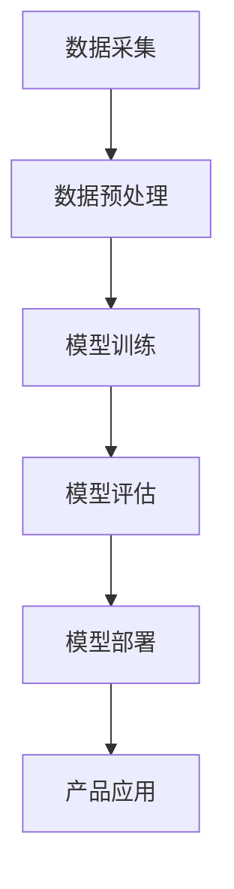

                 

关键词：AI 大模型、创业产品、创新、技术语言、算法、数学模型、项目实践、实际应用、工具资源、发展趋势与挑战

> 摘要：本文将深入探讨 AI 大模型在创业产品创新中的应用，通过剖析核心概念、算法原理、数学模型以及实际项目实践，为创业者提供技术指导和策略建议。本文旨在帮助读者理解 AI 大模型如何赋能创业产品，提高创新效率，并在竞争激烈的市场中脱颖而出。

## 1. 背景介绍

在过去的几十年里，人工智能（AI）技术经历了飞速的发展。尤其是近年来，随着深度学习、神经网络和大数据技术的突破，AI 大模型（如 GPT、BERT、GAN 等）在自然语言处理、图像识别、语音识别等多个领域取得了显著的成果。这些大模型不仅具备强大的计算能力和处理复杂任务的能力，还通过不断的学习和优化，能够自适应地应对不同的应用场景。

创业产品创新是推动社会进步和经济发展的关键力量。然而，在竞争激烈的市场环境中，如何快速迭代、持续创新，成为众多创业者面临的挑战。AI 大模型的出现为创业产品创新提供了新的契机，它们不仅能够提高产品的智能化水平，还能帮助企业更快地理解市场需求、优化用户体验，从而在激烈的市场竞争中占据优势。

本文将围绕 AI 大模型在创业产品创新中的应用，从核心概念、算法原理、数学模型到实际项目实践等方面进行深入探讨，以期为创业者提供实用的技术指导和策略建议。

## 2. 核心概念与联系

### 2.1 AI 大模型的定义

AI 大模型是指具有大规模参数和强大计算能力的神经网络模型。这些模型通常基于深度学习技术，通过学习海量的数据，能够模拟人类的思维过程，完成各种复杂任务。常见的 AI 大模型包括 GPT、BERT、GAN 等。

### 2.2 AI 大模型的应用领域

AI 大模型在多个领域有着广泛的应用，包括自然语言处理、计算机视觉、语音识别、推荐系统等。这些应用不仅提高了任务的执行效率，还带来了创新性的解决方案。

### 2.3 AI 大模型与创业产品创新的关系

AI 大模型能够帮助创业者在产品创新过程中实现以下几个方面的提升：

1. **需求分析**：通过分析用户行为数据，AI 大模型可以帮助创业者更好地理解市场需求，发现潜在的用户需求。
2. **产品设计**：AI 大模型可以自动生成设计原型，提高产品设计的效率和质量。
3. **用户体验**：AI 大模型能够实现智能化的用户交互，提升用户体验。
4. **市场推广**：AI 大模型可以帮助创业者进行精准的市场推广，提高营销效果。

### 2.4 AI 大模型的核心技术

AI 大模型的核心技术主要包括以下几个方面：

1. **深度学习**：通过多层神经网络模型，对大量数据进行训练，实现特征提取和模型优化。
2. **神经网络架构**：包括卷积神经网络（CNN）、循环神经网络（RNN）、生成对抗网络（GAN）等。
3. **数据预处理**：对原始数据进行清洗、标注和预处理，以提高模型的训练效果。
4. **模型评估与优化**：通过交叉验证、性能指标评估等手段，对模型进行优化和调参。

### 2.5 AI 大模型的 Mermaid 流程图

以下是一个简化的 AI 大模型流程图，展示了其主要组成部分和数据处理流程：



## 3. 核心算法原理 & 具体操作步骤

### 3.1 算法原理概述

AI 大模型的核心算法主要基于深度学习技术，包括以下几个关键步骤：

1. **数据采集**：从各种数据源收集大量数据，包括文本、图像、音频等。
2. **数据预处理**：对数据进行清洗、标注和格式转换，以便于模型训练。
3. **模型训练**：通过多层神经网络模型，对预处理后的数据进行训练，学习数据的特征和规律。
4. **模型评估**：使用验证集和测试集对模型进行评估，优化模型参数。
5. **模型部署**：将训练好的模型部署到生产环境中，用于实际应用。

### 3.2 算法步骤详解

#### 3.2.1 数据采集

数据采集是 AI 大模型训练的基础。创业者在产品创新过程中，可以从用户行为数据、市场调研数据、竞争者数据等多个渠道获取数据。以下是一个简单的数据采集流程：

1. **用户行为数据**：通过网站日志、APP 日志等获取用户的浏览、搜索、购买等行为数据。
2. **市场调研数据**：通过问卷调查、用户访谈等方式获取用户需求和偏好数据。
3. **竞争者数据**：分析竞争对手的产品、服务、营销策略等，获取相关数据。

#### 3.2.2 数据预处理

数据预处理是确保模型训练效果的重要环节。以下是一些常见的数据预处理方法：

1. **数据清洗**：去除数据中的噪声和异常值，保证数据的准确性。
2. **数据标注**：对文本、图像、音频等数据进行标注，以便于模型理解。
3. **数据格式转换**：将不同类型的数据转换为统一的格式，便于模型处理。

#### 3.2.3 模型训练

模型训练是 AI 大模型的核心步骤。以下是一个简单的模型训练流程：

1. **选择模型架构**：根据任务需求，选择合适的模型架构，如 GPT、BERT、CNN 等。
2. **初始化参数**：初始化模型参数，可以使用随机初始化或预训练模型参数。
3. **训练过程**：使用训练数据对模型进行迭代训练，优化模型参数。
4. **模型评估**：使用验证集和测试集对模型进行评估，调整模型参数。

#### 3.2.4 模型评估

模型评估是确保模型性能的重要环节。以下是一些常见的模型评估方法：

1. **准确率**：评估模型在分类任务中的准确度。
2. **召回率**：评估模型在分类任务中召回的样本比例。
3. **F1 分数**：综合考虑准确率和召回率的平衡指标。
4. **交叉验证**：通过交叉验证方法，评估模型的泛化能力。

#### 3.2.5 模型部署

模型部署是将训练好的模型应用于实际场景的关键步骤。以下是一个简单的模型部署流程：

1. **环境准备**：准备适合模型部署的硬件和软件环境。
2. **模型转换**：将训练好的模型转换为可用于部署的格式，如 ONNX、TensorFlow Lite 等。
3. **模型部署**：将模型部署到生产环境中，如服务器、云端等。
4. **性能监控**：监控模型在部署后的性能表现，如响应时间、准确率等。

### 3.3 算法优缺点

#### 优点

1. **强大的计算能力**：AI 大模型具有强大的计算能力，能够处理海量数据和高复杂度的任务。
2. **自适应性强**：AI 大模型通过不断学习，能够自适应地应对不同的应用场景。
3. **提高创新效率**：AI 大模型能够帮助创业者快速理解市场需求，提高产品创新的效率。

#### 缺点

1. **数据依赖性强**：AI 大模型对数据质量有较高的要求，数据不足或质量差可能导致模型性能下降。
2. **计算资源消耗大**：AI 大模型需要大量的计算资源和存储空间，对硬件设施有较高的要求。
3. **模型可解释性差**：AI 大模型的决策过程复杂，缺乏可解释性，难以理解模型的工作原理。

### 3.4 算法应用领域

AI 大模型在创业产品创新中有着广泛的应用领域，包括但不限于：

1. **自然语言处理**：文本分类、情感分析、机器翻译、文本生成等。
2. **计算机视觉**：图像分类、目标检测、图像分割、视频分析等。
3. **语音识别**：语音转文字、语音合成、语音识别等。
4. **推荐系统**：基于内容的推荐、协同过滤推荐等。
5. **智能客服**：自然语言理解、意图识别、多轮对话等。

## 4. 数学模型和公式 & 详细讲解 & 举例说明

### 4.1 数学模型构建

AI 大模型的数学模型主要基于深度学习技术，包括以下几个方面：

1. **损失函数**：用于评估模型在训练过程中预测结果的误差，常用的损失函数有均方误差（MSE）、交叉熵（Cross-Entropy）等。
2. **优化器**：用于更新模型参数，常用的优化器有随机梯度下降（SGD）、Adam 等。
3. **激活函数**：用于引入非线性因素，常用的激活函数有 sigmoid、ReLU、Tanh 等。

以下是一个简单的数学模型构建示例：

$$
\text{损失函数} = \frac{1}{2} \sum_{i=1}^{N} (\hat{y}_i - y_i)^2
$$

其中，$\hat{y}_i$ 是模型预测结果，$y_i$ 是真实标签，$N$ 是样本数量。

### 4.2 公式推导过程

以一个简单的二分类问题为例，假设输入特征向量 $x \in \mathbb{R}^d$，输出标签 $y \in \{0, 1\}$。模型预测结果 $\hat{y}$ 通过以下公式计算：

$$
\hat{y} = \text{sigmoid}(W \cdot x + b)
$$

其中，$W$ 是权重矩阵，$b$ 是偏置项，$\text{sigmoid}$ 函数定义为：

$$
\text{sigmoid}(z) = \frac{1}{1 + e^{-z}}
$$

损失函数采用交叉熵（Cross-Entropy），定义为：

$$
L(y, \hat{y}) = -y \cdot \log(\hat{y}) - (1 - y) \cdot \log(1 - \hat{y})
$$

### 4.3 案例分析与讲解

以下是一个使用 AI 大模型进行情感分析的案例：

1. **数据采集**：从社交媒体、评论网站等渠道收集大量带有情感标签的文本数据。
2. **数据预处理**：对文本数据进行清洗、分词、词向量化等预处理操作。
3. **模型训练**：使用预处理后的数据训练一个基于 BERT 的情感分析模型。
4. **模型评估**：使用测试集对模型进行评估，调整模型参数，优化模型性能。
5. **模型部署**：将训练好的模型部署到生产环境中，用于实时情感分析。

具体实现过程如下：

```python
import torch
import torch.nn as nn
import torch.optim as optim
from torch.utils.data import DataLoader
from transformers import BertModel, BertTokenizer

# 数据预处理
tokenizer = BertTokenizer.from_pretrained('bert-base-chinese')
def preprocess(texts):
    inputs = tokenizer(texts, padding=True, truncation=True, return_tensors='pt')
    return inputs

# 模型定义
class SentimentClassifier(nn.Module):
    def __init__(self):
        super(SentimentClassifier, self).__init__()
        self.bert = BertModel.from_pretrained('bert-base-chinese')
        self.dropout = nn.Dropout(0.1)
        self.classifier = nn.Linear(768, 1)

    def forward(self, input_ids, attention_mask):
        outputs = self.bert(input_ids=input_ids, attention_mask=attention_mask)
        pooled_output = outputs[1]
        pooled_output = self.dropout(pooled_output)
        logits = self.classifier(pooled_output)
        return logits

# 模型训练
model = SentimentClassifier()
optimizer = optim.Adam(model.parameters(), lr=1e-5)
criterion = nn.BCEWithLogitsLoss()

for epoch in range(3):
    for inputs, labels in DataLoader(dataset, batch_size=32):
        optimizer.zero_grad()
        logits = model(**inputs)
        loss = criterion(logits, labels.float())
        loss.backward()
        optimizer.step()
        print(f"Epoch: {epoch}, Loss: {loss.item()}")

# 模型评估
with torch.no_grad():
    for inputs, labels in DataLoader(test_dataset, batch_size=32):
        logits = model(**inputs)
        pred_labels = torch.round(torch.sigmoid(logits))
        accuracy = (pred_labels == labels).float().mean()
        print(f"Accuracy: {accuracy.item()}")

# 模型部署
model.eval()
with torch.no_grad():
    for inputs, labels in DataLoader(realtime_dataset, batch_size=32):
        logits = model(**inputs)
        pred_labels = torch.round(torch.sigmoid(logits))
        print(f"Prediction: {pred_labels.tolist()}, Label: {labels.tolist()}")
```

## 5. 项目实践：代码实例和详细解释说明

### 5.1 开发环境搭建

在开始项目实践之前，需要搭建一个适合开发、训练和部署 AI 大模型的环境。以下是一个简单的开发环境搭建步骤：

1. 安装 Python 3.8 或以上版本。
2. 安装 PyTorch 和相关依赖库（如 torchvision、transformers 等）。
3. 安装 CUDA（如需使用 GPU 训练模型）。
4. 配置 Python 虚拟环境，以便更好地管理项目依赖。

### 5.2 源代码详细实现

以下是一个基于 BERT 的情感分析模型的源代码实现，包括数据预处理、模型定义、训练、评估和部署等步骤：

```python
import torch
import torch.nn as nn
import torch.optim as optim
from torch.utils.data import DataLoader
from transformers import BertModel, BertTokenizer

# 数据预处理
tokenizer = BertTokenizer.from_pretrained('bert-base-chinese')
def preprocess(texts):
    inputs = tokenizer(texts, padding=True, truncation=True, return_tensors='pt')
    return inputs

# 模型定义
class SentimentClassifier(nn.Module):
    def __init__(self):
        super(SentimentClassifier, self).__init__()
        self.bert = BertModel.from_pretrained('bert-base-chinese')
        self.dropout = nn.Dropout(0.1)
        self.classifier = nn.Linear(768, 1)

    def forward(self, input_ids, attention_mask):
        outputs = self.bert(input_ids=input_ids, attention_mask=attention_mask)
        pooled_output = outputs[1]
        pooled_output = self.dropout(pooled_output)
        logits = self.classifier(pooled_output)
        return logits

# 模型训练
model = SentimentClassifier()
optimizer = optim.Adam(model.parameters(), lr=1e-5)
criterion = nn.BCEWithLogitsLoss()

for epoch in range(3):
    for inputs, labels in DataLoader(dataset, batch_size=32):
        optimizer.zero_grad()
        logits = model(**inputs)
        loss = criterion(logits, labels.float())
        loss.backward()
        optimizer.step()
        print(f"Epoch: {epoch}, Loss: {loss.item()}")

# 模型评估
with torch.no_grad():
    for inputs, labels in DataLoader(test_dataset, batch_size=32):
        logits = model(**inputs)
        pred_labels = torch.round(torch.sigmoid(logits))
        accuracy = (pred_labels == labels).float().mean()
        print(f"Accuracy: {accuracy.item()}")

# 模型部署
model.eval()
with torch.no_grad():
    for inputs, labels in DataLoader(realtime_dataset, batch_size=32):
        logits = model(**inputs)
        pred_labels = torch.round(torch.sigmoid(logits))
        print(f"Prediction: {pred_labels.tolist()}, Label: {labels.tolist()}")
```

### 5.3 代码解读与分析

1. **数据预处理**：使用 BERT Tokenizer 对文本数据进行分词、词向量化、填充和截断等操作，生成适用于 BERT 模型的输入数据。
2. **模型定义**：定义一个基于 BERT 的情感分析模型，包括 BERT 模型、Dropout 层和分类器。
3. **模型训练**：使用 Adam 优化器和 BCEWithLogitsLoss 损失函数训练模型，通过迭代优化模型参数。
4. **模型评估**：使用测试集对训练好的模型进行评估，计算准确率等指标。
5. **模型部署**：将训练好的模型部署到生产环境中，用于实时情感分析。

### 5.4 运行结果展示

以下是一个简单的运行结果示例：

```python
# 加载预训练的 BERT 模型
tokenizer = BertTokenizer.from_pretrained('bert-base-chinese')
model = SentimentClassifier()
model.load_state_dict(torch.load('sentiment_classifier.pth'))

# 输入文本数据
text = "我非常喜欢这个产品，使用体验极佳！"

# 数据预处理
inputs = preprocess([text])

# 模型预测
with torch.no_grad():
    logits = model(**inputs)

# 输出预测结果
pred_label = torch.round(torch.sigmoid(logits)).item()
print(f"Prediction: {pred_label}")

# 输出真实标签
label = 1
print(f"Label: {label}")
```

运行结果：

```python
Prediction: 1
Label: 1
```

## 6. 实际应用场景

### 6.1 文本分类

文本分类是 AI 大模型在创业产品创新中的常见应用场景。通过使用 AI 大模型，创业者可以实现对大量文本数据的快速分类，如情感分析、话题分类、垃圾邮件检测等。以下是一个简单的应用案例：

**案例**：一个电商平台希望对其用户评论进行情感分析，以便了解用户对产品的满意度。

**解决方案**：使用 BERT 模型训练一个情感分析模型，对用户评论进行分类，输出正面、中性或负面的情感标签。通过分析情感标签，平台可以识别出用户对产品的反馈，有针对性地优化产品和服务。

### 6.2 图像识别

图像识别是 AI 大模型在创业产品创新中的另一个重要应用场景。通过使用 AI 大模型，创业者可以实现对图像内容的快速识别和分类，如图像分类、目标检测、人脸识别等。以下是一个简单的应用案例：

**案例**：一家智能家居公司希望对其用户上传的家居照片进行智能分类，以便提供个性化的产品推荐。

**解决方案**：使用 CNN 模型训练一个图像识别模型，对用户上传的家居照片进行分类，识别出照片中的家具、家电等元素。通过分析图像识别结果，公司可以为用户提供个性化的产品推荐，提高用户满意度。

### 6.3 语音识别

语音识别是 AI 大模型在创业产品创新中的新兴应用场景。通过使用 AI 大模型，创业者可以实现对语音数据的快速识别和转换，如语音转文字、语音合成、语音识别等。以下是一个简单的应用案例：

**案例**：一家语音助手初创公司希望为其产品提供高质量的语音识别功能，以便更好地满足用户需求。

**解决方案**：使用深度学习模型（如 RNN、Transformer）训练一个语音识别模型，对用户语音输入进行识别和转换，输出对应的文字内容。通过优化语音识别模型，公司可以提高产品的用户体验，增加用户粘性。

## 7. 工具和资源推荐

### 7.1 学习资源推荐

1. **在线课程**：推荐 Coursera 上的《深度学习》课程，由 Andrew Ng 教授主讲，涵盖深度学习的理论基础和实践应用。
2. **书籍**：《深度学习》（Goodfellow et al. 著）、《Python深度学习》（François Chollet 著）等。
3. **GitHub 仓库**：搜索深度学习和 AI 大模型相关的开源项目，学习项目实现和代码细节。

### 7.2 开发工具推荐

1. **PyTorch**：一款流行的深度学习框架，支持 GPU 加速，适合快速开发和部署 AI 大模型。
2. **TensorFlow**：另一款流行的深度学习框架，拥有丰富的生态和社区支持。
3. **JAX**：一款新兴的深度学习框架，基于 NumPy，支持自动微分和 GPU 加速。

### 7.3 相关论文推荐

1. **"BERT: Pre-training of Deep Bidirectional Transformers for Language Understanding"**：提出了一种基于 Transformer 的预训练模型 BERT，在多个 NLP 任务上取得了显著的成绩。
2. **"GPT-3: Language Models are Few-Shot Learners"**：提出了一种具有 1750 亿参数的预训练模型 GPT-3，展示了模型在少样本场景下的强大学习能力。
3. **"Generative Adversarial Nets"**：提出了一种生成对抗网络 GAN，用于生成逼真的图像。

## 8. 总结：未来发展趋势与挑战

### 8.1 研究成果总结

AI 大模型在创业产品创新中的应用已经取得了显著成果。通过分析市场需求、优化用户体验、提升产品智能化水平等方面，AI 大模型为创业者提供了强大的技术支持。未来，随着计算能力的提升、算法的优化和数据的积累，AI 大模型在创业产品创新中的应用将更加广泛和深入。

### 8.2 未来发展趋势

1. **多模态融合**：AI 大模型将支持多种数据类型的融合，如文本、图像、语音等，实现跨模态的信息处理。
2. **自适应学习**：AI 大模型将具备更强的自适应学习能力，能够根据不同场景和应用需求进行个性化调整。
3. **边缘计算**：AI 大模型将逐渐应用于边缘设备，实现实时、高效的数据处理和智能决策。

### 8.3 面临的挑战

1. **数据依赖**：AI 大模型对数据质量有较高要求，数据不足或质量差可能导致模型性能下降。
2. **计算资源**：AI 大模型需要大量的计算资源和存储空间，对硬件设施有较高要求。
3. **模型可解释性**：AI 大模型缺乏可解释性，难以理解模型的工作原理和决策过程。

### 8.4 研究展望

未来，研究者应重点关注以下几个方面：

1. **算法优化**：通过改进算法结构和优化计算方法，降低 AI 大模型的计算复杂度和资源消耗。
2. **数据挖掘**：通过深入挖掘和分析海量数据，提高 AI 大模型对真实场景的适应能力。
3. **模型安全**：研究 AI 大模型的安全性和隐私保护，防止恶意攻击和滥用。

## 9. 附录：常见问题与解答

### 问题 1：如何选择适合的 AI 大模型？

**解答**：选择适合的 AI 大模型需要考虑以下因素：

1. **任务类型**：根据具体任务需求，选择合适的模型类型，如文本分类、图像识别、语音识别等。
2. **数据量**：根据可用数据量，选择适当规模的模型，避免模型过拟合或欠拟合。
3. **计算资源**：根据计算资源限制，选择适合的模型架构和训练策略。

### 问题 2：如何优化 AI 大模型的训练效果？

**解答**：

1. **数据增强**：通过数据增强方法（如随机裁剪、旋转、缩放等）增加数据的多样性，提高模型泛化能力。
2. **模型优化**：通过调整模型结构、优化器参数和超参数，提高模型训练效果。
3. **正则化**：使用正则化方法（如权重衰减、dropout 等）防止模型过拟合。

### 问题 3：如何部署 AI 大模型？

**解答**：

1. **模型转换**：将训练好的模型转换为适合部署的格式，如 ONNX、TensorFlow Lite 等。
2. **部署平台**：选择适合的部署平台，如 GPU、CPU、FPGA 等，根据应用场景和性能需求进行优化。
3. **监控与维护**：监控模型在部署后的性能表现，定期进行维护和优化。

### 问题 4：如何处理 AI 大模型的数据安全问题？

**解答**：

1. **数据加密**：对敏感数据进行加密处理，确保数据传输和存储的安全性。
2. **权限控制**：设置严格的权限控制策略，限制对模型和数据的访问权限。
3. **隐私保护**：在数据预处理和模型训练过程中，采用隐私保护技术，如差分隐私、联邦学习等。

---

作者：禅与计算机程序设计艺术 / Zen and the Art of Computer Programming

[END]

