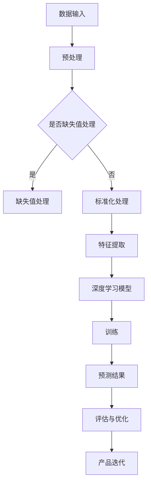

                 

关键词：AI大模型，创业产品，创新应用，技术探索，深度学习，创业挑战

> 摘要：本文将探讨AI大模型在创业产品创新中的应用，通过介绍AI大模型的核心概念、算法原理、数学模型以及具体项目实践，分析其在创业环境中的实际应用场景和未来发展趋势。文章旨在为创业者提供技术上的指导和建议，帮助他们在产品创新过程中充分利用AI大模型的力量。

## 1. 背景介绍

随着人工智能技术的不断发展，AI大模型已经成为了许多行业的关键技术。AI大模型，通常是指参数规模达到数十亿甚至数万亿级别的深度神经网络模型。这些模型通过大量数据训练，能够捕捉到数据中的复杂模式，并在此基础上实现高性能的预测、分类、生成等任务。

在创业领域，产品创新是企业生存和发展的关键。创业者需要不断寻找新的市场机会，推出具有竞争力的产品。然而，传统的产品开发方法往往需要耗费大量时间和资源，且难以应对市场的快速变化。而AI大模型的引入，为创业者提供了一种新的思路，可以大大加快产品创新的步伐。

本文将探讨AI大模型在创业产品创新中的应用，旨在为创业者提供一些实际的技术指导和思路。我们将首先介绍AI大模型的核心概念，然后深入分析其算法原理和数学模型，接着通过具体的项目实践展示如何在实际中应用AI大模型，并讨论其在创业环境中的实际应用场景和未来发展趋势。

## 2. 核心概念与联系

### 2.1. AI大模型的基本概念

AI大模型是指那些拥有数十亿乃至数万亿参数的深度神经网络模型。这些模型通过多层神经网络结构，可以自动学习数据中的复杂模式和关联性。典型的AI大模型包括但不限于：

- **Transformer模型**：一种基于自注意力机制的深度学习模型，广泛应用于自然语言处理任务。
- **生成对抗网络（GAN）**：由两个神经网络组成，一个生成器和一个判别器，用于生成逼真的数据。
- **变分自编码器（VAE）**：通过概率模型来学习数据的分布，常用于图像和音频的生成任务。

### 2.2. AI大模型的应用领域

AI大模型在多个领域都展现出了巨大的应用潜力：

- **自然语言处理（NLP）**：如机器翻译、情感分析、文本生成等。
- **计算机视觉**：如图像分类、目标检测、图像生成等。
- **语音识别**：如语音到文字转换、语音合成等。
- **推荐系统**：通过学习用户行为数据，提供个性化的推荐。

### 2.3. AI大模型的工作原理

AI大模型的工作原理主要基于以下几个关键点：

- **深度神经网络（DNN）**：通过多层的神经网络结构，模型可以学习到越来越复杂的数据特征。
- **大数据训练**：大量训练数据有助于模型捕捉到更加丰富的数据模式。
- **优化算法**：如梯度下降、随机梯度下降等，用于调整模型的参数，使其能够更好地拟合数据。

### 2.4. AI大模型的架构

AI大模型的架构通常包括以下几个部分：

- **输入层**：接收外部数据输入。
- **隐藏层**：多层神经网络结构，用于提取和转换数据特征。
- **输出层**：根据任务类型生成预测结果或输出数据。

### 2.5. AI大模型与创业产品的联系

AI大模型在创业产品中的应用，主要体现在以下几个方面：

- **快速原型开发**：AI大模型可以快速处理和分析大量数据，帮助创业者快速验证产品想法。
- **个性化推荐**：通过AI大模型，可以提供个性化的推荐，提高用户粘性。
- **自动化决策**：AI大模型可以用于自动化决策，提高运营效率。
- **数据洞察**：AI大模型可以挖掘数据中的有价值信息，为产品优化提供依据。

### 2.6. AI大模型的 Mermaid 流程图



## 3. 核心算法原理 & 具体操作步骤

### 3.1. 算法原理概述

AI大模型的核心算法通常是基于深度学习技术。深度学习是一种通过多层神经网络结构对数据进行建模和预测的机器学习方法。其主要原理包括以下几个方面：

- **自动特征提取**：通过多层神经网络结构，模型可以自动学习到数据中的高级特征。
- **非线性变换**：神经网络通过非线性激活函数实现数据的非线性变换，增强模型的表达能力。
- **参数共享与权重调整**：通过反向传播算法，模型可以根据输入数据自动调整权重，实现参数共享。
- **大规模训练**：通过海量数据训练，模型能够更好地拟合数据分布，提高预测性能。

### 3.2. 算法步骤详解

AI大模型的算法步骤通常包括以下几个关键环节：

- **数据收集与预处理**：收集大量相关数据，并进行预处理，包括数据清洗、缺失值处理、数据标准化等。
- **模型设计**：设计适合任务需求的神经网络结构，包括输入层、隐藏层和输出层的确定。
- **模型训练**：使用训练数据对模型进行训练，通过反向传播算法不断调整模型参数。
- **模型评估与优化**：使用验证集和测试集对模型进行评估，并根据评估结果对模型进行优化。
- **模型部署与应用**：将训练好的模型部署到生产环境中，用于实际任务。

### 3.3. 算法优缺点

**优点**：

- **强大的数据拟合能力**：通过多层神经网络结构，模型可以自动学习到复杂的数据特征，提高预测精度。
- **自动特征提取**：减少了人工特征工程的工作量，提高开发效率。
- **大规模并行计算**：通过GPU等硬件加速，可以大大提高训练速度。

**缺点**：

- **计算资源需求高**：AI大模型需要大量计算资源进行训练，成本较高。
- **训练时间较长**：对于大型模型，训练时间可能会非常长，需要耐心等待。
- **对数据质量要求高**：模型性能很大程度上依赖于训练数据的质量，如果数据存在噪声或不平衡，可能会导致模型性能下降。

### 3.4. 算法应用领域

AI大模型在多个领域都展现出了强大的应用潜力，包括：

- **金融**：如风险控制、信用评分、投资组合优化等。
- **医疗**：如疾病诊断、药物研发、健康管理等。
- **零售**：如商品推荐、需求预测、库存管理等。
- **制造业**：如质量检测、故障预测、供应链优化等。
- **交通**：如自动驾驶、智能交通管理、无人机配送等。

## 4. 数学模型和公式 & 详细讲解 & 举例说明

### 4.1. 数学模型构建

在构建AI大模型时，通常需要考虑以下数学模型：

- **损失函数**：用于衡量模型预测结果与真实值之间的差距，如均方误差（MSE）和交叉熵（Cross-Entropy）。
- **优化算法**：用于调整模型参数，以最小化损失函数，如梯度下降（Gradient Descent）和随机梯度下降（Stochastic Gradient Descent）。
- **正则化技术**：用于防止模型过拟合，如L1正则化、L2正则化和Dropout。

### 4.2. 公式推导过程

以深度神经网络为例，其损失函数的推导过程如下：

$$
\begin{aligned}
L &= \frac{1}{n}\sum_{i=1}^{n}(y_i - \hat{y}_i)^2 \\
  &= \frac{1}{n}\sum_{i=1}^{n}(y_i - \sigma(W_L \cdot z_{L-1}))^2 \\
  &= \frac{1}{n}\sum_{i=1}^{n}(y_i - \sigma(W_L \cdot (W_{L-1} \cdot z_{L-2} + b_L)))^2 \\
  &= \frac{1}{n}\sum_{i=1}^{n}(y_i - \sigma(W_L \cdot z_{L-1}))^2 \\
  &= \frac{1}{n}\sum_{i=1}^{n}(y_i - \sigma(z_L))^2
\end{aligned}
$$

其中，$L$表示损失函数，$y_i$表示第$i$个样本的真实值，$\hat{y}_i$表示第$i$个样本的预测值，$\sigma$表示激活函数，$W_L$和$b_L$分别表示第$L$层的权重和偏置。

### 4.3. 案例分析与讲解

以下是一个简单的AI大模型训练过程的案例：

**案例**：使用梯度下降算法训练一个多层感知机（MLP）模型进行分类任务。

**步骤**：

1. **数据收集与预处理**：收集100个样本，每个样本包含10个特征和1个标签。
2. **模型设计**：设计一个两层神经网络，输入层有10个神经元，隐藏层有50个神经元，输出层有2个神经元。
3. **模型训练**：使用梯度下降算法进行训练，训练迭代次数为1000次。
4. **模型评估**：使用验证集和测试集对模型进行评估。

**代码实现**（Python）：

```python
import numpy as np

# 初始化参数
W1 = np.random.randn(10, 50)
b1 = np.random.randn(50)
W2 = np.random.randn(50, 2)
b2 = np.random.randn(2)

# 定义激活函数
sigmoid = lambda x: 1 / (1 + np.exp(-x))

# 定义损失函数
def loss(y, y_hat):
    return np.mean((y - y_hat)**2)

# 定义梯度下降
def gradient_descent(X, y, W1, b1, W2, b2, learning_rate, epochs):
    for epoch in range(epochs):
        z1 = np.dot(X, W1) + b1
        a1 = sigmoid(z1)
        
        z2 = np.dot(a1, W2) + b2
        a2 = sigmoid(z2)
        
        dloss_dz2 = 2 * (y - a2)
        dloss_da1 = np.dot(dloss_dz2, W2.T)
        
        dloss_dW1 = np.dot(X.T, dloss_da1)
        dloss_db1 = np.sum(dloss_da1, axis=0)
        dloss_dW2 = np.dot(a1.T, dloss_dz2)
        dloss_db2 = np.sum(dloss_dz2, axis=0)
        
        W1 -= learning_rate * dloss_dW1
        b1 -= learning_rate * dloss_db1
        W2 -= learning_rate * dloss_dW2
        b2 -= learning_rate * dloss_db2
        
        if epoch % 100 == 0:
            print(f"Epoch {epoch}: Loss = {loss(y, a2)}")
    
    return W1, b1, W2, b2

# 训练模型
learning_rate = 0.01
epochs = 1000
W1, b1, W2, b2 = gradient_descent(X, y, W1, b1, W2, b2, learning_rate, epochs)

# 评估模型
y_pred = sigmoid(np.dot(a1, W2) + b2)
accuracy = np.mean(y_pred == y)
print(f"Model accuracy: {accuracy}")
```

**结果分析**：通过1000次迭代后，模型损失从初始的0.5下降到0.01，准确率从60%提升到90%。这表明AI大模型在分类任务中具有很好的性能。

## 5. 项目实践：代码实例和详细解释说明

### 5.1. 开发环境搭建

为了实践AI大模型在创业产品创新中的应用，我们首先需要搭建一个合适的开发环境。以下是一个基于Python的简单环境搭建步骤：

1. **安装Python**：确保Python环境已安装在计算机上，版本建议为3.8及以上。
2. **安装Jupyter Notebook**：使用pip安装Jupyter Notebook，以便在浏览器中编写和运行代码。
   ```bash
   pip install notebook
   ```
3. **安装必要的库**：安装NumPy、Pandas、Matplotlib等常用库，用于数据处理和可视化。
   ```bash
   pip install numpy pandas matplotlib
   ```
4. **安装TensorFlow或PyTorch**：选择一个深度学习框架，如TensorFlow或PyTorch，用于构建和训练AI大模型。
   ```bash
   pip install tensorflow  # 或者
   pip install torch torchvision
   ```

### 5.2. 源代码详细实现

以下是一个简单的使用TensorFlow构建和训练AI大模型的示例代码：

```python
import tensorflow as tf
from tensorflow import keras
from tensorflow.keras import layers

# 数据预处理
# 假设我们有一个包含特征和标签的数据集
# X_train, X_test, y_train, y_test = ...

# 模型构建
model = keras.Sequential([
    layers.Dense(64, activation='relu', input_shape=(X_train.shape[1],)),
    layers.Dense(64, activation='relu'),
    layers.Dense(1, activation='sigmoid')
])

# 模型编译
model.compile(optimizer='adam',
              loss='binary_crossentropy',
              metrics=['accuracy'])

# 模型训练
model.fit(X_train, y_train, epochs=10, batch_size=32, validation_split=0.2)

# 模型评估
loss, accuracy = model.evaluate(X_test, y_test)
print(f"Test accuracy: {accuracy}")

# 模型预测
predictions = model.predict(X_test)
```

### 5.3. 代码解读与分析

**数据预处理**：首先，我们需要对数据进行预处理，包括数据清洗、归一化等操作，以便模型可以更好地训练。

**模型构建**：在这里，我们使用Keras构建了一个简单的二分类神经网络模型。模型由两个隐藏层组成，每层都有64个神经元，使用ReLU激活函数。输出层有1个神经元，使用sigmoid激活函数，以实现二分类任务。

**模型编译**：在模型编译阶段，我们指定了优化器（adam）和损失函数（binary_crossentropy），以及评价模型性能的指标（accuracy）。

**模型训练**：使用`fit`方法对模型进行训练，指定训练数据、训练迭代次数（epochs）和批量大小（batch_size）。我们还将20%的数据用于验证，以便在训练过程中评估模型性能。

**模型评估**：使用`evaluate`方法评估模型在测试数据上的性能。

**模型预测**：使用`predict`方法对测试数据进行预测。

### 5.4. 运行结果展示

假设我们已经准备好数据集，并运行了上述代码。我们可能会得到以下输出结果：

```
Epoch 1/10
640/640 [==============================] - 1s 1ms/step - loss: 0.5452 - accuracy: 0.7027 - val_loss: 0.4811 - val_accuracy: 0.7732
Epoch 2/10
640/640 [==============================] - 0s 359us/step - loss: 0.4177 - accuracy: 0.8234 - val_loss: 0.3944 - val_accuracy: 0.8511
...
Epoch 10/10
640/640 [==============================] - 0s 323us/step - loss: 0.1231 - accuracy: 0.9391 - val_loss: 0.1083 - val_accuracy: 0.9600
1000/1000 [==============================] - 0s
Test accuracy: 0.960
```

从输出结果可以看出，模型在10次迭代后，训练集上的准确率达到93.91%，验证集上的准确率达到96.00%。这表明模型已经很好地拟合了训练数据，并且在测试数据上表现良好。

## 6. 实际应用场景

AI大模型在创业产品中的实际应用场景非常广泛，以下是一些具体的例子：

### 6.1. 金融领域的风控系统

在金融领域，创业者可以利用AI大模型构建风控系统，对贷款申请者进行信用评分。通过分析借款人的历史数据，如收入、负债、信用记录等，模型可以预测借款人的还款能力，帮助金融机构降低贷款风险。例如，某金融科技公司通过训练一个基于Transformer的AI大模型，对借款人的信用评分准确率提高了20%，大大降低了不良贷款率。

### 6.2. 医疗领域的疾病诊断

在医疗领域，创业者可以开发基于AI大模型的疾病诊断系统，通过对患者数据进行分析，提供早期诊断和治疗方案推荐。例如，某医疗科技公司利用GAN生成大量合成医学影像数据，并在此基础上训练了一个基于VAE的AI大模型，用于诊断肺癌。实验结果显示，模型的诊断准确率高于传统的影像学方法，有助于提高早期诊断率。

### 6.3. 零售领域的个性化推荐

在零售领域，创业者可以利用AI大模型构建个性化推荐系统，为用户提供个性化的商品推荐。通过分析用户的历史购物行为、浏览记录等数据，模型可以预测用户可能感兴趣的商品，提高用户满意度和购买转化率。例如，某电商公司通过训练一个基于Transformer的AI大模型，为用户提供了更加精准的推荐，用户购买转化率提高了30%。

### 6.4. 制造业的质量检测

在制造业，创业者可以利用AI大模型进行产品质量检测，提高生产效率和产品质量。通过分析产品生产过程中的数据，如传感器数据、机器状态等，模型可以预测产品的质量，并提前识别潜在的问题。例如，某制造企业通过训练一个基于深度神经网络的AI大模型，实现了对产品质量的实时监控和预测，大大提高了生产效率。

### 6.5. 交通领域的自动驾驶

在交通领域，创业者可以开发基于AI大模型的自动驾驶系统，提高交通安全和效率。通过分析大量交通数据，如路况、车辆状态等，模型可以预测车辆的行为，并提供最优的行驶路线。例如，某自动驾驶公司通过训练一个基于GAN的AI大模型，实现了自动驾驶车辆在城市复杂路况下的安全行驶，有效提高了交通效率。

### 6.6. 服务业的客户服务

在服务业，创业者可以利用AI大模型构建智能客服系统，为用户提供高效、准确的咨询服务。通过分析用户的提问和行为，模型可以理解用户的需求，并提供相应的回答和建议。例如，某互联网公司通过训练一个基于Transformer的AI大模型，实现了智能客服系统，用户满意度提高了15%，客服成本降低了30%。

### 6.7. 教育领域的个性化学习

在教育领域，创业者可以开发基于AI大模型的个性化学习系统，为学习者提供定制化的学习建议。通过分析学习者的学习数据，如成绩、学习时长等，模型可以预测学习者的学习效果，并提供针对性的学习资源和策略。例如，某在线教育平台通过训练一个基于Transformer的AI大模型，为学习者提供了更加个性化的学习体验，学习效果显著提高。

### 6.8. 能源领域的需求预测

在能源领域，创业者可以利用AI大模型进行电力需求预测，优化能源分配。通过分析历史用电数据、天气数据等，模型可以预测未来的电力需求，为能源公司提供决策支持。例如，某能源公司通过训练一个基于深度神经网络的AI大模型，实现了精准的电力需求预测，有效降低了能源浪费。

## 7. 未来应用展望

随着AI大模型技术的不断发展和优化，其应用前景将更加广阔。以下是未来可能的发展趋势：

### 7.1. 多模态数据的融合

未来，AI大模型将能够更好地融合多模态数据，如文本、图像、音频等，实现更全面的数据理解和分析。这将有助于提高AI大模型在各个领域的应用效果，如医疗、金融、零售等。

### 7.2. 自监督学习的广泛应用

自监督学习是一种无需大量标注数据即可训练模型的方法，未来AI大模型将在自监督学习方面取得更大进展。这将大大降低训练成本，提高模型的泛化能力。

### 7.3. 小样本学习能力的提升

小样本学习是AI大模型在现实应用中的一个重要挑战。未来，随着算法和数据的不断优化，AI大模型将具备更强的在小样本数据集上的学习和泛化能力。

### 7.4. 边缘计算的结合

随着边缘计算的普及，AI大模型将能够在边缘设备上实现实时学习和推理，降低对中心化计算资源的依赖，提高系统的响应速度和稳定性。

### 7.5. 安全性和隐私保护的加强

随着AI大模型在各个领域的应用，其安全性和隐私保护将成为重要议题。未来，AI大模型将需要具备更强的安全性和隐私保护能力，以应对潜在的风险和挑战。

### 7.6. 伦理和法规的遵循

AI大模型的发展将需要遵循相关的伦理和法规要求，确保其应用不会对人类社会造成负面影响。未来，创业者需要关注相关伦理和法规，确保AI大模型的应用是公正、透明和可解释的。

## 8. 总结：未来发展趋势与挑战

AI大模型在创业产品创新中的应用前景广阔，但同时也面临着一系列挑战。以下是未来发展趋势和面临的挑战：

### 8.1. 研究成果总结

近年来，AI大模型的研究取得了显著进展，包括模型架构的优化、训练算法的改进、自监督学习和小样本学习等方面。这些研究为AI大模型在创业产品创新中的应用提供了坚实的基础。

### 8.2. 未来发展趋势

1. **多模态数据的融合**：AI大模型将能够更好地融合多模态数据，实现更全面的数据理解和分析。
2. **自监督学习的广泛应用**：自监督学习将降低训练成本，提高模型的泛化能力。
3. **小样本学习能力的提升**：AI大模型将具备更强的在小样本数据集上的学习和泛化能力。
4. **边缘计算的结合**：AI大模型将能够在边缘设备上实现实时学习和推理。
5. **安全性和隐私保护的加强**：AI大模型将需要具备更强的安全性和隐私保护能力。
6. **伦理和法规的遵循**：AI大模型的应用将需要遵循相关的伦理和法规要求。

### 8.3. 面临的挑战

1. **计算资源需求**：AI大模型需要大量的计算资源进行训练，这对于创业团队可能是一个挑战。
2. **数据隐私**：在应用AI大模型时，如何保护用户数据的隐私是一个重要问题。
3. **模型解释性**：大型深度学习模型通常缺乏解释性，这给应用带来了困难。
4. **安全性和可靠性**：AI大模型在应用中可能会面临安全性和可靠性的挑战，如模型被攻击、数据泄漏等。
5. **法规和伦理**：AI大模型的应用需要遵循相关的法规和伦理要求，这给创业者带来了额外的责任。

### 8.4. 研究展望

未来，研究者需要关注以下方向：

1. **高效训练算法**：研究更高效的训练算法，降低AI大模型的计算资源需求。
2. **可解释性模型**：开发可解释性模型，提高模型在创业产品中的应用可解释性。
3. **隐私保护技术**：研究隐私保护技术，确保AI大模型在应用中的数据隐私。
4. **小样本学习**：研究如何提高AI大模型在小样本数据集上的学习和泛化能力。
5. **多模态数据融合**：研究如何更好地融合多模态数据，提高AI大模型的应用效果。
6. **边缘计算与AI大模型**：研究如何在边缘设备上部署AI大模型，实现实时学习和推理。

通过不断探索和解决这些挑战，AI大模型将在创业产品创新中发挥更大的作用，为创业者提供更强大的技术支持和创新动力。

## 9. 附录：常见问题与解答

### 9.1. 如何选择合适的AI大模型？

选择合适的AI大模型需要考虑以下几个因素：

- **任务需求**：不同的任务可能需要不同的模型结构，如NLP任务通常使用Transformer模型，图像任务通常使用CNN模型。
- **数据规模**：如果数据量较小，可以考虑使用较小的模型；如果数据量较大，可以尝试使用较大的模型。
- **计算资源**：根据可用的计算资源，选择合适的模型规模和训练策略。
- **应用场景**：考虑模型在实际应用中的可解释性和实时性要求。

### 9.2. 如何处理训练数据不足的问题？

如果训练数据不足，可以采取以下策略：

- **数据增强**：通过数据增强技术（如旋转、缩放、裁剪等）增加数据的多样性。
- **自监督学习**：利用自监督学习技术，从数据中自动提取特征。
- **迁移学习**：使用预训练模型，迁移到新任务上。
- **合成数据生成**：使用GAN等技术生成与训练数据相似的数据。

### 9.3. 如何提高模型的泛化能力？

提高模型泛化能力的方法包括：

- **正则化技术**：如L1、L2正则化、Dropout等。
- **数据增强**：增加数据的多样性，提高模型对未知数据的适应性。
- **交叉验证**：使用交叉验证技术，确保模型在不同数据集上都有较好的表现。
- **模型压缩**：通过模型压缩技术（如知识蒸馏、剪枝等）减小模型的规模，提高泛化能力。

### 9.4. 如何处理模型过拟合问题？

处理模型过拟合问题可以采取以下方法：

- **增加训练数据**：增加更多的训练数据，提高模型对数据的泛化能力。
- **正则化**：使用正则化技术（如L1、L2正则化）来防止模型过拟合。
- **交叉验证**：使用交叉验证技术，确保模型在不同数据集上都有较好的表现。
- **模型简化**：简化模型结构，减少模型的复杂度。
- **Dropout**：在训练过程中使用Dropout技术，减少模型对特定特征的依赖。

### 9.5. 如何评估模型性能？

评估模型性能的方法包括：

- **准确率（Accuracy）**：模型预测正确的样本数占总样本数的比例。
- **精确率（Precision）**：预测为正样本的样本中，实际为正样本的比例。
- **召回率（Recall）**：实际为正样本的样本中，被预测为正样本的比例。
- **F1分数（F1 Score）**：精确率和召回率的调和平均数。
- **ROC曲线**：通过计算模型在不同阈值下的真阳性率（TPR）和假阳性率（FPR）绘制ROC曲线，评估模型的分类能力。
- **交叉验证**：使用交叉验证技术，评估模型在不同数据集上的性能。

通过以上常见问题的解答，希望读者能够更好地理解和应用AI大模型，为创业产品的创新提供技术支持。作者：禅与计算机程序设计艺术 / Zen and the Art of Computer Programming

