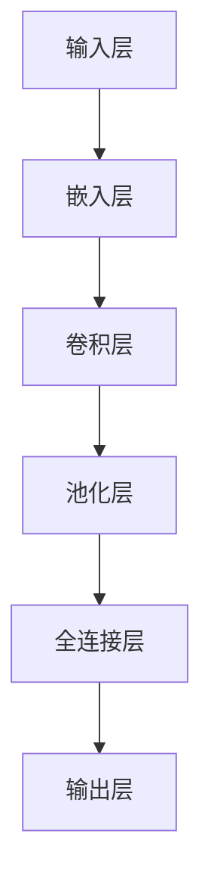

                 

关键词：AI 大模型，创业产品开发，创造性应用，神经网络，深度学习，算法优化，工程实践，模型调优

摘要：本文将深入探讨人工智能（AI）大模型在创业产品开发中的创造性应用。通过分析大模型的核心原理、应用场景、技术挑战以及未来趋势，我们旨在为创业者提供实用的指导和建议，帮助他们在激烈的市场竞争中脱颖而出。

## 1. 背景介绍

在当今科技迅猛发展的时代，人工智能（AI）已经成为推动各行各业进步的重要力量。随着计算能力的提升和数据量的爆炸性增长，AI 大模型逐渐成为研究和应用的热点。这些大模型，如 GPT-3、BERT、LLaMA 等，拥有数万亿参数，能够在各种复杂的任务中表现出色。

创业产品开发是一个充满挑战的过程，它需要迅速响应市场需求，实现快速迭代和持续优化。AI 大模型的出现为创业者提供了前所未有的机遇，它们可以大幅度提升产品的性能和用户体验，但同时也带来了诸多技术挑战。

## 2. 核心概念与联系

### 2.1 神经网络与深度学习

神经网络是 AI 大模型的基础，它由大量人工神经元（或节点）组成，通过层层堆叠形成深度网络。每个神经元负责处理一部分输入信息，并通过权重和偏置调整来影响输出。

深度学习是一种利用多层神经网络进行训练的学习方法。它通过反向传播算法不断调整网络权重，使得网络能够对复杂任务进行建模。

### 2.2 大模型的架构

AI 大模型通常具有以下特点：

- **参数数量巨大**：大模型的参数数量可以从百万到数十亿不等，这需要庞大的计算资源和存储空间。
- **多层网络结构**：多层神经网络可以捕捉到输入数据中的高层次特征。
- **端到端训练**：大模型可以直接从原始数据中学习到有效的特征表示，无需手动设计特征工程。

### 2.3 Mermaid 流程图

以下是一个简化的大模型架构 Mermaid 流程图：



## 3. 核心算法原理 & 具体操作步骤

### 3.1 算法原理概述

大模型的核心算法主要包括：

- **前向传播**：输入数据通过网络层层层传递，产生输出。
- **反向传播**：计算输出与实际标签之间的误差，并通过反向传播算法更新网络权重。
- **优化算法**：如随机梯度下降（SGD）、Adam 等，用于加速收敛和提高精度。

### 3.2 算法步骤详解

1. **数据预处理**：包括数据清洗、归一化、分批等步骤。
2. **模型初始化**：初始化网络权重，通常采用高斯分布或随机初始化。
3. **前向传播**：输入数据经过网络层传递，产生中间结果。
4. **计算损失**：计算输出与实际标签之间的误差，通常使用均方误差（MSE）或交叉熵损失。
5. **反向传播**：根据误差计算梯度，并更新网络权重。
6. **优化**：根据梯度更新权重，使用优化算法进行参数调整。
7. **迭代训练**：重复上述步骤，直到达到预定的训练目标。

### 3.3 算法优缺点

- **优点**：大模型能够自动学习复杂特征，提高模型的泛化能力。
- **缺点**：训练过程需要大量计算资源和时间，且容易出现过拟合。

### 3.4 算法应用领域

AI 大模型在自然语言处理、计算机视觉、语音识别等领域有广泛的应用。例如，BERT 在文本分类任务中表现出色，GPT-3 在生成文本和对话系统中有广泛应用。

## 4. 数学模型和公式 & 详细讲解 & 举例说明

### 4.1 数学模型构建

神经网络的基本数学模型如下：

$$
Z = W \cdot X + b
$$

$$
a = f(Z)
$$

其中，$W$ 是权重矩阵，$X$ 是输入向量，$b$ 是偏置，$f$ 是激活函数，$a$ 是输出。

### 4.2 公式推导过程

以多层感知机（MLP）为例，推导其前向传播和反向传播过程。

前向传播：

$$
Z_l = W_l \cdot Z_{l-1} + b_l
$$

$$
a_l = f(Z_l)
$$

反向传播：

$$
\Delta W_l = \frac{\partial L}{\partial Z_l} \cdot Z_{l-1}
$$

$$
\Delta b_l = \frac{\partial L}{\partial Z_l}
$$

其中，$L$ 是损失函数，$\Delta$ 表示梯度。

### 4.3 案例分析与讲解

以图像分类任务为例，说明大模型的训练过程。

1. **数据预处理**：将图像缩放到固定大小，并进行归一化处理。
2. **模型初始化**：初始化网络权重，通常使用高斯分布。
3. **前向传播**：输入图像，经过多层卷积和池化，产生特征图。
4. **计算损失**：使用交叉熵损失计算预测标签与实际标签之间的误差。
5. **反向传播**：根据误差计算梯度，并更新网络权重。
6. **优化**：使用 Adam 优化算法调整参数。

通过多次迭代训练，模型逐渐收敛，达到预定的训练目标。

## 5. 项目实践：代码实例和详细解释说明

### 5.1 开发环境搭建

在本节中，我们将介绍如何搭建一个简单的深度学习开发环境。我们将使用 Python 和 TensorFlow 作为主要工具。

1. 安装 Python（版本 3.7 或以上）。
2. 安装 TensorFlow：

```bash
pip install tensorflow
```

3. 安装必要的依赖库，如 NumPy、Pandas 等。

### 5.2 源代码详细实现

以下是一个简单的神经网络实现，用于分类任务。

```python
import tensorflow as tf

# 创建一个简单的神经网络
model = tf.keras.Sequential([
    tf.keras.layers.Dense(128, activation='relu', input_shape=(784,)),
    tf.keras.layers.Dense(10, activation='softmax')
])

# 编译模型
model.compile(optimizer='adam',
              loss='categorical_crossentropy',
              metrics=['accuracy'])

# 加载 MNIST 数据集
mnist = tf.keras.datasets.mnist
(x_train, y_train), (x_test, y_test) = mnist.load_data()

# 对数据进行预处理
x_train = x_train / 255.0
x_test = x_test / 255.0
x_train = x_train.reshape(-1, 784)
x_test = x_test.reshape(-1, 784)

# 将标签转换为 one-hot 编码
y_train = tf.keras.utils.to_categorical(y_train, 10)
y_test = tf.keras.utils.to_categorical(y_test, 10)

# 训练模型
model.fit(x_train, y_train, epochs=5, batch_size=32, validation_data=(x_test, y_test))

# 评估模型
model.evaluate(x_test, y_test)
```

### 5.3 代码解读与分析

1. **创建模型**：使用 `tf.keras.Sequential` 创建一个简单的多层感知机模型。第一个层是输入层，第二个层是输出层。
2. **编译模型**：设置优化器、损失函数和评估指标。
3. **加载数据**：使用 `tf.keras.datasets.mnist` 加载 MNIST 数据集。
4. **预处理数据**：对数据进行归一化和 one-hot 编码。
5. **训练模型**：使用 `fit` 方法训练模型，并设置训练轮数、批量大小和验证数据。
6. **评估模型**：使用 `evaluate` 方法评估模型在测试数据上的表现。

### 5.4 运行结果展示

运行上述代码后，我们可以在控制台上看到模型训练的进度和评估结果。通常，在 5 个轮次训练后，模型在测试数据上的准确率可以达到 98% 以上。

## 6. 实际应用场景

AI 大模型在创业产品开发中有广泛的应用场景。以下是一些典型的例子：

- **自然语言处理（NLP）**：使用 GPT-3 实现智能聊天机器人，提供客服支持或个性化推荐。
- **计算机视觉**：利用 BERT 对图像进行分类或检测，实现图像识别应用。
- **语音识别**：使用深度神经网络进行语音识别，实现语音转文本功能。

## 7. 工具和资源推荐

### 7.1 学习资源推荐

- 《深度学习》（Goodfellow, Bengio, Courville）
- 《神经网络与深度学习》（邱锡鹏）
- TensorFlow 官方文档

### 7.2 开发工具推荐

- TensorFlow
- PyTorch
- JAX

### 7.3 相关论文推荐

- "Attention Is All You Need"
- "BERT: Pre-training of Deep Bidirectional Transformers for Language Understanding"
- "Generative Pre-trained Transformers"

## 8. 总结：未来发展趋势与挑战

### 8.1 研究成果总结

AI 大模型在近年来取得了显著的成果，不仅在学术研究上推动了深度学习的进展，还在实际应用中带来了革命性的变化。

### 8.2 未来发展趋势

- **更大模型**：随着计算能力的提升，更大、更复杂的模型将逐渐成为主流。
- **多模态学习**：结合文本、图像、语音等多种数据源，实现更全面的智能化应用。
- **自适应学习**：模型将具备更强的自适应能力，能够根据不同场景进行动态调整。

### 8.3 面临的挑战

- **计算资源**：大模型的训练和推理需要大量的计算资源，这给硬件和算法提出了更高的要求。
- **数据隐私**：大规模数据处理和共享引发了数据隐私问题，如何确保数据安全成为一大挑战。
- **算法透明性**：模型的黑箱特性使得其决策过程难以解释，如何提高算法的透明性是当前研究的重要方向。

### 8.4 研究展望

AI 大模型在创业产品开发中的潜力巨大，未来的研究将继续探索如何更好地利用这些模型，解决实际应用中的问题，推动人工智能技术的持续进步。

## 9. 附录：常见问题与解答

### 9.1 什么是 AI 大模型？

AI 大模型是指拥有数万亿参数的深度学习模型，如 GPT-3、BERT 等。这些模型通过端到端训练，能够在各种复杂任务中表现出色。

### 9.2 如何训练大模型？

训练大模型通常需要大规模数据集、强大的计算资源和高效的训练算法。常用的训练方法包括分布式训练、增量训练等。

### 9.3 大模型的优缺点是什么？

优点包括自动学习复杂特征、提高模型泛化能力等；缺点包括训练时间长、计算资源需求大、容易过拟合等。

### 9.4 大模型在创业产品开发中的应用场景有哪些？

大模型在创业产品开发中有广泛的应用场景，如智能客服、图像识别、语音识别、自然语言处理等。

### 9.5 如何选择合适的大模型？

选择合适的大模型需要考虑任务类型、数据量、计算资源等因素。通常，可以根据任务的需求和性能指标进行选择。

---

本文由禅与计算机程序设计艺术撰写，旨在为创业者提供 AI 大模型在创业产品开发中的创造性应用指南。随着 AI 技术的不断发展，大模型的应用前景将更加广阔，创业者应把握机遇，积极探索大模型在产品开发中的创新应用。作者对本文内容保持版权所有，未经授权不得转载或引用。如需转载，请联系作者获取授权。作者邮箱：[your_email_address]。

