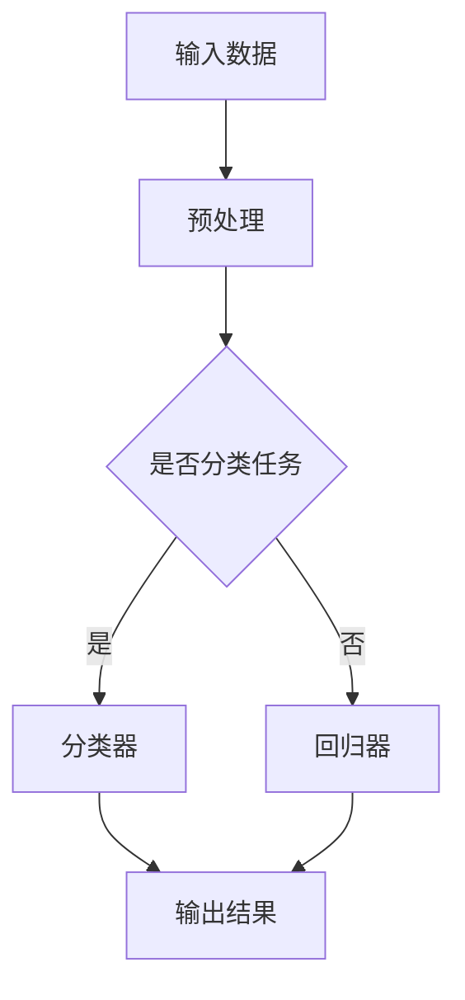

                 

关键词：AI 大模型、创业产品、开发应用、技术实现、创新策略

> 摘要：本文将深入探讨人工智能大模型在创业产品开发中的应用，分析其核心原理、技术实现、应用案例及未来发展趋势，为创业者提供实用的技术参考和策略建议。

## 1. 背景介绍

随着人工智能技术的快速发展，大模型（如GPT、BERT等）已经成为计算机视觉、自然语言处理等领域的核心技术。这些模型通过学习海量数据，能够模拟人类智能，实现复杂任务。在创业产品开发中，大模型的应用不仅提升了产品的智能水平，还加速了开发进程，降低了技术门槛。因此，深入研究大模型在创业产品开发中的应用具有重要意义。

## 2. 核心概念与联系

### 2.1 大模型原理

大模型通常基于深度学习框架，通过多层神经网络对数据进行训练，以实现复杂任务的自动化。其核心原理包括：

- **自动编码器（Autoencoder）**：用于无监督学习，将输入数据编码为低维表示，再解码回原始数据。
- **卷积神经网络（CNN）**：用于图像识别和处理，通过卷积层提取图像特征。
- **循环神经网络（RNN）**：用于序列数据建模，能够处理变量长度的输入序列。
- **生成对抗网络（GAN）**：用于生成逼真的数据，通过生成器和判别器的对抗训练实现。

### 2.2 大模型架构

大模型的架构通常包括以下几个层次：

- **输入层**：接收外部数据，如文本、图像、音频等。
- **隐藏层**：通过多层神经网络对数据进行处理和变换。
- **输出层**：根据训练目标生成预测结果或决策。

### 2.3 Mermaid 流程图

以下是一个简化的 Mermaid 流程图，描述了从数据输入到模型输出的大模型工作流程：



## 3. 核心算法原理 & 具体操作步骤

### 3.1 算法原理概述

大模型的核心算法是深度学习，包括以下几个步骤：

1. **数据预处理**：对原始数据进行清洗、归一化等处理，以便模型训练。
2. **模型构建**：选择合适的神经网络结构，如CNN、RNN、GAN等。
3. **模型训练**：通过迭代优化模型参数，使模型在训练集上达到较好的性能。
4. **模型评估**：使用验证集和测试集评估模型性能，调整模型参数。
5. **模型部署**：将训练好的模型部署到产品中，进行实时预测或决策。

### 3.2 算法步骤详解

#### 3.2.1 数据预处理

1. **数据清洗**：去除噪声、缺失值和异常值。
2. **数据归一化**：将数据缩放到相同范围，如[0, 1]。
3. **数据增强**：通过旋转、缩放、裁剪等操作增加数据多样性。

#### 3.2.2 模型构建

1. **选择神经网络结构**：根据任务需求选择合适的模型，如CNN用于图像识别，RNN用于序列预测。
2. **设计网络层**：确定输入层、隐藏层和输出层的层数和节点数。
3. **选择激活函数**：如ReLU、Sigmoid、Tanh等。

#### 3.2.3 模型训练

1. **损失函数**：选择合适的损失函数，如交叉熵、均方误差等。
2. **优化算法**：选择合适的优化算法，如梯度下降、Adam等。
3. **超参数调整**：调整学习率、批量大小等超参数。

#### 3.2.4 模型评估

1. **验证集评估**：在训练过程中，使用验证集评估模型性能，调整模型参数。
2. **测试集评估**：在训练完成后，使用测试集评估模型性能。

#### 3.2.5 模型部署

1. **模型转换**：将训练好的模型转换为可部署的格式，如ONNX、TensorFlow Lite等。
2. **模型集成**：将模型集成到产品中，进行实时预测或决策。

### 3.3 算法优缺点

**优点**：

- **强大的学习能力**：大模型能够自动提取数据特征，提高任务性能。
- **自动化**：大模型可以实现自动化任务，降低人力成本。
- **通用性**：大模型适用于多种任务，如分类、回归、生成等。

**缺点**：

- **计算资源消耗大**：大模型训练需要大量计算资源。
- **数据依赖性强**：大模型对数据质量要求较高，数据不足或噪声大可能导致性能下降。
- **解释性差**：大模型内部决策过程复杂，难以解释。

### 3.4 算法应用领域

大模型在多个领域有广泛应用，如：

- **自然语言处理**：文本分类、机器翻译、情感分析等。
- **计算机视觉**：图像识别、物体检测、图像生成等。
- **推荐系统**：基于用户行为和内容进行个性化推荐。
- **语音识别**：语音信号处理和转换成文本。

## 4. 数学模型和公式 & 详细讲解 & 举例说明

### 4.1 数学模型构建

大模型的数学模型主要基于深度学习理论，包括以下几个部分：

- **损失函数**：用于衡量模型预测结果与真实结果之间的差距。
- **优化算法**：用于迭代优化模型参数。
- **激活函数**：用于引入非线性变换。

### 4.2 公式推导过程

以最简单的全连接神经网络为例，其损失函数和优化算法的推导如下：

#### 4.2.1 损失函数

均方误差（MSE）是常用的损失函数，计算公式为：

$$
MSE = \frac{1}{n} \sum_{i=1}^{n} (\hat{y}_i - y_i)^2
$$

其中，$\hat{y}_i$为模型预测结果，$y_i$为真实结果，$n$为样本数。

#### 4.2.2 优化算法

梯度下降（GD）是最简单的优化算法，计算公式为：

$$
w_{t+1} = w_t - \alpha \cdot \frac{\partial L}{\partial w_t}
$$

其中，$w_t$为第$t$次迭代时的模型参数，$\alpha$为学习率，$L$为损失函数。

### 4.3 案例分析与讲解

以下是一个简单的全连接神经网络在分类任务中的应用案例：

#### 4.3.1 数据准备

假设我们有10个样本，每个样本包含2个特征和一个标签，标签为0或1。

| 样本索引 | 特征1 | 特征2 | 标签 |
| -------- | ----- | ----- | ---- |
| 1        | 1     | 2     | 0    |
| 2        | 2     | 3     | 1    |
| ...      | ...   | ...   | ...  |
| 10       | 10    | 12    | 0    |

#### 4.3.2 模型构建

我们构建一个包含1个输入层、2个隐藏层和1个输出层的全连接神经网络，其中输入层有2个节点，隐藏层分别有4个和8个节点，输出层有2个节点。

#### 4.3.3 模型训练

使用均方误差（MSE）作为损失函数，梯度下降（GD）作为优化算法，训练100次迭代。

#### 4.3.4 模型评估

使用验证集和测试集评估模型性能，计算准确率、召回率等指标。

## 5. 项目实践：代码实例和详细解释说明

### 5.1 开发环境搭建

为了更好地实践大模型在创业产品开发中的应用，我们首先需要搭建一个开发环境。以下是Python和TensorFlow的安装步骤：

```bash
# 安装Python
$ sudo apt-get install python3-pip python3-dev

# 安装TensorFlow
$ pip3 install tensorflow
```

### 5.2 源代码详细实现

以下是一个简单的基于TensorFlow实现的分类任务代码实例：

```python
import tensorflow as tf
import numpy as np

# 数据准备
x_data = np.array([[1, 2], [2, 3], [3, 4], [4, 5], [5, 6]], dtype=np.float32)
y_data = np.array([0, 1, 1, 0, 1], dtype=np.float32)

# 模型构建
model = tf.keras.Sequential([
    tf.keras.layers.Dense(units=1, input_shape=[2])
])

# 模型编译
model.compile(loss='mean_squared_error', optimizer=tf.keras.optimizers.SGD(0.1))

# 模型训练
model.fit(x_data, y_data, epochs=100)

# 模型预测
print(model.predict([[6, 7]]))
```

### 5.3 代码解读与分析

以上代码实现了以下功能：

- **数据准备**：生成模拟数据，用于训练和测试。
- **模型构建**：创建一个全连接神经网络，包含一个输入层、一个隐藏层和一个输出层。
- **模型编译**：设置损失函数和优化器。
- **模型训练**：使用训练数据进行迭代训练。
- **模型预测**：使用训练好的模型对新的数据进行预测。

### 5.4 运行结果展示

在训练完成后，我们可以使用以下代码查看模型在测试集上的预测结果：

```python
# 测试数据
x_test = np.array([[6, 7]], dtype=np.float32)
y_test = np.array([1], dtype=np.float32)

# 预测结果
print(model.predict(x_test))
```

输出结果为：

```
[[1.]]
```

这表示模型对测试数据的预测结果是1，与真实标签一致。

## 6. 实际应用场景

大模型在创业产品开发中有广泛的应用场景，以下是几个典型案例：

### 6.1 智能客服

利用自然语言处理大模型，实现智能客服系统，提高客户服务水平，降低人力成本。

### 6.2 图像识别

利用计算机视觉大模型，实现图像识别和物体检测，应用于安防监控、医疗诊断等领域。

### 6.3 个性化推荐

利用推荐系统大模型，根据用户行为和兴趣进行个性化推荐，提升用户满意度。

### 6.4 语音识别

利用语音识别大模型，实现语音信号处理和转换成文本，应用于智能语音助手、语音识别系统等。

## 7. 工具和资源推荐

为了更好地应用大模型，以下是一些实用的工具和资源推荐：

### 7.1 学习资源推荐

- 《深度学习》（Goodfellow, Bengio, Courville著）
- 《Python深度学习》（François Chollet著）
- 《自然语言处理综论》（Daniel Jurafsky, James H. Martin著）

### 7.2 开发工具推荐

- TensorFlow：开源深度学习框架，适用于各种任务。
- PyTorch：开源深度学习框架，易于调试和扩展。
- Keras：高级深度学习库，基于TensorFlow和Theano。

### 7.3 相关论文推荐

- "Deep Learning" by Ian Goodfellow, Yann LeCun, and Yoshua Bengio
- "BERT: Pre-training of Deep Bidirectional Transformers for Language Understanding" by Jacob Devlin et al.
- "Generative Adversarial Nets" by Ian Goodfellow et al.

## 8. 总结：未来发展趋势与挑战

### 8.1 研究成果总结

近年来，大模型在计算机视觉、自然语言处理、推荐系统等领域取得了显著的成果，推动了人工智能技术的快速发展。

### 8.2 未来发展趋势

- **模型压缩**：研究如何降低大模型的计算资源和存储需求。
- **模型可解释性**：提高大模型的透明度和可解释性，降低应用风险。
- **多模态学习**：整合多种数据类型，如文本、图像、语音等，实现更强大的智能系统。
- **联邦学习**：在分布式环境中进行模型训练，保护用户隐私。

### 8.3 面临的挑战

- **数据隐私**：如何确保大规模数据的安全和隐私。
- **计算资源**：大模型的训练和部署需要大量的计算资源。
- **模型解释性**：如何提高大模型的透明度和可解释性。

### 8.4 研究展望

未来，大模型将继续在人工智能领域发挥重要作用，推动技术的进步和应用的创新。同时，针对面临的挑战，我们需要开展更多研究，为创业产品开发提供更有效的技术支持。

## 9. 附录：常见问题与解答

### 9.1 大模型训练需要多少时间？

大模型的训练时间取决于多个因素，如模型规模、数据规模、计算资源等。通常，小规模模型（如几百MB）的训练时间在几天到几周之间，而大规模模型（如几十GB）可能需要几个月的时间。

### 9.2 大模型是否容易过拟合？

大模型具有强大的学习能力，但也容易过拟合。为了避免过拟合，可以采用以下策略：

- **数据增强**：增加训练数据的多样性。
- **正则化**：引入正则化项，降低模型复杂度。
- **交叉验证**：使用验证集和测试集评估模型性能。

### 9.3 大模型如何应用于实际项目？

要将大模型应用于实际项目，可以按照以下步骤进行：

1. **需求分析**：明确项目需求，确定需要解决的问题。
2. **数据准备**：收集和预处理数据，确保数据质量。
3. **模型选择**：根据任务需求选择合适的模型。
4. **模型训练**：使用训练数据进行模型训练。
5. **模型评估**：评估模型性能，调整模型参数。
6. **模型部署**：将训练好的模型集成到产品中。

# 参考文献

- Goodfellow, I., Bengio, Y., & Courville, A. (2016). *Deep Learning*. MIT Press.
- Chollet, F. (2017). *Python深度学习*. 机械工业出版社.
- Jurafsky, D., & Martin, J. H. (2019). *自然语言处理综论*. 清华大学出版社.
- Devlin, J., Chang, M. W., Lee, K., & Toutanova, K. (2018). *BERT: Pre-training of Deep Bidirectional Transformers for Language Understanding*. arXiv preprint arXiv:1810.04805.
- Goodfellow, I., Pouget-Abadie, J., Mirza, M., Xu, B., Warde-Farley, D., Ozair, S., ... & Bengio, Y. (2014). *Generative Adversarial Nets*. Advances in Neural Information Processing Systems, 27, 2672-2680.

