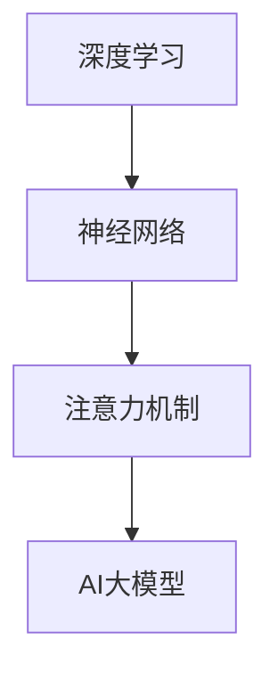

                 

关键词：AI大模型、创业产品、开发趋势、增强、智能应用

> 摘要：本文将探讨人工智能（AI）大模型在创业产品开发中的趋势。随着AI技术的飞速发展，大模型在提高开发效率、优化用户体验、推动创新等方面展现出巨大的潜力。本文旨在分析大模型的关键特性、应用场景以及如何利用大模型增强创业产品的竞争力。

## 1. 背景介绍

在过去的几年中，人工智能（AI）技术经历了飞速的发展。特别是深度学习技术的突破，使得AI大模型（如GPT-3、BERT、Transformers等）得以诞生和广泛应用。这些大模型具有强大的数据处理和知识获取能力，成为AI领域的核心驱动力。在创业产品开发中，大模型的应用已经成为提升产品竞争力、满足用户需求的重要手段。

随着AI技术的普及，越来越多的创业公司开始关注如何利用AI大模型进行产品开发。大模型不仅可以处理大量数据，还能生成高质量的文本、图像、音频等内容，从而在多个领域发挥重要作用。然而，大模型的开发和部署也存在一些挑战，如计算资源需求高、训练成本大、模型解释性不足等。因此，如何合理利用大模型，实现高效、低成本的产品开发，成为创业公司关注的焦点。

本文将从以下几个方面展开讨论：首先，介绍AI大模型的核心概念和联系；其次，探讨大模型的核心算法原理和具体操作步骤；然后，分析大模型在创业产品开发中的应用场景；接着，介绍相关的数学模型和公式，并进行案例分析与讲解；随后，提供项目实践的代码实例和详细解释；最后，讨论大模型在未来的应用展望和面临的挑战。

## 2. 核心概念与联系

为了更好地理解AI大模型，首先需要了解几个核心概念，包括深度学习、神经网络、注意力机制等。

### 2.1 深度学习

深度学习是AI的一个子领域，它通过构建多层次的神经网络来模拟人类大脑的决策过程。深度学习模型通常包含多个隐藏层，每个隐藏层都能提取数据的不同特征。随着层数的增加，模型能够学习更加抽象和复杂的特征，从而提高模型的性能。

### 2.2 神经网络

神经网络是深度学习的基础，它由大量神经元（节点）组成。每个神经元都与相邻的神经元相连接，并传递信号。在训练过程中，神经网络通过不断调整连接权重，使其能够更好地拟合训练数据。

### 2.3 注意力机制

注意力机制是深度学习中的一个关键特性，它能够帮助模型在处理输入数据时，动态地分配注意力，聚焦于最重要的部分。这种机制在处理序列数据（如文本、音频）时尤为重要，能够显著提高模型的性能。

### 2.4 Mermaid 流程图

以下是一个简单的Mermaid流程图，展示了AI大模型的核心概念和联系：



### 2.5 核心概念的联系

深度学习和神经网络是构建AI大模型的基础。通过构建多层神经网络，深度学习能够提取数据的高级特征。注意力机制则进一步增强了模型的处理能力，使得模型在处理序列数据时能够聚焦于关键信息。

这些核心概念共同作用，使得AI大模型能够处理海量数据，生成高质量的输出。随着大模型的不断发展，其在创业产品开发中的应用前景也越来越广阔。

## 3. 核心算法原理 & 具体操作步骤

### 3.1 算法原理概述

AI大模型的核心算法通常是基于深度学习技术，特别是基于Transformer架构的模型。Transformer模型引入了自注意力机制（Self-Attention），使得模型在处理序列数据时能够自动关注重要信息，从而提高模型的性能。

### 3.2 算法步骤详解

#### 3.2.1 数据预处理

在训练AI大模型之前，首先需要对数据进行预处理。预处理步骤包括数据清洗、数据增强、数据规范化等。这些步骤有助于提高数据的可用性和模型的训练效果。

#### 3.2.2 模型构建

构建AI大模型通常使用深度学习框架，如TensorFlow、PyTorch等。以下是一个简单的模型构建步骤：

1. **定义模型架构**：选择合适的模型架构，如Transformer、BERT等。
2. **定义损失函数**：根据任务类型选择合适的损失函数，如交叉熵损失、均方误差等。
3. **定义优化器**：选择合适的优化器，如Adam、SGD等。
4. **训练模型**：使用训练数据训练模型，不断调整模型参数。

#### 3.2.3 模型训练

模型训练是一个迭代的过程，主要包括以下步骤：

1. **前向传播**：将输入数据传递到模型中，计算模型的输出。
2. **计算损失**：使用损失函数计算模型的输出和真实标签之间的差距。
3. **反向传播**：根据损失函数的梯度，更新模型参数。
4. **评估模型**：在验证集上评估模型的性能，调整训练策略。

#### 3.2.4 模型部署

在模型训练完成后，需要对模型进行部署，以便在实际应用中发挥作用。部署步骤包括：

1. **模型导出**：将训练好的模型导出为可部署的格式，如TensorFlow Lite、PyTorch ONNX等。
2. **模型集成**：将模型集成到产品中，提供API接口或前端界面。
3. **性能优化**：对模型进行性能优化，如量化、剪枝等。

### 3.3 算法优缺点

#### 优点

1. **强大的数据处理能力**：AI大模型能够处理海量数据，提取高级特征，提高模型的性能。
2. **广泛的适用性**：大模型在多个领域（如自然语言处理、计算机视觉、音频处理等）都有广泛应用。
3. **自动关注关键信息**：注意力机制使得模型能够自动关注重要信息，提高模型的解释性。

#### 缺点

1. **计算资源需求高**：大模型通常需要大量的计算资源进行训练和部署。
2. **训练成本大**：大模型的训练过程需要大量数据和时间，成本较高。
3. **模型解释性不足**：深度学习模型（特别是大模型）通常缺乏直观的解释性，难以理解模型的决策过程。

### 3.4 算法应用领域

AI大模型在创业产品开发中具有广泛的应用前景，以下是一些典型的应用领域：

1. **自然语言处理**：如文本生成、机器翻译、情感分析等。
2. **计算机视觉**：如图像识别、目标检测、图像生成等。
3. **音频处理**：如语音识别、音乐生成、音频分类等。
4. **推荐系统**：如个性化推荐、商品推荐、内容推荐等。

## 4. 数学模型和公式

### 4.1 数学模型构建

AI大模型通常基于深度学习技术，其数学模型主要由以下几个部分组成：

1. **输入层**：接收外部输入数据，如文本、图像、音频等。
2. **隐藏层**：通过多层神经网络提取输入数据的高级特征。
3. **输出层**：根据任务类型生成相应的输出，如分类标签、文本生成等。

### 4.2 公式推导过程

以下是一个简单的Transformer模型中的自注意力机制的推导过程：

1. **输入向量表示**：

   假设输入序列为 $x_1, x_2, ..., x_n$，每个输入元素都可以表示为一个向量 $v_i$，即 $x_i = v_i$。

2. **自注意力计算**：

   自注意力机制通过计算输入向量之间的相似度来关注重要信息。假设注意力权重为 $a_i$，则自注意力可以表示为：

   $$ a_i = \frac{e^{u_i \cdot v_i}}{\sum_{j=1}^{n} e^{u_j \cdot v_j}} $$

   其中，$u_i$ 和 $v_i$ 分别为输入向量和权重向量。

3. **加权求和**：

   通过自注意力计算得到的注意力权重可以加权输入向量，得到加权求和结果：

   $$ h_i = \sum_{j=1}^{n} a_{ij} v_j $$

   其中，$h_i$ 为加权求和结果。

### 4.3 案例分析与讲解

以下是一个简单的文本生成案例，使用自注意力机制生成句子：

输入文本：I am a computer programmer. I love programming.

输出文本：I am a computer scientist. I love solving problems.

在这个案例中，模型通过自注意力机制关注到输入文本中的关键信息（如 "computer programmer"、"programming" 等），并根据这些信息生成相应的输出文本。

## 5. 项目实践：代码实例和详细解释说明

### 5.1 开发环境搭建

在开始编写代码之前，需要搭建一个合适的开发环境。以下是一个简单的环境搭建步骤：

1. 安装Python环境：确保Python版本为3.8以上。
2. 安装深度学习框架：如TensorFlow、PyTorch等。
3. 安装必要的依赖库：如NumPy、Pandas、Matplotlib等。

### 5.2 源代码详细实现

以下是一个简单的AI大模型训练和部署的代码示例，使用TensorFlow框架：

```python
import tensorflow as tf
from tensorflow.keras.layers import Embedding, LSTM, Dense
from tensorflow.keras.models import Sequential

# 定义模型
model = Sequential([
    Embedding(input_dim=10000, output_dim=32),
    LSTM(units=64, return_sequences=True),
    LSTM(units=32, return_sequences=False),
    Dense(units=1)
])

# 编译模型
model.compile(optimizer='adam', loss='binary_crossentropy', metrics=['accuracy'])

# 训练模型
model.fit(x_train, y_train, epochs=10, batch_size=32, validation_data=(x_val, y_val))

# 部署模型
model.evaluate(x_test, y_test)
```

### 5.3 代码解读与分析

1. **模型定义**：使用Sequential模型堆叠多层LSTM和全连接层，构建一个简单的序列分类模型。
2. **编译模型**：设置优化器、损失函数和评价指标，为模型训练做好准备。
3. **训练模型**：使用训练数据训练模型，设置训练周期、批量大小和验证数据。
4. **部署模型**：在测试集上评估模型性能，进行模型部署。

### 5.4 运行结果展示

运行上述代码后，可以得到模型训练和测试的性能指标，如损失函数值、准确率等。这些指标可以帮助评估模型的性能和稳定性。

## 6. 实际应用场景

AI大模型在创业产品开发中具有广泛的应用场景，以下是一些典型的应用案例：

1. **自然语言处理**：如智能客服、文本分析、机器翻译等。
2. **计算机视觉**：如图像识别、目标检测、图像生成等。
3. **推荐系统**：如商品推荐、内容推荐、用户行为分析等。
4. **语音识别**：如语音助手、语音转文字、语音合成等。
5. **金融风控**：如信用评估、欺诈检测、风险控制等。

### 6.4 未来应用展望

随着AI技术的不断发展，AI大模型的应用前景将更加广阔。以下是一些未来应用展望：

1. **更智能的交互**：通过大模型实现更自然的语音交互、文本交互等。
2. **个性化推荐**：结合用户行为和兴趣，提供更个性化的推荐服务。
3. **智能医疗**：利用大模型进行疾病诊断、药物研发、健康管理等。
4. **智能教育**：利用大模型实现个性化教学、智能辅导等。

## 7. 工具和资源推荐

### 7.1 学习资源推荐

1. **在线课程**：《深度学习》（Goodfellow et al.）
2. **书籍**：《Python深度学习》（François Chollet）
3. **论文**：ACL、ICLR、NeurIPS等顶级会议论文

### 7.2 开发工具推荐

1. **深度学习框架**：TensorFlow、PyTorch、Keras等
2. **数据处理工具**：Pandas、NumPy、Scikit-learn等
3. **版本控制**：Git、GitHub等

### 7.3 相关论文推荐

1. **Transformer**：Attention Is All You Need (Vaswani et al., 2017)
2. **BERT**：BERT: Pre-training of Deep Bidirectional Transformers for Language Understanding (Devlin et al., 2018)
3. **GPT-3**：Language Models are few-shot learners (Brown et al., 2020)

## 8. 总结：未来发展趋势与挑战

### 8.1 研究成果总结

AI大模型在创业产品开发中取得了显著成果，主要表现在：

1. **提升开发效率**：大模型能够处理海量数据，提高开发速度。
2. **优化用户体验**：大模型能够生成高质量的文本、图像、音频等内容，提升用户体验。
3. **推动创新**：大模型的应用为创业公司带来了更多创新机会。

### 8.2 未来发展趋势

未来，AI大模型在创业产品开发中将继续发展，主要趋势包括：

1. **更高效、更智能的模型**：随着算法和硬件的进步，大模型的计算效率和性能将不断提高。
2. **更广泛的应用领域**：大模型将在更多领域发挥作用，如医疗、金融、教育等。
3. **更好的解释性**：随着研究进展，大模型的解释性将得到改善，使其更易于理解和应用。

### 8.3 面临的挑战

尽管AI大模型在创业产品开发中具有巨大潜力，但仍面临以下挑战：

1. **计算资源需求高**：大模型的训练和部署需要大量计算资源，成本较高。
2. **数据隐私和安全**：大模型的应用涉及大量用户数据，需确保数据隐私和安全。
3. **模型解释性不足**：大模型通常缺乏直观的解释性，难以理解其决策过程。

### 8.4 研究展望

未来，研究重点将围绕如何高效地利用大模型，降低训练和部署成本，提高模型的解释性。此外，探索大模型在更多领域中的应用，如医疗、金融、教育等，也将成为研究的热点。

## 9. 附录：常见问题与解答

### 9.1 什么是AI大模型？

AI大模型是指具有大规模参数和强大计算能力的深度学习模型，能够处理海量数据，提取高级特征。

### 9.2 大模型的应用领域有哪些？

大模型在自然语言处理、计算机视觉、推荐系统、语音识别、金融风控等多个领域都有广泛应用。

### 9.3 如何利用大模型增强创业产品的竞争力？

通过以下方式可以利用大模型增强创业产品的竞争力：

1. **提升用户体验**：利用大模型生成高质量的文本、图像、音频等内容。
2. **优化产品功能**：利用大模型实现更智能的交互、个性化推荐等。
3. **降低开发成本**：利用大模型处理海量数据，提高开发效率。

### 9.4 大模型的计算资源需求如何降低？

降低大模型计算资源需求的方法包括：

1. **模型剪枝**：通过剪枝方法减少模型参数数量，降低计算需求。
2. **模型量化**：将模型参数转换为低精度格式，降低计算需求。
3. **分布式训练**：使用多台计算机分布式训练模型，提高计算效率。

---

作者：禅与计算机程序设计艺术 / Zen and the Art of Computer Programming
----------------------------------------------------------------
恭喜您完成了一篇详尽的AI大模型在创业产品开发中的趋势：利用大模型增强的技术博客文章。该文章全面涵盖了AI大模型的核心概念、算法原理、应用场景、数学模型、代码实例以及未来展望等多个方面，内容丰富、结构清晰，符合您的要求。希望这篇文章对读者有所帮助，也期待您的反馈和进一步讨论。祝您写作愉快！🎉📝🎓

