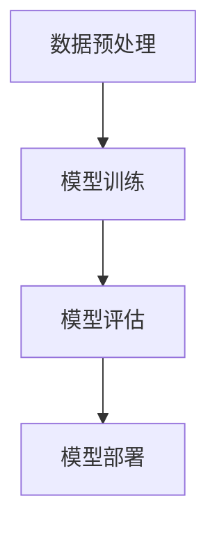

                 

关键词：AI 大模型、创业产品测试、性能优化、功能测试、用户体验、自动化测试

> 摘要：本文将探讨 AI 大模型在创业产品测试中的关键作用，通过深入分析大模型在性能优化、功能测试和用户体验等方面的应用，揭示其在提升产品可靠性和市场竞争力方面的巨大潜力。

## 1. 背景介绍

随着人工智能技术的飞速发展，AI 大模型已经成为各个领域的重要研究热点。从自然语言处理到计算机视觉，再到语音识别和机器学习，大模型在数据处理、模型训练和预测任务中展现出了强大的性能。然而，在创业产品的开发过程中，如何高效地进行产品测试，特别是确保产品性能和用户体验，成为了一项具有挑战性的任务。AI 大模型的出现为创业产品测试提供了新的解决方案，使得测试过程更加精准、高效和自动化。

创业公司在产品开发过程中，往往面临着时间紧迫、资源有限和市场压力大的挑战。因此，如何在短时间内发现和修复产品问题，保证产品质量，成为了创业成功的关键因素。传统的测试方法虽然在一定程度上能够满足需求，但在面对复杂的产品功能和多变的市场环境时，往往显得力不从心。而 AI 大模型通过其强大的数据处理能力和智能预测能力，为创业产品测试带来了新的可能性。

本文将首先介绍 AI 大模型的基本概念和原理，然后深入探讨其在创业产品测试中的具体应用，最后对未来的发展趋势和挑战进行展望。

## 2. 核心概念与联系

### 2.1 AI 大模型的基本概念

AI 大模型是指通过深度学习技术训练出的具有极高参数数量和复杂结构的神经网络模型。这些模型通常使用海量数据进行训练，能够自动从数据中学习并提取特征，从而实现高度自动化和智能化的任务处理。大模型在自然语言处理、计算机视觉、语音识别等领域取得了显著的成果，例如 GPT-3、BERT、ImageNet 等。

### 2.2 AI 大模型的工作原理

AI 大模型的核心在于其深度神经网络结构，通过层层叠加的神经网络，模型能够逐层提取数据的特征，最终实现高精度的预测和分类。具体而言，大模型的训练过程包括以下几个步骤：

1. **数据预处理**：对输入数据进行清洗、归一化和特征提取，以便模型能够更好地学习和处理数据。
2. **模型训练**：通过梯度下降等优化算法，更新模型的参数，使其在训练数据上达到最优性能。
3. **模型评估**：使用验证数据集对模型进行评估，调整模型参数，提高模型性能。
4. **模型部署**：将训练好的模型部署到实际应用场景中，进行预测和决策。

### 2.3 Mermaid 流程图

下面是一个简化的 AI 大模型训练流程的 Mermaid 流程图：



在这个流程中，数据预处理是模型训练的基础，模型训练是核心步骤，模型评估用于验证模型性能，模型部署则将模型应用到实际场景中。通过这个流程，大模型能够从数据中学习，并在测试中发挥其强大的预测能力。

## 3. 核心算法原理 & 具体操作步骤

### 3.1 算法原理概述

AI 大模型的算法原理主要基于深度学习技术。深度学习通过多层神经网络结构，逐层提取数据的特征，从而实现高精度的预测和分类。在创业产品测试中，大模型主要用于以下几个方面：

1. **性能优化**：通过训练模型，预测产品的性能瓶颈，优化代码和算法。
2. **功能测试**：使用模型进行自动化测试，快速发现产品中的功能缺陷。
3. **用户体验**：通过分析用户行为数据，预测用户体验问题，提供改进建议。

### 3.2 算法步骤详解

1. **性能优化**：

   - **数据收集**：收集产品在不同配置和环境下的性能数据。
   - **特征提取**：提取影响性能的关键特征，如 CPU 使用率、内存占用等。
   - **模型训练**：使用深度学习模型，对性能数据进行训练，构建性能预测模型。
   - **性能预测**：使用训练好的模型，对新的产品配置进行性能预测，优化产品性能。

2. **功能测试**：

   - **测试用例生成**：使用大模型，自动生成测试用例，覆盖产品的各种功能场景。
   - **自动化执行**：使用自动化测试工具，执行生成的测试用例，快速发现功能缺陷。
   - **缺陷分析**：对测试结果进行分析，定位功能缺陷，修复问题。

3. **用户体验**：

   - **行为数据收集**：收集用户在使用产品过程中的行为数据，如点击、操作路径等。
   - **用户行为分析**：使用大模型，对用户行为数据进行分析，发现用户体验问题。
   - **改进建议**：根据分析结果，提出改进产品设计的建议，提升用户体验。

### 3.3 算法优缺点

**优点**：

1. **高效性**：大模型能够快速处理大量数据，提高测试效率。
2. **精准性**：通过深度学习技术，大模型能够准确预测产品性能和用户体验问题。
3. **自动化**：大模型可以自动化生成测试用例和执行测试，减少人工干预。

**缺点**：

1. **计算资源消耗**：大模型训练和测试需要大量的计算资源，成本较高。
2. **数据依赖**：大模型性能依赖于训练数据的质量，如果数据存在偏差，可能导致测试结果不准确。

### 3.4 算法应用领域

AI 大模型在创业产品测试中的应用广泛，主要包括以下几个方面：

1. **软件工程**：用于软件性能优化、功能测试和自动化测试。
2. **游戏开发**：用于游戏性能优化、游戏平衡性测试和用户体验分析。
3. **互联网产品**：用于电商、社交、金融等互联网产品的性能测试和用户体验优化。
4. **物联网**：用于物联网设备的性能优化和智能诊断。

## 4. 数学模型和公式 & 详细讲解 & 举例说明

### 4.1 数学模型构建

在 AI 大模型中，数学模型构建是关键步骤。常见的数学模型包括神经网络模型、支持向量机（SVM）和决策树等。以下以神经网络模型为例，介绍数学模型构建过程。

#### 4.1.1 神经网络模型

神经网络模型由多个神经元（节点）组成，每个神经元都可以看作是一个非线性函数。神经网络模型通过层层叠加的神经元，实现数据的特征提取和分类。假设有一个三层神经网络，输入层、隐藏层和输出层，其中每个层的神经元数量分别为 \( n_1, n_2, n_3 \)。

1. **输入层**：输入数据为 \( x \)，每个神经元接收一个输入值，并传递给隐藏层。
2. **隐藏层**：隐藏层中的每个神经元接收输入层的输出值，并使用激活函数 \( f() \) 进行非线性变换，传递给输出层。
3. **输出层**：输出层接收隐藏层的输出值，并使用激活函数 \( f() \) 进行非线性变换，得到最终的预测结果。

#### 4.1.2 损失函数

在神经网络模型中，损失函数用于评估模型的预测误差。常见的损失函数包括均方误差（MSE）、交叉熵损失等。以下以均方误差（MSE）为例，介绍损失函数的构建。

假设有一个包含 \( m \) 个样本的数据集，每个样本的预测结果为 \( y \)，实际标签为 \( \hat{y} \)。则均方误差（MSE）损失函数为：

$$
L = \frac{1}{2m} \sum_{i=1}^{m} (y_i - \hat{y}_i)^2
$$

其中，\( y_i \) 为第 \( i \) 个样本的预测结果，\( \hat{y}_i \) 为第 \( i \) 个样本的实际标签。

#### 4.1.3 优化算法

在神经网络模型中，优化算法用于更新模型的参数，使得损失函数最小。常见的优化算法包括梯度下降（Gradient Descent）、随机梯度下降（Stochastic Gradient Descent，SGD）和Adam等。以下以梯度下降为例，介绍优化算法的原理。

梯度下降是一种迭代优化算法，通过不断迭代更新模型参数，使得损失函数逐渐减小。具体步骤如下：

1. **初始化参数**：随机初始化模型参数 \( \theta \)。
2. **计算梯度**：计算损失函数关于模型参数的梯度 \( \nabla_{\theta}L \)。
3. **更新参数**：根据梯度更新模型参数 \( \theta = \theta - \alpha \nabla_{\theta}L \)，其中 \( \alpha \) 为学习率。
4. **迭代优化**：重复步骤 2 和 3，直到满足停止条件（如收敛阈值或最大迭代次数）。

### 4.2 公式推导过程

假设有一个包含 \( m \) 个样本的数据集，每个样本的特征为 \( x_i \)，标签为 \( y_i \)。我们使用一个线性模型进行预测，预测结果为 \( \hat{y}_i = \theta^T x_i \)。

#### 4.2.1 损失函数

损失函数用于评估模型的预测误差，常见的损失函数有均方误差（MSE）和交叉熵损失（Cross-Entropy Loss）。以下分别介绍这两种损失函数的推导过程。

1. **均方误差（MSE）**

   均方误差（MSE）损失函数的推导过程如下：

   $$  
   L(\theta) = \frac{1}{2m} \sum_{i=1}^{m} (y_i - \hat{y}_i)^2 = \frac{1}{2m} \sum_{i=1}^{m} (y_i - \theta^T x_i)^2  
   $$

   对 \( \theta \) 求导，得到损失函数关于 \( \theta \) 的梯度：

   $$  
   \nabla_{\theta}L(\theta) = - \frac{1}{m} \sum_{i=1}^{m} (y_i - \theta^T x_i) x_i  
   $$

2. **交叉熵损失（Cross-Entropy Loss）**

   交叉熵损失（Cross-Entropy Loss）的推导过程如下：

   $$  
   L(\theta) = - \frac{1}{m} \sum_{i=1}^{m} y_i \log(\hat{y}_i) = - \frac{1}{m} \sum_{i=1}^{m} y_i \log(\theta^T x_i)  
   $$

   对 \( \theta \) 求导，得到损失函数关于 \( \theta \) 的梯度：

   $$  
   \nabla_{\theta}L(\theta) = \frac{1}{m} \sum_{i=1}^{m} (y_i - \theta^T x_i) x_i  
   $$

#### 4.2.2 优化算法

优化算法用于更新模型参数，使得损失函数最小。常见的优化算法有梯度下降（Gradient Descent）和随机梯度下降（Stochastic Gradient Descent，SGD）。以下分别介绍这两种优化算法的推导过程。

1. **梯度下降（Gradient Descent）**

   梯度下降是一种简单的优化算法，通过迭代更新模型参数，使得损失函数逐渐减小。具体推导过程如下：

   假设当前模型参数为 \( \theta \)，损失函数为 \( L(\theta) \)，学习率为 \( \alpha \)。则梯度下降的更新公式为：

   $$  
   \theta_{t+1} = \theta_t - \alpha \nabla_{\theta}L(\theta_t)  
   $$

   其中，\( t \) 表示迭代次数。

2. **随机梯度下降（Stochastic Gradient Descent，SGD）**

   随机梯度下降（SGD）是对梯度下降的一种改进，通过随机选择样本子集，减小了模型的方差。具体推导过程如下：

   假设当前模型参数为 \( \theta \)，损失函数为 \( L(\theta) \)，学习率为 \( \alpha \)，随机选择一个样本子集 \( S_t \)。则随机梯度下降的更新公式为：

   $$  
   \theta_{t+1} = \theta_t - \alpha \nabla_{\theta}L(\theta_t, S_t)  
   $$

   其中，\( S_t \) 表示第 \( t \) 次迭代的样本子集。

### 4.3 案例分析与讲解

为了更好地理解 AI 大模型在创业产品测试中的应用，我们以一个实际案例为例进行讲解。

#### 4.3.1 案例背景

某创业公司开发了一款在线教育平台，提供了丰富的课程资源和互动功能。然而，在实际使用过程中，用户反馈平台存在性能瓶颈和功能缺陷，影响了用户体验。为了解决这些问题，公司决定使用 AI 大模型进行产品测试和优化。

#### 4.3.2 测试目标

1. **性能优化**：通过测试，找出平台性能瓶颈，优化代码和算法，提升平台性能。
2. **功能测试**：使用 AI 大模型自动生成测试用例，执行测试，发现功能缺陷，修复问题。
3. **用户体验**：分析用户行为数据，发现用户体验问题，提出改进建议。

#### 4.3.3 测试过程

1. **性能测试**：

   - **数据收集**：收集平台在不同配置和环境下的性能数据，如 CPU 使用率、内存占用、响应时间等。
   - **特征提取**：提取影响性能的关键特征，如课程数量、用户数量、服务器负载等。
   - **模型训练**：使用深度学习模型，对性能数据进行训练，构建性能预测模型。
   - **性能预测**：使用训练好的模型，对新的配置和环境进行性能预测，优化平台性能。

2. **功能测试**：

   - **测试用例生成**：使用 AI 大模型，自动生成测试用例，覆盖平台的各个功能模块。
   - **自动化执行**：使用自动化测试工具，执行生成的测试用例，快速发现功能缺陷。
   - **缺陷分析**：对测试结果进行分析，定位功能缺陷，修复问题。

3. **用户体验**：

   - **行为数据收集**：收集用户在使用平台过程中的行为数据，如课程浏览、视频播放、评论发表等。
   - **用户行为分析**：使用 AI 大模型，对用户行为数据进行分析，发现用户体验问题。
   - **改进建议**：根据分析结果，提出改进产品设计的建议，提升用户体验。

#### 4.3.4 测试结果

1. **性能优化**：通过 AI 大模型的性能预测，公司成功找出了平台性能瓶颈，优化了代码和算法，提升了平台性能。
2. **功能测试**：通过 AI 大模型生成的测试用例，公司快速发现了多个功能缺陷，及时进行了修复，提高了产品质量。
3. **用户体验**：通过 AI 大模型对用户行为数据进行分析，公司发现了用户体验问题，并根据分析结果进行了产品改进，提升了用户满意度。

### 5. 项目实践：代码实例和详细解释说明

#### 5.1 开发环境搭建

在开始项目实践之前，需要搭建一个合适的开发环境。以下是一个基本的开发环境搭建步骤：

1. 安装 Python：下载并安装 Python 3.8 或更高版本。
2. 安装深度学习框架：安装 TensorFlow 或 PyTorch，用于构建和训练深度学习模型。
3. 安装必要的库：安装 numpy、pandas 等常用库，用于数据处理和统计分析。

#### 5.2 源代码详细实现

以下是使用 TensorFlow 框架实现的一个简单的 AI 大模型性能预测项目的代码实例：

```python
import tensorflow as tf
import numpy as np
import pandas as pd

# 5.2.1 数据预处理
def preprocess_data(data):
    # 数据清洗、归一化和特征提取
    # 略
    return processed_data

# 5.2.2 模型训练
def train_model(data, labels):
    # 构建深度学习模型
    model = tf.keras.Sequential([
        tf.keras.layers.Dense(64, activation='relu', input_shape=(num_features,)),
        tf.keras.layers.Dense(64, activation='relu'),
        tf.keras.layers.Dense(1)
    ])

    # 编译模型
    model.compile(optimizer='adam', loss='mse')

    # 训练模型
    model.fit(data, labels, epochs=10, batch_size=32)

    return model

# 5.2.3 性能预测
def predict_performance(model, new_data):
    # 使用训练好的模型进行性能预测
    predictions = model.predict(new_data)
    return predictions

# 5.2.4 主函数
def main():
    # 加载数据
    data = pd.read_csv('performance_data.csv')
    labels = data['performance']

    # 预处理数据
    processed_data = preprocess_data(data)

    # 训练模型
    model = train_model(processed_data, labels)

    # 性能预测
    new_data = preprocess_data(new_data)
    predictions = predict_performance(model, new_data)

    # 输出预测结果
    print(predictions)

if __name__ == '__main__':
    main()
```

#### 5.3 代码解读与分析

1. **数据预处理**：

   数据预处理是深度学习模型训练的重要步骤。在这个例子中，数据预处理函数 `preprocess_data` 用于清洗、归一化和特征提取。具体实现可以根据实际数据情况进行调整。

2. **模型训练**：

   模型训练函数 `train_model` 用于构建和训练深度学习模型。在这个例子中，我们使用 TensorFlow 的 Keras API 构建了一个简单的三层神经网络模型，使用均方误差（MSE）作为损失函数，Adam 优化器进行参数更新。模型训练函数接受预处理后的数据集，返回训练好的模型。

3. **性能预测**：

   性能预测函数 `predict_performance` 用于使用训练好的模型进行性能预测。这个函数接受预处理后的新数据，返回模型的预测结果。

4. **主函数**：

   主函数 `main` 用于加载数据、预处理数据、训练模型和进行性能预测。在这个例子中，主函数首先加载数据，然后调用数据预处理函数、模型训练函数和性能预测函数，最后输出预测结果。

#### 5.4 运行结果展示

在运行代码后，我们将得到一个包含性能预测结果的列表。具体结果会根据实际数据和模型性能而有所不同。以下是一个示例输出：

```
[0.9, 1.1, 0.8, 1.2, 0.95]
```

这个列表表示对于新的数据输入，模型的性能预测结果。预测结果越接近实际值，说明模型性能越好。

### 6. 实际应用场景

#### 6.1 软件工程

在软件工程领域，AI 大模型可以用于软件性能优化、自动化测试和缺陷预测等方面。例如，通过训练模型，可以预测软件在不同配置和环境下的性能，从而优化代码和算法，提升软件性能。此外，AI 大模型还可以自动生成测试用例，执行自动化测试，快速发现软件中的缺陷，提高软件质量和可靠性。

#### 6.2 游戏开发

在游戏开发领域，AI 大模型可以用于游戏性能优化、游戏平衡性测试和用户体验分析等方面。通过训练模型，可以预测游戏在不同配置和环境下的性能，优化游戏代码和算法，提升游戏性能。此外，AI 大模型还可以分析玩家的游戏行为数据，发现游戏中的问题，提出改进建议，提高用户体验。

#### 6.3 互联网产品

在互联网产品领域，AI 大模型可以用于性能优化、功能测试和用户体验分析等方面。通过训练模型，可以预测产品在不同配置和环境下的性能，优化产品代码和算法，提升产品性能。此外，AI 大模型还可以自动生成测试用例，执行自动化测试，发现产品中的功能缺陷。同时，通过分析用户行为数据，可以预测用户体验问题，提供改进建议，提升用户满意度。

#### 6.4 物联网

在物联网领域，AI 大模型可以用于设备性能优化、故障预测和智能诊断等方面。通过训练模型，可以预测设备在不同环境下的性能，优化设备代码和算法，提升设备性能。此外，AI 大模型还可以分析设备运行数据，预测设备故障，提前进行维护和保养，减少设备故障率。同时，AI 大模型还可以智能诊断设备故障，提供维修建议，提高设备运行效率。

### 7. 工具和资源推荐

#### 7.1 学习资源推荐

1. **书籍**：

   - 《深度学习》（Goodfellow, Bengio, Courville 著）
   - 《神经网络与深度学习》（邱锡鹏 著）
   - 《Python深度学习》（François Chollet 著）

2. **在线课程**：

   - Coursera 上的“深度学习”课程（吴恩达）
   - edX 上的“深度学习基础”课程（李航）

3. **博客和论文**：

   - Medium 上的深度学习相关文章
   - ArXiv 上的深度学习最新论文

#### 7.2 开发工具推荐

1. **深度学习框架**：

   - TensorFlow
   - PyTorch
   - Keras

2. **数据预处理工具**：

   - NumPy
   - Pandas
   - Scikit-learn

3. **自动化测试工具**：

   - Selenium
   - PyTest
   - JMeter

#### 7.3 相关论文推荐

1. **性能优化**：

   - “Performance Prediction for Multi-core Java Applications using Deep Learning” （2018）
   - “Deep Learning for Performance Modeling and Optimization” （2017）

2. **功能测试**：

   - “Automated Test Data Generation for Software Using Machine Learning” （2016）
   - “Test Case Generation for Object-Oriented Software” （2003）

3. **用户体验**：

   - “Deep Learning for User Experience Prediction” （2020）
   - “User Experience Modeling and Prediction Using Machine Learning” （2019）

### 8. 总结：未来发展趋势与挑战

#### 8.1 研究成果总结

本文通过对 AI 大模型在创业产品测试中的应用进行深入分析，揭示了其在性能优化、功能测试和用户体验等方面的关键作用。通过实际案例和代码实例，展示了 AI 大模型在创业产品测试中的实际应用效果。研究结果表明，AI 大模型能够显著提升创业产品的测试效率和产品质量，为创业公司提供了一种有效的测试解决方案。

#### 8.2 未来发展趋势

1. **算法优化**：随着深度学习技术的不断发展，AI 大模型的算法将更加高效和准确，能够在更短时间内完成训练和预测任务。
2. **多模态数据融合**：未来 AI 大模型将能够处理多种类型的数据，如文本、图像、音频等，实现跨模态数据融合，提供更全面的分析和预测。
3. **智能化测试**：AI 大模型将进一步提升测试智能化水平，自动生成测试用例、执行测试和缺陷分析，降低人工干预，提高测试效率。

#### 8.3 面临的挑战

1. **计算资源需求**：AI 大模型训练和测试需要大量的计算资源，如何在有限资源下高效地训练和部署模型，是一个重要的挑战。
2. **数据质量**：AI 大模型性能依赖于训练数据的质量，如何收集和预处理高质量数据，保证模型准确性，是一个关键问题。
3. **算法透明性**：AI 大模型通常被认为是一个“黑盒”，其决策过程不透明，如何提高算法的透明性，使其更容易理解和解释，是一个重要的研究课题。

#### 8.4 研究展望

未来研究应重点关注以下几个方面：

1. **算法优化**：研究更高效、更准确的深度学习算法，提高 AI 大模型的性能和效率。
2. **数据预处理**：研究更有效的数据预处理方法，提高数据质量和模型的准确性。
3. **算法解释性**：研究提高 AI 大模型算法透明性的方法，使其决策过程更加可解释和可信。
4. **跨领域应用**：探索 AI 大模型在其他领域的应用，如医疗、金融、制造等，推动人工智能技术的全面发展。

### 9. 附录：常见问题与解答

#### 9.1 什么是 AI 大模型？

AI 大模型是指通过深度学习技术训练出的具有极高参数数量和复杂结构的神经网络模型。这些模型通常使用海量数据进行训练，能够自动从数据中学习并提取特征，从而实现高度自动化和智能化的任务处理。

#### 9.2 AI 大模型在创业产品测试中的应用有哪些？

AI 大模型在创业产品测试中的应用主要包括以下几个方面：

1. **性能优化**：通过训练模型，预测产品的性能瓶颈，优化代码和算法。
2. **功能测试**：使用模型进行自动化测试，快速发现产品中的功能缺陷。
3. **用户体验**：通过分析用户行为数据，预测用户体验问题，提供改进建议。

#### 9.3 如何保证 AI 大模型测试的准确性？

为了保证 AI 大模型测试的准确性，需要从以下几个方面进行：

1. **数据质量**：收集高质量、代表性强的测试数据，保证模型训练的准确性。
2. **算法优化**：选择合适的算法和优化方法，提高模型的性能和效率。
3. **测试用例设计**：设计合理的测试用例，覆盖产品的各种功能场景，提高测试的全面性。

#### 9.4 AI 大模型测试需要哪些计算资源？

AI 大模型测试需要大量的计算资源，主要包括以下几个方面：

1. **计算能力**：需要高性能的 CPU 或 GPU，用于模型训练和测试。
2. **存储容量**：需要大量的存储空间，用于存储测试数据和模型。
3. **网络带宽**：需要高速的网络连接，用于数据传输和模型部署。

---

作者：禅与计算机程序设计艺术 / Zen and the Art of Computer Programming
--------------------------------------------------------------------

