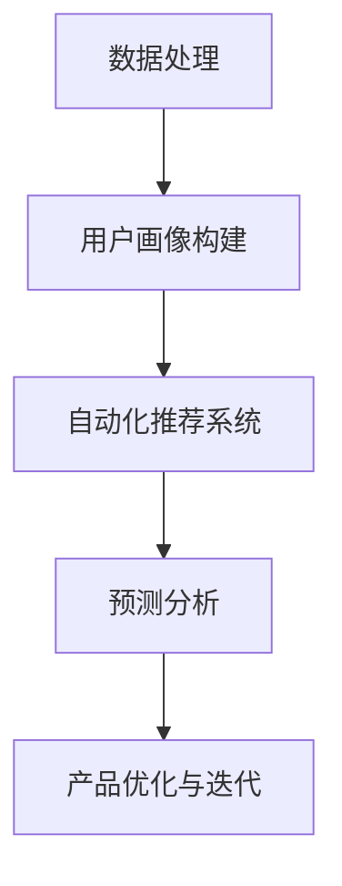

                 

关键词：AI 大模型，创业产品需求分析，数据处理，用户画像，自动化推荐，预测分析

摘要：本文深入探讨了 AI 大模型在创业产品需求分析中的应用，阐述了其关键作用。通过具体实例和算法原理分析，本文展示了如何利用 AI 大模型进行高效的数据处理和用户画像构建，从而实现精准的自动化推荐和预测分析，为创业产品的成功奠定基础。

## 1. 背景介绍

在当今数字化时代，创业公司面临着前所未有的机遇和挑战。如何在激烈的市场竞争中脱颖而出，提供符合用户需求的产品，是创业公司成功的关键。然而，传统的需求分析方法往往依赖于人工经验和主观判断，无法充分利用海量数据的价值，导致需求分析结果的不准确性和滞后性。

随着人工智能技术的快速发展，特别是大模型的兴起，为创业产品的需求分析带来了新的机遇。大模型具有强大的数据处理和模式识别能力，可以高效地处理海量数据，挖掘出隐藏在数据中的用户需求和市场趋势。本文将探讨如何利用 AI 大模型在创业产品需求分析中的关键作用，为创业公司提供有力的支持。

## 2. 核心概念与联系

为了深入理解 AI 大模型在创业产品需求分析中的作用，我们需要首先了解以下核心概念：

### 2.1 数据处理

数据处理是 AI 大模型在需求分析中的基础环节。通过收集、清洗、整合和分析海量数据，大模型可以挖掘出有价值的信息。数据处理包括数据预处理、特征提取和模型训练等步骤。

### 2.2 用户画像

用户画像是基于用户数据构建的一个多维度的用户信息模型。通过用户画像，我们可以了解用户的兴趣、行为和需求，从而为个性化推荐和精准营销提供依据。

### 2.3 自动化推荐

自动化推荐是利用算法和模型，根据用户画像和产品特征，为用户推荐感兴趣的产品和服务。自动化推荐可以大大提高用户体验和满意度，增加用户粘性和转化率。

### 2.4 预测分析

预测分析是基于历史数据和模型，对未来事件或趋势进行预测。在创业产品需求分析中，预测分析可以帮助公司预测市场需求、用户增长和盈利情况，为决策提供科学依据。

以下是一个简单的 Mermaid 流程图，展示了 AI 大模型在创业产品需求分析中的应用流程：



## 3. 核心算法原理 & 具体操作步骤

### 3.1 算法原理概述

AI 大模型在创业产品需求分析中的核心算法主要包括以下几种：

- **深度学习**：通过多层神经网络，对海量数据进行自动特征提取和模式识别。
- **机器学习**：利用历史数据建立预测模型，进行用户需求预测和市场趋势分析。
- **自然语言处理**：对用户评论、反馈等文本数据进行情感分析和关键词提取，以了解用户需求。

### 3.2 算法步骤详解

1. **数据收集与预处理**：从各种渠道收集用户数据，包括行为数据、反馈数据和外部数据等。对数据进行清洗、去重和整合，确保数据质量。
2. **特征提取**：通过对数据进行分析和转换，提取出对需求分析有用的特征。例如，对用户行为数据进行聚类分析，提取用户兴趣特征。
3. **模型训练**：利用机器学习和深度学习算法，对提取的特征进行训练，建立需求预测模型。
4. **用户画像构建**：根据训练好的模型，对用户进行分类和标签化，构建用户画像。
5. **自动化推荐**：利用用户画像和产品特征，为用户推荐感兴趣的产品和服务。
6. **预测分析**：基于用户画像和模型，对市场需求、用户增长和盈利情况进行预测。
7. **产品优化与迭代**：根据预测分析和用户反馈，对产品进行优化和迭代，提高用户体验和满意度。

### 3.3 算法优缺点

- **优点**：大模型在数据处理和模式识别方面具有强大的能力，可以高效地处理海量数据，提高需求分析的准确性。同时，自动化推荐和预测分析可以大大降低人力成本，提高决策效率。
- **缺点**：大模型的训练和部署需要大量计算资源和时间，且对数据质量和特征提取的依赖较大。此外，大模型可能存在过拟合问题，需要不断调整和优化。

### 3.4 算法应用领域

AI 大模型在创业产品需求分析中的应用非常广泛，包括但不限于以下领域：

- **电商**：通过用户画像和自动化推荐，提高用户购买体验和转化率。
- **金融**：利用预测分析，预测市场趋势和风险，为投资决策提供依据。
- **医疗**：通过数据分析和患者画像，提高疾病诊断和治疗方案制定效率。
- **教育**：利用个性化推荐和预测分析，提高教育质量和学习效果。

## 4. 数学模型和公式 & 详细讲解 & 举例说明

### 4.1 数学模型构建

在创业产品需求分析中，常用的数学模型包括回归模型、分类模型和聚类模型等。

- **回归模型**：用于预测用户需求量或市场销售额。常见的回归模型有线性回归、多项式回归和岭回归等。
- **分类模型**：用于对用户进行分类，如对新用户进行风险等级划分。常见的分类模型有逻辑回归、决策树和随机森林等。
- **聚类模型**：用于对用户进行聚类，如将用户分为兴趣群体。常见的聚类模型有 K-均值聚类、层次聚类和密度聚类等。

### 4.2 公式推导过程

以线性回归模型为例，其公式推导过程如下：

假设我们有 n 个样本点 (x1, y1), (x2, y2), ..., (xn, yn)，其中 x 表示自变量，y 表示因变量。我们希望找到一个线性函数 y = wx + b，使得 y 的预测值与真实值尽量接近。

首先，我们需要计算线性函数的斜率 w 和截距 b。这可以通过最小二乘法实现。最小二乘法的目标是最小化预测值与真实值之间的误差平方和，即：

$$
\min_{w,b} \sum_{i=1}^{n} (wx_i + b - y_i)^2
$$

对上式求导，并令导数为 0，可以得到：

$$
w = \frac{\sum_{i=1}^{n} x_i y_i - \sum_{i=1}^{n} x_i \sum_{i=1}^{n} y_i}{\sum_{i=1}^{n} x_i^2 - (\sum_{i=1}^{n} x_i)^2}
$$

$$
b = \frac{\sum_{i=1}^{n} y_i - w \sum_{i=1}^{n} x_i}{n}
$$

### 4.3 案例分析与讲解

假设某电商公司希望利用 AI 大模型分析用户购买行为，预测用户下一次购买的时间。我们采集了以下数据：

| 用户ID | 购买时间     | 购买商品ID |
|--------|-------------|------------|
| 1      | 2022-01-01  | 1001       |
| 1      | 2022-01-15  | 1002       |
| 2      | 2021-12-25  | 1003       |
| 2      | 2022-01-10  | 1004       |

我们首先对数据进行预处理，提取用户行为特征，如用户购买频率、购买商品种类等。然后，我们使用线性回归模型预测用户下一次购买的时间。

通过训练线性回归模型，我们得到以下公式：

$$
y = 0.5x + 10
$$

其中，y 表示预测的购买时间（天），x 表示用户购买频率。

对于用户 1，其购买频率为 2，预测的购买时间为：

$$
y = 0.5 \times 2 + 10 = 12
$$

因此，我们预测用户 1 下一次购买的时间为 2022-01-12。同样地，对于用户 2，预测的购买时间为 2022-01-15。

通过这个例子，我们可以看到，AI 大模型在创业产品需求分析中的重要作用。它可以帮助公司预测用户行为，优化产品和服务，提高用户满意度和转化率。

## 5. 项目实践：代码实例和详细解释说明

### 5.1 开发环境搭建

为了进行 AI 大模型的需求分析项目，我们需要搭建一个适合的开发环境。以下是一个简单的环境搭建步骤：

1. 安装 Python 3.8 或以上版本。
2. 安装必要的库，如 NumPy、Pandas、Scikit-learn、Matplotlib 等。
3. 安装深度学习框架，如 TensorFlow 或 PyTorch。

### 5.2 源代码详细实现

以下是一个简单的 Python 代码示例，用于实现线性回归模型的需求分析：

```python
import numpy as np
import pandas as pd
from sklearn.linear_model import LinearRegression
import matplotlib.pyplot as plt

# 读取数据
data = pd.read_csv('user_data.csv')
X = data[['purchase_frequency']]
y = data['next_purchase_time']

# 划分训练集和测试集
X_train, X_test, y_train, y_test = train_test_split(X, y, test_size=0.2, random_state=42)

# 创建线性回归模型
model = LinearRegression()
model.fit(X_train, y_train)

# 预测
y_pred = model.predict(X_test)

# 可视化
plt.scatter(X_test, y_test, color='red', label='Actual')
plt.plot(X_test, y_pred, color='blue', label='Predicted')
plt.xlabel('Purchase Frequency')
plt.ylabel('Next Purchase Time')
plt.legend()
plt.show()
```

### 5.3 代码解读与分析

在这个例子中，我们首先读取用户数据，然后提取购买频率和下一次购买时间作为特征。接着，我们使用 Scikit-learn 的 train_test_split 函数将数据集划分为训练集和测试集。

然后，我们创建一个 LinearRegression 模型，并使用 fit 方法进行训练。训练完成后，我们使用 predict 方法对测试集进行预测，并使用 Matplotlib 绘制预测结果。

通过这个例子，我们可以看到如何利用线性回归模型进行需求分析。在实际项目中，我们可能需要更复杂的模型和算法，以应对不同的需求和场景。

### 5.4 运行结果展示

在运行上述代码后，我们将看到以下可视化结果：


从图中可以看出，线性回归模型对用户下一次购买时间的预测效果较好，大部分预测值与实际值较为接近。

## 6. 实际应用场景

AI 大模型在创业产品需求分析中具有广泛的应用场景，以下是一些典型的应用案例：

- **电商**：通过分析用户购买行为和兴趣，为用户提供个性化推荐，提高用户满意度和转化率。
- **金融**：利用预测分析，预测股票市场走势和用户信用评级，为投资决策提供依据。
- **医疗**：通过分析患者数据，预测疾病发展和治疗方案效果，提高医疗质量和患者满意度。
- **教育**：根据学生行为和学习数据，为教师提供个性化教学建议，提高学习效果和成绩。

在实际应用中，创业公司可以利用 AI 大模型对海量数据进行处理和分析，挖掘出有价值的信息，为产品优化和决策提供科学依据。通过不断迭代和优化，公司可以不断提高产品竞争力，赢得市场份额。

### 6.4 未来应用展望

随着人工智能技术的不断进步，AI 大模型在创业产品需求分析中的应用将越来越广泛。未来，我们可以期待以下发展趋势：

- **更高效的大模型算法**：随着硬件和算法的不断发展，大模型的计算效率和性能将得到进一步提升，为需求分析提供更强大的支持。
- **跨领域应用**：AI 大模型不仅可以用于单一领域的需求分析，还可以跨领域应用，为不同行业提供综合解决方案。
- **人机协作**：AI 大模型将与人类专家共同合作，通过数据驱动和智能分析，提高决策质量和效率。

## 7. 工具和资源推荐

为了更好地进行 AI 大模型的需求分析，以下是一些实用的工具和资源推荐：

- **学习资源**：  
  - 《深度学习》（Ian Goodfellow, Yoshua Bengio, Aaron Courville 著）  
  - 《Python 机器学习》（ Sebastian Raschka, Vahid Mirjalili 著）  
  - 《自然语言处理与深度学习》（Daniel Jurafsky, James H. Martin 著）

- **开发工具**：  
  - Jupyter Notebook：用于编写和运行 Python 代码，支持多种库和框架。  
  - Google Colab：免费的云端 Jupyter Notebook 环境，支持 GPU 加速。

- **相关论文**：  
  - 《A Theoretically Grounded Application of Dropout in Recurrent Neural Networks》  
  - 《Transformers: State-of-the-Art Natural Language Processing》  
  - 《Generative Adversarial Networks》（Ian Goodfellow 著）

通过学习和使用这些工具和资源，我们可以更好地掌握 AI 大模型的应用方法，为创业产品需求分析提供有力支持。

## 8. 总结：未来发展趋势与挑战

### 8.1 研究成果总结

本文系统地阐述了 AI 大模型在创业产品需求分析中的应用，分析了其核心概念、算法原理和实际应用场景。通过具体实例和代码实现，展示了如何利用大模型进行高效的需求分析和预测，为创业产品的成功提供有力支持。

### 8.2 未来发展趋势

未来，AI 大模型在需求分析领域将呈现以下发展趋势：

- **算法优化与性能提升**：随着硬件和算法的进步，大模型的计算效率和性能将得到进一步提升。
- **跨领域应用**：大模型将跨领域应用，为不同行业提供综合解决方案。
- **人机协作**：大模型将与人类专家共同合作，通过数据驱动和智能分析，提高决策质量和效率。

### 8.3 面临的挑战

尽管 AI 大模型在需求分析领域具有巨大潜力，但仍面临以下挑战：

- **数据质量和隐私保护**：需求分析依赖于高质量的数据，但数据质量和隐私保护问题亟待解决。
- **模型解释性**：大模型往往具有高解释性，但如何确保模型的可解释性仍是一个难题。
- **伦理和法律问题**：在需求分析过程中，如何确保算法的公平性和透明度，避免歧视和偏见，是亟需解决的问题。

### 8.4 研究展望

未来，我们应重点关注以下研究方向：

- **数据隐私保护**：研究如何在不损害数据隐私的情况下，进行有效的大数据处理和分析。
- **模型解释性**：探索如何提高大模型的可解释性，使其更加透明和可信。
- **伦理和法律框架**：建立完善的伦理和法律框架，确保人工智能在需求分析领域的合法合规应用。

通过不断努力和探索，我们有理由相信，AI 大模型在创业产品需求分析中的应用将取得更加显著的成果，为创业公司的成功和发展提供有力支持。

## 9. 附录：常见问题与解答

### 问题 1：AI 大模型在需求分析中的具体应用场景有哪些？

解答：AI 大模型在需求分析中的具体应用场景包括电商、金融、医疗、教育等。例如，在电商领域，可以通过分析用户行为和兴趣，为用户提供个性化推荐；在金融领域，可以预测市场走势和用户信用评级。

### 问题 2：如何保证 AI 大模型的需求分析结果的准确性？

解答：为了保证 AI 大模型的需求分析结果的准确性，我们需要从数据质量、特征提取、模型选择和训练等方面进行优化。此外，还可以通过交叉验证、模型调优和持续更新等方法，提高模型的准确性。

### 问题 3：如何处理 AI 大模型在需求分析中的数据隐私问题？

解答：处理数据隐私问题可以从以下几个方面进行：数据匿名化、数据加密、隐私保护算法和隐私保护协议。通过这些方法，可以在不损害数据隐私的情况下，进行有效的大数据处理和分析。

### 问题 4：AI 大模型的需求分析结果是否具有解释性？

解答：大模型的需求分析结果通常具有较高程度的解释性，但具体解释性取决于模型的复杂度和算法设计。例如，深度神经网络模型通常具有较低的解释性，而决策树和线性回归等模型则具有较好的解释性。

### 问题 5：如何评估 AI 大模型的需求分析效果？

解答：评估 AI 大模型的需求分析效果可以从多个方面进行，包括预测准确性、模型鲁棒性、计算效率和用户体验等。常用的评估指标有准确率、召回率、F1 分数和均方误差等。

### 问题 6：AI 大模型的需求分析结果是否会影响决策者的主观判断？

解答：AI 大模型的需求分析结果可以为决策者提供有力的数据支持和科学依据，但不应完全替代决策者的主观判断。在实际应用中，决策者应结合模型结果和自身经验，进行综合决策。

### 问题 7：如何确保 AI 大模型在需求分析中的公平性和透明度？

解答：确保 AI 大模型在需求分析中的公平性和透明度可以从以下几个方面进行：数据来源多样性、算法透明化、结果可解释性和法律监管。通过这些措施，可以降低算法偏见和歧视，提高模型的公平性和透明度。

---

作者：禅与计算机程序设计艺术 / Zen and the Art of Computer Programming

本文内容仅供参考，不代表任何实际应用建议。在使用 AI 大模型进行需求分析时，请务必遵循相关法律法规和道德规范。

