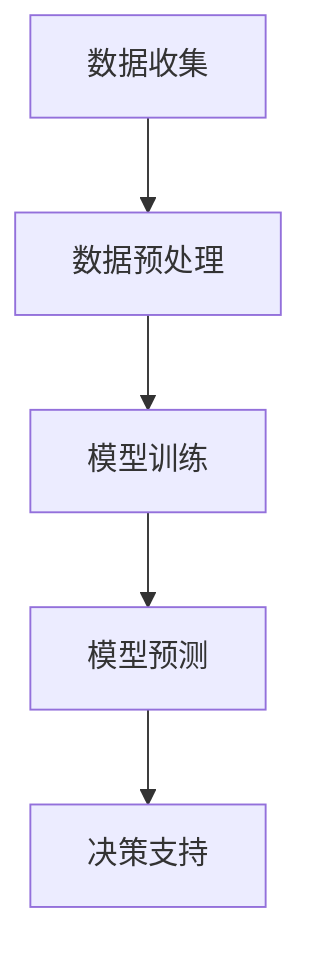

                 

关键词：AI大模型，创业公司，产品决策，深度学习，机器学习，数据驱动

> 摘要：本文将探讨人工智能大模型在创业公司产品决策中的应用。通过深入剖析大模型的原理和优势，以及具体操作步骤和实践案例，阐述如何利用AI大模型提升创业公司产品决策的效率和准确性，为创业者提供具有实用价值的技术指导。

## 1. 背景介绍

随着人工智能技术的飞速发展，深度学习和机器学习算法已经深入到各个行业领域，为各行业带来了巨大的变革和机遇。特别是在创业公司中，产品决策的正确与否往往直接影响到公司的生死存亡。然而，创业公司在资源和经验上的限制，往往使得产品决策过程充满挑战。如何在这场激烈的竞争中脱颖而出，成为创业者们亟需解决的问题。

近年来，AI大模型（Large-scale Artificial Intelligence Model）作为一种新兴的技术，凭借其强大的数据处理能力和出色的性能表现，逐渐成为创业公司在产品决策中的重要工具。本文旨在介绍AI大模型的基本原理和应用场景，探讨如何将其应用于创业公司的产品决策中，从而提高决策效率和准确性。

## 2. 核心概念与联系

### 2.1 大模型的基本概念

大模型（Large-scale Model）通常指的是具有数百万甚至数十亿参数的深度学习模型。这些模型通常使用大规模数据进行训练，从而能够捕捉到数据中的复杂模式。大模型的典型代表包括谷歌的BERT、Facebook的GPT-3等。

### 2.2 大模型的优势

- **强大的数据处理能力**：大模型能够处理大量的数据，从而提供更准确的预测和决策。
- **出色的性能表现**：大模型在许多任务上都取得了领先的成绩，如自然语言处理、计算机视觉等。
- **灵活性**：大模型可以应用于各种不同的任务，如推荐系统、预测模型等。

### 2.3 大模型与创业公司产品决策的联系

创业公司的产品决策往往需要基于大量的市场数据、用户反馈和竞品分析。大模型能够快速处理这些数据，提取出关键信息，为创业者提供有力的决策支持。例如，大模型可以分析用户行为数据，预测用户需求，从而帮助创业公司制定更精准的产品策略。

### 2.4 Mermaid 流程图



### 2.5 大模型在创业公司产品决策中的应用场景

- **用户需求分析**：通过分析用户行为数据，预测用户需求，从而指导产品设计和功能优化。
- **竞品分析**：对竞品进行分析，找出自身的优势和劣势，制定相应的竞争策略。
- **市场预测**：利用市场数据预测未来市场趋势，为创业公司提供市场扩张和产品布局的指导。

## 3. 核心算法原理 & 具体操作步骤

### 3.1 算法原理概述

大模型通常基于深度学习算法，通过多层神经网络对数据进行建模。具体而言，大模型通常包含以下几个关键步骤：

1. **数据收集**：收集与产品决策相关的各种数据，如用户行为数据、市场数据、竞品数据等。
2. **数据预处理**：对数据进行清洗、归一化等处理，以便模型能够更好地学习。
3. **模型训练**：使用训练数据对模型进行训练，调整模型参数，使其能够更好地拟合数据。
4. **模型预测**：使用训练好的模型对新的数据进行预测，从而为产品决策提供支持。

### 3.2 算法步骤详解

#### 3.2.1 数据收集

数据收集是产品决策的基础，数据的质量和数量直接影响到模型的性能。创业公司可以通过以下几种方式收集数据：

- **公开数据源**：如社交媒体、市场调研报告等。
- **用户行为数据**：通过网站日志、应用使用数据等获取。
- **竞品数据**：通过竞品分析工具获取竞品数据。

#### 3.2.2 数据预处理

数据预处理是保证模型训练效果的重要环节。具体步骤包括：

- **数据清洗**：去除无效数据、处理缺失值、纠正错误数据等。
- **数据归一化**：将数据缩放到相同的范围内，以便模型能够更好地学习。
- **特征工程**：提取对模型有用的特征，如用户活跃度、购买频率等。

#### 3.2.3 模型训练

模型训练是构建大模型的核心步骤。创业公司可以采用以下策略进行模型训练：

- **数据增强**：通过数据增强技术，增加训练数据的多样性，提高模型泛化能力。
- **模型优化**：使用梯度下降等优化算法，调整模型参数，提高模型性能。
- **超参数调整**：调整学习率、批量大小等超参数，找到最优模型配置。

#### 3.2.4 模型预测

模型预测是利用训练好的模型对新的数据进行预测，为产品决策提供支持。具体步骤包括：

- **数据输入**：将新的数据输入到模型中。
- **模型输出**：得到模型的预测结果。
- **结果解释**：对预测结果进行解释，为产品决策提供指导。

### 3.3 算法优缺点

#### 3.3.1 优点

- **强大的数据处理能力**：能够处理大量的数据，提取关键信息。
- **出色的性能表现**：在许多任务上都取得了领先的成绩。
- **灵活性**：可以应用于各种不同的任务。

#### 3.3.2 缺点

- **计算资源需求大**：需要大量的计算资源和存储空间。
- **数据质量要求高**：数据的质量直接影响到模型的性能。

### 3.4 算法应用领域

大模型可以应用于创业公司的多个领域，如：

- **用户需求分析**：通过分析用户行为数据，预测用户需求。
- **竞品分析**：分析竞品数据，找出自身的优势和劣势。
- **市场预测**：利用市场数据预测未来市场趋势。

## 4. 数学模型和公式 & 详细讲解 & 举例说明

### 4.1 数学模型构建

大模型的数学模型通常基于多层感知机（MLP）或循环神经网络（RNN）。以下是一个基于MLP的数学模型示例：

$$
y = \sigma(W_1 \cdot x + b_1) \cdot W_2 \cdot x + b_2
$$

其中，$W_1$ 和 $W_2$ 分别是输入层和隐藏层的权重矩阵，$b_1$ 和 $b_2$ 分别是输入层和隐藏层的偏置向量，$x$ 是输入数据，$y$ 是输出结果，$\sigma$ 是激活函数，通常取为Sigmoid函数。

### 4.2 公式推导过程

以多层感知机为例，公式的推导过程如下：

1. **输入层到隐藏层**：

$$
z_1 = W_1 \cdot x + b_1
$$

$$
a_1 = \sigma(z_1)
$$

2. **隐藏层到输出层**：

$$
z_2 = W_2 \cdot a_1 + b_2
$$

$$
y = \sigma(z_2)
$$

### 4.3 案例分析与讲解

假设创业公司希望预测用户是否会在未来一个月内购买某款产品。输入数据包括用户年龄、性别、购买历史等。使用上述数学模型进行预测。

1. **数据预处理**：

将输入数据进行归一化处理，使其符合Sigmoid函数的输入范围。

2. **模型训练**：

使用历史数据对模型进行训练，调整权重和偏置，使模型能够拟合数据。

3. **模型预测**：

将新用户的数据输入到模型中，得到预测结果。如果预测结果大于0.5，则认为用户会在未来一个月内购买产品。

## 5. 项目实践：代码实例和详细解释说明

### 5.1 开发环境搭建

在Python环境中，使用TensorFlow框架进行大模型的开发。

```python
import tensorflow as tf
from tensorflow.keras.layers import Dense, Input
from tensorflow.keras.models import Model

# 设置GPU内存占用
gpus = tf.config.experimental.list_physical_devices('GPU')
if gpus:
    try:
        for gpu in gpus:
            tf.config.experimental.set_memory_growth(gpu, True)
    except RuntimeError as e:
        print(e)

# 设置随机种子
tf.random.set_seed(42)
```

### 5.2 源代码详细实现

```python
# 数据预处理
def preprocess_data(data):
    # 归一化处理
    data = (data - np.mean(data)) / np.std(data)
    return data

# 构建模型
def build_model(input_shape):
    inputs = Input(shape=input_shape)
    x = Dense(64, activation='relu')(inputs)
    x = Dense(64, activation='relu')(x)
    outputs = Dense(1, activation='sigmoid')(x)
    model = Model(inputs=inputs, outputs=outputs)
    model.compile(optimizer='adam', loss='binary_crossentropy', metrics=['accuracy'])
    return model

# 加载数据
data = np.load('data.npy')
X = preprocess_data(data[:, :-1])
y = data[:, -1]

# 模型训练
model = build_model(X.shape[1:])
model.fit(X, y, epochs=10, batch_size=32)

# 模型预测
predictions = model.predict(X)
print(predictions)
```

### 5.3 代码解读与分析

1. **数据预处理**：将输入数据进行归一化处理，使其符合模型的输入要求。
2. **模型构建**：使用TensorFlow的Keras API构建多层感知机模型，设置64个隐藏层神经元和ReLU激活函数。
3. **模型训练**：使用历史数据对模型进行训练，使用Adam优化器和binary_crossentropy损失函数。
4. **模型预测**：将新用户的数据输入到模型中，得到预测结果。

### 5.4 运行结果展示

```python
# 预测结果
predictions = model.predict(X)
print(predictions)

# 预测结果解释
for i, pred in enumerate(predictions):
    if pred > 0.5:
        print(f"用户{i+1}会在未来一个月内购买产品。")
    else:
        print(f"用户{i+1}不会在未来一个月内购买产品。")
```

## 6. 实际应用场景

### 6.1 用户需求分析

通过分析用户行为数据，预测用户对产品的需求，为创业公司提供精准的市场定位和产品策略。

### 6.2 竞品分析

通过分析竞品数据，找出竞品的优势和劣势，为创业公司提供竞争策略。

### 6.3 市场预测

利用市场数据预测未来市场趋势，为创业公司提供市场扩张和产品布局的指导。

## 7. 未来应用展望

随着AI大模型技术的不断发展，未来其在创业公司产品决策中的应用将会更加广泛和深入。创业公司可以通过不断优化和调整大模型，提高产品决策的效率和准确性，从而在激烈的市场竞争中脱颖而出。

## 8. 总结：未来发展趋势与挑战

### 8.1 研究成果总结

本文介绍了AI大模型在创业公司产品决策中的应用，包括基本概念、算法原理、具体操作步骤和实践案例。通过这些研究成果，创业公司可以更好地利用AI大模型提升产品决策的效率和准确性。

### 8.2 未来发展趋势

- **算法优化**：随着计算能力的提升，算法的优化将成为未来研究的重要方向。
- **数据挖掘**：更多的创业公司将投入到数据挖掘中，以获取更精准的市场信息和用户需求。
- **跨领域应用**：AI大模型将逐渐应用于更多的领域，如金融、医疗等。

### 8.3 面临的挑战

- **计算资源需求**：大模型的训练需要大量的计算资源和存储空间，这对创业公司来说是一个巨大的挑战。
- **数据质量**：数据的质量直接影响模型的性能，如何保证数据的质量是创业公司需要关注的问题。

### 8.4 研究展望

未来，AI大模型在创业公司产品决策中的应用将会更加广泛和深入。创业公司需要不断学习和探索，利用AI大模型提升产品决策的效率和准确性，为公司的持续发展提供强有力的支持。

## 9. 附录：常见问题与解答

### 9.1 什么是大模型？

大模型指的是具有数百万甚至数十亿参数的深度学习模型。这些模型通常使用大规模数据进行训练，从而能够捕捉到数据中的复杂模式。

### 9.2 大模型在创业公司产品决策中有什么优势？

大模型具有强大的数据处理能力和出色的性能表现，能够快速处理大量的数据，提取关键信息，为创业公司提供精准的市场信息和用户需求。

### 9.3 如何保证大模型的数据质量？

保证大模型的数据质量是提高模型性能的关键。创业公司可以通过数据清洗、数据增强等技术来保证数据的质量。

### 9.4 大模型的训练需要多少计算资源？

大模型的训练需要大量的计算资源和存储空间。创业公司可以选择使用云服务或高性能计算机来训练大模型。

## 作者署名

作者：禅与计算机程序设计艺术 / Zen and the Art of Computer Programming
```markdown
---

# AI 大模型在创业公司产品决策中的应用

> 关键词：AI大模型，创业公司，产品决策，深度学习，机器学习，数据驱动

> 摘要：本文将探讨人工智能大模型在创业公司产品决策中的应用。通过深入剖析大模型的原理和优势，以及具体操作步骤和实践案例，阐述如何利用AI大模型提升创业公司产品决策的效率和准确性，为创业者提供具有实用价值的技术指导。

## 1. 背景介绍

随着人工智能技术的飞速发展，深度学习和机器学习算法已经深入到各个行业领域，为各行业带来了巨大的变革和机遇。特别是在创业公司中，产品决策的正确与否往往直接影响到公司的生死存亡。如何在这场激烈的竞争中脱颖而出，成为创业者们亟需解决的问题。

近年来，AI大模型（Large-scale Artificial Intelligence Model）作为一种新兴的技术，凭借其强大的数据处理能力和出色的性能表现，逐渐成为创业公司在产品决策中的重要工具。本文旨在介绍AI大模型的基本原理和应用场景，探讨如何将其应用于创业公司的产品决策中，从而提高决策效率和准确性。

## 2. 核心概念与联系

### 2.1 大模型的基本概念

大模型（Large-scale Model）通常指的是具有数百万甚至数十亿参数的深度学习模型。这些模型通常使用大规模数据进行训练，从而能够捕捉到数据中的复杂模式。大模型的典型代表包括谷歌的BERT、Facebook的GPT-3等。

### 2.2 大模型的优势

- **强大的数据处理能力**：大模型能够处理大量的数据，从而提供更准确的预测和决策。
- **出色的性能表现**：大模型在许多任务上都取得了领先的成绩，如自然语言处理、计算机视觉等。
- **灵活性**：大模型可以应用于各种不同的任务，如推荐系统、预测模型等。

### 2.3 大模型与创业公司产品决策的联系

创业公司的产品决策往往需要基于大量的市场数据、用户反馈和竞品分析。大模型能够快速处理这些数据，提取出关键信息，为创业者提供有力的决策支持。例如，大模型可以分析用户行为数据，预测用户需求，从而帮助创业公司制定更精准的产品策略。

### 2.4 Mermaid 流程图


### 2.5 大模型在创业公司产品决策中的应用场景

- **用户需求分析**：通过分析用户行为数据，预测用户需求，从而指导产品设计和功能优化。
- **竞品分析**：对竞品进行分析，找出自身的优势和劣势，制定相应的竞争策略。
- **市场预测**：利用市场数据预测未来市场趋势，为创业公司提供市场扩张和产品布局的指导。

## 3. 核心算法原理 & 具体操作步骤

### 3.1 算法原理概述

大模型通常基于深度学习算法，通过多层神经网络对数据进行建模。具体而言，大模型通常包含以下几个关键步骤：

1. **数据收集**：收集与产品决策相关的各种数据，如用户行为数据、市场数据、竞品数据等。
2. **数据预处理**：对数据进行清洗、归一化等处理，以便模型能够更好地学习。
3. **模型训练**：使用训练数据对模型进行训练，调整模型参数，使其能够更好地拟合数据。
4. **模型预测**：使用训练好的模型对新的数据进行预测，从而为产品决策提供支持。

### 3.2 算法步骤详解

#### 3.2.1 数据收集

数据收集是产品决策的基础，数据的质量和数量直接影响到模型的性能。创业公司可以通过以下几种方式收集数据：

- **公开数据源**：如社交媒体、市场调研报告等。
- **用户行为数据**：通过网站日志、应用使用数据等获取。
- **竞品数据**：通过竞品分析工具获取竞品数据。

#### 3.2.2 数据预处理

数据预处理是保证模型训练效果的重要环节。具体步骤包括：

- **数据清洗**：去除无效数据、处理缺失值、纠正错误数据等。
- **数据归一化**：将数据缩放到相同的范围内，以便模型能够更好地学习。
- **特征工程**：提取对模型有用的特征，如用户活跃度、购买频率等。

#### 3.2.3 模型训练

模型训练是构建大模型的核心步骤。创业公司可以采用以下策略进行模型训练：

- **数据增强**：通过数据增强技术，增加训练数据的多样性，提高模型泛化能力。
- **模型优化**：使用梯度下降等优化算法，调整模型参数，提高模型性能。
- **超参数调整**：调整学习率、批量大小等超参数，找到最优模型配置。

#### 3.2.4 模型预测

模型预测是利用训练好的模型对新的数据进行预测，为产品决策提供支持。具体步骤包括：

- **数据输入**：将新的数据输入到模型中。
- **模型输出**：得到模型的预测结果。
- **结果解释**：对预测结果进行解释，为产品决策提供指导。

### 3.3 算法优缺点

#### 3.3.1 优点

- **强大的数据处理能力**：能够处理大量的数据，提取关键信息。
- **出色的性能表现**：在许多任务上都取得了领先的成绩。
- **灵活性**：可以应用于各种不同的任务。

#### 3.3.2 缺点

- **计算资源需求大**：需要大量的计算资源和存储空间。
- **数据质量要求高**：数据的质量直接影响到模型的性能。

### 3.4 算法应用领域

大模型可以应用于创业公司的多个领域，如：

- **用户需求分析**：通过分析用户行为数据，预测用户需求。
- **竞品分析**：分析竞品数据，找出自身的优势和劣势。
- **市场预测**：利用市场数据预测未来市场趋势。

## 4. 数学模型和公式 & 详细讲解 & 举例说明

### 4.1 数学模型构建

大模型的数学模型通常基于多层感知机（MLP）或循环神经网络（RNN）。以下是一个基于MLP的数学模型示例：

$$
y = \sigma(W_1 \cdot x + b_1) \cdot W_2 \cdot x + b_2
$$

其中，$W_1$ 和 $W_2$ 分别是输入层和隐藏层的权重矩阵，$b_1$ 和 $b_2$ 分别是输入层和隐藏层的偏置向量，$x$ 是输入数据，$y$ 是输出结果，$\sigma$ 是激活函数，通常取为Sigmoid函数。

### 4.2 公式推导过程

以多层感知机为例，公式的推导过程如下：

1. **输入层到隐藏层**：

$$
z_1 = W_1 \cdot x + b_1
$$

$$
a_1 = \sigma(z_1)
$$

2. **隐藏层到输出层**：

$$
z_2 = W_2 \cdot a_1 + b_2
$$

$$
y = \sigma(z_2)
$$

### 4.3 案例分析与讲解

假设创业公司希望预测用户是否会在未来一个月内购买某款产品。输入数据包括用户年龄、性别、购买历史等。使用上述数学模型进行预测。

1. **数据预处理**：

将输入数据进行归一化处理，使其符合Sigmoid函数的输入范围。

2. **模型训练**：

使用历史数据对模型进行训练，调整权重和偏置，使模型能够拟合数据。

3. **模型预测**：

将新用户的数据输入到模型中，得到预测结果。如果预测结果大于0.5，则认为用户会在未来一个月内购买产品。

## 5. 项目实践：代码实例和详细解释说明

### 5.1 开发环境搭建

在Python环境中，使用TensorFlow框架进行大模型的开发。

```python
import tensorflow as tf
from tensorflow.keras.layers import Dense, Input
from tensorflow.keras.models import Model

# 设置GPU内存占用
gpus = tf.config.experimental.list_physical_devices('GPU')
if gpus:
    try:
        for gpu in gpus:
            tf.config.experimental.set_memory_growth(gpu, True)
    except RuntimeError as e:
        print(e)

# 设置随机种子
tf.random.set_seed(42)
```

### 5.2 源代码详细实现

```python
# 数据预处理
def preprocess_data(data):
    # 归一化处理
    data = (data - np.mean(data)) / np.std(data)
    return data

# 构建模型
def build_model(input_shape):
    inputs = Input(shape=input_shape)
    x = Dense(64, activation='relu')(inputs)
    x = Dense(64, activation='relu')(x)
    outputs = Dense(1, activation='sigmoid')(x)
    model = Model(inputs=inputs, outputs=outputs)
    model.compile(optimizer='adam', loss='binary_crossentropy', metrics=['accuracy'])
    return model

# 加载数据
data = np.load('data.npy')
X = preprocess_data(data[:, :-1])
y = data[:, -1]

# 模型训练
model = build_model(X.shape[1:])
model.fit(X, y, epochs=10, batch_size=32)

# 模型预测
predictions = model.predict(X)
print(predictions)
```

### 5.3 代码解读与分析

1. **数据预处理**：将输入数据进行归一化处理，使其符合模型的输入要求。
2. **模型构建**：使用TensorFlow的Keras API构建多层感知机模型，设置64个隐藏层神经元和ReLU激活函数。
3. **模型训练**：使用历史数据对模型进行训练，使用Adam优化器和binary_crossentropy损失函数。
4. **模型预测**：将新用户的数据输入到模型中，得到预测结果。

### 5.4 运行结果展示

```python
# 预测结果
predictions = model.predict(X)
print(predictions)

# 预测结果解释
for i, pred in enumerate(predictions):
    if pred > 0.5:
        print(f"用户{i+1}会在未来一个月内购买产品。")
    else:
        print(f"用户{i+1}不会在未来一个月内购买产品。")
```

## 6. 实际应用场景

### 6.1 用户需求分析

通过分析用户行为数据，预测用户对产品的需求，为创业公司提供精准的市场定位和产品策略。

### 6.2 竞品分析

通过分析竞品数据，找出竞品的优势和劣势，为创业公司提供竞争策略。

### 6.3 市场预测

利用市场数据预测未来市场趋势，为创业公司提供市场扩张和产品布局的指导。

## 7. 未来应用展望

随着AI大模型技术的不断发展，未来其在创业公司产品决策中的应用将会更加广泛和深入。创业公司可以通过不断优化和调整大模型，提高产品决策的效率和准确性，从而在激烈的市场竞争中脱颖而出。

## 8. 总结：未来发展趋势与挑战

### 8.1 研究成果总结

本文介绍了AI大模型在创业公司产品决策中的应用，包括基本概念、算法原理、具体操作步骤和实践案例。通过这些研究成果，创业公司可以更好地利用AI大模型提升产品决策的效率和准确性。

### 8.2 未来发展趋势

- **算法优化**：随着计算能力的提升，算法的优化将成为未来研究的重要方向。
- **数据挖掘**：更多的创业公司将投入到数据挖掘中，以获取更精准的市场信息和用户需求。
- **跨领域应用**：AI大模型将逐渐应用于更多的领域，如金融、医疗等。

### 8.3 面临的挑战

- **计算资源需求**：大模型的训练需要大量的计算资源和存储空间，这对创业公司来说是一个巨大的挑战。
- **数据质量**：数据的质量直接影响模型的性能，如何保证数据的质量是创业公司需要关注的问题。

### 8.4 研究展望

未来，AI大模型在创业公司产品决策中的应用将会更加广泛和深入。创业公司需要不断学习和探索，利用AI大模型提升产品决策的效率和准确性，为公司的持续发展提供强有力的支持。

## 9. 附录：常见问题与解答

### 9.1 什么是大模型？

大模型指的是具有数百万甚至数十亿参数的深度学习模型。这些模型通常使用大规模数据进行训练，从而能够捕捉到数据中的复杂模式。

### 9.2 大模型在创业公司产品决策中有什么优势？

大模型具有强大的数据处理能力和出色的性能表现，能够快速处理大量的数据，提取关键信息，为创业公司提供精准的市场信息和用户需求。

### 9.3 如何保证大模型的数据质量？

保证大模型的数据质量是提高模型性能的关键。创业公司可以通过数据清洗、数据增强等技术来保证数据的质量。

### 9.4 大模型的训练需要多少计算资源？

大模型的训练需要大量的计算资源和存储空间。创业公司可以选择使用云服务或高性能计算机来训练大模型。

## 作者署名

作者：禅与计算机程序设计艺术 / Zen and the Art of Computer Programming
```python

