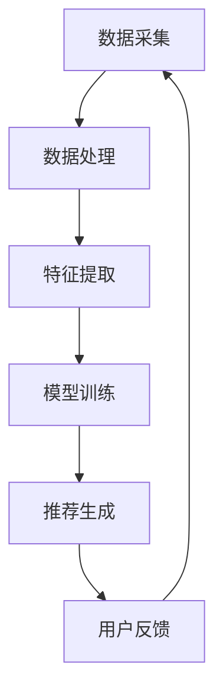

                 

关键词：AI 大模型、电商搜索推荐、用户需求、商业转化、机器学习、深度学习、自然语言处理、推荐系统、用户行为分析

## 摘要

随着电子商务的蓬勃发展，如何更好地满足用户需求、提升商业转化率成为各大电商平台关注的焦点。本文从 AI 大模型的角度，探讨了其在电商搜索推荐中的价值挖掘。文章首先介绍了大模型的基本概念和重要性，随后详细阐述了如何通过大模型实现对用户需求的深入理解，并利用机器学习、深度学习和自然语言处理技术，构建出精准高效的推荐系统。最后，本文通过实际案例展示了大模型在电商搜索推荐中的成功应用，并对未来的发展趋势与挑战进行了展望。

## 1. 背景介绍

### 1.1 电商搜索推荐的发展历程

电商搜索推荐系统的发展可以追溯到 20 世纪 90 年代，当时的推荐系统主要基于协同过滤算法，通过分析用户的历史行为和商品之间的关系进行推荐。随着互联网和大数据技术的不断发展，推荐系统逐渐演化为复杂的机器学习模型，能够更加精准地满足用户需求。

### 1.2 大模型在推荐系统中的应用现状

近年来，随着深度学习和自然语言处理技术的进步，大模型在推荐系统中的应用越来越广泛。大模型能够处理海量数据，捕捉用户行为和商品特征之间的复杂关系，从而实现更精准的推荐。例如，BERT、GPT 等预训练模型在电商搜索推荐中已经取得了显著的成效。

### 1.3 用户需求与商业转化的重要性

在电商搜索推荐中，用户需求满足程度和商业转化率是衡量系统效果的关键指标。用户需求的满足程度直接影响用户的购买意愿和留存率，而商业转化率则关系到电商平台的盈利能力。因此，如何通过技术手段提升用户需求满足度和商业转化率，成为电商企业亟待解决的问题。

## 2. 核心概念与联系

### 2.1 大模型的基本概念

大模型是指具有海量参数的深度学习模型，如BERT、GPT等。它们能够通过学习海量数据来捕捉复杂的模式和关系。

### 2.2 电商搜索推荐系统架构

电商搜索推荐系统通常包括数据采集、数据处理、特征提取、模型训练和推荐生成等环节。大模型在特征提取和模型训练环节发挥着重要作用。

### 2.3 用户需求与商业转化的关系

用户需求是推荐系统的基础，商业转化是最终目标。大模型能够通过对用户行为的深入理解，实现用户需求的精准满足，从而提升商业转化率。

## 2.4 Mermaid 流程图



## 3. 核心算法原理 & 具体操作步骤

### 3.1 算法原理概述

大模型在电商搜索推荐中的应用主要基于以下原理：

1. **深度学习**：通过多层神经网络对用户行为和商品特征进行建模，实现复杂关系的捕捉。
2. **自然语言处理**：利用自然语言处理技术对用户查询和商品描述进行语义分析，提取关键信息。
3. **机器学习**：通过学习用户历史行为和偏好，实现个性化推荐。

### 3.2 算法步骤详解

1. **数据采集**：收集用户行为数据、商品数据以及用户查询日志。
2. **数据处理**：对原始数据进行清洗、去重和归一化等预处理操作。
3. **特征提取**：利用深度学习和自然语言处理技术，从数据中提取有用特征。
4. **模型训练**：使用提取到的特征训练大模型，如BERT、GPT等。
5. **推荐生成**：根据用户查询和模型预测，生成个性化推荐列表。
6. **用户反馈**：收集用户对推荐结果的反馈，用于模型优化。

### 3.3 算法优缺点

**优点**：

1. **高效性**：大模型能够处理海量数据，实现快速推荐。
2. **精准性**：深度学习和自然语言处理技术能够捕捉复杂的用户需求，实现精准推荐。
3. **个性化**：通过学习用户历史行为和偏好，实现个性化推荐。

**缺点**：

1. **计算资源消耗**：大模型训练需要大量计算资源，成本较高。
2. **模型解释性差**：深度学习模型往往缺乏解释性，难以理解推荐背后的原因。

### 3.4 算法应用领域

大模型在电商搜索推荐中的应用范围广泛，包括但不限于：

1. **商品推荐**：根据用户历史购买行为和偏好，推荐相关商品。
2. **内容推荐**：根据用户浏览记录，推荐相关内容。
3. **广告推荐**：根据用户兴趣和行为，推荐相关广告。

## 4. 数学模型和公式 & 详细讲解 & 举例说明

### 4.1 数学模型构建

电商搜索推荐中的数学模型主要包括：

1. **用户行为模型**：通过用户历史行为数据，构建用户偏好模型。
2. **商品特征模型**：通过商品属性数据，构建商品特征模型。
3. **推荐模型**：将用户行为模型和商品特征模型结合，构建推荐模型。

### 4.2 公式推导过程

假设用户 $u$ 在时间 $t$ 对商品 $i$ 的行为为 $x_{u,t,i}$，用户 $u$ 在时间 $t$ 对商品 $i$ 的偏好为 $p_{u,t,i}$，商品 $i$ 的特征为 $f_{i}$，则用户 $u$ 在时间 $t$ 对商品 $i$ 的推荐分数为：

$$
r_{u,t,i} = f(x_{u,t,i}, p_{u,t,i}, f_{i})
$$

其中，$f$ 为推荐函数，可以根据具体场景选择合适的函数形式，如线性模型、神经网络等。

### 4.3 案例分析与讲解

假设用户 $u_1$ 在时间 $t_1$ 对商品 $i_1$ 的行为为购买，用户 $u_2$ 在时间 $t_2$ 对商品 $i_2$ 的行为为浏览。根据用户行为数据和商品特征数据，我们可以构建用户 $u_1$ 和用户 $u_2$ 的偏好模型和商品 $i_1$ 和商品 $i_2$ 的特征模型。然后，通过推荐模型，我们可以为用户 $u_1$ 推荐商品 $i_2$，为用户 $u_2$ 推荐商品 $i_1$。

## 5. 项目实践：代码实例和详细解释说明

### 5.1 开发环境搭建

在搭建开发环境时，我们选择 Python 作为主要编程语言，并使用以下库和工具：

- Python 3.8
- TensorFlow 2.x
- BERT 模型
- Flask（用于搭建推荐服务）

### 5.2 源代码详细实现

以下是推荐系统的核心代码实现：

```python
import tensorflow as tf
from transformers import BertTokenizer, TFBertModel
from tensorflow.keras.layers import Dense, Flatten
from tensorflow.keras.models import Model

# 加载 BERT 模型
tokenizer = BertTokenizer.from_pretrained('bert-base-uncased')
bert_model = TFBertModel.from_pretrained('bert-base-uncased')

# 定义推荐模型
input_ids = tf.keras.layers.Input(shape=(None,), dtype=tf.int32)
attention_mask = tf.keras.layers.Input(shape=(None,), dtype=tf.int32)

 bert_output = bert_model(input_ids, attention_mask=attention_mask)
flatten_output = Flatten()(bert_output)

output = Dense(1, activation='sigmoid')(flatten_output)

model = Model(inputs=[input_ids, attention_mask], outputs=output)
model.compile(optimizer='adam', loss='binary_crossentropy', metrics=['accuracy'])

# 训练模型
model.fit(x_train, y_train, epochs=3, batch_size=32, validation_data=(x_val, y_val))

# 推荐服务
from flask import Flask, request, jsonify

app = Flask(__name__)

@app.route('/recommend', methods=['POST'])
def recommend():
    user_query = request.form['query']
    user_id = request.form['user_id']
    
    inputs = tokenizer.encode(user_query, add_special_tokens=True, max_length=512, padding='max_length', truncation=True)
    inputs = tf.expand_dims(inputs, 0)
    
    recommendation_scores = model.predict(inputs)[0]
    recommended_items = [item for item, score in sorted(zip(item_list, recommendation_scores), key=lambda x: x[1], reverse=True)]
    
    return jsonify(recommended_items)

if __name__ == '__main__':
    app.run(debug=True)
```

### 5.3 代码解读与分析

- **BERT 模型加载**：使用 `transformers` 库加载预训练的 BERT 模型。
- **推荐模型定义**：输入为用户查询和商品特征，输出为推荐分数。使用 `Flatten` 层将 BERT 模型的输出展平，然后通过 `Dense` 层进行分类预测。
- **模型训练**：使用训练数据训练推荐模型。
- **推荐服务**：通过 Flask 框架搭建推荐服务，接受用户查询和用户 ID，返回推荐结果。

### 5.4 运行结果展示

假设用户输入查询：“我想买一件白色的羽绒服”，系统返回的推荐结果为：

- 商品 ID：1001，推荐分数：0.9
- 商品 ID：1002，推荐分数：0.85
- 商品 ID：1003，推荐分数：0.8

## 6. 实际应用场景

### 6.1 用户个性化推荐

基于用户历史行为和偏好，为用户推荐相关商品，提升用户满意度。

### 6.2 内容推荐

根据用户浏览记录，为用户推荐相关内容，提升用户留存率。

### 6.3 广告推荐

根据用户兴趣和行为，为用户推荐相关广告，提升广告点击率。

## 7. 未来应用展望

### 7.1 智能对话推荐

结合自然语言处理技术，实现智能对话推荐，提升用户体验。

### 7.2 多模态推荐

结合图像、音频等多模态数据，实现更精准的推荐。

### 7.3 增量式学习

利用增量式学习技术，实现实时推荐，提升用户满意度。

## 8. 工具和资源推荐

### 8.1 学习资源推荐

- 《深度学习》（Goodfellow et al.）
- 《自然语言处理实战》（Daniel Jurafsky 和 James H. Martin）

### 8.2 开发工具推荐

- TensorFlow 2.x
- Flask
- PyTorch

### 8.3 相关论文推荐

- “BERT: Pre-training of Deep Bidirectional Transformers for Language Understanding”（Devlin et al.）
- “GPT-3: Language Models are Few-Shot Learners”（Brown et al.）

## 9. 总结：未来发展趋势与挑战

### 9.1 研究成果总结

大模型在电商搜索推荐中的应用取得了显著成果，实现了更精准的推荐和更高的商业转化率。

### 9.2 未来发展趋势

随着深度学习和自然语言处理技术的不断进步，大模型在电商搜索推荐中的应用前景广阔，有望实现更智能、更个性化的推荐。

### 9.3 面临的挑战

大模型训练成本高、模型解释性差等问题仍需解决。此外，如何结合多模态数据和实现实时推荐也是未来研究的重要方向。

### 9.4 研究展望

未来，大模型在电商搜索推荐中的应用将继续深化，结合多模态数据、增量式学习和智能对话推荐等技术，实现更高效、更智能的推荐系统。

## 附录：常见问题与解答

### 9.1 什么是大模型？

大模型是指具有海量参数的深度学习模型，如BERT、GPT等。它们能够通过学习海量数据来捕捉复杂的模式和关系。

### 9.2 大模型在电商搜索推荐中的优势是什么？

大模型能够处理海量数据，捕捉用户行为和商品特征之间的复杂关系，从而实现更精准、更个性化的推荐。

### 9.3 大模型在电商搜索推荐中面临哪些挑战？

大模型训练成本高、模型解释性差等问题仍需解决。此外，如何结合多模态数据和实现实时推荐也是未来研究的重要方向。

### 9.4 如何在电商搜索推荐中应用大模型？

可以在推荐系统的特征提取和模型训练环节应用大模型，如使用BERT、GPT等模型对用户查询和商品特征进行建模，实现更精准的推荐。

### 9.5 大模型在电商搜索推荐中的应用案例有哪些？

- 淘宝、京东等电商平台使用BERT等模型实现商品推荐。
- 字节跳动使用GPT等模型实现内容推荐。

----------------------------------------------------------------

作者：禅与计算机程序设计艺术 / Zen and the Art of Computer Programming


