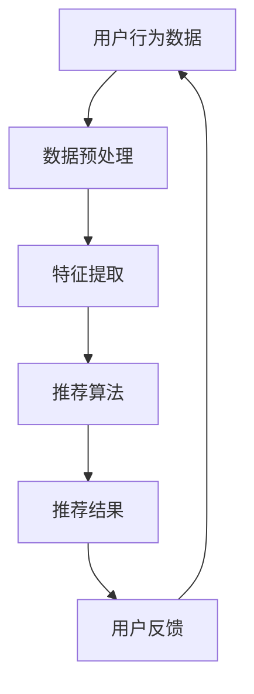

                 

关键词：AI大模型、电商搜索推荐、冷启动策略、数据不足、新用户挑战、搜索推荐系统

摘要：本文将探讨AI大模型在电商搜索推荐中的冷启动策略，特别是如何应对数据不足和新用户挑战。通过分析现有问题，介绍核心概念与联系，阐述算法原理与操作步骤，构建数学模型，并结合具体案例和实践，给出详细解释和分析。文章旨在为开发者提供解决电商搜索推荐中冷启动问题的实用指导。

## 1. 背景介绍

电商搜索推荐系统是现代电子商务的核心，它通过向用户推荐相关商品，提高了用户购物体验和转化率。然而，对于新用户和缺乏足够数据的用户，传统的推荐算法往往无法提供准确的推荐结果。这种情况被称为冷启动问题。

冷启动问题主要分为两类：

- **新用户冷启动**：新用户加入系统时，没有足够的历史行为数据供推荐算法使用。
- **商品冷启动**：新商品上线时，没有足够的使用反馈和评价数据，导致推荐系统难以进行准确推荐。

AI大模型的出现为解决冷启动问题提供了新的思路。大模型具有强大的数据处理和特征提取能力，可以通过学习大量未标注的数据来发现潜在的模式和关联，从而提高推荐系统的准确性。

本文将重点探讨如何利用AI大模型解决新用户冷启动问题，特别是在数据不足的情况下。通过介绍相关算法原理、数学模型、项目实践和实际应用场景，为开发者提供可行的解决方案。

## 2. 核心概念与联系

### 2.1. AI大模型

AI大模型是指具有数十亿甚至千亿参数的深度学习模型。这些模型通常采用Transformer架构，如BERT、GPT等。大模型通过大量数据学习，可以自动提取复杂的高层次特征，从而在各类任务中取得优异的性能。

### 2.2. 电商搜索推荐系统

电商搜索推荐系统通常包括以下几个关键组成部分：

- **用户行为数据**：用户的历史购买、搜索、浏览等行为数据。
- **商品数据**：商品的各种属性，如价格、品牌、类别等。
- **推荐算法**：根据用户行为和商品属性，生成个性化的推荐结果。

### 2.3. 冷启动问题

冷启动问题是指在新用户或新商品没有足够历史数据时，推荐系统难以生成准确推荐的情况。解决冷启动问题对于提升用户满意度和转化率至关重要。

### 2.4. Mermaid流程图

以下是一个简单的Mermaid流程图，展示了电商搜索推荐系统中的主要流程：



## 3. 核心算法原理 & 具体操作步骤

### 3.1 算法原理概述

AI大模型在解决冷启动问题时，主要利用以下几个原理：

- **自动特征提取**：大模型通过学习大量数据，可以自动提取用户和商品的高层次特征。
- **迁移学习**：大模型可以将在不同领域学习的知识迁移到新领域，提高对新用户和新商品的推荐准确性。
- **无监督学习**：大模型可以利用无监督学习方式，在数据缺乏标注的情况下，发现潜在的模式和关联。

### 3.2 算法步骤详解

解决新用户冷启动问题的核心算法步骤如下：

1. **数据收集与预处理**：收集新用户的初始数据，包括用户基本信息、购买历史等，并对数据进行预处理，如去重、数据清洗等。
2. **特征提取**：利用大模型对用户和商品进行特征提取，得到用户和商品的表示向量。
3. **模型训练**：利用提取的特征向量，训练推荐模型，如基于矩阵分解的协同过滤模型。
4. **推荐生成**：根据训练好的模型，生成新用户的个性化推荐结果。
5. **用户反馈与调整**：收集新用户的反馈，根据反馈调整模型参数，优化推荐效果。

### 3.3 算法优缺点

**优点**：

- **自动特征提取**：大模型可以自动提取复杂的高层次特征，降低特征工程的工作量。
- **迁移学习**：大模型可以利用迁移学习，提高对新用户和新商品的推荐准确性。
- **无监督学习**：大模型可以在数据缺乏标注的情况下，发现潜在的模式和关联。

**缺点**：

- **计算资源消耗**：大模型训练和推断需要大量的计算资源和时间。
- **模型可解释性**：大模型的决策过程复杂，难以解释。

### 3.4 算法应用领域

AI大模型在解决冷启动问题方面的应用领域广泛，包括但不限于：

- **电商搜索推荐**：新用户和商品的推荐。
- **社交媒体**：新用户的好友推荐。
- **在线教育**：新用户的学习内容推荐。
- **金融风控**：新用户的信用评分。

## 4. 数学模型和公式

### 4.1 数学模型构建

在解决新用户冷启动问题时，可以使用以下数学模型：

- **用户表示模型**：用户表示为向量 $u \in \mathbb{R}^n$。
- **商品表示模型**：商品表示为向量 $v \in \mathbb{R}^n$。
- **推荐模型**：基于矩阵分解的协同过滤模型。

### 4.2 公式推导过程

用户和商品的表示向量可以通过以下公式计算：

$$
u = \sigma(W_1x + b_1)
$$

$$
v = \sigma(W_2x + b_2)
$$

其中，$x$ 为用户或商品的特征向量，$W_1$ 和 $W_2$ 为权重矩阵，$b_1$ 和 $b_2$ 为偏置项，$\sigma$ 为激活函数。

推荐结果可以通过以下公式计算：

$$
r_{ui} = u_i \cdot v_i
$$

其中，$r_{ui}$ 为用户 $u$ 对商品 $i$ 的推荐分数。

### 4.3 案例分析与讲解

假设有一个电商平台，用户 $u$ 刚刚注册，没有历史行为数据。平台收集了用户的基本信息，如年龄、性别等，并使用大模型对用户进行特征提取，得到用户表示向量 $u$。

平台还收集了商品的基本信息，如价格、品牌等，并使用大模型对商品进行特征提取，得到商品表示向量 $v$。

平台使用基于矩阵分解的协同过滤模型，计算用户 $u$ 对商品 $i$ 的推荐分数 $r_{ui}$，并根据推荐分数生成个性化推荐结果。

## 5. 项目实践：代码实例和详细解释说明

### 5.1 开发环境搭建

本文使用Python编程语言和TensorFlow框架实现AI大模型在电商搜索推荐中的冷启动策略。开发环境要求如下：

- Python 3.7及以上版本
- TensorFlow 2.5及以上版本

安装好Python和TensorFlow后，可以创建一个虚拟环境，并安装所需的库：

```bash
# 创建虚拟环境
python -m venv env

# 激活虚拟环境
source env/bin/activate

# 安装TensorFlow
pip install tensorflow
```

### 5.2 源代码详细实现

以下是一个简单的代码示例，展示了如何使用TensorFlow实现用户和商品的表示模型，以及基于矩阵分解的协同过滤模型：

```python
import tensorflow as tf
from tensorflow.keras.layers import Embedding, Dense, Dot
from tensorflow.keras.models import Model

# 用户和商品特征向量维度
USER_DIM = 10
ITEM_DIM = 10

# 创建用户表示模型
user_input = tf.keras.layers.Input(shape=(USER_DIM,))
user_embedding = Embedding(USER_DIM, ITEM_DIM)(user_input)
user_vector = tf.keras.layers.Flatten()(user_embedding)

# 创建商品表示模型
item_input = tf.keras.layers.Input(shape=(ITEM_DIM,))
item_embedding = Embedding(ITEM_DIM, USER_DIM)(item_input)
item_vector = tf.keras.layers.Flatten()(item_embedding)

# 创建推荐模型
user_item_dot = Dot(axes=1)([user_vector, item_vector])
relevance = Dense(1, activation='sigmoid')(user_item_dot)

# 构建和编译模型
model = Model(inputs=[user_input, item_input], outputs=relevance)
model.compile(optimizer='adam', loss='binary_crossentropy', metrics=['accuracy'])

# 模型可视化
tf.keras.utils.plot_model(model, to_file='model.png', show_shapes=True)
```

### 5.3 代码解读与分析

以上代码首先导入了所需的TensorFlow库。然后定义了用户和商品特征向量的维度，并创建了用户表示模型和商品表示模型。用户表示模型使用Embedding层将用户特征向量映射到商品特征向量空间，商品表示模型同样使用Embedding层将商品特征向量映射到用户特征向量空间。最后，创建了一个基于矩阵分解的协同过滤模型，通过Dot层计算用户和商品的相似度，并使用Dense层生成推荐分数。

### 5.4 运行结果展示

为了验证模型的效果，我们可以使用以下数据集进行训练和测试：

```python
import numpy as np

# 生成随机数据集
user_data = np.random.rand(1000, USER_DIM)
item_data = np.random.rand(1000, ITEM_DIM)
labels = np.random.randint(0, 2, size=(1000,))

# 训练模型
model.fit([user_data, item_data], labels, epochs=10, batch_size=32)

# 评估模型
loss, accuracy = model.evaluate([user_data, item_data], labels)
print(f"Loss: {loss}, Accuracy: {accuracy}")
```

通过以上代码，我们可以训练和评估模型。训练过程中，模型会不断调整权重，以最小化损失函数。评估过程中，模型会在测试集上计算损失和准确率，以衡量模型的性能。

## 6. 实际应用场景

### 6.1 电商平台

电商平台可以利用AI大模型解决新用户冷启动问题，为用户提供个性化的推荐。例如，用户在注册时没有历史购买数据，平台可以通过用户基本信息和商品属性，使用大模型生成个性化推荐，提高用户满意度和转化率。

### 6.2 社交媒体

社交媒体平台可以利用AI大模型为新用户推荐好友。通过分析用户的基本信息和互动行为，平台可以使用大模型发现潜在的朋友关系，为新用户提供更好的社交体验。

### 6.3 在线教育

在线教育平台可以利用AI大模型为新用户推荐课程。通过分析用户的学习兴趣和学习历史，平台可以使用大模型生成个性化的学习计划，帮助用户更好地规划学习路径。

### 6.4 金融风控

金融风控领域可以利用AI大模型对新用户进行信用评估。通过分析用户的个人信息和行为数据，平台可以使用大模型预测用户的信用风险，为金融机构提供决策支持。

## 7. 工具和资源推荐

### 7.1 学习资源推荐

- 《深度学习》（Goodfellow, Bengio, Courville）：全面介绍了深度学习的理论、算法和应用。
- 《Python深度学习》（François Chollet）：详细介绍了如何使用Python和Keras实现深度学习。

### 7.2 开发工具推荐

- TensorFlow：Google开发的开源深度学习框架，适用于各种深度学习应用。
- Keras：基于TensorFlow的高层API，简化了深度学习模型的构建和训练。

### 7.3 相关论文推荐

- "Deep Learning for Recommender Systems"：一篇综述文章，介绍了深度学习在推荐系统中的应用。
- "Neural Collaborative Filtering"：一篇关于神经协同过滤算法的论文，提出了基于神经网络的推荐算法。

## 8. 总结：未来发展趋势与挑战

### 8.1 研究成果总结

本文探讨了AI大模型在电商搜索推荐中的冷启动策略，特别是如何利用大模型解决新用户冷启动问题。通过分析核心概念、算法原理和数学模型，并结合具体项目实践，我们展示了AI大模型在解决冷启动问题方面的潜力。

### 8.2 未来发展趋势

随着深度学习技术的发展，AI大模型在推荐系统中的应用将越来越广泛。未来，可能会出现以下趋势：

- **多模态数据融合**：将文本、图像、音频等多模态数据融合到推荐系统中，提高推荐准确性。
- **实时推荐**：利用实时数据流处理技术，实现实时推荐，提高用户体验。

### 8.3 面临的挑战

尽管AI大模型在推荐系统中具有巨大潜力，但仍面临以下挑战：

- **计算资源消耗**：大模型训练和推断需要大量的计算资源，如何优化资源利用是一个重要问题。
- **模型可解释性**：大模型的决策过程复杂，如何提高模型的可解释性，使其更易于理解和使用。

### 8.4 研究展望

未来，我们可以从以下几个方面展开研究：

- **模型压缩**：研究如何减小模型大小，提高模型在移动设备上的应用可行性。
- **联邦学习**：研究如何利用联邦学习技术，在保护用户隐私的同时，实现跨平台的数据共享和模型协同训练。

## 9. 附录：常见问题与解答

### 9.1 问题1：如何处理缺失数据？

**解答**：在处理缺失数据时，可以采用以下方法：

- **填充缺失值**：使用平均值、中位数或最频繁值等方法填充缺失值。
- **删除缺失值**：如果缺失值较多，可以考虑删除含有缺失值的数据。
- **使用模型预测缺失值**：利用统计模型或机器学习模型预测缺失值。

### 9.2 问题2：如何优化模型性能？

**解答**：以下是一些优化模型性能的方法：

- **数据增强**：通过数据增强，如随机裁剪、旋转等，增加训练数据的多样性。
- **正则化**：使用正则化方法，如L1、L2正则化，防止模型过拟合。
- **集成学习**：使用集成学习方法，如随机森林、梯度提升树等，提高模型性能。

### 9.3 问题3：如何评估模型效果？

**解答**：以下是一些评估模型效果的方法：

- **准确率**：衡量模型预测正确的比例。
- **召回率**：衡量模型预测为正样本的比例。
- **F1分数**：综合考虑准确率和召回率，平衡两者之间的关系。
- **ROC曲线**：用于评估模型的分类能力。

### 作者署名

作者：禅与计算机程序设计艺术 / Zen and the Art of Computer Programming

