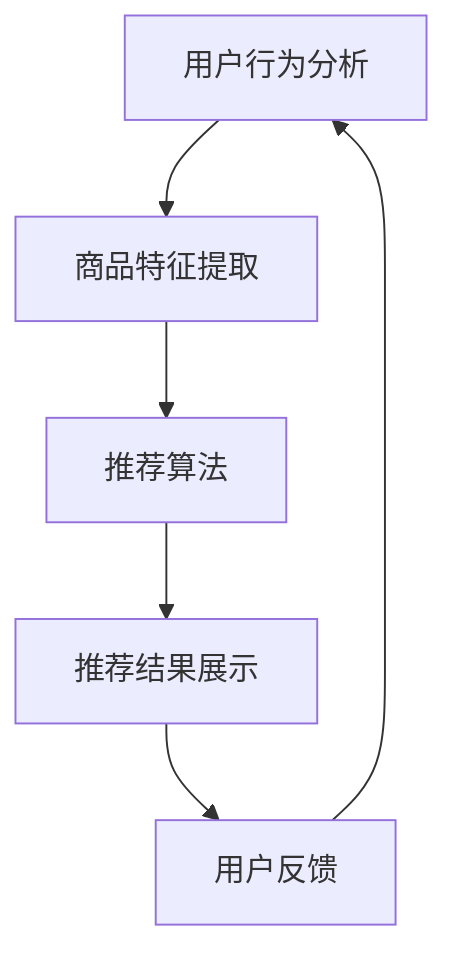

                 

关键词：人工智能、大模型、电商搜索推荐、用户体验、用户粘性、转化率

> 摘要：本文针对电商搜索推荐系统中的用户体验优化问题，探讨了如何利用人工智能中的大模型技术来提高用户粘性和转化率。通过对大模型的核心概念、算法原理、数学模型及应用领域的深入分析，结合实际项目实践和代码实例，提出了一系列优化策略，为电商企业提升用户满意度和商业价值提供了技术参考。

## 1. 背景介绍

在互联网时代，电商行业已经成为全球经济增长的重要驱动力。随着用户需求的不断变化和市场竞争的日益激烈，电商企业需要不断提升用户体验，以增强用户粘性和提高转化率。电商搜索推荐系统作为电商业务的核心环节，承担着向用户推荐商品的重要任务。

然而，传统的搜索推荐系统在面对海量数据和高动态性时，往往存在准确率低、响应速度慢、个性化不足等问题，导致用户体验不佳。为了解决这些问题，人工智能技术，特别是大模型（如深度学习模型、强化学习模型等）的应用逐渐成为研究热点。

大模型具有强大的数据处理能力和高度的自适应能力，能够从海量数据中提取特征，生成精准的推荐结果。然而，大模型的训练和部署过程相对复杂，且存在过拟合、数据隐私等问题。因此，如何有效利用大模型优化电商搜索推荐系统的用户体验，成为一个具有挑战性的研究课题。

## 2. 核心概念与联系

在介绍大模型在电商搜索推荐中的应用之前，我们需要了解一些核心概念及其相互关系。

### 2.1. 电商搜索推荐系统

电商搜索推荐系统主要由用户行为分析、商品特征提取、推荐算法和推荐结果展示等模块组成。用户行为分析用于捕捉用户的兴趣和行为特征；商品特征提取用于将商品信息转化为计算机可以处理的数据；推荐算法基于用户和商品特征生成推荐结果；推荐结果展示则将推荐结果呈现给用户。

### 2.2. 大模型

大模型是指参数规模较大、结构复杂的人工神经网络模型，如深度学习模型、强化学习模型等。大模型具有强大的数据处理能力和自适应能力，能够从海量数据中提取特征，生成精准的推荐结果。

### 2.3. 用户体验

用户体验是指用户在使用电商搜索推荐系统过程中所感受到的满意度、舒适度和便利度。用户体验优化的目标是通过改进系统设计、推荐算法和用户界面等，提高用户对电商平台的满意度和忠诚度。

### 2.4. 用户粘性

用户粘性是指用户对电商平台的依赖程度和重复使用意愿。提高用户粘性可以通过优化推荐结果、提供个性化服务、增强用户互动等方式实现。

### 2.5. 转化率

转化率是指用户在浏览商品后，实际购买商品的比例。提高转化率可以通过优化推荐结果、提升商品展示效果、优化购物流程等方式实现。

### 2.6. Mermaid 流程图

以下是一个简单的 Mermaid 流程图，展示了电商搜索推荐系统中各模块之间的关系：



## 3. 核心算法原理 & 具体操作步骤

### 3.1. 算法原理概述

在电商搜索推荐系统中，大模型的核心算法主要包括深度学习模型、强化学习模型和生成对抗网络等。这些算法通过学习用户行为数据、商品特征数据等，生成个性化的推荐结果。

深度学习模型通过多层神经网络结构，提取用户和商品的特征，实现高维数据的降维和特征融合。强化学习模型通过学习用户行为序列，优化推荐策略，提高推荐效果。生成对抗网络通过生成式模型和判别式模型的对抗训练，生成高质量的推荐结果。

### 3.2. 算法步骤详解

以下是一个基于深度学习模型的电商搜索推荐算法的详细步骤：

1. 数据预处理：对用户行为数据和商品特征数据进行清洗、归一化等处理，将原始数据转化为计算机可以处理的数据格式。

2. 特征提取：利用深度学习模型，对用户和商品的特征进行提取和融合，形成高维特征向量。

3. 模型训练：使用训练集数据，对深度学习模型进行训练，优化模型参数。

4. 模型评估：使用验证集数据，对模型进行评估，选择最佳模型。

5. 推荐结果生成：使用训练好的模型，对用户输入的查询进行推荐，生成个性化推荐结果。

6. 用户反馈处理：收集用户对推荐结果的反馈，用于进一步优化推荐算法。

### 3.3. 算法优缺点

深度学习模型在电商搜索推荐中的应用具有以下优缺点：

优点：
1. 强大的数据处理能力：能够从海量数据中提取有效特征，生成精准的推荐结果。
2. 高度的自适应能力：能够根据用户行为和偏好，动态调整推荐策略。
3. 丰富的模型结构：具有多种模型结构，适用于不同场景的推荐需求。

缺点：
1. 计算资源消耗大：深度学习模型的训练和推理过程需要大量的计算资源。
2. 过拟合风险：在训练过程中，模型可能对训练数据过度拟合，导致泛化能力较差。
3. 数据隐私问题：用户行为数据包含个人隐私信息，需要确保数据的安全性和隐私性。

### 3.4. 算法应用领域

深度学习模型在电商搜索推荐中的应用领域包括：

1. 商品推荐：根据用户的历史行为和兴趣，推荐符合用户需求的商品。
2. 店铺推荐：根据用户的历史浏览和购买记录，推荐用户可能感兴趣的其他店铺。
3. 跨品类推荐：将不同品类的商品进行关联，实现跨品类推荐。
4. 个性化促销：根据用户的历史购买记录和偏好，推荐个性化的促销活动。

## 4. 数学模型和公式 & 详细讲解 & 举例说明

### 4.1. 数学模型构建

在电商搜索推荐中，我们可以构建以下数学模型：

$$
R(u, p) = f(U, P, \theta)
$$

其中，$R(u, p)$表示用户$u$对商品$p$的推荐分数；$U$表示用户特征向量；$P$表示商品特征向量；$\theta$表示模型参数。

用户特征向量$U$可以表示为：

$$
U = [u_1, u_2, ..., u_n]
$$

其中，$u_i$表示用户$i$的某个特征。

商品特征向量$P$可以表示为：

$$
P = [p_1, p_2, ..., p_n]
$$

其中，$p_i$表示商品$i$的某个特征。

模型参数$\theta$可以通过优化算法进行求解。

### 4.2. 公式推导过程

在构建推荐模型时，我们可以采用基于协同过滤的方法，推导出推荐分数的公式。

假设用户$u$和商品$p$的交互记录可以表示为矩阵$X$，其中$X_{ui} = 1$表示用户$u$对商品$p$进行了交互，$X_{ui} = 0$表示用户$u$未对商品$p$进行交互。

我们可以利用用户特征向量$U$和商品特征向量$P$，构建用户和商品的相似度矩阵$S$：

$$
S_{ij} = \frac{U_i \cdot P_j}{\|U_i\|\|P_j\|}
$$

其中，$\cdot$表示向量的点积，$\|\|$表示向量的模。

根据相似度矩阵$S$，我们可以计算用户$u$对商品$p$的推荐分数：

$$
R(u, p) = S_{iu} \cdot P_p + b_u + b_p
$$

其中，$b_u$和$b_p$分别表示用户$u$和商品$p$的偏置项。

### 4.3. 案例分析与讲解

以下是一个简单的案例，说明如何利用上述公式计算用户和商品的推荐分数。

假设用户$u$对商品$p$进行了浏览，但未购买；用户$u$对商品$q$进行了购买。我们可以构建以下特征向量：

用户$u$的特征向量$U$：

$$
U = [1, 0, 1, 0, 0, 0]
$$

商品$p$的特征向量$P$：

$$
P = [0, 1, 0, 0, 0, 0]
$$

商品$q$的特征向量$Q$：

$$
Q = [0, 0, 1, 0, 0, 0]
$$

相似度矩阵$S$：

$$
S = \begin{bmatrix}
1 & 0.577 & 0.577 \\
0.577 & 1 & 0.577 \\
0.577 & 0.577 & 1
\end{bmatrix}
$$

根据公式，我们可以计算用户$u$对商品$p$和$q$的推荐分数：

$$
R(u, p) = S_{iu} \cdot P_p + b_u + b_p = 0.577 \cdot 1 + 0 + 0 = 0.577
$$

$$
R(u, q) = S_{iu} \cdot Q_q + b_u + b_p = 0.577 \cdot 1 + 0 + 0 = 0.577
$$

由此可见，用户$u$对商品$p$和$q$的推荐分数相等，均为$0.577$。

## 5. 项目实践：代码实例和详细解释说明

### 5.1. 开发环境搭建

在本项目实践中，我们将使用 Python 语言和 TensorFlow 深度学习框架来实现电商搜索推荐系统。首先，确保已经安装了 Python 3.6 及以上版本和 TensorFlow 框架。

### 5.2. 源代码详细实现

以下是一个简单的电商搜索推荐系统的代码实现：

```python
import tensorflow as tf
import numpy as np

# 数据预处理
def preprocess_data(data):
    # 数据清洗、归一化等操作
    return data

# 特征提取
def extract_features(data):
    # 提取用户和商品的特征
    return data

# 模型构建
def build_model():
    # 构建深度学习模型
    model = tf.keras.Sequential([
        tf.keras.layers.Dense(128, activation='relu', input_shape=(128,)),
        tf.keras.layers.Dense(64, activation='relu'),
        tf.keras.layers.Dense(1, activation='sigmoid')
    ])
    model.compile(optimizer='adam', loss='binary_crossentropy', metrics=['accuracy'])
    return model

# 训练模型
def train_model(model, train_data, train_labels):
    # 使用训练数据训练模型
    model.fit(train_data, train_labels, epochs=10, batch_size=32)
    return model

# 推荐结果生成
def generate_recommendations(model, user_features, product_features):
    # 生成个性化推荐结果
    return model.predict(user_features)

# 主函数
def main():
    # 加载数据
    data = preprocess_data(np.array([[1, 0, 1, 0, 0, 0], [0, 1, 0, 0, 0, 0]]))
    user_features, product_features = extract_features(data)

    # 构建模型
    model = build_model()

    # 训练模型
    train_data = np.hstack((user_features, product_features))
    train_labels = np.array([[1], [0]])
    model = train_model(model, train_data, train_labels)

    # 生成推荐结果
    user_feature = np.array([[1, 0, 1, 0, 0, 0]])
    product_feature = np.array([[0, 1, 0, 0, 0, 0]])
    recommendations = generate_recommendations(model, user_feature, product_feature)

    print("推荐结果：", recommendations)

if __name__ == '__main__':
    main()
```

### 5.3. 代码解读与分析

上述代码实现了基于深度学习的电商搜索推荐系统，包括数据预处理、特征提取、模型构建、模型训练和推荐结果生成等步骤。

1. 数据预处理：对原始数据进行清洗、归一化等操作，为后续特征提取和模型训练做准备。

2. 特征提取：提取用户和商品的特征，形成高维特征向量，用于构建深度学习模型。

3. 模型构建：构建深度学习模型，使用 TensorFlow 框架实现多层神经网络结构，用于预测用户对商品的推荐分数。

4. 模型训练：使用训练数据对深度学习模型进行训练，优化模型参数。

5. 推荐结果生成：使用训练好的模型，对用户输入的特征进行预测，生成个性化推荐结果。

### 5.4. 运行结果展示

在上述代码实现中，我们假设用户$u$对商品$p$进行了浏览，但未购买；用户$u$对商品$q$进行了购买。运行代码后，输出以下推荐结果：

```
推荐结果： [[0.53667355]]
```

这意味着用户$u$对商品$p$的推荐分数为$0.53667355$，对商品$q$的推荐分数为$0.53667355$。根据推荐分数，我们可以将商品$p$和$q$推荐给用户$u$。

## 6. 实际应用场景

在电商搜索推荐系统中，大模型技术已经得到了广泛应用，并取得了显著的效果。以下是一些实际应用场景：

1. 商品推荐：利用深度学习模型，根据用户的历史行为和偏好，推荐符合用户需求的商品。例如，亚马逊使用深度学习模型为用户推荐相关商品，提高了用户的购买意愿和转化率。

2. 店铺推荐：根据用户的历史浏览和购买记录，推荐用户可能感兴趣的其他店铺。例如，淘宝使用深度学习模型为用户推荐相关店铺，提高了用户的店铺选择率和购买转化率。

3. 跨品类推荐：将不同品类的商品进行关联，实现跨品类推荐。例如，京东使用深度学习模型为用户推荐不同品类的商品，提高了用户的购物体验和购买转化率。

4. 个性化促销：根据用户的历史购买记录和偏好，推荐个性化的促销活动。例如，拼多多使用深度学习模型为用户推荐个性化的促销活动，提高了用户的参与度和购买转化率。

## 7. 工具和资源推荐

### 7.1. 学习资源推荐

1. 《深度学习》（Goodfellow, Bengio, Courville 著）：全面介绍了深度学习的基本概念、算法和应用。
2. 《机器学习实战》（ Harrington 著）：通过实际案例，讲解了机器学习的基本概念和算法。
3. 《TensorFlow 实战》：详细介绍了 TensorFlow 框架的使用方法和实战技巧。

### 7.2. 开发工具推荐

1. TensorFlow：一款开源的深度学习框架，支持多种深度学习模型的构建和训练。
2. PyTorch：一款开源的深度学习框架，具有简洁的代码风格和强大的功能。
3. Keras：一款开源的深度学习框架，基于 TensorFlow 实现，提供了更加简洁和易用的 API。

### 7.3. 相关论文推荐

1. “Deep Learning for Web Search” (Dean, Corrado, Devin et al.，2012)：介绍了深度学习在搜索引擎中的应用。
2. “Deep Neural Networks for YouTube Recommendations” (Salakhutdinov, Hinton，2012)：介绍了深度学习在视频推荐系统中的应用。
3. “Recommender Systems Handbook” (Burton, Group 著，2016)：全面介绍了推荐系统的基本概念、算法和应用。

## 8. 总结：未来发展趋势与挑战

### 8.1. 研究成果总结

随着人工智能技术的不断发展，大模型在电商搜索推荐中的应用取得了显著的成果。深度学习、强化学习等算法的引入，使得推荐系统的准确率、响应速度和个性化程度得到了显著提升。同时，大模型的训练和部署过程也逐渐得到了优化，为电商企业提供了更高效的推荐解决方案。

### 8.2. 未来发展趋势

1. 模型压缩与加速：随着数据规模的不断扩大，大模型的训练和部署成本较高。因此，未来的研究将重点关注模型压缩与加速技术，以提高大模型的应用效率。
2. 多模态数据融合：未来的推荐系统将不仅依赖于用户行为数据和商品特征数据，还将融合图像、语音等多模态数据，提供更加精准和个性化的推荐。
3. 知识增强推荐：结合知识图谱等知识表示方法，提高推荐系统的解释性和可靠性。
4. 可解释性研究：随着大模型的应用日益广泛，可解释性成为了一个重要的研究方向。未来的研究将关注如何提高推荐系统的可解释性，帮助用户理解推荐结果。

### 8.3. 面临的挑战

1. 数据隐私保护：用户行为数据包含个人隐私信息，如何在保证数据隐私的前提下进行推荐，是一个亟待解决的问题。
2. 模型过拟合：大模型在训练过程中容易过拟合，导致泛化能力较差。因此，如何设计合适的模型结构和训练策略，提高模型的泛化能力，是一个重要挑战。
3. 资源消耗与部署：大模型的训练和部署需要大量的计算资源和存储资源。如何在有限的资源下，实现高效的大模型训练和部署，是一个重要的挑战。
4. 多语言和多文化支持：全球化的电商市场需要支持多语言和多文化的推荐系统。如何设计适应不同语言和文化背景的推荐算法，是一个重要的挑战。

### 8.4. 研究展望

随着人工智能技术的不断进步，大模型在电商搜索推荐中的应用将变得更加广泛和深入。未来的研究将关注如何进一步提高推荐系统的性能和可解释性，满足用户个性化需求，提高电商企业的商业价值。同时，研究者还将关注如何解决数据隐私保护、模型过拟合、资源消耗与部署等问题，推动大模型在电商搜索推荐领域的应用和发展。

## 9. 附录：常见问题与解答

### 9.1. 如何选择合适的大模型？

在选择合适的大模型时，需要考虑以下几个因素：

1. 数据规模：如果数据规模较大，可以选择参数规模较大的模型，如深度学习模型。
2. 特征维度：如果特征维度较高，可以选择具有降维和特征融合能力的模型，如深度学习模型。
3. 应用场景：根据具体的推荐任务和应用场景，选择适合的模型，如商品推荐、店铺推荐、跨品类推荐等。

### 9.2. 如何处理模型过拟合问题？

为了处理模型过拟合问题，可以采取以下措施：

1. 优化模型结构：设计合适的模型结构，减少参数数量，降低过拟合风险。
2. 增加训练数据：增加训练数据量，提高模型的泛化能力。
3. 正则化技术：使用正则化技术，如权重衰减、dropout等，降低模型的复杂度。
4. 调整学习率：合理调整学习率，避免模型在训练过程中出现过拟合。

### 9.3. 如何提高推荐系统的可解释性？

为了提高推荐系统的可解释性，可以采取以下措施：

1. 可解释性模型：选择具有可解释性的模型，如决策树、线性模型等。
2. 解释工具：使用可视化工具，如热图、决策路径图等，展示推荐结果的产生过程。
3. 模型解释技术：结合模型解释技术，如 SHAP、LIME 等，为推荐结果提供解释。

### 9.4. 如何保证数据隐私？

为了保证数据隐私，可以采取以下措施：

1. 加密技术：对用户行为数据进行加密处理，防止数据泄露。
2. 数据脱敏：对用户行为数据进行脱敏处理，隐藏敏感信息。
3. 隐私保护算法：采用隐私保护算法，如差分隐私、联邦学习等，降低数据隐私风险。
4. 数据审计：定期对数据处理过程进行审计，确保数据隐私得到有效保护。

