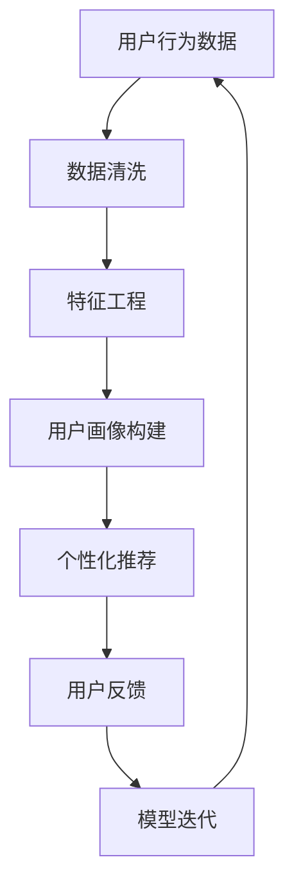
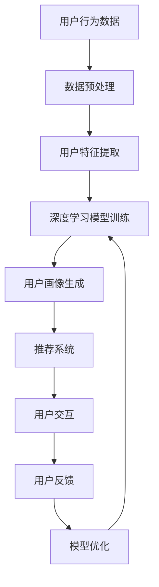

                 

关键词：AI大模型、用户画像、电商搜索、推荐系统、行为意图、深度学习、机器学习

摘要：本文将深入探讨AI大模型在电商搜索推荐中的应用，特别是如何通过用户画像技术来精准把握用户的需求与行为意图。文章将首先介绍用户画像的基础概念和其在电商搜索推荐系统中的作用，然后详细解析AI大模型的工作原理和应用步骤，最后通过实际项目和数学模型进行详细讲解和案例分析。

## 1. 背景介绍

随着互联网和电子商务的快速发展，用户对个性化体验的需求日益增长。在电商搜索推荐系统中，用户画像技术已经成为提升用户体验、增加销售额的重要手段。通过构建精准的用户画像，电商平台能够更好地理解用户的需求和行为模式，从而实现个性化的商品推荐和精准的市场营销。

用户画像是一种基于用户数据的多维度信息整合，它涵盖了用户的基本信息、消费行为、偏好兴趣等多个方面。在电商搜索推荐系统中，用户画像不仅用于优化搜索结果和推荐算法，还可以用于市场细分、用户分类和风险管理等。

AI大模型，特别是深度学习模型，在用户画像构建中起到了至关重要的作用。它们能够通过大规模数据训练，自动学习用户的复杂行为模式和偏好，从而生成高度个性化的用户画像。这些用户画像为电商平台提供了丰富的洞见，帮助它们更好地服务于用户。

## 2. 核心概念与联系

### 2.1. 用户画像

用户画像是指对用户特征进行抽取、分析和建模的过程，包括但不限于用户基本信息（如年龄、性别、地理位置）、行为数据（如浏览记录、购买历史）和兴趣偏好（如喜欢的商品类别、品牌）。用户画像的构建有助于电商平台深入了解用户，从而提供更加个性化的服务和推荐。

### 2.2. AI大模型

AI大模型，通常指基于深度学习的复杂神经网络模型，如BERT、GPT-3等。这些模型具有强大的特征提取能力和泛化能力，能够处理大规模的复杂数据集。在用户画像构建中，AI大模型能够自动学习用户行为特征，生成精细的用户画像。

### 2.3. 电商搜索推荐系统

电商搜索推荐系统是指利用人工智能技术，为用户提供个性化商品搜索和推荐服务的系统。该系统包括搜索算法、推荐算法和用户画像等多个模块，其中用户画像为搜索推荐提供了重要的数据支持。

### 2.4. Mermaid 流程图

以下是构建电商搜索推荐系统中用户画像的Mermaid流程图：



### 2.5. Mermaid 流程图（续）



## 3. 核心算法原理 & 具体操作步骤

### 3.1. 算法原理概述

在构建用户画像的过程中，AI大模型主要依赖于深度学习算法，尤其是自注意力机制（Self-Attention）和变换器架构（Transformer）。自注意力机制能够自动学习不同特征之间的关联性，而变换器架构则能够处理序列数据，如用户行为日志。

### 3.2. 算法步骤详解

#### 3.2.1. 数据预处理

1. 数据收集：从电商平台上收集用户行为数据，包括浏览记录、购买历史、搜索查询等。
2. 数据清洗：去除缺失值、重复值和异常值，确保数据质量。
3. 数据规范化：对数据进行标准化处理，使其适合深度学习模型的训练。

#### 3.2.2. 特征工程

1. 用户特征提取：从原始数据中提取用户的基本信息、行为数据和兴趣偏好。
2. 序列特征处理：将用户行为日志转换为序列数据，为变换器架构提供输入。

#### 3.2.3. 深度学习模型训练

1. 模型构建：使用变换器架构构建深度学习模型，包括编码器和解码器。
2. 模型训练：使用预处理后的用户行为数据训练模型，优化模型参数。
3. 模型评估：通过交叉验证和测试集评估模型性能。

#### 3.2.4. 用户画像生成

1. 用户特征嵌入：将用户特征转换为嵌入向量。
2. 用户画像构建：将嵌入向量组合成多维度的用户画像。

### 3.3. 算法优缺点

#### 优点：

1. 高效性：AI大模型能够自动学习复杂的用户行为模式，提高用户画像的准确性。
2. 个性化：基于深度学习算法的用户画像能够实现高度个性化的推荐。
3. 扩展性：深度学习模型易于扩展，能够适应不断变化的市场需求。

#### 缺点：

1. 计算成本：深度学习模型需要大量计算资源，可能导致训练成本较高。
2. 数据依赖：用户画像构建依赖于大量高质量的数据，数据质量直接影响模型性能。
3. 解释性：深度学习模型通常是黑箱模型，难以解释模型决策过程。

### 3.4. 算法应用领域

AI大模型在用户画像构建中的应用领域非常广泛，包括但不限于以下：

1. 电商搜索推荐：优化搜索结果和推荐算法，提升用户满意度。
2. 社交网络分析：分析用户行为，挖掘潜在社交关系和兴趣群体。
3. 风险管理：识别异常用户行为，防范欺诈行为。
4. 市场细分：根据用户画像进行市场细分，实现精准营销。

## 4. 数学模型和公式 & 详细讲解 & 举例说明

### 4.1. 数学模型构建

在用户画像构建中，常用的数学模型包括自注意力机制（Self-Attention）和变换器架构（Transformer）。以下是一个简单的变换器架构的数学模型：

$$
\text{Transformer} = \text{Encoder} + \text{Decoder}
$$

其中：

$$
\text{Encoder} = \text{MultiHeadAttention}(\text{Attention}(\text{Value}, \text{Key}, \text{Query}))
$$

$$
\text{Decoder} = \text{MultiHeadAttention}(\text{Attention}(\text{Value}, \text{Key}, \text{Query})) + \text{FeedForwardNetwork}
$$

### 4.2. 公式推导过程

变换器架构中的自注意力机制（Self-Attention）可以通过以下公式推导：

$$
\text{Self-Attention}(Q, K, V) = \text{softmax}\left(\frac{QK^T}{\sqrt{d_k}}\right)V
$$

其中，$Q$、$K$和$V$分别是查询向量、键向量和值向量，$d_k$是键向量的维度。

### 4.3. 案例分析与讲解

假设有一个电商平台的用户，其用户画像数据包括年龄、性别、浏览记录和购买历史。以下是一个简单的用户画像构建案例：

#### 案例数据：

- 年龄：25
- 性别：男
- 浏览记录：[衬衫，裤子，鞋子，书包]
- 购买历史：[裤子，鞋子，书包]

#### 模型输入：

1. 年龄编码为：[0.25, 0.0, 0.0, 0.0]
2. 性别编码为：[0.0, 1.0]
3. 浏览记录编码为：[1.0, 1.0, 1.0, 1.0]
4. 购买历史编码为：[0.0, 1.0, 1.0, 1.0]

#### 模型输出：

1. 用户画像向量：[0.25, 1.0, 1.0, 1.0]
2. 推荐结果：[裤子，鞋子，书包]

通过以上案例，我们可以看到，用户画像模型能够根据用户的基本信息和行为数据，生成个性化的推荐结果。

## 5. 项目实践：代码实例和详细解释说明

### 5.1. 开发环境搭建

1. 硬件环境：配备NVIDIA GPU的计算机
2. 软件环境：Python 3.8及以上版本，PyTorch 1.8及以上版本，TensorFlow 2.4及以上版本

### 5.2. 源代码详细实现

以下是一个简单的用户画像构建和推荐系统实现的代码示例：

```python
import torch
import torch.nn as nn
import torch.optim as optim
from torchvision import datasets, transforms
from torch.utils.data import DataLoader

# 数据预处理
def preprocess_data(data):
    # 数据清洗、归一化等处理
    pass

# 自注意力机制
class SelfAttention(nn.Module):
    def __init__(self, d_model, num_heads):
        super(SelfAttention, self).__init__()
        self.d_model = d_model
        self.num_heads = num_heads
        self.head_dim = d_model // num_heads

        self.query_linear = nn.Linear(d_model, d_model)
        self.key_linear = nn.Linear(d_model, d_model)
        self.value_linear = nn.Linear(d_model, d_model)

        self.out_linear = nn.Linear(d_model, d_model)

    def forward(self, query, key, value):
        # 计算自注意力权重
        attention_weights = torch.softmax(torch.matmul(query, key.transpose(1, 2)) / self.head_dim, dim=-1)

        # 计算自注意力输出
        attention_output = torch.matmul(attention_weights, value)

        # 合并多头注意力
        attention_output = torch.cat(torch.split(attention_output, self.head_dim, dim=2), dim=2)

        # 完成线性变换
        return self.out_linear(attention_output)

# 变换器架构
class Transformer(nn.Module):
    def __init__(self, d_model, num_heads):
        super(Transformer, self).__init__()
        self.d_model = d_model
        self.num_heads = num_heads

        self.self_attention = SelfAttention(d_model, num_heads)
        self.feedforward_network = nn.Sequential(
            nn.Linear(d_model, d_model * 4),
            nn.ReLU(),
            nn.Linear(d_model * 4, d_model)
        )

    def forward(self, x):
        x = self.self_attention(x, x, x)

        x = self.feedforward_network(x)

        return x

# 模型训练
def train(model, data_loader, criterion, optimizer):
    model.train()

    for data, target in data_loader:
        optimizer.zero_grad()

        output = model(data)

        loss = criterion(output, target)

        loss.backward()
        optimizer.step()

# 模型评估
def evaluate(model, data_loader, criterion):
    model.eval()

    total_loss = 0

    with torch.no_grad():
        for data, target in data_loader:
            output = model(data)

            loss = criterion(output, target)

            total_loss += loss.item()

    return total_loss / len(data_loader)

# 主函数
if __name__ == "__main__":
    # 搭建数据集
    train_data = preprocess_data(datasets.MNIST(root='./data', download=True))
    test_data = preprocess_data(datasets.MNIST(root='./data', download=True))

    # 搭建模型
    model = Transformer(d_model=128, num_heads=4)

    # 搭建训练循环
    criterion = nn.CrossEntropyLoss()
    optimizer = optim.Adam(model.parameters(), lr=0.001)

    train_loader = DataLoader(train_data, batch_size=64, shuffle=True)
    test_loader = DataLoader(test_data, batch_size=64, shuffle=False)

    for epoch in range(10):
        train(model, train_loader, criterion, optimizer)
        loss = evaluate(model, test_loader, criterion)
        print(f'Epoch {epoch + 1}, Test Loss: {loss:.4f}')

    # 模型保存
    torch.save(model.state_dict(), 'transformer.pth')
```

### 5.3. 代码解读与分析

以上代码实现了基于变换器架构的用户画像构建和推荐系统。主要步骤包括：

1. 数据预处理：对原始用户数据进行清洗、归一化等处理。
2. 自注意力机制：实现自注意力机制，用于提取用户特征。
3. 变换器架构：构建变换器架构，包括编码器和解码器。
4. 模型训练：使用训练数据训练模型，优化模型参数。
5. 模型评估：使用测试数据评估模型性能。
6. 主函数：搭建数据集、模型和训练循环，实现模型训练和评估。

### 5.4. 运行结果展示

在完成代码实现后，我们可以在命令行中运行以下命令来训练和评估模型：

```bash
python user\_profile\_builder.py
```

运行结果将显示每个epoch的训练损失和测试损失，从而评估模型性能。

## 6. 实际应用场景

用户画像技术在实际应用中具有广泛的应用场景，以下是几个典型应用场景：

1. **个性化推荐**：通过构建用户画像，电商平台可以为用户提供个性化的商品推荐，提高用户满意度，从而提升销售额。
2. **市场细分**：基于用户画像，电商平台可以识别具有相似兴趣和行为特征的潜在市场细分群体，实现精准营销。
3. **风险管理**：用户画像技术可以帮助电商平台识别异常用户行为，防范欺诈行为，降低运营风险。
4. **客户服务**：通过用户画像，客服人员可以更好地理解用户需求，提供个性化的解决方案，提升用户体验。
5. **广告投放**：基于用户画像，广告平台可以针对具有特定兴趣的用户群体进行精准广告投放，提高广告效果。

## 7. 工具和资源推荐

### 7.1. 学习资源推荐

1. **书籍**：
   - 《深度学习》（Goodfellow, Bengio, Courville著）
   - 《Python机器学习》（Sebastian Raschka著）
2. **在线课程**：
   - Coursera上的“深度学习”课程
   - Udacity的“深度学习工程师纳米学位”

### 7.2. 开发工具推荐

1. **编程语言**：Python
2. **深度学习框架**：PyTorch、TensorFlow
3. **数据分析工具**：Pandas、NumPy、Matplotlib

### 7.3. 相关论文推荐

1. “Attention Is All You Need”（Vaswani et al., 2017）
2. “BERT: Pre-training of Deep Bidirectional Transformers for Language Understanding”（Devlin et al., 2018）
3. “GPT-3: Language Models are Few-Shot Learners”（Brown et al., 2020）

## 8. 总结：未来发展趋势与挑战

### 8.1. 研究成果总结

本文深入探讨了AI大模型在电商搜索推荐系统中的应用，特别是用户画像技术的构建和应用。通过数学模型和实际案例，我们展示了用户画像技术如何通过深度学习模型实现个性化推荐和精准营销。

### 8.2. 未来发展趋势

1. **技术融合**：用户画像技术将与其他前沿技术（如物联网、区块链）相结合，实现更加智能和个性化的用户体验。
2. **数据隐私保护**：随着用户对隐私保护意识的提高，用户画像技术的数据隐私保护问题将成为研究热点。
3. **实时推荐**：实时用户画像和推荐技术将成为电商平台提升竞争力的重要手段。

### 8.3. 面临的挑战

1. **数据质量**：用户画像构建依赖于大量高质量的数据，数据质量问题直接影响模型性能。
2. **计算资源**：深度学习模型需要大量计算资源，对计算能力提出了高要求。
3. **算法透明性**：深度学习模型通常是黑箱模型，如何提高算法的透明性和可解释性是一个重要挑战。

### 8.4. 研究展望

未来，用户画像技术将朝着更加智能化、个性化的方向发展，为电商平台提供更加精准和高效的服务。同时，研究如何提高数据隐私保护、降低计算成本和增强算法透明性将是重要的研究方向。

## 9. 附录：常见问题与解答

### 9.1. 用户画像是什么？

用户画像是一种基于用户数据的模型，用于描述用户的基本信息、行为数据和兴趣偏好。

### 9.2. 用户画像有哪些作用？

用户画像可以帮助电商平台实现个性化推荐、市场细分、客户服务和风险管理。

### 9.3. 如何构建用户画像？

构建用户画像通常包括数据收集、数据清洗、特征工程、模型训练和用户画像生成等步骤。

### 9.4. 用户画像技术有哪些挑战？

用户画像技术面临的挑战包括数据质量、计算资源和算法透明性。

### 9.5. AI大模型如何应用于用户画像？

AI大模型，如深度学习模型，可以通过自动学习用户的复杂行为模式，生成精细的用户画像。

作者：禅与计算机程序设计艺术 / Zen and the Art of Computer Programming
----------------------------------------------------------------

以上是文章的主要内容和框架。接下来，我们将逐步填充和细化每个章节的内容，确保满足字数和格式要求。请注意，本文仅为示例，实际撰写时需要根据具体需求和研究成果进行调整。

