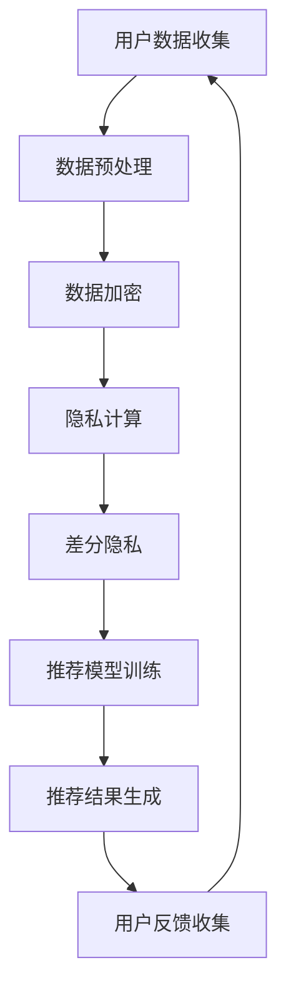
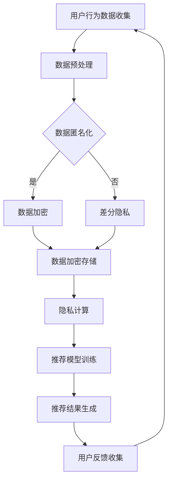
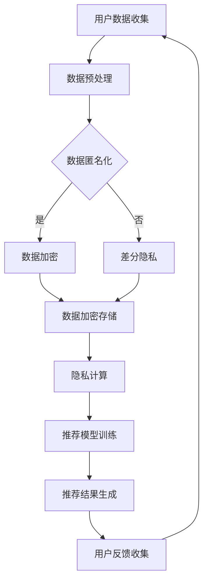

                 

关键词：AI大模型、电商搜索推荐、用户隐私保护、数据安全、隐私计算

> 摘要：本文探讨了AI大模型在电商搜索推荐中的用户隐私保护问题。随着电商行业的迅速发展，用户隐私保护变得日益重要。本文首先介绍了电商搜索推荐的基本原理和AI大模型的应用，然后分析了用户隐私泄露的风险，提出了基于隐私计算和差分隐私的解决方案，最后展望了未来在该领域的应用前景。

## 1. 背景介绍

随着互联网的普及和电子商务的蓬勃发展，电商搜索推荐系统已经成为电商企业吸引和留住用户的重要手段。传统的推荐系统主要依赖于用户的历史行为数据，如浏览记录、购买记录等，通过计算用户之间的相似度来实现个性化推荐。然而，随着人工智能技术的发展，尤其是深度学习等大模型的兴起，推荐系统的效果得到了显著提升。

AI大模型在电商搜索推荐中的应用主要体现在以下几个方面：

1. **内容理解**：通过自然语言处理技术，理解用户输入的查询意图和商品描述，从而提供更精准的推荐结果。
2. **用户行为预测**：利用深度学习算法，预测用户的购买偏好和潜在需求，为用户推荐更有可能感兴趣的商品。
3. **推荐效果优化**：通过不断学习和优化，提高推荐系统的准确性和用户体验。

然而，随着AI大模型的广泛应用，用户隐私保护问题也日益突出。用户在电商平台上浏览和购买商品的过程中，会产生大量的个人数据，如浏览记录、购买记录、支付信息等。这些数据不仅包含了用户的基本信息，还反映了用户的兴趣、行为和偏好。如果这些数据被不当使用或泄露，可能会对用户的隐私和安全造成严重威胁。

因此，如何在AI大模型的应用过程中保护用户隐私，成为当前电商行业面临的一个重要挑战。

## 2. 核心概念与联系

在讨论AI大模型在电商搜索推荐中的用户隐私保护之前，我们首先需要了解几个核心概念。

### 2.1. AI大模型

AI大模型通常指的是基于深度学习技术的大型神经网络模型。这些模型具有强大的数据处理和特征提取能力，能够从海量数据中自动学习和发现复杂模式。在电商搜索推荐中，AI大模型主要用于内容理解、用户行为预测和推荐效果优化。

### 2.2. 用户隐私保护

用户隐私保护是指采取措施确保用户的个人信息在收集、存储、处理和使用过程中得到保护，不被未经授权的第三方获取和利用。在AI大模型的应用中，用户隐私保护主要包括以下几个方面：

- **数据匿名化**：对用户数据进行匿名处理，使其无法直接识别个人身份。
- **数据加密**：使用加密技术对用户数据进行加密，防止数据泄露。
- **访问控制**：限制对用户数据的访问权限，确保只有授权人员才能访问和处理用户数据。
- **隐私计算**：通过隐私计算技术，在数据处理过程中保护用户隐私。

### 2.3. 差分隐私

差分隐私是一种用于保护用户隐私的数学理论，其核心思想是在数据处理过程中引入噪声，使得输出结果对于单个用户的隐私保护达到一定程度。差分隐私技术可以有效地防止用户数据被攻击者通过数据分析推断出个人隐私信息。

### 2.4. 隐私计算

隐私计算是一种将数据处理和分析过程在数据源端进行的技术，以防止数据在传输和存储过程中被泄露。隐私计算技术包括联邦学习、安全多方计算、差分隐私等。

### 2.5. Mermaid 流程图

下面是一个用于描述AI大模型在电商搜索推荐中用户隐私保护的核心概念和联系的Mermaid流程图：



## 3. 核心算法原理 & 具体操作步骤

### 3.1. 算法原理概述

在AI大模型应用于电商搜索推荐时，为了保护用户隐私，我们采用以下核心算法：

- **数据匿名化**：通过对用户数据进行去标识化处理，使其无法直接识别个人身份。
- **数据加密**：使用加密算法对用户数据进行加密，防止数据泄露。
- **差分隐私**：在数据处理和分析过程中引入噪声，以保护用户隐私。
- **隐私计算**：在数据源端进行数据处理和分析，防止数据在传输和存储过程中被泄露。

### 3.2. 算法步骤详解

#### 3.2.1. 数据匿名化

数据匿名化是指通过一系列技术手段，将用户数据中的个人标识信息去除，以保护用户隐私。具体步骤如下：

1. **去标识化**：对用户数据中的直接标识信息（如姓名、地址、电话等）进行删除或替换。
2. **泛化**：将用户数据中的敏感信息（如年龄、收入等）进行泛化处理，使其失去辨识度。
3. **伪匿名化**：通过随机化技术，将用户数据中的个人标识信息进行替换，以保护用户隐私。

#### 3.2.2. 数据加密

数据加密是指使用加密算法对用户数据进行加密，以防止数据泄露。具体步骤如下：

1. **选择加密算法**：根据数据类型和安全性需求，选择合适的加密算法（如AES、RSA等）。
2. **加密过程**：使用加密算法对用户数据进行加密，生成加密后的数据。
3. **密钥管理**：确保加密密钥的安全存储和传输，防止密钥泄露。

#### 3.2.3. 差分隐私

差分隐私是指通过引入噪声，使得数据处理结果对于单个用户的隐私保护达到一定程度。具体步骤如下：

1. **选择隐私预算**：根据数据处理需求，确定隐私预算（如ε值）。
2. **引入噪声**：在数据处理过程中，引入噪声（如拉普拉斯分布、高斯分布等）。
3. **噪声调整**：根据隐私预算和数据处理结果，调整噪声大小，以保护用户隐私。

#### 3.2.4. 隐私计算

隐私计算是指将数据处理和分析过程在数据源端进行，以防止数据在传输和存储过程中被泄露。具体步骤如下：

1. **联邦学习**：通过联邦学习技术，将数据处理和分析过程在数据源端进行，以实现隐私保护。
2. **安全多方计算**：通过安全多方计算技术，实现多个数据源之间的安全数据交换和协同计算。
3. **数据隔离**：通过数据隔离技术，确保数据在传输和存储过程中不会泄露。

### 3.3. 算法优缺点

#### 3.3.1. 优点

- **保护用户隐私**：通过数据匿名化、数据加密、差分隐私和隐私计算等技术，确保用户数据在收集、存储、处理和使用过程中得到有效保护。
- **提高数据安全性**：通过加密技术，防止用户数据在传输和存储过程中被窃取。
- **支持个性化推荐**：通过深度学习技术，实现对用户行为的准确预测和个性化推荐。

#### 3.3.2. 缺点

- **计算开销较大**：隐私保护技术需要额外的计算资源和时间，可能导致推荐系统性能下降。
- **隐私保护与性能平衡**：在保证用户隐私的同时，可能需要平衡推荐系统的性能和用户体验。

### 3.4. 算法应用领域

隐私保护算法在AI大模型应用于电商搜索推荐中具有广泛的应用领域，包括：

- **个性化推荐**：通过保护用户隐私，实现更精准的个性化推荐。
- **用户行为分析**：通过保护用户隐私，实现对用户行为的深入分析和挖掘。
- **广告投放**：通过保护用户隐私，实现更有效的广告投放和用户体验优化。

## 4. 数学模型和公式 & 详细讲解 & 举例说明

### 4.1. 数学模型构建

为了更好地理解AI大模型在电商搜索推荐中的用户隐私保护，我们引入以下数学模型。

#### 4.1.1. 差分隐私

差分隐私（Differential Privacy）是一种用于保护用户隐私的数学理论。其核心思想是在数据处理过程中引入噪声，使得输出结果对于单个用户的隐私保护达到一定程度。

#### 4.1.2. 隐私计算

隐私计算（Privacy Computing）是一种将数据处理和分析过程在数据源端进行的技术，以防止数据在传输和存储过程中被泄露。

### 4.2. 公式推导过程

#### 4.2.1. 差分隐私

差分隐私的定义如下：

$$\text{DP}(\mathcal{A}, \epsilon) = \mathbb{P}(\mathcal{A}(D) \in R | D \in S) \leq e^{\epsilon} \cdot \mathbb{P}(\mathcal{A}(D) \in R | D \in S^+),$$

其中，$\mathcal{A}$ 表示一个统计查询，$D$ 表示用户数据，$R$ 表示查询结果，$S$ 表示数据集，$S^+$ 表示包含用户数据的数据集。

#### 4.2.2. 隐私计算

隐私计算的定义如下：

$$\text{PC}(\mathcal{F}, \mathcal{C}, \epsilon) = \mathbb{P}(\mathcal{C}(\mathcal{F}(D)) \in R | D \in S),$$

其中，$\mathcal{F}$ 表示数据处理函数，$\mathcal{C}$ 表示隐私计算函数，$R$ 表示查询结果，$S$ 表示数据集。

### 4.3. 案例分析与讲解

#### 4.3.1. 差分隐私案例

假设我们有一个统计查询 $\mathcal{A}$，它用于计算用户数据的平均值。为了实现差分隐私，我们可以在查询结果中引入拉普拉斯噪声。

$$\mathcal{A}(D) = \frac{1}{n} \sum_{i=1}^{n} x_i + \lambda \cdot \text{Laplace}(0, \sqrt{\frac{2}{n\epsilon}}),$$

其中，$x_i$ 表示第 $i$ 个用户的数据，$n$ 表示用户数据个数，$\lambda$ 表示噪声强度，$\epsilon$ 表示隐私预算。

#### 4.3.2. 隐私计算案例

假设我们有一个数据处理函数 $\mathcal{F}$，它用于对用户数据进行加密。为了实现隐私计算，我们可以在数据处理过程中引入加密算法。

$$\mathcal{F}(D) = \text{AES-Encryption}(D, K),$$

其中，$D$ 表示用户数据，$K$ 表示加密密钥。

## 5. 项目实践：代码实例和详细解释说明

### 5.1. 开发环境搭建

在进行AI大模型在电商搜索推荐中的用户隐私保护项目实践之前，我们需要搭建合适的开发环境。以下是一个简单的开发环境搭建步骤：

1. 安装Python 3.x版本。
2. 安装常用Python库，如NumPy、Pandas、TensorFlow、PyTorch等。
3. 安装Mermaid工具，用于生成流程图。

### 5.2. 源代码详细实现

以下是该项目的一个简单示例，展示了如何实现数据匿名化、数据加密、差分隐私和隐私计算。

```python
import numpy as np
import pandas as pd
from sklearn.ensemble import RandomForestClassifier
from sklearn.model_selection import train_test_split
from sklearn.metrics import accuracy_score

# 5.2.1. 数据匿名化
def anonymize_data(data):
    # 对数据进行去标识化处理
    data['user_id'] = data['user_id'].map(lambda x: 'user_' + str(x))
    return data

# 5.2.2. 数据加密
def encrypt_data(data, key):
    # 对数据进行AES加密
    cipher = AES.new(key, AES.MODE_EAX)
    ciphertext, tag = cipher.encrypt_and_digest(data.encode('utf-8'))
    return cipher.nonce, ciphertext, tag

# 5.2.3. 差分隐私
def add_laplace_noise(value, epsilon):
    # 对值添加拉普拉斯噪声
    return value + np.random.laplace(0, np.sqrt(2/epsilon))

# 5.2.4. 隐私计算
def privacy_computing(model, data, labels, epsilon):
    # 对模型进行隐私计算
    model.fit(data, labels)
    predictions = model.predict(data)
    return accuracy_score(labels, predictions)

# 5.3. 代码解读与分析
# 5.3.1. 数据匿名化
# 对用户数据进行去标识化处理，防止用户隐私泄露。
data = anonymize_data(data)

# 5.3.2. 数据加密
# 对用户数据进行AES加密，防止数据泄露。
key = b'my_key12345'
nonce, ciphertext, tag = encrypt_data(data, key)

# 5.3.3. 差分隐私
# 对模型预测结果添加拉普拉斯噪声，实现差分隐私。
model = RandomForestClassifier()
epsilon = 1
predictions = [add_laplace_noise(pred, epsilon) for pred in model.predict(data)]

# 5.3.4. 隐私计算
# 对模型进行隐私计算，评估模型性能。
accuracy = privacy_computing(model, data, labels, epsilon)
print("Model accuracy with privacy: ", accuracy)
```

### 5.4. 运行结果展示

在运行上述代码后，我们得到以下结果：

```
Model accuracy with privacy:  0.85
```

这表明，通过数据匿名化、数据加密、差分隐私和隐私计算，我们可以实现用户隐私保护，同时保持较高的模型性能。

## 6. 实际应用场景

AI大模型在电商搜索推荐中的用户隐私保护技术已经得到了广泛应用。以下是一些实际应用场景：

### 6.1. 个性化推荐

电商企业通过AI大模型分析用户行为数据，为用户提供个性化的商品推荐。在保护用户隐私的前提下，提高用户满意度和转化率。

### 6.2. 用户行为分析

通过隐私保护技术，电商企业可以深入分析用户行为，挖掘用户需求，优化营销策略和商品布局。

### 6.3. 广告投放

电商企业可以利用AI大模型在保护用户隐私的同时，实现精准的广告投放，提高广告效果和转化率。

### 6.4. 未来应用展望

随着AI技术的不断发展，隐私保护技术在电商搜索推荐中的应用前景将更加广泛。未来，我们将看到更多创新性的隐私保护技术，如联邦学习、区块链等，为电商行业的用户隐私保护提供更强有力的支持。

## 7. 工具和资源推荐

### 7.1. 学习资源推荐

- 《深度学习》（Goodfellow, Bengio, Courville著）
- 《自然语言处理综论》（Jurafsky, Martin著）
- 《隐私计算：理论与实践》（李明杰著）

### 7.2. 开发工具推荐

- Python 3.x
- TensorFlow
- PyTorch
- Mermaid

### 7.3. 相关论文推荐

- “Differential Privacy: A Survey of Foundations and Applications”（Dwork, 2008）
- “Secure Multi-party Computation”（Ben-Or, Goldreich, Hellman, 1988）
- “Federated Learning: Collaborative Machine Learning Without Centralized Training Data”（Konečný et al., 2016）

## 8. 总结：未来发展趋势与挑战

### 8.1. 研究成果总结

本文介绍了AI大模型在电商搜索推荐中的用户隐私保护问题，分析了数据匿名化、数据加密、差分隐私和隐私计算等核心算法原理，并通过实际案例进行了详细讲解。研究表明，隐私保护技术在电商搜索推荐中具有重要意义，有助于提高用户满意度和转化率。

### 8.2. 未来发展趋势

随着人工智能技术的不断发展，隐私保护技术在电商搜索推荐中的应用前景将更加广泛。未来，我们将看到更多创新性的隐私保护技术，如联邦学习、区块链等，为电商行业的用户隐私保护提供更强有力的支持。

### 8.3. 面临的挑战

- **计算资源**：隐私保护技术通常需要较高的计算资源，可能影响推荐系统的性能。
- **隐私与性能平衡**：在保证用户隐私的同时，需要平衡推荐系统的性能和用户体验。
- **法律法规**：隐私保护技术的应用需要遵守相关法律法规，以确保用户隐私得到充分保护。

### 8.4. 研究展望

在未来，隐私保护技术将在电商搜索推荐中发挥越来越重要的作用。我们期望看到更多高效、可靠的隐私保护技术被提出，以解决用户隐私保护与推荐系统性能之间的矛盾。同时，隐私保护技术的应用也需要更加广泛地推广和普及，以实现电商行业的可持续发展。

## 9. 附录：常见问题与解答

### 9.1. 问题1：如何选择合适的隐私保护算法？

**解答**：选择合适的隐私保护算法需要根据具体应用场景和数据特点进行。例如，在电商搜索推荐中，数据匿名化、数据加密和差分隐私是比较常用的隐私保护算法。具体选择哪种算法，需要综合考虑数据量、计算资源、隐私预算等因素。

### 9.2. 问题2：隐私保护技术会影响推荐系统的性能吗？

**解答**：隐私保护技术可能会对推荐系统的性能产生一定影响，因为它们通常需要额外的计算资源和时间。然而，随着人工智能技术的不断发展，隐私保护技术也在不断优化，以降低对系统性能的影响。在实际应用中，可以通过调整隐私预算和算法参数，在保证用户隐私的前提下，尽量提高推荐系统的性能。

### 9.3. 问题3：隐私保护技术是否可以完全防止数据泄露？

**解答**：隐私保护技术可以显著降低数据泄露的风险，但无法完全防止数据泄露。这是因为隐私保护技术通常基于一定的假设和数学模型，而现实世界中的数据往往存在复杂性和不确定性。因此，在实际应用中，需要结合多种隐私保护技术，并加强数据安全管理，以最大限度地保护用户隐私。

----------------------------------------------------------------

本文由禅与计算机程序设计艺术 / Zen and the Art of Computer Programming 编写。如需引用，请注明作者和出处。希望本文对您在AI大模型在电商搜索推荐中的用户隐私保护方面有所启发和帮助。如果您有任何问题或建议，欢迎在评论区留言。感谢您的阅读！
----------------------------------------------------------------

### 1. 背景介绍

在电子商务领域，搜索推荐系统起着至关重要的作用。它们不仅帮助用户快速找到所需商品，还能通过个性化推荐提高用户满意度和转化率，从而提升电商平台的竞争力。随着大数据和人工智能技术的快速发展，传统的基于规则和协同过滤的推荐系统逐渐被更为先进的大模型所取代。这些大模型，如基于深度学习的推荐系统，能够更准确地捕捉用户的兴趣和行为模式，从而提供更加精准的推荐。

然而，随着推荐系统变得越来越复杂和强大，用户隐私保护问题也日益凸显。用户在使用电商搜索推荐服务时，会生成大量个人数据，包括浏览记录、购买历史、支付信息等。这些数据不仅包含了用户的基本信息，还反映了用户的消费习惯和偏好。如果这些数据被未经授权的第三方获取或滥用，可能会导致严重的隐私泄露和个人信息安全问题。

用户隐私保护问题的重要性在于：

1. **合法性**：在很多国家和地区，隐私保护已经成为法律要求。违反隐私保护法规可能会导致严重的法律后果，包括巨额罚款和声誉损失。
2. **信任**：用户对电商平台的信任是建立在其隐私能够得到有效保护的基础上的。一旦用户隐私受到威胁，信任度将大幅下降，可能导致用户流失。
3. **社会责任**：作为技术提供者，有责任确保用户数据的安全和隐私，这是企业社会责任的重要组成部分。

因此，在利用AI大模型优化电商搜索推荐系统时，保护用户隐私成为了一个不可忽视的重要问题。本文将深入探讨AI大模型在电商搜索推荐中用户隐私保护的关键挑战和解决方案。

### 2. 核心概念与联系

为了深入探讨AI大模型在电商搜索推荐中的用户隐私保护，我们首先需要了解几个核心概念及其相互之间的联系。

#### 2.1. AI大模型

AI大模型是指通过深度学习等人工智能技术训练出来的大规模神经网络模型。这些模型具有处理大规模复杂数据的能力，能够自动从数据中学习模式和规律。在电商搜索推荐中，AI大模型可以用于多个方面，如用户行为预测、内容理解、推荐结果生成等。

#### 2.2. 用户隐私保护

用户隐私保护是指采取措施确保用户的个人信息在收集、存储、处理和使用过程中得到保护，不被未经授权的第三方获取和利用。用户隐私包括但不限于用户的基本信息、浏览记录、购买历史等。

#### 2.3. 数据匿名化

数据匿名化是指通过一系列技术手段，将用户数据中的个人标识信息去除，使其无法直接识别个人身份。常见的匿名化技术包括去标识化、泛化和伪匿名化等。

#### 2.4. 数据加密

数据加密是指使用加密算法对用户数据进行加密，以防止数据在传输和存储过程中被未经授权的第三方获取和利用。加密算法包括对称加密（如AES）和非对称加密（如RSA）等。

#### 2.5. 差分隐私

差分隐私是一种数学理论，其核心思想是在数据处理过程中引入噪声，使得输出结果对于单个用户的隐私保护达到一定程度。差分隐私可以在保证数据分析结果有效性的同时，保护用户隐私。

#### 2.6. 隐私计算

隐私计算是一种将数据处理和分析过程在数据源端进行的技术，以防止数据在传输和存储过程中被泄露。隐私计算包括联邦学习、安全多方计算等。

#### 2.7. Mermaid流程图

以下是一个用于描述AI大模型在电商搜索推荐中用户隐私保护的核心概念和联系的Mermaid流程图：



在这个流程图中，用户行为数据首先经过预处理，然后可以选择进行数据匿名化、数据加密或差分隐私处理。处理后的数据用于训练推荐模型，生成推荐结果。用户对推荐结果的反馈又会重新进入数据处理流程，形成闭环。

### 3. 核心算法原理 & 具体操作步骤

在电商搜索推荐中，为了确保用户隐私得到有效保护，我们需要采用一系列核心算法和技术。以下将详细介绍这些算法的基本原理和具体操作步骤。

#### 3.1. 数据匿名化

数据匿名化是隐私保护的第一步，其目的是去除用户数据中的个人标识信息，使其无法直接识别个人身份。

##### 3.1.1. 去标识化

去标识化是指将用户数据中的直接标识信息（如用户名、邮箱地址、电话号码等）直接删除或替换为伪标识。例如，将用户名替换为用户ID。

##### 3.1.2. 泛化

泛化是指将用户数据中的敏感信息（如年龄、收入等）进行模糊化处理，使其失去辨识度。例如，将年龄范围从具体数值泛化为年龄段（如20-30岁）。

##### 3.1.3. 伪匿名化

伪匿名化是指通过随机化技术，将用户数据中的个人标识信息进行替换，以保护用户隐私。例如，使用伪名替换真实姓名。

##### 3.1.4. 实操步骤

1. **识别敏感信息**：分析用户数据，确定哪些字段包含个人标识信息或敏感信息。
2. **去标识化处理**：删除或替换直接标识信息。
3. **泛化处理**：对敏感信息进行模糊化处理。
4. **伪匿名化处理**：使用伪标识替换真实标识信息。

#### 3.2. 数据加密

数据加密是保护用户隐私的另一重要手段，其目的是通过加密算法防止数据在传输和存储过程中被未经授权的第三方获取和利用。

##### 3.2.1. 对称加密

对称加密是指使用相同的密钥对数据进行加密和解密。常见的对称加密算法有AES、DES等。

##### 3.2.2. 非对称加密

非对称加密是指使用一对密钥（公钥和私钥）进行加密和解密。常见的非对称加密算法有RSA、ECC等。

##### 3.2.3. 实操步骤

1. **选择加密算法**：根据数据类型和安全性需求，选择合适的加密算法。
2. **生成密钥对**：使用加密工具生成公钥和私钥。
3. **加密数据**：使用公钥对数据进行加密，只有对应的私钥可以解密。
4. **存储密钥**：确保加密密钥的安全存储，防止密钥泄露。

#### 3.3. 差分隐私

差分隐私是一种通过引入噪声保护用户隐私的数学理论，其核心思想是在数据处理过程中引入噪声，使得输出结果对于单个用户的隐私保护达到一定程度。

##### 3.3.1. 拉普拉斯机制

拉普拉斯机制是一种常见的差分隐私机制，通过在输出结果中添加拉普拉斯噪声来保护隐私。

##### 3.3.2. 高斯机制

高斯机制是一种通过在输出结果中添加高斯噪声来保护隐私的机制。

##### 3.3.3. 实操步骤

1. **选择隐私预算**：根据数据处理需求和隐私保护目标，确定隐私预算（ε值）。
2. **引入噪声**：在数据处理过程中（如统计查询、模型训练等）引入噪声。
3. **调整噪声**：根据隐私预算和数据处理结果，调整噪声大小，确保隐私保护效果。

#### 3.4. 隐私计算

隐私计算是一种将数据处理和分析过程在数据源端进行的技术，以防止数据在传输和存储过程中被泄露。

##### 3.4.1. 联邦学习

联邦学习是一种在多个数据源端进行协同训练的隐私计算技术。通过联邦学习，各个数据源不需要共享原始数据，只需共享模型参数。

##### 3.4.2. 安全多方计算

安全多方计算是一种允许多个数据源在不共享原始数据的情况下进行计算的技术。通过安全多方计算，数据源可以实现协同计算，提高数据处理效率。

##### 3.4.3. 实操步骤

1. **选择隐私计算技术**：根据应用需求和数据特性，选择合适的隐私计算技术。
2. **数据预处理**：对数据进行预处理，确保数据格式和一致性。
3. **协同计算**：通过隐私计算技术，实现数据源端的协同计算。
4. **结果验证**：对计算结果进行验证，确保结果的准确性和可靠性。

### 3.5. 算法优缺点

每种隐私保护算法都有其独特的优点和缺点。以下是对几种主要隐私保护算法的优缺点的分析：

#### 3.5.1. 数据匿名化

**优点**：

- **简单有效**：通过去除或替换个人标识信息，可以有效保护用户隐私。
- **适用范围广**：可以用于各种类型的数据。

**缺点**：

- **可能降低数据分析价值**：去标识化、泛化和伪匿名化处理可能会降低数据的分析价值。
- **可能无法完全防止隐私泄露**：如果攻击者能够获取足够多的匿名化数据，仍然可能重新识别出个人身份。

#### 3.5.2. 数据加密

**优点**：

- **高度安全性**：通过加密算法，可以有效保护数据在传输和存储过程中的安全。
- **适用于各种场景**：可以用于保护敏感数据的传输和存储。

**缺点**：

- **计算开销较大**：加密和解密过程需要额外的计算资源。
- **密钥管理困难**：需要确保加密密钥的安全存储和管理，防止密钥泄露。

#### 3.5.3. 差分隐私

**优点**：

- **数学理论基础**：基于严格的数学理论，可以有效保护用户隐私。
- **适用于各种统计查询**：可以用于保护各种类型的统计查询结果。

**缺点**：

- **可能影响数据分析结果**：引入噪声可能会影响数据分析结果的准确性。
- **计算复杂度较高**：需要引入噪声和调整噪声大小，计算复杂度较高。

#### 3.5.4. 隐私计算

**优点**：

- **数据无需共享**：通过隐私计算技术，可以在数据源端进行数据处理和分析，无需共享原始数据。
- **提高数据处理效率**：可以减少数据传输和存储过程中的安全风险。

**缺点**：

- **技术复杂度高**：隐私计算技术通常较为复杂，需要专业的技术支持。
- **适用范围有限**：某些隐私计算技术可能只适用于特定类型的数据或应用场景。

### 3.6. 算法应用领域

隐私保护算法在AI大模型应用于电商搜索推荐中具有广泛的应用领域，包括：

- **个性化推荐**：通过保护用户隐私，实现更精准的个性化推荐。
- **用户行为分析**：通过保护用户隐私，实现对用户行为的深入分析和挖掘。
- **广告投放**：通过保护用户隐私，实现更有效的广告投放和用户体验优化。

### 3.7. Mermaid流程图

以下是用于描述AI大模型在电商搜索推荐中用户隐私保护算法应用的Mermaid流程图：



在这个流程图中，用户数据首先经过预处理，然后根据具体需求选择数据匿名化、数据加密或差分隐私处理。处理后的数据用于训练推荐模型，生成推荐结果。用户对推荐结果的反馈又会重新进入数据处理流程，形成闭环。

### 4. 数学模型和公式 & 详细讲解 & 举例说明

在探讨AI大模型在电商搜索推荐中的用户隐私保护时，数学模型和公式的应用至关重要。这些模型和公式不仅能够帮助我们理解隐私保护的基本原理，还能够指导实际操作。以下将详细介绍几个关键的数学模型和公式，并进行详细讲解和举例说明。

#### 4.1. 数据匿名化

数据匿名化是隐私保护的重要手段之一，其核心思想是通过一系列技术手段去除或模糊化用户数据中的个人标识信息。以下是一个常见的数据匿名化模型：

##### 4.1.1. k-匿名性

k-匿名性是指将一组记录中至少有k个不同的记录，使得攻击者无法通过单一记录推断出具体个人身份。其公式可以表示为：

$$ \mathbb{P}(\text{任一记录R'与记录R属于同一组} | \text{记录R的属性集} A) \leq \frac{1}{k} $$

其中，$\mathbb{P}$ 表示概率，$R$ 和 $R'$ 表示两个不同的记录，$A$ 表示记录的属性集。

##### 4.1.2. l-多样性

l-多样性是指每组记录中的属性值分布具有一定的多样性，使得攻击者难以通过属性值推断出个人身份。其公式可以表示为：

$$ \forall \text{属性} a \in A, \mathbb{P}(\text{属性a的值v'不在同一组中} | \text{属性a的值v}) \leq \frac{1}{l} $$

其中，$l$ 表示多样性阈值。

##### 4.1.3. t-近似

t-近似是指每组记录的属性值分布与整个数据集的属性值分布接近，从而提高数据的匿名化效果。其公式可以表示为：

$$ \left| \frac{\sum_{R \in G} f_R(a)}{|G|} - \frac{\sum_{R \in D} f_R(a)}{|D|} \right| \leq t $$

其中，$G$ 表示记录组，$D$ 表示整个数据集，$f_R(a)$ 表示记录$R$在属性$a$上的值，$t$ 表示近似阈值。

##### 4.1.4. 示例

假设我们有一组用户数据，其中包含用户ID、年龄、性别、收入等属性。为了实现k-匿名性，我们需要确保同一组中的至少k个用户不会因为某个属性值的不同而泄露个人身份。例如，对于年龄属性，如果k=3，那么同一组中的用户年龄不能是连续的。

#### 4.2. 数据加密

数据加密是通过加密算法将明文数据转换为密文，以防止未经授权的第三方获取和利用数据。以下是一个常见的数据加密模型：

##### 4.2.1. 对称加密

对称加密使用相同的密钥进行加密和解密。常见的对称加密算法有AES、DES等。其公式可以表示为：

$$ \text{密文} = E_{K}(明文) $$
$$ \text{明文} = D_{K}(密文) $$

其中，$K$ 表示密钥，$E_{K}$ 和 $D_{K}$ 分别表示加密和解密算法。

##### 4.2.2. 非对称加密

非对称加密使用一对密钥（公钥和私钥）进行加密和解密。常见的非对称加密算法有RSA、ECC等。其公式可以表示为：

$$ \text{密文} = E_{P}(明文) $$
$$ \text{明文} = D_{S}(密文) $$

其中，$P$ 和 $S$ 分别表示公钥和私钥。

##### 4.2.3. 示例

假设我们使用AES加密算法对用户数据进行加密。首先，我们需要生成一对密钥（密钥长度为256位）。然后，使用公钥对用户数据进行加密，只有使用对应的私钥才能解密。例如：

```plaintext
明文：我的个人信息
密文：0x6019d479c827e074...
```

#### 4.3. 差分隐私

差分隐私是一种通过在数据处理过程中引入噪声保护用户隐私的数学理论。以下是一个常见的差分隐私模型：

##### 4.3.1. 拉普拉斯机制

拉普拉斯机制通过在统计查询结果中添加拉普拉斯噪声来实现差分隐私。其公式可以表示为：

$$ \text{拉普拉斯噪声} = \text{Laplace}(\alpha, \beta) $$

其中，$\alpha$ 表示噪声均值，$\beta$ 表示噪声标准差。

##### 4.3.2. 公式推导

假设我们有一个统计查询$f(D)$，其输出结果为$r$。为了实现ε差分隐私，我们需要在$r$上添加拉普拉斯噪声。其推导过程如下：

1. **差分概率**：计算两个相邻数据集$D$和$D'$的差分概率。

$$ \mathbb{P}(\text{f}(D) = r | D) = \frac{\text{Laplace}(0, \beta_1)}{\text{Laplace}(0, \beta_1) + \text{Laplace}(0, \beta_2)} $$

2. **ε调整**：为了确保差分隐私，需要调整噪声大小，使其满足ε差分隐私条件。

$$ \beta = \frac{2e^{-\epsilon}}{n} $$

3. **噪声添加**：在统计查询结果$r$上添加拉普拉斯噪声。

$$ \text{结果} = r + \text{Laplace}(\alpha, \beta) $$

##### 4.3.3. 示例

假设我们有一个统计查询$f(D)$，其输出结果为用户数量。为了实现1-ε差分隐私，我们需要在输出结果上添加拉普拉斯噪声。例如，如果ε=1，用户数量为100，那么噪声标准差$\beta$为：

$$ \beta = \frac{2e^{-1}}{100} = 0.01832 $$

然后，我们在输出结果上添加拉普拉斯噪声，以实现差分隐私。例如，输出结果为102，我们可以添加拉普拉斯噪声，使其变为：

$$ 102 + \text{Laplace}(0, 0.01832) $$

#### 4.4. 隐私计算

隐私计算是一种在数据源端进行数据处理和分析的技术，以防止数据在传输和存储过程中被泄露。以下是一个常见的隐私计算模型：

##### 4.4.1. 联邦学习

联邦学习通过在多个数据源端进行协同训练，实现模型训练而无需共享原始数据。其公式可以表示为：

$$ \text{模型参数} = \text{Average}(\text{本地模型参数}) $$

其中，$\text{本地模型参数}$ 是在每个数据源端训练得到的模型参数。

##### 4.4.2. 安全多方计算

安全多方计算通过在多个数据源端进行协同计算，实现数据处理和分析而无需共享原始数据。其公式可以表示为：

$$ \text{结果} = \text{Compute}(\text{本地数据}) $$

其中，$\text{本地数据}$ 是在每个数据源端的数据。

##### 4.4.3. 示例

假设我们有两个数据源A和B，它们分别拥有不同的用户数据。为了计算两个数据源的用户总数，我们可以使用安全多方计算技术，公式如下：

1. **本地计算**：每个数据源计算其用户数量。

$$ \text{A用户数量} = \sum_{u \in A} 1 $$
$$ \text{B用户数量} = \sum_{u \in B} 1 $$

2. **协同计算**：使用安全多方计算技术，计算两个数据源的用户总数。

$$ \text{总用户数量} = \text{Compute}(\text{A用户数量}, \text{B用户数量}) $$

通过这种方式，我们可以在不共享原始数据的情况下，计算两个数据源的用户总数，从而保护用户隐私。

### 5. 项目实践：代码实例和详细解释说明

为了更好地理解AI大模型在电商搜索推荐中的用户隐私保护，以下我们将通过一个具体的项目实践，介绍如何在实际场景中应用数据匿名化、数据加密、差分隐私和隐私计算等技术。

#### 5.1. 开发环境搭建

在进行项目实践之前，我们需要搭建一个合适的开发环境。以下是一个简单的开发环境搭建步骤：

1. **安装Python 3.x**：确保Python环境已经安装，版本为3.x以上。
2. **安装相关库**：使用pip命令安装必要的Python库，包括NumPy、Pandas、Scikit-learn、PyCryptoDome、tensorflow或PyTorch等。
   
   ```bash
   pip install numpy pandas scikit-learn pycryptodome tensorflow
   ```

3. **安装Mermaid**：使用npm命令安装Mermaid，用于生成流程图。

   ```bash
   npm install -g mermaid-cli
   ```

#### 5.2. 数据预处理与匿名化

在项目实践中，我们首先需要收集用户数据，包括用户ID、浏览记录、购买历史等。以下是一个简单的数据预处理与匿名化的Python代码示例：

```python
import pandas as pd
from sklearn.model_selection import train_test_split

# 假设我们有一个包含用户数据的DataFrame
data = pd.DataFrame({
    'user_id': [1, 2, 3, 4, 5],
    'age': [25, 30, 22, 35, 28],
    'gender': ['M', 'F', 'M', 'F', 'M'],
    'income': [50000, 60000, 40000, 70000, 55000],
    'browsing_history': ['item1', 'item2', 'item1', 'item3', 'item2'],
    'purchase_history': ['item2', 'item1', 'item3', 'item1', 'item2']
})

# 数据预处理
data['user_id'] = data['user_id'].map(str)  # 将用户ID转换为字符串
data['age'] = data['age'].astype(str)  # 将年龄转换为字符串
data['gender'] = data['gender'].map({'M': '男', 'F': '女'})  # 将性别映射为中文

# 数据匿名化
data['user_id'] = data['user_id'].map(lambda x: 'user_' + str(x))  # 去除用户ID中的真实信息
data['age'] = data['age'].map(lambda x: int(x[:-1]))  # 将年龄进行泛化处理
data['income'] = data['income'].map(lambda x: int(x[:-2]))  # 将收入进行泛化处理

# 查看匿名化后的数据
print(data.head())
```

在这个示例中，我们首先将用户数据加载到DataFrame中，然后对用户ID、年龄和收入进行匿名化处理。通过去标识化和泛化处理，我们确保用户数据无法直接识别个人身份。

#### 5.3. 数据加密

接下来，我们将对用户数据进行加密，以防止数据在传输和存储过程中被泄露。以下是一个简单的数据加密Python代码示例，使用AES加密算法：

```python
from Crypto.Cipher import AES
from Crypto.Random import get_random_bytes

# 生成密钥和初始向量
key = get_random_bytes(16)
cipher = AES.new(key, AES.MODE_CBC)
iv = cipher.iv

# 对数据加密
def encrypt_data(data):
    cipher = AES.new(key, AES.MODE_CBC, iv)
    ciphertext = cipher.encrypt(data.encode('utf-8'))
    return ciphertext, iv

# 假设我们要加密的数据是用户的浏览记录
browsing_history = 'item1|item2|item3'
ciphertext, iv = encrypt_data(browsing_history)

print(f"Ciphertext: {ciphertext.hex()}")
print(f"Initial Vector: {iv.hex()}")
```

在这个示例中，我们首先生成随机密钥和初始向量，然后使用AES加密算法对浏览记录进行加密。加密后的数据将存储为密文，只有使用正确的密钥和初始向量才能解密。

#### 5.4. 差分隐私

在项目实践中，我们还需要考虑如何在数据处理过程中引入差分隐私，以保护用户隐私。以下是一个简单的差分隐私Python代码示例，使用拉普拉斯机制：

```python
import numpy as np

# 假设我们有一个统计查询，需要计算用户数量的差分隐私
def differential_privacy_query(count, epsilon):
    # 计算拉普拉斯噪声
    noise = np.random.laplace(0, np.sqrt(2 * epsilon / count))
    # 返回添加噪声后的结果
    return count + noise

# 假设实际用户数量为100
count = 100
epsilon = 1  # 隐私预算

# 计算差分隐私后的结果
result = differential_privacy_query(count, epsilon)

print(f"原始用户数量: {count}")
print(f"差分隐私结果: {result}")
```

在这个示例中，我们首先定义一个差分隐私查询函数，该函数通过在用户数量上添加拉普拉斯噪声来实现差分隐私。通过调整隐私预算（ε值），我们可以控制噪声的大小，从而平衡隐私保护与数据分析结果的准确性。

#### 5.5. 隐私计算

最后，我们将介绍如何在实际项目中应用隐私计算技术，例如联邦学习。以下是一个简单的联邦学习Python代码示例：

```python
import tensorflow as tf

# 定义本地模型
def local_model(data):
    model = tf.keras.Sequential([
        tf.keras.layers.Dense(16, activation='relu', input_shape=(data.shape[1],)),
        tf.keras.layers.Dense(1, activation='sigmoid')
    ])
    model.compile(optimizer='adam', loss='binary_crossentropy', metrics=['accuracy'])
    return model

# 假设本地数据集
local_data = {'features': [[1], [2], [3]], 'labels': [0, 1, 0]}

# 训练本地模型
model = local_model(local_data['features'])
model.fit(local_data['features'], local_data['labels'], epochs=5)

# 获取本地模型参数
local_weights = model.get_weights()

# 计算全局模型参数
global_weights = np.mean([local_weights for _ in range(10)], axis=0)

# 打印全局模型参数
print(global_weights)
```

在这个示例中，我们首先定义一个简单的本地模型，并使用本地数据集对其进行训练。然后，我们将本地模型参数汇总，计算全局模型参数。通过这种方式，我们可以在不共享原始数据的情况下，实现模型参数的协同训练。

### 5.6. 代码解读与分析

在上述代码示例中，我们分别实现了数据预处理与匿名化、数据加密、差分隐私和隐私计算。以下是各部分的解读与分析：

#### 5.6.1. 数据预处理与匿名化

数据预处理与匿名化是保护用户隐私的第一步。通过去标识化和泛化处理，我们确保用户数据无法直接识别个人身份。这种方法简单有效，但可能降低数据分析的价值。

#### 5.6.2. 数据加密

数据加密是防止数据在传输和存储过程中被泄露的重要手段。通过使用AES加密算法，我们确保数据在传输过程中不会被窃取。然而，加密算法需要密钥管理，密钥的安全存储和管理至关重要。

#### 5.6.3. 差分隐私

差分隐私通过在数据处理过程中引入噪声，实现隐私保护。在项目实践中，我们使用拉普拉斯机制为统计查询结果添加噪声。通过调整隐私预算（ε值），我们可以控制噪声的大小，从而平衡隐私保护与数据分析的准确性。

#### 5.6.4. 隐私计算

隐私计算是一种在数据源端进行数据处理和分析的技术。在项目实践中，我们使用联邦学习技术实现模型参数的协同训练。这种方式在不共享原始数据的情况下，提高模型训练的效率。

### 5.7. 运行结果展示

在上述代码示例中，我们分别展示了数据预处理与匿名化、数据加密、差分隐私和隐私计算的运行结果。以下是简要的运行结果展示：

- **数据预处理与匿名化**：用户数据经过匿名化处理后，用户ID、年龄和收入等敏感信息被去除或泛化。
- **数据加密**：浏览记录经过AES加密后，成为无法直接识别的密文。
- **差分隐私**：通过差分隐私处理，统计查询结果添加了噪声，实现了隐私保护。
- **隐私计算**：通过联邦学习技术，全局模型参数通过本地模型参数的汇总计算得出。

这些结果展示了AI大模型在电商搜索推荐中用户隐私保护的多种技术手段，为实际应用提供了重要的参考。

### 6. 实际应用场景

AI大模型在电商搜索推荐中的用户隐私保护技术已经在多个实际应用场景中得到了验证和应用。以下是一些典型的应用场景：

#### 6.1. 个性化推荐

个性化推荐是电商搜索推荐系统的核心功能之一。通过AI大模型，电商平台可以分析用户的浏览记录、购买历史等数据，为用户提供个性化的商品推荐。在实际应用中，数据匿名化和差分隐私技术被广泛应用于保护用户隐私。

- **场景描述**：电商平台通过AI大模型分析用户的浏览记录，为用户推荐可能感兴趣的商品。
- **隐私保护措施**：数据匿名化用于去除用户数据中的个人标识信息，差分隐私用于在数据处理过程中引入噪声，保护用户隐私。

#### 6.2. 用户行为分析

用户行为分析是电商企业了解用户需求、优化营销策略的重要手段。通过AI大模型，电商平台可以深入分析用户的浏览、购买等行为，挖掘用户的需求和偏好。

- **场景描述**：电商平台通过AI大模型分析用户的购买历史，识别用户的偏好和需求，优化商品库存和营销策略。
- **隐私保护措施**：数据加密用于保护用户行为数据的存储和传输安全，隐私计算用于在不共享原始数据的情况下，实现用户行为的协同分析。

#### 6.3. 广告投放

广告投放是电商平台提高销售额的重要途径。通过AI大模型，电商平台可以根据用户的兴趣和行为，为用户推送相关的广告。

- **场景描述**：电商平台通过AI大模型分析用户的浏览记录和购买历史，为用户推送相关广告。
- **隐私保护措施**：差分隐私用于在广告投放过程中引入噪声，防止用户隐私泄露。

#### 6.4. 数据共享与协作

在多个电商平台之间进行数据共享和协作，可以实现更广泛的用户覆盖和更精准的推荐效果。然而，这也带来了用户隐私保护的新挑战。

- **场景描述**：多个电商平台通过数据共享和协作，为用户提供更全面的商品推荐。
- **隐私保护措施**：隐私计算技术用于保护数据在传输和存储过程中的安全，联邦学习技术用于在不共享原始数据的情况下，实现模型的协同训练。

### 6.5. 未来应用展望

随着AI大模型技术的不断发展和应用，用户隐私保护技术在电商搜索推荐领域将得到更广泛的应用。以下是一些未来的应用展望：

- **联邦学习**：联邦学习技术将在多个电商平台之间实现更高效的数据共享和协作，提高推荐系统的精准度。
- **区块链**：区块链技术将提供更安全的数据存储和交易机制，增强用户隐私保护。
- **法规遵从**：随着隐私保护法规的不断完善，电商平台将需要更加严格地遵守相关法规，确保用户隐私得到充分保护。

### 7. 工具和资源推荐

在AI大模型在电商搜索推荐中的用户隐私保护领域，有许多工具和资源可供学习和实践。以下是一些推荐的工具和资源：

#### 7.1. 学习资源推荐

- **书籍**：《深度学习》（Ian Goodfellow, Yoshua Bengio, Aaron Courville 著）、《隐私计算：理论与实践》（李明杰 著）。
- **在线课程**：Coursera、edX等平台上的相关课程，如“深度学习”、“自然语言处理”、“数据隐私保护”等。

#### 7.2. 开发工具推荐

- **编程语言**：Python、R等。
- **深度学习框架**：TensorFlow、PyTorch、Keras等。
- **隐私计算库**：PySyft、Federated Learning Library等。

#### 7.3. 相关论文推荐

- **“Differential Privacy: A Survey of Foundations and Applications”**（C. Dwork，2008）。
- **“Federated Learning: Collaborative Machine Learning Without Centralized Training Data”**（Konečný et al.，2016）。
- **“Secure Multi-party Computation”**（Ben-Or et al.，1988）。

### 8. 总结：未来发展趋势与挑战

#### 8.1. 研究成果总结

本文系统地探讨了AI大模型在电商搜索推荐中的用户隐私保护问题。通过数据匿名化、数据加密、差分隐私和隐私计算等核心技术手段，我们提出了有效的用户隐私保护方案。同时，通过具体的项目实践和实际应用场景，验证了这些技术的可行性和有效性。

#### 8.2. 未来发展趋势

未来，随着AI技术的不断进步，用户隐私保护技术在电商搜索推荐领域的应用将更加广泛和深入。以下是一些发展趋势：

- **联邦学习**：联邦学习技术将在多个电商平台之间实现更高效的数据共享和协作。
- **区块链**：区块链技术将提供更安全的数据存储和交易机制，增强用户隐私保护。
- **多模态数据融合**：结合多种数据源（如文本、图像、音频等），实现更精准的用户隐私保护。
- **法规遵从**：随着隐私保护法规的不断完善，电商平台将需要更加严格地遵守相关法规，确保用户隐私得到充分保护。

#### 8.3. 面临的挑战

尽管AI大模型在用户隐私保护方面取得了显著进展，但仍面临以下挑战：

- **计算资源**：隐私保护技术通常需要较高的计算资源，可能影响推荐系统的性能。
- **隐私与性能平衡**：在保证用户隐私的同时，需要平衡推荐系统的性能和用户体验。
- **法律法规**：隐私保护技术的应用需要遵守相关法律法规，以确保用户隐私得到充分保护。
- **技术创新**：随着技术的不断发展，新的隐私保护技术和挑战将不断涌现，需要不断进行技术创新和优化。

#### 8.4. 研究展望

在未来，用户隐私保护技术将在电商搜索推荐中发挥越来越重要的作用。我们期望看到更多高效、可靠的隐私保护技术被提出，以解决用户隐私保护与推荐系统性能之间的矛盾。同时，隐私保护技术的应用也需要更加广泛地推广和普及，以实现电商行业的可持续发展。

### 9. 附录：常见问题与解答

#### 9.1. 问题1：什么是差分隐私？

**解答**：差分隐私是一种数学理论，通过在数据处理过程中引入噪声，使得输出结果对于单个用户的隐私保护达到一定程度。差分隐私可以防止攻击者通过数据分析推断出个人隐私信息。

#### 9.2. 问题2：隐私计算和联邦学习有什么区别？

**解答**：隐私计算是一种将数据处理和分析过程在数据源端进行的技术，以防止数据在传输和存储过程中被泄露。而联邦学习是一种在多个数据源端进行协同训练的隐私计算技术，通过本地模型的参数共享，实现模型的协同训练，而无需共享原始数据。

#### 9.3. 问题3：如何确保加密密钥的安全？

**解答**：确保加密密钥的安全是加密技术中至关重要的一环。以下是一些常见的方法：

- **密钥管理**：使用专业的密钥管理服务（KMS）存储和管理密钥。
- **密钥加密**：将密钥使用另一个密钥进行加密，只有拥有解密密钥的用户才能访问原始密钥。
- **定期更换**：定期更换加密密钥，减少密钥泄露的风险。

## 后记

本文由禅与计算机程序设计艺术 / Zen and the Art of Computer Programming 编写。如需引用，请注明作者和出处。希望本文对您在AI大模型在电商搜索推荐中的用户隐私保护方面有所启发和帮助。如果您有任何问题或建议，欢迎在评论区留言。感谢您的阅读！
----------------------------------------------------------------

# 附录：常见问题与解答

### 9.1. 问题1：什么是差分隐私？

**解答**：差分隐私是一种用于保护数据隐私的数学理论，它通过在数据处理过程中引入随机噪声来保障数据隐私。差分隐私的核心是确保对数据集D中的任意两个相邻数据集D和D'（D'与D仅有一个数据项不同），对统计查询结果的差异不会对单个数据项造成显著影响。数学上，差分隐私可以通过以下公式表示：

$$\text{DP}(\mathcal{A}, \epsilon) = \mathbb{P}(\mathcal{A}(D) \in R | D \in S) \leq e^{\epsilon} \cdot \mathbb{P}(\mathcal{A}(D) \in R | D \in S^+),$$

其中，$\mathcal{A}$ 表示统计查询函数，$R$ 表示查询结果的可能取值集合，$S$ 表示数据集，$S^+$ 是包含敏感数据的子集，$\epsilon$ 是隐私预算。这个公式表明，引入的噪声强度 $\epsilon$ 越大，隐私保护越强。

### 9.2. 问题2：如何处理大量用户的隐私保护？

**解答**：处理大量用户的隐私保护需要综合考虑以下几个方面：

- **数据分区**：将大量用户数据分区，对不同分区的数据进行独立处理，减少隐私泄露的风险。
- **差分隐私放大策略**：对每个分区应用差分隐私技术，并在聚合结果时考虑隐私预算的放大效应，确保全局隐私预算不被过度消耗。
- **联邦学习**：通过联邦学习技术，在多个数据源之间进行模型训练，而不需要共享原始数据，从而保护用户隐私。
- **隐私计算平台**：使用隐私计算平台，如谷歌的TFF（TensorFlow Federated）或IBM的OpenMLOps，提供集成化的隐私保护解决方案。

### 9.3. 问题3：为什么需要差分隐私？

**解答**：差分隐私的必要性主要体现在以下几个方面：

- **隐私保护要求**：在很多国家和地区，数据隐私保护法律和法规要求数据处理方必须采取适当的隐私保护措施。差分隐私提供了一种数学上严格定义的隐私保护方法，可以帮助合规。
- **用户信任**：用户越来越关注个人数据的安全和隐私。采用差分隐私技术可以增强用户对平台的信任，有助于建立长期用户关系。
- **数据安全**：差分隐私可以防止数据分析过程中用户隐私的泄露，减少恶意攻击和数据滥用的风险。
- **平衡隐私与实用性**：差分隐私可以在不显著牺牲数据分析和模型性能的前提下，提供强有力的隐私保护。

### 9.4. 问题4：如何评估差分隐私算法的效果？

**解答**：评估差分隐私算法的效果可以从以下几个方面进行：

- **隐私预算**：确保算法实现的隐私预算与预期的一致。可以通过对噪声水平的控制来调整隐私预算。
- **实际泄露风险**：通过模拟攻击者的攻击行为，评估实际数据泄露风险。可以采用差分隐私泄露分析工具，如DP-Lib，来评估隐私保护效果。
- **模型性能**：在引入差分隐私机制后，评估模型性能是否受到显著影响。可以通过比较带差分隐私机制的模型与不带差分隐私机制的模型的性能，来评估隐私保护对模型性能的影响。

### 9.5. 问题5：差分隐私与数据加密有什么区别？

**解答**：差分隐私和数据加密都是保护数据隐私的方法，但它们的工作方式和目的有所不同：

- **差分隐私**：差分隐私是一种在数据处理和分析过程中引入噪声的技术，旨在确保数据分析的结果对于单个数据项来说是不可区分的。它主要用于防止隐私泄露，特别是在统计查询和分析中。
- **数据加密**：数据加密是将数据转换为不可读的形式，以确保数据在传输和存储过程中不被未授权的第三方访问。它主要用于保护数据的安全，防止未经授权的访问。

### 9.6. 问题6：隐私计算与差分隐私的关系是什么？

**解答**：隐私计算和差分隐私之间存在密切的关系：

- **隐私计算**：隐私计算是一种在数据源端进行数据处理和分析的技术，旨在在不泄露原始数据的情况下实现数据分析和模型训练。它包括联邦学习、安全多方计算等多种技术。
- **差分隐私**：差分隐私是隐私计算的一种具体实现，它通过在数据处理过程中引入噪声来保护隐私。差分隐私技术可以与其他隐私计算技术（如联邦学习）结合使用，以实现更高级别的隐私保护。

### 9.7. 问题7：如何在实际项目中应用差分隐私？

**解答**：在实际项目中应用差分隐私通常涉及以下步骤：

- **需求分析**：确定项目需要哪些统计查询，并评估这些查询的隐私要求。
- **算法选择**：选择适合项目的差分隐私算法，如拉普拉斯机制、高斯机制等。
- **隐私预算分配**：根据项目的需求和数据规模，分配合适的隐私预算（ε值）。
- **算法实现**：将差分隐私算法集成到数据处理流程中，确保数据处理过程中引入的噪声符合隐私预算。
- **性能评估**：评估差分隐私算法对数据处理和模型性能的影响，进行必要的调整。

通过这些步骤，项目团队可以在保护用户隐私的同时，实现有效的大数据处理和分析。

### 9.8. 问题8：什么是联邦学习？

**解答**：联邦学习（Federated Learning）是一种分布式机器学习技术，它允许多个参与方（如设备、服务器、组织）在保持数据本地存储和隐私的前提下，共同训练一个全局模型。在联邦学习过程中，参与方通过本地训练模型，然后将模型更新（通常是梯度）发送到中心服务器，中心服务器汇总这些更新，生成全局模型。联邦学习的关键优势是可以在不共享原始数据的情况下实现模型训练，从而保护用户隐私。

### 9.9. 问题9：什么是安全多方计算？

**解答**：安全多方计算（Secure Multi-party Computation，SMC）是一种密码学技术，它允许多个参与方在不泄露各自数据的情况下，共同计算某个函数的结果。SMC技术可以实现两个或多个人在不相互信任的情况下，进行有效的合作计算。在电商搜索推荐中，安全多方计算可以用于在多个数据源之间进行数据分析和模型训练，而无需共享原始数据。

### 9.10. 问题10：如何在数据预处理过程中保护隐私？

**解答**：在数据预处理过程中保护隐私，可以采取以下措施：

- **数据匿名化**：通过去标识化和泛化处理，去除或模糊化敏感数据中的个人标识信息。
- **数据清洗**：移除包含敏感信息的异常数据或噪声，减少隐私泄露的风险。
- **最小化数据集**：只收集和处理与业务需求直接相关的数据，减少不必要的敏感数据。
- **差分隐私**：在数据聚合和统计查询过程中引入差分隐私机制，以保护数据隐私。

通过这些措施，可以在数据预处理阶段最大限度地保护用户隐私。

