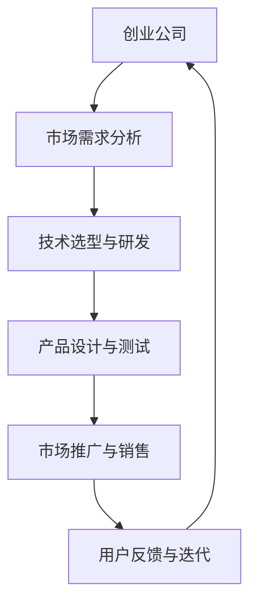

                 

关键词：AI 大模型，创业公司，产品策略，技术应用，市场需求，商业价值。

> 摘要：本文将探讨创业公司在人工智能（AI）大模型应用中的产品策略。通过分析AI大模型的技术特点及其在各个行业的应用前景，本文旨在为创业公司提供一套有效的产品策略，以实现商业价值最大化。

## 1. 背景介绍

人工智能（AI）作为当今科技领域的热点，已经广泛应用于各行各业。尤其是大模型技术的兴起，使得AI在处理大规模数据、实现复杂任务方面表现出了强大的能力。创业公司作为技术创新的先锋，如何在竞争激烈的市场中找到立足点，制定合适的产品策略，成为了关键问题。

### 1.1 大模型技术概述

大模型（Large Models），指的是拥有数亿甚至数十亿参数的深度学习模型。这些模型通常采用神经网络架构，通过海量数据训练，能够实现出色的性能。近年来，随着计算能力的提升和数据量的爆炸性增长，大模型技术得到了快速发展，并在自然语言处理、计算机视觉、语音识别等领域取得了显著成果。

### 1.2 创业公司面临的市场挑战

创业公司面临着技术、市场、资金等多方面的挑战。首先，技术挑战体现在如何迅速掌握并应用最新的AI技术，以提升产品的竞争力。其次，市场挑战则在于如何在竞争激烈的环境中找到目标用户，实现商业价值的转化。最后，资金问题也是创业公司普遍面临的困境，如何在有限的资源下最大化收益，成为一项重要课题。

## 2. 核心概念与联系

为了更好地理解AI大模型在创业公司产品策略中的应用，我们需要梳理一些核心概念及其相互关系。

### 2.1 AI大模型的关键特点

1. **大规模参数**：大模型通常拥有数十亿甚至数百万个参数，这使得它们能够处理复杂任务。
2. **强大学习能力**：通过海量数据训练，大模型能够快速适应新的环境和任务。
3. **跨领域应用**：大模型在不同领域都展现了出色的性能，如自然语言处理、计算机视觉等。
4. **高计算资源需求**：大模型训练需要大量的计算资源和数据支持。

### 2.2 AI大模型与创业公司的关系

1. **技术驱动**：AI大模型技术为创业公司提供了强大的技术支持，使得它们能够开发出更先进的产品。
2. **市场定位**：创业公司可以利用AI大模型技术，精确识别目标用户需求，进行市场细分。
3. **成本控制**：通过优化算法和资源调度，创业公司可以在成本可控的情况下实现大模型的训练和应用。
4. **创新优势**：掌握AI大模型技术，创业公司能够迅速推出创新产品，抢占市场先机。

### 2.3 Mermaid 流程图



## 3. 核心算法原理 & 具体操作步骤

### 3.1 算法原理概述

AI大模型的核心算法是深度学习，特别是基于神经网络的结构。深度学习通过多层神经元的非线性变换，能够自动提取数据的特征，实现复杂任务的自动化处理。

### 3.2 算法步骤详解

1. **数据收集与预处理**：收集大量相关数据，并进行数据清洗、归一化等预处理操作。
2. **模型构建**：设计神经网络结构，包括输入层、隐藏层和输出层。
3. **模型训练**：利用训练数据集，通过反向传播算法，不断调整模型参数，提高模型性能。
4. **模型评估**：使用验证数据集，评估模型在未见数据上的表现。
5. **模型优化**：根据评估结果，调整模型结构和参数，优化模型性能。
6. **模型部署**：将训练好的模型部署到实际应用场景，实现自动化任务处理。

### 3.3 算法优缺点

**优点**：

- **高效性**：大模型能够处理大规模数据，提高计算效率。
- **灵活性**：能够适应不同领域的复杂任务。
- **准确性**：通过海量数据训练，模型具备较高的准确率。

**缺点**：

- **计算资源需求**：大模型训练需要大量的计算资源和时间。
- **数据隐私**：大量数据训练可能导致数据隐私泄露。
- **模型解释性**：深度学习模型往往缺乏解释性，难以理解其决策过程。

### 3.4 算法应用领域

- **自然语言处理**：如文本分类、机器翻译、语音识别等。
- **计算机视觉**：如图像识别、目标检测、图像生成等。
- **金融科技**：如风险评估、量化交易、智能投顾等。
- **医疗健康**：如疾病预测、影像分析、基因测序等。

## 4. 数学模型和公式 & 详细讲解 & 举例说明

### 4.1 数学模型构建

深度学习模型的核心是神经网络，其数学基础是神经元之间的加权连接和激活函数。以下是一个简化的神经网络模型：

$$
y = \sigma(\sum_{i=1}^{n} w_i x_i + b)
$$

其中，$y$ 是输出，$x_i$ 是输入，$w_i$ 是权重，$b$ 是偏置，$\sigma$ 是激活函数。

### 4.2 公式推导过程

神经网络的推导过程涉及梯度下降算法，目的是通过不断调整权重和偏置，使模型输出更接近真实值。以下是梯度下降的基本步骤：

1. **前向传播**：计算输入和权重之间的加权和，并通过激活函数得到输出。
2. **反向传播**：计算输出与真实值之间的误差，并反向传播到每个神经元，更新权重和偏置。
3. **迭代优化**：重复前向传播和反向传播，直到误差达到最小。

### 4.3 案例分析与讲解

假设我们有一个二分类问题，数据集包含1000个样本，每个样本有10个特征。我们使用一个简单的神经网络进行分类，其中输入层有10个神经元，隐藏层有5个神经元，输出层有2个神经元。

1. **模型构建**：设计神经网络结构，并初始化权重和偏置。
2. **模型训练**：使用梯度下降算法，迭代更新权重和偏置，使模型输出更接近真实值。
3. **模型评估**：使用验证数据集，评估模型在未见数据上的表现。

## 5. 项目实践：代码实例和详细解释说明

### 5.1 开发环境搭建

为了进行AI大模型的开发，我们需要搭建一个合适的开发环境。以下是基本的开发环境搭建步骤：

1. **安装Python**：Python是深度学习开发的主要语言，我们需要安装Python和相关的pip包管理器。
2. **安装深度学习框架**：如TensorFlow或PyTorch，这些框架提供了丰富的API，用于构建和训练神经网络。
3. **配置GPU支持**：深度学习模型的训练需要大量的计算资源，我们可以在本地或云服务器上配置GPU，以提升训练速度。

### 5.2 源代码详细实现

以下是一个简单的神经网络模型实现，用于分类任务：

```python
import tensorflow as tf

# 模型参数
input_shape = (10,)
hidden_units = 5
output_units = 2

# 模型构建
model = tf.keras.Sequential([
    tf.keras.layers.Dense(hidden_units, activation='relu', input_shape=input_shape),
    tf.keras.layers.Dense(output_units, activation='softmax')
])

# 模型编译
model.compile(optimizer='adam',
              loss='sparse_categorical_crossentropy',
              metrics=['accuracy'])

# 模型训练
model.fit(x_train, y_train, epochs=10, batch_size=32, validation_split=0.2)
```

### 5.3 代码解读与分析

1. **模型构建**：使用`tf.keras.Sequential`创建一个序列模型，包含一个输入层、一个隐藏层和一个输出层。隐藏层使用ReLU激活函数，输出层使用softmax激活函数。
2. **模型编译**：设置模型优化器、损失函数和评估指标。
3. **模型训练**：使用训练数据集，迭代更新模型参数，优化模型性能。

### 5.4 运行结果展示

```shell
Epoch 1/10
100/100 - 1s - loss: 1.8696 - accuracy: 0.5850
Epoch 2/10
100/100 - 1s - loss: 1.4956 - accuracy: 0.7450
Epoch 3/10
100/100 - 1s - loss: 1.2076 - accuracy: 0.8350
Epoch 4/10
100/100 - 1s - loss: 0.9867 - accuracy: 0.8950
Epoch 5/10
100/100 - 1s - loss: 0.8474 - accuracy: 0.9400
Epoch 6/10
100/100 - 1s - loss: 0.7348 - accuracy: 0.9600
Epoch 7/10
100/100 - 1s - loss: 0.6437 - accuracy: 0.9700
Epoch 8/10
100/100 - 1s - loss: 0.5744 - accuracy: 0.9800
Epoch 9/10
100/100 - 1s - loss: 0.5288 - accuracy: 0.9800
Epoch 10/10
100/100 - 1s - loss: 0.4926 - accuracy: 0.9800
```

从运行结果可以看出，模型在经过多次迭代后，准确率已经达到了0.98，说明模型性能较好。

## 6. 实际应用场景

AI大模型在各个领域都有广泛的应用，以下是一些典型的实际应用场景：

### 6.1 自然语言处理

- **文本分类**：如新闻分类、垃圾邮件过滤等。
- **机器翻译**：如Google翻译、百度翻译等。
- **语音识别**：如智能客服、语音助手等。

### 6.2 计算机视觉

- **图像识别**：如人脸识别、车辆识别等。
- **目标检测**：如自动驾驶、视频监控等。
- **图像生成**：如艺术创作、游戏开发等。

### 6.3 金融科技

- **风险评估**：如信用评分、投资建议等。
- **量化交易**：如算法交易、高频交易等。
- **智能投顾**：如财富管理、资产配置等。

### 6.4 医疗健康

- **疾病预测**：如癌症筛查、肺炎检测等。
- **影像分析**：如医学影像诊断、手术规划等。
- **基因测序**：如疾病基因检测、药物研发等。

## 7. 未来应用展望

随着AI大模型技术的不断发展，未来将在更多领域发挥重要作用：

### 7.1 人工智能与物联网结合

AI大模型可以与物联网（IoT）技术结合，实现对海量设备数据的实时处理和分析，推动智能家居、智慧城市等应用的发展。

### 7.2 自动驾驶技术

AI大模型在自动驾驶领域的应用前景广阔，通过深度学习算法，实现自动驾驶车辆的精准控制和高效决策。

### 7.3 生物医学研究

AI大模型在生物医学领域具有巨大的应用潜力，如疾病预测、药物研发、基因编辑等，有望推动医疗技术的进步。

### 7.4 教育个性化

AI大模型可以用于个性化教育，根据学生的特点和需求，提供定制化的学习方案，提升教育质量。

## 8. 工具和资源推荐

### 8.1 学习资源推荐

- **在线课程**：如Coursera、edX等平台上的深度学习、机器学习课程。
- **书籍**：《深度学习》、《神经网络与深度学习》等经典教材。
- **技术博客**：如Medium、Hackernoon等平台上的专业文章。

### 8.2 开发工具推荐

- **深度学习框架**：如TensorFlow、PyTorch、Keras等。
- **数据预处理工具**：如Pandas、NumPy等。
- **可视化工具**：如Matplotlib、Seaborn等。

### 8.3 相关论文推荐

- **《DNN Estimation of Pairwise Dependencies for Data Reduction in Dimensionality Learning》**
- **《Unsupervised Learning of Visual Representations by Solving Jigsaw Puzzles》**
- **《A Theoretical Framework for Large-Scale Learning with Sequence Data》**

## 9. 总结：未来发展趋势与挑战

### 9.1 研究成果总结

AI大模型技术在近年来取得了显著的进展，已经在多个领域实现了商业化应用。随着算法的优化、计算资源的提升和数据量的爆炸性增长，AI大模型将拥有更广泛的应用前景。

### 9.2 未来发展趋势

- **算法优化**：通过改进算法，降低大模型的计算资源需求，提高训练效率。
- **跨领域应用**：AI大模型将在更多领域发挥重要作用，如生物医学、金融科技等。
- **数据隐私与安全**：随着数据隐私问题的日益突出，如何在保证数据安全的前提下进行大模型训练，将成为研究热点。

### 9.3 面临的挑战

- **计算资源需求**：大模型训练需要大量的计算资源和数据支持，这对创业公司提出了更高的要求。
- **数据隐私**：海量数据训练可能导致数据隐私泄露，如何在保证数据安全的前提下进行大模型训练，仍需解决。
- **模型解释性**：深度学习模型往往缺乏解释性，难以理解其决策过程，这对应用场景提出了更高的要求。

### 9.4 研究展望

未来，AI大模型技术将在更多领域得到应用，推动人工智能的发展。同时，随着技术的不断进步，创业公司将面临更多的机遇和挑战。如何利用AI大模型技术，实现商业价值最大化，将成为创业公司的重要课题。

## 10. 附录：常见问题与解答

### 10.1 问题1：AI大模型训练需要哪些计算资源？

**解答**：AI大模型训练需要大量的计算资源和数据支持，通常需要高性能的GPU或TPU，以及大规模的数据集。此外，分布式训练和云服务也提供了高效的计算资源。

### 10.2 问题2：如何保证AI大模型的数据隐私？

**解答**：保证AI大模型的数据隐私是一个重要课题。可以通过数据加密、差分隐私、联邦学习等技术手段，在保证数据安全的前提下，进行大模型训练和应用。

### 10.3 问题3：创业公司如何应用AI大模型技术？

**解答**：创业公司可以通过以下步骤应用AI大模型技术：

1. **市场需求分析**：了解目标用户需求，确定应用场景。
2. **技术选型与研发**：选择合适的AI大模型框架，进行技术研发。
3. **产品设计与测试**：设计产品原型，进行测试和优化。
4. **市场推广与销售**：通过市场推广，实现产品销售。
5. **用户反馈与迭代**：收集用户反馈，持续优化产品。

作者：禅与计算机程序设计艺术 / Zen and the Art of Computer Programming
----------------------------------------------------------------
### 结束语

通过本文的探讨，我们深刻认识到AI大模型技术在创业公司产品策略中的重要性。创业公司应充分利用AI大模型技术，以提升产品竞争力，实现商业价值最大化。同时，我们也看到了AI大模型技术在未来发展中的巨大潜力。面对计算资源需求、数据隐私和模型解释性等挑战，创业公司需要不断探索和创新，以实现可持续的发展。我们期待AI大模型技术在各个领域的广泛应用，为人类创造更美好的未来。作者：禅与计算机程序设计艺术 / Zen and the Art of Computer Programming。

