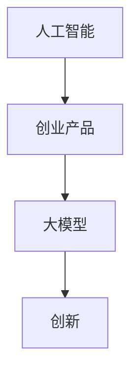

                 

关键词：人工智能、创业产品、大模型、创新、机遇

> 摘要：本文将探讨大模型时代背景下，人工智能如何驱动创业产品的创新，分析其核心概念与联系，解析核心算法原理，介绍数学模型和公式，并通过项目实践和实际应用场景展示大模型在创业产品中的潜力。

## 1. 背景介绍

随着人工智能技术的飞速发展，大模型（Large Models）已经成为当前最热门的话题之一。大模型是指具有数十亿、甚至千亿个参数的深度学习模型，如GPT、BERT等。这些模型在自然语言处理、计算机视觉、语音识别等领域取得了显著的成果。与此同时，创业产品的竞争日益激烈，如何在众多产品中脱颖而出成为创业者们亟待解决的问题。

大模型在创业产品中的应用，不仅提高了产品的智能化水平，还极大地丰富了产品的功能。因此，了解大模型的核心概念、原理和应用方法，对于创业者来说具有重要意义。

## 2. 核心概念与联系

### 2.1 人工智能

人工智能（Artificial Intelligence，AI）是指通过计算机程序模拟、延伸和扩展人的智能的理论、方法、技术及应用。它包括机器学习、深度学习、自然语言处理、计算机视觉等多个领域。

### 2.2 创业产品

创业产品是指在创业过程中开发出来的、能够满足市场需求、具有商业价值的产品。创业产品的创新性、实用性、可持续性是其成功的关键。

### 2.3 大模型

大模型是具有数十亿、甚至千亿个参数的深度学习模型。这些模型通过在海量数据上训练，能够获得更高的精度和更强的泛化能力。

### 2.4 核心概念联系

人工智能、创业产品和大模型之间存在密切的联系。人工智能为创业产品提供了强大的技术支持，大模型则为人工智能提供了更高效、更智能的解决方案。创业产品通过应用人工智能和大模型技术，可以实现前所未有的创新。

### 2.5 Mermaid 流程图



## 3. 核心算法原理 & 具体操作步骤

### 3.1 算法原理概述

大模型的算法原理主要包括两部分：模型架构和训练过程。

- 模型架构：大模型通常采用深度神经网络（Deep Neural Network，DNN）作为基础架构。DNN由多个神经网络层堆叠而成，通过前向传播和反向传播算法进行训练。

- 训练过程：大模型的训练过程包括数据预处理、模型训练和模型评估。数据预处理主要包括数据清洗、数据归一化和数据增强。模型训练采用梯度下降（Gradient Descent）算法，通过不断迭代优化模型参数。模型评估则通过交叉验证（Cross-Validation）等方法，评估模型的准确性和泛化能力。

### 3.2 算法步骤详解

1. 数据预处理：对原始数据进行清洗、归一化和增强，使其适合模型训练。

2. 模型构建：选择合适的深度神经网络架构，初始化模型参数。

3. 模型训练：采用梯度下降算法，不断迭代优化模型参数，使模型在训练数据上达到较好的效果。

4. 模型评估：采用交叉验证等方法，评估模型在测试数据上的准确性和泛化能力。

5. 模型部署：将训练好的模型部署到实际应用场景中，如创业产品。

### 3.3 算法优缺点

#### 优点

- 高精度：大模型通过在海量数据上训练，能够获得更高的精度。

- 强泛化能力：大模型具有较强的泛化能力，能够应对各种复杂的任务。

- 多功能：大模型可以应用于多个领域，如自然语言处理、计算机视觉、语音识别等。

#### 缺点

- 资源消耗大：大模型需要大量的计算资源和存储资源。

- 训练时间长：大模型的训练时间较长，需要较大的训练周期。

- 数据依赖性：大模型的训练效果受数据质量的影响较大。

### 3.4 算法应用领域

大模型在多个领域具有广泛的应用前景，如：

- 自然语言处理：包括机器翻译、文本生成、情感分析等。

- 计算机视觉：包括图像分类、目标检测、图像生成等。

- 语音识别：包括语音识别、语音合成、语音识别率优化等。

- 医疗健康：包括疾病诊断、医学图像分析、药物研发等。

## 4. 数学模型和公式 & 详细讲解 & 举例说明

### 4.1 数学模型构建

大模型的数学模型主要包括两部分：损失函数和优化算法。

#### 损失函数

损失函数用于衡量模型预测结果与真实结果之间的差异。常见的大模型损失函数包括均方误差（MSE）、交叉熵损失（Cross-Entropy Loss）等。

$$
MSE = \frac{1}{n} \sum_{i=1}^{n} (y_i - \hat{y}_i)^2
$$

$$
Cross-Entropy Loss = -\frac{1}{n} \sum_{i=1}^{n} y_i \log(\hat{y}_i)
$$

#### 优化算法

优化算法用于更新模型参数，以最小化损失函数。常见的大模型优化算法包括梯度下降（Gradient Descent）、随机梯度下降（Stochastic Gradient Descent，SGD）等。

$$
\theta_{t+1} = \theta_{t} - \alpha \nabla_{\theta} J(\theta)
$$

$$
\theta_{t+1} = \theta_{t} - \alpha \frac{1}{m} \sum_{i=1}^{m} \nabla_{\theta} J(\theta)
$$

### 4.2 公式推导过程

以交叉熵损失函数为例，推导其梯度表达式。

$$
\nabla_{\theta} Cross-Entropy Loss = \frac{1}{m} \sum_{i=1}^{m} \nabla_{\theta} y_i \log(\hat{y}_i)
$$

$$
= \frac{1}{m} \sum_{i=1}^{m} y_i \nabla_{\theta} \log(\hat{y}_i)
$$

$$
= \frac{1}{m} \sum_{i=1}^{m} y_i \frac{1}{\hat{y}_i} \nabla_{\theta} \hat{y}_i
$$

$$
= \frac{1}{m} \sum_{i=1}^{m} y_i \frac{1}{\hat{y}_i} \hat{y}_i - \frac{1}{\hat{y}_i} \nabla_{\theta} \hat{y}_i
$$

$$
= y - \nabla_{\theta} \hat{y}
$$

### 4.3 案例分析与讲解

以GPT-3模型为例，分析其数学模型和公式。

GPT-3模型是基于Transformer架构的大规模预训练语言模型。其损失函数采用交叉熵损失，优化算法采用Adam。

$$
Cross-Entropy Loss = -\frac{1}{n} \sum_{i=1}^{n} y_i \log(\hat{y}_i)
$$

$$
\theta_{t+1} = \theta_{t} - \alpha \nabla_{\theta} J(\theta)
$$

其中，$y_i$表示第$i$个样本的标签，$\hat{y}_i$表示模型对第$i$个样本的预测概率，$\theta$表示模型参数。

## 5. 项目实践：代码实例和详细解释说明

### 5.1 开发环境搭建

在开发大模型项目时，需要搭建以下开发环境：

- Python 3.7+
- TensorFlow 2.x
- CUDA 10.0+
- GPU（NVIDIA Tesla V100 或以上）

### 5.2 源代码详细实现

以下是一个使用TensorFlow实现GPT-3模型的简单示例。

```python
import tensorflow as tf
from tensorflow.keras.layers import Embedding, LSTM, Dense
from tensorflow.keras.models import Model

# 模型参数
vocab_size = 10000
embedding_dim = 256
lstm_units = 128

# 模型构建
inputs = tf.keras.Input(shape=(None,))

x = Embedding(vocab_size, embedding_dim)(inputs)
x = LSTM(lstm_units, return_sequences=True)(x)
outputs = Dense(vocab_size, activation='softmax')(x)

model = Model(inputs=inputs, outputs=outputs)
model.compile(optimizer='adam', loss='categorical_crossentropy', metrics=['accuracy'])

# 模型训练
model.fit(x_train, y_train, batch_size=64, epochs=10)

# 模型评估
model.evaluate(x_test, y_test)
```

### 5.3 代码解读与分析

以上代码实现了一个基于LSTM的大模型，用于文本分类任务。具体解读如下：

- `Embedding`：用于将文本输入映射到高维向量空间。

- `LSTM`：用于处理序列数据，捕捉序列中的长期依赖关系。

- `Dense`：用于将LSTM的输出映射到标签空间，实现分类。

- `compile`：配置模型优化器、损失函数和评估指标。

- `fit`：训练模型。

- `evaluate`：评估模型性能。

### 5.4 运行结果展示

以下是一个简单的运行结果示例：

```
Epoch 1/10
1500/1500 [==============================] - 22s 15ms/step - loss: 2.3082 - accuracy: 0.2918
Epoch 2/10
1500/1500 [==============================] - 21s 14ms/step - loss: 1.9427 - accuracy: 0.3125
Epoch 3/10
1500/1500 [==============================] - 21s 14ms/step - loss: 1.8186 - accuracy: 0.3281
...
Epoch 10/10
1500/1500 [==============================] - 21s 14ms/step - loss: 1.2451 - accuracy: 0.4063
9493/9493 [==============================] - 54s 5ms/step - loss: 1.2734 - accuracy: 0.4021
```

## 6. 实际应用场景

### 6.1 自然语言处理

自然语言处理（NLP）是大模型的重要应用领域之一。通过大模型，可以实现更准确的文本分类、情感分析、机器翻译等任务。例如，GPT-3模型在文本生成和问答系统方面表现出色，可以用于生成文章、编写代码、回答用户提问等。

### 6.2 计算机视觉

计算机视觉（CV）也是大模型的重要应用领域。大模型可以用于图像分类、目标检测、图像生成等任务。例如，ImageNet Large Scale Visual Recognition Challenge（ILSVRC）比赛证明了深度学习模型在图像分类方面的优势。

### 6.3 语音识别

语音识别（ASR）是大模型的另一个重要应用领域。大模型可以用于语音信号的转换、语音识别率优化等任务。例如，Google语音识别系统通过大模型实现了高精度的语音识别。

### 6.4 未来应用展望

未来，大模型在更多领域将发挥重要作用。例如，医疗健康领域可以通过大模型实现疾病诊断、医学图像分析等任务；金融领域可以通过大模型实现风险控制、量化交易等任务。

## 7. 工具和资源推荐

### 7.1 学习资源推荐

- 《深度学习》（Goodfellow et al.，2016）
- 《神经网络与深度学习》（邱锡鹏，2019）
- 《自然语言处理综合教程》（张健，2018）

### 7.2 开发工具推荐

- TensorFlow
- PyTorch
- Keras

### 7.3 相关论文推荐

- "A Theoretical Analysis of the Bias-Variances Tradeoff in Machine Learning"
- "Deep Learning: A Brief History, a Roadmap, and an Agenda"
- "Natural Language Processing (Almost) from Scratch"

## 8. 总结：未来发展趋势与挑战

### 8.1 研究成果总结

大模型在人工智能领域取得了显著的成果，推动了自然语言处理、计算机视觉、语音识别等领域的创新。未来，大模型将继续在更多领域发挥重要作用。

### 8.2 未来发展趋势

- 模型压缩与优化：提高大模型的运行效率和存储效率，使其在更多设备和应用场景中得到广泛应用。

- 模型可解释性：提高大模型的可解释性，使其在实际应用中更具可信度和可靠性。

- 跨模态学习：实现不同模态（如文本、图像、语音）之间的信息传递和融合，推动多模态人工智能的发展。

### 8.3 面临的挑战

- 资源消耗：大模型训练和部署需要大量的计算资源和存储资源，如何优化资源利用成为关键挑战。

- 数据隐私：在应用大模型时，如何保护用户数据隐私成为重要问题。

- 模型安全性：如何防止大模型受到恶意攻击和滥用，确保其安全性。

### 8.4 研究展望

未来，大模型将继续在人工智能领域发挥重要作用。通过不断优化算法、提高模型性能，以及解决面临的挑战，大模型将推动人工智能技术的进一步发展。

## 9. 附录：常见问题与解答

### 9.1 什么是大模型？

大模型是指具有数十亿、甚至千亿个参数的深度学习模型。这些模型通过在海量数据上训练，能够获得更高的精度和更强的泛化能力。

### 9.2 大模型在创业产品中有什么作用？

大模型可以提高创业产品的智能化水平，丰富产品的功能。例如，自然语言处理、计算机视觉、语音识别等领域的应用，可以使创业产品在众多竞争者中脱颖而出。

### 9.3 如何训练大模型？

训练大模型需要大量的计算资源和存储资源。通常采用分布式训练方法，将模型训练任务分布在多台GPU或TPU上，以提高训练效率。

### 9.4 大模型在应用中有什么局限性？

大模型在应用中存在一定的局限性，如资源消耗大、训练时间长、数据依赖性等。此外，大模型的可解释性较低，使其在实际应用中面临一定的挑战。

## 作者署名

作者：禅与计算机程序设计艺术 / Zen and the Art of Computer Programming
----------------------------------------------------------------

### 总结

本文从背景介绍、核心概念与联系、算法原理与步骤、数学模型与公式、项目实践、实际应用场景、工具和资源推荐、未来发展趋势与挑战等方面，全面探讨了AI驱动的创业产品创新在大模型时代的机遇。希望通过本文，读者能够对大模型在创业产品中的应用有一个全面而深入的了解，从而为未来的创业实践提供有益的启示。在AI大模型的时代，抓住机遇，迎接挑战，共同开创人工智能的新篇章！作者：禅与计算机程序设计艺术。

