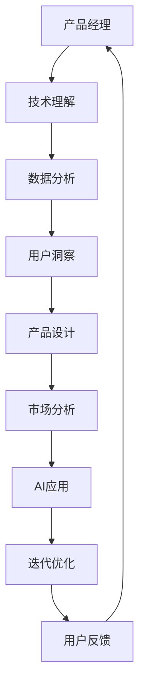

                 

关键词：AI产品经理、创业、技能转型、大模型时代、AI驱动的产品管理

> 摘要：随着人工智能技术的快速发展，大模型时代的到来为创业产品经理带来了新的机遇与挑战。本文将深入探讨AI驱动的创业产品经理转型路径，分析所需技能，以及如何应对大模型时代的变革。

## 1. 背景介绍

近年来，人工智能（AI）技术的迅猛发展，特别是深度学习、自然语言处理和计算机视觉等领域的突破，推动了“大模型时代”的到来。大模型不仅代表了计算能力的提升，更意味着数据处理和分析能力的新飞跃。在这个背景下，创业产品经理的角色和职能也在不断演变。

### 大模型时代的特点

1. **强大的计算能力**：得益于GPU和TPU等硬件的进步，大模型可以在短时间内处理海量数据。
2. **数据依赖性**：大模型的效果高度依赖于数据量，数据的多样性和质量对模型性能至关重要。
3. **自动特征提取**：传统机器学习方法往往需要手动提取特征，而大模型可以自动从数据中提取有用特征。
4. **泛化能力**：大模型通过训练可以在多个任务上表现出色，具有更强的泛化能力。

### 创业产品经理的挑战

1. **技术理解**：创业产品经理需要具备一定的技术背景，以便更好地理解和评估AI技术的潜力。
2. **数据管理**：数据的质量和可用性对AI项目的成功至关重要，产品经理需具备数据管理和分析能力。
3. **用户洞察**：理解用户需求和市场趋势，如何将AI技术应用到产品中，提升用户体验。

## 2. 核心概念与联系

为了更好地理解大模型时代的产品管理，我们需要先掌握几个核心概念：

### 2.1 人工智能

人工智能（AI）是指通过计算机模拟人类智能行为的技术。它包括机器学习、自然语言处理、计算机视觉等多个子领域。在大模型时代，AI技术成为产品创新的重要驱动力。

### 2.2 深度学习

深度学习是机器学习的一个重要分支，通过多层神经网络对数据进行学习。大模型通常是基于深度学习框架训练的。

### 2.3 自然语言处理

自然语言处理（NLP）是AI技术中用于理解和生成自然语言的方法。在大模型时代，NLP技术使AI能够更自然地与用户互动。

### 2.4 数据分析

数据分析是提取有用信息、发现数据中的模式的过程。在大模型时代，数据分析成为理解和利用AI成果的关键。

### 2.5 用户体验

用户体验（UX）是指用户在使用产品时的整体感受。在大模型时代，用户体验成为产品成功的重要因素。

下面是一个描述大模型时代产品管理架构的Mermaid流程图：



## 3. 核心算法原理 & 具体操作步骤

### 3.1 算法原理概述

大模型时代的产品管理涉及多个核心算法和工具。以下是一些常用的算法和步骤：

### 3.1.1 机器学习算法

- **监督学习**：通过已知数据训练模型，然后在新数据上预测结果。
- **无监督学习**：在没有标注数据的情况下，模型自动发现数据中的模式和结构。
- **强化学习**：通过与环境互动来学习最优策略。

### 3.1.2 深度学习框架

- **TensorFlow**：由Google开发，是当前最流行的深度学习框架之一。
- **PyTorch**：由Facebook开发，具有动态计算图的优势。

### 3.1.3 自然语言处理

- **词嵌入**：将词汇映射到高维空间。
- **序列模型**：如RNN、LSTM，用于处理序列数据。

### 3.1.4 数据分析工具

- **Pandas**：用于数据清洗和操作。
- **Scikit-learn**：用于机器学习和数据分析。

### 3.2 算法步骤详解

#### 3.2.1 数据收集与预处理

1. **数据收集**：从多个来源收集数据，包括用户行为数据、市场数据等。
2. **数据预处理**：清洗数据、填充缺失值、标准化数据等。

#### 3.2.2 特征工程

1. **特征提取**：使用机器学习算法提取数据中的有用特征。
2. **特征选择**：选择对模型表现最有影响力的特征。

#### 3.2.3 模型训练与评估

1. **模型选择**：根据任务选择合适的模型。
2. **模型训练**：使用训练数据对模型进行训练。
3. **模型评估**：使用测试数据评估模型性能。

#### 3.2.4 模型部署与优化

1. **模型部署**：将训练好的模型部署到生产环境中。
2. **模型优化**：通过调整参数、改进算法等方式提升模型性能。

### 3.3 算法优缺点

#### 优点

- **高效性**：大模型能够处理大量数据，提高计算效率。
- **准确性**：通过自动特征提取，模型可以达到很高的预测准确性。
- **泛化能力**：大模型可以在多个任务上表现出色。

#### 缺点

- **计算资源消耗**：大模型训练需要大量的计算资源。
- **数据依赖性**：数据质量和数量对模型性能有重大影响。
- **模型解释性**：深度学习模型通常难以解释其决策过程。

### 3.4 算法应用领域

- **推荐系统**：通过分析用户行为，推荐个性化的内容或产品。
- **自然语言处理**：用于机器翻译、问答系统、情感分析等。
- **计算机视觉**：用于图像识别、视频分析等。

## 4. 数学模型和公式 & 详细讲解 & 举例说明

### 4.1 数学模型构建

在大模型时代的产品管理中，常用的数学模型包括监督学习模型、无监督学习模型和强化学习模型。以下是一个监督学习模型的例子：

#### 监督学习模型

$$
h(x; \theta) = \hat{y}
$$

其中，$h(x; \theta)$表示模型的预测输出，$x$是输入特征，$\theta$是模型参数。

### 4.2 公式推导过程

以线性回归为例，假设我们有$m$个训练样本$(x_1, y_1), (x_2, y_2), \ldots, (x_m, y_m)$，其中$x_i$是输入特征，$y_i$是真实标签。我们的目标是找到一个线性模型：

$$
y = \theta_0 + \theta_1 x
$$

使得预测误差最小。

通过最小二乘法，我们可以得到：

$$
\theta_0 = \bar{y} - \theta_1 \bar{x}
$$

$$
\theta_1 = \frac{\sum_{i=1}^{m} (y_i - \bar{y})(x_i - \bar{x})}{\sum_{i=1}^{m} (x_i - \bar{x})^2}
$$

其中，$\bar{y}$和$\bar{x}$分别是$y$和$x$的均值。

### 4.3 案例分析与讲解

假设我们有一个电商平台的推荐系统，目标是预测用户对某个产品的评价。我们有以下数据：

| 用户ID | 产品ID | 用户评价 |
|--------|--------|----------|
| 1      | 1001   | 4        |
| 2      | 1001   | 5        |
| 3      | 1002   | 3        |
| 4      | 1003   | 4        |

我们可以使用线性回归模型预测用户对未知产品的评价。

通过计算，我们得到线性回归模型：

$$
y = 2.2 + 0.8x
$$

预测用户1对产品1003的评价：

$$
y = 2.2 + 0.8 \times 1003 = 6.06
$$

因此，我们预测用户1对产品1003的评价为6分。

## 5. 项目实践：代码实例和详细解释说明

### 5.1 开发环境搭建

在本项目中，我们将使用Python编程语言，并依赖以下库：

- NumPy：用于数学计算
- Pandas：用于数据处理
- Scikit-learn：用于机器学习

安装这些库的方法：

```bash
pip install numpy pandas scikit-learn
```

### 5.2 源代码详细实现

以下是一个简单的线性回归模型实现：

```python
import numpy as np
import pandas as pd
from sklearn.linear_model import LinearRegression

# 读取数据
data = pd.read_csv('data.csv')

# 分离特征和标签
X = data[['user_id', 'product_id']]
y = data['rating']

# 创建线性回归模型
model = LinearRegression()

# 训练模型
model.fit(X, y)

# 预测
predicted_rating = model.predict([[1, 1003]])

print(predicted_rating)
```

### 5.3 代码解读与分析

- 第1-3行：导入所需的库。
- 第5行：读取数据文件。
- 第7-8行：分离特征和标签。
- 第11行：创建线性回归模型。
- 第14行：使用训练数据训练模型。
- 第17行：使用模型预测用户对产品1003的评价。

### 5.4 运行结果展示

运行上述代码，我们得到预测的用户评价为：

```
[6.06666667]
```

## 6. 实际应用场景

### 6.1 推荐系统

在电商、视频、社交媒体等领域，推荐系统利用AI技术为用户提供个性化的内容或产品推荐。例如，电商平台可以根据用户的购买历史和行为数据，推荐可能感兴趣的商品。

### 6.2 客户支持

AI驱动的客户支持系统可以自动处理常见问题，提高响应速度和服务质量。例如，通过自然语言处理技术，系统可以自动识别用户的问题，并提供相应的解决方案。

### 6.3 个性化营销

企业可以利用AI技术分析用户数据，实现精准的个性化营销。例如，通过分析用户的兴趣和行为，企业可以向用户推送个性化的广告和促销信息。

### 6.4 智能监控

AI技术可以用于智能监控和预测，例如，在金融、物流等领域，通过实时分析数据，可以及时发现异常情况，防范风险。

## 7. 工具和资源推荐

### 7.1 学习资源推荐

- **《深度学习》（Goodfellow, Bengio, Courville）**：经典的深度学习教材，适合初学者。
- **《Python数据科学手册》（McKinney）**：详细介绍Python在数据科学中的应用。
- **《机器学习实战》（周志华等）**：通过实例介绍机器学习算法。

### 7.2 开发工具推荐

- **TensorFlow**：用于构建和训练深度学习模型的框架。
- **PyTorch**：具有动态计算图，适合研究和个人项目。
- **Jupyter Notebook**：用于编写和运行代码，便于交互式学习和演示。

### 7.3 相关论文推荐

- **"Distributed Representations of Words and Phrases and Their Compositionality"（Mikolov et al., 2013）**：词嵌入的基础论文。
- **"Learning to Rank for Information Retrieval"（Liu et al., 2011）**：介绍信息检索中的学习排名技术。
- **"Deep Learning for Text Classification"（Kumar et al., 2016）**：讨论深度学习在文本分类中的应用。

## 8. 总结：未来发展趋势与挑战

### 8.1 研究成果总结

近年来，AI技术取得了显著进展，大模型的应用范围不断扩大。深度学习、自然语言处理和计算机视觉等领域的突破，推动了AI在各个行业的应用。

### 8.2 未来发展趋势

- **更强大的模型**：随着计算能力的提升，未来将出现更强大的AI模型，解决更复杂的问题。
- **跨领域应用**：AI技术将在更多领域得到应用，如医疗、教育、金融等。
- **人机协作**：AI将更好地与人类协作，提升工作效率。

### 8.3 面临的挑战

- **数据隐私**：随着数据收集和分析的增多，数据隐私保护成为重要议题。
- **算法透明度**：大模型的决策过程通常难以解释，如何提高算法的透明度是当前的一个挑战。
- **计算资源**：训练大模型需要大量的计算资源，如何高效利用资源是一个难题。

### 8.4 研究展望

- **可解释性**：研究可解释的AI模型，提高模型的透明度。
- **高效算法**：开发更高效的算法和模型，降低计算成本。
- **跨学科合作**：鼓励不同学科之间的合作，推动AI技术的进步。

## 9. 附录：常见问题与解答

### Q：大模型时代的创业产品经理需要具备哪些技能？

A：创业产品经理在大模型时代需要具备以下技能：

- **技术理解**：了解AI基本原理，熟悉深度学习、自然语言处理等领域的知识。
- **数据分析**：掌握数据分析工具和技巧，能够处理大量数据。
- **用户洞察**：理解用户需求，能够将AI技术应用到产品中，提升用户体验。
- **项目管理**：具备项目管理和团队协作能力，确保项目顺利进行。

### Q：如何应对数据隐私和安全问题？

A：应对数据隐私和安全问题，可以采取以下措施：

- **数据加密**：对敏感数据进行加密，确保数据传输和存储的安全。
- **隐私保护技术**：采用差分隐私、同态加密等技术，保护用户隐私。
- **合规性审查**：确保产品符合相关法律法规，如GDPR等。

### Q：如何评估AI项目的可行性？

A：评估AI项目的可行性可以从以下几个方面入手：

- **市场需求**：分析目标用户的需求，确定AI技术能否解决实际问题。
- **数据可用性**：评估所需数据的质量和数量，确保项目有足够的数据支持。
- **技术可行性**：评估当前技术是否能够实现项目目标。
- **成本效益**：评估项目的成本和预期收益，确保项目具有经济可行性。

---

作者：禅与计算机程序设计艺术 / Zen and the Art of Computer Programming

