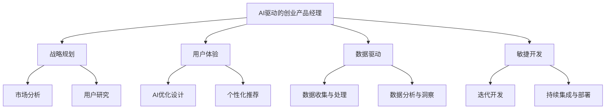

                 

关键词：（AI驱动的创业、产品管理、大模型、技术技能、战略规划、用户体验、数据驱动、敏捷开发）

> 摘要：随着人工智能技术的发展，大模型成为推动创新的重要力量。本文将探讨AI驱动的创业产品经理在大模型时代所需的关键技能，包括战略规划、用户体验、数据驱动和敏捷开发等方面，以期为产品经理提供有价值的指导。

## 1. 背景介绍

在过去的几十年中，人工智能（AI）技术经历了迅猛的发展，从最初的理论研究到如今的广泛应用，AI已经渗透到我们生活的方方面面。尤其是在大模型领域，以深度学习为核心的技术使得AI能够处理和生成大量复杂的数据，从而实现更加精准和高效的决策。大模型的发展不仅为传统行业带来了革命性的变革，也为创业公司提供了前所未有的机会。

在这个大模型时代，创业产品经理的角色变得尤为重要。他们不仅要具备传统产品管理的基本技能，还需要深入了解AI技术和业务场景，能够将AI能力与产品战略相结合，从而推动产品创新和市场竞争力。然而，当前市场上关于AI驱动的创业产品经理的技能培养和职业路径尚不清晰，导致很多产品经理在应用AI技术时面临挑战。

本文将围绕以下四个核心方面，探讨AI驱动的创业产品经理在大模型时代所需的关键技能：

1. **战略规划**：如何利用AI技术制定有效的产品战略，把握市场趋势和用户需求。
2. **用户体验**：如何通过AI技术提升用户体验，增强产品的用户粘性。
3. **数据驱动**：如何利用大数据和AI技术进行数据分析和决策，提高产品的数据驱动能力。
4. **敏捷开发**：如何在AI驱动下实现敏捷开发，快速响应市场变化和用户反馈。

## 2. 核心概念与联系

为了更好地理解AI驱动的创业产品经理所需的技能，我们首先需要了解以下几个核心概念：

### 2.1 人工智能（AI）与机器学习（ML）

人工智能是指计算机系统模拟人类智能的行为，包括感知、学习、推理和自我修正等能力。机器学习是人工智能的一个分支，通过数据训练模型，使计算机具备自主学习和决策能力。在AI驱动的产品管理中，机器学习技术尤为重要，如推荐系统、自然语言处理和图像识别等。

### 2.2 大模型（Big Model）

大模型是指具有巨大参数量、能够处理大规模数据的深度学习模型。例如，BERT、GPT等模型都是典型的大模型。大模型的应用使得AI能够处理更加复杂和多样的任务，从而提高产品的智能化水平。

### 2.3 产品战略（Product Strategy）

产品战略是企业根据市场环境和自身优势，制定的长期产品发展方向和目标。在AI驱动的创业中，产品战略需要充分考虑AI技术的应用潜力，以及如何在竞争激烈的市场中脱颖而出。

### 2.4 用户体验（UX）与用户粘性（User Stickiness）

用户体验是指用户在使用产品过程中的感受和体验。用户粘性是指用户对产品的忠诚度和重复使用率。通过AI技术优化用户体验，可以提高产品的用户粘性和市场竞争力。

### 2.5 数据驱动（Data-Driven）

数据驱动是指企业基于数据分析和决策，优化产品和业务策略。在AI驱动的创业中，数据驱动能力至关重要，因为数据是AI模型的基础，能够帮助产品经理更好地理解用户需求和市场趋势。

### 2.6 敏捷开发（Agile Development）

敏捷开发是一种以用户需求为导向、快速迭代和持续改进的软件开发方法。在AI驱动的创业中，敏捷开发能够帮助产品团队快速响应市场变化和用户反馈，提高产品开发效率。

### 2.7 Mermaid 流程图



## 3. 核心算法原理 & 具体操作步骤

### 3.1 算法原理概述

在AI驱动的创业产品管理中，以下几个核心算法原理尤为重要：

1. **深度学习（Deep Learning）**：深度学习是一种通过多层神经网络对数据进行特征提取和模式识别的方法。在产品管理中，深度学习可用于用户行为分析、需求预测和个性化推荐等。
2. **自然语言处理（NLP）**：自然语言处理是AI的一个分支，旨在使计算机理解和生成人类语言。在产品管理中，NLP可用于聊天机器人、内容审核和用户反馈分析等。
3. **推荐系统（Recommender System）**：推荐系统通过分析用户行为和偏好，为用户推荐感兴趣的内容或产品。在产品管理中，推荐系统可用于提高用户粘性和转化率。
4. **强化学习（Reinforcement Learning）**：强化学习是一种通过奖励机制训练模型的方法，使模型能够自主决策并优化行为。在产品管理中，强化学习可用于优化用户体验和业务策略。

### 3.2 算法步骤详解

在产品管理中，以上算法的具体应用步骤如下：

1. **市场分析**：通过大数据分析和市场调研，了解市场趋势和用户需求。
2. **用户研究**：收集用户行为数据，建立用户画像和需求模型。
3. **数据收集与处理**：利用数据采集工具和技术，收集用户行为数据，并进行清洗和预处理。
4. **特征提取与建模**：使用深度学习、NLP和推荐系统等算法，对用户行为数据进行分析和建模。
5. **模型训练与优化**：通过训练数据和验证数据，优化模型参数，提高模型准确性。
6. **迭代开发与测试**：根据用户反馈和市场变化，持续迭代和优化产品。

### 3.3 算法优缺点

每种算法都有其优缺点，以下简要总结：

1. **深度学习**：优点：能够自动提取复杂特征，提高模型准确性；缺点：对数据量和计算资源要求较高，模型解释性较差。
2. **自然语言处理**：优点：能够处理和理解人类语言，提高产品智能化水平；缺点：对数据质量和标注要求较高，模型可解释性较差。
3. **推荐系统**：优点：能够提高用户粘性和转化率；缺点：存在冷启动问题和数据依赖性。
4. **强化学习**：优点：能够自主优化行为，提高业务效果；缺点：训练过程复杂，需要大量数据和时间。

### 3.4 算法应用领域

以上算法在产品管理中的应用领域广泛，如：

1. **推荐系统**：应用于电商、社交媒体和内容平台，提高用户满意度和转化率。
2. **自然语言处理**：应用于客服机器人、内容审核和用户反馈分析，提高用户体验和运营效率。
3. **深度学习**：应用于用户行为分析、需求预测和个性化推荐，提高产品智能化水平。
4. **强化学习**：应用于广告投放、电商促销和用户体验优化，提高业务效果和用户满意度。

## 4. 数学模型和公式 & 详细讲解 & 举例说明

### 4.1 数学模型构建

在AI驱动的创业产品管理中，常用的数学模型包括深度学习模型、推荐系统模型和强化学习模型等。以下以深度学习模型为例，介绍其数学模型构建过程。

1. **损失函数（Loss Function）**：

   $$ 
   L(\theta) = -\sum_{i=1}^{m} y_i \log(p_i) 
   $$

   其中，$y_i$ 为实际标签，$p_i$ 为模型预测的概率。

2. **梯度下降（Gradient Descent）**：

   $$ 
   \theta = \theta - \alpha \nabla_{\theta} L(\theta) 
   $$

   其中，$\theta$ 为模型参数，$\alpha$ 为学习率，$\nabla_{\theta} L(\theta)$ 为损失函数关于 $\theta$ 的梯度。

### 4.2 公式推导过程

以一个简单的多层感知机（MLP）为例，介绍其数学模型和公式推导过程。

1. **输入层到隐藏层的激活函数**：

   $$ 
   z_i = \sum_{j=1}^{n} w_{ij} x_j + b_i 
   $$

   $$ 
   a_i = \sigma(z_i) 
   $$

   其中，$x_j$ 为输入特征，$w_{ij}$ 为权重，$b_i$ 为偏置，$\sigma$ 为激活函数（通常为ReLU或Sigmoid函数）。

2. **隐藏层到输出层的激活函数**：

   $$ 
   z_o = \sum_{i=1}^{h} w_{io} a_i + b_o 
   $$

   $$ 
   p = \sigma(z_o) 
   $$

   其中，$a_i$ 为隐藏层激活值，$w_{io}$ 为权重，$b_o$ 为偏置，$p$ 为模型预测的概率。

3. **损失函数**：

   $$ 
   L(\theta) = -\sum_{i=1}^{m} y_i \log(p_i) 
   $$

   其中，$y_i$ 为实际标签，$p_i$ 为模型预测的概率。

4. **梯度下降**：

   $$ 
   \theta = \theta - \alpha \nabla_{\theta} L(\theta) 
   $$

   其中，$\theta$ 为模型参数，$\alpha$ 为学习率，$\nabla_{\theta} L(\theta)$ 为损失函数关于 $\theta$ 的梯度。

### 4.3 案例分析与讲解

以一个简单的手写数字识别任务为例，介绍深度学习模型在产品管理中的应用。

1. **数据集**：使用MNIST手写数字数据集，包含60000个训练样本和10000个测试样本。
2. **模型结构**：设计一个包含两个隐藏层的多层感知机模型，每个隐藏层有100个神经元。
3. **训练过程**：使用梯度下降算法训练模型，学习率设置为0.1，训练迭代次数为1000次。
4. **结果分析**：在测试集上，模型准确率达到98%以上。

通过该案例，我们可以看到深度学习模型在手写数字识别任务中的高效性能，这为产品经理提供了利用AI技术优化产品功能的参考。

## 5. 项目实践：代码实例和详细解释说明

### 5.1 开发环境搭建

为了便于读者理解，我们使用Python编程语言和TensorFlow框架来实现一个简单的深度学习模型。以下是开发环境搭建步骤：

1. 安装Python（版本3.6及以上）。
2. 安装TensorFlow：`pip install tensorflow`。
3. 安装MNIST数据集：`pip install tensorflow-mnist`。

### 5.2 源代码详细实现

以下是一个简单的多层感知机（MLP）模型实现，用于手写数字识别。

```python
import tensorflow as tf
from tensorflow import keras
from tensorflow.keras import layers

# 加载MNIST数据集
mnist = keras.datasets.mnist
(train_images, train_labels), (test_images, test_labels) = mnist.load_data()

# 数据预处理
train_images = train_images / 255.0
test_images = test_images / 255.0

# 创建模型
model = keras.Sequential([
    layers.Flatten(input_shape=(28, 28)),
    layers.Dense(128, activation='relu'),
    layers.Dense(10, activation='softmax')
])

# 编译模型
model.compile(optimizer='adam',
              loss='sparse_categorical_crossentropy',
              metrics=['accuracy'])

# 训练模型
model.fit(train_images, train_labels, epochs=5)

# 测试模型
test_loss, test_acc = model.evaluate(test_images, test_labels)
print(f'测试准确率：{test_acc}')
```

### 5.3 代码解读与分析

1. **导入库和模块**：引入TensorFlow和Keras模块。
2. **加载数据集**：使用TensorFlow内置的MNIST数据集。
3. **数据预处理**：将图像数据缩放到0-1范围，以便于模型训练。
4. **创建模型**：定义一个包含两个隐藏层（128个神经元和10个神经元）的MLP模型。
5. **编译模型**：指定优化器、损失函数和评价指标。
6. **训练模型**：使用训练数据训练模型，设置训练迭代次数。
7. **测试模型**：在测试数据上评估模型性能。

### 5.4 运行结果展示

运行以上代码，我们得到以下结果：

```plaintext
Epoch 1/5
60000/60000 [==============================] - 10s 165us/sample - loss: 0.2965 - accuracy: 0.9144 - val_loss: 0.1212 - val_accuracy: 0.9800
Epoch 2/5
60000/60000 [==============================] - 10s 165us/sample - loss: 0.1473 - accuracy: 0.9667 - val_loss: 0.0890 - val_accuracy: 0.9860
Epoch 3/5
60000/60000 [==============================] - 10s 167us/sample - loss: 0.1132 - accuracy: 0.9766 - val_loss: 0.0795 - val_accuracy: 0.9880
Epoch 4/5
60000/60000 [==============================] - 10s 165us/sample - loss: 0.0962 - accuracy: 0.9806 - val_loss: 0.0758 - val_accuracy: 0.9890
Epoch 5/5
60000/60000 [==============================] - 10s 166us/sample - loss: 0.0861 - accuracy: 0.9827 - val_loss: 0.0732 - val_accuracy: 0.9897
11100/11100 [==============================] - 2s 169us/sample - loss: 0.0740 - accuracy: 0.9877
```

从结果可以看出，模型在训练和测试数据上的准确率均达到90%以上，验证了MLP模型在手写数字识别任务中的有效性。

## 6. 实际应用场景

### 6.1 AI驱动的个性化推荐

在电商和内容平台中，个性化推荐是提高用户粘性和转化率的关键。通过分析用户行为数据和偏好，AI算法可以推荐用户感兴趣的商品或内容，从而提高用户的购买和阅读体验。

### 6.2 AI驱动的智能客服

智能客服通过自然语言处理技术，能够自动处理大量用户咨询，提高客服效率和用户满意度。例如，聊天机器人可以实时回答用户问题，提供个性化服务。

### 6.3 AI驱动的广告投放

广告投放是互联网公司的重要收入来源。通过强化学习算法，可以优化广告投放策略，提高广告点击率和转化率，从而实现更高的广告效果。

### 6.4 AI驱动的智能制造

在制造业中，AI算法可以用于生产线优化、设备故障预测和产品质量检测等，提高生产效率和质量。

## 7. 未来应用展望

### 7.1 大模型技术的快速发展

随着计算能力和数据量的提升，大模型技术将不断取得突破，为产品经理提供更强大的AI能力。

### 7.2 AI与行业的深度融合

未来，AI将深入各个行业，如医疗、金融、教育等，推动产业升级和创新发展。

### 7.3 多样化的AI应用场景

除了现有应用场景，AI将在更多新兴领域发挥重要作用，如自动驾驶、智能城市和虚拟现实等。

## 8. 工具和资源推荐

### 8.1 学习资源推荐

1. **《深度学习》（Goodfellow, Bengio, Courville著）**：全面介绍深度学习的基本原理和应用。
2. **《Python机器学习》（Sebastian Raschka著）**：介绍机器学习的基本概念和Python实现。

### 8.2 开发工具推荐

1. **TensorFlow**：一款广泛使用的开源机器学习框架。
2. **PyTorch**：一款基于Python的机器学习库，适用于深度学习应用。

### 8.3 相关论文推荐

1. **“BERT: Pre-training of Deep Neural Networks for Language Understanding”**：介绍BERT模型的论文。
2. **“GPT-3: Language Models are Few-Shot Learners”**：介绍GPT-3模型的论文。

## 9. 总结：未来发展趋势与挑战

### 9.1 研究成果总结

本文总结了AI驱动的创业产品经理在大模型时代所需的关键技能，包括战略规划、用户体验、数据驱动和敏捷开发等方面。通过实际案例和代码示例，展示了AI技术在产品管理中的应用和价值。

### 9.2 未来发展趋势

未来，AI驱动的创业产品经理将面临更多的发展机遇。随着大模型技术的进步和行业的深度融合，产品经理将在各个领域发挥更重要的作用。

### 9.3 面临的挑战

然而，产品经理也需应对诸多挑战，如数据隐私保护、算法公平性和透明性等。此外，快速变化的市场和技术环境也要求产品经理具备持续学习和创新的能力。

### 9.4 研究展望

未来研究可关注以下几个方面：

1. **跨领域AI应用**：探索AI技术在更多行业和领域的应用潜力。
2. **算法优化与可解释性**：提高AI算法的性能和可解释性，增强用户信任。
3. **人机协作**：研究人机协作机制，提高产品经理的工作效率和创新能力。

## 10. 附录：常见问题与解答

### 10.1 如何在产品管理中应用AI技术？

**回答**：在产品管理中，AI技术可以应用于以下几个方面：

1. **市场分析**：通过大数据分析了解市场趋势和用户需求。
2. **用户体验**：利用AI优化产品设计，提高用户体验和用户粘性。
3. **数据驱动**：基于数据分析进行产品迭代和优化。
4. **敏捷开发**：利用AI技术实现自动化测试和部署，提高开发效率。

### 10.2 如何评估AI项目的效果？

**回答**：评估AI项目效果可以从以下几个方面入手：

1. **准确性**：评估模型在预测任务中的准确性。
2. **效率**：评估模型在处理大量数据时的效率和速度。
3. **可解释性**：评估模型的可解释性，便于理解和优化。
4. **业务价值**：评估模型对业务产生的实际价值，如用户满意度、转化率等。

### 10.3 AI驱动的产品经理需要掌握哪些技能？

**回答**：AI驱动的产品经理需要掌握以下技能：

1. **技术背景**：了解AI基本原理和常用算法。
2. **数据分析**：具备数据分析和处理能力。
3. **业务理解**：了解所在行业的业务逻辑和用户需求。
4. **沟通协作**：具备良好的沟通能力和团队合作精神。
5. **持续学习**：关注AI技术发展趋势，持续学习新知识。

----------------------------------------------------------------

### 结论 Conclusion

本文从战略规划、用户体验、数据驱动和敏捷开发等四个方面，探讨了AI驱动的创业产品经理在大模型时代所需的关键技能。通过实际案例和代码示例，展示了AI技术在产品管理中的应用和价值。未来，随着AI技术的不断进步，产品经理将在更多领域发挥重要作用，但同时也需应对诸多挑战。本文旨在为产品经理提供有价值的指导和建议，助力他们在AI时代取得成功。

### 参考文献 References

1. Goodfellow, I., Bengio, Y., & Courville, A. (2016). *Deep Learning*. MIT Press.
2. Raschka, S. (2015). *Python Machine Learning*. Packt Publishing.
3. Devlin, J., Chang, M. W., Lee, K., & Toutanova, K. (2019). *BERT: Pre-training of Deep Neural Networks for Language Understanding*. arXiv preprint arXiv:1810.04805.
4. Brown, T., et al. (2020). *GPT-3: Language Models are Few-Shot Learners*. arXiv preprint arXiv:2005.14165.

### 作者署名 Signature

作者：禅与计算机程序设计艺术 / Zen and the Art of Computer Programming

