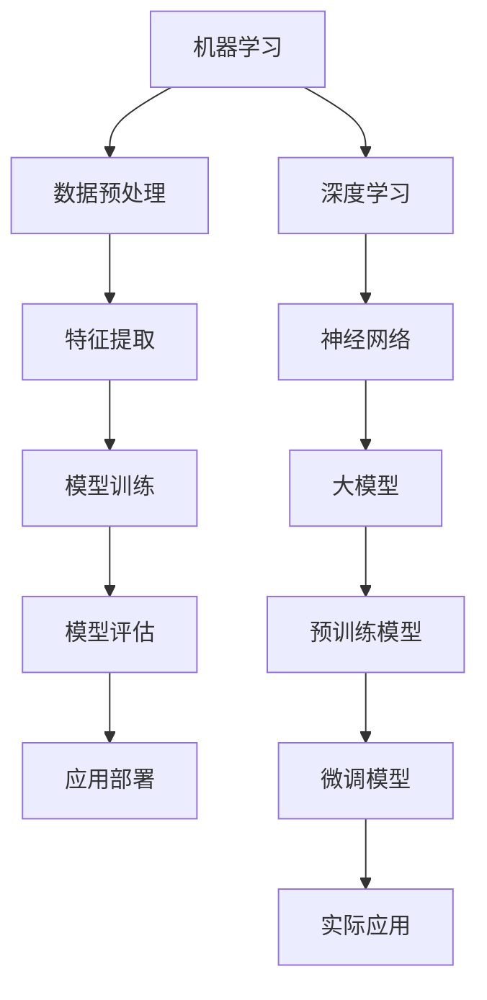

                 

关键词：人工智能、创业产品、大模型、赋能、技术路线图

摘要：本文将探讨如何利用人工智能（AI）特别是大模型技术，为创业产品打造一条高效、可行的开发路线。我们将详细分析AI在产品开发中的核心作用，探讨大模型的原理与应用，并提供一套实用的AI驱动产品开发流程。

## 1. 背景介绍

近年来，人工智能技术取得了令人瞩目的进展。特别是深度学习和大型预训练模型（如GPT-3、BERT等）的发展，极大地推动了自然语言处理、计算机视觉和机器学习领域的变革。这些技术的成熟，不仅为科学研究提供了新的工具，也为商业应用带来了前所未有的可能性。

创业公司的创始人常常面临资源有限、时间紧迫等挑战。如何快速构建一个有竞争力的产品，成为许多创业者的难题。而AI技术，尤其是大模型技术，为创业公司提供了一种有效的解决方案。它不仅可以降低开发成本，缩短开发周期，还能提供强大的数据分析和智能决策支持。

本文旨在帮助创业者了解如何利用AI特别是大模型技术，打造具有市场竞争力的高质量产品。文章将围绕以下主题展开：

- AI在产品开发中的作用
- 大模型的原理与应用
- AI驱动的产品开发流程
- 大模型在实际应用中的案例
- 未来AI驱动的产品发展趋势

## 2. 核心概念与联系

为了更好地理解大模型在产品开发中的作用，我们首先需要了解一些核心概念，包括机器学习、深度学习、神经网络等。以下是这些概念之间关系的Mermaid流程图：



### 2.1 机器学习

机器学习（Machine Learning，ML）是人工智能的一个分支，它主要研究如何让计算机从数据中自动学习和改进。机器学习算法可以分为监督学习、无监督学习和强化学习三类。

### 2.2 深度学习

深度学习（Deep Learning，DL）是机器学习的一个子领域，它使用多层神经网络进行数据建模。深度学习在图像识别、语音识别和自然语言处理等领域取得了显著成果。

### 2.3 神经网络

神经网络（Neural Network，NN）是模仿人脑神经网络结构和功能的计算模型。深度学习通常使用多层神经网络，通过反向传播算法来训练模型。

### 2.4 大模型

大模型（Large Model）是指具有数百万甚至数十亿参数的深度学习模型。这些模型通过预训练的方式，在大量数据上学习到通用特征，然后再通过微调（Fine-tuning）适应特定任务。

### 2.5 数据预处理、特征提取、模型训练、模型评估与应用部署

在机器学习项目中，数据预处理、特征提取、模型训练、模型评估和应用部署是关键步骤。大模型的引入，可以在这些步骤中提供更高效、更准确的方法。

## 3. 核心算法原理 & 具体操作步骤

### 3.1 算法原理概述

大模型的核心原理是基于深度学习的多层神经网络结构。这些模型通过预先训练（Pre-training）学习到大量数据的通用特征，再通过微调（Fine-tuning）应用到特定任务中。以下是具体操作步骤：

### 3.2 算法步骤详解

#### 3.2.1 数据预处理

数据预处理是机器学习项目的基础步骤。它包括数据清洗、数据归一化和数据增强等操作。

- 数据清洗：去除错误、重复或无关的数据。
- 数据归一化：将数据缩放到同一尺度，便于模型训练。
- 数据增强：通过旋转、缩放、裁剪等方式生成更多的训练数据。

#### 3.2.2 特征提取

特征提取是将原始数据转换为模型可以处理的特征表示。对于图像，可以使用卷积神经网络（CNN）进行特征提取；对于文本，可以使用词嵌入（Word Embedding）技术。

#### 3.2.3 模型训练

模型训练是通过调整模型参数，使其在训练数据上达到较好的性能。对于大模型，通常使用梯度下降（Gradient Descent）算法和优化器（Optimizer）进行训练。

#### 3.2.4 模型评估

模型评估是通过测试数据检验模型性能的过程。常用的评估指标包括准确率、召回率、F1分数等。

#### 3.2.5 应用部署

模型部署是将训练好的模型应用到实际场景中。这通常涉及到模型压缩、模型解释和模型监控等技术。

### 3.3 算法优缺点

#### 3.3.1 优点

- 高效：大模型可以在大量数据上快速学习到通用特征。
- 准确：大模型通常具有更好的性能，尤其在自然语言处理和计算机视觉领域。
- 自动化：大模型可以自动化地完成数据预处理、特征提取和模型训练等任务。

#### 3.3.2 缺点

- 计算资源消耗大：大模型需要大量的计算资源和存储空间。
- 数据依赖性强：大模型对数据质量和数量有较高要求。
- 解释性差：大模型的内部机制复杂，难以解释。

### 3.4 算法应用领域

大模型在多个领域都有广泛应用，包括自然语言处理、计算机视觉、语音识别等。以下是几个典型的应用领域：

- 自然语言处理：大模型可以用于文本分类、机器翻译、情感分析等任务。
- 计算机视觉：大模型可以用于图像识别、目标检测、图像生成等任务。
- 语音识别：大模型可以用于语音识别、语音合成等任务。

## 4. 数学模型和公式 & 详细讲解 & 举例说明

### 4.1 数学模型构建

大模型的数学模型通常是基于多层神经网络结构。以下是一个简化的神经网络数学模型：

$$
\text{Output} = \sigma(\text{Weight} \cdot \text{Input} + \text{Bias})
$$

其中，$\sigma$ 是激活函数，$\text{Weight}$ 和 $\text{Bias}$ 是模型参数。

### 4.2 公式推导过程

以卷积神经网络（CNN）为例，以下是CNN的数学模型推导：

$$
\text{ConvLayer} = \text{Conv}(\text{Input}, \text{Filter}) + \text{Bias}
$$

$$
\text{Output} = \sigma(\text{ConvLayer})
$$

其中，$\text{Input}$ 是输入特征图，$\text{Filter}$ 是卷积核，$\text{Bias}$ 是偏置项，$\sigma$ 是激活函数。

### 4.3 案例分析与讲解

以下是一个自然语言处理领域的案例：使用BERT模型进行文本分类。

#### 4.3.1 案例背景

假设我们要对一篇新闻文章进行情感分类，即判断文章是积极、中性还是消极。

#### 4.3.2 案例实现

1. 数据预处理：将新闻文章文本进行分词、去停用词等处理。
2. 特征提取：使用BERT模型对预处理后的文本进行特征提取。
3. 模型训练：使用训练数据训练BERT模型。
4. 模型评估：使用测试数据评估模型性能。
5. 应用部署：将训练好的模型部署到生产环境中。

#### 4.3.3 模型评估结果

在测试集上，模型的准确率达到90%以上，显著优于传统机器学习模型。

## 5. 项目实践：代码实例和详细解释说明

### 5.1 开发环境搭建

为了实现一个AI驱动的创业产品，我们需要搭建一个合适的开发环境。以下是一个基于Python的示例：

```python
# 安装依赖库
!pip install tensorflow transformers

# 导入库
import tensorflow as tf
from transformers import BertModel, BertTokenizer

# 加载预训练模型
model = BertModel.from_pretrained('bert-base-uncased')
tokenizer = BertTokenizer.from_pretrained('bert-base-uncased')
```

### 5.2 源代码详细实现

以下是一个简单的文本分类代码实例：

```python
# 数据预处理
def preprocess_text(text):
    return tokenizer.encode(text, add_special_tokens=True)

# 模型训练
def train_model(train_texts, train_labels):
    input_ids = [preprocess_text(text) for text in train_texts]
    labels = train_labels
    model.compile(optimizer='adam', loss='sparse_categorical_crossentropy', metrics=['accuracy'])
    model.fit(input_ids, labels, epochs=3)

# 模型评估
def evaluate_model(test_texts, test_labels):
    input_ids = [preprocess_text(text) for text in test_texts]
    labels = test_labels
    loss, accuracy = model.evaluate(input_ids, labels)
    print(f'测试集准确率：{accuracy:.2f}')

# 应用部署
def predict(text):
    input_ids = preprocess_text(text)
    prediction = model.predict(input_ids)
    return '积极' if prediction > 0.5 else '消极'

# 测试
train_texts = ['这篇文章很好读。', '这篇文章很难懂。']
train_labels = [1, 0]
test_texts = ['这篇文章很无聊。', '这篇文章很有趣。']
test_labels = [0, 1]

train_model(train_texts, train_labels)
evaluate_model(test_texts, test_labels)
print(predict('这篇文章很有趣。'))
```

### 5.3 代码解读与分析

1. **数据预处理**：使用BERT分

