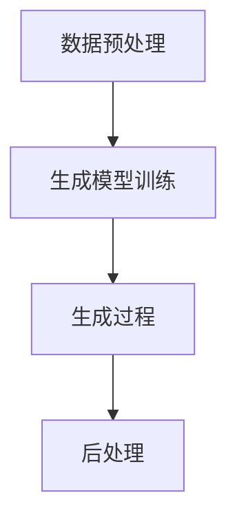

                 

随着人工智能（AI）技术的飞速发展，人工智能生成内容（AIGC，AI-generated Content）作为一种新兴的技术应用，已经逐渐引起了业界的广泛关注。AIGC 涵盖了文本、图像、音频等多种内容形式，能够自动生成高质量的内容，极大地提升了内容生产效率。然而，AIGC 技术的发展也对人才培养和教育改革提出了新的要求和挑战。本文将深入探讨 AIGC 人才培养与教育改革的必要性和路径。

## 1. 背景介绍

### 1.1 AIGC 技术的兴起与发展

人工智能生成内容（AIGC）是指利用人工智能技术自动生成内容的技术。AIGC 技术起源于深度学习的发展，特别是生成对抗网络（GAN）和变分自编码器（VAE）等生成模型的提出和应用。随着计算能力的提升和大数据的积累，AIGC 技术逐渐走向成熟，并在多个领域取得了显著的应用成果。

AIGC 技术的发展历程可以分为三个阶段：

1. **初级阶段**：主要是基于规则和模板生成简单的文本和图像内容，如搜索引擎自动生成的新闻摘要和广告。

2. **中级阶段**：利用神经网络模型，如 LSTM、GRU 等生成更复杂的文本和图像内容，如自动写作、智能客服等。

3. **高级阶段**：结合生成对抗网络（GAN）和变分自编码器（VAE）等技术，实现高逼真的图像生成和文本生成，如深度伪造（deepfake）、自动剪辑等。

### 1.2 AIGC 技术在教育领域的应用

AIGC 技术在教育领域的应用主要体现在以下几个方面：

1. **个性化学习**：AIGC 技术可以根据学生的学习情况和兴趣，自动生成个性化的学习内容和路径，提高学习效率。

2. **自动评估与反馈**：AIGC 技术可以自动评估学生的作业和考试，提供即时反馈，帮助学生发现问题和改进学习。

3. **虚拟教学环境**：利用 AIGC 技术可以生成逼真的虚拟教学环境，提高教学效果和互动性。

4. **教学资源自动生成**：AIGC 技术可以自动生成教学视频、课件、练习题等教学资源，减轻教师的工作负担。

## 2. 核心概念与联系

### 2.1 人工智能（AI）与 AIGC

人工智能（AI）是指使计算机系统模拟、延伸和扩展人类智能的理论、方法和技术。AIGC 是 AI 技术的一种具体应用，旨在利用 AI 技术生成高质量的内容。

### 2.2 生成对抗网络（GAN）与 AIGC

生成对抗网络（GAN）是一种重要的 AI 模型，由生成器和判别器组成。生成器试图生成逼真的数据，而判别器则试图区分生成数据和真实数据。通过这种对抗训练，GAN 能够生成高质量的数据，如图像、音频和文本等。

### 2.3 变分自编码器（VAE）与 AIGC

变分自编码器（VAE）是一种基于概率模型的生成模型，通过编码器和解码器学习数据的高效表示和重建数据。VAE 在图像和文本生成领域取得了显著的应用成果。

### 2.4 AIGC 技术架构

AIGC 技术架构主要包括以下几个部分：

1. **数据预处理**：对原始数据进行清洗、处理和标注，以便于后续生成模型的学习和训练。

2. **生成模型**：选择合适的生成模型，如 GAN、VAE 等，进行训练和优化。

3. **生成过程**：利用训练好的生成模型，根据输入条件生成高质量的内容。

4. **后处理**：对生成的内容进行进一步处理和优化，如文本润色、图像增强等。

### 2.5 Mermaid 流程图



## 3. 核心算法原理 & 具体操作步骤

### 3.1 算法原理概述

AIGC 技术的核心算法主要包括生成对抗网络（GAN）和变分自编码器（VAE）。GAN 通过生成器和判别器的对抗训练，生成高质量的数据；VAE 通过编码器和解码器学习数据的高效表示和重建数据。

### 3.2 算法步骤详解

1. **数据预处理**：对原始数据进行清洗、处理和标注，以便于后续生成模型的学习和训练。

2. **生成模型训练**：
   - **GAN**：生成器 G 试图生成逼真的数据，判别器 D 试图区分生成数据和真实数据。通过对抗训练，使 G 和 D 不断优化，最终生成高质量的数据。
   - **VAE**：编码器 E 将输入数据编码为低维表示，解码器 D 将编码后的数据解码为输出数据。通过最大化数据保真度和最小化重构误差，VAE 学习到数据的潜在表示。

3. **生成过程**：利用训练好的生成模型，根据输入条件生成高质量的内容。

4. **后处理**：对生成的内容进行进一步处理和优化，如文本润色、图像增强等。

### 3.3 算法优缺点

**GAN**：
- **优点**：生成效果较好，适用于图像、音频和文本等多种类型的数据。
- **缺点**：训练过程复杂，容易陷入局部最优。

**VAE**：
- **优点**：训练过程相对简单，生成效果稳定。
- **缺点**：生成效果相对 GAN 较差。

### 3.4 算法应用领域

AIGC 技术可以应用于多个领域，如：

1. **图像生成**：生成逼真的图像，应用于图像修复、图像增强、艺术创作等。

2. **文本生成**：生成高质量的文本，应用于自动写作、智能客服、机器翻译等。

3. **音频生成**：生成高质量的音频，应用于音乐创作、语音合成、语音识别等。

## 4. 数学模型和公式 & 详细讲解 & 举例说明

### 4.1 数学模型构建

AIGC 技术的数学模型主要包括生成对抗网络（GAN）和变分自编码器（VAE）。

### 4.2 公式推导过程

**GAN**：

生成器 G：$G(z)$，其中 $z$ 是输入噪声。

判别器 D：$D(x)$，其中 $x$ 是真实数据。

损失函数：$L(G, D) = -\frac{1}{2}\sum_{x\in\mathcal{X}}D(x) - \frac{1}{2}\sum_{z\in\mathcal{Z}}D(G(z))$

**VAE**：

编码器 E：$E(x) = \mu(x), \sigma(x)$，其中 $\mu(x), \sigma(x)$ 分别是编码后的均值和方差。

解码器 D：$D(\mu, \sigma) = x'$，其中 $x'$ 是解码后的数据。

损失函数：$L(VAE) = \frac{1}{N}\sum_{x\in\mathcal{X}}\left[\text{KL}(\mu(x), \sigma(x)) + \frac{1}{2}\left\|x - x'\right\|^2\right]$

### 4.3 案例分析与讲解

假设我们使用 GAN 生成图像，以下是一个简单的例子：

输入噪声：$z \in \mathbb{R}^{100}$

生成器 G：$G(z) = \text{Generator}(z)$

判别器 D：$D(x) = \text{Discriminator}(x)$

损失函数：$L(G, D) = -\frac{1}{2}\sum_{x\in\mathcal{X}}D(x) - \frac{1}{2}\sum_{z\in\mathcal{Z}}D(G(z))$

通过训练生成器和判别器，最终生成逼真的图像。

## 5. 项目实践：代码实例和详细解释说明

### 5.1 开发环境搭建

为了实现 AIGC 技术，我们需要搭建一个适合的开发环境。以下是搭建过程：

1. 安装 Python 3.8 或更高版本。

2. 安装必要的库，如 TensorFlow、Keras、NumPy 等。

3. 准备训练数据和测试数据。

### 5.2 源代码详细实现

以下是一个简单的 GAN 生成图像的 Python 代码实例：

```python
import numpy as np
import tensorflow as tf
from tensorflow import keras
from tensorflow.keras import layers

# 生成器模型
def generator(z):
    z = layers.Dense(128, activation='relu')(z)
    z = layers.Dense(64, activation='relu')(z)
    z = layers.Dense(32, activation='relu')(z)
    x = layers.Dense(784, activation='tanh')(z)
    return x

# 判别器模型
def discriminator(x):
    x = layers.Dense(128, activation='relu')(x)
    x = layers.Dense(64, activation='relu')(x)
    x = layers.Dense(32, activation='relu')(x)
    validity = layers.Dense(1, activation='sigmoid')(x)
    return validity

# 搭建模型
z = keras.Input(shape=(100,))
x = generator(z)
validity = discriminator(x)

model = keras.Model(z, validity)
model.compile(optimizer='adam', loss='binary_crossentropy')

# 训练模型
# ...
```

### 5.3 代码解读与分析

1. **生成器模型**：生成器模型用于生成图像。通过全连接层和激活函数，将输入噪声映射为图像。

2. **判别器模型**：判别器模型用于判断输入图像的真实性。通过全连接层和激活函数，输出判别结果。

3. **模型搭建**：使用 Keras 框架搭建生成器和判别器模型，并编译模型。

4. **训练模型**：通过训练生成器和判别器，优化模型参数，实现图像生成。

### 5.4 运行结果展示

通过训练生成器和判别器，最终生成逼真的图像。以下是训练过程中的部分生成图像：

```python
import matplotlib.pyplot as plt

# ...
plt.figure(figsize=(10, 10))
for i in range(100):
    z = np.random.normal(size=(1, 100))
    x = generator.predict(z)
    plt.subplot(10, 10, i + 1)
    plt.imshow(x[0], cmap='gray')
    plt.axis('off')
plt.show()
```

## 6. 实际应用场景

### 6.1 个性化学习

AIGC 技术可以应用于个性化学习，根据学生的学习情况和兴趣，自动生成个性化的学习内容和路径，提高学习效率。例如，通过分析学生的学习数据，AIGC 技术可以生成适合学生的练习题、讲解视频和辅导资料。

### 6.2 自动评估与反馈

AIGC 技术可以应用于自动评估与反馈，自动评估学生的作业和考试，提供即时反馈，帮助学生发现问题和改进学习。例如，通过分析学生的作业和考试数据，AIGC 技术可以生成详细的评估报告，包括正确答案、错误原因和改进建议。

### 6.3 虚拟教学环境

AIGC 技术可以应用于虚拟教学环境，生成逼真的虚拟教学场景和互动内容，提高教学效果和互动性。例如，通过 AIGC 技术可以生成虚拟课堂、虚拟实验和虚拟讨论区，为学生提供沉浸式的学习体验。

### 6.4 教学资源自动生成

AIGC 技术可以应用于教学资源的自动生成，自动生成教学视频、课件、练习题等教学资源，减轻教师的工作负担。例如，通过 AIGC 技术可以自动生成讲解视频、习题解析和教学课件，为学生提供丰富的学习资源。

## 7. 工具和资源推荐

### 7.1 学习资源推荐

1. **《深度学习》（Ian Goodfellow 等著）**：这是一本经典的深度学习教材，涵盖了 AIGC 相关的知识。

2. **《生成对抗网络》（Ishan Banerjee 等著）**：这是一本关于 GAN 的专业书籍，详细介绍了 GAN 的原理和应用。

3. **《变分自编码器》（Jiasen Lu 等著）**：这是一本关于 VAE 的专业书籍，详细介绍了 VAE 的原理和应用。

### 7.2 开发工具推荐

1. **TensorFlow**：TensorFlow 是一款流行的深度学习框架，支持 GAN 和 VAE 等生成模型的实现。

2. **Keras**：Keras 是一款简洁易用的深度学习框架，基于 TensorFlow 开发，适合快速实现 AIGC 模型。

3. **PyTorch**：PyTorch 是一款流行的深度学习框架，支持 GAN 和 VAE 等生成模型的实现，适合研究者和开发者。

### 7.3 相关论文推荐

1. **《Unsupervised Representation Learning with Deep Convolutional Generative Adversarial Networks》（2014）**：这是 GAN 的开山之作，详细介绍了 GAN 的原理和应用。

2. **《Variational Autoencoders》（2013）**：这是 VAE 的开山之作，详细介绍了 VAE 的原理和应用。

3. **《Beyond a Gaussian Distribution for the Variational Autoencoder》（2015）**：这篇文章提出了 VAE 的改进版本，进一步提升了 VAE 的性能。

## 8. 总结：未来发展趋势与挑战

### 8.1 研究成果总结

AIGC 技术在教育领域的应用取得了显著成果，为个性化学习、自动评估与反馈、虚拟教学环境和教学资源自动生成等方面提供了有效支持。然而，AIGC 技术在教育领域的应用仍处于初级阶段，面临着诸多挑战。

### 8.2 未来发展趋势

1. **技术成熟度提升**：随着深度学习技术的发展，AIGC 技术将不断成熟，生成效果和稳定性将得到显著提升。

2. **应用场景拓展**：AIGC 技术将在更多教育场景中发挥作用，如智能教育顾问、教育数据分析等。

3. **跨学科融合**：AIGC 技术将与心理学、教育学等学科相结合，为教育提供更深入的支持。

### 8.3 面临的挑战

1. **数据隐私与安全**：AIGC 技术在教育领域应用过程中，涉及到大量学生数据的处理和存储，如何保障数据隐私和安全是一个重要挑战。

2. **教育公平性问题**：AIGC 技术在教育领域的应用可能会加剧教育不公平现象，如何确保每个学生都能享受到 AIGC 技术带来的好处是一个重要问题。

3. **教学与评估标准**：AIGC 技术的应用可能会改变传统的教学和评估方式，如何建立新的教学与评估标准是一个重要挑战。

### 8.4 研究展望

未来，AIGC 技术在教育领域的应用将不断深入，为个性化教育、智慧教育等领域带来新的发展机遇。然而，要实现这一目标，还需要在技术、政策、教育理念等方面进行深入研究和探索。

## 9. 附录：常见问题与解答

### 9.1 AIGC 技术是什么？

AIGC 技术是指利用人工智能技术自动生成内容的技术，涵盖文本、图像、音频等多种内容形式。

### 9.2 AIGC 技术在教育领域有哪些应用？

AIGC 技术在教育领域有多个应用，如个性化学习、自动评估与反馈、虚拟教学环境和教学资源自动生成等。

### 9.3 GAN 和 VAE 有什么区别？

GAN（生成对抗网络）和 VAE（变分自编码器）都是生成模型，但 GAN 利用生成器和判别器的对抗训练，生成高质量的数据；VAE 通过编码器和解码器学习数据的高效表示和重建数据。

### 9.4 如何保障 AIGC 技术在教育领域的应用中的数据隐私和安全？

保障 AIGC 技术在教育领域的应用中的数据隐私和安全，需要从技术、政策和法律等多方面入手，如采用加密技术、制定隐私保护政策和法规等。

### 9.5 AIGC 技术会不会加剧教育不公平现象？

AIGC 技术本身并不会直接加剧教育不公平现象，但应用过程中可能存在数据偏差、资源分配不均等问题，需要加强监管和优化应用策略，确保每个学生都能享受到 AIGC 技术带来的好处。

