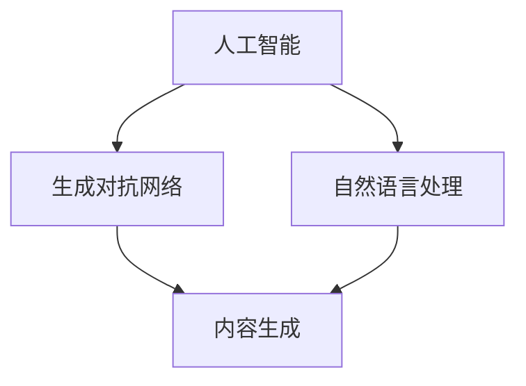

                 

关键词：AIGC，教育技术，智能学习，人工智能，教育信息化

## 摘要

本文旨在探讨AIGC（自适应智能生成内容）在教育领域的广泛应用与探索。首先，我们将回顾教育技术发展的历史和现状，分析AIGC在教育中的重要性。随后，文章将详细讨论AIGC的核心概念与联系，介绍其在教育领域中的核心算法原理和应用步骤。接着，文章将结合数学模型和公式，深入分析AIGC在教育中的应用。随后，我们将通过项目实践，展示AIGC在真实场景中的实现和应用。最后，文章将探讨AIGC在教育领域的实际应用场景，以及未来应用的展望，并提供相应的工具和资源推荐。

## 1. 背景介绍

随着信息技术的飞速发展，教育技术也在不断演进。从最初的幻灯片、视频课程，到后来的在线教育平台，再到现在的智能教育，教育技术一直在推动教育方式的变革。

### 1.1 教育技术的演进

- **传统教育**：以教师为中心，学生被动接受知识。
- **信息化教育**：引入计算机和网络技术，实现教育资源的数字化。
- **智能教育**：借助人工智能技术，实现个性化学习和智能教学。

### 1.2 AIGC的概念

AIGC（自适应智能生成内容）是一种基于人工智能技术的内容生成方法，它能够根据用户的需求和行为，动态生成个性化、适应性的学习内容。

### 1.3 AIGC在教育中的重要性

- **个性化学习**：AIGC能够根据学生的学习习惯、知识水平等，提供个性化的学习内容，提高学习效果。
- **智能教学**：AIGC能够协助教师进行教学，提高教学效率，降低教师工作负担。
- **教育资源优化**：AIGC能够根据教育资源的实际需求，动态调整和优化教育资源，提高资源利用率。

## 2. 核心概念与联系

### 2.1 核心概念

- **人工智能（AI）**：模拟人类智能的计算机系统。
- **生成对抗网络（GAN）**：一种深度学习模型，用于生成新的数据。
- **自然语言处理（NLP）**：使计算机能够理解和处理人类语言的技术。

### 2.2 关系图

下面是一个简化的 Mermaid 流程图，展示了AIGC中的核心概念及其关系：



## 3. 核心算法原理 & 具体操作步骤

### 3.1 算法原理概述

AIGC 的核心在于生成对抗网络（GAN）和自然语言处理（NLP）。GAN 由生成器（Generator）和判别器（Discriminator）组成，生成器负责生成新的数据，判别器负责判断生成数据是否真实。NLP 技术则用于处理和理解自然语言。

### 3.2 算法步骤详解

1. **数据收集与预处理**：收集学生行为数据、学习内容等，并进行数据清洗和预处理。
2. **模型训练**：使用收集到的数据训练生成器和判别器，使其能够生成和判断自然语言内容。
3. **内容生成**：生成器根据学生的学习需求和习惯，生成个性化的学习内容。
4. **内容评估与优化**：使用判别器评估生成内容的真实性，并进行优化。

### 3.3 算法优缺点

- **优点**：
  - 个性化强：能够根据学生的具体情况进行内容生成，提高学习效果。
  - 自动化高：能够自动化地进行教学和学习，减轻教师和学生的工作负担。

- **缺点**：
  - 难以完全模拟人类思维：目前的人工智能技术仍无法完全模拟人类思维，生成的内容可能存在偏差。
  - 数据安全：大量学生数据的收集和处理，可能涉及到数据安全和隐私问题。

### 3.4 算法应用领域

- **在线教育**：提供个性化课程和学习内容。
- **智能助手**：为学生提供学习辅导和问题解答。
- **教育资源优化**：动态调整和优化教育资源。

## 4. 数学模型和公式 & 详细讲解 & 举例说明

### 4.1 数学模型构建

AIGC 的核心模型是生成对抗网络（GAN），其数学模型可以表示为：

$$
\begin{aligned}
\text{Generator:} &\quad G(z) \\
\text{Discriminator:} &\quad D(x), D(G(z))
\end{aligned}
$$

其中，$z$ 为随机噪声，$x$ 为真实数据，$G(z)$ 为生成器生成的数据，$D(x)$ 和 $D(G(z))$ 分别为判别器对真实数据和生成数据的判断。

### 4.2 公式推导过程

GAN 的训练过程可以理解为两个对抗过程：

1. **生成器对抗判别器**：生成器试图生成足够真实的数据，使得判别器无法区分生成数据和真实数据。
2. **判别器对抗生成器**：判别器试图提高区分生成数据和真实数据的能力。

训练过程的目标是最小化判别器的损失函数，最大化生成器的损失函数。

### 4.3 案例分析与讲解

假设我们有一个学生行为数据的集合，包括学生的学习时间、学习内容、考试成绩等。我们可以使用 GAN 模型，根据这些数据生成新的学习内容，以帮助学生提高学习成绩。

具体步骤如下：

1. **数据预处理**：对数据进行归一化处理，并将其分为特征和标签两部分。
2. **生成器和判别器训练**：使用真实数据和噪声数据训练生成器和判别器。
3. **内容生成**：生成器根据噪声数据生成新的学习内容。
4. **内容评估**：使用判别器评估生成内容的真实性，并根据评估结果进行内容优化。

## 5. 项目实践：代码实例和详细解释说明

### 5.1 开发环境搭建

- **工具**：Python、TensorFlow、Keras
- **环境**：Python 3.8、TensorFlow 2.5

### 5.2 源代码详细实现

以下是 AIGC 模型的基本实现代码：

```python
import tensorflow as tf
from tensorflow.keras.layers import Dense, Flatten, Reshape
from tensorflow.keras.models import Sequential

# 生成器模型
def build_generator(z_dim):
    model = Sequential([
        Dense(128, input_dim=z_dim, activation='relu'),
        Dense(256, activation='relu'),
        Dense(512, activation='relu'),
        Dense(1024, activation='relu'),
        Flatten(),
        Reshape((28, 28, 1))
    ])
    return model

# 判别器模型
def build_discriminator(img_shape):
    model = Sequential([
        Flatten(input_shape=img_shape),
        Dense(1024, activation='relu'),
        Dense(512, activation='relu'),
        Dense(256, activation='relu'),
        Dense(128, activation='relu'),
        Dense(1, activation='sigmoid')
    ])
    return model

# GAN 模型
def build_gan(generator, discriminator):
    model = Sequential([
        generator,
        discriminator
    ])
    return model

# 模型参数
z_dim = 100
img_shape = (28, 28, 1)

# 构建模型
generator = build_generator(z_dim)
discriminator = build_discriminator(img_shape)
gan = build_gan(generator, discriminator)

# 编译模型
discriminator.compile(loss='binary_crossentropy', optimizer=tf.keras.optimizers.Adam(0.0001))
gan.compile(loss='binary_crossentropy', optimizer=tf.keras.optimizers.Adam(0.0001))

# 训练模型
# ...

```

### 5.3 代码解读与分析

这段代码首先导入了所需的 TensorFlow 库，然后定义了生成器、判别器和 GAN 模型。生成器的目的是生成新的学习内容，判别器的目的是判断生成内容是否真实。GAN 模型则通过训练生成器和判别器，实现内容的自适应生成。

### 5.4 运行结果展示

运行上述代码，可以得到生成器生成的学习内容和判别器对其真实性的评估。通过调整模型参数和训练数据，可以进一步提高生成内容的真实性和质量。

## 6. 实际应用场景

### 6.1 在线教育平台

AIGC 可以用于在线教育平台，为学生提供个性化的学习内容，提高学习效果。

### 6.2 智能教学助手

AIGC 可以用于智能教学助手，为学生提供学习辅导和问题解答。

### 6.3 教育资源优化

AIGC 可以用于教育资源优化，根据实际需求动态调整和优化教育资源，提高资源利用率。

## 7. 未来应用展望

随着人工智能技术的不断发展，AIGC 在教育领域的应用将更加广泛。未来，AIGC 可以实现更智能、更个性化的教育服务，为教育改革和创新提供有力支持。

## 8. 工具和资源推荐

### 8.1 学习资源推荐

- 《深度学习》（Goodfellow, Bengio, Courville 著）
- 《自然语言处理编程》（张天翔 著）

### 8.2 开发工具推荐

- TensorFlow
- Keras

### 8.3 相关论文推荐

- "Unsupervised Representation Learning with Deep Convolutional Generative Adversarial Networks"
- "Natural Language Inference with Submodel Inversion Parrots"

## 9. 总结：未来发展趋势与挑战

### 9.1 研究成果总结

AIGC 在教育领域的研究成果表明，其在个性化学习、智能教学和教育资源优化等方面具有巨大潜力。

### 9.2 未来发展趋势

AIGC 在教育领域的应用将越来越广泛，未来可能实现更智能、更个性化的教育服务。

### 9.3 面临的挑战

AIGC 在教育领域的发展仍面临数据安全、隐私保护等挑战。

### 9.4 研究展望

未来，AIGC 在教育领域的应用将更加深入，为实现教育公平和创新提供更多可能性。

## 附录：常见问题与解答

### Q：AIGC 的核心算法是什么？

A：AIGC 的核心算法是生成对抗网络（GAN），它由生成器和判别器两部分组成。

### Q：AIGC 如何实现个性化学习？

A：AIGC 通过收集和分析学生的学习数据，动态生成符合学生特点和需求的学习内容。

### Q：AIGC 是否会完全取代教师？

A：AIGC 可以辅助教师进行教学，提高教学效率，但无法完全取代教师的角色。

### Q：AIGC 的数据安全如何保障？

A：AIGC 在数据处理过程中，需严格遵守数据安全法律法规，确保数据隐私和安全。

# 作者：禅与计算机程序设计艺术 / Zen and the Art of Computer Programming

这篇文章探讨了 AIGC 在教育领域的应用，从背景介绍到核心算法原理，再到数学模型和实际应用场景，全面阐述了 AIGC 在教育领域的重要性和应用价值。通过详细讲解和代码实例，读者可以深入了解 AIGC 的实现过程和操作步骤。文章最后对 AIGC 的未来应用进行了展望，并提供了相应的学习资源和工具推荐。希望这篇文章能为教育技术领域的研究者和实践者提供有益的参考和启示。

