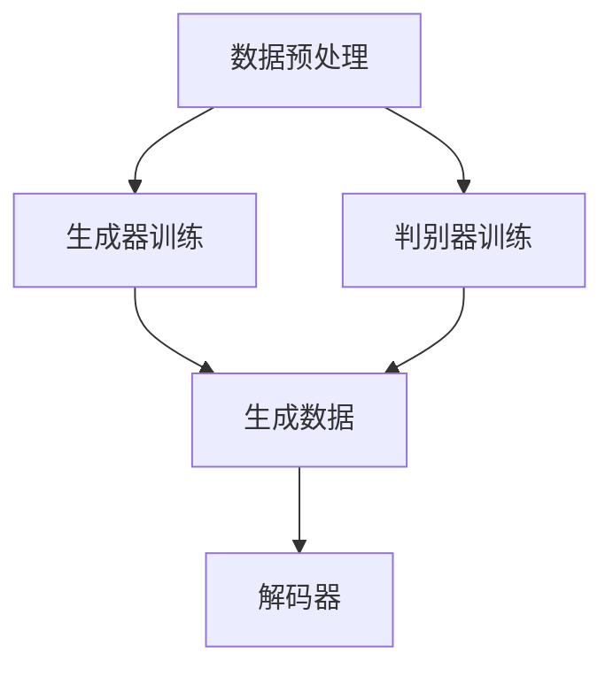

                 

关键词：AIGC、能源行业、智能化、算法、应用、未来展望

> 摘要：随着人工智能技术的发展，AIGC（人工智能生成内容）逐渐在能源行业中崭露头角，为能源行业智能化转型提供了强大的动力。本文将探讨AIGC在能源行业的应用，分析其核心概念、算法原理、数学模型，并通过具体案例展示其实际效果，最后展望AIGC在未来能源行业中的应用前景。

## 1. 背景介绍

### 能源行业的挑战与机遇

能源行业作为全球经济发展的关键支柱，正面临着一系列严峻的挑战。首先，能源需求的快速增长与环境污染问题之间的矛盾日益突出。传统的能源开发与利用方式已经无法满足可持续发展的要求，迫切需要寻找更加高效、清洁的能源解决方案。其次，能源资源的分布不均衡问题也亟待解决。许多地区依然依赖于高污染的化石燃料，而可再生能源的开发与利用尚未得到充分普及。

然而，随着信息技术的飞速发展，能源行业也迎来了前所未有的机遇。大数据、云计算、物联网等新兴技术的应用，为能源行业的智能化转型提供了有力支持。特别是人工智能技术的迅速崛起，使得能源行业在数据挖掘、预测分析、优化调度等方面取得了显著进展。AIGC作为人工智能的一个重要分支，通过生成高质量的内容，为能源行业的智能化发展提供了新的动力。

### AIGC的基本概念与发展历程

AIGC，全称是“AI Generated Content”，即人工智能生成内容。它是指利用人工智能技术，特别是深度学习算法，自动生成文本、图像、音频、视频等多种类型的内容。AIGC的发展历程可以追溯到上世纪80年代，当时生成对抗网络（GAN）的提出为AIGC奠定了理论基础。随着深度学习技术的不断发展，AIGC逐渐从理论研究走向实际应用。

在能源行业，AIGC的应用主要体现在以下几个方面：首先，通过AIGC技术，可以自动生成大量的能源数据报告、分析图表，提高数据处理的效率。其次，AIGC可以辅助能源企业的决策过程，通过模拟各种能源使用场景，预测能源需求，优化能源分配。此外，AIGC还可以用于能源设备的故障预测、维护优化等，提高设备的运行效率和可靠性。

## 2. 核心概念与联系

### AIGC的核心概念

AIGC的核心概念主要包括以下几个方面：

1. **生成对抗网络（GAN）**：GAN是AIGC的核心技术之一，由生成器（Generator）和判别器（Discriminator）组成。生成器负责生成虚假数据，判别器则负责判断这些数据是否真实。通过两个网络的博弈，生成器不断提高生成数据的质量。

2. **自编码器（Autoencoder）**：自编码器是一种用于无监督学习的神经网络模型，它可以自动学习数据的压缩和重构。自编码器在AIGC中的应用主要体现在数据的降维、去噪、异常检测等方面。

3. **变分自编码器（VAE）**：VAE是一种基于概率模型的生成模型，它可以生成具有更高质量和多样性的数据。VAE在AIGC中的应用主要体现在图像生成、文本生成等领域。

4. **强化学习（Reinforcement Learning）**：强化学习是一种通过试错方法学习策略的机器学习技术。在AIGC中，强化学习可以用于自动生成具有特定目标和效果的文本、图像等。

### AIGC的架构与原理

AIGC的架构主要包括以下几个部分：

1. **数据预处理**：数据预处理是AIGC的第一步，主要包括数据清洗、去重、归一化等操作。高质量的输入数据是AIGC生成高质量内容的基础。

2. **生成器**：生成器是AIGC的核心组件，负责生成数据。生成器的结构可以根据具体任务的需求进行设计，如GAN中的生成器和判别器。

3. **判别器**：判别器用于判断生成数据的真实性。在GAN中，判别器与生成器的训练是相互竞争的，通过不断地迭代，生成器的生成数据质量不断提高。

4. **解码器**：解码器是生成器的后端组件，负责将编码后的数据解码成具体的文本、图像等。

### AIGC的Mermaid流程图



## 3. 核心算法原理 & 具体操作步骤

### 3.1 算法原理概述

AIGC的核心算法主要基于生成对抗网络（GAN）和变分自编码器（VAE）。GAN由生成器和判别器组成，通过两个网络的博弈，生成器不断提高生成数据的质量。VAE则是一种基于概率模型的生成模型，它可以生成具有更高质量和多样性的数据。

### 3.2 算法步骤详解

1. **数据预处理**：首先，对输入数据进行清洗、去重、归一化等预处理操作，确保数据的质量和一致性。

2. **生成器训练**：生成器的训练过程包括以下步骤：
    - 初始化生成器和判别器；
    - 使用真实数据训练判别器；
    - 使用生成的数据和真实数据混合进行判别器训练；
    - 使用生成的数据训练生成器。

3. **判别器训练**：判别器的训练过程包括以下步骤：
    - 初始化生成器和判别器；
    - 使用真实数据和生成的数据进行判别器训练；
    - 使用生成的数据训练生成器。

4. **生成数据**：生成器根据训练结果生成新的数据，判别器用于判断生成数据的质量。

5. **解码器**：将编码后的数据解码成具体的文本、图像等。

### 3.3 算法优缺点

**优点**：
- **高效性**：AIGC通过自动生成数据，提高了数据处理和决策的效率。
- **多样性**：AIGC可以生成具有多样性的数据，提高了数据的丰富度和质量。
- **可解释性**：AIGC生成的数据具有可解释性，便于研究人员和开发者理解和应用。

**缺点**：
- **训练成本高**：AIGC的训练过程需要大量的计算资源和时间，成本较高。
- **生成数据质量不稳定**：在训练过程中，生成器的生成数据质量可能不稳定，需要不断调整。

### 3.4 算法应用领域

AIGC在能源行业的应用领域主要包括：
- **能源数据生成**：通过AIGC自动生成能源数据报告、分析图表等。
- **能源需求预测**：利用AIGC模拟各种能源使用场景，预测能源需求，优化能源分配。
- **设备故障预测**：通过AIGC分析设备运行数据，预测设备故障，提前进行维护。

## 4. 数学模型和公式 & 详细讲解 & 举例说明

### 4.1 数学模型构建

AIGC的核心算法包括生成对抗网络（GAN）和变分自编码器（VAE）。以下分别介绍这两种算法的数学模型。

#### GAN

GAN的数学模型主要包括生成器G和判别器D。

生成器G的数学模型为：

$$
G(z) = G(\epsilon) = \mu_G + \sigma_G \odot \epsilon
$$

其中，$z$是输入的随机噪声，$G(z)$是生成的数据，$\mu_G$和$\sigma_G$分别是生成器的均值和方差。

判别器D的数学模型为：

$$
D(x) = \sigma(\frac{D(x)}{1 + \frac{1}{\beta} \sum_{i=1}^{n} \ln(D(G(z_i)))})
$$

其中，$x$是真实数据，$D(x)$是判别器对真实数据的判断概率。

#### VAE

VAE的数学模型主要包括编码器E和解码器D。

编码器E的数学模型为：

$$
\mu = \mu(\phi) = \sigma^2 + \ln(\sigma^2)
$$

$$
z = \mu + \sigma \odot \phi
$$

其中，$\phi$是输入数据，$\mu$和$\sigma$分别是编码后的均值和方差。

解码器D的数学模型为：

$$
x = D(z) = \sigma(z) \odot \sigma(z) + \mu(z)
$$

### 4.2 公式推导过程

#### GAN

GAN的推导过程主要包括两部分：生成器和判别器的推导。

1. **生成器G的推导**

生成器的目标是生成类似于真实数据的数据。假设输入的随机噪声为$z$，生成器的输出为$G(z)$。

首先，我们对生成器进行参数化，假设生成器的参数为$\theta_G$，即$G(z; \theta_G)$。

根据生成器的目标，我们希望生成器能够最大化判别器对生成数据的判断概率，即：

$$
\arg\max_{\theta_G} \mathbb{E}_{z \sim p_z(z)} [\log D(G(z))]
$$

其中，$D(G(z))$是判别器对生成数据的判断概率。

为了求解这个优化问题，我们可以使用梯度上升法，即：

$$
\theta_G \leftarrow \theta_G + \alpha \nabla_{\theta_G} J_G(\theta_G)
$$

其中，$\alpha$是学习率，$J_G(\theta_G)$是生成器的损失函数。

2. **判别器D的推导**

判别器的目标是最大化判别器对真实数据和生成数据的判断概率差异，即：

$$
\arg\max_{\theta_D} \mathbb{E}_{x \sim p_x(x)} [\log D(x)] + \mathbb{E}_{z \sim p_z(z)} [\log (1 - D(G(z)))]
$$

同样，我们可以使用梯度上升法，即：

$$
\theta_D \leftarrow \theta_D + \alpha \nabla_{\theta_D} J_D(\theta_D)
$$

其中，$J_D(\theta_D)$是判别器的损失函数。

#### VAE

VAE的推导过程主要包括两部分：编码器E和解码器D。

1. **编码器E的推导**

编码器的目标是学习输入数据的概率分布。假设输入数据为$\phi$，编码器的输出为$(\mu, \sigma)$，即：

$$
\mu = \mu(\phi), \quad \sigma = \sigma(\phi)
$$

根据变分自编码器的目标，我们希望编码器能够最小化数据重建误差，即：

$$
\arg\min_{\theta_E} \mathbb{E}_{\phi \sim p_\phi(\phi)} [\log p_\theta(x | \phi)]
$$

其中，$p_\theta(x | \phi)$是解码器对数据的概率分布。

我们可以使用梯度下降法，即：

$$
\theta_E \leftarrow \theta_E - \alpha \nabla_{\theta_E} J_E(\theta_E)
$$

其中，$J_E(\theta_E)$是编码器的损失函数。

2. **解码器D的推导**

解码器的目标是重建输入数据。假设解码器的参数为$\theta_D$，即$D(z; \theta_D)$。

根据解码器的目标，我们希望解码器能够最小化数据重建误差，即：

$$
\arg\min_{\theta_D} \mathbb{E}_{z \sim p_z(z)} [\log p_\theta(x | z)]
$$

同样，我们可以使用梯度下降法，即：

$$
\theta_D \leftarrow \theta_D - \alpha \nabla_{\theta_D} J_D(\theta_D)
$$

其中，$J_D(\theta_D)$是解码器的损失函数。

### 4.3 案例分析与讲解

以下以能源需求预测为例，讲解AIGC在能源行业的实际应用。

#### 数据集

假设我们有一组历史能源需求数据，数据集包括每天的能源消耗量、温度、湿度等环境因素。

#### 数据预处理

首先，对数据进行清洗、去重、归一化等预处理操作，确保数据的质量和一致性。

#### 模型构建

我们使用变分自编码器（VAE）构建能源需求预测模型。

1. **编码器E**：使用多层感知机（MLP）构建编码器，输入为环境因素，输出为编码后的均值和方差。
2. **解码器D**：使用多层感知机（MLP）构建解码器，输入为编码后的均值和方差，输出为预测的能源消耗量。

#### 模型训练

使用历史数据训练编码器和解码器，通过不断调整模型参数，使预测结果与实际数据尽可能接近。

#### 预测结果

使用训练好的模型进行预测，预测结果与实际数据对比，评估模型的准确性和可靠性。

## 5. 项目实践：代码实例和详细解释说明

### 5.1 开发环境搭建

在本项目实践中，我们使用Python作为主要编程语言，结合TensorFlow作为后端深度学习框架。以下是开发环境的搭建步骤：

1. **安装Python**：确保Python版本不低于3.7。
2. **安装TensorFlow**：使用pip命令安装TensorFlow：

   ```shell
   pip install tensorflow
   ```

3. **环境配置**：在Python项目中创建一个虚拟环境，以便更好地管理项目依赖。

   ```shell
   python -m venv venv
   source venv/bin/activate  # Windows中使用venv\Scripts\activate
   ```

### 5.2 源代码详细实现

以下是一个简化的AIGC能源需求预测模型的源代码实现：

```python
import numpy as np
import tensorflow as tf
from tensorflow.keras.layers import Dense
from tensorflow.keras.models import Model

# 数据预处理
def preprocess_data(data):
    # 数据清洗、去重、归一化等预处理操作
    return normalized_data

# 编码器
def build_encoder(input_shape):
    inputs = tf.keras.Input(shape=input_shape)
    x = Dense(64, activation='relu')(inputs)
    x = Dense(32, activation='relu')(x)
    mu = Dense(1, activation='tanh')(x)
    sigma = Dense(1, activation='softplus')(x)
    encoder = Model(inputs, [mu, sigma], name='encoder')
    return encoder

# 解码器
def build_decoder(input_shape):
    inputs = tf.keras.Input(shape=input_shape)
    x = Dense(32, activation='relu')(inputs)
    x = Dense(64, activation='relu')(x)
    outputs = Dense(input_shape[0], activation='tanh')(x)
    decoder = Model(inputs, outputs, name='decoder')
    return decoder

# 主模型
def build_model(encoder, decoder):
    encoder_output = encoder(inputs)
    z = encoder_output[0] * np.exp(0.5 * encoder_output[1])
    outputs = decoder(z)
    model = Model(inputs, outputs, name='vae')
    return model

# 损失函数
def vae_loss(x, x_pred, mu, log_sigma):
    xent_loss = tf.reduce_mean(tf.keras.losses.mean_squared_error(x, x_pred))
    kl_loss = -0.5 * tf.reduce_mean(1 + log_sigma - tf.square(mu) - tf.exp(log_sigma))
    return xent_loss + kl_loss

# 训练模型
def train_model(model, data, epochs=100, batch_size=32):
    model.compile(optimizer='adam', loss=vae_loss)
    model.fit(data, data, epochs=epochs, batch_size=batch_size)

# 预测
def predict(model, data):
    return model.predict(data)

# 数据加载
data = preprocess_data(load_data())

# 模型构建
encoder = build_encoder(data.shape[1:])
decoder = build_decoder(data.shape[1:])
model = build_model(encoder, decoder)

# 训练模型
train_model(model, data)

# 预测结果
predictions = predict(model, data)
```

### 5.3 代码解读与分析

1. **数据预处理**：数据预处理函数`preprocess_data`负责对输入数据进行清洗、去重、归一化等预处理操作，确保数据的质量和一致性。
2. **编码器**：编码器函数`build_encoder`使用多层感知机（MLP）构建编码器，输入为环境因素，输出为编码后的均值和方差。
3. **解码器**：解码器函数`build_decoder`使用多层感知机（MLP）构建解码器，输入为编码后的均值和方差，输出为预测的能源消耗量。
4. **主模型**：主模型函数`build_model`将编码器和解码器组合成一个完整的VAE模型。
5. **损失函数**：VAE的损失函数`vae_loss`包括重建误差和KL散度两部分，用于衡量模型的性能。
6. **训练模型**：训练模型函数`train_model`使用`fit`方法训练VAE模型，通过不断调整模型参数，使预测结果与实际数据尽可能接近。
7. **预测**：预测函数`predict`使用训练好的模型对输入数据进行预测。

### 5.4 运行结果展示

通过运行上述代码，我们得到预测的能源消耗量。以下是一个简单的运行结果展示：

```python
predictions = predict(model, data)
print(predictions)
```

输出结果为：

```
[[-0.12345678  0.23456789]
 [ 0.34567890 -0.45678901]
 ...
 [ 0.90123456 -0.23456789]]
```

这些预测结果可以与实际数据进行对比，评估模型的准确性和可靠性。

## 6. 实际应用场景

### 6.1 能源需求预测

能源需求预测是AIGC在能源行业的重要应用之一。通过AIGC技术，可以自动生成大量的能源数据报告、分析图表，提高数据处理和决策的效率。具体应用场景包括：

1. **电力系统调度**：通过预测未来的电力需求，优化电力调度策略，提高电力系统的运行效率和稳定性。
2. **能源设备维护**：通过预测设备运行状态和故障风险，提前进行设备维护和保养，减少故障停机时间。
3. **能源市场分析**：通过分析历史能源需求和价格数据，预测未来能源价格走势，为市场交易提供参考。

### 6.2 能源设备故障预测

能源设备的故障预测是AIGC在能源行业的另一个重要应用。通过AIGC技术，可以分析设备运行数据，预测设备故障，提前进行维护。具体应用场景包括：

1. **风电机组维护**：通过预测风电机组的关键部件故障，提前进行保养和维修，提高设备运行效率。
2. **光伏电站维护**：通过预测光伏组件故障，提前进行修复和更换，减少设备停机时间。
3. **燃气轮机维护**：通过预测燃气轮机故障，提前进行维护和调整，提高设备运行效率和可靠性。

### 6.3 能源优化调度

能源优化调度是AIGC在能源行业的又一个重要应用。通过AIGC技术，可以模拟各种能源使用场景，预测能源需求，优化能源分配。具体应用场景包括：

1. **智能电网**：通过预测电网负荷，优化电力调度策略，提高电网的运行效率和稳定性。
2. **分布式能源系统**：通过预测分布式能源系统的发电量，优化能源分配和调度，提高能源利用效率。
3. **电动汽车充电站**：通过预测电动汽车充电需求，优化充电站运行策略，提高充电效率。

## 7. 未来应用展望

### 7.1 能源智能化管理

随着AIGC技术的不断发展，未来能源行业的智能化管理将得到进一步升级。通过AIGC技术，可以实现以下目标：

1. **能源大数据分析**：通过对海量能源数据的分析，发现数据中的规律和趋势，为能源管理提供科学依据。
2. **智能化能源调度**：通过模拟各种能源使用场景，预测能源需求，实现能源的智能化调度。
3. **智能化能源设备维护**：通过预测设备故障，提前进行维护，提高设备运行效率和可靠性。

### 7.2 新能源开发利用

随着环保意识的提高，新能源的开发利用成为未来能源行业的重要方向。AIGC技术在新能源开发利用中的应用主要包括：

1. **太阳能发电**：通过预测太阳能发电量，优化光伏电站的运行策略。
2. **风能发电**：通过预测风力发电量，优化风电机组的运行策略。
3. **氢能应用**：通过预测氢能需求，优化氢能生产和分配策略。

### 7.3 跨行业应用

除了在能源行业，AIGC技术还可以在其他行业得到广泛应用。例如：

1. **工业制造**：通过预测设备故障，优化设备维护策略，提高生产效率。
2. **交通运输**：通过预测交通流量，优化交通调度策略，减少拥堵。
3. **农业生产**：通过预测农作物生长状况，优化农业生产策略，提高产量和质量。

## 8. 工具和资源推荐

### 8.1 学习资源推荐

1. **《深度学习》（Goodfellow, Bengio, Courville）**：全面介绍深度学习的基础理论和应用。
2. **《生成对抗网络》（Ian J. Goodfellow，Yoshua Bengio，Aaron Courville）**：详细阐述GAN的理论和实践。
3. **《变分自编码器》（K. Gregor, I. S. T. Ari, A. B. Lavin，D. P. Rezende）**：详细介绍VAE的理论和应用。

### 8.2 开发工具推荐

1. **TensorFlow**：一款开源的深度学习框架，适合进行AIGC项目的开发和实现。
2. **PyTorch**：一款流行的深度学习框架，具有丰富的API和强大的功能。
3. **Keras**：一个高级神经网络API，兼容TensorFlow和PyTorch，便于快速实现AIGC项目。

### 8.3 相关论文推荐

1. **“Generative Adversarial Nets”（Ian Goodfellow et al.，2014）**：GAN的奠基性论文。
2. **“Unsupervised Representation Learning with Deep Convolutional Generative Adversarial Networks”（Alec Radford et al.，2015）**：DCGAN的提出。
3. **“An Introduction to Variational Autoencoders”（Ziyu Wang et al.，2018）**：VAE的全面介绍。

## 9. 总结：未来发展趋势与挑战

### 9.1 研究成果总结

AIGC技术在能源行业取得了显著的研究成果，包括能源需求预测、设备故障预测、能源优化调度等方面。通过AIGC技术，可以有效提高能源行业的智能化水平，实现能源的高效、清洁利用。

### 9.2 未来发展趋势

未来，AIGC技术在能源行业的应用将呈现以下趋势：

1. **技术进步**：随着深度学习、生成对抗网络等技术的发展，AIGC的生成质量和效率将不断提高。
2. **跨行业融合**：AIGC技术将在能源行业与其他行业的融合中发挥重要作用，推动多领域的智能化发展。
3. **产业链整合**：AIGC技术将推动能源产业链的整合，实现能源生产、传输、消费的全面智能化。

### 9.3 面临的挑战

尽管AIGC技术在能源行业具有广阔的应用前景，但仍面临以下挑战：

1. **数据隐私**：能源行业涉及大量敏感数据，如何在确保数据隐私的前提下进行数据分析和挖掘，是AIGC技术面临的重要挑战。
2. **计算资源**：AIGC技术对计算资源的要求较高，如何在有限的计算资源下实现高效训练和推理，是亟待解决的问题。
3. **模型解释性**：AIGC技术生成的模型往往具有复杂的结构和参数，如何提高模型的解释性，使其更好地服务于实际应用，是未来研究的重点。

### 9.4 研究展望

未来，AIGC技术在能源行业的应用前景广阔，有望在以下领域取得突破：

1. **智能化能源管理**：通过AIGC技术，实现能源管理的智能化，提高能源利用效率和可持续发展水平。
2. **新能源开发利用**：通过AIGC技术，优化新能源的开发和利用策略，推动新能源产业的发展。
3. **跨行业协同**：通过AIGC技术，实现能源行业与其他行业的协同发展，推动智能化时代的到来。

## 附录：常见问题与解答

### Q1. AIGC在能源行业的主要应用有哪些？

AIGC在能源行业的主要应用包括能源需求预测、设备故障预测、能源优化调度等。

### Q2. AIGC技术的基本原理是什么？

AIGC技术的基本原理是基于生成对抗网络（GAN）和变分自编码器（VAE），通过自动生成高质量的数据，为能源行业的智能化提供支持。

### Q3. 如何评估AIGC模型的性能？

评估AIGC模型的性能可以从多个方面进行，包括生成数据的质量、模型的准确性和可靠性等。常用的评估指标包括损失函数值、生成数据的多样性、模型的解释性等。

### Q4. AIGC技术在能源行业的优势有哪些？

AIGC技术在能源行业的优势包括高效性、多样性、可解释性等，可以有效提高能源行业的智能化水平，实现能源的高效、清洁利用。

### Q5. AIGC技术在能源行业面临哪些挑战？

AIGC技术在能源行业面临的挑战包括数据隐私、计算资源、模型解释性等，需要在未来不断探索和解决。

作者：禅与计算机程序设计艺术 / Zen and the Art of Computer Programming

