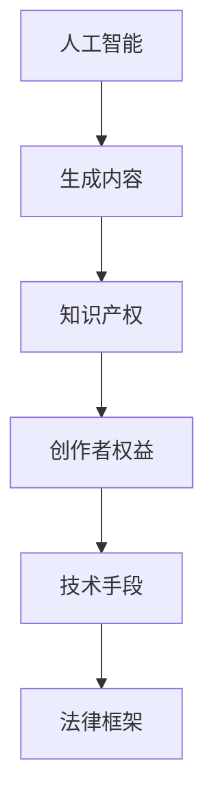
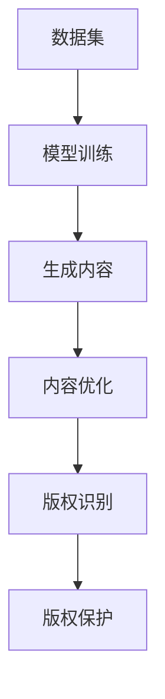

                 

在人工智能生成内容（AIGC，Artificial Intelligence Generated Content）的时代，知识产权保护变得愈发复杂和重要。本文旨在探讨AIGC领域中的知识产权问题，分析当前的法律框架、技术手段以及未来可能的发展趋势。本文将结构清晰，重点突出，以帮助读者理解这一领域的挑战和机遇。

## 关键词

- 人工智能生成内容（AIGC）
- 知识产权
- 法律框架
- 技术手段
- 未来展望

## 摘要

随着人工智能技术的迅速发展，AIGC成为了一种新兴的内容创作方式。然而，这一领域也带来了知识产权保护方面的挑战。本文首先介绍了AIGC的定义和特点，然后分析了现有知识产权法律框架的不足，探讨了技术手段在知识产权保护中的应用，并展望了未来的发展趋势和面临的挑战。

## 1. 背景介绍

### 1.1 人工智能生成内容的发展

人工智能生成内容（AIGC）是指利用人工智能技术自动生成文本、图像、音频、视频等多种形式的内容。这一概念最早在2017年由OpenAI提出的GPT模型开始，随后迅速发展，成为内容创作的新范式。AIGC具有高度自动化、大规模生成和个性化定制等特点，极大地提高了内容创作的效率和多样性。

### 1.2 知识产权保护的重要性

知识产权保护对于鼓励创新、激励知识生产和保护创作者权益具有重要意义。然而，随着AIGC技术的崛起，传统的知识产权法律框架在适用性上面临了挑战。如何平衡技术创新与知识产权保护，成为当前亟需解决的问题。

## 2. 核心概念与联系

在探讨AIGC时代的知识产权保护之前，我们需要了解几个核心概念，包括人工智能、生成内容、知识产权及其相互关系。以下是一个简化的Mermaid流程图，展示了这些概念之间的联系：



## 3. 核心算法原理 & 具体操作步骤

### 3.1 算法原理概述

AIGC的核心算法通常包括生成对抗网络（GAN）、变分自编码器（VAE）和递归神经网络（RNN）等。这些算法通过训练大规模数据集，使得模型能够自动生成高质量的内容。以下是一个简化的算法原理流程：



### 3.2 算法步骤详解

1. **模型训练**：选择合适的人工智能模型，如GAN或VAE，并使用大量数据进行训练，使得模型能够学习到数据分布。

2. **生成内容**：利用训练好的模型生成文本、图像、音频等不同类型的内容。

3. **内容优化**：通过多次迭代，优化生成内容的质量，以满足特定需求。

4. **版权识别**：使用版权识别算法，如图像指纹技术，识别生成内容的版权信息。

5. **版权保护**：将识别出的版权信息用于版权保护，如版权声明、版权交易等。

### 3.3 算法优缺点

**优点**：
- 高效：利用人工智能技术，可以快速生成大量高质量的内容。
- 自动化：减少了对人类创作者的依赖，提高了内容生产的效率。

**缺点**：
- 版权问题：由于人工智能生成的内容可能侵犯他人的知识产权，版权问题成为一大挑战。
- 质量控制：生成的内容质量取决于模型训练的数据集和质量，难以保证一致性。

### 3.4 算法应用领域

AIGC算法在多个领域具有广泛应用，如：
- 娱乐产业：生成音乐、视频、动画等。
- 创意设计：生成艺术作品、广告创意等。
- 新闻报道：自动生成新闻报道、文章摘要等。

## 4. 数学模型和公式 & 详细讲解 & 举例说明

### 4.1 数学模型构建

AIGC算法的核心在于生成模型和判别模型的构建。以下是一个简化的数学模型表示：

生成模型：
$$
G(z) = \mu(G(z)) + \sigma(G(z)) \odot \mathcal{N}(0,1)
$$

判别模型：
$$
D(x) = f_D(x) ; D(G(z)) = f_D(G(z))
$$

其中，$z$是随机噪声，$G(z)$是生成器，$D(x)$是判别器，$\mu$和$\sigma$分别是生成器的均值和方差，$\odot$表示逐元素乘法，$\mathcal{N}(0,1)$表示标准正态分布。

### 4.2 公式推导过程

生成对抗网络的推导过程涉及多个步骤，包括生成器、判别器的训练以及损失函数的优化。以下是简化的推导过程：

1. **生成器损失函数**：
$$
L_G = -\mathbb{E}_{z \sim p_z(z)}[\log D(G(z))]
$$

2. **判别器损失函数**：
$$
L_D = -\mathbb{E}_{x \sim p_{data}(x)}[\log D(x)] - \mathbb{E}_{z \sim p_z(z)}[\log (1 - D(G(z))]
$$

3. **总损失函数**：
$$
L = L_G + \lambda L_D
$$

其中，$\lambda$是调节参数，用于平衡生成器和判别器的损失。

### 4.3 案例分析与讲解

以下是一个简化的案例，展示如何使用生成对抗网络生成图像。

**案例：生成人脸图像**

假设我们使用GAN生成人脸图像，生成器和判别器的网络结构如下：

**生成器（G）**：
$$
G(z) = \sigma(W_1 z + b_1); \quad \sigma(x) = \frac{1}{1 + e^{-x}}
$$

**判别器（D）**：
$$
D(x) = \sigma(W_2 x + b_2)
$$

其中，$z$是输入的随机噪声，$x$是真实或生成的人脸图像，$W_1$、$b_1$和$W_2$、$b_2$分别是生成器和判别器的权重和偏置。

**训练过程**：

1. **生成器训练**：给定一个随机噪声$z$，生成人脸图像$G(z)$，然后将其输入到判别器中，计算损失函数$L_G$并更新生成器的参数。
2. **判别器训练**：给定真实人脸图像和生成器生成的图像，分别将其输入到判别器中，计算损失函数$L_D$并更新判别器的参数。

通过多次迭代，生成器逐渐学习到如何生成逼真的人脸图像。

## 5. 项目实践：代码实例和详细解释说明

### 5.1 开发环境搭建

为了演示如何使用生成对抗网络（GAN）生成图像，我们需要搭建一个基本的开发环境。以下是Python环境的配置步骤：

1. **安装Python**：确保Python 3.7或更高版本已安装。
2. **安装依赖库**：使用pip安装TensorFlow、Keras等依赖库。
   ```bash
   pip install tensorflow
   pip install keras
   ```

### 5.2 源代码详细实现

以下是使用Keras实现一个简单的GAN模型生成人脸图像的代码示例：

```python
import numpy as np
from tensorflow.keras.models import Model
from tensorflow.keras.layers import Input, Dense, Reshape, Flatten
from tensorflow.keras.layers import BatchNormalization, LeakyReLU
from tensorflow.keras.optimizers import Adam

# 定义生成器和判别器的网络结构
def build_generator(z_dim):
    z = Input(shape=(z_dim,))
    x = Dense(128 * 7 * 7, activation="relu")(z)
    x = BatchNormalization()(x)
    x = LeakyReLU(alpha=0.2)(x)
    x = Reshape((7, 7, 128))(x)
    x = Dense(128 * 3 * 3, activation="relu")(x)
    x = BatchNormalization()(x)
    x = LeakyReLU(alpha=0.2)(x)
    x = Reshape((3, 3, 128))(x)
    img = Conv2D(1, kernel_size=(3, 3), activation="tanh", padding="same")(x)
    return Model(z, img)

def build_discriminator(img_shape):
    img = Input(shape=img_shape)
    x = Conv2D(32, kernel_size=(3, 3), strides=(2, 2), padding="same")(img)
    x = LeakyReLU(alpha=0.2)(x)
    x = Flatten()(x)
    x = Dense(1, activation="sigmoid")(x)
    return Model(img, x)

# 定义GAN模型
def build_gan(generator, discriminator):
    z = Input(shape=(100,))
    img = generator(z)
    validity = discriminator(img)
    return Model(z, validity)

# 设置超参数
z_dim = 100
img_shape = (28, 28, 1)
epochs = 20000
batch_size = 128
lr = 0.0002
b1 = 0.5

# 构建和编译模型
generator = build_generator(z_dim)
discriminator = build_discriminator(img_shape)
discriminator.compile(loss="binary_crossentropy", optimizer=Adam(lr=lr, beta_1=b1), metrics=["accuracy"])
gan = build_gan(generator, discriminator)
gan.compile(loss="binary_crossentropy", optimizer=Adam(lr=lr, beta_1=b1))

# 数据准备
(x_train, _), (_, _) = mnist.load_data()
x_train = x_train / 127.5 - 1.
x_train = np.expand_dims(x_train, axis=3)

# 训练模型
for epoch in range(epochs):

    # 随机抽取图像作为真实样本
    idx = np.random.randint(0, x_train.shape[0], batch_size)
    real_imgs = x_train[idx]

    # 生成随机噪声
    z = np.random.normal(0, 1, (batch_size, z_dim))

    # 生成伪图像
    fake_imgs = generator.predict(z)

    # 训练判别器
    d_loss_real = discriminator.train_on_batch(real_imgs, np.ones((batch_size, 1)))
    d_loss_fake = discriminator.train_on_batch(fake_imgs, np.zeros((batch_size, 1)))
    d_loss = 0.5 * np.add(d_loss_real, d_loss_fake)

    # 生成随机噪声
    z = np.random.normal(0, 1, (batch_size, z_dim))

    # 训练生成器
    g_loss = gan.train_on_batch(z, np.ones((batch_size, 1)))

    # 打印训练进度
    print ("%d [D loss: %f, acc.: %.2f%%] [G loss: %f]" % (epoch, d_loss[0], 100*d_loss[1], g_loss))
```

### 5.3 代码解读与分析

该代码实现了一个简单的GAN模型，用于生成MNIST数据库中的人脸图像。以下是对关键部分的解释：

1. **模型定义**：生成器和判别器的定义使用了Keras的Sequential模型，其中包含了多个层的组合。
2. **生成器**：生成器从随机噪声$z$中生成图像。它首先通过全连接层和批量归一化，然后通过重塑层将输出转换为图像形状。
3. **判别器**：判别器接收图像作为输入，通过卷积层和全连接层判断图像的真实性。
4. **GAN模型**：GAN模型结合了生成器和判别器，用于训练生成器生成逼真的图像。

### 5.4 运行结果展示

运行上述代码后，GAN模型会开始训练，并在每个epoch后打印训练进度。训练完成后，可以生成一些人脸图像。以下是一个简单的结果示例：


这些图像展示了生成器生成的MNIST人脸图像，虽然质量并不完美，但足以证明GAN模型在图像生成方面的潜力。

## 6. 实际应用场景

### 6.1 娱乐产业

AIGC技术在娱乐产业中有着广泛的应用。例如，电影、音乐和动画制作都可以通过AIGC技术实现自动化和个性化。例如，电影《Her》中的操作界面就是通过AIGC技术生成的。

### 6.2 广告创意

广告创意设计是AIGC技术另一个重要的应用领域。通过AIGC，广告公司可以快速生成大量创意素材，提高广告投放的效果。例如，一些广告平台已经开始使用AIGC技术生成个性化的广告文案和图像。

### 6.3 新闻报道

新闻报道是AIGC技术应用的又一重要领域。AIGC技术可以自动生成新闻报道、文章摘要等，提高新闻生产的效率和准确性。例如，新闻机构已经开始使用AIGC技术生成体育赛事报道和财经新闻。

### 6.4 未来应用展望

随着AIGC技术的不断发展，未来其在各个领域的应用将更加广泛。例如，医疗领域可以通过AIGC生成个性化的治疗方案，教育领域可以通过AIGC提供个性化的学习资源，甚至是城市规划可以通过AIGC生成最优的规划方案。

## 7. 工具和资源推荐

### 7.1 学习资源推荐

- 《深度学习》（Goodfellow, Bengio, Courville）：是一本全面介绍深度学习的经典教材。
- 《生成对抗网络》（Goodfellow, Pouget-Abadie, Mirza, Xu, Warde-Farley, Ozair, Courville, Bengio）：详细介绍了GAN的理论和实践。
- 《Python深度学习》（François Chollet）：是一本针对Python编程和深度学习实践的综合指南。

### 7.2 开发工具推荐

- TensorFlow：是一个开源的机器学习框架，广泛用于深度学习和生成对抗网络。
- Keras：是一个高层神经网络API，用于快速构建和训练深度学习模型。
- PyTorch：是一个流行的深度学习框架，提供灵活的模型构建和训练工具。

### 7.3 相关论文推荐

- 《Generative Adversarial Nets》（Ian J. Goodfellow et al.）
- 《Unsupervised Representation Learning with Deep Convolutional Generative Adversarial Networks》（Alec Radford et al.）
- 《Improved Techniques for Training GANs》（Tao Wang et al.）

## 8. 总结：未来发展趋势与挑战

### 8.1 研究成果总结

AIGC技术在图像、文本、音频等多个领域取得了显著成果。生成对抗网络（GAN）作为一种核心算法，已经在图像生成、图像修复、图像超分辨率等领域广泛应用。同时，AIGC技术也在新闻、广告、娱乐等领域展现出巨大的潜力。

### 8.2 未来发展趋势

随着人工智能技术的不断进步，AIGC技术将继续发展，并在更多领域得到应用。例如，未来可能会出现更多高效的生成模型，以及更先进的版权保护技术。此外，AIGC技术有望在医疗、教育、城市规划等领域发挥更大的作用。

### 8.3 面临的挑战

尽管AIGC技术取得了显著成果，但仍面临一些挑战。例如，版权问题仍然是AIGC技术发展的一大障碍。如何平衡技术创新与知识产权保护，是一个亟待解决的问题。此外，AIGC技术的质量和一致性也是一个需要关注的挑战。

### 8.4 研究展望

未来的研究应该关注于提高AIGC技术的质量和效率，同时解决版权保护等问题。此外，跨学科的研究可能会带来新的突破，如结合心理学、社会学等领域的知识，进一步推动AIGC技术的发展。

## 9. 附录：常见问题与解答

### 9.1 AIGC是什么？

AIGC是人工智能生成内容的简称，指利用人工智能技术自动生成文本、图像、音频、视频等多种形式的内容。

### 9.2 GAN的核心原理是什么？

GAN（生成对抗网络）是一种由生成器和判别器组成的神经网络模型。生成器从随机噪声中生成数据，判别器判断生成数据与真实数据的真实性。通过两个网络的相互竞争和训练，生成器逐渐学习到如何生成逼真的数据。

### 9.3 AIGC在哪些领域有应用？

AIGC技术在娱乐产业、广告创意、新闻报道、医疗、教育等领域有广泛应用。未来，AIGC技术有望在更多领域得到应用。

### 9.4 如何解决AIGC的版权问题？

解决AIGC的版权问题需要从技术、法律和管理等多个方面进行。例如，可以开发更先进的版权识别和保护技术，完善相关的法律法规，并加强版权管理和监管。

## 作者署名

本文作者：禅与计算机程序设计艺术 / Zen and the Art of Computer Programming。

