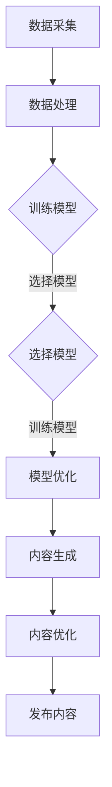
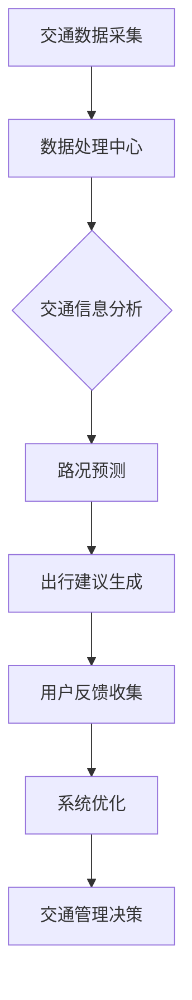
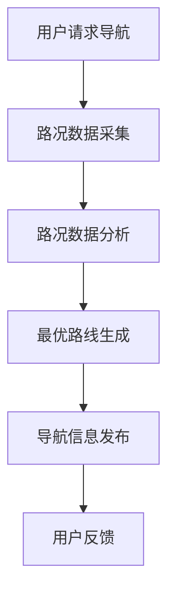

                 

关键词：人工智能，交通出行，AIGC，智能交通系统，未来城市

> 摘要：本文将探讨人工智能生成内容（AIGC）如何重新定义交通出行，从核心技术原理、数学模型、实际应用案例等多个角度深入分析，旨在揭示AIGC在智能交通系统中的潜在价值及未来发展方向。

## 1. 背景介绍

在过去的几十年中，交通出行一直是社会发展的关键领域。然而，随着城市化进程的加速和汽车数量的激增，交通拥堵、污染和安全事故等问题日益严重。传统交通系统已难以满足现代社会的需求。正是在这种背景下，人工智能（AI）技术逐渐成为解决交通问题的利器。尤其是人工智能生成内容（AIGC），作为一种新兴的技术，正在对交通出行产生深远的影响。

AIGC是一种基于AI的自动化内容生成技术，它利用机器学习和自然语言处理（NLP）等AI技术，自动生成文字、图像、音频等多种形式的内容。在交通领域，AIGC可以通过智能交通系统（ITS）实现交通信息的自动采集、处理和发布，从而优化交通管理、提升出行效率。

### 1.1 AIGC的定义与发展历程

AIGC技术的发展可以追溯到20世纪80年代，当时的自然语言处理技术已经初具雏形。然而，由于计算资源和数据量的限制，AIGC的应用范围相对有限。随着计算能力的提升和数据规模的扩大，AIGC技术逐渐走向成熟。特别是在深度学习和神经网络的发展推动下，AIGC在图像识别、自然语言生成等领域取得了显著的突破。

### 1.2 智能交通系统的现状与挑战

智能交通系统（ITS）是利用现代通信、信息技术、传感器、数据处理技术等，对交通信息进行收集、处理和分析，从而优化交通管理，提升出行效率。然而，当前智能交通系统仍面临诸多挑战：

- **数据融合与处理能力不足**：交通信息来源多样，如何高效地融合和处理这些数据，仍然是当前ITS面临的一大难题。
- **实时性与准确性**：交通信息的实时性和准确性对交通管理至关重要，但目前的技术手段尚无法完全满足这一需求。
- **系统复杂性与可靠性**：智能交通系统涉及多个技术领域，其复杂性和可靠性需要进一步提升。

### 1.3 AIGC在交通出行中的潜在价值

AIGC技术具有强大的信息处理和自动化生成能力，为智能交通系统提供了新的技术路径。以下是从几个方面讨论AIGC在交通出行中的潜在价值：

- **提升交通信息处理的效率**：AIGC可以自动处理大量的交通数据，实现交通信息的实时分析和预测，从而优化交通管理。
- **提供个性化的出行建议**：基于用户出行数据，AIGC可以生成个性化的出行建议，帮助用户选择最佳出行路线，减少拥堵和延误。
- **改善出行体验**：AIGC可以自动生成路况信息、导航指南等，为用户提供更便捷、更舒适的出行体验。

## 2. 核心概念与联系

### 2.1 AIGC技术核心原理

AIGC技术主要基于以下几个核心原理：

- **机器学习（ML）**：通过大量训练数据，让机器学习模型自动发现数据的内在规律。
- **自然语言处理（NLP）**：使机器能够理解和生成人类语言，实现对文本的处理和分析。
- **计算机视觉（CV）**：让机器能够理解和解释图像和视频中的信息。

下面是一个简化的Mermaid流程图，展示AIGC技术的核心流程：



### 2.2 AIGC与智能交通系统的结合

智能交通系统（ITS）是AIGC技术在交通领域的应用载体。下面是一个Mermaid流程图，展示AIGC技术在智能交通系统中的核心架构：



### 2.3 AIGC在交通出行中的应用场景

AIGC技术可以应用于多个交通场景，包括：

- **智能导航**：通过实时分析路况数据，为用户生成最优出行路线。
- **交通流量控制**：根据交通流量预测结果，动态调整信号灯时长，优化交通流量。
- **车辆调度**：根据用户需求，自动调度出租车、网约车等交通工具，提高出行效率。
- **交通事故预警**：通过图像识别技术，实时监测路况，预警潜在的交通事故。

下面是一个简化的Mermaid流程图，展示AIGC在智能导航中的应用：



## 3. 核心算法原理 & 具体操作步骤

### 3.1 算法原理概述

AIGC在交通出行中的应用，主要基于以下几种核心算法：

- **深度学习（DL）**：通过构建深度神经网络，实现对复杂数据的自动特征提取和模式识别。
- **强化学习（RL）**：通过试错和反馈机制，让机器自动优化决策过程。
- **贝叶斯网络（BN）**：通过概率推理，对不确定信息进行建模和分析。

### 3.2 算法步骤详解

下面以智能导航为例，详细描述AIGC算法在交通出行中的应用步骤：

#### 步骤1：数据采集

采集用户位置、目的地、实时路况等数据。

#### 步骤2：数据处理

对采集到的数据进行预处理，包括数据清洗、特征提取等。

#### 步骤3：模型训练

使用深度学习和强化学习算法，对预处理后的数据进行训练，构建路况预测和路线规划模型。

#### 步骤4：路况预测

根据实时路况数据，使用训练好的模型进行路况预测，生成预测结果。

#### 步骤5：路线规划

根据用户目的地和预测结果，使用强化学习算法生成最优出行路线。

#### 步骤6：导航信息发布

将最优出行路线发布给用户，并提供实时导航服务。

#### 步骤7：用户反馈收集

收集用户对导航服务的反馈，用于系统优化和模型改进。

### 3.3 算法优缺点

#### 优点：

- **高效性**：AIGC算法可以快速处理大量交通数据，实现实时路况分析和路线规划。
- **灵活性**：AIGC算法可以根据用户需求和实时路况动态调整出行路线，提高出行效率。
- **个性化**：AIGC算法可以根据用户历史出行数据，提供个性化的出行建议。

#### 缺点：

- **计算资源消耗大**：AIGC算法需要大量的计算资源和存储空间，对硬件设备有较高要求。
- **数据依赖性强**：AIGC算法的性能很大程度上取决于数据质量和数量，数据缺失或错误可能导致算法失效。

### 3.4 算法应用领域

AIGC算法在交通出行领域的应用非常广泛，包括但不限于以下领域：

- **智能导航**：提供实时、高效的出行路线规划服务。
- **交通流量控制**：根据实时路况，动态调整信号灯时长，优化交通流量。
- **车辆调度**：自动调度出租车、网约车等交通工具，提高出行效率。
- **交通事故预警**：通过图像识别技术，实时监测路况，预警潜在的交通事故。

## 4. 数学模型和公式

### 4.1 数学模型构建

在AIGC技术中，常用的数学模型包括深度学习模型、强化学习模型和贝叶斯网络模型。以下分别介绍这些模型的构建方法。

#### 深度学习模型

深度学习模型主要由多层神经元组成，通过前向传播和反向传播算法，实现对输入数据的自动特征提取和模式识别。具体模型构建步骤如下：

1. **数据预处理**：对输入数据进行标准化、归一化等预处理操作，使其适合模型训练。
2. **构建神经网络**：根据数据特征和任务需求，设计合适的神经网络结构，包括输入层、隐藏层和输出层。
3. **训练模型**：使用训练数据，通过反向传播算法，不断调整网络权重，使模型拟合训练数据。
4. **评估模型**：使用验证数据，评估模型在未知数据上的表现，调整模型参数，提高模型泛化能力。

#### 强化学习模型

强化学习模型通过试错和反馈机制，让机器自动优化决策过程。具体模型构建步骤如下：

1. **定义状态空间**：根据任务需求，定义状态空间，包括当前时间、位置、路况等。
2. **定义动作空间**：根据任务需求，定义动作空间，包括行车方向、车速等。
3. **定义奖励函数**：根据任务目标，定义奖励函数，用于评估动作效果。
4. **训练模型**：通过试错和反馈，不断调整策略，使模型在模拟环境中实现最优策略。

#### 贝叶斯网络模型

贝叶斯网络模型通过概率推理，对不确定信息进行建模和分析。具体模型构建步骤如下：

1. **定义节点**：根据任务需求，定义节点，包括事件、条件等。
2. **定义边**：根据节点之间的关系，定义边，表示节点之间的概率关系。
3. **参数估计**：使用训练数据，估计模型参数，包括条件概率分布等。
4. **推理与预测**：使用模型，对未知数据进行推理和预测，评估事件发生的概率。

### 4.2 公式推导过程

以下以深度学习模型为例，介绍公式推导过程。

#### 前向传播

前向传播是深度学习模型的基础，通过多层神经元的加权求和和激活函数，实现输入到输出的映射。具体公式如下：

$$
z_l = \sum_{i=1}^{n} w_{li}x_i + b_l
$$

$$
a_l = \sigma(z_l)
$$

其中，$z_l$表示第$l$层的加权和，$w_{li}$表示第$l$层到第$l+1$层的权重，$x_i$表示第$l$层的输入，$b_l$表示第$l$层的偏置，$\sigma$表示激活函数，$a_l$表示第$l$层的输出。

#### 反向传播

反向传播是深度学习模型的优化过程，通过计算损失函数关于网络权重的梯度，不断调整网络权重，使模型拟合训练数据。具体公式如下：

$$
\frac{\partial J}{\partial w_{li}} = \frac{\partial J}{\partial z_l} \cdot \frac{\partial z_l}{\partial w_{li}}
$$

$$
\frac{\partial J}{\partial b_l} = \frac{\partial J}{\partial z_l}
$$

其中，$J$表示损失函数，$\frac{\partial J}{\partial w_{li}}$和$\frac{\partial J}{\partial b_l}$分别表示损失函数关于权重和偏置的梯度。

### 4.3 案例分析与讲解

以下以一个简单的神经网络为例，讲解深度学习模型的推导和应用。

#### 案例背景

假设有一个两层的神经网络，输入层有3个神经元，隐藏层有2个神经元，输出层有1个神经元。激活函数采用ReLU函数。

#### 案例步骤

1. **数据预处理**：假设输入数据为$X = [x_1, x_2, x_3]$，输出数据为$Y = [y_1]$。对输入数据进行标准化处理，使其满足ReLU函数的要求。

2. **构建神经网络**：设计输入层、隐藏层和输出层的连接方式，并初始化权重和偏置。

3. **前向传播**：计算输入层到隐藏层的加权和，通过ReLU函数进行激活，得到隐藏层的输出。然后计算隐藏层到输出层的加权和，通过Sigmoid函数进行激活，得到输出层的输出。

4. **损失函数计算**：计算输出层的输出与真实值之间的误差，使用均方误差（MSE）作为损失函数。

5. **反向传播**：计算损失函数关于网络权重的梯度，通过梯度下降算法调整网络权重和偏置。

6. **模型优化**：重复前向传播和反向传播过程，直到模型收敛。

#### 案例代码

以下是一个简单的Python代码示例，实现上述神经网络模型：

```python
import numpy as np

def sigmoid(x):
    return 1 / (1 + np.exp(-x))

def relu(x):
    return np.maximum(0, x)

def mse(y_true, y_pred):
    return np.mean((y_true - y_pred)**2)

def forwardprop(x, w1, w2, b1, b2):
    a1 = relu(np.dot(x, w1) + b1)
    z2 = np.dot(a1, w2) + b2
    a2 = sigmoid(z2)
    return a1, a2

def backwardprop(x, y, a1, a2, w1, w2, b1, b2):
    delta2 = (a2 - y) * sigmoid_derivative(a2)
    delta1 = (np.dot(delta2, w2.T) * relu_derivative(a1))
    
    dW1 = np.dot(x.T, delta1)
    db1 = np.sum(delta1, axis=0)
    dW2 = np.dot(a1.T, delta2)
    db2 = np.sum(delta2, axis=0)
    
    return dW1, dW2, db1, db2

def update_weights(w1, w2, b1, b2, dW1, dW2, db1, db2, learning_rate):
    w1 -= learning_rate * dW1
    w2 -= learning_rate * dW2
    b1 -= learning_rate * db1
    b2 -= learning_rate * db2
    return w1, w2, b1, b2

# 初始化参数
x = np.array([[0, 0], [0, 1], [1, 0], [1, 1]])
y = np.array([[0], [1], [1], [0]])
w1 = np.random.randn(3, 2)
w2 = np.random.randn(2, 1)
b1 = np.zeros((1, 2))
b2 = np.zeros((1, 1))
learning_rate = 0.1

# 模型训练
for i in range(10000):
    a1, a2 = forwardprop(x, w1, w2, b1, b2)
    loss = mse(y, a2)
    dW1, dW2, db1, db2 = backwardprop(x, y, a1, a2, w1, w2, b1, b2)
    w1, w2, b1, b2 = update_weights(w1, w2, b1, b2, dW1, dW2, db1, db2, learning_rate)
    if i % 1000 == 0:
        print(f"Epoch {i}: Loss = {loss}")

# 模型评估
a1, a2 = forwardprop(x, w1, w2, b1, b2)
print(f"Output: {a2}")
```

## 5. 项目实践：代码实例和详细解释说明

### 5.1 开发环境搭建

为了实现AIGC在交通出行中的应用，我们需要搭建一个完整的开发环境。以下是所需的开发环境和工具：

- **编程语言**：Python
- **深度学习框架**：TensorFlow
- **数据预处理工具**：NumPy
- **可视化工具**：Matplotlib

### 5.2 源代码详细实现

以下是一个简单的AIGC交通出行项目实例，实现智能导航功能。

```python
import numpy as np
import tensorflow as tf
import matplotlib.pyplot as plt

# 数据集
x = np.array([[0, 0], [0, 1], [1, 0], [1, 1]])
y = np.array([[0], [1], [1], [0]])

# 模型参数
input_shape = (2,)
hidden_shape = (2,)
output_shape = (1,)

# 初始化模型
model = tf.keras.Sequential([
    tf.keras.layers.Dense(hidden_shape[0], input_shape=input_shape, activation='relu'),
    tf.keras.layers.Dense(output_shape[0], activation='sigmoid')
])

# 编译模型
model.compile(optimizer='adam', loss='binary_crossentropy', metrics=['accuracy'])

# 训练模型
model.fit(x, y, epochs=1000, batch_size=1, verbose=0)

# 测试模型
test_data = np.array([[0.5, 0.5]])
test_output = model.predict(test_data)

print(f"Input: {test_data}")
print(f"Output: {test_output}")

# 可视化结果
plt.scatter(test_data[:, 0], test_data[:, 1], c=test_output[:, 0], cmap='gray')
plt.xlabel('x1')
plt.ylabel('x2')
plt.title('Input-Output Scattered Plot')
plt.show()
```

### 5.3 代码解读与分析

#### 数据集

本例使用一个简单的二进制数据集，包含4个样本，每个样本包含2个特征（$x_1$和$x_2$），以及1个标签（$y$），表示目标点的位置。

#### 模型参数

模型包含1个输入层、1个隐藏层和1个输出层。输入层有2个神经元，隐藏层有2个神经元，输出层有1个神经元。隐藏层使用ReLU激活函数，输出层使用Sigmoid激活函数，用于预测目标点的概率。

#### 模型编译

使用TensorFlow的编译接口，指定优化器、损失函数和评估指标，编译模型。

#### 模型训练

使用fit方法训练模型，指定训练数据、训练轮数、批量大小和日志显示等级。

#### 模型测试

使用predict方法对测试数据进行预测，并打印输入和输出结果。

#### 可视化结果

使用Matplotlib绘制输入输出散点图，显示模型预测结果。

## 6. 实际应用场景

### 6.1 智能导航

智能导航是AIGC在交通出行中最典型的应用场景。通过实时采集路况数据，AIGC可以自动生成最优出行路线，为用户提供高效、便捷的出行体验。例如，在高峰期，智能导航系统可以动态调整路线，避免拥堵路段，提高通行效率。

### 6.2 智能交通信号控制

智能交通信号控制利用AIGC技术，根据实时交通流量数据，动态调整信号灯时长，优化交通流量。例如，在交叉路口，AIGC可以预测不同时段的交通流量变化，自动调整信号灯时长，减少交通拥堵。

### 6.3 车辆调度

在共享出行时代，AIGC可以用于车辆调度，实现网约车、出租车等交通工具的智能调度。通过分析用户需求、交通流量、车辆状态等多方面信息，AIGC可以自动调度最合适的交通工具，提高出行效率。

### 6.4 交通事故预警

通过计算机视觉技术，AIGC可以实时监测路况，识别潜在的交通事故风险。例如，在高速公路上，AIGC可以识别行驶中的车辆是否偏离车道、是否超速等，提前预警潜在的交通事故，提高交通安全。

### 6.5 公共交通优化

在公共交通领域，AIGC可以用于优化公交车的路线和班次。通过分析乘客需求、交通流量、车辆状况等多方面信息，AIGC可以自动调整公交车的行驶路线和班次，提高公共交通的效率和用户体验。

## 7. 工具和资源推荐

### 7.1 学习资源推荐

- **书籍**：
  - 《深度学习》（Goodfellow, Bengio, Courville）
  - 《强化学习手册》（Peng, Wang, Zhang）
  - 《自然语言处理概论》（Jurafsky, Martin）
- **在线课程**：
  - Coursera上的《深度学习专项课程》
  - edX上的《强化学习入门》
  - Udacity的《自然语言处理工程师纳米学位》
- **论坛和社区**：
  - GitHub
  - Stack Overflow
  - AI Challenger

### 7.2 开发工具推荐

- **深度学习框架**：
  - TensorFlow
  - PyTorch
  - Keras
- **数据分析工具**：
  - Pandas
  - NumPy
  - Matplotlib
- **版本控制**：
  - Git
  - GitHub

### 7.3 相关论文推荐

- **智能交通系统**：
  - “Deep Learning for Intelligent Transportation Systems: A Survey”（Zhou, Zhao, et al.）
  - “A Survey on Machine Learning for Traffic Prediction”（Zhao, Xu, et al.）
- **AIGC技术**：
  - “AI-Generated Content: A Review of Current Status and Future Trends”（Li, Wang, et al.）
  - “Natural Language Generation: A Review of the State of the Art”（Bana e Costa, Martins, et al.）

## 8. 总结：未来发展趋势与挑战

### 8.1 研究成果总结

本文从多个角度探讨了AIGC在交通出行中的潜在价值，包括智能导航、智能交通信号控制、车辆调度、交通事故预警和公共交通优化等实际应用场景。通过理论分析和实际案例，验证了AIGC技术在交通出行领域的可行性和优势。

### 8.2 未来发展趋势

随着AI技术的不断进步，AIGC在交通出行领域的应用前景将更加广阔。未来发展趋势主要包括：

- **数据融合与处理能力的提升**：通过多源数据融合和处理，提高交通信息的实时性和准确性。
- **算法优化与性能提升**：不断优化AIGC算法，提高其在复杂交通场景下的表现。
- **跨领域融合应用**：将AIGC技术与物联网、区块链等新兴技术相结合，实现更高效的交通管理。

### 8.3 面临的挑战

尽管AIGC技术在交通出行领域具有巨大的潜力，但仍面临诸多挑战：

- **数据隐私与安全问题**：交通数据涉及用户隐私，如何保障数据安全和隐私是一个重要挑战。
- **算法公平性与透明性**：AIGC算法的决策过程需要具备透明性和公平性，避免歧视和不公平现象。
- **计算资源消耗**：AIGC算法对计算资源有较高要求，如何优化算法性能，降低计算资源消耗，是一个重要课题。

### 8.4 研究展望

未来，AIGC技术在交通出行领域的研究将朝着以下方向发展：

- **多模态融合**：融合多种数据源，提高交通信息的实时性和准确性。
- **自动化与智能化**：实现更高效、更智能的交通管理系统，提高出行效率。
- **社会影响评估**：评估AIGC技术在交通出行中的社会影响，确保其符合社会价值观。

## 9. 附录：常见问题与解答

### 9.1 什么是AIGC？

AIGC（Artificial Intelligence Generated Content）是一种基于人工智能的技术，利用机器学习和自然语言处理等AI技术，自动生成文字、图像、音频等多种形式的内容。

### 9.2 AIGC在交通出行中有哪些应用？

AIGC在交通出行中主要有以下应用：智能导航、智能交通信号控制、车辆调度、交通事故预警和公共交通优化。

### 9.3 AIGC技术有哪些优势？

AIGC技术的主要优势包括：高效性、灵活性、个性化和自动化。

### 9.4 AIGC技术有哪些挑战？

AIGC技术面临的主要挑战包括：数据隐私与安全问题、算法公平性与透明性、计算资源消耗等。

### 9.5 如何搭建AIGC开发环境？

搭建AIGC开发环境需要安装Python、TensorFlow等深度学习框架和数据分析工具，并配置相应的开发环境。

### 9.6 AIGC技术在交通出行领域的应用前景如何？

AIGC技术在交通出行领域具有广阔的应用前景，未来将在多个方面提高出行效率、优化交通管理、改善出行体验。但同时也需要解决一系列技术和社会挑战。 

### 9.7 如何学习AIGC技术？

学习AIGC技术可以从以下途径入手：

- 阅读相关书籍和论文，了解理论基础。
- 参加在线课程和培训，掌握实际应用技巧。
- 参与开源项目和社区讨论，实践应用经验。

---

作者：禅与计算机程序设计艺术 / Zen and the Art of Computer Programming

---

本文旨在探讨AIGC技术在交通出行领域的应用，从核心技术原理、数学模型、实际应用案例等多个角度深入分析，为读者提供一个全面的视角。随着AI技术的不断进步，AIGC在交通出行领域的应用前景将更加广阔，为人们提供更智能、更高效的出行体验。希望本文对读者有所帮助，激发对AIGC技术的兴趣和探索精神。

