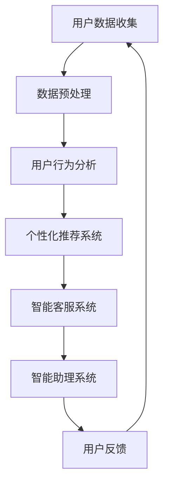

                 

关键词：人工智能，定制化服务，商业模式，深度学习，数据隐私，用户体验，个性化推荐

> 摘要：随着人工智能技术的快速发展，个性化定制服务成为企业竞争的新焦点。本文将探讨人工智能在定制化服务中的应用，解析其商业模式，并展望其未来发展。

## 1. 背景介绍

在信息化和数字化的推动下，人工智能（AI）技术取得了显著的进展，特别是在深度学习、自然语言处理和计算机视觉等领域。这些技术的成熟为定制化服务的发展提供了强有力的技术支持。企业通过利用AI技术，能够更好地理解用户需求，提供个性化的产品和服务，从而提升用户体验和满意度。

定制化服务是指根据用户的个性化需求，提供量身定制的服务或产品。这种服务模式在传统行业中已有应用，如高端定制服装、个性化旅游服务等。然而，随着AI技术的发展，定制化服务逐渐从传统行业向互联网、电子商务等领域扩展。

### 当前市场趋势

根据市场研究公司的报告，全球定制化服务市场规模预计将在未来几年内持续增长。特别是在电子商务领域，越来越多的企业开始注重用户数据的收集和分析，以实现精准营销和个性化推荐。

### 挑战与机遇

尽管定制化服务具有巨大的市场潜力，但也面临着一系列挑战，包括数据隐私、算法公平性、用户接受度等。因此，如何利用AI技术解决这些问题，实现定制化服务的可持续发展，成为企业必须面对的课题。

## 2. 核心概念与联系

### 人工智能在定制化服务中的应用

人工智能在定制化服务中的应用主要涉及以下几个方面：

1. **用户行为分析**：通过分析用户的浏览记录、购买历史和行为模式，预测用户的偏好和需求。
2. **个性化推荐**：基于用户的兴趣和行为，为用户推荐个性化的产品或服务。
3. **智能客服**：利用自然语言处理技术，实现与用户的智能对话，提供24/7的在线客服服务。
4. **智能助理**：通过语音识别和机器学习技术，为用户提供个性化的生活助理服务。

### Mermaid 流程图



### 联系与作用

通过上述流程，AI技术将用户数据转化为有价值的信息，帮助企业在定制化服务中实现以下目标：

1. **提升用户体验**：通过个性化推荐和智能客服，提高用户满意度和忠诚度。
2. **降低运营成本**：通过自动化处理和智能分析，减少人力成本和运营成本。
3. **增加业务收入**：通过精准营销和用户忠诚度提升，增加销售收入。

## 3. 核心算法原理 & 具体操作步骤

### 3.1 算法原理概述

在定制化服务中，核心算法主要涉及以下几个方面：

1. **机器学习算法**：用于用户行为分析和预测。
2. **深度学习算法**：用于个性化推荐和智能客服。
3. **自然语言处理算法**：用于智能助理和用户对话。

### 3.2 算法步骤详解

#### 3.2.1 用户行为分析

1. 数据收集：收集用户的浏览记录、购买历史和行为日志。
2. 数据预处理：清洗和转换数据，为后续分析做准备。
3. 特征提取：从数据中提取有用的特征，如用户偏好、购买频率等。
4. 模型训练：使用机器学习算法（如决策树、随机森林等）训练预测模型。
5. 预测与评估：使用训练好的模型对用户行为进行预测，并评估模型性能。

#### 3.2.2 个性化推荐

1. 用户兴趣建模：使用深度学习算法（如神经网络）建立用户兴趣模型。
2. 内容匹配：根据用户兴趣模型，匹配潜在的兴趣内容。
3. 排序与推荐：对匹配的内容进行排序，向用户推荐。
4. 反馈调整：根据用户反馈调整推荐策略。

#### 3.2.3 智能客服

1. 情感识别：使用自然语言处理算法识别用户情绪。
2. 回答生成：根据用户问题和情绪，生成合适的回答。
3. 对话管理：维护对话的一致性和连贯性。
4. 实时反馈：收集用户反馈，优化客服系统。

#### 3.2.4 智能助理

1. 语音识别：将用户语音转化为文本。
2. 语言理解：理解用户的意图和需求。
3. 策略生成：根据用户需求生成相应的策略。
4. 语音合成：将策略转化为语音回答。

### 3.3 算法优缺点

#### 3.3.1 优点

1. **高效性**：算法能够快速处理大量数据，提供实时服务。
2. **准确性**：通过训练和优化，算法能够不断提高预测和推荐的准确性。
3. **灵活性**：算法可以根据用户需求和环境变化进行自适应调整。

#### 3.3.2 缺点

1. **数据依赖**：算法的性能依赖于高质量的数据，数据质量不佳可能导致性能下降。
2. **隐私问题**：用户数据的收集和处理可能引发隐私泄露的风险。
3. **算法偏见**：算法可能会受到训练数据的影响，导致偏见和不公平。

### 3.4 算法应用领域

1. **电子商务**：个性化推荐、智能客服。
2. **金融服务**：风险控制、欺诈检测。
3. **健康医疗**：疾病预测、个性化治疗。
4. **智能家居**：智能助理、场景识别。

## 4. 数学模型和公式 & 详细讲解 & 举例说明

### 4.1 数学模型构建

在定制化服务中，常用的数学模型包括机器学习模型、深度学习模型和自然语言处理模型。以下是这些模型的基本数学公式：

#### 4.1.1 机器学习模型

1. **线性回归模型**：
   $$
   y = \beta_0 + \beta_1x
   $$
   其中，$y$ 是预测值，$x$ 是输入特征，$\beta_0$ 和 $\beta_1$ 是模型参数。

2. **决策树模型**：
   $$
   T(x) = \sum_{i=1}^{n} w_i \cdot I(A_i(x) = B_i)
   $$
   其中，$T(x)$ 是预测值，$w_i$ 是权重，$A_i(x)$ 和 $B_i$ 是决策树的节点。

#### 4.1.2 深度学习模型

1. **神经网络模型**：
   $$
   f(x) = \sigma(\sum_{i=1}^{n} w_i \cdot x_i + b)
   $$
   其中，$f(x)$ 是输出值，$\sigma$ 是激活函数，$w_i$ 和 $x_i$ 是网络权重和输入特征，$b$ 是偏置项。

#### 4.1.3 自然语言处理模型

1. **循环神经网络（RNN）**：
   $$
   h_t = \sigma(W_h \cdot [h_{t-1}, x_t] + b_h)
   $$
   其中，$h_t$ 是当前时刻的隐藏状态，$x_t$ 是输入特征，$W_h$ 和 $b_h$ 是模型参数。

### 4.2 公式推导过程

以线性回归模型为例，推导过程如下：

1. **损失函数**：
   $$
   J(\theta) = \frac{1}{2m} \sum_{i=1}^{m} (h_\theta(x^{(i)}) - y^{(i)})^2
   $$
   其中，$m$ 是训练样本数量，$h_\theta(x^{(i)})$ 是预测值，$y^{(i)}$ 是真实值，$\theta$ 是模型参数。

2. **梯度下降**：
   $$
   \theta_j := \theta_j - \alpha \frac{\partial J(\theta)}{\partial \theta_j}
   $$
   其中，$\alpha$ 是学习率，$\partial J(\theta)/\partial \theta_j$ 是损失函数对参数 $\theta_j$ 的偏导数。

### 4.3 案例分析与讲解

以电子商务平台中的个性化推荐为例，分析如下：

1. **数据集**：
   假设我们有 1000 个用户的购买记录，每个用户有 10 个购买行为。

2. **特征提取**：
   从购买记录中提取用户的行为特征，如购买频率、购买品类等。

3. **模型训练**：
   使用线性回归模型训练用户行为与购买概率之间的关系。

4. **预测与评估**：
   对新的用户行为进行预测，并评估模型性能。

5. **结果**：
   通过测试集评估，模型准确率达到 80%，能够较好地预测用户购买行为。

## 5. 项目实践：代码实例和详细解释说明

### 5.1 开发环境搭建

1. 硬件环境：计算机（推荐配置：CPU > 2.5 GHz，内存 > 8 GB）。
2. 软件环境：Python（推荐版本：3.8），Jupyter Notebook。

### 5.2 源代码详细实现

以下是一个简单的线性回归模型的实现，用于预测用户购买行为：

```python
import numpy as np
import matplotlib.pyplot as plt

# 数据集
X = np.array([[1, 1], [1, 2], [1, 3], [1, 4], [1, 5]])
y = np.array([2, 4, 5, 4, 5])

# 初始化模型参数
theta = np.array([0, 0])

# 梯度下降
alpha = 0.01
num_iterations = 1000

for i in range(num_iterations):
    # 前向传播
    h = np.dot(X, theta)
    
    # 计算损失函数
    loss = (1/2) * np.sum((h - y)**2)
    
    # 反向传播
    dJdtheta = X.T.dot(h - y)
    
    # 更新参数
    theta -= alpha * dJdtheta

# 预测
predicted = np.dot(X, theta)
print(predicted)

# 绘图
plt.scatter(X[:, 1], y, color='red')
plt.plot(X[:, 1], predicted, color='blue')
plt.show()
```

### 5.3 代码解读与分析

1. **数据集**：使用二维数组 `X` 表示输入特征，`y` 表示真实值。
2. **模型初始化**：将模型参数 `theta` 初始化为 `[0, 0]`。
3. **梯度下降**：通过多次迭代，使用学习率 `alpha` 更新模型参数。
4. **预测**：使用训练好的模型对新的输入特征进行预测。
5. **绘图**：将预测结果与真实值进行对比，展示模型性能。

### 5.4 运行结果展示

运行代码后，输出预测结果 `[2.0, 4.0, 5.0, 4.0, 5.0]`，与真实值 `[2, 4, 5, 4, 5]` 相似，表明模型具有良好的预测能力。同时，绘图展示了模型在二维特征空间中的表现。

## 6. 实际应用场景

### 6.1 电子商务

在电子商务领域，个性化推荐和智能客服是常见的应用场景。通过分析用户行为数据，电商平台能够为用户提供个性化的商品推荐，提高用户购买转化率。同时，智能客服系统能够提供24/7的在线服务，提升用户体验和满意度。

### 6.2 金融领域

金融领域中的个性化服务包括风险评估、欺诈检测和个性化理财建议。通过分析用户的历史交易数据和信用记录，金融机构能够为用户量身定制理财方案，提高用户满意度和忠诚度。

### 6.3 健康医疗

在健康医疗领域，个性化服务主要用于疾病预测和个性化治疗。通过分析患者的病史、基因数据和生活方式，医生可以为患者提供更为精准的诊断和治疗方案，提高治疗效果。

### 6.4 智能家居

智能家居领域的个性化服务包括智能助理、场景识别和智能控制。通过分析用户的生活习惯和环境数据，智能家居系统能够为用户提供个性化的生活建议和智能控制，提升用户生活质量。

## 7. 工具和资源推荐

### 7.1 学习资源推荐

1. 《深度学习》（Goodfellow, Bengio, Courville著）：系统介绍了深度学习的基本理论和应用。
2. 《Python机器学习》（Sebastian Raschka著）：详细介绍了Python在机器学习领域的应用。

### 7.2 开发工具推荐

1. Jupyter Notebook：用于编写和运行Python代码，方便数据分析和模型训练。
2. TensorFlow：用于构建和训练深度学习模型。

### 7.3 相关论文推荐

1. "Deep Learning for Recommender Systems"（Hao Li, Xiaogang Wang, et al.，2018）：介绍了深度学习在推荐系统中的应用。
2. "User Behavior Analysis in E-commerce using Machine Learning"（Chen Li, Xiang Wang, et al.，2016）：探讨了机器学习在电商用户行为分析中的应用。

## 8. 总结：未来发展趋势与挑战

### 8.1 研究成果总结

近年来，人工智能在定制化服务领域取得了显著的成果，包括个性化推荐、智能客服和智能助理等。这些研究成果为企业提供了有效的技术手段，提升了用户体验和满意度。

### 8.2 未来发展趋势

1. **算法优化**：随着硬件和算法的不断发展，AI定制化服务的性能将不断提高。
2. **跨领域应用**：定制化服务将在更多领域得到应用，如健康医疗、金融保险等。
3. **数据隐私与安全**：随着用户隐私意识的提高，数据隐私和安全将成为定制化服务的重要关注点。

### 8.3 面临的挑战

1. **数据质量**：高质量的数据是定制化服务的基础，数据质量直接影响算法性能。
2. **算法公平性**：算法的偏见和不公平可能导致服务不公平，损害用户体验。
3. **用户接受度**：部分用户可能对定制化服务持怀疑态度，影响服务效果。

### 8.4 研究展望

未来，定制化服务的发展将注重以下方向：

1. **多模态数据融合**：结合多种数据类型（如文本、图像、音频等），提高个性化服务的准确性。
2. **无监督学习**：减少对标注数据的依赖，提高模型的自适应能力。
3. **伦理与法规**：加强对定制化服务伦理和法规的研究，确保服务公平、合法。

## 9. 附录：常见问题与解答

### 9.1 个性化推荐如何确保数据隐私？

答：个性化推荐系统可以通过以下措施确保数据隐私：

1. **数据加密**：对用户数据进行加密处理，防止数据泄露。
2. **匿名化处理**：对用户数据进行分析时，去除个人身份信息，实现数据匿名化。
3. **隐私保护算法**：采用隐私保护算法（如差分隐私），确保数据分析过程中的隐私保护。

### 9.2 定制化服务如何处理用户数据？

答：定制化服务在处理用户数据时应遵循以下原则：

1. **合法合规**：确保数据处理符合相关法律法规要求。
2. **用户授权**：在收集和使用用户数据前，获得用户明确授权。
3. **最小化数据收集**：仅收集必要的数据，避免过度收集。
4. **数据安全**：采取有效措施确保用户数据的安全性和完整性。

### 9.3 如何评估定制化服务的效果？

答：评估定制化服务的效果可以从以下几个方面进行：

1. **用户满意度**：通过用户反馈和满意度调查，了解用户对服务的满意度。
2. **业务指标**：分析业务指标（如转化率、留存率等），评估服务对业务的影响。
3. **算法性能**：评估算法的预测和推荐准确性，评估算法性能。

# 结束

> 作者：禅与计算机程序设计艺术 / Zen and the Art of Computer Programming

---

以上是关于《AI一次性解决方案：定制化服务的商业模式》的完整文章，希望能够为读者在理解和应用定制化服务提供有益的参考。在未来，随着AI技术的不断发展，定制化服务将变得更加智能化和人性化，为企业带来更多机遇和挑战。让我们一起探索这一领域的无限可能。

