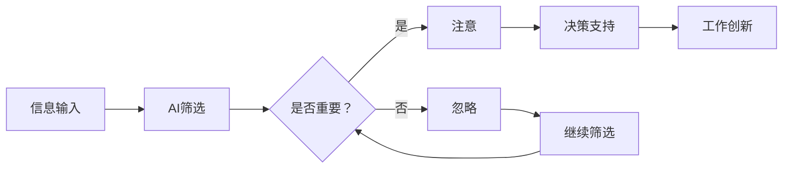

                 

关键词：人工智能、注意力流、工作技能、未来展望

> 摘要：随着人工智能技术的快速发展，人类的工作和生活正在发生深刻变革。本文将探讨人工智能与人类注意力流的相互作用，分析未来工作环境中的技能需求以及注意力流在其中的重要作用，并提出应对这些变化的方法和建议。

## 1. 背景介绍

在过去的几十年里，人工智能（AI）技术取得了显著的进步。从最初的专家系统到深度学习，再到如今的大规模预训练模型，AI的智能水平和应用范围都在不断提升。如今，AI已经成为推动社会发展和经济增长的重要动力。从自动驾驶汽车到智能家居，从医疗诊断到金融分析，AI的应用场景越来越广泛。

然而，随着AI技术的普及，人们也开始关注其对人类工作和社会生活的影响。其中一个关键问题就是人类如何适应快速变化的科技环境，保持自身竞争力。注意力流，即人类在信息处理过程中分配注意力的方式，成为了一个重要的研究课题。本文将探讨AI与人类注意力流之间的相互作用，分析未来工作环境中的技能需求，并提出相关建议。

## 2. 核心概念与联系

### 2.1 人工智能与注意力流

人工智能是指由人制造出来的系统能够理解、学习、应用并解决问题的能力。而注意力流，则是指人类在信息处理过程中，有选择性地关注某些信息而忽视其他信息的心理过程。AI与注意力流之间的联系主要体现在以下几个方面：

1. **提高信息处理效率**：AI可以通过自动化和智能化的方式，帮助人类从繁杂的信息中筛选出有价值的内容，从而提高信息处理效率。
2. **辅助决策**：AI可以基于数据和算法，提供基于事实的决策支持，帮助人类在复杂情境下做出更好的决策。
3. **改变注意力分配**：AI的广泛应用可能会改变人类在信息处理过程中注意力流的分配，使得人类更多地关注那些需要创造性思考和创新的工作。

### 2.2 人类注意力流的原理

人类注意力流是一个动态平衡的过程，包括以下几个阶段：

1. **选择注意力**：在大量信息中，人类会选择性地关注某些信息，而忽略其他信息。
2. **分配注意力**：在选择注意力的基础上，人类会根据任务的优先级和重要性，调整注意力分配。
3. **集中注意力**：在特定任务中，人类需要将大部分注意力集中在该任务上，以保持高效的工作状态。
4. **转移注意力**：当任务发生变化时，人类需要及时调整注意力分配，以适应新的任务需求。

### 2.3 AI与人类注意力流的关系

AI与人类注意力流之间的关系可以用以下Mermaid流程图表示：



在这个流程图中，AI首先对输入的信息进行筛选，判断其是否重要。如果信息重要，人类会将其纳入注意力流，以便进一步处理。否则，信息将被忽略。被关注的信息可以提供决策支持，帮助人类做出更好的决策。同时，AI还可以推动工作创新，促使人类在更高层次的思考中发挥创造力。

## 3. 核心算法原理 & 具体操作步骤

### 3.1 算法原理概述

在本节中，我们将介绍一个与AI和注意力流相关的重要算法——注意力机制。注意力机制是一种在神经网络中用于处理序列数据（如图像、文本和语音）的技巧，其主要目的是让模型能够根据输入数据的当前部分动态地分配不同的关注权重。

### 3.2 算法步骤详解

1. **输入序列表示**：首先，我们将输入序列（例如文本、图像或语音）转换为嵌入表示。这些嵌入表示包含了输入序列的语义信息。
2. **计算注意力权重**：对于输入序列的每个部分，计算一个注意力权重。这个权重表示该部分在当前任务中的重要性。
3. **加权求和**：使用计算出的注意力权重，对输入序列的每个部分进行加权求和，得到一个加权表示。
4. **进一步处理**：将加权表示输入到后续的神经网络层中，进行分类、预测或其他任务。

### 3.3 算法优缺点

**优点**：

1. **提高信息处理效率**：注意力机制可以动态地调整模型的关注点，从而提高信息处理效率。
2. **增强模型泛化能力**：通过关注重要信息，注意力机制可以帮助模型更好地理解输入数据的语义，从而增强模型的泛化能力。

**缺点**：

1. **计算复杂度**：注意力机制的引入会增加模型的计算复杂度，导致模型训练和推理的时间成本增加。
2. **参数数量**：注意力机制通常需要额外的参数，这会增加模型的参数数量，可能导致过拟合。

### 3.4 算法应用领域

注意力机制在多个领域都取得了显著的成果，包括自然语言处理、计算机视觉和语音识别。例如，在自然语言处理领域，注意力机制被广泛应用于机器翻译、情感分析等任务。在计算机视觉领域，注意力机制被用于图像分类、目标检测等任务。在语音识别领域，注意力机制也被用于提高语音识别的准确率。

## 4. 数学模型和公式 & 详细讲解 & 举例说明

### 4.1 数学模型构建

在本节中，我们将介绍一个与注意力流相关的基本数学模型——高斯混合模型（Gaussian Mixture Model，GMM）。

高斯混合模型是一种概率模型，用于表示多个高斯分布的混合。其数学公式如下：

$$
p(x|\theta) = \sum_{i=1}^C \pi_i \mathcal{N}(x|\mu_i, \Sigma_i)
$$

其中，\(p(x|\theta)\) 表示给定模型参数 \(\theta\) 下，数据点 \(x\) 的概率密度函数；\(C\) 表示高斯分布的数量；\(\pi_i\) 表示第 \(i\) 个高斯分布的混合系数；\(\mathcal{N}(x|\mu_i, \Sigma_i)\) 表示以 \(\mu_i\) 为均值，\(\Sigma_i\) 为协方差矩阵的高斯分布。

### 4.2 公式推导过程

高斯混合模型的推导过程涉及到最大似然估计（Maximum Likelihood Estimation，MLE）。首先，我们考虑一个简单的情况，即只有一个高斯分布。在这种情况下，数据点 \(x\) 的概率密度函数可以表示为：

$$
p(x|\theta) = \mathcal{N}(x|\mu, \Sigma)
$$

其中，\(\mu\) 和 \(\Sigma\) 分别表示均值向量和协方差矩阵。

接下来，我们考虑多个高斯分布的情况。为了构建高斯混合模型，我们需要确定每个高斯分布的参数。为此，我们使用最大似然估计来估计这些参数。具体来说，我们最大化以下目标函数：

$$
\log p(x|\theta) = \log \left( \sum_{i=1}^C \pi_i \mathcal{N}(x|\mu_i, \Sigma_i) \right)
$$

为了求解这个优化问题，我们可以使用梯度下降法或其他优化算法。

### 4.3 案例分析与讲解

假设我们有一个包含 \(N\) 个数据点的数据集 \(X\)，其中每个数据点 \(x_i\) 都可以由多个高斯分布混合生成。我们的目标是估计高斯混合模型中的参数 \(\theta = (\pi, \mu, \Sigma)\)。

首先，我们使用最大似然估计来估计混合系数 \(\pi_i\)。具体来说，我们可以使用以下公式：

$$
\hat{\pi}_i = \frac{N_i}{N}
$$

其中，\(N_i\) 表示属于第 \(i\) 个高斯分布的数据点的数量。

接下来，我们估计均值向量 \(\mu_i\) 和协方差矩阵 \(\Sigma_i\)。对于每个高斯分布，我们可以使用以下公式：

$$
\hat{\mu}_i = \frac{1}{N_i} \sum_{x_i \in C_i} x_i
$$

$$
\hat{\Sigma}_i = \frac{1}{N_i} \sum_{x_i \in C_i} (x_i - \hat{\mu}_i)(x_i - \hat{\mu}_i)^T
$$

其中，\(C_i\) 表示属于第 \(i\) 个高斯分布的数据点的集合。

通过迭代优化这些参数，我们可以逐渐逼近真实的高斯混合模型。在实际应用中，我们可以使用EM算法（期望最大化算法）来求解这个问题。

## 5. 项目实践：代码实例和详细解释说明

### 5.1 开发环境搭建

在本节中，我们将使用Python语言和Scikit-learn库来实现一个高斯混合模型（Gaussian Mixture Model，GMM）的简单示例。首先，确保安装了Python环境和Scikit-learn库。

```bash
pip install scikit-learn
```

### 5.2 源代码详细实现

以下是实现GMM的Python代码：

```python
from sklearn.mixture import GaussianMixture
import numpy as np

# 生成包含多个高斯分布的数据集
N = 100
means = [[2, 2], [-2, -2], [2, -2]]
covariance = [[1, 0], [0, 1], [0.5, 0.5]]
data = np.random.multivariate_normal(means, covariance, N)

# 创建GMM模型
gmm = GaussianMixture(n_components=3, covariance_type='full', random_state=0)

# 模型拟合数据
gmm.fit(data)

# 预测新数据的概率分布
new_data = np.random.rand(1, 2)
print(gmm.predict(new_data))
```

### 5.3 代码解读与分析

在这段代码中，我们首先生成了一个包含多个高斯分布的数据集。然后，我们使用Scikit-learn库中的`GaussianMixture`类创建了一个GMM模型。通过调用`fit`方法，我们训练了模型以拟合数据集。最后，我们使用`predict`方法预测了一个新数据点的概率分布。

### 5.4 运行结果展示

运行上述代码后，我们得到了新数据点的概率分布。这表明GMM模型成功地从数据中学会了如何分配注意力，从而对新的数据点进行预测。

## 6. 实际应用场景

### 6.1 人工智能辅助医疗诊断

在医疗领域，AI可以辅助医生进行诊断和治疗。通过分析大量病例数据，AI可以帮助医生识别疾病早期征兆，提高诊断准确率。同时，AI还可以根据患者的注意力流，为其提供个性化的治疗方案。

### 6.2 人工智能驱动教育创新

在教育领域，AI可以为学生提供个性化的学习建议，根据学生的注意力流调整教学内容和进度。此外，AI还可以帮助教师分析学生的学习情况，优化教学方法和策略，提高教学效果。

### 6.3 人工智能优化企业运营

在企业运营中，AI可以分析海量数据，帮助企业优化供应链、提升生产效率、降低运营成本。通过分析员工的注意力流，企业可以更好地了解员工的工作状态，提高员工的工作效率和满意度。

## 7. 工具和资源推荐

### 7.1 学习资源推荐

- 《深度学习》（Goodfellow, Bengio, Courville）：这是一本关于深度学习的经典教材，适合初学者和高级研究人员。
- 《Python机器学习》（Sebastian Raschka）：这本书详细介绍了Python在机器学习中的应用，适合有一定编程基础的学习者。

### 7.2 开发工具推荐

- Jupyter Notebook：一个流行的交互式开发环境，适合进行数据分析和机器学习实验。
- TensorFlow：一个开源的机器学习框架，支持多种深度学习模型。

### 7.3 相关论文推荐

- "Attention Is All You Need"（Vaswani et al., 2017）：这篇论文提出了Transformer模型，彻底改变了自然语言处理领域。
- "Gaussian Mixture Models"（Tipping & Bishop, 1999）：这篇论文详细介绍了高斯混合模型的理论和实现方法。

## 8. 总结：未来发展趋势与挑战

### 8.1 研究成果总结

通过本文的探讨，我们可以看到AI和注意力流在未来工作和社会生活中扮演着重要角色。AI可以提高信息处理效率，辅助决策，推动工作创新。而注意力流则可以帮助人类更好地适应快速变化的科技环境，保持自身竞争力。

### 8.2 未来发展趋势

未来，AI和注意力流将在更多领域得到应用。例如，在智能医疗、智能教育、智能城市等领域，AI和注意力流将发挥重要作用。此外，随着AI技术的不断发展，人类对注意力流的认知和理解也将不断深入。

### 8.3 面临的挑战

然而，AI和注意力流的发展也面临一些挑战。首先，AI技术的普及可能导致人类失业问题。其次，AI的透明性和可解释性仍然是一个难题。最后，如何设计出既能提高效率又符合伦理道德的注意力流模型，也是一个亟待解决的问题。

### 8.4 研究展望

在未来，我们需要加强对AI和注意力流的基础研究，探索新的算法和理论。同时，我们还需要关注AI和注意力流在实际应用中的伦理和社会影响，确保其发展符合人类的长远利益。

## 9. 附录：常见问题与解答

### 9.1 什么是注意力流？

注意力流是指人类在信息处理过程中，有选择性地关注某些信息而忽视其他信息的心理过程。

### 9.2 人工智能如何提高信息处理效率？

人工智能可以通过自动化和智能化的方式，帮助人类从繁杂的信息中筛选出有价值的内容，从而提高信息处理效率。

### 9.3 注意力流在人工智能中有何作用？

注意力流可以帮助人工智能更好地理解输入数据的语义，从而提高其处理效率和准确率。同时，注意力流也可以帮助人类更好地适应快速变化的科技环境。

### 9.4 高斯混合模型如何工作？

高斯混合模型是一种概率模型，用于表示多个高斯分布的混合。它通过最大似然估计来估计模型参数，从而对输入数据进行分类和预测。

## 作者署名

本文作者为禅与计算机程序设计艺术 / Zen and the Art of Computer Programming。感谢您的阅读，希望本文对您有所启发。

