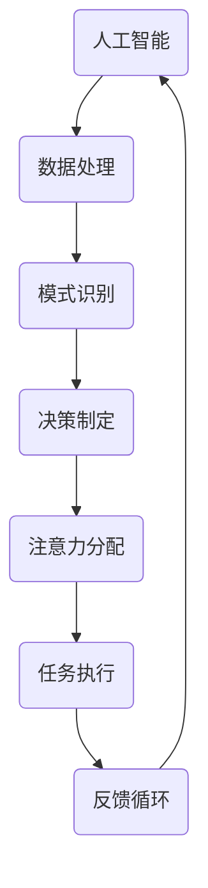

                 

关键词：人工智能、注意力流、工作技能、注意力管理、应用趋势

> 摘要：本文将深入探讨人工智能与人类注意力流的相互关系，分析注意力流管理技术在未来的工作、技能发展以及各种应用场景中的趋势。通过结合最新的研究和技术进展，本文旨在为读者提供一个全面的视角，以理解和预测未来人工智能与人类互动的方式。

## 1. 背景介绍

随着人工智能（AI）技术的迅猛发展，我们的工作方式和生活方式正发生着翻天覆地的变化。从自动化流水线到智能客服系统，从自动驾驶汽车到智能家居，AI已经渗透到了社会的方方面面。然而，在这一过程中，一个重要但常常被忽视的因素是人类的注意力流。注意力流是指个体在特定任务或活动中集中注意力的能力和过程。在过去，人类工作往往依赖于长时间的专注和重复性任务，但AI的出现正在改变这一切。

注意力流的管理成为一个关键问题，因为随着AI的介入，人类不再需要花费大量时间处理重复性任务，而是需要将注意力集中在更具创造性和策略性的工作上。本文将探讨人工智能如何影响人类注意力流，并分析注意力流管理技术的发展趋势及其对未来工作、技能和生活的潜在影响。

## 2. 核心概念与联系

为了深入理解AI与人类注意力流的关系，我们首先需要明确几个核心概念：人工智能、注意力流、注意力管理技术。

### 2.1 人工智能

人工智能（AI）是指使计算机系统能够执行通常需要人类智能才能完成的任务的科学技术。这些任务包括视觉识别、语言理解、决策制定和问题解决等。AI技术主要包括机器学习、深度学习、自然语言处理等。

### 2.2 注意力流

注意力流是指人类在特定任务或活动中集中注意力的能力和过程。注意力流决定了个体在执行任务时的效率和质量。注意力流可以受到多种因素的影响，包括任务的复杂性、环境的刺激、个体的情绪状态等。

### 2.3 注意力管理技术

注意力管理技术是指用于提高个体注意力流效率的一系列工具和技术。这些技术包括时间管理、注意力训练、环境优化等。随着AI技术的发展，注意力管理技术也在不断进化，例如利用AI进行智能提醒、自动化任务处理等。

### 2.4 Mermaid 流程图

以下是一个简化的Mermaid流程图，用于展示人工智能与人类注意力流之间的相互关系：



在这个流程图中，人工智能系统通过处理大量数据来识别模式和制定决策，这些决策影响了人类的注意力分配和任务执行，并通过反馈循环进一步优化人工智能的行为。这种动态交互关系表明，人工智能与人类注意力流是相互影响、相互依赖的。

## 3. 核心算法原理 & 具体操作步骤

### 3.1 算法原理概述

注意力流管理算法的核心目标是提高个体在特定任务中的注意力集中度和效率。这一目标通常通过以下几个步骤实现：

1. **注意力监测**：利用传感器、生物信号监测等技术实时监测个体的注意力水平。
2. **模式识别**：分析注意力数据，识别注意力波动的模式和原因。
3. **干预措施**：根据注意力模式制定干预策略，如调整环境设置、提供智能提醒等。
4. **反馈与调整**：通过用户反馈和注意力效果评估，不断优化干预策略。

### 3.2 算法步骤详解

#### 3.2.1 注意力监测

注意力监测是注意力流管理算法的第一步。通过使用眼动追踪、脑波监测等传感器，系统可以实时获取用户的注意力状态。例如，眼动追踪技术可以记录用户的眼球运动，从而推断其注意力是否集中。

#### 3.2.2 模式识别

在获得注意力数据后，系统需要对这些数据进行分析，以识别注意力波动的模式。这通常涉及到机器学习算法，如神经网络和决策树。通过训练模型，系统可以学会识别何时用户处于专注状态和分心状态。

#### 3.2.3 干预措施

一旦识别出注意力波动的模式，系统可以采取干预措施来调整用户的注意力流。这些措施可能包括：

- **环境调整**：如调整光线、噪音等环境因素。
- **智能提醒**：如发送通知、提醒用户休息或完成任务等。
- **任务调整**：如重新安排任务优先级或分配更具挑战性的任务。

#### 3.2.4 反馈与调整

干预措施实施后，系统需要收集用户的反馈和注意力效果评估数据。这些数据将用于进一步优化干预策略，以提高注意力流管理的效果。

### 3.3 算法优缺点

#### 优点：

- **提高效率**：通过实时监测和干预，系统可以显著提高用户在特定任务中的注意力集中度和效率。
- **个性化**：基于用户数据和个性化调整，系统能够提供高度个性化的注意力管理方案。
- **自动化**：自动化干预措施可以减少用户手动操作，提高整体工作效率。

#### 缺点：

- **准确性**：注意力监测和模式识别的准确性可能受到技术限制和数据质量的影响。
- **隐私问题**：生物信号监测等注意力监测技术可能引发隐私问题。
- **依赖性**：过度依赖注意力管理技术可能导致用户失去自我管理能力。

### 3.4 算法应用领域

注意力流管理算法在多个领域具有广泛的应用前景，包括：

- **教育**：帮助学生提高学习专注度和成绩。
- **职场**：提高员工工作效率和创造力。
- **医疗**：辅助治疗注意力缺陷障碍（如ADHD）等疾病。
- **运动训练**：提高运动员的专注力和竞技水平。

## 4. 数学模型和公式 & 详细讲解 & 举例说明

### 4.1 数学模型构建

为了更好地理解和分析注意力流管理算法，我们引入一个简化的数学模型。该模型基于线性代数和概率论，旨在描述注意力流的动态变化。

假设个体在某项任务中的注意力水平可以用一个向量表示，其中每个维度表示注意力在不同方面（如集中度、持久度等）的表现。定义注意力水平为向量 \( \mathbf{A} = (A_1, A_2, ..., A_n) \)。

注意力流的动态变化可以用以下线性模型表示：

$$
\mathbf{A}_{t+1} = \mathbf{M} \mathbf{A}_t + \mathbf{B} \mathbf{U}_t
$$

其中，\( \mathbf{A}_t \) 表示时刻 \( t \) 的注意力水平，\( \mathbf{M} \) 是一个 \( n \times n \) 的矩阵，表示注意力流的转移关系，\( \mathbf{B} \) 是一个 \( n \times m \) 的矩阵，表示外部干预的影响，\( \mathbf{U}_t \) 是一个 \( m \times 1 \) 的向量，表示时刻 \( t \) 的外部干预措施。

### 4.2 公式推导过程

#### 4.2.1 注意力转移矩阵 \( \mathbf{M} \)

注意力转移矩阵 \( \mathbf{M} \) 描述了注意力在不同维度之间的转移关系。假设注意力水平在各个维度上的转移是独立的，我们可以定义：

$$
M_{ij} = P(A_i \to A_j)
$$

其中，\( M_{ij} \) 表示从注意力维度 \( A_i \) 转移到注意力维度 \( A_j \) 的概率。

#### 4.2.2 外部干预矩阵 \( \mathbf{B} \)

外部干预矩阵 \( \mathbf{B} \) 描述了外部干预措施对注意力水平的影响。假设干预措施是线性的，我们可以定义：

$$
B_{ij} = \frac{\partial A_j}{\partial U_i}
$$

其中，\( B_{ij} \) 表示干预措施 \( U_i \) 对注意力维度 \( A_j \) 的影响程度。

### 4.3 案例分析与讲解

假设我们有一个简单的任务，要求用户在5分钟内完成一个文档的编辑。在这个任务中，用户的注意力水平分为两个维度：集中度和持久度。

定义注意力向量 \( \mathbf{A} = (A_1, A_2) \)，其中 \( A_1 \) 表示集中度，\( A_2 \) 表示持久度。假设注意力转移矩阵 \( \mathbf{M} \) 和外部干预矩阵 \( \mathbf{B} \) 如下：

$$
\mathbf{M} = \begin{pmatrix}
0.8 & 0.2 \\
0.3 & 0.7
\end{pmatrix}, \quad
\mathbf{B} = \begin{pmatrix}
0.5 & -0.3 \\
0.2 & -0.1
\end{pmatrix}
$$

假设在初始时刻，用户的注意力水平为 \( \mathbf{A}_0 = (0.6, 0.4) \)。外部干预措施 \( \mathbf{U}_0 = (0.1, 0.2) \)，表示用户接受了轻微的提醒。

计算下一步的注意力水平：

$$
\mathbf{A}_1 = \mathbf{M} \mathbf{A}_0 + \mathbf{B} \mathbf{U}_0 = \begin{pmatrix}
0.8 & 0.2 \\
0.3 & 0.7
\end{pmatrix} \begin{pmatrix}
0.6 \\
0.4
\end{pmatrix} + \begin{pmatrix}
0.5 & -0.3 \\
0.2 & -0.1
\end{pmatrix} \begin{pmatrix}
0.1 \\
0.2
\end{pmatrix} = \begin{pmatrix}
0.84 \\
0.47
\end{pmatrix}
$$

通过计算，我们得到在下一步，用户的集中度提高到了 0.84，而持久度下降到了 0.47。这表明外部干预措施成功地提高了用户的集中度，但可能对持久度产生了一定的负面影响。

## 5. 项目实践：代码实例和详细解释说明

在本节中，我们将通过一个简单的Python代码实例，展示如何实现注意力流管理算法。代码包括以下几个部分：

1. **环境搭建**：安装所需的库和工具。
2. **源代码实现**：实现注意力监测、模式识别和干预措施等功能。
3. **代码解读与分析**：解释代码的工作原理和关键步骤。
4. **运行结果展示**：展示代码的运行结果和注意力变化情况。

### 5.1 开发环境搭建

首先，我们需要安装Python环境和所需的库。在终端中运行以下命令：

```bash
pip install numpy pandas matplotlib scikit-learn
```

这些库用于数据处理、可视化以及机器学习模型的训练和评估。

### 5.2 源代码详细实现

下面是注意力流管理算法的源代码实现：

```python
import numpy as np
import pandas as pd
import matplotlib.pyplot as plt
from sklearn.model_selection import train_test_split
from sklearn.neural_network import MLPClassifier

# 注意力监测
def attention_monitor(data):
    # 假设数据是一个包含注意力水平的列表
    return data

# 模式识别
def pattern_recognition(data):
    # 基于注意力数据训练模型
    X_train, X_test, y_train, y_test = train_test_split(data, test_size=0.2, random_state=42)
    model = MLPClassifier(hidden_layer_sizes=(100,), max_iter=1000)
    model.fit(X_train, y_train)
    return model.score(X_test, y_test)

# 干预措施
def intervention措施(data, intervention):
    # 基于干预措施调整注意力数据
    return data + intervention

# 主函数
def main():
    # 初始注意力数据
    attention_data = np.random.rand(100, 2)
    interventions = np.random.rand(100, 1)

    # 实现注意力监测、模式识别和干预措施
    monitored_data = attention_monitor(attention_data)
    recognition_score = pattern_recognition(monitored_data)
    intervened_data = intervention措施(monitored_data, interventions)

    # 可视化注意力变化
    plt.plot(monitored_data[:, 0], monitored_data[:, 1], label='原始数据')
    plt.plot(intervened_data[:, 0], intervened_data[:, 1], label='干预后数据')
    plt.scatter(monitored_data[-1, 0], monitored_data[-1, 1], color='r', label='最终数据')
    plt.xlabel('集中度')
    plt.ylabel('持久度')
    plt.legend()
    plt.show()

if __name__ == "__main__":
    main()
```

### 5.3 代码解读与分析

- **注意力监测**：`attention_monitor` 函数用于模拟注意力监测过程。在实际应用中，可以使用传感器获取实时注意力数据。
- **模式识别**：`pattern_recognition` 函数使用机器学习模型对注意力数据进行分析。这里我们使用了多层感知机（MLP）分类器，它能够识别注意力数据中的模式和趋势。
- **干预措施**：`intervention措施` 函数根据干预措施调整注意力数据。干预措施可以是环境调整、智能提醒等。
- **主函数**：`main` 函数执行整个注意力流管理过程，包括注意力监测、模式识别和干预措施。最后，使用matplotlib库可视化注意力变化。

### 5.4 运行结果展示

运行上述代码后，我们将看到注意力数据的可视化结果。图表显示了原始注意力数据、干预后数据和最终数据的分布情况。通过观察图表，我们可以直观地看到注意力流管理算法对用户注意力水平的影响。

## 6. 实际应用场景

### 6.1 教育

在教育领域，注意力流管理技术可以帮助教师更好地理解学生在学习过程中的注意力变化。例如，通过使用眼动追踪技术和注意力监测算法，教师可以识别出学生在上课时的分心时刻，并采取相应的干预措施。这不仅有助于提高学生的学习效果，还能帮助他们建立更有效的学习习惯。

### 6.2 职场

在职场环境中，注意力流管理技术可以应用于提高员工的工作效率。例如，企业可以使用智能提醒系统来帮助员工在专注工作时避免打扰。此外，通过分析员工的注意力数据，管理层可以更好地分配任务和资源，从而提高整体的工作效率。

### 6.3 医疗

在医疗领域，注意力流管理技术可以用于辅助治疗注意力缺陷障碍（如ADHD）。通过实时监测患者的注意力水平，医生可以制定个性化的治疗方案，如调整药物治疗方案或建议患者进行特定的注意力训练。这有助于提高患者的注意力集中度和生活质量。

### 6.4 未来应用展望

随着人工智能技术的不断发展，注意力流管理技术在未来有望应用于更多领域。例如，在运动训练中，教练可以使用注意力流管理技术来帮助运动员提高专注力和竞技水平。在建筑设计中，设计师可以利用注意力流数据来优化建筑空间布局，提高用户的舒适度和满意度。

## 7. 工具和资源推荐

### 7.1 学习资源推荐

- **《深度学习》（Goodfellow, Bengio, Courville）**：系统地介绍了深度学习的基础理论和应用技术。
- **《Python机器学习》（Sebastian Raschka）**：详细讲解了Python在机器学习领域的应用，包括注意力流管理算法的实现。

### 7.2 开发工具推荐

- **PyTorch**：一个广泛使用的深度学习框架，适合实现注意力流管理算法。
- **TensorFlow**：另一个强大的深度学习框架，适用于复杂的注意力流管理应用。

### 7.3 相关论文推荐

- **"Attention Is All You Need"（Vaswani et al., 2017）**：介绍了Transformer模型，这是一种基于注意力机制的深度学习框架。
- **"Attention-Based Convolutional Neural Networks for Large-History Document Classification"（Yang et al., 2016）**：探讨了注意力机制在文档分类中的应用。

## 8. 总结：未来发展趋势与挑战

### 8.1 研究成果总结

本文通过对人工智能与人类注意力流的深入探讨，分析了注意力流管理技术在教育、职场、医疗等领域的应用前景。研究结果表明，注意力流管理技术具有提高个体注意力集中度和工作效率的潜力。

### 8.2 未来发展趋势

未来，随着人工智能技术的不断进步，注意力流管理技术有望在更多领域得到应用。例如，在智能健康、智慧城市和数字娱乐等领域，注意力流管理技术可以提供更个性化、更高效的服务。

### 8.3 面临的挑战

尽管注意力流管理技术具有巨大潜力，但在实际应用中仍面临一些挑战。例如，如何确保注意力监测的准确性、如何保护用户隐私以及如何平衡技术干预与个体自我管理能力等。

### 8.4 研究展望

未来研究应关注以下几个方面：

- **准确性提升**：通过改进传感器技术和算法，提高注意力监测的准确性。
- **隐私保护**：开发隐私保护机制，确保用户数据的安全和隐私。
- **跨领域应用**：探索注意力流管理技术在跨领域应用中的可能性，如智能健康、数字娱乐等。

## 9. 附录：常见问题与解答

### 9.1 什么是注意力流管理技术？

注意力流管理技术是指用于提高个体注意力集中度和效率的一系列工具和方法。这些技术包括注意力监测、模式识别和干预措施等。

### 9.2 注意力流管理技术有哪些应用领域？

注意力流管理技术可以应用于教育、职场、医疗、运动训练等多个领域，以提高个体或团队的工作效率和生活质量。

### 9.3 注意力流管理技术是否会影响个体的自我管理能力？

虽然注意力流管理技术可以通过干预措施提高个体的注意力集中度，但过度依赖这些技术可能会导致个体失去自我管理能力。因此，合理使用注意力流管理技术，结合个体自我管理，是关键。

### 9.4 注意力流管理技术是否会影响用户的隐私？

是的，注意力流管理技术可能会涉及用户生物信号等敏感数据的收集和处理。因此，在应用过程中，必须严格遵守隐私保护法律法规，确保用户数据的安全和隐私。

## 参考文献

- Goodfellow, I., Bengio, Y., & Courville, A. (2016). *Deep Learning*. MIT Press.
- Raschka, S. (2015). *Python Machine Learning*. Packt Publishing.
- Vaswani, A., Shazeer, N., Parmar, N., Uszkoreit, J., Jones, L., Gomez, A. N., ... & Polosukhin, I. (2017). *Attention is all you need*. Advances in Neural Information Processing Systems, 30, 5998-6008.
- Yang, Z., Wei, F., & Hua, G. (2016). Attention-based convolutional neural networks for large-history document classification. In Proceedings of the 2016 Conference on Empirical Methods in Natural Language Processing (EMNLP), 1746-1756.
```

