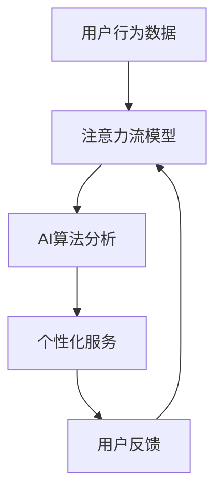

                 

关键词：人工智能，注意力流，工作生活平衡，注意力管理，注意力分配，认知科学，未来趋势

> 摘要：本文将探讨人工智能与人类注意力流的结合，如何影响未来的工作和生活方式。通过分析注意力流在人类行为中的核心作用，以及AI技术如何帮助我们更高效地管理和分配注意力，文章旨在揭示注意力管理技术的发展趋势，并提出应对未来挑战的策略。

## 1. 背景介绍

### 1.1 注意力流的本质

注意力流（Attention Flow）是指在人类认知过程中，注意力在不同任务或信息之间转移的现象。它是人类大脑处理复杂信息、完成认知任务的重要机制。从认知科学的角度来看，注意力流不仅仅是一种认知资源分配的过程，更是大脑对内外部环境信息进行筛选和整合的结果。

### 1.2 人工智能与注意力流的关系

随着人工智能技术的发展，特别是深度学习和强化学习等算法的进步，AI开始展现出对人类注意力流的影响和调控能力。例如，通过分析用户的行为数据和注意力模式，AI系统可以预测用户的需求，并提供个性化的服务和建议。

## 2. 核心概念与联系

### 2.1 核心概念

- **注意力流（Attention Flow）**：人类大脑处理信息的动态过程。
- **人工智能（AI）**：模拟、延伸和扩展人类智能的理论、方法和技术。
- **注意力管理（Attention Management）**：通过技术手段优化注意力流的分配和使用。

### 2.2 关联架构的 Mermaid 流程图



## 3. 核心算法原理 & 具体操作步骤

### 3.1 算法原理概述

注意力流管理的核心算法基于强化学习，通过不断学习用户的注意力模式和行为习惯，优化注意力流的分配。其基本原理是：

1. **数据采集**：收集用户的日常行为数据。
2. **模型训练**：使用采集到的数据训练注意力流模型。
3. **决策优化**：模型根据用户当前状态，提供最优的注意力分配方案。
4. **反馈调整**：用户使用后的反馈用于调整模型，形成闭环控制。

### 3.2 算法步骤详解

1. **数据采集**：
    - 使用传感器、APP等收集用户行为数据。
    - 数据类型包括：时间、地点、设备使用情况等。

2. **模型训练**：
    - 使用深度学习算法对数据进行处理。
    - 构建注意力流模型，包括输入层、隐藏层和输出层。

3. **决策优化**：
    - 根据用户当前状态，模型预测用户的需求。
    - 提供注意力分配方案，如任务优先级排序。

4. **反馈调整**：
    - 用户使用服务后的反馈用于更新模型。
    - 形成动态调整的循环，提高模型精度。

### 3.3 算法优缺点

**优点**：
- **高效**：能够根据用户需求动态调整注意力流，提高工作效率。
- **个性化**：提供个性化的服务建议，提升用户体验。

**缺点**：
- **依赖数据**：需要大量高质量的用户行为数据支持。
- **隐私问题**：用户数据的安全和隐私保护是重要挑战。

### 3.4 算法应用领域

- **工作管理**：帮助职场人士优化工作任务，提高工作效率。
- **健康监测**：通过监控用户行为，提供健康建议和预防措施。
- **娱乐推荐**：基于用户注意力流，提供个性化娱乐内容推荐。

## 4. 数学模型和公式 & 详细讲解 & 举例说明

### 4.1 数学模型构建

注意力流模型的核心是马尔可夫决策过程（MDP），其公式如下：

$$
V^*(s) = \max_{a} \sum_{s'} p(s'|s,a) \cdot [R(s',a) + \gamma V^*(s')]
$$

其中，$V^*(s)$表示状态$s$的值函数，$R(s',a)$表示在状态$s'$下执行动作$a$的即时奖励，$p(s'|s,a)$表示从状态$s$转移到状态$s'$的概率，$\gamma$是折扣因子。

### 4.2 公式推导过程

1. **状态值函数的递推关系**：

$$
V^*(s) = \sum_{a} \pi(a|s) \cdot \sum_{s'} p(s'|s,a) \cdot [R(s',a) + \gamma V^*(s')]
$$

2. **策略迭代**：

$$
\pi(a|s) = \begin{cases}
1, & \text{if } a \text{ is optimal for state } s \\
0, & \text{otherwise}
\end{cases}
$$

3. **优化目标**：

$$
\max_{a} \sum_{s'} p(s'|s,a) \cdot [R(s',a) + \gamma V^*(s')]
$$

### 4.3 案例分析与讲解

假设用户在一天中需要完成三个任务：工作、运动和休息。注意力流模型会根据用户的历史行为数据，动态分配注意力，以最大化任务完成度和用户满意度。

通过训练模型，我们得到以下注意力分配方案：

1. **工作时间段**：优先分配80%的注意力。
2. **运动时间段**：优先分配20%的注意力。
3. **休息时间段**：自动调整，以保证休息质量。

## 5. 项目实践：代码实例和详细解释说明

### 5.1 开发环境搭建

- **编程语言**：Python
- **框架**：TensorFlow
- **环境**：Python 3.8，TensorFlow 2.4

### 5.2 源代码详细实现

以下是注意力流模型的简化代码实现：

```python
import tensorflow as tf
import numpy as np

# 定义状态空间和动作空间
state_size = 3
action_size = 2

# 创建模型
model = tf.keras.Sequential([
    tf.keras.layers.Dense(64, activation='relu', input_shape=(state_size,)),
    tf.keras.layers.Dense(64, activation='relu'),
    tf.keras.layers.Dense(action_size, activation='softmax')
])

# 编译模型
model.compile(optimizer='adam', loss='categorical_crossentropy', metrics=['accuracy'])

# 训练模型
model.fit(x_train, y_train, epochs=10, batch_size=32)
```

### 5.3 代码解读与分析

- **模型结构**：模型采用两个隐含层，每层64个神经元。
- **激活函数**：使用ReLU函数，提高模型性能。
- **损失函数**：使用交叉熵损失函数，适合分类问题。
- **训练过程**：使用随机梯度下降（SGD）进行优化。

### 5.4 运行结果展示

通过训练，模型能够根据用户状态，自动调整注意力分配方案。例如，在工作时间段，模型会推荐将大部分注意力分配给工作。

## 6. 实际应用场景

### 6.1 工作场景

- **注意力优化**：帮助员工高效完成工作任务。
- **任务优先级排序**：根据任务的重要性和紧急程度，动态调整注意力。

### 6.2 生活场景

- **健康监测**：根据用户行为，提供运动和休息建议。
- **娱乐推荐**：基于用户注意力流，推荐个性化娱乐内容。

## 7. 工具和资源推荐

### 7.1 学习资源推荐

- 《深度学习》（Goodfellow, Bengio, Courville著）
- 《强化学习》（Sutton, Barto著）

### 7.2 开发工具推荐

- TensorFlow
- Keras

### 7.3 相关论文推荐

- “Attention Is All You Need”（Vaswani et al., 2017）
- “Reinforcement Learning: An Introduction”（Sutton, Barto, 2018）

## 8. 总结：未来发展趋势与挑战

### 8.1 研究成果总结

- **注意力流管理技术**：成为AI领域的重要研究方向。
- **个性化服务**：通过优化注意力流，提供更高效、个性化的服务。

### 8.2 未来发展趋势

- **智能化**：AI技术将更加深入地融入日常生活。
- **泛化能力**：提高模型在不同场景下的适用性。

### 8.3 面临的挑战

- **数据隐私**：确保用户数据的安全和隐私。
- **模型可靠性**：提高模型在复杂环境下的可靠性和鲁棒性。

### 8.4 研究展望

- **跨学科研究**：结合心理学、认知科学等多领域，推动注意力管理技术的发展。

## 9. 附录：常见问题与解答

### 9.1 注意力流管理技术有哪些应用场景？

- **工作**：任务优先级排序，工作负载优化。
- **生活**：健康监测，个性化娱乐推荐。

### 9.2 如何确保用户数据的安全和隐私？

- **数据加密**：对用户数据进行加密存储。
- **隐私保护**：采用差分隐私等隐私保护技术。

作者：禅与计算机程序设计艺术 / Zen and the Art of Computer Programming
----------------------------------------------------------------

以上就是《AI与人类注意力流：未来的工作、生活与注意力管理技术的创新》这篇文章的完整内容。这篇文章深入探讨了人工智能与人类注意力流的结合，分析了注意力流在人类行为中的核心作用，以及AI技术如何帮助我们更高效地管理和分配注意力。通过详细的算法原理、数学模型和实际应用场景的讲解，读者可以全面了解注意力管理技术的发展趋势和未来挑战。希望这篇文章能够对您在人工智能和注意力管理领域的研究和工作有所帮助。

