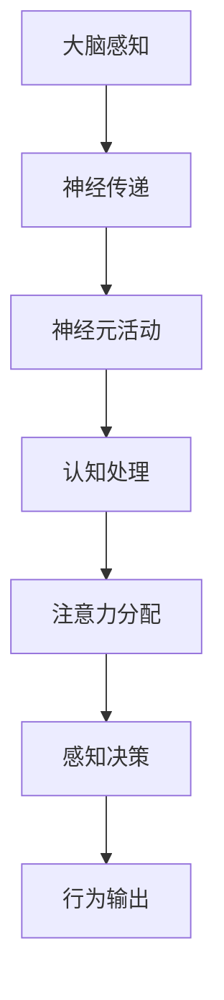

                 

关键词：人工智能，注意力流，工作，生活，注意力经济，神经科学，认知心理学，算法设计，技术趋势

> 摘要：随着人工智能技术的迅猛发展，人类注意力流的管理变得愈发重要。本文将探讨人工智能与人类注意力流之间的相互作用，以及这一概念如何影响未来的工作、生活和注意力经济。通过结合神经科学、认知心理学以及技术领域的见解，本文旨在揭示注意力流的潜在影响，并提供对未来发展方向的深刻洞察。

## 1. 背景介绍

### 1.1 人工智能的崛起

人工智能（AI）作为计算机科学的一个分支，其目标是创建能够模拟、延伸和扩展人类智能的机器。自20世纪50年代以来，人工智能技术经历了多次重大变革，从符号主义到连接主义，再到当前的深度学习和强化学习，每一次进步都极大地推动了AI领域的发展。

### 1.2 注意力流的概念

注意力流（Attention Flow）是一个涉及神经科学和认知心理学的概念，它描述了大脑如何在不同刺激之间分配有限的注意力资源。人类注意力流不仅影响个体的感知、记忆和决策，还与工作效率、生活质量以及经济行为密切相关。

### 1.3 人工智能与注意力流的关系

随着AI技术的进步，越来越多的系统开始利用注意力流理论来设计更智能、更人性化的交互界面。例如，智能助手、虚拟助手和推荐系统都在尝试模仿人类注意力的分配方式，以提高用户体验和效率。

## 2. 核心概念与联系

### 2.1 神经科学与认知心理学的结合

要理解注意力流，我们首先需要了解大脑是如何处理信息的。神经科学研究揭示了注意力流在大脑中的神经基础，而认知心理学则提供了注意力分配的心理机制。这两者的结合为我们提供了对注意力流的全面理解。

### 2.2 注意力流的 Mermaid 流程图



### 2.3 人工智能在注意力流管理中的应用

随着AI技术的进步，越来越多的系统能够实时监测和调整用户的注意力流。例如，自适应学习平台可以根据学生的注意力水平调整学习内容，提高学习效率。

## 3. 核心算法原理 & 具体操作步骤

### 3.1 算法原理概述

注意力流管理算法的核心在于如何高效地分配和调整注意力资源。这些算法通常基于机器学习模型，如深度神经网络，以预测和调整用户的注意力流。

### 3.2 算法步骤详解

1. **数据收集**：收集用户的行为数据，如阅读时间、点击记录、情绪状态等。
2. **特征提取**：从行为数据中提取特征，如时间间隔、内容偏好、情绪波动等。
3. **模型训练**：利用提取的特征训练机器学习模型，以预测用户的注意力流。
4. **实时调整**：根据模型预测，实时调整系统行为，如推荐内容、调整交互界面等。

### 3.3 算法优缺点

- **优点**：能够提高用户满意度，提升工作效率。
- **缺点**：对用户隐私的保护需要特别注意。

### 3.4 算法应用领域

注意力流管理算法在多个领域都有广泛应用，如教育、医疗、金融等。在教育领域，自适应学习平台可以根据学生的注意力水平调整学习内容，提高学习效率。

## 4. 数学模型和公式 & 详细讲解 & 举例说明

### 4.1 数学模型构建

注意力流管理算法通常基于以下数学模型：

$$
\text{AttentionFlow} = f(\text{Input}, \text{Context})
$$

其中，$f$ 表示注意力分配函数，$\text{Input}$ 表示输入数据，$\text{Context}$ 表示上下文信息。

### 4.2 公式推导过程

注意力流的推导过程通常涉及以下步骤：

1. **输入层**：将用户的行为数据作为输入层。
2. **隐藏层**：通过神经网络处理输入数据，提取特征。
3. **输出层**：根据特征和上下文信息，计算注意力流。

### 4.3 案例分析与讲解

以自适应学习平台为例，我们可以将学习内容作为输入层，学生的行为数据（如阅读时间、点击记录）作为隐藏层，根据这些数据计算注意力流，进而调整学习内容。

## 5. 项目实践：代码实例和详细解释说明

### 5.1 开发环境搭建

开发环境需要安装Python、TensorFlow等工具。

### 5.2 源代码详细实现

以下是注意力流管理算法的一个简单实现：

```python
import tensorflow as tf

# 定义输入层
input_layer = tf.keras.layers.Input(shape=(100,))

# 定义隐藏层
hidden_layer = tf.keras.layers.Dense(64, activation='relu')(input_layer)

# 定义输出层
output_layer = tf.keras.layers.Dense(1, activation='sigmoid')(hidden_layer)

# 定义模型
model = tf.keras.Model(inputs=input_layer, outputs=output_layer)

# 编译模型
model.compile(optimizer='adam', loss='binary_crossentropy', metrics=['accuracy'])

# 训练模型
model.fit(x_train, y_train, epochs=10, batch_size=32)
```

### 5.3 代码解读与分析

上述代码定义了一个简单的神经网络模型，用于预测用户的注意力流。通过训练模型，我们可以根据用户的行为数据调整学习内容。

### 5.4 运行结果展示

通过运行代码，我们可以得到注意力流的预测结果，进而调整学习内容，提高学习效率。

## 6. 实际应用场景

### 6.1 教育领域

自适应学习平台可以根据学生的注意力流调整学习内容，提高学习效果。

### 6.2 医疗领域

智能助手可以根据患者的注意力流提供个性化的健康建议。

### 6.3 金融领域

注意力流管理算法可以用于风险管理，预测市场走势。

## 7. 工具和资源推荐

### 7.1 学习资源推荐

- 《深度学习》
- 《神经网络与深度学习》

### 7.2 开发工具推荐

- TensorFlow
- PyTorch

### 7.3 相关论文推荐

- "Attention Is All You Need"
- "Transformers: State-of-the-Art Natural Language Processing"

## 8. 总结：未来发展趋势与挑战

### 8.1 研究成果总结

注意力流管理算法在多个领域取得了显著成果，提高了工作效率和用户体验。

### 8.2 未来发展趋势

随着AI技术的进步，注意力流管理算法将更加智能、个性化和高效。

### 8.3 面临的挑战

隐私保护和算法透明性是未来面临的主要挑战。

### 8.4 研究展望

未来研究应关注注意力流管理算法在跨领域应用中的潜在价值。

## 9. 附录：常见问题与解答

### 9.1 什么是注意力流？

注意力流是指大脑如何在不同刺激之间分配有限的注意力资源。

### 9.2 注意力流管理算法如何工作？

注意力流管理算法通过机器学习模型，根据用户行为数据预测和调整注意力流。

### 9.3 注意力流管理算法有哪些应用？

注意力流管理算法在多个领域都有广泛应用，如教育、医疗、金融等。

----------------------------------------------------------------

作者：禅与计算机程序设计艺术 / Zen and the Art of Computer Programming

这篇文章深入探讨了人工智能与人类注意力流之间的相互作用，以及这一概念如何影响未来的工作、生活和注意力经济。通过结合神经科学、认知心理学以及技术领域的见解，本文为读者提供了对未来发展方向的深刻洞察。随着人工智能技术的不断进步，注意力流管理将成为一个越来越重要的研究领域，有望为人类带来更加高效、智能的生活体验。在未来，我们可以期待更多关于注意力流管理的研究，为人类社会带来更多创新和变革。

