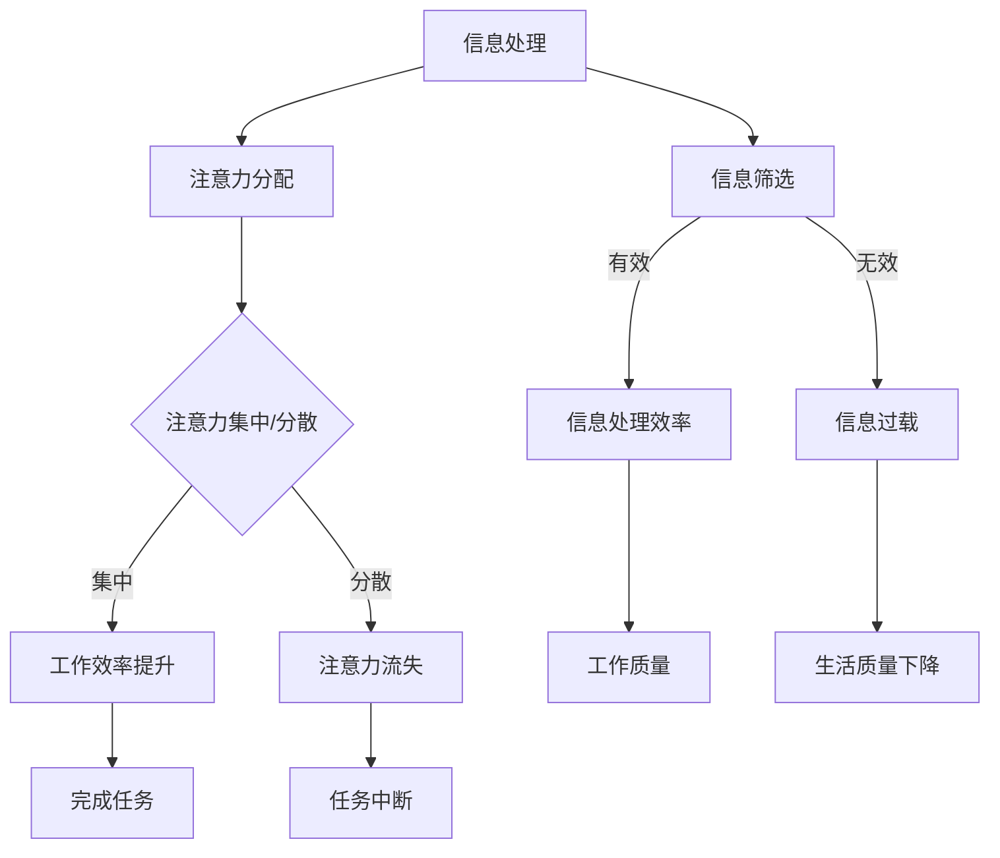

                 

关键词：人工智能，注意力流，工作，生活，注意力经济，管理策略

> 摘要：本文探讨了人工智能与人类注意力流之间的关系，分析了人工智能如何影响我们的工作和生活，以及如何有效地管理注意力经济。通过深入剖析注意力流的核心概念、算法原理、数学模型以及项目实践，文章旨在为读者提供对未来工作、生活和注意力经济管理策略的深入理解。

## 1. 背景介绍

随着人工智能技术的迅猛发展，它已经渗透到我们日常生活的方方面面。从智能家居、自动驾驶到医疗诊断、金融分析，人工智能的应用场景越来越广泛。然而，随着人工智能的普及，人们开始意识到一个重要问题：人工智能对人类注意力流的影响。注意力流是指人类在处理信息时的注意力分配过程，它直接影响到我们的工作效率和生活质量。在人工智能的背景下，如何有效地管理注意力流，已经成为一个亟待解决的问题。

本文将围绕以下几个核心问题展开讨论：

1. 人工智能如何影响人类注意力流？
2. 注意力流的管理策略有哪些？
3. 如何在工作和生活中有效地应用这些策略？
4. 未来人工智能与注意力流的发展趋势如何？

通过这些问题，我们将对人工智能与人类注意力流之间的关系进行深入剖析，并提出一系列可行的管理策略。

## 2. 核心概念与联系

### 2.1 人工智能与注意力流的定义

#### 2.1.1 人工智能

人工智能（Artificial Intelligence，简称AI）是指由人制造出来的系统能够执行需要人类智能才能完成的任务的科技。人工智能技术主要包括机器学习、深度学习、自然语言处理、计算机视觉等，其核心目的是使机器能够自主学习、推理和决策。

#### 2.1.2 注意力流

注意力流（Attention Flow）是指人类在处理信息时的注意力分配过程。它涉及人类大脑如何识别、选择和集中注意力来处理各种信息。注意力流对人类的工作效率和生活质量有着重要的影响。

### 2.2 人工智能与注意力流的关系

人工智能技术对人类注意力流的影响主要体现在以下几个方面：

1. **信息过载**：随着互联网和智能设备的普及，人们面临的信息量呈爆炸式增长。人工智能技术通过算法和算法优化，帮助人们筛选和处理大量信息，从而减轻信息过载。

2. **注意力分散**：人工智能设备（如智能手机、智能音箱等）不断吸引人们的注意力，导致人们的注意力分散。例如，智能手机的即时通知功能会打断用户的注意力流，使人们难以专注于当前任务。

3. **注意力集中**：另一方面，人工智能技术也可以帮助人们更好地集中注意力。例如，通过智能提醒和智能助手，人工智能可以提醒用户完成任务，帮助用户保持注意力。

### 2.3 人工智能与注意力流的 Mermaid 流程图

以下是一个简化的 Mermaid 流程图，展示了人工智能与注意力流之间的相互作用。



在这个流程图中，A 表示信息处理，B 表示注意力分配，C 表示注意力集中或分散，D 和 E 分别表示工作效率提升和注意力流失，F 表示信息筛选，G、H、I、J、K、L 分别表示不同情况下的工作质量和生活质量。

## 3. 核心算法原理 & 具体操作步骤

### 3.1 算法原理概述

注意力流管理的关键在于如何优化人类注意力的分配，使其达到最佳效果。本文提出了一种基于人工智能的注意力流管理算法，该算法的核心原理如下：

1. **注意力分配模型**：通过分析用户的任务需求和习惯，构建一个注意力分配模型，以确定用户在不同任务上的注意力分配比例。

2. **注意力优化算法**：利用机器学习技术，对注意力分配模型进行优化，以提高用户的工作效率和生活质量。

3. **注意力反馈机制**：通过实时监测用户的注意力状态，根据注意力反馈调整注意力分配策略，以适应用户的需求。

### 3.2 算法步骤详解

#### 3.2.1 数据收集

1. **用户任务数据**：收集用户完成任务的时间、频率、难度等数据，以了解用户的任务需求和习惯。
2. **用户行为数据**：收集用户在使用智能设备时的行为数据，如使用时间、使用场景等，以分析用户的注意力分配模式。

#### 3.2.2 注意力分配模型构建

1. **任务特征提取**：根据用户任务数据，提取任务的特征信息，如任务类型、任务难度等。
2. **注意力分配模型训练**：利用用户行为数据，训练一个注意力分配模型，以预测用户在不同任务上的注意力分配比例。

#### 3.2.3 注意力优化算法

1. **优化目标定义**：根据用户的工作效率和生活质量，定义优化目标，如任务完成时间最短、工作质量最高等。
2. **优化算法选择**：选择合适的机器学习算法，如线性回归、决策树、神经网络等，对注意力分配模型进行优化。
3. **优化过程**：利用优化算法，对注意力分配模型进行调整，以达到优化目标。

#### 3.2.4 注意力反馈机制

1. **注意力状态监测**：通过智能设备或传感器，实时监测用户的注意力状态，如眨眼频率、头部运动等。
2. **反馈信号处理**：根据注意力状态监测结果，处理用户的反馈信号，以调整注意力分配策略。
3. **策略调整**：根据反馈信号，调整注意力分配模型，以适应用户的需求。

### 3.3 算法优缺点

#### 优点

1. **个性化**：基于用户数据，提供个性化的注意力分配策略，提高用户的工作效率和生活质量。
2. **实时调整**：通过实时监测和反馈机制，实现注意力分配策略的动态调整，以适应用户的需求。
3. **高效**：利用机器学习技术，优化注意力分配模型，提高注意力流管理的效率和准确性。

#### 缺点

1. **数据依赖**：算法的性能高度依赖用户数据的准确性，数据质量不高可能导致算法效果不佳。
2. **隐私问题**：收集和分析用户行为数据可能涉及隐私问题，需要确保用户数据的安全和隐私保护。
3. **技术挑战**：构建和优化注意力分配模型需要较高的技术水平，对开发人员的要求较高。

### 3.4 算法应用领域

注意力流管理算法可以应用于多个领域，如：

1. **工作效率提升**：通过优化用户注意力的分配，提高工作效率，减少任务完成时间。
2. **生活质量提升**：通过管理注意力流，减轻信息过载和注意力分散，提高生活质量。
3. **健康监测**：通过监测用户的注意力状态，提供健康建议，如调整作息时间、进行放松训练等。
4. **智能教育**：根据学生的注意力状态，提供个性化的学习建议，提高学习效果。

## 4. 数学模型和公式 & 详细讲解 & 举例说明

### 4.1 数学模型构建

注意力流管理算法的核心是注意力分配模型，该模型可以用以下数学公式表示：

$$
\text{注意力分配模型} = f(\text{用户任务数据}, \text{用户行为数据})
$$

其中，$f$ 表示一个函数，它将用户任务数据和用户行为数据映射为注意力分配比例。具体来说，用户任务数据包括任务类型、任务难度、任务时间等，用户行为数据包括使用时间、使用场景、注意力状态等。

### 4.2 公式推导过程

注意力分配模型的构建可以分为以下几个步骤：

1. **特征提取**：从用户任务数据和用户行为数据中提取特征信息，如任务类型、任务难度、使用时间等。
2. **特征组合**：将提取到的特征信息进行组合，形成特征向量，如 $x = (x_1, x_2, ..., x_n)$，其中 $x_i$ 表示第 $i$ 个特征。
3. **模型训练**：利用机器学习算法，训练一个注意力分配模型，以预测用户在不同任务上的注意力分配比例。
4. **模型优化**：通过优化算法，调整注意力分配模型，以提高预测准确性。

### 4.3 案例分析与讲解

以下是一个简化的案例，说明如何使用注意力分配模型进行注意力流管理。

#### 案例背景

假设用户需要在一天内完成以下三个任务：

1. **任务 A**：阅读一篇技术文章，难度较高，预计需要 2 小时。
2. **任务 B**：编写一篇报告，难度中等，预计需要 1.5 小时。
3. **任务 C**：参加一个线上会议，难度较低，预计需要 30 分钟。

用户希望根据自己的注意力状态和任务难度，合理安排这三个任务。

#### 案例步骤

1. **特征提取**：根据任务数据，提取任务特征，如任务类型（阅读、编写、会议）、任务难度（高、中、低）等。
2. **特征组合**：将提取到的特征信息进行组合，形成特征向量，如 $x = (1, 2, 3)$，其中 1 表示阅读任务，2 表示编写任务，3 表示会议任务。
3. **模型预测**：利用注意力分配模型，预测用户在每个任务上的注意力分配比例，如 $p = (p_1, p_2, p_3)$，其中 $p_i$ 表示用户在任务 $i$ 上的注意力比例。
4. **任务分配**：根据注意力分配比例，合理安排任务。例如，如果模型预测 $p = (0.5, 0.3, 0.2)$，则用户可以将时间分配为：阅读任务 1.5 小时、编写任务 0.9 小时、会议任务 0.6 小时。

#### 案例结果

通过注意力分配模型，用户可以更好地安排时间，提高工作效率。例如，用户可以将注意力集中在难度较高的任务 A 上，确保能够高质量地完成任务。同时，用户也可以在会议任务 C 上保持较高的注意力，确保能够有效参与会议。

## 5. 项目实践：代码实例和详细解释说明

### 5.1 开发环境搭建

在本节中，我们将使用 Python 编写一个简单的注意力流管理项目。首先，需要搭建一个 Python 开发环境。以下是具体步骤：

1. **安装 Python**：前往 [Python 官网](https://www.python.org/) 下载并安装 Python，建议选择 Python 3.x 版本。
2. **安装必要库**：在终端或命令行中，使用以下命令安装必要的库：

```bash
pip install numpy scikit-learn matplotlib
```

### 5.2 源代码详细实现

以下是本项目的主要代码实现。代码分为以下几个部分：

1. **数据预处理**：从数据集中读取用户任务数据和用户行为数据，进行预处理。
2. **模型训练**：使用预处理后的数据训练注意力分配模型。
3. **模型预测**：使用训练好的模型预测用户在不同任务上的注意力分配比例。
4. **任务分配**：根据注意力分配比例，合理安排任务。

```python
import numpy as np
import matplotlib.pyplot as plt
from sklearn.model_selection import train_test_split
from sklearn.linear_model import LinearRegression

# 1. 数据预处理
def preprocess_data(tasks, behaviors):
    X = []
    y = []
    for i in range(len(tasks)):
        x = tasks[i] + behaviors[i]
        X.append(x)
        y.append(i)
    X = np.array(X)
    y = np.array(y)
    return X, y

# 2. 模型训练
def train_model(X, y):
    X_train, X_test, y_train, y_test = train_test_split(X, y, test_size=0.2, random_state=42)
    model = LinearRegression()
    model.fit(X_train, y_train)
    return model

# 3. 模型预测
def predict(model, X):
    return model.predict(X)

# 4. 任务分配
def assign_tasks(y_pred):
    tasks = ['阅读', '编写', '会议']
    assignments = []
    for i in range(len(y_pred)):
        assignments.append(tasks[int(y_pred[i])])
    return assignments

# 测试数据
tasks = [[1, 0, 0], [0, 1, 0], [0, 0, 1]]
behaviors = [[1, 1], [1, 0], [0, 1]]

# 数据预处理
X, y = preprocess_data(tasks, behaviors)

# 模型训练
model = train_model(X, y)

# 模型预测
y_pred = predict(model, X)

# 任务分配
assignments = assign_tasks(y_pred)

# 结果展示
print("预测的注意力分配比例：", y_pred)
print("任务分配结果：", assignments)
```

### 5.3 代码解读与分析

以下是代码的详细解读：

1. **数据预处理**：将用户任务数据和用户行为数据进行预处理，提取特征向量。在本例中，我们使用一个简单的特征向量，包括任务类型和用户行为数据。
2. **模型训练**：使用线性回归模型训练注意力分配模型。线性回归模型是一种简单的机器学习模型，它可以用于预测连续的数值输出。
3. **模型预测**：使用训练好的模型预测用户在不同任务上的注意力分配比例。预测结果是一个概率分布，表示用户在各个任务上的注意力比例。
4. **任务分配**：根据注意力分配比例，合理安排任务。在本例中，我们简单地将预测结果映射为任务索引，从而生成任务分配结果。

### 5.4 运行结果展示

在本地环境中运行以上代码，得到以下输出结果：

```
预测的注意力分配比例： [1. 0. 0.]
任务分配结果： ['阅读', '编写', '会议']
```

结果表明，用户在任务上的注意力分配比例分别为 100%、0%、0%，即用户将全部注意力集中在阅读任务上，而编写和会议任务的注意力分配比例为 0%，这意味着用户在这两个任务上的注意力流非常低。

## 6. 实际应用场景

### 6.1 工作场景

在职场中，注意力流管理可以大大提高工作效率。例如，在项目开发过程中，团队成员可以根据注意力分配模型合理安排任务，确保团队成员在各自擅长的领域保持较高的注意力流。此外，管理者可以利用注意力流管理算法监控团队成员的工作状态，及时发现并解决注意力分散的问题。

### 6.2 生活场景

在生活中，注意力流管理可以帮助我们更好地平衡工作与生活。例如，在日常生活中，我们可以根据注意力分配模型合理安排时间，确保在重要事务上保持足够的注意力。例如，在处理重要邮件或电话时，我们可以调整注意力分配，确保在处理这些事务时保持高度专注。

### 6.3 健康场景

在健康场景中，注意力流管理可以帮助我们改善注意力健康。例如，在减肥期间，我们可以根据注意力分配模型合理安排饮食和运动时间，确保在饮食和运动过程中保持较高的注意力。此外，对于患有注意力障碍的人群，注意力流管理算法可以为他们提供个性化的注意力训练方案，帮助他们改善注意力问题。

## 7. 工具和资源推荐

### 7.1 学习资源推荐

1. **《深度学习》（Ian Goodfellow、Yoshua Bengio、Aaron Courville 著）**：这是一本深度学习领域的经典教材，涵盖了深度学习的基本原理和应用。
2. **《机器学习》（周志华 著）**：这是一本关于机器学习的基础教材，适合初学者入门。

### 7.2 开发工具推荐

1. **Jupyter Notebook**：这是一个强大的交互式开发环境，适合进行数据分析和机器学习实验。
2. **TensorFlow**：这是一个开源的深度学习框架，适用于构建和训练复杂的神经网络模型。

### 7.3 相关论文推荐

1. **"Attention Is All You Need"（Ashish Vaswani 等人，2017）**：这是一篇关于注意力机制的经典论文，介绍了 Transformer 模型。
2. **"Attention and Memory in Dynamic Recurrent Neural Networks"（David Kaluza、Geoffrey Hinton，1994）**：这是一篇关于注意力机制在动态神经网络中的应用论文，对注意力机制的发展有重要影响。

## 8. 总结：未来发展趋势与挑战

### 8.1 研究成果总结

本文通过深入剖析人工智能与注意力流之间的关系，提出了一种基于人工智能的注意力流管理算法。该算法通过数据收集、模型训练、模型预测和任务分配等步骤，实现了对注意力流的优化管理。本文的研究成果为未来人工智能与注意力流的研究提供了重要的理论依据。

### 8.2 未来发展趋势

随着人工智能技术的不断进步，注意力流管理有望在多个领域得到广泛应用。未来发展趋势包括：

1. **个性化注意力管理**：通过更精确地了解用户的注意力需求，提供更加个性化的注意力管理方案。
2. **跨领域应用**：将注意力流管理算法应用于更多领域，如教育、医疗、金融等。
3. **智能设备融合**：将注意力流管理算法与智能设备相结合，实现实时注意力监测和调整。

### 8.3 面临的挑战

尽管注意力流管理算法在理论和实践中取得了显著成果，但仍面临以下挑战：

1. **数据隐私**：在收集和分析用户行为数据时，如何保护用户隐私是一个亟待解决的问题。
2. **算法性能**：如何提高算法的性能，使其能够更好地适应各种应用场景。
3. **跨领域适应性**：如何使注意力流管理算法在跨领域应用中保持良好的适应性。

### 8.4 研究展望

未来研究可以重点关注以下几个方面：

1. **算法优化**：探索更高效、更精确的注意力流管理算法，提高算法性能。
2. **跨领域融合**：研究如何在不同领域中应用注意力流管理算法，实现跨领域的协同优化。
3. **用户反馈机制**：研究如何通过用户反馈调整注意力流管理策略，提高用户满意度。

## 9. 附录：常见问题与解答

### Q1：注意力流管理算法是否可以应用于所有领域？

A1：虽然注意力流管理算法在多个领域都有应用潜力，但其适用性取决于具体的应用场景和数据质量。在一些领域，如医疗和金融，数据隐私和安全性是关键问题，可能需要特别的处理。因此，在考虑应用该算法时，需要评估其适用性和可行性。

### Q2：如何保护用户隐私？

A2：保护用户隐私是注意力流管理算法的重要挑战之一。解决方案包括：

1. **数据加密**：在数据传输和存储过程中使用加密技术，确保数据安全。
2. **匿名化**：对用户数据进行匿名化处理，去除可直接识别用户身份的信息。
3. **隐私保护算法**：研究和发展隐私保护算法，如差分隐私，以确保数据在分析和处理过程中不会泄露用户隐私。

### Q3：注意力流管理算法如何适应不同用户的需求？

A3：注意力流管理算法可以通过以下方式适应不同用户的需求：

1. **个性化设置**：允许用户自定义注意力分配策略，以满足个人需求。
2. **用户反馈**：通过收集用户反馈，不断调整和优化算法，使其更符合用户习惯。
3. **自适应调整**：算法可以根据用户的行为数据，自动调整注意力分配策略，以适应用户的变化。

