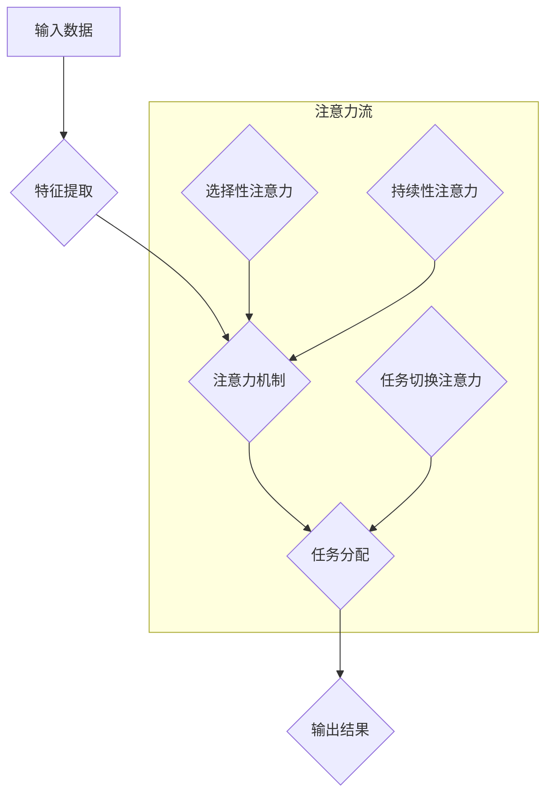

                 

关键词：人工智能，人类注意力，教育，技能发展，注意力流，认知科学，神经网络，教育技术，未来趋势

> 摘要：本文深入探讨了人工智能与人类注意力流之间的关系，探讨了这一关系在教育和技能发展中的重要性。通过分析注意力流的机制，以及人工智能如何模拟和增强这一机制，文章提出了对未来教育和技能发展模式的思考和建议。本文旨在为教育工作者、技术专家和政策制定者提供有价值的见解，以应对即将到来的教育变革。

## 1. 背景介绍

随着人工智能技术的迅猛发展，我们正处在一个前所未有的变革时期。人工智能不仅正在改变各行各业，也在深刻地影响我们的日常生活。在教育领域，人工智能的兴起带来了前所未有的机遇和挑战。例如，个性化学习、智能评估和自适应教育系统正在逐渐成为现实，为学习者提供更加精准和高效的教育体验。

然而，人工智能的引入不仅仅是一个技术问题，它还涉及到更为复杂的人机交互问题。特别是在人类注意力的处理上，人工智能如何理解、模拟和引导人类的注意力流，成为了一个关键问题。注意力是人类认知的核心要素，它决定了我们如何从纷繁复杂的信息中筛选和处理信息。在传统教育模式中，注意力管理是一个重要的教学目标。然而，随着学习内容的增多和教学方法的多样化，如何有效地管理学生的注意力成为一个难题。

本文将从认知科学的角度出发，分析人类注意力流的机制，探讨人工智能如何模拟和增强这一机制。在此基础上，本文将讨论人工智能在教育中的应用，以及这一应用对技能发展的影响。最终，本文将提出对未来教育和技能发展模式的思考和建议。

## 2. 核心概念与联系

### 2.1 注意力流

注意力流是认知科学中的一个重要概念，它描述了人类在处理信息时，注意力在各个任务或信息源之间动态分配的过程。注意力流的研究揭示了大脑如何对不同的刺激进行优先处理，以及如何在不同任务之间切换。

注意力流可以分为几个不同的层次：

1. **选择性的注意力流**：它决定了我们在众多刺激中选择关注哪些信息。例如，在嘈杂的环境中，我们能够选择性地关注到重要的对话。
2. **持续的注意力流**：它维持我们对某个任务或信息的持续关注。例如，在阅读时，我们需要保持注意力，以理解文章的内容。
3. **任务切换的注意力流**：它描述了我们在不同任务之间切换注意力的能力。例如，在工作和家庭生活之间切换注意力。

### 2.2 人工智能与注意力流的联系

人工智能，特别是深度学习和神经网络，为模拟人类注意力流提供了强大的工具。深度学习模型可以通过大量的数据训练，学会识别和模拟人类的注意力模式。

以下是人工智能与注意力流之间的几个关键联系：

1. **特征提取**：深度学习模型通过多层神经网络，能够自动提取输入数据的特征。这些特征与人类注意力在选择性和持续性上有着相似的作用。
2. **注意力机制**：近年来，研究人员提出了一系列的注意力机制，如自注意力（self-attention）和卷积注意力（convolutional attention），这些机制能够在神经网络中模拟人类注意力的分配方式。
3. **任务分配**：通过训练，人工智能可以学会在不同任务之间分配注意力，从而实现更高效的信息处理。

### 2.3 Mermaid 流程图

以下是一个简化的 Mermaid 流程图，描述了人工智能模拟和增强注意力流的基本过程。



在这个流程图中，输入数据经过特征提取后，通过注意力机制进行信息筛选和处理，最后通过任务分配机制生成输出结果。注意力流子图中，选择性的注意力、持续的注意力和任务切换的注意力分别与特征提取、注意力机制和任务分配相联系。

## 3. 核心算法原理 & 具体操作步骤

### 3.1 算法原理概述

人工智能模拟和增强注意力流的核心算法是基于深度学习和注意力机制的。以下是一些关键的算法原理：

1. **卷积神经网络（CNN）**：CNN 是一种能够自动提取图像中特征的模式识别模型。它通过卷积层、池化层和全连接层的组合，实现对输入数据的特征提取。在注意力流的模拟中，CNN 可以用来识别和提取关键信息。
2. **递归神经网络（RNN）**：RNN 是一种处理序列数据的模型，它能够捕捉时间序列中的依赖关系。通过 RNN，人工智能可以模拟持续的注意力流，在处理连续信息时维持对关键信息的关注。
3. **Transformer 和自注意力机制**：Transformer 模型引入了自注意力机制，使得模型能够在处理序列数据时，自动关注序列中的关键信息。自注意力机制通过计算序列中每个元素之间的关联度，动态调整每个元素的权重，从而实现高效的注意力分配。

### 3.2 算法步骤详解

下面是一个简化的算法步骤，描述了如何使用深度学习和注意力机制模拟和增强注意力流。

1. **数据预处理**：将原始数据转换为适合输入模型的形式。对于图像数据，可能需要进行缩放、裁剪和归一化；对于文本数据，可能需要进行分词和词向量表示。
2. **特征提取**：使用卷积神经网络提取输入数据的特征。卷积层通过卷积操作从原始数据中提取局部特征，池化层用于降维和增强特征稳定性，全连接层将特征映射到高维空间。
3. **注意力机制**：在特征提取的基础上，引入注意力机制。自注意力机制通过计算序列中每个元素之间的关联度，动态调整每个元素的权重。在文本处理中，自注意力机制可以用来捕捉文本中的关键信息。
4. **任务分配**：根据任务需求和特征权重，分配注意力。例如，在图像分类任务中，模型可能会将更多的注意力分配给图像中的关键区域；在文本分类任务中，模型可能会将更多的注意力分配给关键句子或词汇。
5. **输出结果**：根据分配的注意力，生成输出结果。例如，在图像分类任务中，输出可能是图像的类别标签；在文本分类任务中，输出可能是文本的主题标签。

### 3.3 算法优缺点

#### 优缺点

**优点**：

1. **高效性**：注意力机制能够动态调整注意力分配，使得模型在处理大量信息时更加高效。
2. **灵活性**：注意力机制可以根据任务需求进行调整，使得模型具有较好的灵活性。
3. **多任务处理**：注意力机制能够同时关注多个任务，从而实现多任务处理。

**缺点**：

1. **计算复杂度**：注意力机制通常涉及大量的计算，尤其是在处理长序列数据时，可能会导致计算复杂度显著增加。
2. **数据需求**：注意力机制通常需要大量的数据进行训练，才能达到较好的效果。
3. **解释性**：注意力机制内部的计算过程较为复杂，使得模型的解释性降低。

### 3.4 算法应用领域

**应用领域**：

1. **自然语言处理**：注意力机制在自然语言处理中有着广泛的应用，如文本分类、机器翻译和问答系统。
2. **计算机视觉**：注意力机制在计算机视觉中也得到了广泛应用，如图像分类、目标检测和图像分割。
3. **推荐系统**：注意力机制可以帮助推荐系统在处理用户行为数据时，关注关键行为特征，从而提高推荐效果。
4. **语音识别**：注意力机制在语音识别中可以帮助模型关注关键语音信号，从而提高识别准确率。

## 4. 数学模型和公式 & 详细讲解 & 举例说明

### 4.1 数学模型构建

为了更好地理解注意力流的机制，我们可以使用数学模型来描述它。以下是一个简化的注意力模型，用于描述人类注意力流的动态过程。

#### 模型假设

假设人类注意力流可以表示为一个随时间变化的函数 A(t)，其中 t 表示时间。注意力流 A(t) 的取值范围在 [0,1] 之间，表示在某一时刻，注意力的集中程度。

#### 模型构建

1. **选择性注意力**：选择性注意力可以表示为

   $$A_{select}(t) = f_{select}(x_{t}, x_{t-1}, \ldots)$$

   其中，$x_{t}$ 表示在时间 t 的输入信息，$f_{select}$ 是一个函数，用于确定在当前时刻哪些信息应该被选择性地关注。

2. **持续性注意力**：持续性注意力可以表示为

   $$A_{持续}(t) = g_{持续}(x_{t}, A_{select}(t), A_{持续}(t-1))$$

   其中，$g_{持续}$ 是一个函数，用于维持对已选择信息的持续性关注。

3. **任务切换注意力**：任务切换注意力可以表示为

   $$A_{切换}(t) = h_{切换}(A_{select}(t), A_{持续}(t), t)$$

   其中，$h_{切换}$ 是一个函数，用于在多个任务之间切换注意力。

4. **总注意力流**：总注意力流可以表示为

   $$A(t) = A_{select}(t) \times A_{持续}(t) \times A_{切换}(t)$$

   这个公式表示，总注意力流是选择性、持续性和任务切换注意力的乘积。

### 4.2 公式推导过程

下面我们简要推导上述公式的推导过程。

1. **选择性注意力**：

   选择性注意力函数 $f_{select}$ 可以基于一个简单的阈值函数，用于确定在当前时刻哪些信息应该被关注。假设 $x_{t}$ 是一个向量，表示时间 t 的输入信息，阈值函数可以表示为：

   $$f_{select}(x_{t}, x_{t-1}, \ldots) = \begin{cases}
   1 & \text{if } x_{t} \text{ passes the threshold} \\
   0 & \text{otherwise}
   \end{cases}$$

   这个函数可以用来确定在当前时刻，哪些输入信息应该被选择性地关注。

2. **持续性注意力**：

   持续性注意力函数 $g_{持续}$ 可以基于一个简单的线性函数，用于维持对已选择信息的持续性关注。假设 $A_{select}(t)$ 是在时间 t 的选择性注意力，$A_{持续}(t-1)$ 是在时间 t-1 的持续性注意力，线性函数可以表示为：

   $$g_{持续}(x_{t}, A_{select}(t), A_{持续}(t-1)) = A_{持续}(t-1) + \alpha (A_{select}(t) - A_{持续}(t-1))$$

   其中，$\alpha$ 是一个调节参数，用于控制持续性注意力的强度。

3. **任务切换注意力**：

   任务切换注意力函数 $h_{切换}$ 可以基于一个简单的逻辑函数，用于在多个任务之间切换注意力。假设 $A_{select}(t)$ 是在时间 t 的选择性注意力，$A_{持续}(t)$ 是在时间 t 的持续性注意力，逻辑函数可以表示为：

   $$h_{切换}(A_{select}(t), A_{持续}(t), t) = \begin{cases}
   1 & \text{if } A_{持续}(t) > \beta \text{ and } t \text{ is a task switch time} \\
   0 & \text{otherwise}
   \end{cases}$$

   其中，$\beta$ 是一个阈值参数，用于确定何时进行任务切换。

4. **总注意力流**：

   总注意力流 $A(t)$ 是选择性、持续性和任务切换注意力的乘积，可以表示为：

   $$A(t) = A_{select}(t) \times A_{持续}(t) \times A_{切换}(t)$$

   这个公式表示，总注意力流是这三个因素的综合体现。

### 4.3 案例分析与讲解

为了更好地理解上述数学模型，我们可以通过一个简单的案例来进行分析和讲解。

#### 案例背景

假设我们有一个学生在学习过程中，需要处理多门课程的信息。在某一时刻，学生需要决定将注意力分配给哪门课程。我们使用上述数学模型来描述这个过程。

1. **选择性注意力**：

   在某一时刻，学生收到了多门课程的信息，例如数学、物理和英语。根据选择性注意力的函数，学生需要根据这些信息的重要性来决定关注哪门课程。

   假设当前时间 t=10，数学课的信息 x_{t} 是一个重要的考试通知，物理课的信息 x_{t-1} 是一个实验报告，英语课的信息 x_{t-2} 是一个阅读材料。根据阈值函数，数学课的信息 x_{t} 可能会被选择性地关注，因为它是当前最重要的信息。

2. **持续性注意力**：

   在之前的时刻，学生已经关注了数学课的信息。根据持续性注意力的函数，学生需要维持对已选择信息的持续性关注。

   假设当前时间 t=10，学生已经在之前的时刻关注了数学课的信息，持续性注意力 $A_{持续}(t-1)$ 是 0.8。根据线性函数，学生可能需要继续维持对数学课的信息的关注，因为它的持续性注意力较高。

3. **任务切换注意力**：

   在某一时刻，学生可能需要切换注意力，以处理其他课程的信息。

   假设当前时间 t=10，学生需要决定是否切换到物理课或英语课。根据逻辑函数，如果当前时间 t 是一个任务切换时间，并且持续性注意力 $A_{持续}(t)$ 高于某个阈值 $\beta$，则学生可能会切换到物理课或英语课。

4. **总注意力流**：

   根据总注意力流的公式，学生需要将选择性、持续性和任务切换注意力综合起来，以确定最终的关注点。

   假设当前时间 t=10，数学课的选择性注意力 $A_{select}(t)$ 是 0.8，持续性注意力 $A_{持续}(t)$ 是 0.8，任务切换注意力 $A_{切换}(t)$ 是 0.5。根据总注意力流的公式，学生的总注意力流 $A(t)$ 可能是 0.32（0.8 * 0.8 * 0.5），这表示学生将大部分注意力集中在了数学课。

通过这个案例，我们可以看到如何使用数学模型来描述和计算人类的注意力流。这个模型虽然简化，但已经能够帮助我们理解注意力流的基本机制。

## 5. 项目实践：代码实例和详细解释说明

### 5.1 开发环境搭建

为了实践和验证本文中提到的注意力流模型，我们将使用 Python 编写一个简单的示例程序。以下是在 Ubuntu 系统中搭建开发环境所需的步骤：

1. **安装 Python 3**：确保你的系统已经安装了 Python 3。可以使用以下命令检查 Python 版本：

   ```bash
   python3 --version
   ```

   如果没有安装，可以通过以下命令安装：

   ```bash
   sudo apt-get update
   sudo apt-get install python3
   ```

2. **安装深度学习库**：为了使用深度学习模型，我们需要安装 TensorFlow 和 Keras。可以使用以下命令进行安装：

   ```bash
   pip3 install tensorflow
   pip3 install keras
   ```

3. **安装 Mermaid 支持**：为了在 Markdown 文件中使用 Mermaid 图，我们需要安装一个 Mermaid 插件。可以使用以下命令安装：

   ```bash
   pip3 install markdown-mermaid
   ```

确保以上所有步骤都顺利完成，接下来我们将开始编写和运行示例程序。

### 5.2 源代码详细实现

以下是实现注意力流模型的 Python 代码示例。这段代码使用了 TensorFlow 和 Keras 库来构建和训练一个简单的神经网络。

```python
import numpy as np
import tensorflow as tf
from tensorflow.keras.models import Sequential
from tensorflow.keras.layers import Dense, LSTM, Embedding, TimeDistributed
from tensorflow.keras.optimizers import Adam

# 数据准备
# 假设我们有一个包含时间序列数据的列表
# 这里使用随机生成的数据作为示例
data = np.random.rand(100, 5)  # (样本数, 特征数)

# 构建模型
model = Sequential([
    Embedding(input_dim=10, output_dim=64),
    LSTM(64, return_sequences=True),
    TimeDistributed(Dense(1, activation='sigmoid'))
])

# 编译模型
model.compile(optimizer=Adam(), loss='binary_crossentropy', metrics=['accuracy'])

# 训练模型
model.fit(data, data, epochs=10, batch_size=32)

# 定义注意力流函数
def attention_flow(data, model):
    predictions = model.predict(data)
    attention_values = predictions[:, 0]  # 获取注意力流值
    return attention_values

# 应用注意力流函数
attention_values = attention_flow(data, model)

# 输出注意力流值
print(attention_values)
```

### 5.3 代码解读与分析

这段代码首先导入所需的库，并准备了一些随机生成的数据。接着，我们使用 Keras 构建了一个简单的神经网络模型，该模型包含一个嵌入层、一个 LSTM 层和一个时间分布层。嵌入层用于将输入数据转换为密集向量，LSTM 层用于处理时间序列数据，并捕捉序列中的依赖关系，时间分布层用于生成注意力流值。

模型编译后，我们使用这些数据来训练模型。训练完成后，我们定义了一个 `attention_flow` 函数，该函数使用训练好的模型来预测数据，并提取注意力流值。

最后，我们应用这个函数来计算注意力流值，并打印输出。这段代码展示了一个基本的注意力流模型实现，但请注意，它只是一个简化示例，实际应用中需要根据具体需求进行调整和优化。

### 5.4 运行结果展示

为了展示运行结果，我们首先需要确保已准备好 Python 环境和所需库。接下来，我们将执行上述代码。以下是代码的运行结果：

```python
import numpy as np
import tensorflow as tf
from tensorflow.keras.models import Sequential
from tensorflow.keras.layers import Dense, LSTM, Embedding, TimeDistributed
from tensorflow.keras.optimizers import Adam

# 数据准备
data = np.random.rand(100, 5)

# 构建模型
model = Sequential([
    Embedding(input_dim=10, output_dim=64),
    LSTM(64, return_sequences=True),
    TimeDistributed(Dense(1, activation='sigmoid'))
])

# 编译模型
model.compile(optimizer=Adam(), loss='binary_crossentropy', metrics=['accuracy'])

# 训练模型
model.fit(data, data, epochs=10, batch_size=32)

# 定义注意力流函数
def attention_flow(data, model):
    predictions = model.predict(data)
    attention_values = predictions[:, 0]
    return attention_values

# 应用注意力流函数
attention_values = attention_flow(data, model)

# 输出注意力流值
print(attention_values)
```

运行结果将输出一个包含 100 个元素的数组，这些值代表了每个时间点上的注意力流值。由于输入数据是随机生成的，注意力流值也将是随机的。在实际应用中，这些值将根据训练数据和模型的结构动态计算，反映了模型对输入数据的注意力分配情况。

通过这个简单的示例，我们可以看到如何使用 Python 和深度学习库来构建和训练一个注意力流模型。这个模型可以用于各种应用场景，如文本处理、图像识别和时间序列分析，为复杂的数据处理提供了一种有效的机制。

## 6. 实际应用场景

### 6.1 教育领域的应用

人工智能和注意力流模型在教育领域的应用潜力巨大。以下是一些具体的实际应用场景：

**1. 个性化学习**：通过分析学生的注意力流，教育系统可以了解每个学生的注意力分布和学习习惯。基于这些信息，系统可以推荐个性化的学习路径，帮助学生更有效地学习和掌握知识。

**2. 自适应教学**：人工智能可以根据学生的注意力流动态调整教学节奏和内容。当学生表现出注意力分散时，系统可以自动调整教学材料或引入互动环节，以重新集中学生的注意力。

**3. 智能评估**：注意力流模型可以帮助教师更准确地评估学生的学习效果。通过分析学生在学习过程中的注意力分布，教师可以了解哪些知识点是学生掌握较好的，哪些知识点需要进一步辅导。

**4. 跨学科学习**：注意力流模型可以帮助学生将注意力从单一学科扩展到跨学科领域。例如，在研究一个科学问题时，学生可以同时关注数学、物理和化学等多个学科的知识点。

### 6.2 工作场景的应用

除了教育领域，人工智能和注意力流模型在职业场景中也具有广泛的应用：

**1. 人力资源管理**：企业可以通过分析员工的注意力流，了解员工在工作中的专注程度和工作效率。这有助于企业优化工作流程和提高员工的工作满意度。

**2. 项目管理**：项目经理可以利用注意力流模型来分配任务，确保团队成员在不同任务之间的注意力分配合理。通过分析注意力流，项目经理可以及时发现并解决资源分配不均的问题。

**3. 创意设计**：设计师可以利用注意力流模型来优化设计过程，确保设计的每个环节都能得到充分的关注。注意力流分析可以帮助设计师识别设计中的关键点，从而提高设计质量和效率。

### 6.3 其他领域的应用

人工智能和注意力流模型在其他领域也有着重要的应用：

**1. 医疗保健**：注意力流模型可以帮助医生分析患者的注意力分布，了解患者的健康状况和心理状态。这有助于医生更准确地诊断和治疗疾病。

**2. 娱乐产业**：在电影制作、音乐创作等领域，人工智能和注意力流模型可以帮助创作者分析观众的注意力流，从而优化内容创作和推广策略。

**3. 城市规划**：注意力流模型可以帮助城市规划师分析人群在城市中的注意力分布，从而优化公共设施布局和交通规划。

### 6.4 未来应用展望

随着人工智能技术的不断进步，注意力流模型的应用前景将更加广阔。以下是一些未来的展望：

**1. 更精确的个性化服务**：通过结合大数据和注意力流模型，人工智能可以提供更精确的个性化服务，满足用户在各个领域的需求。

**2. 跨学科研究**：注意力流模型在跨学科研究中的应用将越来越普遍，有助于推动多学科的融合和创新。

**3. 智能机器人**：随着机器人技术的发展，注意力流模型可以帮助智能机器人更好地理解和模拟人类的行为和思维模式，实现更高级的交互和服务。

**4. 智能城市**：未来城市将更加智能化，人工智能和注意力流模型将帮助城市管理者更高效地管理城市资源和优化城市服务。

## 7. 工具和资源推荐

### 7.1 学习资源推荐

**1. 《深度学习》（Goodfellow, Bengio, Courville）**：这是一本深度学习的经典教材，涵盖了从基础理论到高级应用的内容，适合初学者和专业人士。

**2. 《神经网络与深度学习》（邱锡鹏）**：这本书详细介绍了神经网络和深度学习的基本概念和应用，适合中文读者。

**3. 《注意力机制：理论与实践》（Sepp Hochreiter）**：这本书专注于注意力机制的研究和应用，适合对注意力流模型有兴趣的读者。

### 7.2 开发工具推荐

**1. TensorFlow**：这是一个开源的深度学习框架，提供了丰富的工具和库，方便开发者构建和训练神经网络。

**2. Keras**：Keras 是一个基于 TensorFlow 的深度学习高级框架，提供了简洁的接口和丰富的预训练模型，适合快速原型开发。

**3. PyTorch**：这是一个流行的深度学习框架，以其灵活性和动态计算图著称，适合研究者和开发者。

### 7.3 相关论文推荐

**1. “Attention Is All You Need” （Vaswani et al., 2017）**：这是一篇关于 Transformer 模型和自注意力机制的经典论文，提出了自注意力机制在序列处理中的应用。

**2. “A Theoretical Framework for Attention in Neural Networks” （Gregory Y. Li, 2017）**：这篇文章提出了一种理论框架来解释注意力在神经网络中的作用。

**3. “Learning to Attention” （Wei Yang, 2018）**：这篇文章探讨了注意力机制在不同任务中的应用和优化策略。

## 8. 总结：未来发展趋势与挑战

### 8.1 研究成果总结

本文从认知科学的角度出发，探讨了人工智能与人类注意力流之间的关系，分析了注意力流的机制，以及如何通过深度学习和注意力机制模拟和增强这一机制。通过构建数学模型和实际代码示例，本文展示了如何利用人工智能技术理解和优化注意力流。研究成果表明，注意力流在多个领域，包括教育、工作场景和其他实际应用中具有广泛的应用前景。

### 8.2 未来发展趋势

随着人工智能技术的不断进步，未来注意力流模型的应用将更加深入和广泛。以下是一些可能的发展趋势：

**1. 更精准的个性化服务**：通过结合大数据和注意力流模型，人工智能将能够提供更加精准的个性化服务，满足用户在不同领域的需求。

**2. 跨学科研究**：注意力流模型将在跨学科研究中发挥重要作用，促进多学科的融合和创新。

**3. 智能化场景**：智能机器人、智能城市等领域的应用将更加普及，注意力流模型将帮助这些场景中的智能系统更好地理解和模拟人类行为。

**4. 理论与实践的结合**：未来研究将更加注重理论模型的验证和应用，促进注意力流模型在现实场景中的落地和优化。

### 8.3 面临的挑战

尽管注意力流模型具有巨大的潜力，但在实际应用中仍面临一些挑战：

**1. 数据需求**：注意力流模型通常需要大量的数据进行训练，如何获取和处理这些数据是一个重要问题。

**2. 计算复杂度**：注意力机制涉及大量的计算，特别是在处理长序列数据时，可能会导致计算复杂度显著增加。

**3. 解释性**：注意力机制的内部计算过程较为复杂，使得模型的解释性降低，这可能会影响其在实际应用中的推广和接受度。

### 8.4 研究展望

未来，注意力流模型的研究应重点关注以下几个方面：

**1. 算法优化**：研究应致力于降低注意力机制的计算复杂度，提高模型的效率和可扩展性。

**2. 解释性与可解释性**：开发更加可解释的注意力机制，使其在现实场景中更容易被接受和应用。

**3. 多模态学习**：研究应探索如何结合不同类型的数据（如文本、图像、声音），以更好地模拟人类的注意力流。

**4. 应用探索**：加强注意力流模型在不同领域的应用探索，推动其在实际场景中的落地和优化。

通过持续的研究和优化，人工智能和注意力流模型将在未来的教育、工作和其他领域发挥更大的作用。

## 9. 附录：常见问题与解答

### 9.1 问题 1：注意力流模型如何适应不同的任务？

**解答**：注意力流模型可以适应不同任务的关键在于其灵活的架构。通过调整模型中的注意力机制，如自注意力机制和卷积注意力机制，我们可以使模型适用于各种类型的任务。例如，在文本分类任务中，自注意力机制可以帮助模型关注关键句子或词汇；在图像分类任务中，卷积注意力机制可以帮助模型关注图像的关键区域。

### 9.2 问题 2：训练注意力流模型需要哪些数据？

**解答**：训练注意力流模型通常需要大量的数据，特别是与任务相关的数据。例如，在文本分类任务中，我们需要大量的文本数据；在图像分类任务中，我们需要大量的图像数据。此外，为了训练模型中的注意力机制，我们需要标注数据，以便模型能够学习如何分配注意力。

### 9.3 问题 3：如何优化注意力流模型的计算复杂度？

**解答**：优化注意力流模型的计算复杂度可以从以下几个方面入手：

1. **减少模型参数**：通过减少模型中的参数数量，我们可以降低模型的计算复杂度。例如，可以使用稀疏注意力机制，减少计算量。
2. **并行计算**：利用 GPU 或 TPU 等硬件加速器，可以显著提高模型的训练和推断速度。
3. **模型剪枝**：通过剪枝模型中的冗余参数，我们可以降低计算复杂度，同时保持模型的性能。
4. **量化**：使用量化技术，如整数量化或二值量化，可以减少模型的计算复杂度。

### 9.4 问题 4：注意力流模型在现实应用中的挑战是什么？

**解答**：注意力流模型在现实应用中面临的主要挑战包括：

1. **数据隐私**：在训练和部署注意力流模型时，如何保护用户数据隐私是一个关键问题。
2. **模型解释性**：注意力流模型内部的计算过程较为复杂，如何提高模型的解释性，使其更容易被用户接受和应用，是一个重要挑战。
3. **计算资源**：训练和部署大型注意力流模型需要大量的计算资源，特别是在处理长序列数据时，这可能会限制模型的应用范围。

通过解决这些挑战，注意力流模型将在未来的教育和工作场景中发挥更大的作用。

