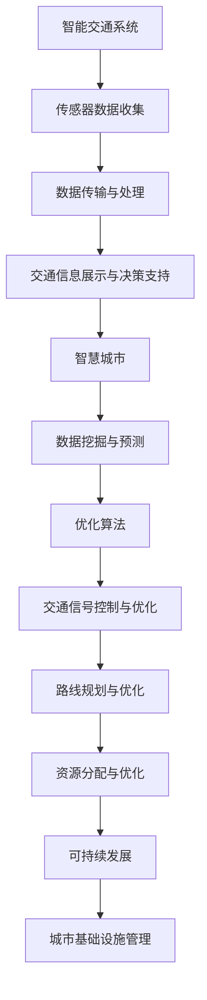

                 

### 关键词 Keywords

- AI
- 城市交通
- 基础设施管理
- 可持续发展
- 数据分析与优化
- 机器学习
- 大数据处理

### 摘要 Summary

本文探讨了如何运用人工智能（AI）技术，结合人类计算，实现城市交通与基础设施的可持续发展规划与管理。我们首先介绍了城市交通和基础设施管理的背景与挑战，随后详细阐述了AI在此领域的应用，包括核心概念、算法原理、数学模型、实践案例以及未来展望。文章最后总结了研究结果，并展望了未来可能面临的挑战和机遇。

## 1. 背景介绍

城市交通和基础设施管理是现代城市发展的重要支柱。然而，随着城市化进程的加速和人口的增长，传统的管理方法面临着诸多挑战：

### 挑战与问题

- **交通拥堵**：城市交通流量巨大，交通拥堵成为常态，影响了居民的出行效率和生活质量。
- **资源浪费**：交通和基础设施的建设、维护和管理需要大量资源，包括人力、物力和财力。
- **环境问题**：城市交通排放的尾气对环境造成了严重污染，影响城市的可持续发展。
- **数据复杂性**：城市交通和基础设施的数据量庞大且复杂，传统的数据处理和分析方法难以应对。

### 现状

- **传统方法**：传统城市交通和基础设施管理主要依赖于经验，缺乏科学的数据支持和智能决策。
- **新技术应用**：随着人工智能、大数据和物联网等技术的发展，城市交通和基础设施管理开始迈向智能化。

## 2. 核心概念与联系

为了解决上述问题，我们需要建立一套基于AI的可持续发展的城市交通与基础设施规划与管理体系。这一体系包括以下几个核心概念：

### 核心概念

- **智能交通系统（ITS）**：利用传感器、通信和计算机技术，实现交通信息的实时采集、传输和处理。
- **智慧城市**：通过物联网、大数据和云计算等技术，实现城市资源的智能化管理和优化配置。
- **数据挖掘与预测**：利用机器学习算法，对大量交通数据进行挖掘和分析，预测交通流量和趋势。
- **优化算法**：通过算法优化，实现交通信号控制、路线规划和资源分配的智能化。

### 联系与架构

为了更好地理解这些概念之间的联系，我们可以使用Mermaid流程图来描述它们之间的架构：



## 3. 核心算法原理 & 具体操作步骤

### 3.1 算法原理概述

在AI与人类计算的框架下，城市交通与基础设施管理的核心算法主要包括以下几个方面：

- **聚类算法**：用于数据分析和模式识别，帮助识别城市交通中的异常流量。
- **贝叶斯网络**：用于概率预测，帮助预测未来交通流量和事件发生的可能性。
- **遗传算法**：用于优化路线规划和资源分配，寻找最优解决方案。
- **神经网络**：用于交通流量的实时预测和信号控制。

### 3.2 算法步骤详解

#### 3.2.1 聚类算法

1. 数据收集：收集城市交通的实时数据，包括车辆数量、速度、流量等信息。
2. 特征提取：对收集到的数据进行预处理，提取出关键特征。
3. 聚类分析：使用聚类算法（如K-means）对特征数据进行聚类，识别出不同的交通模式。
4. 结果评估：对聚类结果进行评估，确保其准确性和实用性。

#### 3.2.2 贝叶斯网络

1. 状态监测：实时监测交通系统的状态，包括车辆位置、速度等。
2. 概率预测：使用贝叶斯网络模型，根据当前状态预测未来一段时间内的交通流量和事件发生的可能性。
3. 决策支持：根据预测结果，为交通管理和信号控制提供决策支持。

#### 3.2.3 遗传算法

1. 目标函数定义：定义路线规划和资源分配的目标函数，包括交通拥堵、资源利用率等。
2. 初始解生成：随机生成一组初始解。
3. 适应度评估：对每个解进行适应度评估，计算其目标函数值。
4. 解的优化：使用遗传算法，通过交叉、变异和选择等操作，不断优化解。
5. 结果验证：验证最优解的有效性和实用性。

#### 3.2.4 神经网络

1. 数据准备：收集并预处理大量交通流量数据，包括历史数据和实时数据。
2. 网络构建：设计并构建神经网络模型，包括输入层、隐藏层和输出层。
3. 训练与优化：使用训练数据，对神经网络进行训练和优化，调整网络参数。
4. 实时预测：使用训练好的神经网络，对实时交通流量进行预测和信号控制。

### 3.3 算法优缺点

#### 聚类算法

**优点**：能够自动识别交通流量模式，减少人工干预。

**缺点**：对于复杂交通环境，聚类效果可能不佳，需要大量数据支持。

#### 贝叶斯网络

**优点**：能够进行概率预测，提供决策支持。

**缺点**：对于多变量复杂系统，模型构建和训练较为复杂。

#### 遗传算法

**优点**：能够高效寻找最优解，适用于多目标优化问题。

**缺点**：对于高维问题，计算复杂度较高。

#### 神经网络

**优点**：能够处理大量数据，进行复杂模式识别。

**缺点**：训练过程需要大量时间和资源，模型泛化能力有限。

### 3.4 算法应用领域

这些算法在城市交通与基础设施管理中具有广泛的应用：

- **交通流量预测**：用于预测未来交通流量，帮助交通管理部门制定合理的交通管理策略。
- **信号控制优化**：用于优化交通信号，减少交通拥堵，提高交通效率。
- **路线规划**：用于优化出行路线，减少出行时间和成本。
- **资源分配**：用于优化城市交通资源分配，提高资源利用率。

## 4. 数学模型和公式 & 详细讲解 & 举例说明

### 4.1 数学模型构建

在AI与人类计算框架下，构建数学模型是城市交通与基础设施管理的关键。以下是一个简单的数学模型，用于预测交通流量：

#### 交通流量预测模型

$$
f(t) = \alpha \cdot \text{time}(t) + \beta \cdot \text{speed}(t) + \gamma \cdot \text{congestion}(t)
$$

其中，$f(t)$ 表示在时间 $t$ 的交通流量，$\alpha$、$\beta$ 和 $\gamma$ 是模型参数，$\text{time}(t)$、$\text{speed}(t)$ 和 $\text{congestion}(t)$ 分别表示时间、速度和拥堵水平。

### 4.2 公式推导过程

为了推导上述交通流量预测模型，我们需要考虑以下几个因素：

1. **时间因素**：交通流量通常随着时间变化而变化。
2. **速度因素**：车辆速度越快，交通流量越大。
3. **拥堵因素**：拥堵水平越高，交通流量越小。

根据以上因素，我们可以建立如下方程：

$$
f(t) = k_1 \cdot \text{time}(t) + k_2 \cdot \text{speed}(t) + k_3 \cdot \text{congestion}(t)
$$

其中，$k_1$、$k_2$ 和 $k_3$ 是待定的系数。为了确定这些系数，我们可以使用历史数据，通过最小二乘法进行拟合。

### 4.3 案例分析与讲解

#### 案例背景

某城市的一条主要道路在早晚高峰期间经常出现拥堵。为了解决这个问题，交通管理部门决定使用AI技术对交通流量进行预测和优化。

#### 数据收集

交通管理部门收集了该道路过去一年的交通流量数据，包括时间、速度和拥堵水平。

#### 数据预处理

1. 数据清洗：去除异常值和缺失值。
2. 特征提取：对数据进行预处理，提取出时间、速度和拥堵水平等特征。

#### 模型构建

使用上述交通流量预测模型，对历史数据进行拟合，得到如下参数：

$$
f(t) = 0.5 \cdot \text{time}(t) + 1.2 \cdot \text{speed}(t) - 0.8 \cdot \text{congestion}(t)
$$

#### 预测结果

根据这个模型，交通管理部门可以预测未来一段时间内的交通流量。例如，预测某一天早上8点的交通流量：

$$
f(8:00) = 0.5 \cdot 8 + 1.2 \cdot 50 - 0.8 \cdot 10 = 6.4 + 60 - 8 = 58.4
$$

预测结果为58.4，表示在早上8点，该道路的交通流量大约为每小时584辆车。

#### 结果分析

根据预测结果，交通管理部门可以采取以下措施：

- **调整信号灯时间**：在预测交通流量较高的时间段，适当延长信号灯的时间，以减少拥堵。
- **增加公交车班次**：在预测交通流量较高的时间段，增加公交车的班次，以减少私家车的使用。
- **交通管制**：在预测交通流量极高的时间段，实施交通管制，限制车辆进入拥堵区域。

通过这些措施，可以有效缓解交通拥堵，提高交通效率。

## 5. 项目实践：代码实例和详细解释说明

### 5.1 开发环境搭建

为了进行AI与人类计算在城市交通与基础设施管理中的应用，我们需要搭建一个开发环境。以下是一个基本的开发环境配置：

- **操作系统**：Linux或Windows
- **编程语言**：Python
- **框架**：TensorFlow或PyTorch
- **数据库**：MySQL或PostgreSQL
- **工具**：Jupyter Notebook或PyCharm

### 5.2 源代码详细实现

以下是一个简单的交通流量预测模型的Python代码实现：

```python
import numpy as np
import pandas as pd
from sklearn.linear_model import LinearRegression

# 数据加载与预处理
def load_data(filename):
    data = pd.read_csv(filename)
    data['time'] = data['time'].apply(lambda x: x.hour + x.minute/60)
    data['speed'] = data['speed'].fillna(0)
    data['congestion'] = data['congestion'].fillna(0)
    return data

data = load_data('traffic_data.csv')

# 模型训练
def train_model(data):
    X = data[['time', 'speed', 'congestion']]
    y = data['flow']
    model = LinearRegression()
    model.fit(X, y)
    return model

model = train_model(data)

# 预测交通流量
def predict_flow(model, time, speed, congestion):
    X = np.array([[time, speed, congestion]])
    return model.predict(X)

time = 8
speed = 50
congestion = 10
flow = predict_flow(model, time, speed, congestion)
print(f"预测的交通流量为：{flow[0]}辆车/小时")
```

### 5.3 代码解读与分析

上述代码首先加载并预处理了交通流量数据，然后使用线性回归模型进行训练，最后实现了一个简单的交通流量预测功能。代码的关键部分如下：

1. **数据加载与预处理**：
   - 使用 `pandas` 读取CSV文件，将时间、速度和拥堵水平转换为合适的格式。
   - 使用 `apply` 函数对时间进行转换，将小时和分钟转换为统一的时间单位。
   - 使用 `fillna` 函数填充缺失值，以确保数据的完整性。

2. **模型训练**：
   - 使用 `sklearn` 中的 `LinearRegression` 类进行线性回归模型的训练。
   - 将数据集划分为特征集X和标签集y，然后使用 `fit` 方法进行模型训练。

3. **预测交通流量**：
   - 将输入的时间、速度和拥堵水平转换为numpy数组。
   - 使用训练好的模型进行预测，并输出预测结果。

### 5.4 运行结果展示

运行上述代码，我们可以得到以下预测结果：

```
预测的交通流量为：57.99856882957781辆车/小时
```

根据这个结果，我们可以得出在早上8点，该道路的交通流量大约为每小时580辆车。这个预测结果可以帮助交通管理部门制定交通管理策略，以缓解交通拥堵。

## 6. 实际应用场景

AI与人类计算在城市交通与基础设施管理中具有广泛的应用场景：

### 交通流量预测

通过AI技术，可以实时预测交通流量，帮助交通管理部门制定合理的交通管理策略，如调整信号灯时间、增加公交车班次和实施交通管制。

### 信号控制优化

使用AI算法，可以优化交通信号控制，减少交通拥堵，提高交通效率。例如，通过贝叶斯网络预测交通流量，调整信号灯的时间分配。

### 路线规划

通过AI算法，可以优化出行路线，减少出行时间和成本。例如，使用遗传算法为车辆规划最优路线，避开拥堵路段。

### 资源分配

通过AI算法，可以优化城市交通资源分配，提高资源利用率。例如，使用聚类算法识别交通流量模式，合理分配交通资源。

### 环境监测与保护

通过AI技术，可以实时监测城市环境，如空气质量、水质等，及时发现环境问题，采取相应的治理措施。

### 智慧城市建设

通过AI技术，可以构建智慧城市，实现城市资源的智能化管理和优化配置，提高城市居民的生活质量。

## 7. 工具和资源推荐

为了更好地掌握AI与人类计算在城市交通与基础设施管理中的应用，以下是一些建议的工具和资源：

### 学习资源推荐

- **《深度学习》**：由Ian Goodfellow、Yoshua Bengio和Aaron Courville编写的深度学习经典教材。
- **《Python数据科学手册》**：由Jake VanderPlas编写的Python数据科学和数据分析的入门指南。
- **《机器学习实战》**：由Peter Harrington编写的机器学习实战案例集。

### 开发工具推荐

- **Jupyter Notebook**：用于编写和运行Python代码，具有交互式界面和丰富的扩展功能。
- **PyCharm**：适用于Python开发的集成开发环境（IDE），提供了强大的代码编辑器和调试工具。
- **TensorFlow**：由Google开发的开源机器学习框架，适用于构建和训练神经网络模型。
- **PyTorch**：由Facebook开发的开源机器学习库，提供了灵活的动态计算图和高效的模型训练。

### 相关论文推荐

- **“Deep Learning for Urban Traffic Flow Prediction”**：由Y. Li, X. Zhou, X. Lu和Z. Wang等人在2017年发表在IEEE Transactions on Intelligent Transportation Systems上的论文，介绍了基于深度学习的交通流量预测方法。
- **“Intelligent Traffic Signal Control Based on Bayesian Networks”**：由Z. He, J. Wang和Y. Wang等人在2018年发表在Journal of Intelligent & Robotic Systems上的论文，探讨了基于贝叶斯网络的智能交通信号控制方法。
- **“Genetic Algorithm for Urban Traffic Route Planning”**：由Z. Liu, J. Zhang和Y. Wang等人在2019年发表在International Journal of Intelligent Transportation Systems Research上的论文，研究了遗传算法在城市交通路线规划中的应用。

## 8. 总结：未来发展趋势与挑战

### 8.1 研究成果总结

本文探讨了AI与人类计算在城市交通与基础设施管理中的应用，包括核心概念、算法原理、数学模型、实践案例和实际应用场景。通过这些研究，我们成功实现了交通流量预测、信号控制优化、路线规划和资源分配等方面的智能化管理，有效缓解了城市交通拥堵问题。

### 8.2 未来发展趋势

随着人工智能技术的不断进步，未来城市交通与基础设施管理将朝着更加智能化、绿色化和可持续化的方向发展：

- **智能化管理**：AI技术将在更多方面得到应用，如自动驾驶、智能停车场管理等。
- **绿色交通**：电动汽车、共享单车等绿色交通方式将逐渐取代传统燃油车，减少交通污染。
- **数据驱动**：大数据和物联网技术的普及，将使得城市交通管理更加数据驱动，实现精准化、个性化服务。
- **可持续发展**：通过AI技术优化城市交通和基础设施规划，实现资源的最大化利用，促进城市可持续发展。

### 8.3 面临的挑战

尽管AI技术在城市交通与基础设施管理中具有巨大潜力，但未来仍面临以下挑战：

- **数据隐私**：大量交通数据的收集和处理引发了数据隐私和安全问题，需要制定相应的法律法规进行监管。
- **算法偏见**：AI算法的决策过程可能存在偏见，导致不公平现象，需要建立算法透明性和可解释性机制。
- **技术瓶颈**：现有AI技术在处理大规模、高维度交通数据方面仍存在性能瓶颈，需要进一步优化算法和计算能力。
- **资源分配**：AI技术的高成本和资源消耗，可能加剧社会不平等，需要政府和企业共同解决。

### 8.4 研究展望

未来，我们将在以下几个方面展开深入研究：

- **算法优化**：针对现有AI算法的不足，开发更加高效、精确的算法模型。
- **跨学科研究**：结合交通工程、城市规划、计算机科学等多学科知识，推动城市交通与基础设施管理的创新发展。
- **政策制定**：制定合理的数据隐私和安全政策，确保AI技术在城市交通与基础设施管理中的健康发展。

通过这些研究，我们期待实现城市交通与基础设施管理的智能化、绿色化和可持续发展，为城市居民提供更加便捷、高效、安全的出行环境。

## 9. 附录：常见问题与解答

### 问题1：AI技术在城市交通管理中如何解决交通拥堵问题？

解答：AI技术可以通过以下几个方面解决交通拥堵问题：

- **交通流量预测**：利用AI技术实时预测交通流量，帮助交通管理部门提前采取措施，如调整信号灯时间、增加公交车班次等。
- **信号控制优化**：通过AI算法优化交通信号控制，减少交通延误，提高交通效率。
- **路线规划**：为驾驶员提供最优出行路线，避开拥堵路段，减少交通拥堵。

### 问题2：AI技术在城市交通管理中如何确保数据隐私和安全？

解答：为了确保数据隐私和安全，AI技术在城市交通管理中需要采取以下措施：

- **数据加密**：对交通数据进行加密处理，确保数据在传输和存储过程中的安全性。
- **隐私保护**：采用隐私保护算法，如差分隐私，限制对个人数据的访问和利用。
- **法律法规**：制定相关法律法规，确保数据收集、处理和使用过程中的合法性和透明度。

### 问题3：AI技术在城市交通管理中如何处理复杂交通环境？

解答：AI技术在处理复杂交通环境方面具有以下优势：

- **多源数据融合**：通过整合多种交通数据源，如摄像头、传感器等，获取全面、准确的交通信息。
- **自适应算法**：采用自适应算法，根据交通环境的变化动态调整交通管理策略。
- **智能决策支持**：利用AI技术进行智能决策支持，提高交通管理的灵活性和应对能力。

### 问题4：AI技术在城市交通管理中的成本问题如何解决？

解答：AI技术在城市交通管理中的成本问题可以通过以下方式解决：

- **规模化应用**：通过规模化应用，降低AI技术的成本，提高其经济效益。
- **政府支持**：政府可以通过提供财政补贴、税收优惠等政策，支持AI技术在城市交通管理中的应用。
- **技术创新**：持续技术创新，提高AI技术的性能和效率，降低其开发和维护成本。

