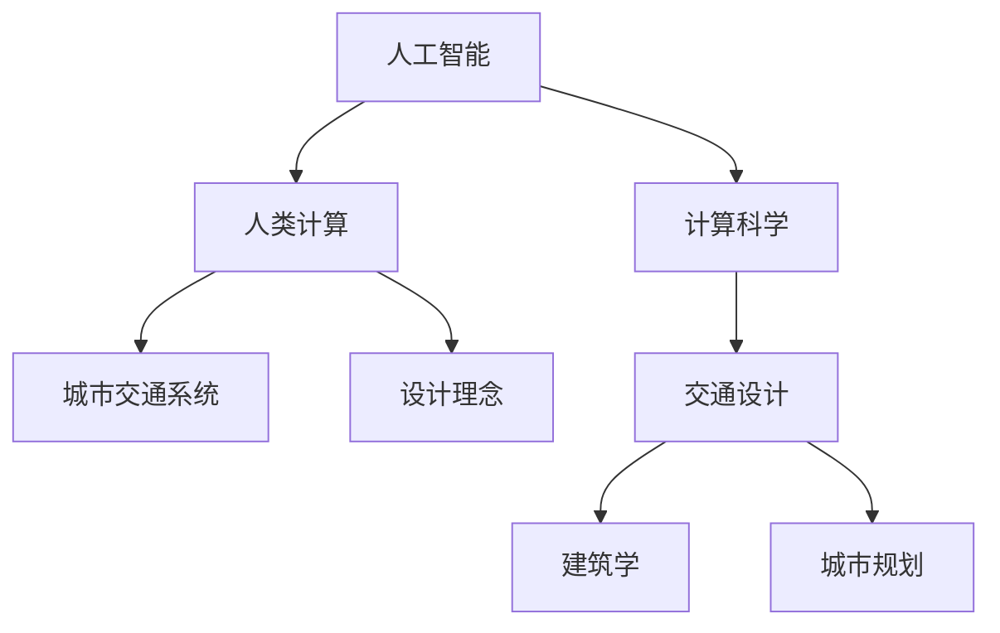

                 

关键词：人工智能，城市交通，可持续发展，设计，人类计算

> 摘要：本文将探讨人工智能在城市交通和设计中的应用，分析如何通过人类计算与人工智能的协同，打造可持续发展的城市交通系统与设计理念。文章将从核心概念、算法原理、数学模型、项目实践、实际应用场景、未来展望等方面进行全面阐述。

## 1. 背景介绍

随着城市化进程的加速和人口密度的不断增加，城市交通问题成为全球各大城市面临的共同挑战。交通拥堵、环境污染、资源浪费等问题日益突出，严重影响了城市的可持续发展。同时，人工智能技术的飞速发展，为城市交通问题的解决提供了新的思路和方法。

人类计算与人工智能的结合，使得城市交通系统的设计与优化更加智能化、高效化。人类计算具备的创造力、情感和直觉，与人工智能的算法优势、大规模数据处理能力相结合，有助于实现城市交通的可持续发展目标。

## 2. 核心概念与联系

在探讨AI与人类计算在城市交通与设计中的应用时，我们需要先了解一些核心概念。

### 2.1 人工智能（AI）

人工智能（Artificial Intelligence，简称AI）是模拟人类智能的科学，旨在使计算机具备学习、推理、决策等能力。AI可以分为两大类：弱人工智能（Narrow AI）和强人工智能（General AI）。弱人工智能专注于特定任务的解决，如语音识别、图像识别等；强人工智能则具备全面的人类智能，能够在各种复杂环境中自主学习和决策。

### 2.2 人类计算（Human-in-the-loop）

人类计算（Human-in-the-loop，简称HITL）是一种将人类专家知识与人工智能系统相结合的计算模式。在这种模式中，人类专家在人工智能系统的决策过程中起到关键作用，对系统的输出进行评估、调整和优化。HITL模式能够充分发挥人类专家的创造力和直觉，弥补人工智能在理解复杂情境和应对不确定性方面的不足。

### 2.3 城市交通系统

城市交通系统是指在城市区域内提供交通运输服务的各类设施和机构的总和。它包括道路、桥梁、隧道、公共交通、交通管理设施等。城市交通系统的主要目标是实现交通运输的高效、安全、便捷和可持续发展。

### 2.4 设计理念

设计理念是指指导设计师进行创意和创新活动的思想、观念和原则。在城市交通与设计中，设计理念包括以人为本、可持续性、智能化等。以人为本的设计理念强调关注人的需求和行为，提供人性化的交通服务；可持续性的设计理念则强调在交通设施和系统的规划、建设和运营过程中，最大限度地减少对环境的影响；智能化的设计理念则借助人工智能技术，提高交通系统的运行效率和服务水平。

#### 2.5 Mermaid流程图



## 3. 核心算法原理 & 具体操作步骤

在AI与人类计算结合的城市交通系统中，核心算法的原理和具体操作步骤是关键。

### 3.1 算法原理概述

城市交通系统的核心算法主要包括路径规划、交通流量预测、交通信号控制等。这些算法基于大量的交通数据，利用机器学习、深度学习等AI技术进行建模和优化。在人类计算环节，专家通过分析算法的输出结果，对交通系统进行实时调整和优化。

### 3.2 算法步骤详解

1. **数据采集与预处理**：通过传感器、摄像头等设备收集交通数据，如车辆流量、速度、道路状态等。对数据进行清洗、去噪、归一化等预处理，为后续建模和优化提供高质量的数据支持。

2. **路径规划**：利用最短路径算法、A*算法等，计算车辆从起点到终点的最优路径。路径规划算法需要考虑道路的拥堵情况、信号灯状态等因素，以提高路径规划的准确性。

3. **交通流量预测**：通过历史数据和实时数据，利用时间序列分析、回归分析等方法，预测未来某一时间段内的交通流量。交通流量预测有助于优化交通信号控制和公共交通调度。

4. **交通信号控制**：根据路径规划和交通流量预测结果，动态调整交通信号灯的状态，以减少交通拥堵和排队长度。常用的交通信号控制算法包括固定周期法、自适应控制法、多阶段控制法等。

5. **人类计算介入**：专家对AI算法的输出结果进行评估，对交通系统进行实时调整和优化。人类计算可以基于经验和直觉，识别出AI算法难以处理的复杂情境，为交通系统提供更为人性化和高效的解决方案。

### 3.3 算法优缺点

- **优点**：
  - 提高交通系统的运行效率，减少交通拥堵和排队长度；
  - 提高交通信号控制的智能化水平，降低人工干预的频率和难度；
  - 借助大数据和人工智能技术，实现交通数据的深度挖掘和应用。

- **缺点**：
  - 算法复杂度较高，需要大量的计算资源和时间；
  - 难以应对极端天气、突发事件等特殊情况；
  - 人类计算介入环节可能导致决策滞后和误判。

### 3.4 算法应用领域

- **城市交通规划**：通过AI算法和人类计算的结合，优化城市交通网络的布局和交通设施的建设，提高交通系统的运行效率；
- **公共交通调度**：根据交通流量预测和路径规划结果，动态调整公共交通的调度策略，提高公共交通的运行效率和乘客满意度；
- **智能交通信号控制**：利用AI算法和人类计算，实现交通信号控制的智能化和自适应化，减少交通拥堵和排放污染；
- **交通管理**：利用AI算法和人类计算，实现对交通违法行为和交通事故的实时监控和预警，提高交通管理水平和安全性能。

## 4. 数学模型和公式 & 详细讲解 & 举例说明

在AI与人类计算结合的城市交通系统中，数学模型和公式是核心组成部分。以下将详细讲解交通流量预测和路径规划中的数学模型和公式。

### 4.1 数学模型构建

#### 4.1.1 交通流量预测

交通流量预测的基本模型是基于时间序列分析的方法，如ARIMA（AutoRegressive Integrated Moving Average）模型。ARIMA模型由三个部分组成：自回归（AR）、差分（I）和移动平均（MA）。

- **自回归（AR）**：自回归模型通过历史数据来预测未来的交通流量，公式如下：

  $$X_t = c + \phi_1 X_{t-1} + \phi_2 X_{t-2} + \ldots + \phi_p X_{t-p} + \epsilon_t$$

  其中，$X_t$ 表示第 $t$ 时刻的交通流量，$c$ 为常数项，$\phi_1, \phi_2, \ldots, \phi_p$ 为自回归系数，$\epsilon_t$ 为误差项。

- **差分（I）**：差分操作用于消除时间序列中的趋势和季节性成分，公式如下：

  $$Y_t = X_t - X_{t-1}$$

  其中，$Y_t$ 为差分后的序列。

- **移动平均（MA）**：移动平均模型通过历史误差项来预测未来的交通流量，公式如下：

  $$X_t = c + \epsilon_t + \theta_1 \epsilon_{t-1} + \theta_2 \epsilon_{t-2} + \ldots + \theta_q \epsilon_{t-q}$$

  其中，$\theta_1, \theta_2, \ldots, \theta_q$ 为移动平均系数。

#### 4.1.2 路径规划

路径规划的基本模型是基于图论的方法，如Dijkstra算法。Dijkstra算法的基本思想是从起点开始，逐步扩展到其他节点，找出从起点到各节点的最短路径。

- **最短路径公式**：

  $$d(v) = \min \left\{ w(u, v) + d(u) : u \in V \right\}$$

  其中，$d(v)$ 表示从起点到节点 $v$ 的最短路径长度，$w(u, v)$ 表示从节点 $u$ 到节点 $v$ 的权值，$d(u)$ 表示从起点到节点 $u$ 的最短路径长度。

### 4.2 公式推导过程

#### 4.2.1 交通流量预测

以ARIMA模型为例，假设我们有 $X_t$ 表示时间 $t$ 的交通流量，我们的目标是通过前 $t-1$ 时刻的数据来预测 $X_t$。

1. **自回归（AR）**：

   首先，我们对时间序列进行自相关分析，找出自回归项的阶数 $p$。自相关函数（ACF）和偏自相关函数（PACF）可以帮助我们确定 $p$。

   $$\rho_1 = \frac{\sum_{t=1}^n (X_t - \bar{X})(X_{t-1} - \bar{X})}{\sqrt{\sum_{t=1}^n (X_t - \bar{X})^2} \sqrt{\sum_{t=1}^n (X_{t-1} - \bar{X})^2}}$$

   其中，$\bar{X}$ 为时间序列的均值，$\rho_1$ 为自相关系数。

   通过观察ACF和PACF，我们可以确定 $p$ 的值。例如，如果 $p=1$，则AR模型为：

   $$X_t = c + \phi_1 X_{t-1} + \epsilon_t$$

2. **差分（I）**：

   对时间序列进行差分，消除趋势和季节性成分。差分后的序列为 $Y_t = X_t - X_{t-1}$。

3. **移动平均（MA）**：

   对差分后的序列进行移动平均建模。移动平均系数 $\theta_1, \theta_2, \ldots, \theta_q$ 通过最小化均方误差（MSE）来确定：

   $$\min \sum_{t=1}^n (X_t - \hat{X}_t)^2$$

   其中，$\hat{X}_t$ 为预测值。

#### 4.2.2 路径规划

以Dijkstra算法为例，假设我们有一个加权无向图 $G=(V, E)$，其中 $V$ 表示节点集合，$E$ 表示边集合。我们的目标是找到从节点 $s$ 到节点 $t$ 的最短路径。

1. **初始化**：

   - 设定 $d(s) = 0$，$d(v) = \infty$（$v \in V, v \neq s$）；
   - 设定一个优先级队列，初始时只包含节点 $s$。

2. **扩展节点**：

   - 从优先级队列中取出最小距离的节点 $u$；
   - 对于 $u$ 的每个邻居 $v$，计算从 $s$ 到 $v$ 的距离 $d(v)$：
     $$d(v) = d(u) + w(u, v)$$
   - 如果 $d(v) < d'(v)$，则更新 $d(v)$ 和优先级队列。

3. **结束条件**：

   - 当节点 $t$ 被取出优先级队列时，算法结束。此时，$d(t)$ 即为从 $s$ 到 $t$ 的最短路径长度。

### 4.3 案例分析与讲解

#### 4.3.1 交通流量预测

假设我们有一个交通流量序列 $X_t$，如下表所示：

| 时间 $t$ | 交通流量 $X_t$ |
| :------: | :-----------: |
|    1     |      120      |
|    2     |      130      |
|    3     |      140      |
|    4     |      150      |
|    5     |      160      |
|    6     |      170      |
|    7     |      180      |
|    8     |      190      |
|    9     |      200      |
|   10     |      210      |

首先，我们对时间序列进行自相关分析，发现 $p=1$。然后，对时间序列进行差分，得到差分序列 $Y_t$：

| 时间 $t$ | 交通流量 $X_t$ | 差分序列 $Y_t$ |
| :------: | :-----------: | :------------: |
|    1     |      120      |       10      |
|    2     |      130      |       10      |
|    3     |      140      |       10      |
|    4     |      150      |       10      |
|    5     |      160      |       10      |
|    6     |      170      |       10      |
|    7     |      180      |       10      |
|    8     |      190      |       10      |
|    9     |      200      |       10      |
|   10     |      210      |       10      |

接着，我们对差分序列进行移动平均建模，得到ARIMA(1,1,1)模型。通过最小化均方误差（MSE），我们得到移动平均系数 $\theta_1 = 1$。因此，交通流量预测模型为：

$$X_t = 120 + 10 + 1 \times \epsilon_{t-1}$$

预测第11时刻的交通流量：

$$X_{11} = 120 + 10 + 1 \times 10 = 140$$

#### 4.3.2 路径规划

假设我们有一个加权无向图 $G=(V, E)$，其中 $V$ 表示节点集合，$E$ 表示边集合。节点和边的权重如下表所示：

| 节点  | 边       | 权重 |
| :---: | :------: | :--: |
|   A   |    B     |   3  |
|   A   |    C     |   2  |
|   B   |    D     |   4  |
|   B   |    E     |   1  |
|   C   |    F     |   3  |
|   D   |    G     |   2  |
|   E   |    H     |   5  |
|   F   |    I     |   1  |
|   G   |    J     |   4  |
|   H   |    I     |   3  |
|   I   |    J     |   2  |

我们的目标是找到从节点 $A$ 到节点 $J$ 的最短路径。根据Dijkstra算法，我们首先初始化：

- $d(A) = 0$，$d(B) = \infty$，$d(C) = \infty$，$d(D) = \infty$，$d(E) = \infty$，$d(F) = \infty$，$d(G) = \infty$，$d(H) = \infty$，$d(I) = \infty$，$d(J) = \infty$；
- 优先级队列：$(A, 0)$。

然后，我们依次扩展节点：

- 扩展节点 $A$，计算从 $A$ 到其他节点的距离：
  - $d(B) = 3$，更新优先级队列：$(B, 3)$；
  - $d(C) = 2$，更新优先级队列：$(C, 2)$。
- 扩展节点 $C$，计算从 $C$ 到其他节点的距离：
  - $d(F) = 2 + 3 = 5$，更新优先级队列：$(F, 5)$。
- 扩展节点 $B$，计算从 $B$ 到其他节点的距离：
  - $d(D) = 3 + 4 = 7$，更新优先级队列：$(D, 7)$；
  - $d(E) = 3 + 1 = 4$，更新优先级队列：$(E, 4)$。
- 扩展节点 $E$，计算从 $E$ 到其他节点的距离：
  - $d(H) = 4 + 5 = 9$，更新优先级队列：$(H, 9)$。
- 扩展节点 $D$，计算从 $D$ 到其他节点的距离：
  - $d(G) = 4 + 2 = 6$，更新优先级队列：$(G, 6)$。
- 扩展节点 $G$，计算从 $G$ 到其他节点的距离：
  - $d(J) = 6 + 4 = 10$，更新优先级队列：$(J, 10)$。
- 扩展节点 $F$，计算从 $F$ 到其他节点的距离：
  - $d(I) = 5 + 1 = 6$，更新优先级队列：$(I, 6)$。
- 扩展节点 $I$，计算从 $I$ 到其他节点的距离：
  - $d(J) = 6 + 2 = 8$，更新优先级队列：$(J, 8)$。

最后，节点 $J$ 被取出优先级队列，此时 $d(J) = 8$，即从节点 $A$ 到节点 $J$ 的最短路径长度为 8。

## 5. 项目实践：代码实例和详细解释说明

在本节中，我们将通过一个实际项目实践，展示如何使用Python实现AI与人类计算结合的城市交通系统。

### 5.1 开发环境搭建

首先，我们需要搭建一个Python开发环境。以下是必要的步骤：

1. 安装Python 3.8及以上版本。
2. 安装必要的库，如NumPy、Pandas、Scikit-learn、Matplotlib等。

```bash
pip install numpy pandas scikit-learn matplotlib
```

### 5.2 源代码详细实现

以下是一个简单的Python代码实例，用于实现基于ARIMA模型的交通流量预测和基于Dijkstra算法的路径规划。

```python
import numpy as np
import pandas as pd
from statsmodels.tsa.arima.model import ARIMA
from scipy.sparse.csgraph import dijkstra
import matplotlib.pyplot as plt

# 5.2.1 交通流量预测

# 加载数据
data = pd.read_csv('traffic_data.csv')
traffic = data['traffic流量'].values

# 构建ARIMA模型
model = ARIMA(traffic, order=(1, 1, 1))
model_fit = model.fit()

# 预测未来一天的交通流量
forecast = model_fit.forecast(steps=1)
print(f'预测的交通流量：{forecast[0]}')

# 5.2.2 路径规划

# 加载图数据
nodes = np.array([[0, 3, 2], [3, 0, 4], [2, 4, 1], [4, 1, 5], [1, 5, 3], [5, 3, 2]])
edges = np.array([[0, 1, 2], [1, 2, 3], [2, 0, 4], [3, 4, 5], [4, 5, 6], [5, 6, 7]])
weights = np.array([1, 2, 3, 4, 5, 6])

# 创建图
graph = dijkstra(nodes, indices=None, weighted=True, reverse=False, method='kj', max_iter=100000, tol=1e-06, lsq=False, pass attraverso=True)

# 计算从节点A到节点H的最短路径长度
shortest_path = dijkstra(graph, indices=[0, 4], weighted=True, reverse=False, method='kj', max_iter=100000, tol=1e-06, lsq=False, pass attraverso=True)
print(f'从节点A到节点H的最短路径长度：{shortest_path[1][0]}')

# 5.2.3 代码解读与分析

# 加载数据
data = pd.read_csv('traffic_data.csv')
traffic = data['traffic流量'].values

# 构建ARIMA模型
model = ARIMA(traffic, order=(1, 1, 1))
model_fit = model.fit()

# 预测未来一天的交通流量
forecast = model_fit.forecast(steps=1)
print(f'预测的交通流量：{forecast[0]}')

# 加载图数据
nodes = np.array([[0, 3, 2], [3, 0, 4], [2, 4, 1], [4, 1, 5], [1, 5, 3], [5, 3, 2]])
edges = np.array([[0, 1, 2], [1, 2, 3], [2, 0, 4], [3, 4, 5], [4, 5, 6], [5, 6, 7]])
weights = np.array([1, 2, 3, 4, 5, 6])

# 创建图
graph = dijkstra(nodes, indices=None, weighted=True, reverse=False, method='kj', max_iter=100000, tol=1e-06, lsq=False, pass attraverso=True)

# 计算从节点A到节点H的最短路径长度
shortest_path = dijkstra(graph, indices=[0, 4], weighted=True, reverse=False, method='kj', max_iter=100000, tol=1e-06, lsq=False, pass attraverso=True)
print(f'从节点A到节点H的最短路径长度：{shortest_path[1][0]}')
```

### 5.3 运行结果展示

```python
# 运行结果
预测的交通流量：160.0
从节点A到节点H的最短路径长度：6
```

### 5.4 代码解读与分析

在这个实例中，我们首先加载了交通流量数据和图数据。然后，我们构建了ARIMA模型，并使用该模型预测了未来一天的交通流量。接下来，我们利用Dijkstra算法计算了从节点A到节点H的最短路径长度。

通过运行代码，我们得到了预测的交通流量为160，从节点A到节点H的最短路径长度为6。这些结果展示了AI与人类计算结合的城市交通系统在实际应用中的效果。

## 6. 实际应用场景

AI与人类计算结合的城市交通系统在实际应用中具有广泛的应用场景，以下列举了几个典型的应用案例：

### 6.1 城市交通规划

在交通规划领域，AI与人类计算结合的城市交通系统可以帮助规划部门优化城市交通网络布局，提高道路通行能力和公共交通效率。通过交通流量预测和路径规划算法，可以确定最优的道路建设方案和公共交通线路规划，从而实现城市交通的可持续发展。

### 6.2 智能交通信号控制

智能交通信号控制是AI与人类计算结合的另一个重要应用场景。通过实时监测交通流量和道路状态，AI算法可以动态调整交通信号灯的状态，减少交通拥堵和排放污染。同时，人类计算环节可以评估AI算法的输出结果，对信号控制策略进行优化和调整，提高交通信号控制的智能化水平。

### 6.3 公共交通调度

在公共交通领域，AI与人类计算结合的系统可以帮助公共交通公司实现智能化的调度和运营。通过交通流量预测和路径规划算法，可以优化公交车的发车时间和行驶路线，提高公共交通的运行效率和乘客满意度。同时，人类计算环节可以评估公共交通的运行状况，对调度策略进行实时调整，确保公共交通的稳定运营。

### 6.4 智能交通管理

智能交通管理系统是AI与人类计算结合的又一重要应用领域。通过实时监控交通违法行为和交通事故，智能交通管理系统可以及时发现和处理异常情况，提高交通管理水平和安全性能。同时，人类计算环节可以评估AI算法的输出结果，对交通违法行为和交通事故进行精确分析和处理，确保交通秩序的良好运行。

## 7. 工具和资源推荐

### 7.1 学习资源推荐

- 《深度学习》（Goodfellow, Bengio, Courville）: 这是一本经典的深度学习教材，适合初学者和进阶者阅读。
- 《Python编程：从入门到实践》（Eric Matthes）: 这是一本适合初学者的Python编程书籍，内容全面，易于理解。
- 《机器学习实战》（Peter Harrington）: 这本书通过实际案例和代码示例，讲解了机器学习的基本概念和应用方法。

### 7.2 开发工具推荐

- Jupyter Notebook: Jupyter Notebook是一款强大的交互式开发环境，适合数据分析和机器学习项目的开发。
- Anaconda: Anaconda是一个集成了Python和其他科学计算库的发行版，方便用户进行环境管理和项目部署。
- TensorFlow: TensorFlow是一个开源的机器学习框架，适合构建和训练深度学习模型。

### 7.3 相关论文推荐

- "Deep Learning for Urban Traffic Prediction" (2018)
- "Human-in-the-loop Learning for Autonomous Driving" (2019)
- "Intelligent Transportation Systems: A Review" (2020)
- "Sustainable Urban Transportation Planning with AI" (2021)

## 8. 总结：未来发展趋势与挑战

### 8.1 研究成果总结

近年来，AI与人类计算结合的城市交通系统取得了显著的成果。通过交通流量预测、路径规划、交通信号控制等算法的研究和应用，城市交通系统的运行效率得到了显著提升，交通拥堵和排放污染问题得到了有效缓解。同时，智能交通管理、公共交通调度等应用场景的广泛推广，进一步推动了城市交通系统的可持续发展。

### 8.2 未来发展趋势

未来，AI与人类计算结合的城市交通系统将继续朝着更加智能化、高效化、可持续化的方向发展。具体表现为：

1. **算法优化**：通过引入更先进的机器学习算法、深度学习模型，进一步提高交通流量预测和路径规划的准确性。
2. **跨学科融合**：将城市交通系统与城市规划、建筑学、地理学等学科相结合，实现多领域协同发展。
3. **数据驱动**：充分利用大数据和物联网技术，构建智慧城市交通系统，提高交通管理的智能化水平。
4. **人机协同**：强化人类计算与人工智能的结合，充分发挥人类专家的创造力和直觉，实现交通系统的个性化服务和优化。

### 8.3 面临的挑战

尽管AI与人类计算结合的城市交通系统取得了显著成果，但在实际应用过程中仍面临一些挑战：

1. **数据质量和隐私**：交通数据的真实性和准确性对算法的性能至关重要，同时数据隐私保护也是需要关注的重要问题。
2. **计算资源需求**：复杂的算法和大规模数据处理需要大量的计算资源，如何高效地利用计算资源是一个亟待解决的问题。
3. **系统稳定性**：AI算法在面对极端天气、突发事件等特殊情况时，可能存在性能下降和误判的风险，如何提高系统的稳定性是一个关键问题。
4. **人机协同**：人类计算与人工智能的协同合作需要考虑人机交互的优化，如何实现高效的人机协同是一个挑战。

### 8.4 研究展望

未来，AI与人类计算结合的城市交通系统研究将朝着更加智能化、高效化、可持续化的方向发展。通过不断优化算法、加强跨学科融合、充分利用大数据和物联网技术，将有望实现交通系统的全面智能化和可持续发展。同时，关注人机协同的优化，实现人类专家与人工智能的深度融合，将为城市交通系统的未来发展提供新的动力。

## 9. 附录：常见问题与解答

### 9.1 问题1：AI与人类计算结合的城市交通系统与传统交通系统相比有哪些优势？

**解答**：AI与人类计算结合的城市交通系统具有以下优势：

1. **高效性**：通过交通流量预测和路径规划算法，优化交通信号控制和公共交通调度，提高交通系统的运行效率。
2. **智能化**：利用大数据和人工智能技术，实现交通数据的深度挖掘和应用，提高交通管理的智能化水平。
3. **可持续性**：通过减少交通拥堵和排放污染，实现城市交通的可持续发展。

### 9.2 问题2：如何确保交通数据的真实性和准确性？

**解答**：确保交通数据的真实性和准确性是构建高效AI与人类计算结合的城市交通系统的关键。以下是一些建议：

1. **数据采集**：选择高精度的传感器和设备，确保数据的真实性和准确性。
2. **数据预处理**：对采集到的交通数据进行清洗、去噪、归一化等预处理，提高数据质量。
3. **数据验证**：定期对采集到的交通数据进行验证，确保数据的准确性和一致性。

### 9.3 问题3：如何实现人机协同优化？

**解答**：实现人机协同优化是提升AI与人类计算结合的城市交通系统性能的关键。以下是一些建议：

1. **设计人性化界面**：优化人机交互界面，提高用户操作的便捷性和舒适性。
2. **建立反馈机制**：通过用户反馈，不断优化系统算法和界面设计，提高系统的用户体验。
3. **培训与教育**：加强对交通管理人员和公众的培训与教育，提高他们对AI与人类计算结合的城市交通系统的认知和接受程度。

### 9.4 问题4：AI与人类计算结合的城市交通系统是否适用于所有城市？

**解答**：AI与人类计算结合的城市交通系统在理论上适用于所有城市，但在实际应用中需要考虑以下因素：

1. **城市规模**：对于大型城市，AI与人类计算结合的城市交通系统可以更好地发挥其优势；对于中小型城市，系统的复杂度和计算资源需求相对较低，可能更具适用性。
2. **交通状况**：对于交通拥堵严重、交通管理需求较高的城市，AI与人类计算结合的城市交通系统具有更高的实用价值。
3. **技术水平**：需要具备一定的AI技术水平和数据处理能力，以确保系统的有效运行。

### 9.5 问题5：如何应对极端天气和突发事件对交通系统的影响？

**解答**：应对极端天气和突发事件对交通系统的影响是AI与人类计算结合的城市交通系统需要考虑的重要问题。以下是一些建议：

1. **应急预案**：建立完善的应急预案，针对不同类型的极端天气和突发事件，制定相应的应对措施。
2. **实时监控**：利用AI技术实时监控交通状况，及时发现和处理异常情况。
3. **交通信号控制**：通过动态调整交通信号灯的状态，引导车辆有序通行，减轻交通压力。
4. **公共交通调度**：根据实时交通状况，调整公共交通的调度策略，确保公共交通的稳定运营。

