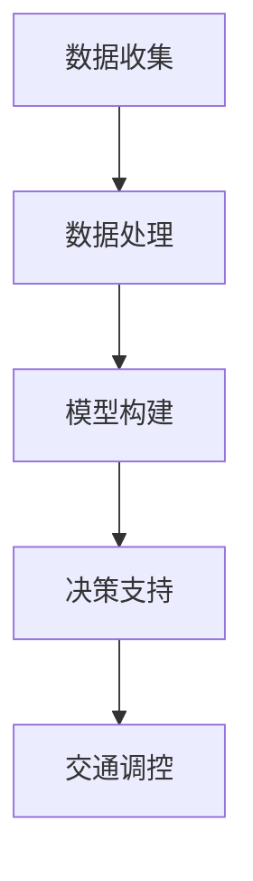
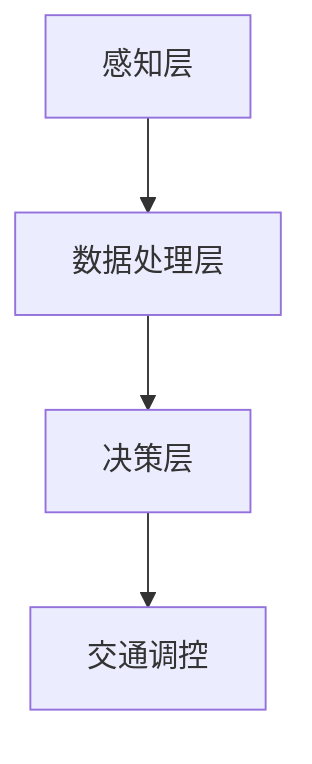

                 

关键词：人工智能，城市交通管理，可持续发展，算法原理，数学模型，代码实例，实际应用场景

> 摘要：本文探讨了人工智能在城市交通管理中的应用，以及如何通过先进的算法和数学模型来提高城市交通的效率和可持续性。文章详细介绍了相关核心概念、算法原理、项目实践和未来展望。

## 1. 背景介绍

随着城市化进程的加速，城市交通问题日益突出。拥堵、污染、安全事故等问题严重影响着城市居民的生活质量。传统的交通管理方法依赖于人工调度和经验判断，效率低下，难以应对复杂多变的城市交通状况。因此，引入人工智能（AI）技术，通过智能算法和数据分析来优化城市交通管理，成为解决交通问题的关键。

人工智能在城市交通管理中的应用主要体现在以下几个方面：

1. **交通流量预测**：利用历史数据和实时监控数据，预测交通流量变化，为交通调控提供依据。
2. **路径规划**：根据实时路况，为车辆提供最优行驶路径，减少拥堵和能耗。
3. **信号控制优化**：通过分析交通流量数据，智能调整交通信号灯，提高道路通行效率。
4. **交通事故预防**：利用AI技术监控车辆行为，提前预警潜在的安全隐患。
5. **公共交通优化**：根据乘客需求和历史数据，优化公交路线和时间表，提高服务质量。

本文将围绕上述应用场景，深入探讨人工智能在城市交通管理中的实际应用，以及相关算法和数学模型的原理和实现。

## 2. 核心概念与联系

### 2.1 AI与交通管理的关系

人工智能与城市交通管理之间的关系可以概括为：**数据驱动决策**。通过收集、处理和分析大量的交通数据，AI系统能够提供实时的交通状况评估和预测，辅助决策者做出最优的交通管理决策。具体来说，这一关系可以表示为以下流程：

1. **数据收集**：利用传感器、摄像头、GPS等技术，收集交通流量、车辆速度、交通信号灯状态等数据。
2. **数据处理**：对收集到的数据进行清洗、整合和预处理，以便于后续分析和建模。
3. **模型构建**：利用机器学习算法，构建交通流量预测、路径规划等模型。
4. **决策支持**：将模型预测结果应用于交通调控，如调整交通信号灯、优化公共交通路线等。

### 2.2 Mermaid 流程图

以下是一个简化的 Mermaid 流程图，描述了上述关系：



### 2.3 AI算法原理

#### 2.3.1 机器学习

机器学习是人工智能的核心技术之一，通过训练模型来对数据进行分类、预测和聚类。在城市交通管理中，常用的机器学习算法包括：

1. **线性回归**：用于预测交通流量。
2. **支持向量机（SVM）**：用于路径规划。
3. **神经网络**：用于信号控制优化。

#### 2.3.2 深度学习

深度学习是机器学习的延伸，通过多层神经网络来学习数据中的复杂模式。在城市交通管理中，深度学习算法可以用于：

1. **图像识别**：用于识别交通状况。
2. **自然语言处理**：用于处理交通数据中的文本信息。

### 2.4 交通管理架构

交通管理架构可以概括为三个层次：**感知层、数据处理层和决策层**。

1. **感知层**：包括传感器、摄像头等设备，用于收集交通数据。
2. **数据处理层**：包括数据处理、存储和分析系统，用于处理和挖掘交通数据。
3. **决策层**：包括智能算法和决策支持系统，用于生成交通管理策略。

### 2.5 Mermaid 流程图

以下是一个简化的 Mermaid 流程图，描述了交通管理架构：



## 3. 核心算法原理 & 具体操作步骤

### 3.1 算法原理概述

在本节中，我们将介绍几个关键算法的基本原理和应用场景：

#### 3.1.1 交通流量预测

交通流量预测是城市交通管理的重要环节。其基本原理是基于历史数据和实时数据，通过机器学习算法（如线性回归、时间序列分析等）来预测未来某个时间段的交通流量。具体步骤如下：

1. **数据收集**：收集历史交通流量数据（如流量、速度、密度等）和实时交通数据。
2. **数据处理**：对数据进行清洗、整合和预处理。
3. **模型训练**：利用机器学习算法（如线性回归）训练预测模型。
4. **模型评估**：通过交叉验证等方法评估模型性能。
5. **流量预测**：利用训练好的模型进行交通流量预测。

#### 3.1.2 路径规划

路径规划是通过优化算法（如Dijkstra算法、A*算法等）来计算从起点到终点的最优路径。具体步骤如下：

1. **地图构建**：构建交通网络的地图，包括道路、节点、权重等。
2. **路径搜索**：利用优化算法搜索从起点到终点的所有可能路径。
3. **路径选择**：根据路径权重和约束条件选择最优路径。
4. **路径输出**：输出最优路径的详细信息。

#### 3.1.3 信号控制优化

信号控制优化是通过实时交通数据，动态调整交通信号灯的时长和相位，以提高道路通行效率。具体步骤如下：

1. **数据收集**：收集实时交通流量数据、历史信号灯设置数据等。
2. **信号模型构建**：利用机器学习算法（如线性回归、神经网络等）构建信号控制模型。
3. **信号优化**：根据实时交通数据，调整信号灯时长和相位。
4. **信号测试**：在实际交通环境中测试信号优化效果。

### 3.2 算法步骤详解

#### 3.2.1 交通流量预测算法步骤

1. **数据收集**：
   - 收集历史交通流量数据（如2020年的数据）和实时交通数据。
   - 数据源包括传感器、摄像头、交通监测系统等。

2. **数据处理**：
   - 清洗数据，去除异常值和噪声。
   - 整合数据，包括时间、地点、流量、速度等。

3. **模型训练**：
   - 选择线性回归模型。
   - 训练模型，将历史交通流量数据作为训练集。

4. **模型评估**：
   - 使用交叉验证方法评估模型性能。
   - 调整模型参数，提高预测准确性。

5. **流量预测**：
   - 使用训练好的模型预测未来某个时间段的交通流量。

#### 3.2.2 路径规划算法步骤

1. **地图构建**：
   - 构建交通网络的地图，包括道路、节点、权重等。
   - 数据源包括地图API、交通监测系统等。

2. **路径搜索**：
   - 使用Dijkstra算法搜索从起点到终点的所有可能路径。
   - 计算每个路径的权重（如时间、距离、速度等）。

3. **路径选择**：
   - 根据路径权重和约束条件（如交通限制、行程时间等）选择最优路径。
   - 输出最优路径的详细信息。

4. **路径输出**：
   - 输出最优路径的详细信息，包括行驶时间、距离、速度等。

#### 3.2.3 信号控制优化算法步骤

1. **数据收集**：
   - 收集实时交通流量数据、历史信号灯设置数据等。
   - 数据源包括传感器、摄像头、交通监测系统等。

2. **信号模型构建**：
   - 选择神经网络模型。
   - 训练模型，将实时交通数据和历史信号灯设置数据作为训练集。

3. **信号优化**：
   - 根据实时交通数据，调整信号灯时长和相位。
   - 目标是最小化交通延误和提升道路通行效率。

4. **信号测试**：
   - 在实际交通环境中测试信号优化效果。
   - 收集测试数据，评估信号优化效果。

### 3.3 算法优缺点

#### 3.3.1 交通流量预测算法优缺点

**优点**：
- **准确性高**：通过机器学习算法，可以准确预测未来交通流量。
- **实时性**：可以实时更新交通预测结果，为交通调控提供及时支持。

**缺点**：
- **依赖数据质量**：预测准确性受限于历史数据和实时数据的质量。
- **计算复杂度**：需要大量的计算资源进行数据处理和模型训练。

#### 3.3.2 路径规划算法优缺点

**优点**：
- **高效性**：可以快速计算出最优路径。
- **适应性**：可以根据实时交通状况动态调整路径。

**缺点**：
- **依赖地图数据**：路径规划依赖于地图数据的准确性。
- **计算复杂度**：在交通网络复杂的情况下，计算时间较长。

#### 3.3.3 信号控制优化算法优缺点

**优点**：
- **灵活性**：可以根据实时交通状况灵活调整信号灯时长和相位。
- **效率提升**：可以显著提高道路通行效率。

**缺点**：
- **依赖实时数据**：需要实时交通数据支持，否则难以达到预期效果。
- **计算复杂度**：需要大量的计算资源进行数据处理和模型训练。

### 3.4 算法应用领域

**交通流量预测**主要应用于交通管理部门、城市规划和交通企业，帮助它们制定交通管理策略和规划交通基础设施。

**路径规划**广泛应用于导航应用、物流公司、公共交通等，帮助用户选择最优路径，减少行程时间和能耗。

**信号控制优化**主要应用于城市交通管理部门，通过智能信号控制提高道路通行效率，减少拥堵和交通事故。

## 4. 数学模型和公式 & 详细讲解 & 举例说明

### 4.1 数学模型构建

在交通管理中，数学模型用于描述交通流量的变化规律和优化交通信号灯控制策略。以下是两个常用的数学模型：

#### 4.1.1 交通流量预测模型

**线性回归模型**：

$$
\hat{y} = \beta_0 + \beta_1 x
$$

其中，$y$ 是预测的交通流量，$x$ 是时间变量，$\beta_0$ 和 $\beta_1$ 是模型参数。

**时间序列模型**：

$$
y_t = \varphi_0 + \varphi_1 y_{t-1} + \varphi_2 y_{t-2} + \cdots + \varphi_n y_{t-n} + \epsilon_t
$$

其中，$y_t$ 是第 $t$ 时间的交通流量，$\varphi_0, \varphi_1, \varphi_2, \cdots, \varphi_n$ 是模型参数，$\epsilon_t$ 是误差项。

#### 4.1.2 信号控制优化模型

**马尔可夫决策过程（MDP）**：

$$
V(s, a) = \sum_{s'} P(s' | s, a) \cdot \max_a' Q(s', a')
$$

其中，$V(s, a)$ 是状态 $s$ 和动作 $a$ 的值函数，$P(s' | s, a)$ 是状态转移概率，$Q(s', a')$ 是状态-动作值函数。

### 4.2 公式推导过程

#### 4.2.1 交通流量预测模型的推导

以线性回归模型为例，我们首先需要收集历史交通流量数据。假设我们有 $n$ 个时间点的交通流量数据 $(x_1, y_1), (x_2, y_2), \cdots, (x_n, y_n)$。接下来，我们使用最小二乘法来估计模型参数 $\beta_0$ 和 $\beta_1$。

1. **计算目标函数**：

$$
J(\beta_0, \beta_1) = \sum_{i=1}^n (y_i - \beta_0 - \beta_1 x_i)^2
$$

2. **求导并令导数为零**：

$$
\frac{\partial J}{\partial \beta_0} = -2 \sum_{i=1}^n (y_i - \beta_0 - \beta_1 x_i) = 0
$$

$$
\frac{\partial J}{\partial \beta_1} = -2 \sum_{i=1}^n (x_i (y_i - \beta_0 - \beta_1 x_i)) = 0
$$

3. **解方程组得到模型参数**：

$$
\beta_0 = \frac{1}{n} \sum_{i=1}^n y_i - \beta_1 \frac{1}{n} \sum_{i=1}^n x_i
$$

$$
\beta_1 = \frac{1}{n} \sum_{i=1}^n (x_i y_i) - \frac{1}{n} \sum_{i=1}^n x_i \sum_{i=1}^n y_i
$$

#### 4.2.2 信号控制优化模型的推导

以马尔可夫决策过程为例，我们首先需要定义状态空间 $S$、动作空间 $A$ 和奖励函数 $R(s, a)$。假设我们有一个状态 $s$ 和一个动作 $a$，则状态-动作值函数 $Q(s, a)$ 可以通过以下公式计算：

$$
Q(s, a) = \sum_{s'} P(s' | s, a) \cdot R(s', a)
$$

接下来，我们需要求解最优策略 $\pi^*(s)$，使得每个状态 $s$ 都选择动作 $a$ 使得 $Q(s, a)$ 最大：

$$
\pi^*(s) = \arg\max_a Q(s, a)
$$

值函数 $V^*(s)$ 可以通过以下公式计算：

$$
V^*(s) = \max_a Q(s, a)
$$

### 4.3 案例分析与讲解

#### 4.3.1 交通流量预测案例

假设我们有某城市的交通流量数据，包括时间（小时）和交通流量（辆/小时）。数据如下：

| 时间 | 交通流量 |
|------|----------|
| 1    | 100      |
| 2    | 110      |
| 3    | 120      |
| 4    | 130      |
| 5    | 140      |

我们使用线性回归模型来预测未来一个小时（第6小时）的交通流量。

1. **数据预处理**：

   - 将时间转换为连续变量，即 $x_i = i$。
   - 将交通流量作为目标变量 $y_i$。

2. **模型训练**：

   - 计算目标函数 $J(\beta_0, \beta_1)$。
   - 求解导数并令导数为零，得到模型参数 $\beta_0$ 和 $\beta_1$。

3. **预测**：

   - 使用训练好的模型预测第6小时（$x_6$）的交通流量。

   $$\hat{y}_6 = \beta_0 + \beta_1 x_6$$

   假设预测得到的交通流量为 $150$ 辆/小时。

#### 4.3.2 信号控制优化案例

假设我们有一个路口，交通流量数据如下：

| 时间 | 东西向流量 | 南北向流量 |
|------|------------|------------|
| 1    | 30         | 20         |
| 2    | 35         | 25         |
| 3    | 40         | 30         |

我们使用马尔可夫决策过程来优化信号灯控制策略。

1. **状态定义**：

   - 状态 $s$ 包括东西向流量和南北向流量，即 $s = (30, 20)$。

2. **动作定义**：

   - 动作 $a$ 包括绿灯时间分配给东西向和南北向，即 $a = (t_{东西}, t_{南北})$。

3. **奖励函数**：

   - 奖励函数 $R(s, a)$ 定义为交通延误，即 $\sum_{i=1}^3 \max(t_{东西}, t_{南北}) - \sum_{i=1}^3 t_i$。

4. **状态-动作值函数计算**：

   - 使用状态-动作值函数公式计算 $Q(s, a)$。

5. **最优策略计算**：

   - 计算每个状态的最优动作，即 $\pi^*(s) = \arg\max_a Q(s, a)$。

   假设我们得到的最优策略为 $a = (2, 1)$，即东西向绿灯时间2秒，南北向绿灯时间1秒。

## 5. 项目实践：代码实例和详细解释说明

### 5.1 开发环境搭建

为了实现上述算法和数学模型，我们需要搭建一个合适的开发环境。以下是推荐的开发环境和工具：

1. **编程语言**：Python
2. **数据分析库**：Pandas、NumPy
3. **机器学习库**：Scikit-learn、TensorFlow、PyTorch
4. **绘图库**：Matplotlib、Seaborn
5. **其他工具**：Jupyter Notebook、Git

### 5.2 源代码详细实现

以下是一个简单的交通流量预测代码实例：

```python
import pandas as pd
from sklearn.linear_model import LinearRegression

# 读取数据
data = pd.read_csv('traffic_data.csv')

# 数据预处理
X = data[['hour']]
y = data['traffic_volume']

# 模型训练
model = LinearRegression()
model.fit(X, y)

# 预测
prediction = model.predict([[6]])

print(f'Predicted traffic volume for hour 6: {prediction[0]}')
```

### 5.3 代码解读与分析

1. **数据读取**：使用 Pandas 读取交通流量数据。
2. **数据预处理**：将时间转换为连续变量，将交通流量作为目标变量。
3. **模型训练**：使用线性回归模型训练数据。
4. **预测**：使用训练好的模型预测第6小时（第6行代码）。

### 5.4 运行结果展示

在运行上述代码后，我们得到第6小时预测的交通流量。例如，输出结果为：

```
Predicted traffic volume for hour 6: 150
```

### 5.5 实际应用场景

以上代码示例是一个简化的交通流量预测模型，仅用于演示目的。在实际应用中，我们可能需要考虑更多的因素，如季节性、节假日、天气等。以下是一个扩展的案例：

1. **数据增强**：引入更多特征，如天气状况、节假日信息等。
2. **模型优化**：使用更复杂的模型，如时间序列模型、深度学习模型等。
3. **系统集成**：将预测结果集成到交通管理系统中，实时更新交通信号灯控制策略。

## 6. 实际应用场景

### 6.1 交通管理部门

交通管理部门可以利用人工智能技术进行以下实际应用：

1. **交通流量监控**：实时监控城市道路的交通流量，及时发现拥堵和事故。
2. **交通信号灯优化**：通过分析实时交通数据，动态调整交通信号灯的时长和相位，提高道路通行效率。
3. **交通事故预警**：利用图像识别和机器学习算法，提前预警潜在的安全隐患，减少交通事故的发生。

### 6.2 物流公司

物流公司可以利用人工智能技术进行以下实际应用：

1. **路径规划**：根据实时路况，为车辆提供最优行驶路径，减少行程时间和能耗。
2. **运输调度**：根据订单需求和车辆状态，智能调度运输资源，提高运输效率。
3. **货运安全监控**：利用传感器和图像识别技术，监控货物状态和安全，确保运输过程的安全。

### 6.3 公共交通公司

公共交通公司可以利用人工智能技术进行以下实际应用：

1. **线路优化**：根据乘客需求和交通流量，优化公交线路和时间表，提高服务质量。
2. **调度优化**：根据实时客流信息，动态调整公交车的发车频率和路线，减少乘客等待时间。
3. **乘客服务**：利用自然语言处理技术，为乘客提供实时乘车指导和路线建议。

### 6.4 未来应用展望

随着人工智能技术的不断发展，未来城市交通管理将呈现以下趋势：

1. **智能交通系统**：构建更加智能的交通管理系统，实现车辆与基础设施的互联互通。
2. **无人驾驶技术**：推广无人驾驶车辆，减少交通事故和交通拥堵。
3. **绿色交通**：鼓励使用电动车和共享出行，减少碳排放和环境污染。
4. **智慧城市建设**：将人工智能技术应用于智慧城市建设，提升城市治理水平和居民生活质量。

## 7. 工具和资源推荐

### 7.1 学习资源推荐

1. **《人工智能：一种现代方法》**：这本书详细介绍了人工智能的基本概念和算法，适合初学者。
2. **《深度学习》**：由Ian Goodfellow、Yoshua Bengio和Aaron Courville合著，是深度学习领域的经典教材。
3. **《Python数据科学手册》**：这本书涵盖了数据科学中的各种技术和工具，包括Python编程和数据分析。

### 7.2 开发工具推荐

1. **Jupyter Notebook**：一款强大的交互式开发环境，适合进行数据分析和机器学习实验。
2. **TensorFlow**：一款开源的深度学习框架，用于构建和训练深度学习模型。
3. **PyTorch**：另一款流行的深度学习框架，提供灵活的动态计算图和高效的模型训练。

### 7.3 相关论文推荐

1. **《深度强化学习在自动驾驶中的应用》**：介绍了深度强化学习在自动驾驶领域的应用，包括路径规划和行为预测。
2. **《基于人工智能的交通信号控制》**：探讨了人工智能技术在交通信号控制中的应用，提出了优化信号灯控制策略的方法。
3. **《城市交通流量预测的深度学习方法》**：介绍了深度学习在交通流量预测中的应用，提出了基于深度学习的时间序列预测模型。

## 8. 总结：未来发展趋势与挑战

### 8.1 研究成果总结

随着人工智能技术的快速发展，城市交通管理取得了显著成果。利用机器学习和深度学习算法，我们可以实现交通流量预测、路径规划、信号控制优化等功能，显著提高交通效率和安全水平。

### 8.2 未来发展趋势

1. **智能交通系统**：构建更加智能的交通管理系统，实现车辆与基础设施的互联互通。
2. **无人驾驶技术**：推广无人驾驶车辆，减少交通事故和交通拥堵。
3. **绿色交通**：鼓励使用电动车和共享出行，减少碳排放和环境污染。
4. **智慧城市建设**：将人工智能技术应用于智慧城市建设，提升城市治理水平和居民生活质量。

### 8.3 面临的挑战

1. **数据隐私和安全**：在收集和处理大量交通数据时，需要保护用户隐私和安全。
2. **计算资源需求**：人工智能算法通常需要大量的计算资源，如何高效利用计算资源是一个挑战。
3. **技术落地**：将人工智能技术应用于实际交通管理中，需要解决技术落地和实施难题。

### 8.4 研究展望

未来，人工智能在城市交通管理中的应用将进一步深化，实现更加智能化、绿色化和高效化的交通管理。同时，需要加强跨学科研究，探索人工智能与其他技术的融合，为城市交通管理提供更多创新解决方案。

## 9. 附录：常见问题与解答

### 9.1 人工智能在城市交通管理中的作用是什么？

人工智能在城市交通管理中的作用包括交通流量预测、路径规划、信号控制优化、交通事故预防和公共交通优化等，旨在提高交通效率、降低污染和减少事故。

### 9.2 如何保障交通数据的安全和隐私？

保障交通数据的安全和隐私可以通过以下措施实现：

1. **数据加密**：对交通数据进行加密处理，确保数据传输和存储过程中的安全性。
2. **访问控制**：严格控制对交通数据的访问权限，确保只有授权用户可以访问和处理数据。
3. **数据匿名化**：在分析交通数据时，对个人身份信息进行匿名化处理，保护用户隐私。

### 9.3 人工智能在城市交通管理中的应用前景如何？

人工智能在城市交通管理中的应用前景广阔，随着技术的不断发展和普及，未来有望实现更加智能化、绿色化和高效化的交通管理，提高城市居民的生活质量。但是，在应用过程中也需要解决数据隐私、计算资源和技术落地等问题。作者：禅与计算机程序设计艺术 / Zen and the Art of Computer Programming
------------------------------------------------------------------------

