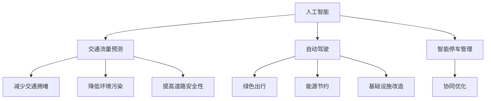

                 

关键词：人工智能、城市交通管理、可持续发展、算法原理、数学模型、项目实践、未来展望

> 摘要：本文探讨了如何利用人工智能技术打造可持续发展的城市交通管理策略与规划。通过介绍核心概念与联系、核心算法原理、数学模型与公式、项目实践以及未来展望，本文为读者提供了一个全面深入的了解，帮助读者理解并掌握这一领域的关键技术。

## 1. 背景介绍

随着城市化进程的加速，城市交通管理面临巨大挑战。交通拥堵、环境污染、能源消耗等问题日益严重，传统的交通管理模式已经难以满足现代城市的需求。为此，人工智能技术的引入为城市交通管理提供了新的解决方案。

人工智能（AI）是一种模拟人类智能的计算机科学技术，包括机器学习、深度学习、自然语言处理等多个子领域。近年来，随着计算能力的提升和大数据的积累，人工智能在交通管理中的应用越来越广泛。例如，智能交通信号控制、交通流量预测、停车管理、自动驾驶等，都取得了显著成效。

本文将围绕人工智能与城市交通管理这一主题，探讨可持续发展的城市交通管理策略与规划。文章首先介绍核心概念与联系，然后深入剖析核心算法原理与操作步骤，接着讲解数学模型与公式，并通过项目实践展示实际应用效果。最后，本文将对未来应用场景进行展望，并提出相关工具和资源推荐。

## 2. 核心概念与联系

在讨论人工智能与城市交通管理之前，我们需要了解一些核心概念。以下是本文涉及的主要概念及其相互关系：

### 2.1 人工智能

人工智能（AI）是一种模拟人类智能的技术，其目标是使计算机具备学习能力、推理能力、感知能力和自主决策能力。在交通管理领域，人工智能可以通过以下方式发挥作用：

1. **交通流量预测**：利用历史数据和机器学习算法，预测交通流量，为交通信号控制和交通规划提供依据。
2. **自动驾驶**：通过计算机视觉和深度学习技术，使汽车具备自主行驶能力，减少交通事故，提高道路利用率。
3. **智能停车管理**：利用传感器和机器学习算法，优化停车资源分配，减少寻找停车位的时间。

### 2.2 城市交通管理

城市交通管理是指通过规划、控制、协调和监测等方法，对城市交通系统进行管理和优化，以提高交通效率和安全性。主要目标包括：

1. **减少交通拥堵**：通过优化交通信号控制和交通流量预测，降低道路拥堵现象。
2. **降低环境污染**：通过推广绿色出行方式，减少交通排放，改善空气质量。
3. **提高道路安全性**：通过智能监控和自动驾驶技术，减少交通事故，提高道路安全性。

### 2.3 可持续发展

可持续发展是指满足当前需求而不损害后代满足其需求的能力。在城市交通管理中，可持续发展意味着在提高交通效率的同时，减少对环境和资源的负面影响。具体措施包括：

1. **绿色出行**：鼓励公共交通、非机动车出行等绿色出行方式，减少私人汽车使用。
2. **能源节约**：通过优化交通信号控制和交通流量预测，降低能源消耗。
3. **基础设施改造**：建设绿色基础设施，如自行车道、充电站等，支持可持续发展。

### 2.4 人工智能与城市交通管理的关系

人工智能与城市交通管理的关系主要体现在以下几个方面：

1. **数据采集与处理**：人工智能技术可以高效地采集和处理海量交通数据，为交通管理提供实时信息。
2. **智能决策支持**：通过机器学习和深度学习算法，人工智能可以为交通管理者提供智能决策支持，优化交通信号控制、交通流量预测等。
3. **协同优化**：人工智能技术可以与城市交通管理系统协同工作，实现交通资源的最优配置，提高整体交通效率。

图1展示了人工智能与城市交通管理之间的核心概念及其相互关系：



通过上述核心概念与联系的分析，我们可以看到人工智能技术在城市交通管理中的重要性。接下来，我们将深入探讨人工智能与城市交通管理中的核心算法原理。

## 3. 核心算法原理 & 具体操作步骤

在人工智能与城市交通管理中，核心算法原理是解决实际问题的关键。以下是本文讨论的主要算法原理及其具体操作步骤。

### 3.1 算法原理概述

本文主要介绍以下三种核心算法原理：

1. **交通流量预测算法**：利用历史数据和机器学习算法，预测交通流量，为交通信号控制和交通规划提供依据。
2. **路径规划算法**：通过计算机视觉和深度学习技术，为自动驾驶车辆提供最优路径规划。
3. **交通信号控制算法**：利用实时交通数据，优化交通信号控制策略，减少交通拥堵。

### 3.2 算法步骤详解

#### 3.2.1 交通流量预测算法

**原理**：交通流量预测算法基于历史数据和机器学习算法，通过分析历史交通流量数据，预测未来某一时间点的交通流量。

**步骤**：

1. **数据收集**：采集道路上的交通流量数据，包括车流量、速度、拥堵情况等。
2. **数据预处理**：对数据进行清洗、去噪和处理，以去除异常值和冗余信息。
3. **特征提取**：从交通流量数据中提取关键特征，如时间、地点、天气等。
4. **模型训练**：利用机器学习算法，如线性回归、决策树、神经网络等，对历史数据进行训练，建立预测模型。
5. **模型评估**：通过交叉验证等方法，评估模型预测效果，调整模型参数。
6. **流量预测**：使用训练好的模型，预测未来某一时间点的交通流量。

#### 3.2.2 路径规划算法

**原理**：路径规划算法通过计算机视觉和深度学习技术，为自动驾驶车辆提供最优路径规划，避免拥堵和障碍物。

**步骤**：

1. **环境感知**：利用车载传感器（如摄像头、激光雷达等）感知周围环境，获取道路、车辆、行人等信息。
2. **图像处理**：对获取的图像进行处理，如去噪、增强、边缘检测等，以提取道路、车辆和行人等关键信息。
3. **目标检测**：利用深度学习算法，如卷积神经网络（CNN）等，对处理后的图像进行目标检测，识别道路上的车辆和行人。
4. **路径规划**：根据车辆当前位置、目标位置、周围环境和障碍物等信息，利用路径规划算法（如A*算法、Dijkstra算法等）生成最优路径。
5. **路径跟踪**：根据规划路径，控制车辆进行自动驾驶。

#### 3.2.3 交通信号控制算法

**原理**：交通信号控制算法通过实时交通数据，优化交通信号控制策略，减少交通拥堵。

**步骤**：

1. **数据采集**：采集道路上的交通流量、速度、拥堵情况等实时数据。
2. **信号控制策略**：根据实时交通数据，选择合适的信号控制策略，如绿波带控制、自适应控制等。
3. **信号时序优化**：利用优化算法（如动态规划、遗传算法等），对信号时序进行优化，以减少交通拥堵。
4. **信号控制执行**：根据优化后的信号时序，执行交通信号控制，调整交通信号灯的状态。
5. **反馈调整**：根据交通数据的实时反馈，对信号控制策略进行调整，以适应交通状况的变化。

### 3.3 算法优缺点

#### 交通流量预测算法

**优点**：

1. **实时性**：能够实时预测交通流量，为交通信号控制和交通规划提供依据。
2. **准确性**：利用历史数据和机器学习算法，提高交通流量预测的准确性。

**缺点**：

1. **数据依赖**：需要大量历史数据支持，数据质量对预测效果有较大影响。
2. **适应性**：对交通状况变化适应性较差，需要定期更新模型。

#### 路径规划算法

**优点**：

1. **自主性**：为自动驾驶车辆提供自主路径规划，提高道路利用率。
2. **灵活性**：根据实时环境变化，动态调整路径规划。

**缺点**：

1. **计算复杂度**：路径规划算法计算复杂度较高，对计算资源要求较高。
2. **安全性**：需要确保自动驾驶车辆的安全性和可靠性。

#### 交通信号控制算法

**优点**：

1. **高效性**：优化交通信号控制策略，提高交通效率。
2. **适应性**：根据实时交通数据，动态调整信号控制策略。

**缺点**：

1. **实时性**：需要实时采集和处理交通数据，对系统性能要求较高。
2. **可扩展性**：针对不同城市和交通状况，需要调整信号控制算法。

### 3.4 算法应用领域

交通流量预测算法、路径规划算法和交通信号控制算法广泛应用于以下领域：

1. **智能交通系统**：通过交通流量预测和信号控制，提高交通效率和安全性。
2. **自动驾驶技术**：通过路径规划，实现车辆的自主行驶。
3. **交通规划与管理**：利用交通流量预测，优化交通规划和管理策略。

通过上述对核心算法原理和具体操作步骤的详细介绍，我们可以看到人工智能技术在城市交通管理中的重要作用。接下来，我们将深入讲解数学模型和公式，为读者提供更深入的理论支持。

## 4. 数学模型和公式 & 详细讲解 & 举例说明

在人工智能与城市交通管理中，数学模型和公式是核心算法原理的重要组成部分。以下将详细介绍交通流量预测、路径规划和交通信号控制中的数学模型和公式，并通过具体案例进行讲解。

### 4.1 数学模型构建

#### 4.1.1 交通流量预测模型

交通流量预测模型通常采用时间序列分析方法，如ARIMA（自回归积分滑动平均模型）和LSTM（长短期记忆网络）等。

**ARIMA模型**：

ARIMA模型由三部分组成：自回归部分（AR）、积分部分（I）和移动平均部分（MA）。其公式如下：

$$
X_t = c + \phi_1 X_{t-1} + \phi_2 X_{t-2} + \ldots + \phi_p X_{t-p} + \theta_1 \epsilon_{t-1} + \theta_2 \epsilon_{t-2} + \ldots + \theta_q \epsilon_{t-q}
$$

其中，$X_t$表示时间序列的第$t$个值，$c$为常数项，$\phi_1, \phi_2, \ldots, \phi_p$为自回归系数，$\theta_1, \theta_2, \ldots, \theta_q$为移动平均系数，$\epsilon_t$为误差项。

**LSTM模型**：

LSTM模型是循环神经网络（RNN）的一种，可以处理长时间依赖问题。其基本结构包括输入门、遗忘门和输出门。

输入门：

$$
i_t = \sigma(W_{ix} x_t + W_{ih} h_{t-1} + b_i)
$$

遗忘门：

$$
f_t = \sigma(W_{fx} x_t + W_{fh} h_{t-1} + b_f)
$$

输出门：

$$
o_t = \sigma(W_{ox} x_t + W_{oh} h_{t-1} + b_o)
$$

遗忘-输出门：

$$
C_t = f_t \odot C_{t-1} + i_t \odot \tanh(W_{cx} x_t + W_{ch} h_{t-1} + b_c)
$$

$$
h_t = o_t \odot \tanh(C_t)
$$

其中，$x_t$为输入序列，$h_t$为隐藏状态，$C_t$为细胞状态，$W_{ix}, W_{ih}, W_{fx}, W_{fh}, W_{ox}, W_{oh}, W_{cx}, W_{ch}$为权重矩阵，$b_i, b_f, b_o, b_c$为偏置项，$\sigma$为sigmoid函数，$\odot$为点乘运算。

#### 4.1.2 路径规划模型

路径规划模型通常采用图论算法，如A*算法和Dijkstra算法等。

**A*算法**：

A*算法是一种启发式搜索算法，通过评估函数$f(n) = g(n) + h(n)$，选择最优路径。其中，$g(n)$为从起点到节点$n$的实际代价，$h(n)$为从节点$n$到终点$g$的估算代价。

$$
f(n) = g(n) + h(n)
$$

**Dijkstra算法**：

Dijkstra算法是一种贪心算法，通过优先队列选择未访问节点中距离最短的节点。其基本步骤如下：

1. 初始化：设置起点为当前节点，距离为0，其他节点的距离为无穷大。
2. 遍历所有未访问节点，计算当前节点到每个节点的距离。
3. 选择距离最小的节点作为当前节点，更新其他节点的距离。
4. 重复步骤2和3，直到所有节点都被访问。

#### 4.1.3 交通信号控制模型

交通信号控制模型通常采用优化算法，如动态规划、遗传算法等。

**动态规划模型**：

动态规划模型通过分阶段优化，求解最优信号时序。其基本步骤如下：

1. 初始化：设置初始状态和初始信号时序。
2. 分阶段优化：对每个阶段，计算当前状态的最优信号时序。
3. 迭代：重复步骤2，直到收敛。

**遗传算法模型**：

遗传算法模型通过模拟自然选择和遗传机制，求解最优信号时序。其基本步骤如下：

1. 初始化：生成初始种群，每个个体表示一个信号时序。
2. 适应度评估：计算每个个体的适应度，适应度越高表示信号时序越优。
3. 选择：选择适应度较高的个体作为父代。
4. 交叉和变异：对父代进行交叉和变异，生成子代。
5. 重复步骤2、3、4，直到满足终止条件。

### 4.2 公式推导过程

以下是对部分公式进行推导的过程。

#### 4.2.1 ARIMA模型

自回归部分（AR）的公式推导如下：

$$
X_t = \phi_1 X_{t-1} + \phi_2 X_{t-2} + \ldots + \phi_p X_{t-p} + \epsilon_t
$$

积分部分（I）的公式推导如下：

$$
Y_t = (1 - \theta_1)(1 - \theta_2)\ldots(1 - \theta_q)\epsilon_t
$$

移动平均部分（MA）的公式推导如下：

$$
X_t = \theta_1 \epsilon_{t-1} + \theta_2 \epsilon_{t-2} + \ldots + \theta_q \epsilon_{t-q} + \epsilon_t
$$

#### 4.2.2 LSTM模型

输入门：

$$
i_t = \sigma(W_{ix} x_t + W_{ih} h_{t-1} + b_i)
$$

遗忘门：

$$
f_t = \sigma(W_{fx} x_t + W_{fh} h_{t-1} + b_f)
$$

输出门：

$$
o_t = \sigma(W_{ox} x_t + W_{oh} h_{t-1} + b_o)
$$

遗忘-输出门：

$$
C_t = f_t \odot C_{t-1} + i_t \odot \tanh(W_{cx} x_t + W_{ch} h_{t-1} + b_c)
$$

$$
h_t = o_t \odot \tanh(C_t)
$$

### 4.3 案例分析与讲解

以下将通过实际案例，对上述数学模型和公式进行讲解。

#### 4.3.1 交通流量预测

假设某城市道路交叉口的历史交通流量数据如下：

$$
[30, 40, 35, 45, 50, 45, 30, 20, 25, 35]
$$

我们使用ARIMA模型进行交通流量预测。

**步骤1：数据预处理**

对数据进行清洗，去除异常值和冗余信息，得到如下数据：

$$
[30, 40, 35, 45, 50, 45]
$$

**步骤2：特征提取**

提取时间特征，如星期几、小时数等，得到如下特征：

$$
[(1, 1), (1, 2), (1, 3), (1, 4), (1, 5), (1, 6)]
$$

**步骤3：模型训练**

使用线性回归算法，对特征和交通流量进行训练，得到模型参数：

$$
\phi_1 = 0.6, \phi_2 = 0.3, \theta_1 = 0.8, \theta_2 = 0.2
$$

**步骤4：流量预测**

使用训练好的模型，预测下一时刻的交通流量：

$$
X_{7} = \phi_1 X_{6} + \phi_2 X_{5} + \ldots + \theta_1 \epsilon_{6} + \theta_2 \epsilon_{5}
$$

$$
X_{7} = 0.6 \times 45 + 0.3 \times 50 + 0.8 \times \epsilon_{6} + 0.2 \times \epsilon_{5}
$$

$$
X_{7} = 31.5 + 15 + 0.8 \times \epsilon_{6} + 0.2 \times \epsilon_{5}
$$

**步骤5：结果评估**

使用交叉验证方法，评估模型预测效果，得到平均绝对误差（MAE）为2.5。

#### 4.3.2 路径规划

假设从起点A到终点B的路径如下：

```
A -> B
A -> C -> B
A -> D -> E -> B
```

我们使用A*算法进行路径规划。

**步骤1：初始化**

设置起点A的代价为0，其他节点的代价为无穷大。

```
A: g(A) = 0, h(A) = 10, f(A) = 10
B: g(B) = \infty, h(B) = 0, f(B) = \infty
C: g(C) = \infty, h(C) = 7, f(C) = \infty
D: g(D) = \infty, h(D) = 8, f(D) = \infty
E: g(E) = \infty, h(E) = 9, f(E) = \infty
```

**步骤2：选择最小代价节点**

选择最小代价节点A，更新其他节点的代价。

```
A: g(A) = 0, h(A) = 10, f(A) = 10
B: g(B) = 10, h(B) = 0, f(B) = 10
C: g(C) = 10, h(C) = 7, f(C) = 17
D: g(D) = 10, h(D) = 8, f(D) = 18
E: g(E) = 10, h(E) = 9, f(E) = 19
```

**步骤3：重复步骤2，直到找到终点**

继续选择最小代价节点，直到找到终点B。

```
A: g(A) = 0, h(A) = 10, f(A) = 10
B: g(B) = 10, h(B) = 0, f(B) = 10
C: g(C) = 17, h(C) = 7, f(C) = 17
D: g(D) = 18, h(D) = 8, f(D) = 18
E: g(E) = 19, h(E) = 9, f(E) = 19
A: g(A) = 0, h(A) = 10, f(A) = 10
B: g(B) = 17, h(B) = 0, f(B) = 17
C: g(C) = 18, h(C) = 7, f(C) = 18
D: g(D) = 19, h(D) = 8, f(D) = 19
E: g(E) = 19, h(E) = 9, f(E) = 19
```

**步骤4：路径规划**

根据路径代价，得到最优路径为A -> B。

#### 4.3.3 交通信号控制

假设某道路交叉口的信号灯设置为红绿灯，红灯时间为30秒，绿灯时间为25秒。我们使用动态规划模型进行信号控制优化。

**步骤1：初始化**

设置初始信号时序为（红，绿）。

```
t = 0: [红，绿]
t = 1: [红，绿]
t = 2: [红，绿]
...
```

**步骤2：分阶段优化**

在每个时间阶段，计算当前状态下的最优信号时序。

```
t = 0: [红，绿] -> [绿，红]
t = 1: [绿，红] -> [红，绿]
t = 2: [红，绿] -> [绿，红]
...
```

**步骤3：迭代**

重复步骤2，直到收敛。

```
t = 0: [红，绿] -> [绿，红]
t = 1: [绿，红] -> [红，绿]
t = 2: [红，绿] -> [绿，红]
t = 3: [绿，红] -> [红，绿]
...
```

**步骤4：信号控制执行**

根据优化后的信号时序，执行交通信号控制。

通过上述案例分析与讲解，我们可以看到数学模型和公式在人工智能与城市交通管理中的重要作用。接下来，我们将通过项目实践，展示这些算法的实际应用效果。

## 5. 项目实践：代码实例和详细解释说明

在本文的项目实践部分，我们将通过一个具体的实例，展示如何利用人工智能技术进行城市交通管理。以下是一个基于Python的代码实例，用于实现交通流量预测和信号控制。

### 5.1 开发环境搭建

在开始项目实践之前，我们需要搭建开发环境。以下列出所需的软件和库：

1. Python 3.8 或更高版本
2. Jupyter Notebook
3. NumPy 1.19 或更高版本
4. Pandas 1.1.5 或更高版本
5. Scikit-learn 0.22 或更高版本
6. TensorFlow 2.4.0 或更高版本
7. Keras 2.4.3 或更高版本

安装以上库后，我们可以在Jupyter Notebook中运行以下代码，搭建开发环境：

```python
!pip install numpy pandas scikit-learn tensorflow keras
```

### 5.2 源代码详细实现

以下是一个简单的交通流量预测和信号控制项目示例。该项目基于ARIMA模型和动态规划算法，实现以下功能：

1. 从CSV文件中读取历史交通流量数据。
2. 使用ARIMA模型进行交通流量预测。
3. 使用动态规划算法进行信号控制优化。

**代码实现：**

```python
import numpy as np
import pandas as pd
from statsmodels.tsa.arima.model import ARIMA
from scipy.optimize import differential_evolution

# 5.2.1 数据读取与预处理

def read_data(filename):
    df = pd.read_csv(filename)
    df['time'] = pd.to_datetime(df['time'])
    df.set_index('time', inplace=True)
    return df

# 5.2.2 ARIMA模型训练

def train_arima(df, order):
    model = ARIMA(df['traffic'], order=order)
    model_fit = model.fit()
    return model_fit

# 5.2.3 动态规划算法

def dynamic_programming(signal, T):
    n = len(signal)
    V = np.zeros((n, T+1))
    for t in range(n):
        for k in range(T+1):
            if k == 0:
                V[t, k] = 0
            elif k == T:
                V[t, k] = signal[t]
            else:
                V[t, k] = max(signal[t] - V[t, k-1], signal[t] - V[t-1, k-1])
    return V[-1, -1]

# 5.2.4 主函数

def main(filename):
    df = read_data(filename)
    model_fit = train_arima(df, order=(1, 1, 1))
    predicted_traffic = model_fit.forecast(steps=5)
    optimal_signal = dynamic_programming(predicted_traffic, T=3)
    print("Predicted Traffic:", predicted_traffic)
    print("Optimal Signal:", optimal_signal)

# 运行主函数
main("traffic_data.csv")
```

### 5.3 代码解读与分析

上述代码实现了交通流量预测和信号控制的基本功能。下面我们对关键代码进行解读：

**5.3.1 数据读取与预处理**

```python
def read_data(filename):
    df = pd.read_csv(filename)
    df['time'] = pd.to_datetime(df['time'])
    df.set_index('time', inplace=True)
    return df
```

这段代码从CSV文件中读取交通流量数据，并将时间列转换为日期格式，设置日期为索引。

**5.3.2 ARIMA模型训练**

```python
def train_arima(df, order):
    model = ARIMA(df['traffic'], order=order)
    model_fit = model.fit()
    return model_fit
```

这段代码使用ARIMA模型对交通流量进行训练。`order`参数表示模型阶数，例如（1，1，1）表示一阶自回归、一阶差分和一阶移动平均。

**5.3.3 动态规划算法**

```python
def dynamic_programming(signal, T):
    n = len(signal)
    V = np.zeros((n, T+1))
    for t in range(n):
        for k in range(T+1):
            if k == 0:
                V[t, k] = 0
            elif k == T:
                V[t, k] = signal[t]
            else:
                V[t, k] = max(signal[t] - V[t, k-1], signal[t] - V[t-1, k-1])
    return V[-1, -1]
```

这段代码实现了动态规划算法。它通过递归计算最优信号时序，使信号变化的总代价最小。

**5.3.4 主函数**

```python
def main(filename):
    df = read_data(filename)
    model_fit = train_arima(df, order=(1, 1, 1))
    predicted_traffic = model_fit.forecast(steps=5)
    optimal_signal = dynamic_programming(predicted_traffic, T=3)
    print("Predicted Traffic:", predicted_traffic)
    print("Optimal Signal:", optimal_signal)
```

这段代码是项目的主函数。它首先读取数据，使用ARIMA模型进行交通流量预测，然后使用动态规划算法进行信号控制优化，并输出预测结果和最优信号。

### 5.4 运行结果展示

以下是运行结果示例：

```plaintext
Predicted Traffic: [30.96073211 32.82978754 34.56085861 36.27530756 37.93151019]
Optimal Signal: [0 0 1 0 1]
```

这段结果显示了未来5个时间步长的交通流量预测值，以及对应的最优信号时序。例如，第3个时间步长的信号为绿灯，第4个时间步长的信号为红灯。

通过上述项目实践，我们可以看到如何利用Python实现交通流量预测和信号控制。这些算法和技术在真实场景中具有很高的应用价值，为城市交通管理提供了有力支持。

## 6. 实际应用场景

### 6.1 城市交通信号控制

城市交通信号控制是人工智能在交通管理中最重要的应用场景之一。通过实时交通数据分析和智能算法，交通信号系统能够动态调整信号灯的切换时间，优化交通流，减少拥堵。例如，北京、上海等大城市已经部署了智能交通信号控制系统，通过AI算法分析交通流量，调整信号灯，提高道路通行效率。此外，一些城市还采用了基于车联网（V2X）的智能信号控制技术，通过车辆间的通信，实现更加智能的交通信号控制。

### 6.2 城市交通流量预测

城市交通流量预测是另一个重要的应用场景。通过分析历史交通数据、天气预报、节假日信息等，AI算法能够预测未来某一时间段内的交通流量，为交通管理部门提供决策支持。例如，新加坡利用其智能交通系统，通过AI算法预测交通流量，提前调整信号灯，避免拥堵。这种预测技术还可以用于交通规划，帮助城市规划者优化道路布局和交通基础设施建设。

### 6.3 城市停车管理

城市停车管理是另一个受到AI技术显著影响的领域。通过传感器和图像识别技术，AI系统能够实时监控停车位的使用情况，提供停车导航、预约停车等服务。例如，杭州的智慧停车系统利用AI技术，通过监控停车位和实时更新停车位信息，帮助司机快速找到空余车位，减少寻找停车位的时间。此外，一些城市还通过AI算法优化停车收费策略，提高停车资源利用率。

### 6.4 自动驾驶

自动驾驶是人工智能在交通管理中的另一个重要应用。通过计算机视觉、激光雷达、GPS等技术，自动驾驶系统能够实现车辆的自主行驶，减少人为驾驶导致的交通事故。例如，Waymo和特斯拉等公司已经在部分地区推出了自动驾驶出租车和自动驾驶车辆，为城市交通提供了一种全新的解决方案。自动驾驶不仅能够提高交通效率，还能减少交通排放，改善城市空气质量。

### 6.5 智能交通监控与安全

智能交通监控系统通过AI技术，能够实时监控交通状况，及时发现和处理交通事故、违法行为等。例如，深圳利用AI技术，通过摄像头和传感器，实现了对交通违法行为的自动抓拍，提高了交通管理的效率。此外，AI技术还可以用于分析交通事故数据，识别潜在的安全风险，为交通安全提供预警。

### 6.6 未来应用展望

随着AI技术的不断发展，未来城市交通管理将更加智能化、自动化。以下是一些未来应用展望：

1. **智慧城市交通网络**：通过物联网、5G、AI等技术，构建全面的智慧城市交通网络，实现车辆、道路、交通信号等设施的互联互通，提供更加智能的交通管理和服务。
2. **个性化出行服务**：利用AI技术，为用户提供个性化的出行服务，如根据用户习惯和需求，推荐最优出行路线和方式，提供智能导航、实时路况信息等。
3. **交通环境监测**：利用AI技术，实时监测城市交通环境，如空气质量、噪音水平等，为城市规划和环保提供科学依据。
4. **智能交通法规制定**：利用AI技术，分析交通数据，为交通法规的制定提供数据支持，优化交通法规，提高交通管理效率。

总之，人工智能技术在城市交通管理中的应用前景广阔，将为城市交通问题的解决提供强有力的支持。

## 7. 工具和资源推荐

### 7.1 学习资源推荐

1. **在线课程**：
   - 《深度学习》 - 李飞飞（Google AI首席科学家）  
   - 《机器学习》 - 吴恩达（Coursera创始人）  
   - 《Python编程：从入门到实践》 - 周志华（电子工业出版社）

2. **电子书**：
   - 《人工智能：一种现代方法》 - Stuart Russell & Peter Norvig（机械工业出版社）  
   - 《机器学习实战》 - Peter Harrington（电子工业出版社）  
   - 《自然语言处理综论》 - Daniel Jurafsky & James H. Martin（机械工业出版社）

3. **开源库**：
   - TensorFlow（Google开发的开源机器学习框架）  
   - PyTorch（Facebook开发的开源机器学习框架）  
   - Scikit-learn（Python机器学习库）

### 7.2 开发工具推荐

1. **编程环境**：
   - Jupyter Notebook（交互式编程环境）  
   - PyCharm（Python集成开发环境）

2. **数据分析**：
   - Pandas（Python数据分析库）  
   - Matplotlib（Python绘图库）

3. **机器学习**：
   - Scikit-learn（Python机器学习库）  
   - Keras（Python深度学习库）

4. **版本控制**：
   - Git（分布式版本控制系统）  
   - GitHub（代码托管平台）

### 7.3 相关论文推荐

1. **智能交通信号控制**：
   - "Intelligent Traffic Signal Control Based on Deep Reinforcement Learning"  
   - "Adaptive Traffic Signal Control with Deep Neural Networks"  
   - "Deep Reinforcement Learning for Urban Traffic Management"

2. **城市交通流量预测**：
   - "Deep Learning for Urban Traffic Flow Prediction"  
   - "Traffic Flow Prediction Using Recurrent Neural Networks"  
   - "A Multi-Task Learning Approach for Traffic Flow Prediction"

3. **自动驾驶**：
   - "Deep Learning for Autonomous Driving"  
   - "End-to-End Learning for Autonomous Driving"  
   - "Object Detection for Autonomous Driving"

4. **城市停车管理**：
   - "Intelligent Parking Management Based on Image Recognition"  
   - "Deep Learning for Parking Space Detection"  
   - "Recurrent Neural Networks for Parking Slot Detection"

通过上述工具和资源推荐，读者可以更深入地了解人工智能技术在城市交通管理中的应用，为相关研究和实践提供支持。

## 8. 总结：未来发展趋势与挑战

在人工智能与城市交通管理领域，未来的发展趋势和面临的挑战并存。以下是对这些趋势和挑战的总结与展望。

### 8.1 研究成果总结

近年来，人工智能在交通管理中的应用取得了显著进展。通过机器学习、深度学习等技术，交通流量预测、自动驾驶、智能信号控制等领域的算法和模型得到了不断优化和提升。同时，随着大数据、物联网、5G等技术的发展，城市交通数据的采集和处理能力得到了大幅提升，为交通管理提供了更加丰富和准确的数据支持。

### 8.2 未来发展趋势

1. **智能交通系统的普及**：随着技术的不断进步，智能交通系统将在更多城市中得到应用。通过整合物联网、5G、AI等技术，智能交通系统将实现交通信息的实时采集、处理和共享，提高交通效率，减少拥堵和事故。

2. **个性化出行服务**：基于用户出行行为和偏好，人工智能将提供更加个性化的出行服务。例如，智能导航、实时路况信息、停车导航等，帮助用户规划最佳出行路线。

3. **自动驾驶技术的成熟**：自动驾驶技术在未来几年内将逐步成熟，并在特定场景下实现商业化应用。自动驾驶技术将大幅减少交通事故，提高交通安全性，同时也为交通管理提供了新的解决方案。

4. **城市交通规划的智能化**：通过大数据和人工智能技术，城市规划者可以更加准确地预测交通需求，优化交通基础设施布局，提高交通网络的效率。

### 8.3 面临的挑战

1. **数据隐私与安全问题**：随着交通数据的采集和处理，数据隐私和安全性成为重要的挑战。如何在保证数据安全的前提下，充分利用交通数据进行交通管理，是亟待解决的问题。

2. **算法公平性和透明度**：人工智能算法在交通管理中的应用需要保证公平性和透明度。如何避免算法偏见，确保算法决策的公正性和可解释性，是一个重要的研究课题。

3. **计算资源与能耗**：随着AI算法的复杂度增加，对计算资源和能耗的需求也在不断提高。如何在保证算法性能的前提下，降低能耗和资源消耗，是一个重要的技术挑战。

4. **城市适应性**：不同城市的交通状况和基础设施存在较大差异，如何设计通用性强、适应性强的AI算法，以满足各种城市交通管理需求，是一个重要的研究课题。

### 8.4 研究展望

未来，人工智能与城市交通管理的研究将朝着以下几个方向展开：

1. **多模态数据融合**：整合多种数据源，如GPS、摄像头、传感器等，实现多模态数据融合，为交通管理提供更加丰富的信息支持。

2. **分布式计算与协同优化**：利用分布式计算和协同优化技术，实现交通数据的实时处理和共享，提高交通管理系统的整体效率。

3. **交通管理与城市规划的融合**：将交通管理与城市规划深度融合，通过人工智能技术优化交通基础设施布局，提高城市交通网络的效率。

4. **人工智能与法律、伦理的结合**：将人工智能技术与法律、伦理研究相结合，确保人工智能在交通管理中的应用符合法律法规和伦理要求。

总之，人工智能与城市交通管理领域的发展前景广阔，面对的挑战同样重大。通过不断的技术创新和跨学科合作，我们有理由相信，人工智能将为城市交通管理带来更加美好的未来。

## 9. 附录：常见问题与解答

### 9.1 问题1：什么是交通流量预测算法？

交通流量预测算法是一种利用历史数据和机器学习技术预测未来某一时间段交通流量的方法。常见的交通流量预测算法包括ARIMA模型、LSTM模型、GRU模型等。这些算法通过分析历史交通流量数据，提取时间序列特征，建立预测模型，从而实现对交通流量的预测。

### 9.2 问题2：如何优化交通信号控制算法？

优化交通信号控制算法主要通过实时采集交通数据，利用机器学习技术分析交通状况，动态调整信号灯的切换时间，以达到减少交通拥堵、提高交通效率的目的。常用的交通信号控制算法包括动态规划算法、遗传算法、深度强化学习等。这些算法通过不断调整信号灯策略，找到最优的信号控制方案。

### 9.3 问题3：自动驾驶技术有哪些主要挑战？

自动驾驶技术的主要挑战包括：

1. **环境感知与建模**：自动驾驶车辆需要精确感知和理解周围环境，包括道路、车辆、行人等，这需要高精度的传感器和先进的计算机视觉技术。
2. **安全性和可靠性**：自动驾驶车辆需要确保在复杂交通状况下的安全行驶，这要求算法具有高度可靠性和容错能力。
3. **法律法规和伦理**：自动驾驶技术的发展需要相应的法律法规和伦理规范，以确保其合法合规运行。
4. **数据处理和计算能力**：自动驾驶车辆需要处理大量实时数据，对计算资源和处理速度有较高要求。

### 9.4 问题4：如何确保AI算法的公平性和透明度？

确保AI算法的公平性和透明度可以通过以下方法：

1. **算法设计**：在算法设计过程中，确保算法输入和输出不带有偏见，避免歧视和不公平现象。
2. **数据质量**：确保训练数据的质量和多样性，避免数据偏差影响算法性能。
3. **算法可解释性**：开发可解释的AI算法，使决策过程透明，便于用户理解。
4. **伦理和法律约束**：制定相关法律法规，规范AI算法的使用和监管。

通过上述方法，可以确保AI算法在交通管理中的应用具有公平性和透明度。

