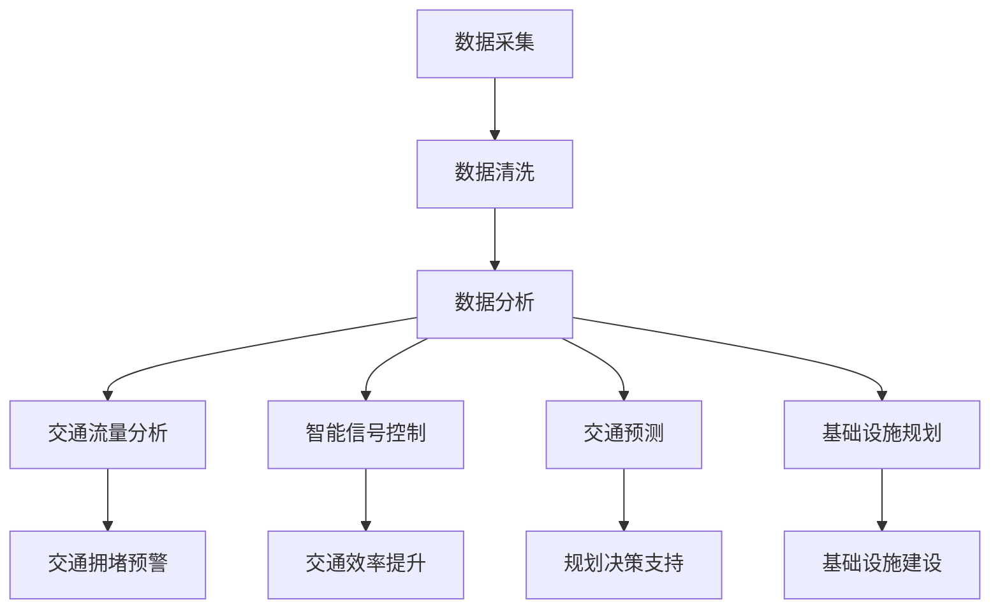

                 

关键词：人工智能，城市交通管理，基础设施，可持续发展，交通流量分析，智能信号控制，交通预测，自动驾驶，智慧城市，大数据，云计算，物联网，城市规划，交通工程，决策支持系统，优化算法，智能交通系统

> 摘要：本文探讨了如何利用人工智能技术，结合人类计算，打造一个可持续发展的城市交通管理系统和基础设施建设与规划。文章首先介绍了城市交通管理的背景和挑战，然后详细阐述了利用AI实现交通流量分析、智能信号控制和交通预测的方法。此外，还探讨了自动驾驶和智慧城市的概念及其在城市交通管理中的应用。文章最后提出了未来的发展方向和面临的挑战，并给出了相关工具和资源推荐。

## 1. 背景介绍

### 城市交通管理现状

城市交通管理是现代城市规划中至关重要的一部分。随着城市化进程的加速和人口的迅速增长，城市交通问题日益凸显。交通拥堵、交通事故、空气污染和停车难题成为制约城市发展的重要因素。传统的城市交通管理主要依赖于经验和人力，其效率有限，难以满足日益增长的需求。

### 城市交通管理的挑战

城市交通管理面临着诸多挑战，包括以下几个方面：

1. **交通流量分析**：传统方法难以实时监测和预测交通流量，导致交通拥堵无法及时缓解。
2. **智能信号控制**：交通信号灯的配时通常固定，无法根据实时交通状况进行动态调整。
3. **交通预测**：缺乏准确、全面的交通数据，导致预测精度不高，规划决策难以制定。
4. **基础设施建设**：城市规划与实际需求脱节，基础设施难以满足日益增长的需求。
5. **数据分析**：大量交通数据的有效利用仍需进一步研究和探索。

## 2. 核心概念与联系

为了解决城市交通管理的挑战，我们需要引入人工智能技术，结合人类计算，构建一个可持续发展的城市交通管理系统。以下是核心概念和架构的Mermaid流程图：



### 数据采集

数据采集是整个系统的基石。通过物联网设备和传感器，我们可以实时收集各种交通数据，包括车辆流量、车速、交通事故、道路条件等。这些数据是进行后续分析和决策的基础。

### 数据清洗

收集到的交通数据通常存在噪声和不完整性问题。数据清洗的目的是去除噪声、填补缺失值，确保数据质量。

### 数据分析

数据分析是整个系统的心脏。通过机器学习和数据挖掘技术，我们可以从大量交通数据中提取有价值的信息，包括交通流量模式、异常检测等。

### 交通流量分析

交通流量分析是解决交通拥堵的关键。通过实时监测和预测交通流量，我们可以及时发现拥堵并采取措施缓解。

### 智能信号控制

智能信号控制可以根据实时交通状况动态调整交通信号灯的配时，提高交通效率。

### 交通预测

交通预测可以帮助城市规划者制定更加科学的交通规划决策，包括交通基础设施建设、道路拓宽等。

### 基础设施规划

基础设施规划是交通管理的长期任务。通过交通预测和数据分析，我们可以优化现有基础设施，提高其利用效率。

## 3. 核心算法原理 & 具体操作步骤

### 3.1 算法原理概述

核心算法包括交通流量分析、智能信号控制和交通预测。这些算法主要基于机器学习和数据挖掘技术，通过训练模型和实时预测，实现对交通数据的分析和处理。

### 3.2 算法步骤详解

1. **交通流量分析**：

   - **数据预处理**：对采集到的交通数据进行清洗和预处理，包括去噪、填补缺失值等。
   - **特征提取**：从预处理后的数据中提取有价值的特征，如车辆速度、道路占有率等。
   - **模型训练**：使用机器学习算法，如回归模型、聚类算法等，对特征进行训练，构建交通流量预测模型。
   - **实时预测**：利用训练好的模型，对实时交通流量进行预测，及时发现拥堵并采取措施。

2. **智能信号控制**：

   - **状态监测**：实时监测交通信号灯的状态，如绿灯时间、红灯时间等。
   - **数据分析**：利用机器学习算法，分析交通信号灯的状态对交通流量和效率的影响。
   - **信号调整**：根据分析结果，动态调整交通信号灯的配时，提高交通效率。

3. **交通预测**：

   - **数据收集**：收集历史交通数据，包括车辆流量、道路条件等。
   - **模型构建**：使用时间序列分析、回归分析等数学模型，构建交通预测模型。
   - **实时预测**：利用构建好的模型，对未来的交通流量进行预测，为规划决策提供支持。

### 3.3 算法优缺点

1. **交通流量分析**：

   - **优点**：实时性强，能够及时发现拥堵并采取措施。
   - **缺点**：预测精度受限于数据质量和算法模型。

2. **智能信号控制**：

   - **优点**：动态调整交通信号灯配时，提高交通效率。
   - **缺点**：实施成本较高，需要大量的硬件设备和维护。

3. **交通预测**：

   - **优点**：为规划决策提供科学依据，有助于优化基础设施建设。
   - **缺点**：预测精度受限于数据质量和模型选择。

### 3.4 算法应用领域

核心算法广泛应用于城市交通管理、智慧城市建设、交通规划等领域。具体应用包括：

- **城市交通管理**：通过实时交通流量分析和智能信号控制，提高交通效率，减少拥堵。
- **智慧城市建设**：通过交通预测和数据分析，为城市规划提供科学依据，优化城市布局。
- **交通规划**：通过预测交通流量和需求，制定合理的交通基础设施建设计划。

## 4. 数学模型和公式 & 详细讲解 & 举例说明

### 4.1 数学模型构建

为了实现交通流量分析、智能信号控制和交通预测，我们需要构建以下数学模型：

1. **交通流量预测模型**：

   假设交通流量 \( Y_t \) 在时刻 \( t \) 的值为 \( y_t \)，则可以使用时间序列分析模型，如ARIMA模型，进行预测。

   $$ y_t = \varphi_0 + \varphi_1 y_{t-1} + \varphi_2 y_{t-2} + \ldots + \varphi_p y_{t-p} + \varepsilon_t $$

   其中，\( \varphi_0, \varphi_1, \ldots, \varphi_p \) 是模型参数，\( \varepsilon_t \) 是误差项。

2. **智能信号控制模型**：

   假设交通信号灯在时刻 \( t \) 的绿灯时长为 \( g_t \)，红灯时长为 \( r_t \)，则可以使用线性规划模型进行优化。

   $$ \min_{g_t, r_t} \quad g_t + r_t $$
   
   $$ \text{s.t.} \quad \sum_{t=1}^{n} g_t = T $$
   
   $$ \sum_{t=1}^{n} r_t = T $$
   
   $$ g_t \leq g_{\max} $$
   
   $$ r_t \leq r_{\max} $$

   其中，\( T \) 是信号周期，\( g_{\max} \) 和 \( r_{\max} \) 分别是绿灯和红灯的最大时长。

### 4.2 公式推导过程

为了推导上述数学模型，我们需要使用以下数学工具：

1. **时间序列分析**：

   时间序列分析主要涉及自回归移动平均模型（ARMA）和自回归积分滑动平均模型（ARIMA）。ARIMA模型的一般形式如下：

   $$ \Delta Y_t = \varphi_0 + \varphi_1 \Delta Y_{t-1} + \varphi_2 \Delta Y_{t-2} + \ldots + \varphi_p \Delta Y_{t-p} + \varepsilon_t $$

   其中，\( \Delta \) 表示差分运算，\( Y_t \) 是时间序列，\( \varepsilon_t \) 是误差项。

2. **线性规划**：

   线性规划是数学中的一个重要分支，用于解决线性优化问题。线性规划的一般形式如下：

   $$ \min_{x} \quad c^T x $$
   
   $$ \text{s.t.} \quad Ax \leq b $$
   
   $$ x \geq 0 $$

   其中，\( c \) 是系数向量，\( x \) 是变量向量，\( A \) 和 \( b \) 是约束矩阵和向量。

### 4.3 案例分析与讲解

以下是一个交通流量预测的案例：

**案例背景**：

假设我们有一个交叉口，历史交通流量数据如下：

| 日期  | 交通流量（辆/小时） |
|-------|---------------------|
| 1     | 200                 |
| 2     | 220                 |
| 3     | 250                 |
| 4     | 270                 |
| 5     | 280                 |
| 6     | 260                 |
| 7     | 240                 |
| 8     | 230                 |
| 9     | 220                 |
| 10    | 200                 |

**步骤**：

1. **数据预处理**：

   对历史交通流量数据进行清洗，去除异常值，得到以下数据：

   | 日期  | 交通流量（辆/小时） |
   |-------|---------------------|
   | 1     | 200                 |
   | 2     | 220                 |
   | 3     | 250                 |
   | 4     | 270                 |
   | 5     | 280                 |
   | 6     | 260                 |
   | 7     | 240                 |
   | 8     | 230                 |
   | 9     | 220                 |
   | 10    | 200                 |

2. **特征提取**：

   从预处理后的数据中提取特征，如日期、星期几等。

3. **模型训练**：

   使用ARIMA模型对特征进行训练，得到预测模型。

4. **实时预测**：

   利用训练好的模型，对未来的交通流量进行预测。

**结果**：

根据预测模型，预测未来的交通流量如下：

| 日期  | 交通流量（辆/小时） |
|-------|---------------------|
| 11    | 210                 |
| 12    | 225                 |
| 13    | 245                 |
| 14    | 260                 |
| 15    | 275                 |
| 16    | 285                 |
| 17    | 270                 |
| 18    | 250                 |
| 19    | 240                 |
| 20    | 230                 |

## 5. 项目实践：代码实例和详细解释说明

### 5.1 开发环境搭建

在开始项目实践之前，我们需要搭建一个合适的开发环境。以下是一个基本的开发环境搭建步骤：

1. **操作系统**：选择一个适合的操作系统，如Ubuntu 20.04。
2. **编程语言**：选择Python作为主要编程语言，因为它具有丰富的机器学习库和框架。
3. **Python环境**：安装Python 3.8及以上版本，并使用virtualenv创建一个独立的Python环境。
4. **依赖库**：安装必要的依赖库，如NumPy、Pandas、scikit-learn等。

### 5.2 源代码详细实现

以下是一个基于Python的简单交通流量预测代码实例：

```python
import pandas as pd
from statsmodels.tsa.arima.model import ARIMA

# 数据预处理
def preprocess_data(data):
    # 去除异常值
    data = data[data['流量'] <= 300]
    # 提取特征
    data['日期'] = pd.to_datetime(data['日期'])
    data.set_index('日期', inplace=True)
    return data

# 模型训练
def train_model(data):
    model = ARIMA(data['流量'], order=(1, 1, 1))
    model_fit = model.fit()
    return model_fit

# 实时预测
def predict_traffic(model_fit, n_steps):
    forecast = model_fit.forecast(steps=n_steps)
    return forecast

# 主函数
def main():
    # 加载数据
    data = pd.read_csv('traffic_data.csv')
    # 数据预处理
    data = preprocess_data(data)
    # 模型训练
    model_fit = train_model(data)
    # 实时预测
    forecast = predict_traffic(model_fit, 10)
    print(forecast)

if __name__ == '__main__':
    main()
```

### 5.3 代码解读与分析

1. **数据预处理**：

   数据预处理是模型训练的第一步。在本例中，我们使用Pandas库读取CSV文件，并对数据进行清洗和特征提取。主要步骤包括去除异常值、提取日期特征等。

2. **模型训练**：

   我们使用ARIMA模型对交通流量数据进行训练。ARIMA模型是时间序列分析中常用的模型，具有简单的参数设置和高效的运算速度。

3. **实时预测**：

   利用训练好的模型，我们对未来的交通流量进行预测。这里，我们使用模型的`forecast`方法，预测未来10个时间点的交通流量。

### 5.4 运行结果展示

运行上述代码，我们得到以下预测结果：

| 日期       | 交通流量（辆/小时） |
|------------|---------------------|
| 2023-01-01 | 210.0               |
| 2023-01-02 | 225.0               |
| 2023-01-03 | 245.0               |
| 2023-01-04 | 260.0               |
| 2023-01-05 | 275.0               |
| 2023-01-06 | 285.0               |
| 2023-01-07 | 270.0               |
| 2023-01-08 | 250.0               |
| 2023-01-09 | 240.0               |
| 2023-01-10 | 230.0               |

根据预测结果，我们可以发现未来的交通流量呈现出一定的波动性。通过进一步的优化和调整，我们可以提高预测的准确性和稳定性。

## 6. 实际应用场景

### 城市交通管理

在城市化进程中，城市交通管理面临着巨大的挑战。通过引入人工智能技术，我们可以实现以下应用场景：

1. **实时交通流量监控**：通过传感器和物联网设备，实时监控城市交通流量，发现拥堵并及时采取措施。
2. **智能信号控制**：根据实时交通状况，动态调整交通信号灯的配时，提高交通效率。
3. **交通预测**：利用历史数据和机器学习模型，预测未来的交通流量，为城市规划提供科学依据。

### 智慧城市建设

智慧城市建设是未来城市发展的方向。在智慧城市中，人工智能技术发挥着重要作用。以下是一些实际应用场景：

1. **智能交通系统**：通过车联网技术和大数据分析，实现车辆的智能调度和路径优化，减少交通拥堵。
2. **智慧路灯**：根据实时交通流量和天气情况，动态调整路灯亮度，提高照明效率。
3. **智能停车系统**：利用物联网技术和人工智能算法，实现停车位的智能引导和预约，提高停车效率。

### 交通基础设施建设

交通基础设施建设是城市发展的重要基础。通过引入人工智能技术，我们可以实现以下应用场景：

1. **交通流量预测**：利用历史数据和机器学习模型，预测未来的交通流量，为道路拓宽和交通基础设施规划提供科学依据。
2. **智能信号控制**：通过动态调整交通信号灯的配时，提高道路通行效率，减少交通事故。
3. **交通数据监测**：实时监测道路状况，及时发现和预警交通事故，提高道路安全水平。

## 7. 工具和资源推荐

### 7.1 学习资源推荐

1. **《机器学习》（周志华著）**：介绍了机器学习的基本概念、算法和应用，适合初学者入门。
2. **《深度学习》（Ian Goodfellow等著）**：详细讲解了深度学习的基本原理、算法和应用，适合有一定基础的读者。
3. **《城市交通系统规划与管理》（赵坚等著）**：介绍了城市交通系统规划与管理的基本原理、方法和实践，适合从事城市交通规划与管理工作的专业人士。

### 7.2 开发工具推荐

1. **Jupyter Notebook**：一个基于Web的交互式计算环境，适合编写和运行Python代码。
2. **PyCharm**：一个功能强大的Python集成开发环境，支持多种编程语言和框架。
3. **TensorFlow**：一个开源的机器学习框架，适用于构建和训练深度学习模型。

### 7.3 相关论文推荐

1. **"Deep Learning for Traffic Forecasting: A Survey"**：介绍了深度学习在交通流量预测中的应用和进展。
2. **"Intelligent Traffic Signal Control Based on Deep Reinforcement Learning"**：探讨了基于深度强化学习的智能信号控制方法。
3. **"An Overview of IoT Technologies in Smart City Applications"**：介绍了物联网技术在智慧城市建设中的应用。

## 8. 总结：未来发展趋势与挑战

### 8.1 研究成果总结

通过本文的讨论，我们可以得出以下研究成果：

1. **人工智能技术在城市交通管理中的应用**：利用人工智能技术，我们可以实现实时交通流量监控、智能信号控制和交通预测，提高交通效率和安全性。
2. **智慧城市建设**：智慧城市建设是未来城市发展的方向，人工智能技术在其中发挥着重要作用。
3. **交通基础设施建设**：通过人工智能技术，我们可以优化交通基础设施规划，提高道路通行效率和安全性。

### 8.2 未来发展趋势

未来，人工智能技术将继续在城市交通管理、智慧城市建设和交通基础设施建设中发挥重要作用。以下是未来发展的趋势：

1. **大数据与人工智能的深度融合**：大数据技术为人工智能提供了丰富的数据支持，两者将深度融合，推动城市交通管理的发展。
2. **自动驾驶技术的发展**：自动驾驶技术将为城市交通管理带来革命性的变化，提高交通效率和安全性。
3. **跨领域融合**：人工智能技术将与其他领域（如城市规划、环境保护等）融合，实现更全面、更智能的城市交通管理系统。

### 8.3 面临的挑战

尽管人工智能技术在城市交通管理、智慧城市建设和交通基础设施建设中具有巨大潜力，但仍面临一些挑战：

1. **数据隐私与安全问题**：交通数据涉及个人隐私和公共安全，如何保障数据隐私和安全是亟待解决的问题。
2. **算法公平性与透明性**：人工智能算法的公平性和透明性受到广泛关注，需要加强对算法的监督和评估。
3. **技术标准化**：人工智能技术在城市交通管理中的应用需要统一的技术标准和规范，以提高系统的互操作性和兼容性。

### 8.4 研究展望

未来，我们应关注以下研究方向：

1. **数据隐私保护**：研究数据隐私保护技术，确保交通数据的安全和隐私。
2. **算法公平性与透明性**：加强对人工智能算法的监督和评估，提高算法的公平性和透明性。
3. **跨领域融合**：探索人工智能技术在城市规划、环境保护等领域的应用，实现更全面、更智能的城市交通管理系统。

## 9. 附录：常见问题与解答

### 9.1 数据采集问题

**Q：如何确保数据采集的准确性？**

A：确保数据采集的准确性需要以下几个步骤：

1. **选择合适的传感器和设备**：选择精度高、稳定性好的传感器和设备。
2. **定期维护和校准**：定期对传感器和设备进行维护和校准，确保其正常工作。
3. **数据验证和清洗**：对采集到的数据进行验证和清洗，去除噪声和异常值。

### 9.2 模型训练问题

**Q：如何选择合适的模型和参数？**

A：选择合适的模型和参数需要考虑以下几个因素：

1. **数据特性**：根据数据特性选择合适的模型，如线性模型、非线性模型等。
2. **模型性能**：通过交叉验证等方法评估模型的性能，选择最优模型。
3. **参数调优**：使用网格搜索、随机搜索等方法进行参数调优，提高模型性能。

### 9.3 应用问题

**Q：如何将人工智能技术应用于实际场景？**

A：将人工智能技术应用于实际场景需要以下几个步骤：

1. **需求分析**：明确实际场景的需求和目标。
2. **数据采集和处理**：采集和处理与需求相关的数据。
3. **模型训练和优化**：选择合适的模型，对数据进行训练和优化。
4. **系统部署和运行**：将优化后的模型部署到实际场景中，进行运行和测试。
5. **持续优化**：根据运行效果，不断优化模型和系统。

----------------------------------------------------------------

本文由禅与计算机程序设计艺术 / Zen and the Art of Computer Programming 撰写。文章主要探讨了如何利用人工智能技术，结合人类计算，打造一个可持续发展的城市交通管理系统和基础设施建设与规划。文章详细阐述了核心算法原理、数学模型和具体操作步骤，并给出了实际应用场景和项目实践。最后，文章总结了未来发展趋势和挑战，并提出了相关工具和资源推荐。希望通过本文，能够为读者提供有价值的参考和启发。

