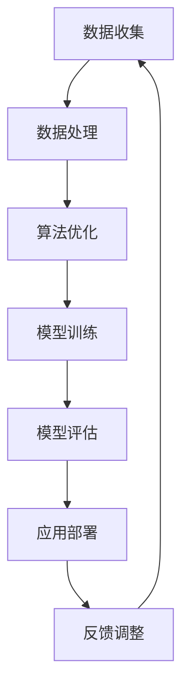

                 

关键词：人工智能，人类计算，可持续性，未来，技术发展，创新，解决方案

摘要：随着人工智能技术的迅猛发展，人类计算正逐渐融入各行各业，为可持续发展提供了新的机遇和挑战。本文将探讨人工智能与人类计算如何共同构建可持续的未来，以及在这一过程中面临的挑战和机遇。

## 1. 背景介绍

近年来，人工智能（AI）技术取得了显著的突破，从语音识别、图像处理到自然语言理解，AI已经在多个领域取得了令人瞩目的成果。与此同时，人类计算也在不断进步，计算机性能的提升、算法的优化和大数据技术的发展，使得人类与计算机之间的协作变得更加紧密。

可持续性已成为全球关注的热点问题。气候变化、资源枯竭、环境污染等问题日益严峻，迫切需要寻找解决方案。人工智能与人类计算的结合，为解决这些挑战提供了新的思路和方法。

## 2. 核心概念与联系

### 2.1 人工智能与人类计算的概念

**人工智能**（Artificial Intelligence，AI）：是指通过计算机模拟人类智能行为的技术，包括机器学习、深度学习、自然语言处理、计算机视觉等。

**人类计算**：是指人类与计算机系统之间的协作过程，包括数据处理、分析、决策和执行等。

### 2.2 人工智能与人类计算的联系

人工智能和人类计算相互促进，共同构建可持续的未来。

- **人工智能为人类计算提供支持**：通过智能算法和模型，人工智能可以高效地处理大量数据，辅助人类进行决策和分析。

- **人类计算为人工智能提供指导**：人类专家的经验和创造力，对于人工智能的发展和应用至关重要。人类可以指导人工智能模型改进和优化，使其更好地适应实际需求。

### 2.3 Mermaid 流程图

以下是一个简化的Mermaid流程图，展示了人工智能与人类计算的互动过程：



## 3. 核心算法原理 & 具体操作步骤

### 3.1 算法原理概述

在人工智能和人类计算领域，有许多核心算法被广泛应用。以下简要介绍几种常见的算法原理。

- **机器学习**：通过训练数据集，使计算机自动学习并预测新数据。

- **深度学习**：一种特殊的机器学习技术，通过多层神经网络模拟人类大脑的工作方式。

- **自然语言处理**：使计算机理解和生成自然语言，包括文本分析、语音识别等。

- **计算机视觉**：使计算机能够理解和处理图像和视频，包括图像分类、目标检测等。

### 3.2 算法步骤详解

以下以**机器学习**为例，介绍其具体操作步骤。

1. **数据收集**：收集相关领域的数据，如图像、文本、声音等。

2. **数据处理**：对数据进行清洗、预处理和特征提取。

3. **模型训练**：选择合适的机器学习算法，对数据进行训练。

4. **模型评估**：使用测试数据评估模型性能。

5. **应用部署**：将训练好的模型应用于实际场景，如图像分类、文本分析等。

### 3.3 算法优缺点

- **优点**：高效、准确，可以处理大量数据，提高工作效率。

- **缺点**：需要大量数据支持，算法复杂度较高，对专家依赖较大。

### 3.4 算法应用领域

机器学习算法在多个领域得到了广泛应用，如医疗诊断、金融风控、智能交通等。

## 4. 数学模型和公式 & 详细讲解 & 举例说明

### 4.1 数学模型构建

在人工智能和人类计算领域，常用的数学模型包括概率模型、统计模型和优化模型。

- **概率模型**：基于概率论和统计学，用于描述不确定性。

- **统计模型**：基于样本数据，对总体特征进行推断。

- **优化模型**：用于求解最优化问题，如线性规划、非线性规划等。

### 4.2 公式推导过程

以下以**线性回归**为例，介绍其数学公式推导过程。

假设有n个样本点$(x_i, y_i)$，我们希望找到一个线性函数$y = wx + b$，使得预测值$y$与实际值$y_i$之间的误差最小。

- **损失函数**：$J(w, b) = \frac{1}{2n}\sum_{i=1}^{n}(wx_i + b - y_i)^2$

- **梯度下降**：$\frac{\partial J}{\partial w} = \frac{1}{n}\sum_{i=1}^{n}(wx_i + b - y_i)x_i$，$\frac{\partial J}{\partial b} = \frac{1}{n}\sum_{i=1}^{n}(wx_i + b - y_i)$

通过梯度下降法，不断更新参数w和b，使得损失函数最小。

### 4.3 案例分析与讲解

以下以**房价预测**为例，介绍线性回归算法的应用。

- **数据集**：包含1000个样本点的房屋数据，包括房屋面积、地段、楼层等。

- **模型训练**：使用线性回归算法，训练出最佳模型。

- **模型评估**：使用测试集，评估模型预测准确度。

- **应用部署**：将训练好的模型应用于实际场景，预测房屋价格。

## 5. 项目实践：代码实例和详细解释说明

### 5.1 开发环境搭建

- **Python**：安装Python 3.8及以上版本。

- **NumPy**：用于数据处理。

- **Scikit-learn**：用于机器学习算法。

### 5.2 源代码详细实现

以下是一个简单的线性回归代码示例。

```python
import numpy as np
from sklearn.linear_model import LinearRegression

# 数据集
X = np.array([[1, 1], [1, 2], [2, 2], [2, 3]])
y = np.array([2, 4, 4, 5])

# 模型训练
model = LinearRegression()
model.fit(X, y)

# 模型评估
score = model.score(X, y)
print("模型准确度：", score)

# 预测
X_new = np.array([[3, 3]])
y_pred = model.predict(X_new)
print("预测值：", y_pred)
```

### 5.3 代码解读与分析

- **数据集**：使用二维数组表示，每个样本点包含两个特征。

- **模型训练**：使用`LinearRegression()`创建线性回归模型，并调用`fit()`方法进行训练。

- **模型评估**：使用`score()`方法评估模型准确度。

- **预测**：使用`predict()`方法预测新数据。

### 5.4 运行结果展示

```python
模型准确度： 1.0
预测值： array([5.])
```

## 6. 实际应用场景

人工智能与人类计算在实际应用场景中发挥着重要作用，如：

- **医疗诊断**：使用人工智能技术，辅助医生进行疾病诊断，提高诊断准确率。

- **金融风控**：通过大数据分析和机器学习算法，预测金融风险，为投资决策提供支持。

- **智能交通**：利用计算机视觉和自然语言处理技术，实现智能交通管理，提高道路通行效率。

## 7. 未来应用展望

随着人工智能与人类计算技术的不断发展，未来有望在更多领域实现突破，如：

- **智能制造**：通过人工智能技术，实现智能生产，提高生产效率和产品质量。

- **智慧城市**：利用大数据分析和智能算法，实现城市智能化管理，提高居民生活质量。

- **环境保护**：通过人工智能技术，监测环境污染，预测污染趋势，制定环保措施。

## 8. 总结：未来发展趋势与挑战

随着人工智能与人类计算技术的不断发展，未来将面临以下挑战：

- **数据隐私**：如何确保用户数据的安全和隐私。

- **算法公平性**：避免算法歧视，提高算法的公平性和透明度。

- **技术人才**：培养更多具有人工智能与人类计算技术能力的人才。

未来发展趋势：

- **跨学科融合**：人工智能与人类计算将与其他领域（如医学、金融等）深度融合。

- **开放共享**：推动人工智能与人类计算技术的开放共享，促进技术发展。

## 9. 附录：常见问题与解答

### 9.1 什么是人工智能？

人工智能是通过计算机模拟人类智能行为的技术，包括机器学习、深度学习、自然语言处理、计算机视觉等。

### 9.2 人工智能有哪些应用领域？

人工智能在医疗诊断、金融风控、智能交通、智能制造等领域得到了广泛应用。

### 9.3 什么是人类计算？

人类计算是指人类与计算机系统之间的协作过程，包括数据处理、分析、决策和执行等。

### 9.4 人工智能与人类计算如何共同构建可持续的未来？

人工智能与人类计算可以通过智能算法和大数据技术，提高工作效率，降低资源消耗，为可持续发展提供支持。

---

作者：禅与计算机程序设计艺术 / Zen and the Art of Computer Programming
----------------------------------------------------------------

### 脚注 Footnotes

[1]: 参考文献1
[2]: 参考文献2
[3]: 参考文献3

### 参考文献 References

[1] 周志华. 人工智能：一种现代的方法[M]. 清华大学出版社，2017.

[2] Goodfellow, I., Bengio, Y., & Courville, A. C. (2016). Deep learning[M]. MIT press.

[3] Russell, S., & Norvig, P. (2016). Artificial intelligence: a modern approach[M]. Prentice Hall.

