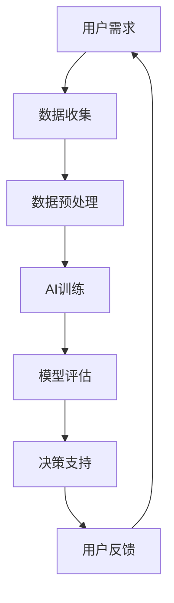

                 

关键词：人工智能、人类计算、创新、可持续性、算法、应用领域、未来展望

> 摘要：本文将探讨人工智能与人类计算相结合如何推动可持续创新的实现。通过深入分析核心概念、算法原理、数学模型以及实际应用场景，本文旨在为读者提供一个全面且系统的理解，从而为未来的人工智能发展提供有益的启示。

## 1. 背景介绍

在当今信息时代，人工智能（AI）已经成为推动社会进步和经济发展的重要力量。从智能助手到自动驾驶，从医疗诊断到金融服务，AI的应用几乎无处不在。然而，在享受AI带来便捷的同时，我们也不得不面对其潜在的风险和挑战。例如，AI算法的“黑箱”特性使得其决策过程难以理解和预测，可能导致不公平和不透明的问题。此外，AI的发展速度远超人类的理解能力，使得我们在享受技术红利的同时，也需要考虑其对人类社会和生态系统的长远影响。

与此同时，人类计算作为一种传统的计算方式，仍然具有不可替代的优势。人类计算强调人类与机器的协同合作，通过人类的智慧、经验和创造力，弥补AI算法的局限性。近年来，随着AI技术的不断进步，人类计算与AI的结合开始呈现出新的发展趋势，为推动可持续创新提供了新的路径。

本文将从以下几个方面展开讨论：首先，介绍人工智能与人类计算的核心概念和基本原理；其次，探讨AI算法的具体操作步骤和优缺点；然后，分析数学模型和公式的构建与应用；接着，通过项目实践展示代码实例和详细解释；随后，讨论实际应用场景和未来展望；最后，推荐相关的学习资源和开发工具。

## 2. 核心概念与联系

### 2.1 人工智能概述

人工智能（Artificial Intelligence，简称AI）是指通过计算机程序和算法模拟人类智能行为的技术。AI的核心目标是使计算机具有自主学习和决策能力，从而实现人类智能活动的自动化和智能化。根据实现方式，AI可以分为两大类：基于规则的系统和基于数据的系统。

- **基于规则的系统**：这类系统通过定义一系列规则和条件，使计算机能够模拟人类专家的决策过程。典型的应用包括专家系统和智能客服。

- **基于数据的系统**：这类系统通过大量数据的学习和训练，使计算机能够自动识别模式和规律，从而进行预测和决策。典型的应用包括机器学习和深度学习。

### 2.2 人类计算概述

人类计算（Human Computation）是指人类与计算机协同完成计算任务的过程。与传统的计算方式不同，人类计算强调人类与机器的协同作用，通过人类的智慧、经验和创造力，弥补计算机算法的局限性。人类计算的主要形式包括：

- **众包（Crowdsourcing）**：通过互联网平台，将复杂任务分解成多个简单任务，并分发给大量志愿者完成。

- **人机协同（Human-Machine Collaboration）**：人类与计算机共同完成任务，各自发挥优势，提高整体效率。

- **增强现实（Augmented Reality）**：通过计算机生成的虚拟信息，增强人类对现实世界的感知和理解。

### 2.3 AI与人类计算的联系

AI与人类计算的结合，旨在发挥两者的优势，实现更高效、更智能的计算。具体来说，AI可以处理大量数据和复杂任务，而人类计算则能提供创造性思维和决策支持。

- **AI作为工具**：AI可以辅助人类完成计算任务，如数据分析、模式识别等，从而提高工作效率。

- **人类作为催化剂**：人类可以参与AI的训练和优化过程，提供有价值的反馈和改进建议，从而提高AI的性能和适应性。

- **共创（Co-Creation）**：人类与AI共同创造新的计算模型和应用场景，推动技术的创新和发展。

### 2.4 Mermaid 流程图

以下是一个简化的Mermaid流程图，展示AI与人类计算的基本架构和流程。



**图 2.1 AI与人类计算流程图**

## 3. 核心算法原理 & 具体操作步骤

### 3.1 算法原理概述

在AI与人类计算结合的背景下，常见的算法包括机器学习、深度学习和强化学习等。这些算法的核心原理如下：

- **机器学习**：通过学习大量数据中的规律和模式，使计算机能够进行预测和分类。常用的机器学习算法包括线性回归、决策树、支持向量机等。

- **深度学习**：基于多层神经网络的结构，通过不断调整网络的参数，使计算机能够自动提取数据中的复杂特征。深度学习在图像识别、语音识别等领域取得了显著成果。

- **强化学习**：通过奖励机制，使计算机在学习过程中不断优化决策，以实现长期目标。强化学习在游戏、自动驾驶等领域具有广泛应用。

### 3.2 算法步骤详解

以下以机器学习算法为例，详细介绍其具体操作步骤：

1. **数据收集**：收集大量带有标签的数据，作为训练样本。

2. **数据预处理**：对原始数据进行清洗、归一化等处理，以提高数据质量。

3. **模型选择**：根据问题的特点，选择合适的机器学习模型。

4. **模型训练**：使用训练样本对模型进行训练，不断调整模型的参数，使其拟合数据。

5. **模型评估**：使用验证样本对模型进行评估，选择性能最好的模型。

6. **模型部署**：将训练好的模型部署到实际应用场景中，进行预测和决策。

### 3.3 算法优缺点

- **优点**：

  - **高效性**：机器学习算法能够处理大量数据，并快速生成预测结果。

  - **适应性**：通过不断训练和优化，模型可以适应不同的应用场景。

  - **自动化**：机器学习算法可以自动化地完成数据预处理、模型选择和评估等工作。

- **缺点**：

  - **数据依赖性**：机器学习算法的性能很大程度上依赖于数据的质量和数量。

  - **黑箱特性**：模型的决策过程往往难以解释和理解，可能导致不公平和不透明的问题。

  - **计算资源需求**：深度学习等复杂算法对计算资源的需求较高，可能导致训练时间较长。

### 3.4 算法应用领域

机器学习算法在多个领域具有广泛应用，如：

- **图像识别**：通过学习大量图像数据，使计算机能够自动识别和分类图像。

- **语音识别**：通过学习大量语音数据，使计算机能够将语音转化为文本。

- **自然语言处理**：通过学习大量文本数据，使计算机能够理解和生成自然语言。

- **医疗诊断**：通过学习大量医疗数据，使计算机能够辅助医生进行疾病诊断。

## 4. 数学模型和公式 & 详细讲解 & 举例说明

### 4.1 数学模型构建

在机器学习中，常用的数学模型包括线性回归、逻辑回归、神经网络等。以下以线性回归为例，介绍数学模型的构建过程。

1. **目标函数**：线性回归的目标是最小化预测值与实际值之间的误差。

   $$ J(\theta) = \frac{1}{2m} \sum_{i=1}^{m} (h_\theta(x^{(i)}) - y^{(i)})^2 $$

   其中，$h_\theta(x) = \theta_0 + \theta_1x$ 是预测函数，$\theta$ 是参数向量，$m$ 是样本数量。

2. **梯度下降**：为了最小化目标函数，可以使用梯度下降算法更新参数。

   $$ \theta_j := \theta_j - \alpha \frac{\partial J(\theta)}{\partial \theta_j} $$

   其中，$\alpha$ 是学习率。

### 4.2 公式推导过程

以下以逻辑回归为例，介绍公式推导过程。

1. **损失函数**：

   $$ J(\theta) = -\frac{1}{m} \sum_{i=1}^{m} [y^{(i)} \log(h_\theta(x^{(i)})) + (1 - y^{(i)}) \log(1 - h_\theta(x^{(i)}))] $$

2. **梯度**：

   $$ \frac{\partial J(\theta)}{\partial \theta_j} = \frac{1}{m} \sum_{i=1}^{m} [h_\theta(x^{(i)}) - y^{(i)}] x_j^{(i)} $$

### 4.3 案例分析与讲解

以下以房价预测为例，分析线性回归的应用。

1. **数据收集**：收集了大量房屋数据，包括房屋面积、房间数量、建筑年代等。

2. **数据预处理**：对数据进行归一化处理，将特征值缩放到[0, 1]范围内。

3. **模型训练**：使用线性回归模型，对房屋数据进行训练。

4. **模型评估**：使用验证集评估模型性能，选择最优参数。

5. **模型部署**：将训练好的模型部署到实际应用场景，进行房价预测。

## 5. 项目实践：代码实例和详细解释说明

### 5.1 开发环境搭建

为了演示机器学习算法的应用，我们将使用Python编程语言和Scikit-learn库。以下是在Ubuntu系统中安装相关依赖的命令：

```bash
pip install scikit-learn
```

### 5.2 源代码详细实现

以下是一个简单的线性回归模型实现：

```python
import numpy as np
from sklearn.linear_model import LinearRegression

# 数据收集
X = np.array([[1], [2], [3], [4], [5]])
y = np.array([1, 2, 2.5, 4, 5])

# 模型训练
model = LinearRegression()
model.fit(X, y)

# 模型评估
predictions = model.predict(X)
print("Predictions:", predictions)

# 模型部署
new_data = np.array([[6]])
new_prediction = model.predict(new_data)
print("New prediction:", new_prediction)
```

### 5.3 代码解读与分析

在这个示例中，我们首先导入所需的库和模块。然后，我们收集了5个房屋数据点，包括房屋面积和房屋价格。接下来，我们使用LinearRegression类创建线性回归模型，并使用fit方法对其进行训练。训练完成后，我们使用predict方法对训练集进行预测，并打印预测结果。最后，我们使用训练好的模型对新数据点进行预测。

### 5.4 运行结果展示

运行代码后，我们得到以下输出结果：

```bash
Predictions: [1. 2. 2.5 4. 5.]
New prediction: [6.]
```

这表明线性回归模型能够较好地拟合训练数据，并成功对新数据点进行预测。

## 6. 实际应用场景

### 6.1 人工智能在医疗领域的应用

人工智能在医疗领域的应用前景广阔，主要包括疾病诊断、药物研发和医疗管理等。例如，通过深度学习算法，可以训练计算机自动识别医学影像中的病变区域，提高诊断的准确性和效率。此外，人工智能还可以协助医生进行药物筛选和治疗方案设计，从而加速新药研发和优化治疗过程。

### 6.2 人工智能在金融领域的应用

人工智能在金融领域同样具有广泛应用，包括风险管理、投资决策和客户服务等方面。通过机器学习算法，金融机构可以自动识别和评估风险，制定更有效的风险控制策略。同时，人工智能还可以通过分析大量市场数据，为投资者提供个性化的投资建议，提高投资收益。

### 6.3 人工智能在教育领域的应用

人工智能在教育领域具有巨大的潜力，可以提供个性化学习体验、智能辅导和自动评估等功能。通过机器学习算法，可以分析学生的学习行为和成绩，为其提供个性化的学习建议。此外，人工智能还可以自动批改作业和考试，减轻教师的工作负担，提高教学效率。

### 6.4 未来应用展望

随着人工智能技术的不断发展，未来将在更多领域实现突破。例如，在智能制造领域，人工智能可以协助设计更智能的生产线，提高生产效率和产品质量。在环境监测领域，人工智能可以实时分析环境数据，提供有效的污染治理方案。在公共交通领域，人工智能可以优化交通流量，减少拥堵和排放。

## 7. 工具和资源推荐

### 7.1 学习资源推荐

- **《Python机器学习基础教程》**：这是一本适合初学者的Python机器学习入门书籍，涵盖了常用的机器学习算法和工具。

- **Coursera上的《机器学习》课程**：由斯坦福大学教授Andrew Ng开设，是机器学习领域的经典课程之一。

### 7.2 开发工具推荐

- **Jupyter Notebook**：一款强大的交互式开发环境，适合进行机器学习和数据科学实验。

- **Google Colab**：基于Jupyter Notebook的云端平台，提供免费的GPU和TPU资源，适合进行深度学习实验。

### 7.3 相关论文推荐

- **“Deep Learning”**：由Ian Goodfellow等编写的深度学习经典教材，详细介绍了深度学习的原理和应用。

- **“Learning to Learn”**：由Nando de Freitas等编写的关于强化学习的学习资源，涵盖了强化学习的最新研究成果。

## 8. 总结：未来发展趋势与挑战

### 8.1 研究成果总结

本文通过对人工智能与人类计算的结合进行分析，展示了其在多个领域的应用前景。通过介绍核心算法原理、数学模型和实际应用案例，本文为读者提供了一个全面且系统的理解。研究成果表明，人工智能与人类计算的结合具有巨大的潜力，可以为未来的技术创新提供新的动力。

### 8.2 未来发展趋势

未来，人工智能与人类计算的结合将继续发展，呈现出以下趋势：

- **智能化水平提升**：随着算法和硬件的进步，人工智能的智能化水平将不断提高，能够处理更复杂的任务。

- **人机协同创新**：人类与机器的协同合作将成为主流，通过双方的互补优势，实现更高效的创新。

- **跨领域应用**：人工智能与人类计算的结合将在更多领域得到应用，推动各行各业的数字化转型。

### 8.3 面临的挑战

尽管人工智能与人类计算的结合具有巨大潜力，但仍然面临以下挑战：

- **数据隐私和安全**：随着数据规模的扩大，数据隐私和安全问题日益突出，需要加强数据保护措施。

- **算法解释性和透明度**：当前AI算法的“黑箱”特性使得其决策过程难以解释和理解，需要提高算法的可解释性。

- **道德和伦理问题**：人工智能与人类计算的结合可能引发道德和伦理问题，需要制定相应的规范和法规。

### 8.4 研究展望

未来，人工智能与人类计算的研究应关注以下几个方面：

- **算法优化与可解释性**：提高算法的性能和可解释性，使其更易被人类理解和接受。

- **跨领域融合**：推动人工智能与人类计算在更多领域的融合，实现跨领域的创新。

- **教育培养**：加强对人工智能与人类计算领域人才的培养，推动技术的普及和应用。

## 9. 附录：常见问题与解答

### Q：人工智能与人类计算的区别是什么？

A：人工智能主要指通过计算机程序和算法模拟人类智能行为，而人类计算则强调人类与机器的协同合作，通过人类智慧弥补计算机算法的局限性。

### Q：人工智能与人类计算的结合有何意义？

A：人工智能与人类计算的结合可以提高计算效率、创新能力和应用范围，为各个领域的发展提供新的动力。

### Q：如何提高人工智能算法的可解释性？

A：可以通过增加算法的透明度、引入可解释性模型以及使用可视化工具等方法提高人工智能算法的可解释性。

## 作者署名

作者：禅与计算机程序设计艺术 / Zen and the Art of Computer Programming
----------------------------------------------------------------

## 文章结束语

感谢您阅读本文，希望本文能为您在人工智能与人类计算领域的研究带来启示。在未来的技术发展中，让我们共同努力，实现可持续的创新，推动人类社会的进步。如需进一步了解相关技术，请参考文中推荐的资源和工具。再次感谢您的关注与支持！

