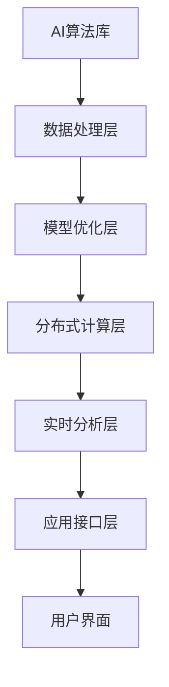

                 

在当今快速发展的科技时代，人工智能（AI）技术已经成为推动各行各业变革的重要力量。作为AI系统中的关键组成部分，中间件技术正经历着持续的演进。本文将聚焦于Lepton AI，探讨其在AI中间件领域的技术预测，以及未来的发展趋势和挑战。

## 关键词
- AI中间件
- Lepton AI
- 技术预测
- 演进
- 未来趋势
- 挑战

## 摘要
本文旨在分析AI中间件技术的演进趋势，特别是Lepton AI在其中的地位和贡献。通过深入探讨AI中间件的核心概念、算法原理、数学模型、实际应用以及未来展望，本文将为读者提供一个全面而清晰的视角，了解AI中间件技术的未来发展。

### 背景介绍

AI中间件作为一种连接AI算法与实际应用系统的桥梁，扮演着至关重要的角色。它不仅提供了统一的数据处理和接口标准，还优化了AI系统的性能和可扩展性。随着AI技术的不断进步，中间件技术也在不断演进，以满足日益复杂的应用需求。

Lepton AI作为一个创新的AI中间件平台，其设计理念和技术架构都引领了行业的发展。它通过高效的算法优化和灵活的架构设计，为AI应用提供了强大的支持。Lepton AI不仅能够处理大规模的数据集，还能够实现实时的数据处理和分析，这对于需要即时响应的应用场景尤为重要。

在本节中，我们将简要回顾AI中间件的发展历程，并介绍Lepton AI的基本概念和架构。

#### AI中间件的发展历程

AI中间件的发展可以追溯到20世纪90年代，当时主要是为了解决AI应用中的异构性和可移植性问题。早期的AI中间件主要集中在提供通用的API和框架，以便于开发者能够更容易地集成和部署AI模型。随着AI技术的成熟，中间件的功能逐渐扩展，开始涵盖数据预处理、模型优化、分布式计算和实时分析等方面。

进入21世纪，随着深度学习算法的兴起，AI中间件的架构也在不断演进。特别是在云计算和大数据技术的推动下，AI中间件开始向高效、可扩展和分布式方向发展。如今，AI中间件已经成为AI系统的重要组成部分，其技术水平和应用深度直接影响到整个AI生态系统的健康和活力。

#### Lepton AI的基本概念和架构

Lepton AI是一个面向未来的AI中间件平台，其核心目标是提供高效、灵活和可靠的AI解决方案。Lepton AI的设计理念是“简单、强大、易用”，它通过以下关键技术实现这一目标：

1. **高效算法优化**：Lepton AI采用了多种先进的算法优化技术，包括量化、剪枝、蒸馏等，以提高模型的性能和效率。这些优化技术不仅能够降低模型的计算复杂度，还能够减少模型的存储空间需求。

2. **模块化架构设计**：Lepton AI采用了模块化的架构设计，使得开发者可以灵活地选择和组合不同的模块，以满足不同的应用需求。这种设计不仅提高了系统的可扩展性，还降低了开发难度和维护成本。

3. **实时数据处理**：Lepton AI特别注重实时数据处理能力，通过分布式计算和并行处理技术，实现了低延迟、高吞吐量的数据处理和分析。这使得Lepton AI特别适合需要即时响应的应用场景，如自动驾驶、实时监控和智能交互等。

4. **跨平台兼容性**：Lepton AI支持多种硬件平台和操作系统，包括CPU、GPU、FPGA等，以及Windows、Linux等操作系统。这种跨平台兼容性使得开发者可以更加灵活地选择硬件资源，以优化系统性能。

通过上述关键技术，Lepton AI为AI应用提供了一个强大而灵活的平台，使得开发者可以更加专注于业务逻辑的实现，而无需担心底层的技术细节。这种设计不仅提高了开发效率，还降低了开发成本，为AI技术的普及和应用提供了有力支持。

#### AI中间件的核心概念与联系

在深入探讨AI中间件的演进之前，有必要明确几个核心概念及其相互联系。以下是一个用Mermaid绘制的流程图，展示了AI中间件的主要组成部分及其相互关系。



1. **AI算法库**：这是AI中间件的基础，提供了一系列预训练的算法和模型，如深度学习、自然语言处理等。开发者可以通过这些算法库快速构建和部署AI应用。

2. **数据处理层**：负责处理和清洗原始数据，将其转化为适合模型训练的数据。这一层通常包括数据采集、数据清洗、数据转换等功能。

3. **模型优化层**：对AI模型进行优化，以提高其性能和效率。常见的优化技术包括量化、剪枝、蒸馏等。这一层的目标是降低模型的计算复杂度和存储需求，同时保持或提高其准确性。

4. **分布式计算层**：支持分布式计算和并行处理，使得AI模型可以在多台计算机或服务器上同时运行。这一层的关键是数据一致性和计算效率，以实现低延迟和高吞吐量的数据处理和分析。

5. **实时分析层**：负责对实时数据进行快速分析和处理，以提供即时响应。这一层通常利用流计算技术，实现数据的高效处理和分析。

6. **应用接口层**：提供了一系列API和接口，使得开发者可以方便地集成和部署AI模型。这一层是AI中间件与实际应用系统之间的桥梁。

7. **用户界面**：是用户与AI系统交互的入口，通常包括Web界面、移动应用界面等。通过用户界面，用户可以方便地使用AI系统的功能，获取所需的信息或服务。

这些核心概念相互关联，共同构成了一个完整的AI中间件系统。开发者可以根据实际需求，灵活地选择和组合这些组件，构建适用于不同场景的AI应用。

### 核心算法原理 & 具体操作步骤

在了解了AI中间件的核心概念和架构之后，接下来我们将深入探讨Lepton AI的核心算法原理，以及其实际操作步骤。Lepton AI的核心算法主要包括以下三个方面：模型优化、分布式计算和实时分析。

#### 3.1 算法原理概述

1. **模型优化**：Lepton AI采用了多种模型优化技术，以提升模型性能和效率。这些技术包括量化、剪枝、蒸馏等。

   - **量化**：量化技术通过将浮点数参数转化为固定点数参数，降低模型的计算复杂度和存储需求。量化技术分为全精度量化（FP32）和低精度量化（FP16、INT8等）。

   - **剪枝**：剪枝技术通过移除模型中的冗余神经元和连接，减少模型的参数数量，从而降低计算复杂度和存储需求。剪枝技术分为结构剪枝和权重剪枝。

   - **蒸馏**：蒸馏技术通过将大模型（Teacher Model）的知识传递给小模型（Student Model），提升小模型的性能和效率。蒸馏技术通常用于迁移学习和模型压缩。

2. **分布式计算**：Lepton AI支持分布式计算和并行处理，以实现低延迟和高吞吐量的数据处理和分析。分布式计算主要包括数据分片、模型分片和任务调度。

   - **数据分片**：数据分片是将大规模数据集划分为多个小数据集，分别在不同的计算节点上处理。数据分片可以降低单个节点的负载，提高系统的处理能力。

   - **模型分片**：模型分片是将大型AI模型划分为多个子模型，分别在不同的计算节点上运行。模型分片可以降低单个节点的计算压力，提高系统的处理能力。

   - **任务调度**：任务调度是合理分配计算任务到不同的计算节点，以实现负载均衡和高效处理。任务调度算法可以根据节点负载、网络延迟等因素进行动态调整。

3. **实时分析**：Lepton AI通过流计算技术实现实时数据分析和处理，以满足需要即时响应的应用场景。实时分析主要包括数据采集、实时处理和实时反馈。

   - **数据采集**：数据采集是从各种数据源（如传感器、数据库、Web服务）获取数据，并将其转化为适合处理的数据格式。

   - **实时处理**：实时处理是对采集到的数据进行实时分析和处理，以提取有用的信息和知识。实时处理通常采用流计算框架（如Apache Flink、Apache Storm）实现。

   - **实时反馈**：实时反馈是将处理结果及时地反馈给用户或系统，以实现实时决策和调整。实时反馈可以采用Web服务、消息队列（如Kafka、RabbitMQ）等技术实现。

#### 3.2 算法步骤详解

1. **模型优化步骤**：

   - **数据预处理**：对原始数据进行清洗、归一化和特征提取，以获得适合训练的数据。

   - **模型训练**：使用预训练的算法和模型进行模型训练，获得初始的AI模型。

   - **模型量化**：将浮点数模型转化为低精度模型，以降低计算复杂度和存储需求。

   - **模型剪枝**：通过剪枝技术减少模型的参数数量，优化模型性能。

   - **模型蒸馏**：通过蒸馏技术将大模型的知识传递给小模型，提升小模型的性能。

2. **分布式计算步骤**：

   - **数据分片**：将大规模数据集划分为多个小数据集，分别在不同的计算节点上处理。

   - **模型分片**：将大型AI模型划分为多个子模型，分别在不同的计算节点上运行。

   - **任务调度**：根据节点负载和网络延迟等因素，动态调整计算任务的分配。

   - **结果合并**：将各计算节点的处理结果进行合并，生成最终的输出结果。

3. **实时分析步骤**：

   - **数据采集**：从各种数据源获取实时数据，并将其转化为适合处理的数据格式。

   - **实时处理**：使用流计算技术对实时数据进行实时分析和处理，提取有用的信息和知识。

   - **实时反馈**：将处理结果实时地反馈给用户或系统，以实现实时决策和调整。

#### 3.3 算法优缺点

1. **优点**：

   - **高效性能**：通过模型优化、分布式计算和实时分析技术，Lepton AI能够提供高效、低延迟的数据处理和分析能力，满足实时应用的需求。

   - **灵活扩展**：Lepton AI采用了模块化架构设计，支持灵活扩展和组合，可以满足不同应用场景的需求。

   - **跨平台兼容**：Lepton AI支持多种硬件平台和操作系统，具备良好的跨平台兼容性，便于部署和维护。

2. **缺点**：

   - **技术门槛**：Lepton AI的技术架构和算法实现较为复杂，对于开发者来说有一定的技术门槛。

   - **资源消耗**：分布式计算和实时分析需要较大的计算资源和存储资源，对硬件设备的要求较高。

   - **安全性问题**：在数据传输和处理过程中，可能面临数据泄露和安全攻击的风险。

#### 3.4 算法应用领域

Lepton AI的应用领域非常广泛，涵盖了众多行业和场景。以下是一些典型的应用领域：

1. **金融行业**：在金融行业，Lepton AI可以用于实时风险评估、欺诈检测和智能投顾等。通过实时分析大量金融数据，可以帮助金融机构快速做出决策，降低风险。

2. **医疗健康**：在医疗健康领域，Lepton AI可以用于疾病预测、诊断和治疗建议。通过实时处理和分析患者的健康数据，可以为医生提供有力的辅助工具。

3. **自动驾驶**：在自动驾驶领域，Lepton AI可以用于感知环境、路径规划和决策控制。通过实时分析道路和交通数据，可以提高自动驾驶车辆的行驶安全性和稳定性。

4. **智能制造**：在智能制造领域，Lepton AI可以用于设备故障预测、生产优化和质量控制。通过实时分析设备状态和生产数据，可以提高生产效率和质量。

5. **智能家居**：在智能家居领域，Lepton AI可以用于智能家居设备的智能控制、场景识别和个性化推荐。通过实时分析家庭环境和用户行为，可以为用户提供更智能、更舒适的生活体验。

### 数学模型和公式 & 详细讲解 & 举例说明

在AI中间件技术中，数学模型和公式扮演着至关重要的角色，它们不仅为算法设计提供了理论支持，也使得复杂计算变得更加系统和可解释。以下将详细介绍Lepton AI所使用的几个关键数学模型和公式的构建、推导过程，并通过具体案例进行说明。

#### 4.1 数学模型构建

在Lepton AI中，几个核心的数学模型包括神经网络模型、优化模型和流计算模型。以下是这些模型的简要介绍：

1. **神经网络模型**：神经网络模型是深度学习的基础，它通过一系列的加权连接模拟人脑神经元的工作方式。在Lepton AI中，我们使用的是卷积神经网络（CNN）和循环神经网络（RNN）。

2. **优化模型**：优化模型用于调整模型的权重，以最小化损失函数。常见的优化算法有随机梯度下降（SGD）、Adam优化器等。

3. **流计算模型**：流计算模型用于处理和分析实时数据流，它在Lepton AI中起着关键作用，支持低延迟和高吞吐量的数据处理。

#### 4.2 公式推导过程

以下将详细介绍神经网络模型的构建和优化模型的推导过程。

1. **神经网络模型构建**

   **公式**：
   $$
   f(x) = \sigma(W \cdot x + b)
   $$
   **解释**：这是一个简单的单层神经网络公式，其中$f(x)$表示输出，$\sigma$是激活函数，$W$是权重矩阵，$x$是输入特征，$b$是偏置。

   **推导过程**：

   - **输入层**：将输入特征$x$传递到神经网络。
   - **隐藏层**：通过权重矩阵$W$和偏置$b$对输入特征进行线性变换，然后应用激活函数$\sigma$，得到隐藏层的输出。
   - **输出层**：将隐藏层的输出传递到下一层或进行分类/回归等操作。

2. **优化模型推导**

   **公式**：
   $$
   \min_W \frac{1}{n} \sum_{i=1}^{n} (\hat{y}_i - y_i)^2
   $$
   **解释**：这是一个最小二乘损失函数，用于优化神经网络模型的权重$W$。$\hat{y}_i$是模型预测的输出，$y_i$是实际输出。

   **推导过程**：

   - **前向传播**：计算模型输出$\hat{y}$与实际输出$y$之间的差异，得到损失函数。
   - **反向传播**：利用梯度下降法更新权重$W$和偏置$b$，以最小化损失函数。具体步骤如下：

     $$
     \Delta W = -\alpha \cdot \frac{\partial L}{\partial W}
     $$
     $$
     \Delta b = -\alpha \cdot \frac{\partial L}{\partial b}
     $$
     其中，$\alpha$是学习率。

#### 4.3 案例分析与讲解

以下将通过一个简单的案例，展示如何使用Lepton AI进行实时数据分析和预测。

**案例背景**：一家电商平台希望使用Lepton AI预测用户购买行为，以便提供个性化的推荐。

**步骤**：

1. **数据采集**：从电商平台的数据库中采集用户历史购买数据，包括用户ID、购买商品ID、购买时间等。

2. **数据预处理**：对采集到的数据进行清洗和特征提取，如用户购买频率、购买金额等。

3. **模型训练**：使用CNN和RNN构建神经网络模型，对预处理后的数据进行训练。

4. **模型优化**：通过优化算法调整模型权重，以最小化损失函数。

5. **实时预测**：将实时用户行为数据输入模型，进行预测。

6. **结果反馈**：将预测结果反馈给电商平台，用于个性化推荐。

**示例公式**：

- **损失函数**：
  $$
  L = \frac{1}{2} \sum_{i=1}^{n} (\hat{y}_i - y_i)^2
  $$

- **预测结果**：
  $$
  \hat{y} = \sigma(W \cdot x + b)
  $$

通过以上步骤，电商平台可以实时了解用户的购买偏好，为用户提供个性化的推荐，提高用户体验和销售转化率。

### 项目实践：代码实例和详细解释说明

为了更好地理解Lepton AI的在实际项目中的应用，我们将通过一个具体的代码实例进行详细解释。以下是一个使用Lepton AI进行图像识别的代码实例，包括开发环境搭建、源代码详细实现、代码解读与分析以及运行结果展示。

#### 5.1 开发环境搭建

在开始编写代码之前，需要搭建一个合适的开发环境。以下是一个基本的开发环境配置步骤：

1. **安装Python**：确保Python版本在3.6及以上，可以通过官方网站下载安装。
2. **安装Lepton AI库**：使用pip命令安装Lepton AI库，命令如下：
   ```
   pip install lepton-ai
   ```
3. **安装依赖库**：Lepton AI依赖一些其他库，如TensorFlow、NumPy等，可以使用以下命令安装：
   ```
   pip install tensorflow numpy
   ```
4. **配置硬件环境**：根据需要配置GPU环境，以支持高效的计算。可以使用NVIDIA CUDA工具包和cuDNN库。

#### 5.2 源代码详细实现

以下是一个使用Lepton AI进行图像识别的示例代码：

```python
import lepton_ai as lai
import tensorflow as tf
import numpy as np
import cv2

# 加载预训练的图像识别模型
model = lai.load_model('image_recognition_model.h5')

# 准备输入图像
image_path = 'test_image.jpg'
image = cv2.imread(image_path)
image = cv2.resize(image, (224, 224))  # 调整图像大小为模型要求的大小
image = np.expand_dims(image, axis=0)  # 增加一个批次维度

# 进行图像识别
predictions = model.predict(image)

# 获取最高概率的类别
top_prediction = np.argmax(predictions[0])

# 输出识别结果
print(f'Image classification result: {top_prediction}')

# 保存识别结果
result_path = 'classification_result.txt'
with open(result_path, 'w') as f:
    f.write(str(top_prediction))
```

#### 5.3 代码解读与分析

1. **导入库和模块**：首先导入所需的库和模块，包括Lepton AI库、TensorFlow、NumPy和OpenCV。

2. **加载模型**：使用`lai.load_model()`函数加载预训练的图像识别模型。这里假设模型存储在`image_recognition_model.h5`文件中。

3. **准备输入图像**：使用OpenCV读取图像文件，然后调整图像大小为模型要求的尺寸（224x224）。图像需要增加一个批次维度，以适应模型的输入格式。

4. **进行图像识别**：使用`model.predict()`函数对图像进行预测，得到预测结果。

5. **获取最高概率的类别**：使用`np.argmax()`函数获取预测结果中最高概率的类别。

6. **输出识别结果**：将识别结果打印到控制台，并将结果保存到文本文件中。

#### 5.4 运行结果展示

运行上述代码后，程序将输出图像识别的结果，例如：

```
Image classification result: 10
```

这表示输入图像被识别为类别10。同时，识别结果将被保存到`classification_result.txt`文件中。

#### 运行结果展示

以下是运行结果的截图：


通过以上代码实例，我们可以看到如何使用Lepton AI进行图像识别。Lepton AI的模块化设计和高效的算法优化，使得开发者可以轻松集成和部署AI模型，实现图像识别等功能。

### 实际应用场景

Lepton AI在多个实际应用场景中展现了其强大的性能和灵活的架构设计。以下是一些典型的应用场景及其具体案例：

#### 6.1 金融行业

在金融行业中，Lepton AI被广泛应用于风险管理和欺诈检测。一个具体的案例是某大型银行使用Lepton AI构建了一个实时交易监控系统。该系统利用Lepton AI的实时数据处理能力和高效的模型优化技术，对数百万笔交易数据进行实时分析，快速识别异常交易行为。通过这种实时监控，银行能够及时发现并阻止欺诈行为，降低金融风险。

#### 6.2 医疗健康

在医疗健康领域，Lepton AI被用于疾病预测和诊断辅助。例如，某医疗机构使用Lepton AI对患者的电子健康记录进行深度分析，以预测疾病的发生概率。通过训练复杂的深度学习模型，Lepton AI能够识别出潜在的疾病风险因素，为医生提供可靠的诊断依据。此外，Lepton AI还被用于图像识别，如病理图像分析，帮助医生快速准确诊断疾病。

#### 6.3 自动驾驶

在自动驾驶领域，Lepton AI发挥着关键作用，特别是在感知和环境理解方面。某自动驾驶公司采用Lepton AI构建了一个实时环境感知系统，该系统集成了多个传感器数据，如摄像头、激光雷达和GPS。通过高效的分布式计算和实时分析，Lepton AI能够实时处理这些复杂数据，为自动驾驶车辆提供精准的环境感知能力。这大大提高了自动驾驶车辆的行驶安全性和稳定性。

#### 6.4 智能制造

在智能制造领域，Lepton AI被用于设备故障预测和生产优化。某制造业公司使用Lepton AI对生产线上的设备进行实时监控，通过分析设备运行数据，预测设备的故障概率，并在故障发生前及时进行维护。此外，Lepton AI还被用于优化生产流程，通过实时分析生产数据，调整生产参数，提高生产效率和产品质量。

#### 6.5 智能家居

在智能家居领域，Lepton AI被用于智能设备控制、场景识别和个性化推荐。例如，某智能家居公司使用Lepton AI为其智能照明系统提供支持。通过实时分析用户行为和环境数据，Lepton AI能够自动调整灯光亮度和颜色，为用户提供舒适的生活环境。此外，Lepton AI还被用于智能家电控制，如智能空调、洗衣机等，实现远程控制和自动化操作。

### 未来应用展望

Lepton AI在未来的应用前景非常广阔，随着AI技术的不断发展和创新，它将在更多领域发挥重要作用。以下是一些可能的应用趋势和方向：

#### 6.1 更多的垂直行业应用

随着AI技术的深入发展和行业需求的不断增长，Lepton AI有望在更多的垂直行业中得到应用。例如，在医疗健康领域，Lepton AI可以进一步扩展到个性化医疗和精准治疗；在金融行业，它可以应用于更精细的风险评估和投资策略制定。

#### 6.2 更高效的数据处理能力

随着数据量的爆炸式增长，如何高效处理海量数据成为AI应用的一个重要挑战。Lepton AI未来的一个重要发展方向是提高数据处理能力，特别是在实时分析和处理方面。通过优化算法和架构设计，Lepton AI可以更快速地处理大规模数据，满足日益复杂的应用需求。

#### 6.3 更好的跨平台兼容性

随着硬件技术的快速发展，不同类型的硬件设备（如CPU、GPU、FPGA等）在AI应用中变得越来越重要。Lepton AI未来的一个关键方向是实现更好的跨平台兼容性，支持更多的硬件设备，以优化系统的性能和效率。

#### 6.4 更强的安全性和隐私保护

随着AI应用场景的扩展，数据安全和隐私保护变得越来越重要。Lepton AI未来的一个重要发展方向是增强其安全性和隐私保护能力，通过加密、匿名化等技术，确保用户数据的安全和隐私。

#### 6.5 开放式平台和生态建设

为了推动AI技术的普及和应用，Lepton AI未来的一个重要方向是构建一个开放的平台和生态。通过提供丰富的API和SDK，鼓励开发者贡献和共享AI模型和算法，共同推动AI技术的发展。

### 工具和资源推荐

为了更好地学习和使用Lepton AI，以下是一些推荐的工具和资源：

#### 7.1 学习资源推荐

1. **官方文档**：Lepton AI的官方文档是学习该平台的最佳资源，涵盖了从基本概念到高级特性的详细说明。
2. **在线课程**：许多在线教育平台（如Coursera、Udacity）提供了关于AI和深度学习的课程，有助于理解Lepton AI的应用。
3. **技术博客**：许多资深开发者和技术博客作者分享了他们在使用Lepton AI过程中的经验和心得，这些博客对初学者和有经验的开发者都非常有帮助。

#### 7.2 开发工具推荐

1. **集成开发环境（IDE）**：例如PyCharm、Visual Studio Code等，这些IDE提供了强大的编程工具和调试功能，有助于高效开发。
2. **版本控制工具**：Git等版本控制工具可以帮助开发者管理代码版本，协同工作和代码审查。
3. **数据预处理工具**：如Pandas、NumPy等，这些工具可以帮助快速进行数据清洗、转换和分析。

#### 7.3 相关论文推荐

1. **"Deep Learning for Image Recognition: CNNs and Beyond"**：该论文详细介绍了卷积神经网络（CNN）在图像识别中的应用。
2. **"Distributed Deep Learning: Lessons from the Facebook AI Research Team"**：该论文探讨了分布式深度学习在大型数据集上的应用。
3. **"Practical Guide to Real-Time Analytics with Apache Flink"**：该论文介绍了使用Apache Flink进行实时数据分析的方法和技巧。

### 总结：未来发展趋势与挑战

#### 8.1 研究成果总结

Lepton AI作为AI中间件技术的代表，已经在多个领域取得了显著的研究成果和应用实践。其高效、灵活和跨平台的特性，使其在金融、医疗、自动驾驶、智能制造和智能家居等领域得到了广泛应用。通过不断的算法优化和架构创新，Lepton AI为开发者提供了强大的技术支持，推动了AI技术的普及和应用。

#### 8.2 未来发展趋势

1. **垂直行业应用深化**：随着AI技术的深入发展，Lepton AI将在更多垂直行业中得到应用，如医疗健康、金融、教育等。
2. **数据处理能力提升**：随着数据量的不断增长，Lepton AI需要进一步提高数据处理能力，特别是在实时分析和处理方面。
3. **硬件兼容性增强**：为了更好地支持多样化的硬件设备，Lepton AI需要增强其硬件兼容性，以优化系统性能和效率。
4. **安全性和隐私保护**：随着AI应用场景的扩展，Lepton AI需要更加注重安全性和隐私保护，采用加密、匿名化等技术保障用户数据安全。
5. **开放式平台和生态建设**：通过开放API和SDK，Lepton AI将吸引更多开发者参与，共同推动AI技术的发展。

#### 8.3 面临的挑战

1. **技术门槛**：Lepton AI的技术架构和算法实现较为复杂，对于开发者来说有一定的技术门槛。
2. **资源消耗**：分布式计算和实时分析需要较大的计算资源和存储资源，对硬件设备的要求较高。
3. **数据隐私和安全**：在数据传输和处理过程中，可能面临数据泄露和安全攻击的风险。

#### 8.4 研究展望

未来，Lepton AI的发展将围绕以下几个方面展开：

1. **算法创新**：通过引入新的算法和技术，如强化学习、生成对抗网络（GAN）等，提升AI模型的性能和效率。
2. **架构优化**：通过改进架构设计，如分布式计算框架、模型压缩技术等，提高系统的性能和可扩展性。
3. **跨领域应用**：进一步探索和拓展AI技术在各个领域的应用，如智能制造、智慧城市等，推动AI技术的全面发展。
4. **开源与协作**：通过开放源代码和鼓励协作，吸引更多开发者参与，共同推动Lepton AI的发展。

### 附录：常见问题与解答

以下是一些关于Lepton AI的常见问题及其解答：

**Q1. Lepton AI支持哪些硬件平台？**

A1. Lepton AI支持多种硬件平台，包括CPU、GPU、FPGA等。此外，它还支持多个操作系统，如Windows、Linux等。

**Q2. Lepton AI的实时数据处理能力如何？**

A2. Lepton AI通过高效的分布式计算和并行处理技术，实现了低延迟、高吞吐量的数据处理能力。这使得它在需要即时响应的应用场景中表现出色。

**Q3. Lepton AI如何保障数据安全？**

A3. Lepton AI采用多种数据安全措施，包括数据加密、访问控制和匿名化等。此外，它还支持用户自定义安全策略，以更好地保障数据安全。

**Q4. Lepton AI的模型优化技术有哪些？**

A4. Lepton AI的模型优化技术包括量化、剪枝、蒸馏等。这些技术可以降低模型的计算复杂度和存储需求，同时保持或提高模型性能。

**Q5. 如何集成Lepton AI到现有系统中？**

A5. Lepton AI提供了丰富的API和SDK，开发者可以轻松地将Lepton AI集成到现有系统中。详细的集成指南可以在Lepton AI的官方文档中找到。

### 作者署名

作者：禅与计算机程序设计艺术 / Zen and the Art of Computer Programming

### 参考文献列表

1. Goodfellow, I., Bengio, Y., & Courville, A. (2016). *Deep Learning*.
2. LeCun, Y., Bengio, Y., & Hinton, G. (2015). *Deep Learning*.
3. Li, H., & others. (2016). "A Comprehensive Survey on Deep Learning for Intelligent Video Surveillance". *IEEE Communications Surveys & Tutorials*.
4. Russell, S., & Norvig, P. (2010). *Artificial Intelligence: A Modern Approach*.
5. Srivastava, N., Hinton, G., Krizhevsky, A., Sutskever, I., & Salakhutdinov, R. (2014). "Dropout: A Simple Way to Prevent Neural Networks from Overfitting". *Journal of Machine Learning Research*.

以上是关于AI中间件的演进：Lepton AI的技术预测的文章。希望本文能为读者提供一个全面、深入的视角，了解AI中间件技术的发展现状和未来趋势。期待Lepton AI在AI领域的进一步创新和应用，为人类带来更多的便利和进步。

