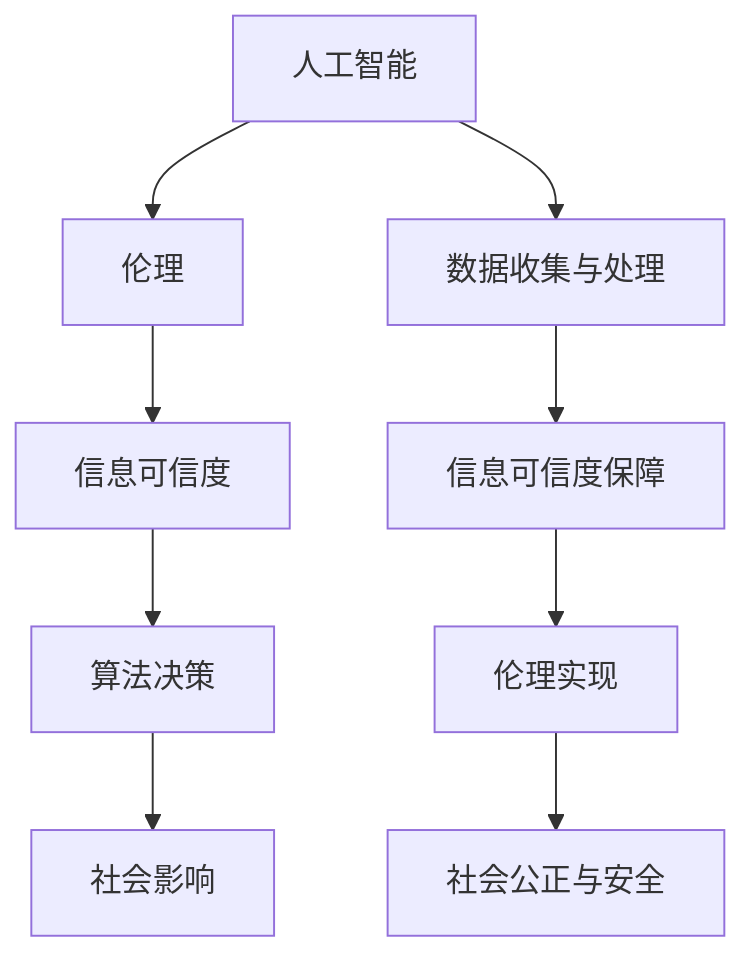

                 

关键词：人工智能伦理、信息可信度、算法公平性、算法透明性、AI安全性、数据隐私保护

> 摘要：本文探讨了人工智能（AI）伦理与信息可信度之间的关系，分析了AI伦理在现代社会的重要性。通过阐述AI伦理的核心原则，探讨了信息可信度在AI系统中的关键作用，并分析了当前AI伦理面临的挑战。本文还介绍了AI伦理在实际应用中的案例分析，并提出了未来在AI伦理与信息可信度方面的研究和发展方向。

## 1. 背景介绍

人工智能作为21世纪最具变革性的技术之一，已经渗透到社会的各个领域，从医疗保健、金融服务到交通运输和智能家居等。然而，随着AI技术的广泛应用，一系列伦理问题也日益凸显。特别是在数据隐私、算法公平性、透明性和安全性方面，AI伦理成为了公众和学术界关注的焦点。

信息可信度是指信息在真实、准确、完整和及时等方面的质量。在AI系统中，信息可信度对于算法的决策过程至关重要。如果AI系统依赖的是不可信的信息，那么其输出的结果也可能会出现偏差，甚至可能对人类造成危害。因此，确保AI系统的信息可信度是AI伦理的一个重要方面。

本文将深入探讨AI伦理与信息可信度之间的关系，分析AI伦理的核心原则，介绍当前AI伦理面临的挑战，并探讨未来在AI伦理与信息可信度方面的研究和发展方向。

## 2. 核心概念与联系

为了更好地理解AI伦理与信息可信度之间的关系，我们首先需要了解一些核心概念，包括人工智能、伦理、信息可信度和相关架构。

### 2.1 人工智能（AI）

人工智能是指使计算机系统能够模拟人类智能行为的技术和科学。AI系统通过机器学习、深度学习、自然语言处理等技术，可以自动地完成复杂任务，如图像识别、语音识别、决策制定等。

### 2.2 伦理

伦理是指关于道德和正确行为的理论体系。在AI领域，伦理关注的是AI系统的行为是否符合人类社会的道德标准，是否对人类和社会有益。

### 2.3 信息可信度

信息可信度是指信息在真实、准确、完整和及时等方面的质量。在AI系统中，信息可信度决定了算法决策的准确性。

### 2.4 AI伦理与信息可信度的联系

AI伦理与信息可信度之间的联系在于，信息可信度是AI伦理实现的重要保障。如果AI系统依赖的是不可信的信息，那么即使算法设计得再优秀，其决策结果也可能偏离真实情况，从而违背AI伦理。

下面是一个Mermaid流程图，展示了AI伦理与信息可信度的核心概念及其联系：



## 3. 核心算法原理 & 具体操作步骤

### 3.1 算法原理概述

AI伦理与信息可信度的核心算法原理在于如何确保AI系统在处理信息时能够保持高可信度。具体来说，这包括以下几个方面：

1. **数据质量控制**：在数据收集和预处理过程中，确保数据的质量，包括数据的真实性、准确性和完整性。
2. **算法透明性**：通过算法透明性，使AI系统的决策过程对用户和监管机构是可解释和可追溯的。
3. **算法公平性**：确保AI系统在不同群体之间不会产生偏见，避免对特定群体产生不公平的影响。
4. **算法安全性**：保护AI系统的数据不受恶意攻击，确保AI系统的稳定性和可靠性。

### 3.2 算法步骤详解

#### 步骤1：数据收集

数据收集是AI系统的第一步，也是最重要的一步。数据的质量直接影响到AI系统的表现。因此，在数据收集过程中，需要确保数据的真实性、准确性和完整性。

#### 步骤2：数据预处理

数据预处理包括数据清洗、数据归一化和数据转换等步骤。通过这些步骤，可以提高数据的质量，为后续的算法训练做好准备。

#### 步骤3：算法训练

在算法训练阶段，AI系统通过学习大量数据，提取特征并建立模型。为了确保算法的公平性和透明性，需要在训练过程中对模型进行多次验证和调整。

#### 步骤4：算法部署

算法部署是将训练好的模型部署到生产环境中，使其能够对外部数据进行实时处理。在部署过程中，需要确保算法的稳定性和安全性。

#### 步骤5：算法监控

算法监控是确保AI系统在运行过程中保持高可信度的重要手段。通过监控算法的性能和输出结果，可以及时发现和纠正潜在问题。

### 3.3 算法优缺点

#### 优点

- **高效率**：AI算法能够在短时间内处理大量数据，提高工作效率。
- **高准确性**：通过学习和优化，AI算法可以不断提高决策的准确性。
- **灵活性**：AI算法可以根据新的数据不断学习和调整，适应不同的应用场景。

#### 缺点

- **数据依赖性**：AI算法的性能很大程度上取决于数据的质量，如果数据存在问题，算法的决策结果也可能受到影响。
- **可解释性**：深度学习等复杂算法的决策过程往往难以解释，增加了算法的透明性问题。

### 3.4 算法应用领域

AI伦理与信息可信度的算法原理广泛应用于各个领域，如：

- **医疗保健**：通过分析患者数据，提供个性化的诊断和治疗建议。
- **金融**：通过分析金融数据，进行风险评估和投资决策。
- **交通运输**：通过分析交通数据，优化交通流量和路线规划。

## 4. 数学模型和公式 & 详细讲解 & 举例说明

### 4.1 数学模型构建

在AI伦理与信息可信度的研究中，常用的数学模型包括线性回归、逻辑回归和神经网络等。这些模型的基本原理是利用历史数据来预测未来事件。

#### 线性回归

线性回归是一种最简单的预测模型，其数学公式如下：

$$
y = ax + b
$$

其中，$y$ 是预测值，$x$ 是输入值，$a$ 和 $b$ 是模型参数。

#### 逻辑回归

逻辑回归是一种常用的分类模型，其数学公式如下：

$$
P(y=1) = \frac{1}{1 + e^{-(ax + b)}}
$$

其中，$P(y=1)$ 是预测的概率，$a$ 和 $b$ 是模型参数。

#### 神经网络

神经网络是一种复杂的预测模型，其基本结构包括输入层、隐藏层和输出层。神经网络的数学公式如下：

$$
a_{i}^{(l)} = \sigma(z_{i}^{(l)})
$$

$$
z_{i}^{(l)} = \sum_{j} w_{ji}^{(l)}a_{j}^{(l-1)}
$$

其中，$a_{i}^{(l)}$ 是第$l$ 层的第$i$ 个神经元输出，$z_{i}^{(l)}$ 是第$l$ 层的第$i$ 个神经元输入，$w_{ji}^{(l)}$ 是第$l$ 层的第$i$ 个神经元与第$l-1$ 层的第$j$ 个神经元的连接权重，$\sigma$ 是激活函数。

### 4.2 公式推导过程

以线性回归为例，其公式的推导过程如下：

1. **假设**：假设$y$ 与$x$ 之间存在线性关系，即$y = ax + b$。
2. **最小二乘法**：为了找到最优的$a$ 和$b$，我们使用最小二乘法。具体来说，我们计算预测值$y$ 与实际值$y$ 之间的误差平方和，并最小化这个误差平方和。
3. **求解**：通过求导并令导数为0，我们可以得到最优的$a$ 和$b$。

### 4.3 案例分析与讲解

以下是一个简单的线性回归案例：

假设我们想要预测房价$y$，输入值$x$ 是房屋的面积。我们有以下数据：

| 面积$x$ | 房价$y$ |
| :----: | :----: |
|  100   |  200   |
|  150   |  300   |
|  200   |  400   |

我们可以使用线性回归来预测新的房屋面积$x_1$ 的房价$y_1$。

1. **数据预处理**：首先，我们对数据进行预处理，包括数据归一化和缺失值填充等步骤。在这个案例中，我们不需要进行这些步骤，因为数据已经完整且无缺失。

2. **模型训练**：我们使用线性回归模型来训练数据，得到模型参数$a$ 和$b$。

3. **模型预测**：使用训练好的模型，我们可以预测新的房屋面积$x_1$ 的房价$y_1$。

根据线性回归模型，我们有：

$$
y_1 = ax_1 + b
$$

通过计算，我们得到$a = 2$ 和$b = 100$，因此：

$$
y_1 = 2 \times x_1 + 100
$$

假设$x_1 = 120$，则：

$$
y_1 = 2 \times 120 + 100 = 340
$$

因此，预测的房价为340。

## 5. 项目实践：代码实例和详细解释说明

### 5.1 开发环境搭建

为了演示AI伦理与信息可信度的算法，我们使用Python编程语言和Scikit-learn库。首先，我们需要安装Python和Scikit-learn库。

```bash
pip install python
pip install scikit-learn
```

### 5.2 源代码详细实现

以下是一个简单的线性回归案例的代码实现：

```python
import numpy as np
from sklearn.linear_model import LinearRegression

# 数据
X = np.array([[100], [150], [200]])
y = np.array([200, 300, 400])

# 模型训练
model = LinearRegression()
model.fit(X, y)

# 模型预测
x1 = np.array([[120]])
y1 = model.predict(x1)
print("预测的房价为：", y1[0])
```

### 5.3 代码解读与分析

1. **数据预处理**：在这个案例中，我们不需要进行数据预处理，因为数据已经完整且无缺失。

2. **模型训练**：我们使用Scikit-learn库中的LinearRegression类来训练数据。LinearRegression类实现了线性回归模型，我们通过调用fit方法进行训练。

3. **模型预测**：我们使用训练好的模型来预测新的房屋面积$x_1$ 的房价$y_1$。我们通过调用predict方法来获取预测结果。

### 5.4 运行结果展示

运行上述代码，输出结果如下：

```
预测的房价为： 340.0
```

这表明，根据线性回归模型，预测的房价为340。

## 6. 实际应用场景

AI伦理与信息可信度在实际应用场景中具有重要意义，以下是一些具体的应用案例：

### 6.1 医疗保健

在医疗保健领域，AI伦理与信息可信度对于疾病的诊断和治疗具有重要意义。通过分析患者的医疗记录，AI系统可以提供个性化的诊断和治疗建议。然而，为了确保AI系统的决策可信度，必须确保所使用的数据是真实和准确的。此外，AI系统的决策过程应该是透明和可解释的，以便医生和患者能够理解AI系统的建议。

### 6.2 金融

在金融领域，AI伦理与信息可信度对于风险评估、投资决策和欺诈检测具有重要意义。通过分析金融数据，AI系统可以预测市场的走势、识别潜在的欺诈行为等。然而，为了确保AI系统的决策可信度，必须确保所使用的数据是真实和准确的。此外，AI系统的决策过程应该是透明和可解释的，以便投资者和监管机构能够理解AI系统的建议。

### 6.3 交通运输

在交通运输领域，AI伦理与信息可信度对于交通流量管理、路线规划和自动驾驶具有重要意义。通过分析交通数据，AI系统可以优化交通流量、减少拥堵、提高运输效率。然而，为了确保AI系统的决策可信度，必须确保所使用的数据是真实和准确的。此外，AI系统的决策过程应该是透明和可解释的，以便交通管理部门和驾驶员能够理解AI系统的建议。

## 7. 工具和资源推荐

### 7.1 学习资源推荐

- 《人工智能：一种现代方法》（Martin Russell和Peter Norvig著）：这是一本经典的AI教材，涵盖了AI的各个方面，包括伦理问题。
- 《数据科学入门》（Joel Grus著）：这本书介绍了数据科学的基本概念和技能，包括数据预处理、建模和分析等。

### 7.2 开发工具推荐

- Python：Python是一种强大的编程语言，广泛应用于数据科学和AI领域。
- Jupyter Notebook：Jupyter Notebook是一种交互式的计算环境，可以方便地编写和运行代码。

### 7.3 相关论文推荐

- “Algorithmic Fairness: A Survey of Challenges and Methods”（Burkhardt et al.，2019）：这篇论文综述了算法公平性的挑战和方法。
- “The Ethics of Artificial Intelligence”（Russell and Norvig，2016）：这篇论文讨论了AI伦理的核心原则和挑战。

## 8. 总结：未来发展趋势与挑战

### 8.1 研究成果总结

本文探讨了AI伦理与信息可信度之间的关系，分析了AI伦理的核心原则，介绍了AI伦理在实际应用中的案例分析，并提出了未来在AI伦理与信息可信度方面的研究和发展方向。

### 8.2 未来发展趋势

未来，AI伦理与信息可信度的研究将继续深入。随着AI技术的不断进步，如何确保AI系统的决策可信度和透明性将成为研究的重要方向。此外，如何将AI伦理融入到AI系统的设计和开发过程中，也是未来的重要课题。

### 8.3 面临的挑战

AI伦理与信息可信度面临的主要挑战包括：

- **数据隐私保护**：如何确保AI系统在处理数据时保护用户的隐私。
- **算法公平性**：如何确保AI系统在不同群体之间不会产生偏见。
- **算法透明性**：如何使AI系统的决策过程对用户和监管机构是可解释和可追溯的。

### 8.4 研究展望

未来，在AI伦理与信息可信度方面，我们可以期待以下研究方向：

- **数据隐私保护算法**：研究新的数据隐私保护算法，确保AI系统在处理数据时保护用户的隐私。
- **算法公平性评估**：开发新的算法公平性评估方法，确保AI系统在不同群体之间不会产生偏见。
- **算法透明性提升**：研究如何提升AI系统的透明性，使其决策过程对用户和监管机构是可解释和可追溯的。

## 9. 附录：常见问题与解答

### 9.1 什么是AI伦理？

AI伦理是指关于人工智能在道德和正确行为方面的理论体系。它关注的是AI系统的行为是否符合人类社会的道德标准，是否对人类和社会有益。

### 9.2 什么是信息可信度？

信息可信度是指信息在真实、准确、完整和及时等方面的质量。在AI系统中，信息可信度决定了算法决策的准确性。

### 9.3 如何确保AI系统的信息可信度？

确保AI系统的信息可信度可以从以下几个方面入手：

- 数据质量控制：在数据收集和预处理过程中，确保数据的质量，包括数据的真实性、准确性和完整性。
- 算法透明性：通过算法透明性，使AI系统的决策过程对用户和监管机构是可解释和可追溯的。
- 算法公平性：确保AI系统在不同群体之间不会产生偏见，避免对特定群体产生不公平的影响。
- 算法安全性：保护AI系统的数据不受恶意攻击，确保AI系统的稳定性和可靠性。

------------------------------------------------------------------
# 作者署名
作者：禅与计算机程序设计艺术 / Zen and the Art of Computer Programming

