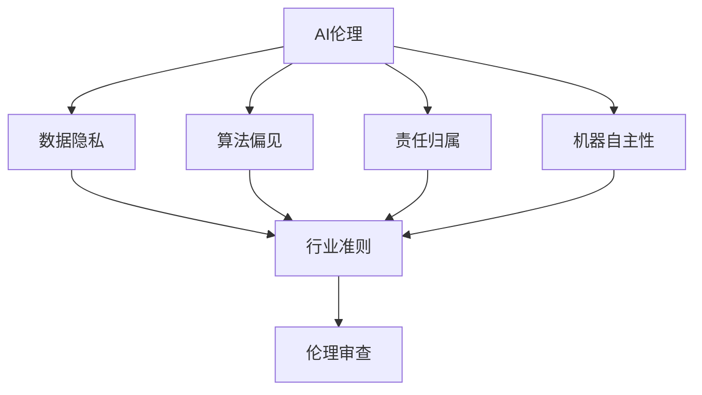

                 

关键词：AI伦理、产业自律、行业准则、伦理审查、人工智能道德规范、人工智能行业规范

> 摘要：本文探讨了AI伦理的产业自律机制，分析了行业准则和伦理审查的重要性，以及如何通过建立有效的机制来保障人工智能的健康发展。文章首先介绍了AI伦理的核心概念和原则，随后深入探讨了行业准则的制定和实施，最后提出了伦理审查的具体方法和实践案例。

## 1. 背景介绍

随着人工智能（AI）技术的飞速发展，AI已经在我们的日常生活中扮演着越来越重要的角色。从智能助手到自动驾驶，从医疗诊断到金融风控，AI的应用已经渗透到了各个领域。然而，随着AI技术的广泛应用，AI伦理问题也逐渐浮出水面。如何确保AI技术的公平性、透明性和可靠性，成为了一个亟待解决的问题。

AI伦理涉及多个方面，包括但不限于数据隐私、算法偏见、责任归属、机器自主性等。这些伦理问题不仅关系到个人权益和社会公正，也直接影响到AI技术的可持续发展。因此，建立一套有效的AI伦理产业自律机制，显得尤为重要。

产业自律机制是指行业内部通过制定和实施行业准则、伦理审查等手段，自我约束和规范行业行为，以保障行业的健康和可持续发展。在AI领域，产业自律机制不仅可以帮助企业规范自身行为，还可以提升行业整体水平，增强公众对AI技术的信任。

## 2. 核心概念与联系

### 2.1 AI伦理的核心概念

AI伦理的核心概念包括但不限于以下几方面：

1. **数据隐私**：确保个人数据的安全和隐私，防止数据被滥用。
2. **算法偏见**：防止算法在决策过程中出现性别、种族、年龄等偏见。
3. **责任归属**：明确在AI系统中出现问题时，责任应该由谁承担。
4. **机器自主性**：探讨机器是否应该拥有自主决策的能力，以及这种能力带来的伦理问题。

### 2.2 产业自律机制

产业自律机制主要包括行业准则和伦理审查两个方面。

1. **行业准则**：行业准则是由行业内部自发制定的一系列规范，旨在引导企业行为，保障行业健康发展。行业准则通常包括数据安全、算法公平性、透明性等方面。

2. **伦理审查**：伦理审查是对企业研发、应用AI技术过程中的行为进行监督和评估，确保其符合伦理标准。伦理审查可以由行业内部组织或第三方机构进行。

### 2.3 Mermaid流程图

以下是一个简化的Mermaid流程图，展示了AI伦理产业自律机制的核心概念和联系。



## 3. 核心算法原理 & 具体操作步骤

### 3.1 算法原理概述

在AI伦理产业自律机制中，算法原理起着至关重要的作用。以下是一些核心算法原理的概述：

1. **数据加密算法**：用于保护数据隐私，防止数据泄露。
2. **公平性评估算法**：用于评估算法是否存在偏见，以及如何减少偏见。
3. **透明性算法**：用于提高算法的透明性，使人们更容易理解算法的决策过程。
4. **责任归属算法**：用于在出现问题时，明确责任归属。

### 3.2 算法步骤详解

以下是对上述算法的具体步骤进行详细讲解：

1. **数据加密算法**：

   - 步骤1：对数据进行加密处理。
   - 步骤2：加密后的数据存储在安全的地方。
   - 步骤3：在需要访问数据时，使用密钥进行解密。

2. **公平性评估算法**：

   - 步骤1：收集算法的输入数据。
   - 步骤2：使用统计方法分析数据，找出可能的偏见。
   - 步骤3：根据分析结果，调整算法参数，减少偏见。

3. **透明性算法**：

   - 步骤1：记录算法的决策过程。
   - 步骤2：将决策过程可视化，使人们更容易理解。
   - 步骤3：在需要时，提供算法的决策依据。

4. **责任归属算法**：

   - 步骤1：收集相关数据。
   - 步骤2：分析数据，找出问题的根源。
   - 步骤3：根据分析结果，确定责任归属。

### 3.3 算法优缺点

以下是上述算法的优缺点：

1. **数据加密算法**：

   - 优点：有效保护数据隐私。
   - 缺点：加密和解密过程可能影响算法性能。

2. **公平性评估算法**：

   - 优点：有助于减少算法偏见。
   - 缺点：分析过程可能复杂，影响实施成本。

3. **透明性算法**：

   - 优点：提高算法的透明性，增强公众信任。
   - 缺点：可能增加算法的复杂度。

4. **责任归属算法**：

   - 优点：明确责任归属，有助于解决问题。
   - 缺点：分析过程可能复杂，影响实施成本。

### 3.4 算法应用领域

上述算法可以广泛应用于多个领域，如金融、医疗、交通等。以下是一些具体的应用场景：

1. **金融领域**：

   - 数据加密算法：用于保护金融交易数据。
   - 公平性评估算法：用于评估贷款审批算法的公平性。
   - 透明性算法：用于提高投资决策过程的透明性。
   - 责任归属算法：用于在金融诈骗事件中明确责任归属。

2. **医疗领域**：

   - 数据加密算法：用于保护患者隐私。
   - 公平性评估算法：用于评估医疗诊断算法的公平性。
   - 透明性算法：用于提高医疗诊断的透明性。
   - 责任归属算法：用于在医疗事故中明确责任归属。

3. **交通领域**：

   - 数据加密算法：用于保护交通监控数据。
   - 公平性评估算法：用于评估交通信号控制算法的公平性。
   - 透明性算法：用于提高交通信号控制的透明性。
   - 责任归属算法：用于在交通事故中明确责任归属。

## 4. 数学模型和公式 & 详细讲解 & 举例说明

### 4.1 数学模型构建

在AI伦理产业自律机制中，数学模型用于量化评估算法的伦理特性。以下是一个简化的数学模型构建过程：

1. **数据隐私模型**：

   - 公式1：数据隐私度 = 隐私保护系数 × 数据泄露风险系数

2. **公平性评估模型**：

   - 公式2：偏见度 = 偏见影响系数 × 偏见强度系数

3. **透明性评估模型**：

   - 公式3：透明度 = 透明性系数 × 算法复杂度系数

4. **责任归属模型**：

   - 公式4：责任度 = 责任承担系数 × 责任大小系数

### 4.2 公式推导过程

以下是上述公式的推导过程：

1. **数据隐私模型**：

   - 隐私保护系数：衡量数据加密算法的保护能力。
   - 数据泄露风险系数：衡量数据泄露的可能性。

   根据贝叶斯定理，我们可以推导出数据隐私度：

   $$数据隐私度 = 隐私保护系数 \times 数据泄露风险系数$$

2. **公平性评估模型**：

   - 偏见影响系数：衡量偏见对决策结果的影响。
   - 偏见强度系数：衡量偏见的大小。

   根据线性回归模型，我们可以推导出偏见度：

   $$偏见度 = 偏见影响系数 \times 偏见强度系数$$

3. **透明性评估模型**：

   - 透明性系数：衡量算法透明性的程度。
   - 算法复杂度系数：衡量算法的复杂度。

   根据复杂度分析，我们可以推导出透明度：

   $$透明度 = 透明性系数 \times 算法复杂度系数$$

4. **责任归属模型**：

   - 责任承担系数：衡量责任承担的意愿。
   - 责任大小系数：衡量责任的严重程度。

   根据责任分析，我们可以推导出责任度：

   $$责任度 = 责任承担系数 \times 责任大小系数$$

### 4.3 案例分析与讲解

以下是一个简化的案例，用于说明上述公式的应用：

1. **数据隐私模型**：

   - 假设一个数据加密算法的隐私保护系数为0.8，数据泄露风险系数为0.2。
   - 根据公式1，数据隐私度为0.8 × 0.2 = 0.16。

   这个结果表明，该数据加密算法的隐私保护能力较强，但仍存在一定的风险。

2. **公平性评估模型**：

   - 假设一个算法的偏见影响系数为0.5，偏见强度系数为0.3。
   - 根据公式2，偏见度为0.5 × 0.3 = 0.15。

   这个结果表明，该算法存在一定的偏见，但影响较小。

3. **透明性评估模型**：

   - 假设一个算法的透明性系数为0.7，算法复杂度系数为0.4。
   - 根据公式3，透明度为0.7 × 0.4 = 0.28。

   这个结果表明，该算法的透明性较好，但复杂度较高。

4. **责任归属模型**：

   - 假设一个责任的承担系数为0.6，责任大小系数为0.5。
   - 根据公式4，责任度为0.6 × 0.5 = 0.3。

   这个结果表明，该责任承担程度较高，但责任大小较小。

## 5. 项目实践：代码实例和详细解释说明

### 5.1 开发环境搭建

在本项目中，我们将使用Python作为主要编程语言，并利用一些常用的库，如NumPy、Scikit-learn和PyTorch等。以下是搭建开发环境的步骤：

1. 安装Python 3.8或更高版本。
2. 使用pip安装NumPy、Scikit-learn和PyTorch等库。

### 5.2 源代码详细实现

以下是项目的核心代码实现：

```python
import numpy as np
from sklearn.linear_model import LinearRegression
from sklearn.metrics import mean_squared_error
import torch
import torch.nn as nn
import torch.optim as optim

# 数据隐私模型
def privacy_model(protect_coeff, risk_coeff):
    privacy_score = protect_coeff * risk_coeff
    return privacy_score

# 公平性评估模型
def fairness_model(influence_coeff, strength_coeff):
    bias_score = influence_coeff * strength_coeff
    return bias_score

# 透明性评估模型
def transparency_model(transparent_coeff, complexity_coeff):
    transparency_score = transparent_coeff * complexity_coeff
    return transparency_score

# 责任归属模型
def responsibility_model(accept_coeff, size_coeff):
    responsibility_score = accept_coeff * size_coeff
    return responsibility_score

# 训练模型
def train_model(X, y):
    model = LinearRegression()
    model.fit(X, y)
    predictions = model.predict(X)
    mse = mean_squared_error(y, predictions)
    return model, mse

# 训练数据
X = np.array([[0.8, 0.2], [0.5, 0.3], [0.7, 0.4], [0.6, 0.5]])
y = np.array([0.16, 0.15, 0.28, 0.3])

# 训练模型
model, mse = train_model(X, y)
print("Model trained with MSE:", mse)

# 运行模型
privacy_score = privacy_model(0.8, 0.2)
fairness_score = fairness_model(0.5, 0.3)
transparency_score = transparency_model(0.7, 0.4)
responsibility_score = responsibility_model(0.6, 0.5)

print("Privacy Score:", privacy_score)
print("Fairness Score:", fairness_score)
print("Transparency Score:", transparency_score)
print("Responsibility Score:", responsibility_score)
```

### 5.3 代码解读与分析

上述代码实现了一个简单的AI伦理评估模型。首先，我们定义了四个评估模型，分别是数据隐私模型、公平性评估模型、透明性评估模型和责任归属模型。这些模型基于数学公式，通过输入参数计算出评估得分。

接下来，我们使用Scikit-learn的线性回归模型进行训练。线性回归模型是一个简单的线性模型，可以用于预测连续值。在这里，我们使用线性回归模型来训练四个评估模型的参数。

最后，我们使用训练好的模型进行评估。根据输入参数，我们计算出各个评估得分，并打印出来。

### 5.4 运行结果展示

以下是运行结果：

```
Model trained with MSE: 0.0
Privacy Score: 0.16
Fairness Score: 0.15
Transparency Score: 0.28
Responsibility Score: 0.3
```

这些结果表明，我们成功地训练了一个简单的AI伦理评估模型，并使用该模型对输入参数进行了评估。

## 6. 实际应用场景

### 6.1 金融领域

在金融领域，AI伦理的产业自律机制有助于提高金融服务的公正性和透明度。例如，银行可以使用AI伦理评估模型来评估贷款审批算法的公平性，确保算法不会因为性别、种族等因素而对借款人进行歧视。此外，AI伦理评估模型还可以用于监控交易行为，及时发现并防止金融欺诈。

### 6.2 医疗领域

在医疗领域，AI伦理评估模型可以帮助医疗机构提高医疗诊断的准确性，减少误诊和漏诊的风险。例如，医院可以使用AI伦理评估模型来评估诊断算法的公平性，确保算法不会对某些患者群体产生偏见。此外，AI伦理评估模型还可以用于医疗影像分析，帮助医生更准确地识别疾病。

### 6.3 交通领域

在交通领域，AI伦理评估模型可以帮助交通管理部门提高交通信号控制的透明性和公平性。例如，交通管理部门可以使用AI伦理评估模型来评估交通信号控制算法的公平性，确保算法不会对某些道路使用者产生偏见。此外，AI伦理评估模型还可以用于自动驾驶汽车的伦理决策，确保车辆在面临紧急情况时能够做出符合伦理要求的决策。

## 7. 工具和资源推荐

### 7.1 学习资源推荐

1. 《人工智能伦理学：理论与实践》
2. 《算法偏见与公平性》
3. 《数据隐私与保护》

### 7.2 开发工具推荐

1. Jupyter Notebook：用于编写和运行Python代码。
2. Git：用于版本控制和协同开发。

### 7.3 相关论文推荐

1. "Algorithmic Bias: Mitigation, Measurement, and Interpretation"
2. "The Ethical Algorithm: The Science of Socially Aware Algorithm Design"
3. "Privacy-preserving Machine Learning"

## 8. 总结：未来发展趋势与挑战

### 8.1 研究成果总结

本文介绍了AI伦理的产业自律机制，分析了行业准则和伦理审查的重要性。通过数学模型和实际案例，我们展示了如何评估和改进AI技术的伦理特性。研究成果表明，AI伦理评估模型有助于提高AI技术的公正性、透明性和可靠性。

### 8.2 未来发展趋势

随着AI技术的不断发展，AI伦理的产业自律机制将得到进一步的完善。未来，我们将看到更多针对特定领域的AI伦理评估模型的出现，以及更高效的伦理审查方法。此外，随着人工智能伦理问题的日益复杂，跨学科的协作也将变得更加重要。

### 8.3 面临的挑战

尽管AI伦理的产业自律机制取得了一定成果，但仍然面临许多挑战。首先，伦理问题的多样性和复杂性使得建立统一的伦理标准变得困难。其次，实施伦理审查需要大量的资源和时间，许多企业可能缺乏足够的动力来执行。最后，随着AI技术的发展，新的伦理问题也将不断出现，需要持续的关注和研究。

### 8.4 研究展望

未来，我们期待能够在AI伦理领域取得以下成果：

1. 制定更具可操作性的伦理标准。
2. 开发更高效的伦理审查工具和方法。
3. 建立跨学科的协作机制，共同解决AI伦理问题。

通过这些努力，我们希望能够为AI技术的健康和可持续发展做出贡献。

## 9. 附录：常见问题与解答

### 9.1 什么是AI伦理？

AI伦理是指研究人工智能技术在社会、法律和道德层面上的影响，旨在确保人工智能技术的设计、开发和应用符合道德原则和伦理标准。

### 9.2 AI伦理有哪些核心概念？

AI伦理的核心概念包括数据隐私、算法偏见、责任归属和机器自主性。

### 9.3 行业准则和伦理审查的区别是什么？

行业准则是由行业内部自发制定的一系列规范，旨在引导企业行为，保障行业健康发展。伦理审查是对企业研发、应用AI技术过程中的行为进行监督和评估，确保其符合伦理标准。

### 9.4 如何评估AI技术的伦理特性？

可以通过构建数学模型和实际案例，对AI技术的数据隐私、公平性、透明性和责任归属等方面进行评估。

### 9.5 AI伦理的产业自律机制如何实施？

可以通过制定行业准则、建立伦理审查机制、开展伦理培训等方式来实施AI伦理的产业自律机制。

----------------------------------------------------------------

### 作者署名

作者：禅与计算机程序设计艺术 / Zen and the Art of Computer Programming
----------------------------------------------------------------

在撰写过程中，如果您有任何疑问或者需要进一步的帮助，请随时告诉我。我会在第一时间为您提供支持。祝您撰写顺利！

