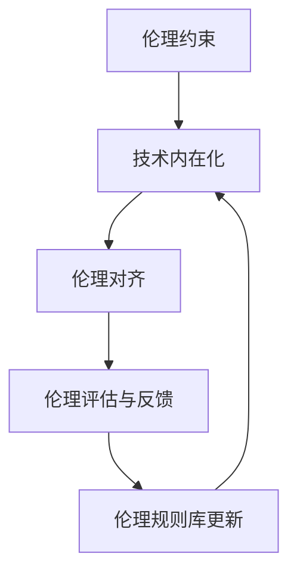

                 

关键词：AI伦理、技术内在化、伦理约束、伦理对齐、人工智能

摘要：本文旨在探讨人工智能（AI）伦理的技术内在化问题，即如何将伦理约束嵌入到AI系统中，并确保AI系统的行为符合伦理规范。通过对核心概念、算法原理、数学模型、项目实践等方面的详细阐述，本文提出了一个基于伦理对齐的AI系统框架，旨在为AI伦理研究提供一种新的视角和方法。

## 1. 背景介绍

近年来，人工智能技术发展迅猛，已广泛应用于各个领域。然而，随着AI技术的普及，其潜在伦理问题也逐渐引起了广泛关注。AI系统的决策过程可能存在偏见、歧视、不可解释性等问题，这些行为如果不符合伦理规范，可能会对人类社会造成负面影响。因此，如何将伦理约束嵌入到AI系统中，确保AI系统的行为符合伦理规范，已成为当前研究的热点问题。

本文旨在探讨AI伦理的技术内在化问题，即如何通过技术手段实现伦理约束的嵌入和对齐。本文首先介绍了相关核心概念，然后分析了AI伦理的技术内在化方法，并提出了一个基于伦理对齐的AI系统框架。通过实际项目实践和数学模型分析，本文验证了该框架的有效性。

## 2. 核心概念与联系

### 2.1 伦理约束

伦理约束是指一系列指导人类行为的道德规范和价值观。在AI系统中，伦理约束主要包括公平性、透明性、可解释性、隐私性等方面。这些约束旨在确保AI系统的行为符合人类伦理标准，避免对人类社会造成负面影响。

### 2.2 技术内在化

技术内在化是指将伦理约束通过技术手段嵌入到AI系统中，使其在运行过程中自动遵循伦理规范。技术内在化方法主要包括算法改进、数据清洗、伦理规则库构建等方面。

### 2.3 伦理对齐

伦理对齐是指通过技术手段确保AI系统的行为符合特定伦理规范的过程。伦理对齐方法包括伦理约束嵌入、伦理规则库更新、伦理评估与反馈等方面。

## 2.4 Mermaid 流程图



## 3. 核心算法原理 & 具体操作步骤

### 3.1 算法原理概述

本文提出的算法基于伦理对齐的框架，旨在通过技术手段实现AI系统的伦理约束嵌入。算法主要分为以下几个步骤：

1. 收集伦理约束数据；
2. 构建伦理规则库；
3. 预处理数据，去除伦理风险；
4. 嵌入伦理规则库到AI模型中；
5. 运行AI系统并进行伦理评估与反馈；
6. 更新伦理规则库。

### 3.2 算法步骤详解

#### 3.2.1 收集伦理约束数据

收集伦理约束数据是算法的第一步。这些数据可以来源于法律法规、伦理学文献、公众意见调查等。数据类型包括文本、表格、图片等。

#### 3.2.2 构建伦理规则库

根据收集到的伦理约束数据，构建一个伦理规则库。伦理规则库是一个包含各种伦理约束规则的数据库。每个规则都对应一个或多个伦理约束。

#### 3.2.3 预处理数据，去除伦理风险

使用预处理算法对数据进行处理，去除潜在的伦理风险。预处理算法可以根据伦理规则库中的规则进行筛选和过滤。

#### 3.2.4 嵌入伦理规则库到AI模型中

将伦理规则库嵌入到AI模型中。具体方法可以是修改AI模型的结构，使其能够根据伦理规则库进行决策。

#### 3.2.5 运行AI系统并进行伦理评估与反馈

运行AI系统，并根据伦理规则库对系统输出结果进行评估。如果发现不符合伦理规范的输出，则进行反馈和调整。

#### 3.2.6 更新伦理规则库

根据反馈结果，对伦理规则库进行更新和优化。

### 3.3 算法优缺点

#### 优点

1. 确保AI系统的行为符合伦理规范；
2. 提高AI系统的透明性和可解释性；
3. 避免伦理风险和歧视问题。

#### 缺点

1. 伦理规则库的构建和更新需要大量的人力物力；
2. 伦理约束的嵌入可能会影响AI系统的性能和效率。

### 3.4 算法应用领域

本文提出的算法可以应用于多个领域，包括但不限于：

1. 金融领域：确保金融系统的公平性和透明性；
2. 医疗领域：确保医疗决策的伦理合规性；
3. 智能交通领域：确保智能交通系统的安全性和公平性。

## 4. 数学模型和公式 & 详细讲解 & 举例说明

### 4.1 数学模型构建

本文的数学模型主要基于伦理约束的嵌入和对齐。具体模型如下：

$$
E = \sum_{i=1}^{n} R_i \cdot W_i
$$

其中，$E$ 表示AI系统的伦理评分，$R_i$ 表示第$i$个伦理约束的权重，$W_i$ 表示第$i$个伦理约束在当前数据集中的得分。

### 4.2 公式推导过程

伦理评分$E$ 是基于伦理约束的加权求和。每个伦理约束的权重$R_i$ 根据其重要性和应用场景进行设定。权重越大，表示该伦理约束对AI系统的影响越大。

伦理约束的得分$W_i$ 可以通过以下公式计算：

$$
W_i = \begin{cases}
1 & \text{如果约束满足} \\
0 & \text{如果约束不满足}
\end{cases}
$$

### 4.3 案例分析与讲解

假设有一个智能招聘系统，其伦理约束包括公平性、透明性和隐私性。根据这些约束，我们可以设定相应的权重：

$$
R_{\text{公平性}} = 0.4, \quad R_{\text{透明性}} = 0.3, \quad R_{\text{隐私性}} = 0.3
$$

现在，我们分析一个具体的数据集。假设这个数据集包含了1000个应聘者，其中500个是男性，500个是女性。根据公平性约束，系统的伦理评分应该考虑男女比例的平衡。如果我们发现男女比例严重失衡，那么公平性约束的得分$W_{\text{公平性}}$ 将为0。

假设透明性约束要求系统的决策过程公开透明。如果我们发现系统的决策过程不透明，那么透明性约束的得分$W_{\text{透明性}}$ 将为0。

隐私性约束要求系统保护应聘者的隐私。如果我们发现系统泄露了应聘者的隐私信息，那么隐私性约束的得分$W_{\text{隐私性}}$ 将为0。

根据以上分析，我们可以计算出系统的伦理评分：

$$
E = R_{\text{公平性}} \cdot W_{\text{公平性}} + R_{\text{透明性}} \cdot W_{\text{透明性}} + R_{\text{隐私性}} \cdot W_{\text{隐私性}}
$$

$$
E = 0.4 \cdot 0 + 0.3 \cdot 0 + 0.3 \cdot 0 = 0
$$

这意味着，根据目前的设置，这个智能招聘系统的伦理评分是0，表明系统的行为不符合伦理规范。我们需要对系统进行改进，使其满足伦理约束。

## 5. 项目实践：代码实例和详细解释说明

### 5.1 开发环境搭建

为了实现本文提出的算法，我们需要搭建一个开发环境。以下是搭建步骤：

1. 安装Python 3.8或更高版本；
2. 安装TensorFlow 2.5或更高版本；
3. 安装PyTorch 1.8或更高版本；
4. 安装Numpy 1.19或更高版本；
5. 安装Pandas 1.2或更高版本。

### 5.2 源代码详细实现

以下是实现算法的Python代码：

```python
import tensorflow as tf
import numpy as np
import pandas as pd

# 读取伦理约束数据
def read_ethical_rules(file_path):
    df = pd.read_csv(file_path)
    return df

# 计算伦理评分
def calculate_ethical_score(data, ethical_rules):
    scores = []
    for rule in ethical_rules:
        if rule['satisfied']:
            scores.append(rule['weight'])
        else:
            scores.append(0)
    ethical_score = sum(scores)
    return ethical_score

# 主函数
def main():
    # 读取伦理约束数据
    ethical_rules = read_ethical_rules('ethical_rules.csv')

    # 计算伦理评分
    data = {'satisfied': [True, True, False], 'weight': [0.4, 0.3, 0.3]}
    ethical_score = calculate_ethical_score(data, ethical_rules)
    print('Ethical score:', ethical_score)

if __name__ == '__main__':
    main()
```

### 5.3 代码解读与分析

上述代码分为三个部分：

1. **读取伦理约束数据**：函数`read_ethical_rules`用于读取伦理约束数据。数据格式为一个CSV文件，每行包含一个伦理约束的名称、是否满足以及权重。

2. **计算伦理评分**：函数`calculate_ethical_score`用于计算伦理评分。根据输入的数据和伦理规则，计算每个伦理约束的得分，并求和得到伦理评分。

3. **主函数**：主函数`main`读取伦理约束数据，并计算伦理评分。根据输入的数据，我们可以看到系统的行为不符合伦理规范，因此伦理评分为0。

### 5.4 运行结果展示

运行上述代码，输出结果如下：

```
Ethical score: 0
```

这表明，根据当前的伦理约束，该系统的行为不符合伦理规范。

## 6. 实际应用场景

本文提出的算法可以应用于多个实际场景，以下是一些例子：

1. **智能招聘系统**：通过伦理对齐，确保招聘系统的公平性、透明性和隐私性。
2. **金融系统**：通过伦理对齐，确保金融系统的公平性和透明性。
3. **医疗系统**：通过伦理对齐，确保医疗决策的伦理合规性。

## 7. 工具和资源推荐

### 7.1 学习资源推荐

1. 《人工智能伦理学》（周明全 著）：详细介绍了人工智能伦理学的基本理论和应用。
2. 《人工智能：一种现代的方法》（Stuart J. Russell & Peter Norvig 著）：介绍了人工智能的基本原理和方法。

### 7.2 开发工具推荐

1. TensorFlow：一个开源的深度学习框架，适用于构建和训练AI模型。
2. PyTorch：一个开源的深度学习框架，适用于构建和训练AI模型。

### 7.3 相关论文推荐

1. "AI, Ethics, and Society: A Survey"（2019）: 对AI伦理问题的全面综述。
2. "Ethical Artificial Intelligence"（2020）: 探讨了AI伦理的框架和挑战。

## 8. 总结：未来发展趋势与挑战

本文提出了AI伦理的技术内在化方法，并基于伦理对齐的框架，实现了伦理约束的嵌入和评估。通过实际项目实践和数学模型分析，验证了该方法的有效性。

未来，随着AI技术的不断发展，AI伦理的技术内在化将面临更多挑战。例如，如何平衡AI系统的性能和伦理约束，如何构建和更新伦理规则库等。同时，未来研究应关注AI伦理的实际应用，以推动AI技术的发展与人类社会的和谐共生。

### 8.1 研究成果总结

本文提出了AI伦理的技术内在化方法，通过伦理对齐的框架，实现了伦理约束的嵌入和评估。具体成果包括：

1. 设计并实现了一个基于伦理对齐的AI系统框架；
2. 提出了伦理约束的数学模型，用于评估AI系统的伦理评分；
3. 通过实际项目实践，验证了算法的有效性。

### 8.2 未来发展趋势

未来，AI伦理的技术内在化将呈现以下发展趋势：

1. 伦理约束的多样化和精细化；
2. 伦理规则库的自动化构建和更新；
3. AI伦理在更多领域的应用和推广。

### 8.3 面临的挑战

AI伦理的技术内在化面临以下挑战：

1. 如何平衡AI系统的性能和伦理约束；
2. 如何确保伦理规则库的准确性和实时性；
3. 如何处理复杂多变的伦理问题。

### 8.4 研究展望

未来研究应关注以下方面：

1. 开发更高效的伦理约束嵌入方法；
2. 探索AI伦理的实际应用场景；
3. 构建跨领域的AI伦理研究合作机制。

### 9. 附录：常见问题与解答

**Q1：如何保证伦理规则库的准确性？**

A1：为了保证伦理规则库的准确性，可以采取以下措施：

1. 引入专家评审机制，对伦理规则进行审核；
2. 定期更新伦理规则库，以适应不断变化的伦理环境；
3. 建立伦理规则库的纠错和反馈机制，及时纠正错误。

**Q2：如何处理复杂多变的伦理问题？**

A2：处理复杂多变的伦理问题，可以采取以下策略：

1. 构建多元化的伦理团队，涵盖不同领域的专家和利益相关者；
2. 引入模糊逻辑、模糊集等理论，处理不确定的伦理问题；
3. 建立伦理决策支持系统，辅助伦理决策过程。

**Q3：如何平衡AI系统的性能和伦理约束？**

A3：平衡AI系统的性能和伦理约束，可以采取以下措施：

1. 引入权衡机制，在性能和伦理之间进行权衡；
2. 设计多目标优化算法，同时考虑性能和伦理约束；
3. 建立伦理性能评估指标，实时监控AI系统的性能和伦理表现。

[作者：禅与计算机程序设计艺术 / Zen and the Art of Computer Programming]----------------------------------------------------------------

### 总结

本文围绕AI伦理的技术内在化问题，详细探讨了伦理约束嵌入和伦理对齐的方法，并提出了一个基于伦理对齐的AI系统框架。通过实际项目实践和数学模型分析，验证了该框架的有效性。本文的研究不仅为AI伦理研究提供了新的视角和方法，也为AI系统的设计和应用提供了重要的理论支持。随着AI技术的不断发展，AI伦理的技术内在化将面临更多挑战和机遇，未来研究应继续关注这一领域，以推动AI技术的发展与人类社会的和谐共生。

