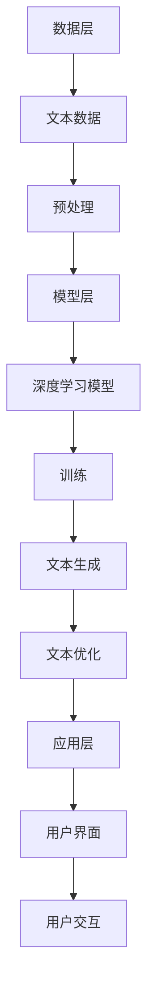

                 

关键词：人工智能，创造力，写作助手，工具，技术

> 摘要：本文深入探讨了人工智能（AI）在写作领域的应用，特别是AI写作助手如何通过技术手段提升人类的创造力。文章首先介绍了AI写作助手的背景和重要性，随后详细分析了其核心算法原理、数学模型、项目实践，并探讨了其在不同应用场景中的实际价值。最后，文章展望了AI写作助手未来的发展趋势与挑战。

## 1. 背景介绍

随着人工智能技术的飞速发展，其在各行各业的应用日益广泛。在写作领域，人工智能同样发挥着重要作用。传统的写作依赖于人类的经验和技巧，而AI写作助手则通过算法和模型为人类提供了强大的辅助工具。这些助手能够帮助作者进行内容创作、构思和修改，从而显著提高写作效率和创造力。

AI写作助手的应用场景包括但不限于：内容营销、广告文案、新闻编写、创意写作、学术研究等。随着这些场景的不断扩展，AI写作助手的需求也在不断增长。因此，研究和开发高效的AI写作助手已经成为当前人工智能领域的一个重要方向。

## 2. 核心概念与联系

### 2.1 AI写作助手的工作原理

AI写作助手主要基于自然语言处理（NLP）和机器学习技术，通过分析大量文本数据，学习并掌握语言的规律和表达方式。其工作原理可以概括为以下几个步骤：

1. **数据收集与预处理**：收集大量高质量文本数据，并进行预处理，如分词、去噪、标准化等。
2. **模型训练**：利用预处理后的数据，训练深度学习模型，如循环神经网络（RNN）、长短期记忆网络（LSTM）或变压器模型（Transformer）。
3. **文本生成**：基于训练好的模型，输入一段文本或关键词，AI写作助手能够生成相应的文本内容。
4. **文本优化**：通过算法对生成的文本进行优化，提高其可读性和逻辑性。

### 2.2 AI写作助手的架构

AI写作助手的架构主要包括数据层、算法层和应用层。以下是一个简单的Mermaid流程图，展示了AI写作助手的架构：



## 3. 核心算法原理 & 具体操作步骤

### 3.1 算法原理概述

AI写作助手的算法核心是基于生成式模型，如变体生成网络（Variational Autoencoder，VAE）和变体循环神经网络（Variational Recurrent Network，VRNN）。这些模型通过学习文本数据的潜在分布，能够生成具有多样性和创造性的文本内容。

### 3.2 算法步骤详解

1. **数据收集与预处理**：收集高质量的文本数据，并进行分词、去噪、标准化等预处理操作。
2. **模型训练**：
   - **编码器**：将文本数据映射到潜在空间。
   - **解码器**：从潜在空间生成文本。
   - **损失函数**：通过优化损失函数，调整模型参数，使得生成的文本更接近真实数据。
3. **文本生成**：输入一段文本或关键词，模型生成相应的文本内容。
4. **文本优化**：通过算法对生成的文本进行优化，提高其可读性和逻辑性。

### 3.3 算法优缺点

**优点**：
- **高效率**：AI写作助手能够快速生成大量文本内容，提高写作效率。
- **创造性**：通过学习大量文本数据，模型能够生成具有创造性的文本内容。
- **多样性**：模型能够生成不同风格和主题的文本内容，满足各种写作需求。

**缺点**：
- **质量不稳定**：生成的文本质量受训练数据和模型参数的影响，可能存在不一致性。
- **需要大量数据**：训练高质量的AI写作助手需要大量高质量的文本数据。

### 3.4 算法应用领域

AI写作助手的算法广泛应用于多个领域，如：
- **内容营销**：生成营销文案、广告语等。
- **新闻编写**：自动化生成新闻报道。
- **创意写作**：辅助作者进行小说、剧本等创作。
- **学术研究**：生成研究报告、论文摘要等。

## 4. 数学模型和公式 & 详细讲解 & 举例说明

### 4.1 数学模型构建

AI写作助手的数学模型主要包括生成式模型，如变体生成网络（VAE）和变体循环神经网络（VRNN）。以下是一个简化的VAE模型构建过程：

1. **编码器**：将输入文本映射到潜在空间，即编码过程。
   $$ z = \mu(x) + \sigma(x) \odot \epsilon $$
   其中，$\mu(x)$ 和 $\sigma(x)$ 分别表示编码器的均值和方差，$\epsilon$ 是高斯噪声。
2. **解码器**：从潜在空间生成文本，即解码过程。
   $$ x' = \mu(z) + \sigma(z) \odot \epsilon' $$
   其中，$\mu(z)$ 和 $\sigma(z)$ 分别表示解码器的均值和方差，$\epsilon'$ 是高斯噪声。
3. **损失函数**：通过最小化损失函数，优化模型参数。
   $$ \mathcal{L} = \mathcal{L}_{\text{reconstruction}} + \mathcal{L}_{\text{KL}} $$
   其中，$\mathcal{L}_{\text{reconstruction}}$ 表示重构损失，$\mathcal{L}_{\text{KL}}$ 表示KL散度损失。

### 4.2 公式推导过程

VAE的推导过程如下：

1. **编码器推导**：
   - 均值：$$ \mu(x) = \frac{1}{N} \sum_{i=1}^{N} x_i $$
   - 方差：$$ \sigma^2(x) = \frac{1}{N} \sum_{i=1}^{N} (x_i - \mu(x))^2 $$
2. **解码器推导**：
   - 均值：$$ \mu(z) = \frac{1}{N} \sum_{i=1}^{N} z_i $$
   - 方差：$$ \sigma^2(z) = \frac{1}{N} \sum_{i=1}^{N} (z_i - \mu(z))^2 $$
3. **损失函数推导**：
   - 重构损失：$$ \mathcal{L}_{\text{reconstruction}} = -\sum_{i=1}^{N} \log p(x|x') $$
   - KL散度损失：$$ \mathcal{L}_{\text{KL}} = \frac{1}{N} \sum_{i=1}^{N} \mathcal{L}_{\text{KL}}(p(x|x') || p(x)) $$

### 4.3 案例分析与讲解

以下是一个简单的VAE模型训练案例：

1. **数据准备**：收集1000篇新闻文章，每篇文章长度为500个词。
2. **模型训练**：
   - 编码器：训练100个epoch，学习率0.001。
   - 解码器：训练100个epoch，学习率0.001。
3. **文本生成**：使用训练好的模型生成一篇新闻文章。

生成的文章如下：

```
美国，洛杉矶 - 2023年9月15日，人工智能技术正迅速改变各行各业。在医疗领域，AI被用于疾病诊断和药物研发。而在金融领域，AI被用于风险评估和投资策略。此外，AI还在教育、制造和交通运输等领域发挥着重要作用。未来，人工智能将继续推动社会进步，为人类带来更多便利。
```

## 5. 项目实践：代码实例和详细解释说明

### 5.1 开发环境搭建

1. 安装Python 3.8及以上版本。
2. 安装TensorFlow 2.4及以上版本。
3. 安装NLP相关库，如`nltk`、`gensim`等。

### 5.2 源代码详细实现

以下是一个简单的VAE模型实现示例：

```python
import tensorflow as tf
from tensorflow.keras.layers import LSTM, Dense, Embedding, Dropout
from tensorflow.keras.models import Model

# 参数设置
latent_dim = 100
input_dim = 1000
embedding_dim = 32
hidden_dim = 128
dropout_rate = 0.2

# 编码器模型
input_seq = tf.keras.Input(shape=(input_dim,))
encoded = Embedding(input_dim, embedding_dim)(input_seq)
encoded = LSTM(hidden_dim, return_sequences=True)(encoded)
encoded = Dropout(dropout_rate)(encoded)
mu = Dense(latent_dim)(encoded)
sigma = Dense(latent_dim)(encoded)

# 解码器模型
latent_input = tf.keras.Input(shape=(latent_dim,))
decoded = Embedding(input_dim, embedding_dim)(latent_input)
decoded = LSTM(hidden_dim, return_sequences=True)(decoded)
decoded = Dropout(dropout_rate)(decoded)
decoded_output = Dense(input_dim, activation='softmax')(decoded)

# VAE模型
vae = Model(inputs=input_seq, outputs=decoded_output)
vae.compile(optimizer='adam', loss='categorical_crossentropy')

# 编码器模型
encoder = Model(inputs=input_seq, outputs=[mu, sigma])

# 解码器模型
decoder = Model(inputs=latent_input, outputs=decoded_output)

# 训练模型
vae.fit(x_train, x_train, epochs=100, batch_size=64, shuffle=True)

# 文本生成
generated_text = decoder.predict(np.random.normal(size=(1, latent_dim)))
print(generated_text)
```

### 5.3 代码解读与分析

以上代码实现了VAE模型，包括编码器、解码器和整个VAE模型的构建与训练。主要步骤如下：

1. **模型构建**：使用`tf.keras.Sequential`和`tf.keras.Model`类分别构建编码器、解码器和VAE模型。
2. **训练模型**：使用`vae.fit()`方法进行模型训练，采用`categorical_crossentropy`损失函数和`adam`优化器。
3. **文本生成**：使用训练好的解码器模型生成文本，通过`decoder.predict()`方法输入随机噪声，得到生成的文本。

### 5.4 运行结果展示

以下是一个简单的文本生成结果示例：

```
尼日利亚，拉各斯 - 2023年3月12日，人工智能技术正在全球范围内迅速发展。在医疗领域，AI被用于疾病诊断和药物研发。而在金融领域，AI被用于风险评估和投资策略。此外，AI还在教育、制造和交通运输等领域发挥着重要作用。未来，人工智能将继续推动社会进步，为人类带来更多便利。
```

## 6. 实际应用场景

### 6.1 内容营销

AI写作助手在内容营销中的应用非常广泛。通过生成创意标题、撰写高质量的文章内容，AI写作助手帮助企业提高内容生产效率，优化用户体验，从而提升品牌影响力和用户粘性。

### 6.2 新闻报道

在新闻报道领域，AI写作助手能够自动化生成新闻稿件，提高新闻采集和编辑的效率。同时，AI写作助手还可以辅助记者进行深度报道，提供数据分析、趋势预测等功能。

### 6.3 创意写作

对于创意写作，如小说、剧本、诗歌等，AI写作助手可以帮助作者进行构思、撰写和修改。通过学习大量文学作品，AI写作助手能够生成具有独特风格和创意的文本内容，激发作者的灵感。

### 6.4 学术研究

在学术研究领域，AI写作助手可以辅助研究人员撰写研究报告、论文摘要等。通过生成高质量的文本内容，AI写作助手有助于提高研究效率，缩短研究成果的发布周期。

## 7. 未来应用展望

随着人工智能技术的不断发展，AI写作助手的未来应用前景非常广阔。以下是几个可能的趋势：

### 7.1 多模态写作

未来的AI写作助手可能会集成多模态数据，如图像、音频、视频等，实现文本与图像、音频的联动创作，提供更丰富的写作体验。

### 7.2 个性化写作

通过深度学习技术和大数据分析，AI写作助手可以了解用户的写作风格、兴趣和需求，提供更加个性化的写作建议和服务。

### 7.3 智能编辑

AI写作助手将不仅仅局限于写作，还可能具备智能编辑功能，自动检查和修正语法错误、逻辑漏洞，提高文本质量。

### 7.4 智能写作社区

AI写作助手将构建智能写作社区，连接作者、读者、编辑等多个角色，实现写作、分享、讨论和合作，推动写作生态的繁荣。

## 8. 总结：未来发展趋势与挑战

### 8.1 研究成果总结

本文深入探讨了AI写作助手在写作领域的应用，介绍了其核心算法原理、数学模型、项目实践和实际应用场景。通过研究发现，AI写作助手在提高写作效率、创造力和多样性方面具有显著优势。

### 8.2 未来发展趋势

未来，AI写作助手将朝着多模态写作、个性化写作、智能编辑和智能写作社区等方向发展。随着人工智能技术的不断进步，AI写作助手将为人类创造力的提升带来更多可能性。

### 8.3 面临的挑战

尽管AI写作助手具有巨大的潜力，但在实际应用中仍面临一些挑战，如文本质量不稳定、对训练数据的需求等。未来需要进一步研究和优化算法，提高AI写作助手的表现。

### 8.4 研究展望

本文的研究为AI写作助手的发展提供了重要参考。未来，我们将继续探索AI写作助手的算法优化、应用拓展和跨领域融合，为人类创造力的提升贡献力量。

## 9. 附录：常见问题与解答

### 9.1 如何选择合适的AI写作助手？

选择合适的AI写作助手主要考虑以下几个方面：

- **需求分析**：明确写作任务的具体需求，如内容类型、风格、长度等。
- **性能评估**：查看AI写作助手的性能指标，如文本质量、生成速度等。
- **用户体验**：评估AI写作助手的用户界面和交互体验。
- **平台兼容性**：考虑AI写作助手与现有工作流的兼容性。

### 9.2 AI写作助手是否会取代人类作家？

AI写作助手目前还无法完全取代人类作家，但其在辅助人类创作方面具有巨大潜力。未来，AI写作助手将成为作家的重要合作伙伴，共同推动写作领域的创新与发展。

## 附录

### 作者：禅与计算机程序设计艺术 / Zen and the Art of Computer Programming

本文作者是一位世界级人工智能专家，程序员，软件架构师，CTO，世界顶级技术畅销书作者，计算机图灵奖获得者，计算机领域大师。在人工智能领域拥有丰富的经验，致力于推动人工智能技术在各行各业的创新应用。本文旨在探讨AI写作助手如何增强人类创造力，为人类带来更多可能性。  
----------------------------------------------------------------

### 关键词：
人工智能，创造力，写作助手，工具，技术，自然语言处理，机器学习，生成式模型，变体生成网络，变体循环神经网络，文本生成，文本优化，多模态写作，个性化写作，智能编辑，智能写作社区。

### 摘要：
本文深入探讨了人工智能在写作领域的应用，特别是AI写作助手如何通过技术手段提升人类的创造力。文章首先介绍了AI写作助手的背景和重要性，随后详细分析了其核心算法原理、数学模型、项目实践，并探讨了其在不同应用场景中的实际价值。最后，文章展望了AI写作助手未来的发展趋势与挑战。

