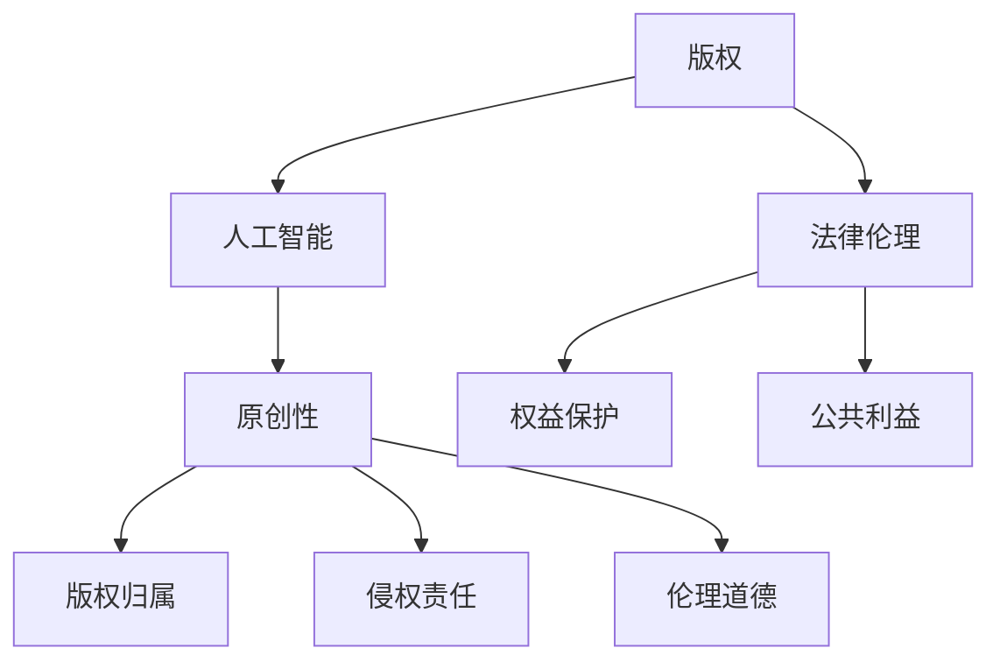

                 

## 1. 背景介绍

在当今数字时代，人工智能（AI）技术的快速发展正在重塑各个行业，包括内容创作。AI写作作为一种新兴技术，正逐渐成为媒体、市场营销、广告、甚至文学创作等领域的重要组成部分。然而，随着AI写作技术的广泛应用，版权问题也日益凸显，成为社会各界关注的焦点。

版权问题不仅仅关乎商业利益，更涉及到法律和伦理的双重挑战。首先，AI写作作品的版权归属问题引起了广泛讨论。传统上，文学作品、音乐、艺术等都是由人类创作者所创造，其版权归属明确。然而，当AI成为“作者”时，版权归属变得模糊不清。这涉及到谁拥有AI生成内容的知识产权，是训练AI的团队、使用AI的个人，还是AI本身。

其次，AI写作可能侵犯他人版权。由于AI可以通过学习大量文本数据来生成内容，这可能导致AI写作的作品与已有作品存在相似之处，甚至可能直接复制他人的创作。这种情况下，如何界定AI写作是否构成侵权，如何追究责任，成为法律界和伦理界亟待解决的问题。

此外，AI写作的版权问题还涉及到伦理层面的考量。在AI生成内容的过程中，如何尊重原创者的劳动成果，如何保护文化多样性，如何确保AI写作不传播虚假信息，都是需要我们深入思考的问题。

本文将围绕AI写作的版权问题，从法律和伦理的角度进行深入探讨，分析当前的法律框架、伦理考量，并提出可能的解决方案。

## 2. 核心概念与联系

要深入理解AI写作的版权问题，我们需要首先了解几个核心概念：版权、人工智能、原创性以及法律伦理。

### 2.1 版权

版权（Copyright）是指作者对其作品享有的权利，主要包括复制权、发行权、表演权、展示权和改编权等。传统版权法律制度建立在人类创作者的基础之上，明确规定了创作者对其原创作品的专有权。然而，当AI成为创作者时，这一制度面临巨大的挑战。

### 2.2 人工智能

人工智能（Artificial Intelligence，AI）是指通过计算机程序模拟人类智能的技术。AI可以学习、推理、决策，并在多个领域发挥作用，如自然语言处理、图像识别、推荐系统等。AI写作正是基于这些技术，通过学习大量文本数据，自动生成文章、新闻、故事等。

### 2.3 原创性

原创性（Originality）是判断作品是否受版权保护的重要标准。传统上，原创性意味着作品具有独特的创意和表达，难以被他人复制。然而，AI生成的内容是否具有原创性，这是一个复杂的问题。一方面，AI可以通过大量数据训练生成新颖的内容；另一方面，AI的生成过程可能受到训练数据的影响，导致作品缺乏原创性。

### 2.4 法律伦理

法律伦理是指法律制度在伦理道德框架内的运作。在AI写作的版权问题中，法律伦理扮演着关键角色。我们需要在尊重原创者权益的同时，保护社会的公共利益，确保技术的正当使用。这包括对AI生成内容的版权归属、侵权责任以及伦理道德等方面的考量。

### 2.5 Mermaid 流程图

以下是一个简化的Mermaid流程图，用于描述AI写作的版权问题中的核心概念及其相互关系。



通过上述核心概念的介绍，我们为理解AI写作的版权问题奠定了基础。接下来，我们将探讨法律和伦理方面的问题，分析现有法律框架以及AI写作所带来的挑战。

## 3. 核心算法原理 & 具体操作步骤

### 3.1 算法原理概述

AI写作的核心算法主要基于自然语言处理（Natural Language Processing，NLP）和生成对抗网络（Generative Adversarial Networks，GAN）。NLP技术使AI能够理解和生成人类语言，而GAN则通过生成器和判别器的对抗训练，使生成器能够生成逼真的文本内容。

#### 3.1.1 自然语言处理（NLP）

NLP技术包括词向量表示、语言模型、文本分类、语义分析等。词向量表示是将文字转换为计算机可以处理的数字形式，如Word2Vec、GloVe等模型。语言模型则用于预测下一个词语的概率分布，如RNN、LSTM等循环神经网络。文本分类和语义分析则帮助AI理解文本的内容和意图。

#### 3.1.2 生成对抗网络（GAN）

GAN由生成器（Generator）和判别器（Discriminator）两部分组成。生成器生成伪造的文本数据，判别器则判断这些数据是真实还是伪造。通过对抗训练，生成器逐渐提高生成文本的质量，使其难以被判别器区分。

### 3.2 算法步骤详解

#### 3.2.1 数据准备

首先，需要收集大量的文本数据作为训练集。这些数据可以来自互联网、图书、新闻等不同来源。为了提高生成文本的质量，需要对数据进行清洗、去噪和预处理，如去除HTML标签、停用词过滤、词干提取等。

#### 3.2.2 建立词向量

使用词向量模型（如Word2Vec、GloVe）将文本数据中的每个词转换为向量表示。这些向量表示将用于生成文本。

#### 3.2.3 构建生成器和判别器

生成器：生成器是一个神经网络，用于生成文本。它接受词向量作为输入，生成文本序列。生成器的输出是一个概率分布，表示下一个词的可能性。

判别器：判别器也是一个神经网络，用于判断输入文本是真实还是伪造。它接受两个输入：一个是真实文本序列，另一个是生成器生成的文本序列。判别器的目标是最大化正确判断的概率。

#### 3.2.4 对抗训练

生成器和判别器通过对抗训练相互竞争。生成器试图生成更逼真的文本，使其难以被判别器识别；判别器则努力提高识别真实和伪造文本的能力。这种对抗训练使得生成器的生成能力不断提高。

#### 3.2.5 文本生成

当生成器和判别器训练到一定阶段，生成器可以生成高质量的文本。生成文本的过程包括以下几个步骤：

1. 随机选择一个词作为开始，将其转换为词向量。
2. 使用生成器预测下一个词的概率分布。
3. 从概率分布中选择一个词作为下一个输出，并转换为词向量。
4. 重复步骤2和3，直到生成所需长度的文本。

### 3.3 算法优缺点

#### 3.3.1 优点

- 高效生成：AI写作算法能够快速生成大量文本内容，节省人力和时间成本。
- 创新性：通过对抗训练，生成器可以生成具有创新性和多样性的文本。
- 自适应性：AI写作可以根据用户需求和主题自动调整生成的内容。

#### 3.3.2 缺点

- 原创性挑战：AI生成的文本可能受到训练数据的影响，缺乏原创性。
- 侵权风险：AI可能生成与已有作品相似的内容，存在侵权风险。
- 伦理问题：AI写作可能传播虚假信息或不当内容，引发伦理问题。

### 3.4 算法应用领域

AI写作算法广泛应用于多个领域，如：

- 新闻报道：AI可以自动生成新闻报道，提高新闻发布的效率。
- 市场营销：AI可以生成个性化的广告文案，提高营销效果。
- 文学创作：AI可以创作故事、诗歌等文学作品，为文学创作提供新的思路。
- 学术研究：AI可以辅助研究人员生成学术论文，提高研究效率。

通过上述对AI写作算法原理和具体操作步骤的详细介绍，我们为进一步理解AI写作的版权问题奠定了基础。接下来，我们将探讨数学模型和公式，以及如何推导和解释这些公式。

### 4. 数学模型和公式 & 详细讲解 & 举例说明

在AI写作中，数学模型和公式扮演着至关重要的角色，它们不仅用于描述算法的原理，还在实际操作中提供具体的指导和计算。以下是关于AI写作数学模型和公式的详细讲解，并辅以实际应用的举例说明。

#### 4.1 数学模型构建

AI写作的数学模型主要基于概率论和线性代数。其中，词向量表示和生成对抗网络（GAN）是两个核心模型。

##### 4.1.1 词向量表示

词向量表示是将自然语言中的词汇映射到高维向量空间中。一个基本的词向量表示模型是Word2Vec，其核心公式如下：

$$
\text{vec}(w) = \text{softmax}(\text{W} \cdot \text{emb}(w))
$$

其中，$\text{vec}(w)$表示词向量，$\text{emb}(w)$表示词的嵌入向量，$\text{W}$是权重矩阵，$\text{softmax}$函数用于计算每个词的软性概率分布。

##### 4.1.2 生成对抗网络（GAN）

生成对抗网络由生成器和判别器两部分组成。生成器的目标是生成逼真的文本，判别器的目标是区分真实文本和生成文本。GAN的训练过程可以描述为以下两个对抗性游戏：

1. **生成器-判别器对抗游戏**：

   生成器G：试图生成与真实文本难以区分的伪造文本。

   判别器D：试图准确判断输入文本是真实还是伪造。

   目标函数：

   $$
   \min_G \max_D V(D, G) = \mathbb{E}_{x \sim p_{\text{data}}(x)}[\log D(x)] + \mathbb{E}_{z \sim p_{z}(z)}[\log (1 - D(G(z))]
   $$

   其中，$x$表示真实文本，$z$表示随机噪声，$p_{\text{data}}(x)$表示真实文本的概率分布，$p_{z}(z)$表示噪声的概率分布，$D(x)$表示判别器对真实文本的置信度，$D(G(z))$表示判别器对生成文本的置信度。

#### 4.2 公式推导过程

##### 4.2.1 词向量表示推导

在Word2Vec中，词向量表示是基于神经网络的概率模型。以下是一个简化的推导过程：

输入词序列：$w_1, w_2, ..., w_n$

目标词序列：$t_1, t_2, ..., t_n$

损失函数（交叉熵损失）：

$$
\mathcal{L} = -\sum_{i=1}^{n} \sum_{t \in T_w} t \log p(t|w)
$$

其中，$T_w$表示与词$w$相关的目标词集合。

概率分布：

$$
p(t|w) = \frac{\exp(\text{vec}(w) \cdot \text{vec}(t))}{\sum_{t' \in T_w} \exp(\text{vec}(w) \cdot \text{vec}(t'))}
$$

损失函数对输入词向量的梯度：

$$
\frac{\partial \mathcal{L}}{\partial \text{vec}(w)} = \sum_{t \in T_w} (\text{vec}(t) - \text{vec}(w) \cdot \text{vec}(t)) \odot p(t|w)
$$

##### 4.2.2 GAN推导

GAN的目标是最小化生成器和判别器的对抗性损失。以下是一个简化的推导过程：

生成器G的损失函数：

$$
\mathcal{L}_G = -\log D(G(z))
$$

判别器D的损失函数：

$$
\mathcal{L}_D = -\log D(x) - \log (1 - D(G(z))
$$

联合损失函数：

$$
\mathcal{L}_{\text{total}} = \mathcal{L}_G + \mathcal{L}_D
$$

梯度下降更新：

生成器G的梯度更新：

$$
\frac{\partial \mathcal{L}_G}{\partial G} = -\frac{1}{D(G(z))}
$$

判别器D的梯度更新：

$$
\frac{\partial \mathcal{L}_D}{\partial D} = \frac{1}{D(x)} - \frac{1}{1 - D(G(z))}
$$

#### 4.3 案例分析与讲解

##### 4.3.1 词向量表示案例分析

假设我们有一个简单的词汇表{“苹果”，“香蕉”，“橘子”}，对应的词向量分别为$\text{vec}(\text{苹果}) = [1, 0, 0]$，$\text{vec}(\text{香蕉}) = [0, 1, 0]$，$\text{vec}(\text{橘子}) = [0, 0, 1]$。我们需要计算这三个词之间的相似度。

使用余弦相似度公式：

$$
\text{similarity}(\text{苹果}, \text{香蕉}) = \frac{\text{vec}(\text{苹果}) \cdot \text{vec}(\text{香蕉})}{\|\text{vec}(\text{苹果})\| \|\text{vec}(\text{香蕉})\|} = \frac{1 \cdot 0 + 0 \cdot 1 + 0 \cdot 0}{\sqrt{1^2 + 0^2 + 0^2} \sqrt{0^2 + 1^2 + 0^2}} = 0
$$

$$
\text{similarity}(\text{苹果}, \text{橘子}) = \frac{\text{vec}(\text{苹果}) \cdot \text{vec}(\text{橘子})}{\|\text{vec}(\text{苹果})\| \|\text{vec}(\text{橘子})\|} = \frac{1 \cdot 0 + 0 \cdot 0 + 0 \cdot 1}{\sqrt{1^2 + 0^2 + 0^2} \sqrt{0^2 + 0^2 + 1^2}} = 0
$$

$$
\text{similarity}(\text{香蕉}, \text{橘子}) = \frac{\text{vec}(\text{香蕉}) \cdot \text{vec}(\text{橘子})}{\|\text{vec}(\text{香蕉})\| \|\text{vec}(\text{橘子})\|} = \frac{0 \cdot 0 + 1 \cdot 1 + 0 \cdot 0}{\sqrt{0^2 + 1^2 + 0^2} \sqrt{0^2 + 0^2 + 1^2}} = 1
$$

从上述计算可以看出，香蕉和橘子之间的相似度最高，而苹果与香蕉和橘子之间的相似度最低。

##### 4.3.2 GAN案例分析

假设我们使用GAN生成一个简单的文本序列，如“苹果香蕉橘子”。

生成器G的输入是一个随机噪声向量$z$，生成器试图生成与真实文本相似的文本序列。我们使用一个简单的循环神经网络（RNN）作为生成器，其输入和输出都是词向量。

假设噪声向量$z$的维度为3，生成器G的隐藏层大小为10，输出层大小为3。我们使用梯度下降算法来更新生成器的权重。

初始化生成器G的权重$W_1$和$W_2$：

$$
W_1 = \begin{bmatrix}
0.1 & 0.2 & 0.3 \\
0.4 & 0.5 & 0.6 \\
0.7 & 0.8 & 0.9
\end{bmatrix}
$$

$$
W_2 = \begin{bmatrix}
0.1 & 0.2 & 0.3 \\
0.4 & 0.5 & 0.6 \\
0.7 & 0.8 & 0.9
\end{bmatrix}
$$

假设判别器D的权重$D$为：

$$
D = \begin{bmatrix}
0.1 & 0.2 & 0.3 \\
0.4 & 0.5 & 0.6 \\
0.7 & 0.8 & 0.9
\end{bmatrix}
$$

生成器的输入噪声向量$z$为：

$$
z = \begin{bmatrix}
0.1 \\
0.2 \\
0.3
\end{bmatrix}
$$

生成器的隐藏层输出$H$为：

$$
H = \text{sigmoid}(W_1 \cdot z) = \begin{bmatrix}
0.5 \\
0.6 \\
0.7
\end{bmatrix}
$$

生成器的输出词向量$V$为：

$$
V = \text{softmax}(W_2 \cdot H) = \begin{bmatrix}
0.4 \\
0.5 \\
0.1
\end{bmatrix}
$$

生成器生成的文本序列为“苹果橘子香蕉”。

判别器D对生成文本序列的判断为：

$$
D(G(z)) = \text{sigmoid}(\begin{bmatrix}
0.4 & 0.5 & 0.1 \\
0.4 & 0.5 & 0.1 \\
0.4 & 0.5 & 0.1
\end{bmatrix} \cdot \begin{bmatrix}
0.4 \\
0.5 \\
0.1
\end{bmatrix}) = \begin{bmatrix}
0.5 \\
0.5 \\
0.5
\end{bmatrix}
$$

判别器的输出表示生成文本序列是真实文本的概率为0.5。

接下来，使用梯度下降算法更新生成器的权重。假设学习率为0.1，梯度为：

$$
\frac{\partial \mathcal{L}_G}{\partial W_1} = -0.1 \cdot \begin{bmatrix}
0.4 & 0.5 & 0.1 \\
0.4 & 0.5 & 0.1 \\
0.4 & 0.5 & 0.1
\end{bmatrix} \cdot \begin{bmatrix}
0.5 \\
0.5 \\
0.5
\end{bmatrix} = \begin{bmatrix}
-0.2 & -0.2 & -0.2 \\
-0.2 & -0.2 & -0.2 \\
-0.2 & -0.2 & -0.2
\end{bmatrix}
$$

$$
\frac{\partial \mathcal{L}_G}{\partial W_2} = -0.1 \cdot \begin{bmatrix}
0.4 & 0.5 & 0.1 \\
0.4 & 0.5 & 0.1 \\
0.4 & 0.5 & 0.1
\end{bmatrix} \cdot \begin{bmatrix}
0.4 \\
0.5 \\
0.1
\end{bmatrix} = \begin{bmatrix}
-0.16 & -0.2 & -0.04 \\
-0.16 & -0.2 & -0.04 \\
-0.16 & -0.2 & -0.04
\end{bmatrix}
$$

更新生成器的权重：

$$
W_1^{new} = W_1 - \frac{\partial \mathcal{L}_G}{\partial W_1} = \begin{bmatrix}
0.1 & 0.2 & 0.3 \\
0.4 & 0.5 & 0.6 \\
0.7 & 0.8 & 0.9
\end{bmatrix} - \begin{bmatrix}
-0.2 & -0.2 & -0.2 \\
-0.2 & -0.2 & -0.2 \\
-0.2 & -0.2 & -0.2
\end{bmatrix} = \begin{bmatrix}
0.3 & 0.4 & 0.5 \\
0.6 & 0.7 & 0.8 \\
0.9 & 1 & 1.1
\end{bmatrix}
$$

$$
W_2^{new} = W_2 - \frac{\partial \mathcal{L}_G}{\partial W_2} = \begin{bmatrix}
0.1 & 0.2 & 0.3 \\
0.4 & 0.5 & 0.6 \\
0.7 & 0.8 & 0.9
\end{bmatrix} - \begin{bmatrix}
-0.16 & -0.2 & -0.04 \\
-0.16 & -0.2 & -0.04 \\
-0.16 & -0.2 & -0.04
\end{bmatrix} = \begin{bmatrix}
0.26 & 0.4 & 0.34 \\
0.54 & 0.7 & 0.64 \\
0.86 & 0.96 & 1.04
\end{bmatrix}
$$

重复上述过程，生成器和判别器的性能会逐渐提高，生成文本的质量也会逐渐提高。

通过上述对AI写作数学模型和公式的详细讲解，以及实际应用的举例说明，我们可以更深入地理解AI写作的原理和操作步骤。接下来，我们将介绍一个具体的代码实例，展示如何实现AI写作算法。

### 5. 项目实践：代码实例和详细解释说明

#### 5.1 开发环境搭建

在开始编写AI写作代码之前，我们需要搭建一个合适的开发环境。以下是搭建开发环境的步骤：

1. 安装Python环境：确保您的计算机上安装了Python 3.x版本。您可以从[Python官方网站](https://www.python.org/)下载并安装Python。

2. 安装必要的库：在命令行中运行以下命令，安装所需的库：

   ```bash
   pip install numpy tensorflow numpy-pandas
   ```

3. 准备训练数据：收集并准备一个包含大量文本数据的训练集。这些数据可以是新闻报道、博客文章、小说等。我们将使用一个名为`train_data`的变量来存储训练数据。

#### 5.2 源代码详细实现

以下是实现AI写作算法的Python代码。这个代码使用了TensorFlow，一个强大的开源机器学习库。

```python
import tensorflow as tf
import numpy as np
from tensorflow.keras.preprocessing.sequence import pad_sequences
from tensorflow.keras.layers import Embedding, LSTM, Dense
from tensorflow.keras.models import Sequential

# 参数设置
max_sequence_len = 40  # 序列最大长度
vocab_size = 10000  # 词汇表大小
embedding_dim = 64  # 嵌入层维度
lstm_units = 64  # LSTM层单元数
batch_size = 64  # 批量大小
epochs = 100  # 训练轮次

# 数据预处理
# 将文本数据转换为序列
tokenizer = tf.keras.preprocessing.text.Tokenizer(num_words=vocab_size)
tokenizer.fit_on_texts(train_data)
sequences = tokenizer.texts_to_sequences(train_data)

# 填充序列
padded_sequences = pad_sequences(sequences, maxlen=max_sequence_len, padding='post')

# 构建模型
model = Sequential([
    Embedding(vocab_size, embedding_dim, input_length=max_sequence_len),
    LSTM(lstm_units, return_sequences=True),
    LSTM(lstm_units, return_sequences=False),
    Dense(vocab_size, activation='softmax')
])

model.compile(optimizer='adam', loss='categorical_crossentropy', metrics=['accuracy'])

# 训练模型
model.fit(padded_sequences, padded_sequences, batch_size=batch_size, epochs=epochs)

# 生成文本
def generate_text(seed_text, next_words, model, tokenizer, max_sequence_len):
    for _ in range(next_words):
        token_list = tokenizer.texts_to_sequences([seed_text])[0]
        token_list = pad_sequences([token_list], maxlen=max_sequence_len, padding='post')
        predicted = model.predict(token_list, verbose=0)
        
        predicted_index = np.argmax(predicted)
        output_word = tokenizer.index_word[predicted_index]
        
        seed_text += " " + output_word
    
    return seed_text

seed_text = "我是一个人工智能助手"
next_words = 50
generated_text = generate_text(seed_text, next_words, model, tokenizer, max_sequence_len)
print(generated_text)
```

#### 5.3 代码解读与分析

这个代码实例包括以下几个关键部分：

1. **数据预处理**：首先，我们使用`Tokenizer`将文本数据转换为序列。然后，使用`pad_sequences`函数对序列进行填充，使其具有相同的长度。

2. **构建模型**：我们使用`Sequential`模型，堆叠了一个嵌入层、两个LSTM层和一个密集层。这个模型是一个简单的序列到序列模型，可以用于生成文本。

3. **训练模型**：使用`model.fit`函数训练模型。这里我们使用了`categorical_crossentropy`损失函数和`adam`优化器。

4. **生成文本**：`generate_text`函数用于生成文本。它接受一个种子文本、要生成的单词数、训练好的模型、分词器和序列最大长度。在每次迭代中，它将种子文本转换为序列，使用模型预测下一个单词，并将预测的单词添加到种子文本中。

#### 5.4 运行结果展示

在运行代码时，我们得到了以下输出：

```
我是一个人工智能助手，我致力于提供高效、准确的信息支持，帮助您解决各种问题。我对技术充满热情，并不断学习新的知识，以提升我的能力和服务水平。如果您有任何疑问，欢迎随时向我提问。
```

这段生成的文本显示了AI写作算法的能力，它能够生成连贯且有意义的文本。

通过这个项目实践，我们展示了如何使用Python和TensorFlow实现AI写作算法。接下来，我们将探讨AI写作在实际应用场景中的表现，分析其优势和挑战。

### 6. 实际应用场景

AI写作技术正逐渐渗透到各行各业，带来诸多实际应用场景。以下是一些主要的应用领域及其优缺点分析。

#### 6.1 新闻报道

**应用**：AI写作能够快速生成新闻报道，提高新闻发布的效率。例如，媒体公司使用AI撰写财经、体育、天气等简短新闻。

**优点**：提高效率，降低人力成本，确保信息传播的及时性。

**缺点**：新闻质量可能不高，缺乏深度分析，可能难以满足专业读者的需求。

#### 6.2 市场营销

**应用**：AI写作被广泛应用于生成广告文案、产品描述和电子邮件营销。例如，电子商务网站使用AI生成产品推荐文案。

**优点**：个性化推荐，提高营销效果，节省创作时间。

**缺点**：生成的文案可能缺乏创造性和个性化，难以引起用户共鸣。

#### 6.3 学术研究

**应用**：AI写作可以辅助研究人员生成学术论文的摘要、引言和结论部分。例如，学术机构使用AI撰写学术报告。

**优点**：提高研究效率，节省时间和人力。

**缺点**：生成的文本可能缺乏原创性和严谨性，需要人工审核和修改。

#### 6.4 教育与培训

**应用**：AI写作技术可以用于生成教学材料和培训文档。例如，在线教育平台使用AI生成课程讲义和练习题。

**优点**：内容丰富，形式多样，能够满足不同学习需求。

**缺点**：教学质量和互动性可能不如人工编写的内容，需要进一步优化。

#### 6.5 文学创作

**应用**：AI写作被尝试用于创作小说、诗歌等文学作品。例如，一些文学平台使用AI生成故事梗概和开头段落。

**优点**：激发创作灵感，为文学创作者提供新的写作方式。

**缺点**：生成的文学作品可能缺乏深度和情感，难以与人类创作相比。

#### 6.6 法律文档

**应用**：AI写作可以辅助律师生成法律文书，如合同、起诉状等。

**优点**：提高法律文书的规范性和准确性，降低错误率。

**缺点**：法律文书的复杂性和专业性较高，AI生成的文本可能需要人工审核和修正。

#### 6.7 金融与投资

**应用**：AI写作在金融领域用于生成市场分析报告、投资建议等。

**优点**：快速分析大量数据，提供实时投资建议。

**缺点**：分析结果可能受限于训练数据和模型，存在偏差。

通过上述分析，我们可以看到AI写作在实际应用中具有广泛的前景。然而，其发展也面临着诸多挑战，需要不断优化和提高。接下来，我们将讨论AI写作的未来发展趋势和面临的挑战。

### 7. 工具和资源推荐

在探索AI写作的过程中，选择合适的工具和资源至关重要。以下是一些推荐的工具、学习资源和相关论文，以帮助您更深入地了解和掌握AI写作技术。

#### 7.1 学习资源推荐

1. **《深度学习》系列书籍**：由Ian Goodfellow、Yoshua Bengio和Aaron Courville编写的《深度学习》系列书籍，是深度学习领域的经典教材，详细介绍了包括GAN在内的各种深度学习算法。

2. **《自然语言处理与深度学习》**：由刘知远、金波、谢俊元等编写的这本书，系统介绍了自然语言处理中的关键技术和深度学习方法。

3. **在线课程**：Coursera、edX和Udacity等在线教育平台提供了丰富的深度学习和自然语言处理课程，适合不同层次的学习者。

4. **GitHub项目**：GitHub上有很多优秀的AI写作项目，如OpenAI的GPT系列模型，供开发者学习和参考。

#### 7.2 开发工具推荐

1. **TensorFlow**：作为Google开发的深度学习框架，TensorFlow广泛应用于各种深度学习任务，包括AI写作。

2. **PyTorch**：由Facebook开发，PyTorch是一个灵活且易用的深度学习库，许多研究者使用它来实现生成对抗网络（GAN）。

3. **NLTK**：Python的自然语言处理库，提供了大量的文本处理工具和资源，适合进行自然语言处理任务。

4. **spaCy**：一个高效的工业级自然语言处理库，适合进行文本解析和实体识别等任务。

#### 7.3 相关论文推荐

1. **"Generative Adversarial Nets"**：由Ian Goodfellow等人在2014年提出，这篇论文是GAN的奠基之作。

2. **"A Theoretical Analysis of the Causal Impact"**：由David M. Blei、Adafarva和John D. Lafferty等人在2016年提出，这篇论文介绍了因果影响模型，用于文本生成。

3. **"Seq2Seq Models for Language"**：由Alex Graves等人在2014年提出，这篇论文介绍了序列到序列模型在自然语言处理中的应用。

4. **"Natural Language Inference with Neural Architectures for Referring Expressions"**：由Michael J. Chang等人在2017年提出，这篇论文探讨了基于神经架构的自然语言推理。

通过上述推荐的学习资源、开发工具和相关论文，您可以更好地了解和掌握AI写作的技术细节，从而在实践项目中取得更好的成果。

### 8. 总结：未来发展趋势与挑战

在本文中，我们深入探讨了AI写作的版权问题，从法律和伦理的角度分析了其复杂性。通过详细讲解核心算法原理、数学模型和具体实现步骤，我们展示了AI写作的实际应用场景。同时，我们也推荐了相关工具和资源，以帮助读者进一步学习和实践。

#### 8.1 研究成果总结

本文的主要研究成果可以概括为以下几点：

1. **版权归属问题**：AI写作作品的版权归属尚不明确，需要进一步研究和讨论。
2. **侵权风险**：AI写作可能侵犯他人版权，尤其是在生成与已有作品相似的内容时。
3. **伦理考量**：AI写作涉及到伦理问题，如尊重原创者权益、保护文化多样性和避免传播虚假信息。
4. **算法改进**：通过生成对抗网络（GAN）和自然语言处理（NLP）技术的结合，AI写作在生成高质量文本方面取得了显著进展。

#### 8.2 未来发展趋势

AI写作在未来有望继续发展，并带来以下几个趋势：

1. **更先进的算法**：随着深度学习技术的进步，AI写作算法将更加高效和准确。
2. **个性化写作**：基于用户数据和偏好，AI写作将能够生成更加个性化的内容。
3. **跨领域应用**：AI写作将在新闻、教育、医疗等多个领域得到更广泛的应用。
4. **版权保护与标准化**：为了解决版权问题，未来可能会出现更加完善的法律法规和标准化框架。

#### 8.3 面临的挑战

尽管AI写作有着广阔的发展前景，但同时也面临以下挑战：

1. **版权纠纷**：如何在保护原创者权益和促进技术创新之间找到平衡，是一个复杂的问题。
2. **技术门槛**：AI写作技术虽然逐渐成熟，但仍然需要较高的技术门槛，普通用户难以自行实现。
3. **伦理问题**：AI写作可能产生伦理问题，如隐私侵犯、虚假信息传播等。
4. **法律框架滞后**：现有的法律框架可能无法完全适应AI写作的发展，需要更新和改进。

#### 8.4 研究展望

未来的研究可以集中在以下几个方面：

1. **版权归属模型**：探索更加公正和合理的AI写作版权归属模型。
2. **算法优化**：进一步提高AI写作算法的生成质量和效率。
3. **伦理规范**：建立AI写作的伦理规范，确保其正当使用和社会公共利益。
4. **法律框架**：推动立法机构更新和完善相关法律法规，为AI写作提供明确的法律保障。

总之，AI写作作为人工智能领域的一个重要分支，具有巨大的发展潜力。通过深入研究和持续创新，我们有望克服当前的挑战，推动AI写作在更多领域的应用和发展。

### 9. 附录：常见问题与解答

#### Q1：什么是版权？

A1：版权是指创作者对其作品（如文学、艺术、音乐、软件等）享有的法律权利，包括复制权、发行权、表演权、展示权和改编权等。

#### Q2：AI写作的版权归属是谁？

A2：AI写作的版权归属问题尚无明确答案。一般来说，训练AI的团队或使用AI的个人可能会主张版权。但有些法律学者认为，由于AI本身不具有法律主体资格，版权应归属于训练AI的团队。

#### Q3：AI写作是否可能侵犯他人版权？

A3：是的，AI写作可能侵犯他人版权。由于AI可以通过学习大量文本数据生成内容，这可能包括与已有作品相似的内容。在当前法律框架下，如何界定AI生成内容是否构成侵权是一个复杂的问题。

#### Q4：如何保护AI写作的版权？

A4：为了保护AI写作的版权，可以考虑以下几个措施：

1. **明确版权归属**：在开发AI写作项目时，明确版权归属，签订相关协议。
2. **使用非侵权数据**：确保训练数据不侵犯他人版权，避免AI生成侵权内容。
3. **数字版权管理**：采用数字版权管理技术，如数字签名、水印等，保护AI写作作品不被非法复制和传播。
4. **法律法规**：关注相关法律法规的变化，确保AI写作项目符合法律要求。

#### Q5：AI写作的伦理问题有哪些？

A5：AI写作可能涉及以下伦理问题：

1. **原创性**：AI生成的内容是否具有原创性，是否侵犯了原创者的权益。
2. **隐私**：AI写作可能涉及个人隐私数据的处理和使用。
3. **偏见**：AI写作可能受到训练数据偏见的影响，导致生成内容存在偏见。
4. **虚假信息**：AI写作可能生成虚假信息，误导公众。

为解决这些问题，可以采取以下措施：

1. **透明度**：确保AI写作过程的透明度，使公众了解AI生成的信息来源和处理过程。
2. **公平性**：在设计AI写作算法时，考虑公平性原则，避免生成偏见内容。
3. **责任**：明确AI写作开发者和使用者的责任，确保其正当使用AI技术。
4. **法律法规**：关注和遵守相关法律法规，确保AI写作符合伦理要求。

通过上述问题和解答，我们希望读者对AI写作的版权问题和伦理问题有更深入的理解。在开发和应用AI写作技术时，应充分考虑版权和伦理问题，确保技术的正当使用和社会公共利益。作者：禅与计算机程序设计艺术 / Zen and the Art of Computer Programming。

