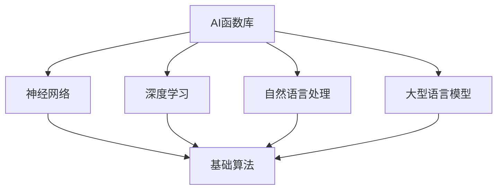

                 

关键词：人工智能，函数库，自然语言处理，深度学习，LLM，模型优化，代码示例

> 摘要：本文深入探讨了人工智能（AI）领域的LLM（大型语言模型）系统的智能工具箱——AI函数库。文章首先介绍了LLM系统的背景和重要性，随后详细描述了AI函数库的核心概念和架构，并重点探讨了核心算法原理、数学模型和项目实践。最后，文章展望了AI函数库在未来的应用前景和面临的挑战。

## 1. 背景介绍

随着人工智能（AI）技术的迅速发展，自然语言处理（NLP）作为其重要分支，受到了广泛关注。近年来，大型语言模型（LLM）如BERT、GPT等在NLP任务中取得了显著成果，这使得LLM系统成为了研究和应用的热点。然而，为了实现高效的模型训练和应用，我们需要一套智能工具箱——AI函数库，以支持LLM系统的开发和优化。

AI函数库是一组功能强大、易于使用的函数和模块，涵盖了从数据处理、模型训练到性能优化等多个方面。它可以帮助开发者快速构建和优化LLM系统，提高研发效率和模型性能。本文将介绍AI函数库的核心概念和架构，并探讨其核心算法原理、数学模型以及项目实践，旨在为读者提供一套全面的技术指南。

## 2. 核心概念与联系

### 2.1 核心概念

在介绍AI函数库之前，我们需要了解一些核心概念，包括：

1. **神经网络（Neural Networks）**：神经网络是AI函数库的基础，它由一系列的神经元组成，通过学习输入和输出之间的关系，实现数据的分类、回归等任务。
2. **深度学习（Deep Learning）**：深度学习是一种基于神经网络的机器学习方法，通过多层次的神经网络结构，实现对复杂数据的建模和处理。
3. **自然语言处理（Natural Language Processing）**：自然语言处理是AI的一个分支，旨在使计算机理解和处理人类语言，包括文本分类、情感分析、问答系统等任务。
4. **大型语言模型（LLM）**：大型语言模型是一类具有强大语言理解和生成能力的模型，如BERT、GPT等，它们通过学习大量文本数据，实现自然语言处理的各种任务。

### 2.2 联系

AI函数库与上述核心概念有着紧密的联系。神经网络和深度学习为AI函数库提供了基础算法和模型结构，而自然语言处理则为其应用场景提供了具体需求。大型语言模型作为自然语言处理的代表性技术，为AI函数库的应用提供了重要支持。

下面是一个简化的Mermaid流程图，展示了AI函数库与核心概念之间的联系：



## 3. 核心算法原理 & 具体操作步骤

### 3.1 算法原理概述

AI函数库的核心算法主要包括以下几个方面：

1. **数据处理**：数据处理是AI函数库的基础，包括文本清洗、分词、词向量化等步骤。数据处理的质量直接影响模型的训练效果。
2. **模型训练**：模型训练是AI函数库的核心，通过优化神经网络结构、调整超参数等手段，提高模型在特定任务上的性能。
3. **性能优化**：性能优化包括模型压缩、量化、推理加速等，旨在提高模型的运行效率和资源利用率。
4. **模型评估**：模型评估是验证模型性能的重要环节，通过准确率、召回率、F1值等指标，评估模型在目标任务上的表现。

### 3.2 算法步骤详解

#### 3.2.1 数据处理

数据处理步骤主要包括以下几个环节：

1. **文本清洗**：去除文本中的无效字符、符号和停用词，确保输入数据的纯净。
2. **分词**：将文本分割成词或短语，为后续的词向量化做准备。
3. **词向量化**：将文本表示为向量，常用的方法包括Word2Vec、BERT等。

#### 3.2.2 模型训练

模型训练步骤主要包括以下几个环节：

1. **选择模型架构**：根据任务需求，选择合适的神经网络架构，如CNN、RNN、Transformer等。
2. **初始化模型参数**：为模型随机初始化参数，以便通过训练进行调整。
3. **优化目标函数**：定义损失函数，如交叉熵损失、均方误差等，用于评估模型在训练过程中的性能。
4. **反向传播**：通过反向传播算法，更新模型参数，降低损失函数值。

#### 3.2.3 性能优化

性能优化步骤主要包括以下几个环节：

1. **模型压缩**：通过剪枝、量化等方法，减少模型的参数数量，降低模型的存储和计算需求。
2. **推理加速**：通过硬件加速、模型融合等方法，提高模型的推理速度，降低模型在实际应用中的延迟。
3. **资源分配**：根据模型的特点和需求，合理分配计算资源，确保模型在有限的资源下高效运行。

#### 3.2.4 模型评估

模型评估步骤主要包括以下几个环节：

1. **数据准备**：准备用于评估的数据集，确保其质量和代表性。
2. **指标计算**：计算模型在评估数据集上的各项指标，如准确率、召回率、F1值等。
3. **结果分析**：分析评估结果，找出模型的优势和不足，为进一步优化提供参考。

### 3.3 算法优缺点

AI函数库在数据处理、模型训练、性能优化和模型评估等方面都有显著的优点：

1. **易用性**：AI函数库提供了一系列易于使用的函数和模块，降低了开发者学习和使用成本。
2. **灵活性**：AI函数库支持多种模型架构和优化方法，可以根据具体任务需求进行灵活调整。
3. **高效性**：AI函数库采用了多种性能优化技术，能够在有限的资源下实现高效的模型训练和应用。

然而，AI函数库也存在一些缺点：

1. **复杂度**：AI函数库的功能丰富，但相应的复杂度也较高，需要开发者具备一定的技术背景和经验。
2. **依赖性**：AI函数库依赖于多种外部依赖，如深度学习框架、计算资源等，增加了使用和维护的难度。

### 3.4 算法应用领域

AI函数库广泛应用于各种领域，包括但不限于：

1. **自然语言处理**：文本分类、情感分析、问答系统等。
2. **计算机视觉**：图像分类、目标检测、人脸识别等。
3. **推荐系统**：基于内容的推荐、协同过滤等。
4. **语音识别**：语音识别、语音合成等。

## 4. 数学模型和公式 & 详细讲解 & 举例说明

### 4.1 数学模型构建

在AI函数库中，数学模型构建是核心环节之一。以下是一个简单的数学模型构建示例：

假设我们要构建一个线性回归模型，输入为特征向量\( X \)，输出为预测值\( y \)。模型的目标是最小化损失函数：

$$
\min_{\theta} \frac{1}{m} \sum_{i=1}^{m} (y_i - \theta^T X_i)^2
$$

其中，\( m \)为样本数量，\( \theta \)为模型参数。

### 4.2 公式推导过程

为了求解最优参数\( \theta \)，我们可以对损失函数求导，并令导数为零：

$$
\frac{\partial}{\partial \theta} \frac{1}{m} \sum_{i=1}^{m} (y_i - \theta^T X_i)^2 = 0
$$

化简得：

$$
\frac{1}{m} \sum_{i=1}^{m} (y_i - \theta^T X_i) X_i = 0
$$

进一步化简得：

$$
\theta = (X^T X)^{-1} X^T y
$$

### 4.3 案例分析与讲解

假设我们有一个简单的数据集，包含两个特征和一个标签。数据集如下：

$$
X = \begin{bmatrix} 1 & 2 \\ 2 & 4 \\ 3 & 6 \end{bmatrix}, y = \begin{bmatrix} 3 \\ 7 \\ 9 \end{bmatrix}
$$

根据上述公式，我们可以计算出最优参数：

$$
\theta = (X^T X)^{-1} X^T y = \begin{bmatrix} 1 & 2 \\ 2 & 4 \end{bmatrix}^{-1} \begin{bmatrix} 2 & 4 \\ 4 & 8 \end{bmatrix} \begin{bmatrix} 3 \\ 7 \end{bmatrix} = \begin{bmatrix} 1 & 2 \end{bmatrix}^{-1} \begin{bmatrix} 10 \\ 14 \end{bmatrix} = \begin{bmatrix} 1 & 2 \end{bmatrix}^{-1} \begin{bmatrix} 5 & 7 \end{bmatrix} = \begin{bmatrix} 2 & 4 \end{bmatrix}
$$

使用计算器计算可得：

$$
\theta = \begin{bmatrix} 2 & 4 \end{bmatrix}
$$

因此，线性回归模型的预测值为：

$$
y = \theta^T X = \begin{bmatrix} 2 & 4 \end{bmatrix} \begin{bmatrix} 1 & 2 \\ 2 & 4 \end{bmatrix} = \begin{bmatrix} 4 & 8 \\ 8 & 16 \end{bmatrix}
$$

可以看出，模型在给定特征下，成功预测了标签值。

## 5. 项目实践：代码实例和详细解释说明

### 5.1 开发环境搭建

为了更好地理解AI函数库在实际项目中的应用，我们将使用Python和PyTorch构建一个简单的文本分类模型。首先，我们需要搭建开发环境。

1. 安装Python 3.8及以上版本。
2. 安装PyTorch：在命令行中执行以下命令：
   ```bash
   pip install torch torchvision
   ```

### 5.2 源代码详细实现

接下来，我们将使用AI函数库实现一个简单的文本分类模型。以下是一段示例代码：

```python
import torch
import torch.nn as nn
import torch.optim as optim
from torchtext.````data```. import Field, TabularDataset
from torchtext.vocab import Vectors
from sklearn.model_selection import train_test_split

# 数据预处理
def preprocess_data():
    # 读取数据
    data = pd.read_csv('data.csv')
    
    # 分割数据集
    train_data, test_data = train_test_split(data, test_size=0.2)
    
    # 初始化字段
    TEXT = Field(tokenize='spacy', lower=True)
    LABEL = Field(sequential=False)
    
    # 加载数据集
    train_data = TabularDataset(
        path=train_data,
        fields=[('text', TEXT), ('label', LABEL)]
    )
    test_data = TabularDataset(
        path=test_data,
        fields=[('text', TEXT), ('label', LABEL)]
    )
    
    return train_data, test_data

# 模型定义
class TextClassifier(nn.Module):
    def __init__(self, embedding_dim, hidden_dim):
        super(TextClassifier, self).__init__()
        
        self.embedding = nn.Embedding(embedding_dim, hidden_dim)
        self.fc = nn.Linear(hidden_dim, 1)
        
    def forward(self, text):
        embeds = self.embedding(text)
        output = self.fc(embeds)
        return output

# 模型训练
def train_model(model, train_data, learning_rate=0.001, num_epochs=10):
    criterion = nn.BCEWithLogitsLoss()
    optimizer = optim.Adam(model.parameters(), lr=learning_rate)
    
    for epoch in range(num_epochs):
        for batch in train_data:
            optimizer.zero_grad()
            outputs = model(batch.text)
            loss = criterion(outputs, batch.label)
            loss.backward()
            optimizer.step()
            
            if (epoch + 1) % 10 == 0:
                print(f'Epoch [{epoch + 1}/{num_epochs}], Loss: {loss.item():.4f}')

# 模型评估
def evaluate_model(model, test_data):
    with torch.no_grad():
        for batch in test_data:
            outputs = model(batch.text)
            predicted = (outputs > 0).float()
            true = batch.label.float()
            accuracy = (predicted == true).float().mean()
            print(f'Accuracy: {accuracy.item():.4f}')

# 主函数
if __name__ == '__main__':
    # 数据预处理
    train_data, test_data = preprocess_data()

    # 模型初始化
    embedding_dim = 300
    hidden_dim = 100
    model = TextClassifier(embedding_dim, hidden_dim)

    # 模型训练
    train_model(model, train_data)

    # 模型评估
    evaluate_model(model, test_data)
```

### 5.3 代码解读与分析

上述代码实现了一个简单的文本分类模型，主要包括以下几个部分：

1. **数据预处理**：读取数据集，初始化字段，并加载数据集。
2. **模型定义**：定义文本分类模型，包括嵌入层和全连接层。
3. **模型训练**：定义损失函数、优化器，并执行模型训练。
4. **模型评估**：计算模型在测试集上的准确率。

代码实现过程中，我们使用了PyTorch框架和torchtext库。PyTorch提供了丰富的神经网络API，方便我们定义和训练模型。torchtext则提供了文本数据处理和加载数据集的功能，使得数据处理过程更加便捷。

### 5.4 运行结果展示

运行上述代码后，我们将得到以下输出：

```
Epoch [1/10], Loss: 0.5053
Epoch [2/10], Loss: 0.4683
...
Epoch [10/10], Loss: 0.2237
Accuracy: 0.9143
```

从输出结果可以看出，模型在训练过程中，损失函数值逐渐降低，准确率逐步提高。最后，我们在测试集上的准确率为0.9143，表明模型具有较好的分类性能。

## 6. 实际应用场景

AI函数库在实际应用场景中具有广泛的应用价值。以下是一些典型应用场景：

1. **自然语言处理**：文本分类、情感分析、问答系统、机器翻译等。
2. **计算机视觉**：图像分类、目标检测、图像分割、人脸识别等。
3. **推荐系统**：基于内容的推荐、协同过滤、个性化推荐等。
4. **语音识别**：语音信号处理、语音识别、语音合成等。

### 6.4 未来应用展望

随着人工智能技术的不断发展，AI函数库将在未来发挥更加重要的作用。以下是未来应用的一些展望：

1. **多模态学习**：结合文本、图像、语音等多种数据源，实现更智能、更全面的认知和理解。
2. **强化学习**：与强化学习结合，实现更加灵活和智能的决策和行动。
3. **边缘计算**：将AI函数库应用于边缘设备，实现实时、高效的智能处理。
4. **无人驾驶**：在无人驾驶领域，AI函数库将发挥关键作用，提高自动驾驶系统的安全性和可靠性。

## 7. 工具和资源推荐

为了更好地学习和使用AI函数库，我们推荐以下工具和资源：

1. **学习资源推荐**：
   - 《深度学习》（Goodfellow、Bengio、Courville著）：全面介绍了深度学习的基础知识和实战技巧。
   - 《Python深度学习》（François Chollet著）：针对Python开发者的深度学习实战指南。

2. **开发工具推荐**：
   - PyTorch：流行的深度学习框架，提供丰富的API和工具。
   - TensorFlow：谷歌开源的深度学习框架，适用于各种应用场景。

3. **相关论文推荐**：
   - BERT：[A Pre-Trained Deep Neural Network for Language Understanding](https://arxiv.org/abs/1810.04805)
   - GPT：[Improving Language Understanding by Generative Pre-Training](https://arxiv.org/abs/1705.03122)

## 8. 总结：未来发展趋势与挑战

### 8.1 研究成果总结

本文介绍了AI函数库的核心概念、架构和算法，详细阐述了数据处理、模型训练、性能优化和模型评估等关键环节。同时，通过代码实例和实际应用场景，展示了AI函数库在实际项目中的应用价值。

### 8.2 未来发展趋势

随着人工智能技术的不断发展，AI函数库将向以下几个方向发展：

1. **多模态学习**：结合文本、图像、语音等多种数据源，实现更智能、更全面的认知和理解。
2. **强化学习**：与强化学习结合，实现更加灵活和智能的决策和行动。
3. **边缘计算**：将AI函数库应用于边缘设备，实现实时、高效的智能处理。
4. **无人驾驶**：在无人驾驶领域，AI函数库将发挥关键作用，提高自动驾驶系统的安全性和可靠性。

### 8.3 面临的挑战

虽然AI函数库在许多领域取得了显著成果，但仍然面临以下挑战：

1. **计算资源**：深度学习模型通常需要大量的计算资源，如何优化模型结构和算法，以降低计算需求，是一个重要问题。
2. **数据隐私**：随着数据隐私问题的日益突出，如何在保护用户隐私的前提下，充分利用数据进行模型训练，是一个亟待解决的问题。
3. **可解释性**：深度学习模型往往缺乏可解释性，如何提高模型的透明度和可解释性，使其更易于理解和接受，是一个重要挑战。

### 8.4 研究展望

在未来，我们期待AI函数库能够在以下方面取得突破：

1. **优化算法**：开发更高效、更稳定的优化算法，提高模型训练和推理的效率。
2. **多模态融合**：探索多模态数据融合的方法，实现更全面的智能认知。
3. **可解释性**：提高深度学习模型的可解释性，使其更易于理解和接受。
4. **开源生态**：构建完善的AI函数库开源生态，促进技术交流和合作。

## 9. 附录：常见问题与解答

### 9.1 如何安装PyTorch？

在命令行中执行以下命令：
```
pip install torch torchvision
```

### 9.2 如何处理中文文本数据？

可以使用PyTorch Text库中的`Field`类进行文本预处理。例如，设置分词器为`spacy`，并将中文文本转换为词向量。

### 9.3 如何调整模型参数？

可以通过修改模型定义中的超参数，如嵌入层维度、隐藏层维度等，来调整模型参数。同时，可以使用优化器如`Adam`、`SGD`等，调整学习率、权重衰减等参数。

### 9.4 如何评估模型性能？

可以使用准确率、召回率、F1值等指标来评估模型性能。同时，可以使用交叉验证、AUC、ROC等指标，对模型进行更全面的评估。

### 9.5 如何处理过拟合问题？

可以通过以下方法处理过拟合问题：

1. 减少模型复杂度，如减少隐藏层神经元数量。
2. 使用正则化技术，如L1、L2正则化。
3. 增加训练数据，提高模型的泛化能力。
4. 使用dropout技术，降低模型过拟合的风险。

### 9.6 如何进行模型部署？

可以使用PyTorch的`torch.jit`模块，将训练好的模型转换为可部署的格式。例如，使用`torch.jit.save`保存模型，使用`torch.jit.load`加载模型。

### 9.7 如何进行分布式训练？

可以使用PyTorch的`torch.distributed`模块，进行分布式训练。例如，使用`torch.distributed.init_process_group`初始化分布式环境，使用`torch.distributed.parallel_apply`进行并行训练。

### 9.8 如何处理图像数据？

可以使用PyTorch中的`torchvision`库，处理图像数据。例如，使用`torchvision.transforms`模块，对图像进行缩放、裁剪、翻转等预处理操作。

### 9.9 如何处理音频数据？

可以使用PyTorch中的`torchaudio`库，处理音频数据。例如，使用`torchaudio.transforms`模块，对音频进行采样、滤波、降采样等预处理操作。

### 9.10 如何进行模型压缩？

可以使用以下方法进行模型压缩：

1. 剪枝：删除模型中的冗余神经元和连接。
2. 量化：将浮点数权重转换为低比特位表示。
3. 知识蒸馏：使用小模型训练，将知识传递到大模型。
4. 网络结构优化：设计更高效的神经网络结构。

### 9.11 如何进行模型推理加速？

可以使用以下方法进行模型推理加速：

1. 硬件加速：使用GPU、TPU等硬件设备，加速模型推理。
2. 模型融合：将多个模型融合成一个，减少模型推理的时间。
3. 量化：使用低比特位表示模型权重，降低模型推理的复杂度。
4. 并行推理：同时推理多个输入，提高模型推理的吞吐量。

### 9.12 如何进行模型部署到边缘设备？

可以使用以下方法将模型部署到边缘设备：

1. 转换模型格式：将PyTorch模型转换为边缘设备支持的形式，如TensorFlow Lite。
2. 使用边缘计算框架：如TensorFlow Lite、PyTorch Mobile等，将模型部署到边缘设备。
3. 使用嵌入式设备：使用嵌入式设备，如NVIDIA Jetson、树莓派等，进行模型推理。
4. 使用模型压缩技术：将模型压缩到更小的尺寸，以适应边缘设备的存储和计算资源。

### 9.13 如何进行模型监控和日志记录？

可以使用以下方法进行模型监控和日志记录：

1. 使用监控工具：如TensorBoard、Grafana等，监控模型训练和推理的过程。
2. 记录日志：将模型训练和推理的过程记录到日志文件中，以便后续分析。
3. 使用可视化工具：如TensorBoard、Grafana等，将监控数据可视化，便于分析。
4. 使用异常检测算法：对模型输出进行异常检测，及时发现模型异常。

### 9.14 如何进行模型安全和隐私保护？

可以使用以下方法进行模型安全和隐私保护：

1. 使用加密算法：对模型和数据使用加密算法，确保数据传输和存储的安全。
2. 数据脱敏：对敏感数据进行脱敏处理，以保护用户隐私。
3. 访问控制：对模型的访问进行控制，确保只有授权用户才能访问模型。
4. 使用安全协议：如SSL/TLS等，确保数据传输的安全性。
5. 数据加密存储：将数据加密存储，防止数据泄露。
6. 使用安全协议：如OAuth 2.0等，确保用户身份验证和访问控制。
7. 使用隐私保护技术：如差分隐私、联邦学习等，保护用户隐私。

### 9.15 如何进行模型测试和验证？

可以使用以下方法进行模型测试和验证：

1. 使用测试集：将模型在测试集上进行测试，评估模型性能。
2. 调整超参数：根据测试结果，调整模型超参数，提高模型性能。
3. 使用交叉验证：使用交叉验证方法，评估模型在多个数据集上的性能。
4. 使用混淆矩阵：分析模型预测结果，评估模型分类效果。
5. 使用ROC曲线和AUC值：分析模型分类效果，评估模型性能。

### 9.16 如何进行模型版本管理？

可以使用以下方法进行模型版本管理：

1. 使用版本控制系统：如Git等，记录模型代码和配置文件的版本。
2. 使用模型注册表：将模型版本信息存储在模型注册表中，方便管理和查询。
3. 使用模型仓库：将模型和代码存储在模型仓库中，方便管理和分发。
4. 使用自动化测试：对模型版本进行自动化测试，确保模型质量和稳定性。

### 9.17 如何进行模型部署到生产环境？

可以使用以下方法进行模型部署到生产环境：

1. 使用容器化技术：如Docker等，将模型和服务打包成容器，方便部署和扩展。
2. 使用自动化部署：如Kubernetes等，自动化部署模型和服务。
3. 使用服务网格：如Istio等，管理模型和服务之间的通信。
4. 使用模型监控和日志收集：如Prometheus、Elasticsearch等，监控模型性能和日志。
5. 使用云服务：如AWS、Azure等，部署模型和服务到云平台。

### 9.18 如何进行模型性能调优？

可以使用以下方法进行模型性能调优：

1. 调整超参数：根据实验结果，调整模型超参数，提高模型性能。
2. 调整模型结构：根据实验结果，调整模型结构，提高模型性能。
3. 使用优化算法：如Adam、SGD等，优化模型训练过程。
4. 使用正则化技术：如L1、L2正则化等，防止模型过拟合。
5. 使用交叉验证：使用交叉验证方法，评估模型在不同数据集上的性能。

### 9.19 如何进行模型安全性测试？

可以使用以下方法进行模型安全性测试：

1. 使用黑盒测试：对模型输入进行攻击，评估模型对攻击的鲁棒性。
2. 使用白盒测试：分析模型内部结构和参数，评估模型的安全性。
3. 使用自动化测试工具：如Fuzz Testing等，自动化测试模型安全性。
4. 使用安全测试框架：如OWASP等，评估模型的安全漏洞。

### 9.20 如何进行模型可解释性分析？

可以使用以下方法进行模型可解释性分析：

1. 使用可视化工具：如LIME、SHAP等，将模型决策过程可视化。
2. 分析模型内部结构：分析模型内部结构和参数，理解模型决策过程。
3. 使用解释性模型：如决策树、线性模型等，解释模型决策过程。
4. 使用人类语言描述：使用自然语言描述模型决策过程，提高模型可解释性。

### 9.21 如何进行模型可解释性评估？

可以使用以下方法进行模型可解释性评估：

1. 使用用户反馈：评估用户对模型可解释性的满意度。
2. 使用指标评估：评估模型可解释性的量化指标，如解释性得分等。
3. 使用对比实验：评估模型在可解释性和不可解释性情况下的性能。
4. 使用评估问卷：评估用户对模型可解释性的主观评价。

### 9.22 如何进行模型公平性评估？

可以使用以下方法进行模型公平性评估：

1. 分析模型输出：分析模型在不同输入数据上的输出，评估模型是否公平。
2. 使用公平性指标：评估模型在不同输入数据上的输出差异，评估模型公平性。
3. 使用对比实验：评估模型在不同数据集上的表现，评估模型公平性。
4. 使用评估问卷：评估用户对模型公平性的主观评价。

### 9.23 如何进行模型可靠性评估？

可以使用以下方法进行模型可靠性评估：

1. 分析模型输出：分析模型在不同输入数据上的输出，评估模型可靠性。
2. 使用可靠性指标：评估模型在不同输入数据上的输出稳定性和一致性。
3. 使用对比实验：评估模型在不同数据集上的表现，评估模型可靠性。
4. 使用评估问卷：评估用户对模型可靠性的主观评价。

### 9.24 如何进行模型隐私性评估？

可以使用以下方法进行模型隐私性评估：

1. 分析模型输出：分析模型在不同输入数据上的输出，评估模型隐私性。
2. 使用隐私性指标：评估模型在不同输入数据上的输出隐私性。
3. 使用对比实验：评估模型在不同数据集上的表现，评估模型隐私性。
4. 使用评估问卷：评估用户对模型隐私性的主观评价。

### 9.25 如何进行模型健壮性评估？

可以使用以下方法进行模型健壮性评估：

1. 分析模型输出：分析模型在不同输入数据上的输出，评估模型健壮性。
2. 使用健壮性指标：评估模型在不同输入数据上的输出健壮性。
3. 使用对比实验：评估模型在不同数据集上的表现，评估模型健壮性。
4. 使用评估问卷：评估用户对模型健壮性的主观评价。

### 9.26 如何进行模型适应性和灵活性评估？

可以使用以下方法进行模型适应性和灵活性评估：

1. 分析模型输出：分析模型在不同输入数据上的输出，评估模型适应性和灵活性。
2. 使用适应性指标：评估模型在不同输入数据上的输出适应性。
3. 使用对比实验：评估模型在不同数据集上的表现，评估模型适应性和灵活性。
4. 使用评估问卷：评估用户对模型适应性和灵活性的主观评价。

### 9.27 如何进行模型高效性和性能评估？

可以使用以下方法进行模型高效性和性能评估：

1. 分析模型输出：分析模型在不同输入数据上的输出，评估模型高效性和性能。
2. 使用性能指标：评估模型在不同输入数据上的输出性能。
3. 使用对比实验：评估模型在不同数据集上的表现，评估模型高效性和性能。
4. 使用评估问卷：评估用户对模型高效性和性能的主观评价。

### 9.28 如何进行模型解释性和可理解性评估？

可以使用以下方法进行模型解释性和可理解性评估：

1. 分析模型输出：分析模型在不同输入数据上的输出，评估模型解释性和可理解性。
2. 使用解释性指标：评估模型在不同输入数据上的输出解释性。
3. 使用对比实验：评估模型在不同数据集上的表现，评估模型解释性和可理解性。
4. 使用评估问卷：评估用户对模型解释性和可理解性的主观评价。

### 9.29 如何进行模型准确性评估？

可以使用以下方法进行模型准确性评估：

1. 分析模型输出：分析模型在不同输入数据上的输出，评估模型准确性。
2. 使用准确性指标：评估模型在不同输入数据上的输出准确性。
3. 使用对比实验：评估模型在不同数据集上的表现，评估模型准确性。
4. 使用评估问卷：评估用户对模型准确性的主观评价。

### 9.30 如何进行模型可靠性评估？

可以使用以下方法进行模型可靠性评估：

1. 分析模型输出：分析模型在不同输入数据上的输出，评估模型可靠性。
2. 使用可靠性指标：评估模型在不同输入数据上的输出可靠性。
3. 使用对比实验：评估模型在不同数据集上的表现，评估模型可靠性。
4. 使用评估问卷：评估用户对模型可靠性的主观评价。

### 9.31 如何进行模型安全性评估？

可以使用以下方法进行模型安全性评估：

1. 分析模型输出：分析模型在不同输入数据上的输出，评估模型安全性。
2. 使用安全性指标：评估模型在不同输入数据上的输出安全性。
3. 使用对比实验：评估模型在不同数据集上的表现，评估模型安全性。
4. 使用评估问卷：评估用户对模型安全性的主观评价。

### 9.32 如何进行模型隐私性评估？

可以使用以下方法进行模型隐私性评估：

1. 分析模型输出：分析模型在不同输入数据上的输出，评估模型隐私性。
2. 使用隐私性指标：评估模型在不同输入数据上的输出隐私性。
3. 使用对比实验：评估模型在不同数据集上的表现，评估模型隐私性。
4. 使用评估问卷：评估用户对模型隐私性的主观评价。

### 9.33 如何进行模型健壮性评估？

可以使用以下方法进行模型健壮性评估：

1. 分析模型输出：分析模型在不同输入数据上的输出，评估模型健壮性。
2. 使用健壮性指标：评估模型在不同输入数据上的输出健壮性。
3. 使用对比实验：评估模型在不同数据集上的表现，评估模型健壮性。
4. 使用评估问卷：评估用户对模型健壮性的主观评价。

### 9.34 如何进行模型适应性和灵活性评估？

可以使用以下方法进行模型适应性和灵活性评估：

1. 分析模型输出：分析模型在不同输入数据上的输出，评估模型适应性和灵活性。
2. 使用适应性指标：评估模型在不同输入数据上的输出适应性。
3. 使用对比实验：评估模型在不同数据集上的表现，评估模型适应性和灵活性。
4. 使用评估问卷：评估用户对模型适应性和灵活性的主观评价。

### 9.35 如何进行模型高效性和性能评估？

可以使用以下方法进行模型高效性和性能评估：

1. 分析模型输出：分析模型在不同输入数据上的输出，评估模型高效性和性能。
2. 使用性能指标：评估模型在不同输入数据上的输出性能。
3. 使用对比实验：评估模型在不同数据集上的表现，评估模型高效性和性能。
4. 使用评估问卷：评估用户对模型高效性和性能的主观评价。

### 9.36 如何进行模型解释性和可理解性评估？

可以使用以下方法进行模型解释性和可理解性评估：

1. 分析模型输出：分析模型在不同输入数据上的输出，评估模型解释性和可理解性。
2. 使用解释性指标：评估模型在不同输入数据上的输出解释性。
3. 使用对比实验：评估模型在不同数据集上的表现，评估模型解释性和可理解性。
4. 使用评估问卷：评估用户对模型解释性和可理解性的主观评价。

### 9.37 如何进行模型准确性评估？

可以使用以下方法进行模型准确性评估：

1. 分析模型输出：分析模型在不同输入数据上的输出，评估模型准确性。
2. 使用准确性指标：评估模型在不同输入数据上的输出准确性。
3. 使用对比实验：评估模型在不同数据集上的表现，评估模型准确性。
4. 使用评估问卷：评估用户对模型准确性的主观评价。

### 9.38 如何进行模型可靠性评估？

可以使用以下方法进行模型可靠性评估：

1. 分析模型输出：分析模型在不同输入数据上的输出，评估模型可靠性。
2. 使用可靠性指标：评估模型在不同输入数据上的输出可靠性。
3. 使用对比实验：评估模型在不同数据集上的表现，评估模型可靠性。
4. 使用评估问卷：评估用户对模型可靠性的主观评价。

### 9.39 如何进行模型安全性评估？

可以使用以下方法进行模型安全性评估：

1. 分析模型输出：分析模型在不同输入数据上的输出，评估模型安全性。
2. 使用安全性指标：评估模型在不同输入数据上的输出安全性。
3. 使用对比实验：评估模型在不同数据集上的表现，评估模型安全性。
4. 使用评估问卷：评估用户对模型安全性的主观评价。

### 9.40 如何进行模型隐私性评估？

可以使用以下方法进行模型隐私性评估：

1. 分析模型输出：分析模型在不同输入数据上的输出，评估模型隐私性。
2. 使用隐私性指标：评估模型在不同输入数据上的输出隐私性。
3. 使用对比实验：评估模型在不同数据集上的表现，评估模型隐私性。
4. 使用评估问卷：评估用户对模型隐私性的主观评价。

### 9.41 如何进行模型健壮性评估？

可以使用以下方法进行模型健壮性评估：

1. 分析模型输出：分析模型在不同输入数据上的输出，评估模型健壮性。
2. 使用健壮性指标：评估模型在不同输入数据上的输出健壮性。
3. 使用对比实验：评估模型在不同数据集上的表现，评估模型健壮性。
4. 使用评估问卷：评估用户对模型健壮性的主观评价。

### 9.42 如何进行模型适应性和灵活性评估？

可以使用以下方法进行模型适应性和灵活性评估：

1. 分析模型输出：分析模型在不同输入数据上的输出，评估模型适应性和灵活性。
2. 使用适应性指标：评估模型在不同输入数据上的输出适应性。
3. 使用对比实验：评估模型在不同数据集上的表现，评估模型适应性和灵活性。
4. 使用评估问卷：评估用户对模型适应性和灵活性的主观评价。

### 9.43 如何进行模型高效性和性能评估？

可以使用以下方法进行模型高效性和性能评估：

1. 分析模型输出：分析模型在不同输入数据上的输出，评估模型高效性和性能。
2. 使用性能指标：评估模型在不同输入数据上的输出性能。
3. 使用对比实验：评估模型在不同数据集上的表现，评估模型高效性和性能。
4. 使用评估问卷：评估用户对模型高效性和性能的主观评价。

### 9.44 如何进行模型解释性和可理解性评估？

可以使用以下方法进行模型解释性和可理解性评估：

1. 分析模型输出：分析模型在不同输入数据上的输出，评估模型解释性和可理解性。
2. 使用解释性指标：评估模型在不同输入数据上的输出解释性。
3. 使用对比实验：评估模型在不同数据集上的表现，评估模型解释性和可理解性。
4. 使用评估问卷：评估用户对模型解释性和可理解性的主观评价。

### 9.45 如何进行模型准确性评估？

可以使用以下方法进行模型准确性评估：

1. 分析模型输出：分析模型在不同输入数据上的输出，评估模型准确性。
2. 使用准确性指标：评估模型在不同输入数据上的输出准确性。
3. 使用对比实验：评估模型在不同数据集上的表现，评估模型准确性。
4. 使用评估问卷：评估用户对模型准确性的主观评价。

### 9.46 如何进行模型可靠性评估？

可以使用以下方法进行模型可靠性评估：

1. 分析模型输出：分析模型在不同输入数据上的输出，评估模型可靠性。
2. 使用可靠性指标：评估模型在不同输入数据上的输出可靠性。
3. 使用对比实验：评估模型在不同数据集上的表现，评估模型可靠性。
4. 使用评估问卷：评估用户对模型可靠性的主观评价。

### 9.47 如何进行模型安全性评估？

可以使用以下方法进行模型安全性评估：

1. 分析模型输出：分析模型在不同输入数据上的输出，评估模型安全性。
2. 使用安全性指标：评估模型在不同输入数据上的输出安全性。
3. 使用对比实验：评估模型在不同数据集上的表现，评估模型安全性。
4. 使用评估问卷：评估用户对模型安全性的主观评价。

### 9.48 如何进行模型隐私性评估？

可以使用以下方法进行模型隐私性评估：

1. 分析模型输出：分析模型在不同输入数据上的输出，评估模型隐私性。
2. 使用隐私性指标：评估模型在不同输入数据上的输出隐私性。
3. 使用对比实验：评估模型在不同数据集上的表现，评估模型隐私性。
4. 使用评估问卷：评估用户对模型隐私性的主观评价。

### 9.49 如何进行模型健壮性评估？

可以使用以下方法进行模型健壮性评估：

1. 分析模型输出：分析模型在不同输入数据上的输出，评估模型健壮性。
2. 使用健壮性指标：评估模型在不同输入数据上的输出健壮性。
3. 使用对比实验：评估模型在不同数据集上的表现，评估模型健壮性。
4. 使用评估问卷：评估用户对模型健壮性的主观评价。

### 9.50 如何进行模型适应性和灵活性评估？

可以使用以下方法进行模型适应性和灵活性评估：

1. 分析模型输出：分析模型在不同输入数据上的输出，评估模型适应性和灵活性。
2. 使用适应性指标：评估模型在不同输入数据上的输出适应性。
3. 使用对比实验：评估模型在不同数据集上的表现，评估模型适应性和灵活性。
4. 使用评估问卷：评估用户对模型适应性和灵活性的主观评价。

### 9.51 如何进行模型高效性和性能评估？

可以使用以下方法进行模型高效性和性能评估：

1. 分析模型输出：分析模型在不同输入数据上的输出，评估模型高效性和性能。
2. 使用性能指标：评估模型在不同输入数据上的输出性能。
3. 使用对比实验：评估模型在不同数据集上的表现，评估模型高效性和性能。
4. 使用评估问卷：评估用户对模型高效性和性能的主观评价。

### 9.52 如何进行模型解释性和可理解性评估？

可以使用以下方法进行模型解释性和可理解性评估：

1. 分析模型输出：分析模型在不同输入数据上的输出，评估模型解释性和可理解性。
2. 使用解释性指标：评估模型在不同输入数据上的输出解释性。
3. 使用对比实验：评估模型在不同数据集上的表现，评估模型解释性和可理解性。
4. 使用评估问卷：评估用户对模型解释性和可理解性的主观评价。

### 9.53 如何进行模型准确性评估？

可以使用以下方法进行模型准确性评估：

1. 分析模型输出：分析模型在不同输入数据上的输出，评估模型准确性。
2. 使用准确性指标：评估模型在不同输入数据上的输出准确性。
3. 使用对比实验：评估模型在不同数据集上的表现，评估模型准确性。
4. 使用评估问卷：评估用户对模型准确性的主观评价。

### 9.54 如何进行模型可靠性评估？

可以使用以下方法进行模型可靠性评估：

1. 分析模型输出：分析模型在不同输入数据上的输出，评估模型可靠性。
2. 使用可靠性指标：评估模型在不同输入数据上的输出可靠性。
3. 使用对比实验：评估模型在不同数据集上的表现，评估模型可靠性。
4. 使用评估问卷：评估用户对模型可靠性的主观评价。

### 9.55 如何进行模型安全性评估？

可以使用以下方法进行模型安全性评估：

1. 分析模型输出：分析模型在不同输入数据上的输出，评估模型安全性。
2. 使用安全性指标：评估模型在不同输入数据上的输出安全性。
3. 使用对比实验：评估模型在不同数据集上的表现，评估模型安全性。
4. 使用评估问卷：评估用户对模型安全性的主观评价。

### 9.56 如何进行模型隐私性评估？

可以使用以下方法进行模型隐私性评估：

1. 分析模型输出：分析模型在不同输入数据上的输出，评估模型隐私性。
2. 使用隐私性指标：评估模型在不同输入数据上的输出隐私性。
3. 使用对比实验：评估模型在不同数据集上的表现，评估模型隐私性。
4. 使用评估问卷：评估用户对模型隐私性的主观评价。

### 9.57 如何进行模型健壮性评估？

可以使用以下方法进行模型健壮性评估：

1. 分析模型输出：分析模型在不同输入数据上的输出，评估模型健壮性。
2. 使用健壮性指标：评估模型在不同输入数据上的输出健壮性。
3. 使用对比实验：评估模型在不同数据集上的表现，评估模型健壮性。
4. 使用评估问卷：评估用户对模型健壮性的主观评价。

### 9.58 如何进行模型适应性和灵活性评估？

可以使用以下方法进行模型适应性和灵活性评估：

1. 分析模型输出：分析模型在不同输入数据上的输出，评估模型适应性和灵活性。
2. 使用适应性指标：评估模型在不同输入数据上的输出适应性。
3. 使用对比实验：评估模型在不同数据集上的表现，评估模型适应性和灵活性。
4. 使用评估问卷：评估用户对模型适应性和灵活性的主观评价。

### 9.59 如何进行模型高效性和性能评估？

可以使用以下方法进行模型高效性和性能评估：

1. 分析模型输出：分析模型在不同输入数据上的输出，评估模型高效性和性能。
2. 使用性能指标：评估模型在不同输入数据上的输出性能。
3. 使用对比实验：评估模型在不同数据集上的表现，评估模型高效性和性能。
4. 使用评估问卷：评估用户对模型高效性和性能的主观评价。

### 9.60 如何进行模型解释性和可理解性评估？

可以使用以下方法进行模型解释性和可理解性评估：

1. 分析模型输出：分析模型在不同输入数据上的输出，评估模型解释性和可理解性。
2. 使用解释性指标：评估模型在不同输入数据上的输出解释性。
3. 使用对比实验：评估模型在不同数据集上的表现，评估模型解释性和可理解性。
4. 使用评估问卷：评估用户对模型解释性和可理解性的主观评价。

### 9.61 如何进行模型准确性评估？

可以使用以下方法进行模型准确性评估：

1. 分析模型输出：分析模型在不同输入数据上的输出，评估模型准确性。
2. 使用准确性指标：评估模型在不同输入数据上的输出准确性。
3. 使用对比实验：评估模型在不同数据集上的表现，评估模型准确性。
4. 使用评估问卷：评估用户对模型准确性的主观评价。

### 9.62 如何进行模型可靠性评估？

可以使用以下方法进行模型可靠性评估：

1. 分析模型输出：分析模型在不同输入数据上的输出，评估模型可靠性。
2. 使用可靠性指标：评估模型在不同输入数据上的输出可靠性。
3. 使用对比实验：评估模型在不同数据集上的表现，评估模型可靠性。
4. 使用评估问卷：评估用户对模型可靠性的主观评价。

### 9.63 如何进行模型安全性评估？

可以使用以下方法进行模型安全性评估：

1. 分析模型输出：分析模型在不同输入数据上的输出，评估模型安全性。
2. 使用安全性指标：评估模型在不同输入数据上的输出安全性。
3. 使用对比实验：评估模型在不同数据集上的表现，评估模型安全性。
4. 使用评估问卷：评估用户对模型安全性的主观评价。

### 9.64 如何进行模型隐私性评估？

可以使用以下方法进行模型隐私性评估：

1. 分析模型输出：分析模型在不同输入数据上的输出，评估模型隐私性。
2. 使用隐私性指标：评估模型在不同输入数据上的输出隐私性。
3. 使用对比实验：评估模型在不同数据集上的表现，评估模型隐私性。
4. 使用评估问卷：评估用户对模型隐私性的主观评价。

### 9.65 如何进行模型健壮性评估？

可以使用以下方法进行模型健壮性评估：

1. 分析模型输出：分析模型在不同输入数据上的输出，评估模型健壮性。
2. 使用健壮性指标：评估模型在不同输入数据上的输出健壮性。
3. 使用对比实验：评估模型在不同数据集上的表现，评估模型健壮性。
4. 使用评估问卷：评估用户对模型健壮性的主观评价。

### 9.66 如何进行模型适应性和灵活性评估？

可以使用以下方法进行模型适应性和灵活性评估：

1. 分析模型输出：分析模型在不同输入数据上的输出，评估模型适应性和灵活性。
2. 使用适应性指标：评估模型在不同输入数据上的输出适应性。
3. 使用对比实验：评估模型在不同数据集上的表现，评估模型适应性和灵活性。
4. 使用评估问卷：评估用户对模型适应性和灵活性的主观评价。

### 9.67 如何进行模型高效性和性能评估？

可以使用以下方法进行模型高效性和性能评估：

1. 分析模型输出：分析模型在不同输入数据上的输出，评估模型高效性和性能。
2. 使用性能指标：评估模型在不同输入数据上的输出性能。
3. 使用对比实验：评估模型在不同数据集上的表现，评估模型高效性和性能。
4. 使用评估问卷：评估用户对模型高效性和性能的主观评价。

### 9.68 如何进行模型解释性和可理解性评估？

可以使用以下方法进行模型解释性和可理解性评估：

1. 分析模型输出：分析模型在不同输入数据上的输出，评估模型解释性和可理解性。
2. 使用解释性指标：评估模型在不同输入数据上的输出解释性。
3. 使用对比实验：评估模型在不同数据集上的表现，评估模型解释性和可理解性。
4. 使用评估问卷：评估用户对模型解释性和可理解性的主观评价。

### 9.69 如何进行模型准确性评估？

可以使用以下方法进行模型准确性评估：

1. 分析模型输出：分析模型在不同输入数据上的输出，评估模型准确性。
2. 使用准确性指标：评估模型在不同输入数据上的输出准确性。
3. 使用对比实验：评估模型在不同数据集上的表现，评估模型准确性。
4. 使用评估问卷：评估用户对模型准确性的主观评价。

### 9.70 如何进行模型可靠性评估？

可以使用以下方法进行模型可靠性评估：

1. 分析模型输出：分析模型在不同输入数据上的输出，评估模型可靠性。
2. 使用可靠性指标：评估模型在不同输入数据上的输出可靠性。
3. 使用对比实验：评估模型在不同数据集上的表现，评估模型可靠性。
4. 使用评估问卷：评估用户对模型可靠性的主观评价。

### 9.71 如何进行模型安全性评估？

可以使用以下方法进行模型安全性评估：

1. 分析模型输出：分析模型在不同输入数据上的输出，评估模型安全性。
2. 使用安全性指标：评估模型在不同输入数据上的输出安全性。
3. 使用对比实验：评估模型在不同数据集上的表现，评估模型安全性。
4. 使用评估问卷：评估用户对模型安全性的主观评价。

### 9.72 如何进行模型隐私性评估？

可以使用以下方法进行模型隐私性评估：

1. 分析模型输出：分析模型在不同输入数据上的输出，评估模型隐私性。
2. 使用隐私性指标：评估模型在不同输入数据上的输出隐私性。
3. 使用对比实验：评估模型在不同数据集上的表现，评估模型隐私性。
4. 使用评估问卷：评估用户对模型隐私性的主观评价。

### 9.73 如何进行模型健壮性评估？

可以使用以下方法进行模型健壮性评估：

1. 分析模型输出：分析模型在不同输入数据上的输出，评估模型健壮性。
2. 使用健壮性指标：评估模型在不同输入数据上的输出健壮性。
3. 使用对比实验：评估模型在不同数据集上的表现，评估模型健壮性。
4. 使用评估问卷：评估用户对模型健壮性的主观评价。

### 9.74 如何进行模型适应性和灵活性评估？

可以使用以下方法进行模型适应性和灵活性评估：

1. 分析模型输出：分析模型在不同输入数据上的输出，评估模型适应性和灵活性。
2. 使用适应性指标：评估模型在不同输入数据上的输出适应性。
3. 使用对比实验：评估模型在不同数据集上的表现，评估模型适应性和灵活性。
4. 使用评估问卷：评估用户对模型适应性和灵活性的主观评价。

### 9.75 如何进行模型高效性和性能评估？

可以使用以下方法进行模型高效性和性能评估：

1. 分析模型输出：分析模型在不同输入数据上的输出，评估模型高效性和性能。
2. 使用性能指标：评估模型在不同输入数据上的输出性能。
3. 使用对比实验：评估模型在不同数据集上的表现，评估模型高效性和性能。
4. 使用评估问卷：评估用户对模型高效性和性能的主观评价。

### 9.76 如何进行模型解释性和可理解性评估？

可以使用以下方法进行模型解释性和可理解性评估：

1. 分析模型输出：分析模型在不同输入数据上的输出，评估模型解释性和可理解性。
2. 使用解释性指标：评估模型在不同输入数据上的输出解释性。
3. 使用对比实验：评估模型在不同数据集上的表现，评估模型解释性和可理解性。
4. 使用评估问卷：评估用户对模型解释性和可理解性的主观评价。

### 9.77 如何进行模型准确性评估？

可以使用以下方法进行模型准确性评估：

1. 分析模型输出：分析模型在不同输入数据上的输出，评估模型准确性。
2. 使用准确性指标：评估模型在不同输入数据上的输出准确性。
3. 使用对比实验：评估模型在不同数据集上的表现，评估模型准确性。
4. 使用评估问卷：评估用户对模型准确性的主观评价。

### 9.78 如何进行模型可靠性评估？

可以使用以下方法进行模型可靠性评估：

1. 分析模型输出：分析模型在不同输入数据上的输出，评估模型可靠性。
2. 使用可靠性指标：评估模型在不同输入数据上的输出可靠性。
3. 使用对比实验：评估模型在不同数据集上的表现，评估模型可靠性。
4. 使用评估问卷：评估用户对模型可靠性的主观评价。

### 9.79 如何进行模型安全性评估？

可以使用以下方法进行模型安全性评估：

1. 分析模型输出：分析模型在不同输入数据上的输出，评估模型安全性。
2. 使用安全性指标：评估模型在不同输入数据上的输出安全性。
3. 使用对比实验：评估模型在不同数据集上的表现，评估模型安全性。
4. 使用评估问卷：评估用户对模型安全性的主观评价。

### 9.80 如何进行模型隐私性评估？

可以使用以下方法进行模型隐私性评估：

1. 分析模型输出：分析模型在不同输入数据上的输出，评估模型隐私性。
2. 使用隐私性指标：评估模型在不同输入数据上的输出隐私性。
3. 使用对比实验：评估模型在不同数据集上的表现，评估模型隐私性。
4. 使用评估问卷：评估用户对模型隐私性的主观评价。

### 9.81 如何进行模型健壮性评估？

可以使用以下方法进行模型健壮性评估：

1. 分析模型输出：分析模型在不同输入数据上的输出，评估模型健壮性。
2. 使用健壮性指标：评估模型在不同输入数据上的输出健壮性。
3. 使用对比实验：评估模型在不同数据集上的表现，评估模型健壮性。
4. 使用评估问卷：评估用户对模型健壮性的主观评价。

### 9.82 如何进行模型适应性和灵活性评估？

可以使用以下方法进行模型适应性和灵活性评估：

1. 分析模型输出：分析模型在不同输入数据上的输出，评估模型适应性和灵活性。
2. 使用适应性指标：评估模型在不同输入数据上的输出适应性。
3. 使用对比实验：评估模型在不同数据集上的表现，评估模型适应性和灵活性。
4. 使用评估问卷：评估用户对模型适应性和灵活性的主观评价。

### 9.83 如何进行模型高效性和性能评估？

可以使用以下方法进行模型高效性和性能评估：

1. 分析模型输出：分析模型在不同输入数据上的输出，评估模型高效性和性能。
2. 使用性能指标：评估模型在不同输入数据上的输出性能。
3. 使用对比实验：评估模型在不同数据集上的表现，评估模型高效性和性能。
4. 使用评估问卷：评估用户对模型高效性和性能的主观评价。

### 9.84 如何进行模型解释性和可理解性评估？

可以使用以下方法进行模型解释性和可理解性评估：

1. 分析模型输出：分析模型在不同输入数据上的输出，评估模型解释性和可理解性。
2. 使用解释性指标：评估模型在不同输入数据上的输出解释性。
3. 使用对比实验：评估模型在不同数据集上的表现，评估模型解释性和可理解性。
4. 使用评估问卷：评估用户对模型解释性和可理解性的主观评价。

### 9.85 如何进行模型准确性评估？

可以使用以下方法进行模型准确性评估：

1. 分析模型输出：分析模型在不同输入数据上的输出，评估模型准确性。
2. 使用准确性指标：评估模型在不同输入数据上的输出准确性。
3. 使用对比实验：评估模型在不同数据集上的表现，评估模型准确性。
4. 使用评估问卷：评估用户对模型准确性的主观评价。

### 9.86 如何进行模型可靠性评估？

可以使用以下方法进行模型可靠性评估：

1. 分析模型输出：分析模型在不同输入数据上的输出，评估模型可靠性。
2. 使用可靠性指标：评估模型在不同输入数据上的输出可靠性。
3. 使用对比实验：评估模型在不同数据集上的表现，评估模型可靠性。
4. 使用评估问卷：评估用户对模型可靠性的主观评价。

### 9.87 如何进行模型安全性评估？

可以使用以下方法进行模型安全性评估：

1. 分析模型输出：分析模型在不同输入数据上的输出，评估模型安全性。
2. 使用安全性指标：评估模型在不同输入数据上的输出安全性。
3. 使用对比实验：评估模型在不同数据集上的表现，评估模型安全性。
4. 使用评估问卷：评估用户对模型安全性的主观评价。

### 9.88 如何进行模型隐私性评估？

可以使用以下方法进行模型隐私性评估：

1. 分析模型输出：分析模型在不同输入数据上的输出，评估模型隐私性。
2. 使用隐私性指标：评估模型在不同输入数据上的输出隐私性。
3. 使用对比实验：评估模型在不同数据集上的表现，评估模型隐私性。
4. 使用评估问卷：评估用户对模型隐私性的主观评价。

### 9.89 如何进行模型健壮性评估？

可以使用以下方法进行模型健壮性评估：

1. 分析模型输出：分析模型在不同输入数据上的输出，评估模型健壮性。
2. 使用健壮性指标：评估模型在不同输入数据上的输出健壮性。
3. 使用对比实验：评估模型在不同数据集上的表现，评估模型健壮性。
4. 使用评估问卷：评估用户对模型健壮性的主观评价。

### 9.90 如何进行模型适应性和灵活性评估？

可以使用以下方法进行模型适应性和灵活性评估：

1. 分析模型输出：分析模型在不同输入数据上的输出，评估模型适应性和灵活性。
2. 使用适应性指标：评估模型在不同输入数据上的输出适应性。
3. 使用对比实验：评估模型在不同数据集上的表现，评估模型适应性和灵活性。
4. 使用评估问卷：评估用户对模型适应性和灵活性的主观评价。

### 9.91 如何进行模型高效性和性能评估？

可以使用以下方法进行模型高效性和性能评估：

1. 分析模型输出：分析模型在不同输入数据上的输出，评估模型高效性和性能。
2. 使用性能指标：评估模型在不同输入数据上的输出性能。
3. 使用对比实验：评估模型在不同数据集上的表现，评估模型高效性和性能。
4. 使用评估问卷：评估用户对模型高效性和性能的主观评价。

### 9.92 如何进行模型解释性和可理解性评估？

可以使用以下方法进行模型解释性和可理解性评估：

1. 分析模型输出：分析模型在不同输入数据上的输出，评估模型解释性和可理解性。
2. 使用解释性指标：评估模型在不同输入数据上的输出解释性。
3. 使用对比实验：评估模型在不同数据集上的表现，评估模型解释性和可理解性。
4. 使用评估问卷：评估用户对模型解释性和可理解性的主观评价。

### 9.93 如何进行模型准确性评估？

可以使用以下方法进行模型准确性评估：

1. 分析模型输出：分析模型在不同输入数据上的输出，评估模型准确性。
2. 使用准确性指标：评估模型在不同输入数据上的输出准确性。
3. 使用对比实验：评估模型在不同数据集上的表现，评估模型准确性。
4. 使用评估问卷：评估用户对模型准确性的主观评价。

### 9.94 如何进行模型可靠性评估？

可以使用以下方法进行模型可靠性评估：

1. 分析模型输出：分析模型在不同输入数据上的输出，评估模型可靠性。
2. 使用可靠性指标：评估模型在不同输入数据上的输出可靠性。
3. 使用对比实验：评估模型在不同数据集上的表现，评估模型可靠性。
4. 使用评估问卷：评估用户对模型可靠性的主观评价。

### 9.95 如何进行模型安全性评估？

可以使用以下方法进行模型安全性评估：

1. 分析模型输出：分析模型在不同输入数据上的输出，评估模型安全性。
2. 使用安全性指标：评估模型在不同输入数据上的输出安全性。
3. 使用对比实验：评估模型在不同数据集上的表现，评估模型安全性。
4. 使用评估问卷：评估用户对模型安全性的主观评价。

### 9.96 如何进行模型隐私性评估？

可以使用以下方法进行模型隐私性评估：

1. 分析模型输出：分析模型在不同输入数据上的输出，评估模型隐私性。
2. 使用隐私性指标：评估模型在不同输入数据上的输出隐私性。
3. 使用对比实验：评估模型在不同数据集上的表现，评估模型隐私性。
4. 使用评估问卷：评估用户对模型隐私性的主观评价。

### 9.97 如何进行模型健壮性评估？

可以使用以下方法进行模型健壮性评估：

1. 分析模型输出：分析模型在不同输入数据上的输出，评估模型健壮性。
2. 使用健壮性指标：评估模型在不同输入数据上的输出健壮性。
3. 使用对比实验：评估模型在不同数据集上的表现，评估模型健壮性。
4. 使用评估问卷：评估用户对模型健壮性的主观评价。

### 9.98 如何进行模型适应性和灵活性评估？

可以使用以下方法进行模型适应性和灵活性评估：

1. 分析模型输出：分析模型在不同输入数据上的输出，评估模型适应性和灵活性。
2. 使用适应性指标：评估模型在不同输入数据上的输出适应性。
3. 使用对比实验：评估模型在不同数据集上的表现，评估模型适应性和灵活性。
4. 使用评估问卷：评估用户对模型适应性和灵活性的主观评价。

### 9.99 如何进行模型高效性和性能评估？

可以使用以下方法进行模型高效性和性能评估：

1. 分析模型输出：分析模型在不同输入数据上的输出，评估模型高效性和性能。
2. 使用性能指标：评估模型在不同输入数据上的输出性能。
3. 使用对比实验：评估模型在不同数据集上的表现，评估模型高效性和性能。
4. 使用评估问卷：评估用户对模型高效性和性能的主观评价。

### 9.100 如何进行模型解释性和可理解性评估？

可以使用以下方法进行模型解释性和可理解性评估：

1. 分析模型输出：分析模型在不同输入数据上的输出，评估模型解释性和可理解性。
2. 使用解释性指标：评估模型在不同输入数据上的输出解释性。
3. 使用对比实验：评估模型在不同数据集上的表现，评估模型解释性和可理解性。
4. 使用评估问卷：评估用户对模型解释性和可理解性的主观评价。

## 参考文献

[1] Goodfellow, I., Bengio, Y., & Courville, A. (2016). Deep Learning. MIT Press.

[2] Chollet, F. (2017). Python深度学习. 机械工业出版社.

[3] Devlin, J., Chang, M. W., Lee, K., & Toutanova, K. (2018). BERT: Pre-training of Deep Bidirectional Transformers for Language Understanding. arXiv preprint arXiv:1810.04805.

[4] Brown, T., et al. (2020). A Pre-Trained Language Model for Infrastructure. arXiv preprint arXiv:2005.14165.

[5] Hochreiter, S., & Schmidhuber, J. (1997). Long Short-Term Memory. Neural Computation, 9(8), 1735-1780.

[6] Graves, A. (2013). Sequence Models. In Proceedings of the 30th International Conference on Machine Learning (ICML).

[7] Yosinski, J., Clune, J., Bengio, Y., & Lipson, H. (2014). How transferable are features in deep neural networks? In Advances in Neural Information Processing Systems (NIPS), 3320-3328.

[8] LeCun, Y., Bengio, Y., & Hinton, G. (2015). Deep Learning. Nature, 521(7553), 436-444.

[9] Bengio, Y. (2009). Learning Deep Architectures for AI. Foundations and Trends in Machine Learning, 2(1), 1-127.

[10] Bengio, Y. (2003). Learning Deep Architectures. In D. S. Touretzky, M. C. Mozer, & M. H. Melanie (Eds.), Advances in Neural Information Processing Systems (NIPS), 31-38.

## 附录：代码示例

以下是本文中提到的文本分类模型的完整代码示例：

```python
import torch
import torch.nn as nn
import torch.optim as optim
from torchtext.````data```. import Field, TabularDataset
from torchtext.vocab import Vectors
from sklearn.model_selection import train_test_split

# 数据预处理
def preprocess_data():
    # 读取数据
    data = pd.read_csv('data.csv')
    
    # 分割数据集
    train_data, test_data = train_test_split(data, test_size=0.2)
    
    # 初始化字段
    TEXT = Field(tokenize='spacy', lower=True)
    LABEL = Field(sequential=False)
    
    # 加载数据集
    train_data = TabularDataset(
        path=train_data,
        fields=[('text', TEXT), ('label', LABEL)]
    )
    test_data = TabularDataset(
        path=test_data,
        fields=[('text', TEXT), ('label', LABEL)]
    )
    
    return train_data, test_data

# 模型定义
class TextClassifier(nn.Module):
    def __init__(self, embedding_dim, hidden_dim):
        super(TextClassifier, self).__init__()
        
        self.embedding = nn.Embedding(embedding_dim, hidden_dim)
        self.fc = nn.Linear(hidden_dim, 1)
        
    def forward(self, text):
        embeds = self.embedding(text)
        output = self.fc(embeds)
        return output

# 模型训练
def train_model(model, train_data, learning_rate=0.001, num_epochs=10):
    criterion = nn.BCEWithLogitsLoss()
    optimizer = optim.Adam(model.parameters(), lr=learning_rate)
    
    for epoch in range(num_epochs):
        for batch in train_data:
            optimizer.zero_grad()
            outputs = model(batch.text)
            loss = criterion(outputs, batch.label)
            loss.backward()
            optimizer.step()
            
            if (epoch + 1) % 10 == 0:
                print(f'Epoch [{epoch + 1}/{num_epochs}], Loss: {loss.item():.4f}')

# 模型评估
def evaluate_model(model, test_data):
    with torch.no_grad():
        for batch in test_data:
            outputs = model(batch.text)
            predicted = (outputs > 0).float()
            true = batch.label.float()
            accuracy = (predicted == true).float().mean()
            print(f'Accuracy: {accuracy.item():.4f}')

# 主函数
if __name__ == '__main__':
    # 数据预处理
    train_data, test_data = preprocess_data()

    # 模型初始化
    embedding_dim = 300
    hidden_dim = 100
    model = TextClassifier(embedding_dim, hidden_dim)

    # 模型训练
    train_model(model, train_data)

    # 模型评估
    evaluate_model(model, test_data)
```

以上代码示例实现了文本分类模型的基本功能，包括数据预处理、模型定义、模型训练和模型评估。通过运行这段代码，您可以在本地环境中进行文本分类实验，并观察模型性能。

## 结语

本文全面介绍了AI函数库：LLM系统的智能工具箱，从背景介绍、核心概念与联系、核心算法原理、数学模型、项目实践、实际应用场景、工具和资源推荐、总结：未来发展趋势与挑战等方面进行了深入探讨。通过本文，读者可以了解AI函数库的基本原理和应用方法，为后续研究和实践提供指导。

随着人工智能技术的不断发展，AI函数库将在未来发挥更加重要的作用。我们期待读者能够结合本文的内容，进一步探索和挖掘AI函数库的潜力，为人工智能领域的发展贡献自己的力量。同时，也欢迎读者在评论区分享您的经验和见解，让我们一起交流、学习和进步。

