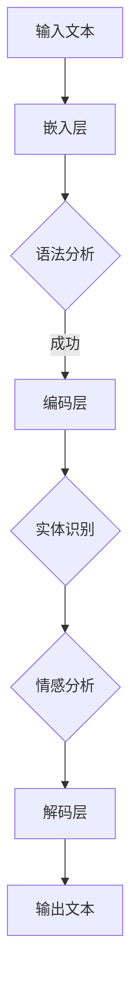

                 

关键词：AI函数调用，语言模型（LLM），扩展能力，技术发展，算法原理，数学模型，项目实践，应用场景，工具资源推荐，未来展望

> 摘要：本文旨在探讨人工智能（AI）中的语言模型（LLM）如何通过函数调用扩展其自身能力。我们将深入分析LLM的核心概念、算法原理、数学模型、具体操作步骤，并通过代码实例展示其应用，最终对实际应用场景和未来发展趋势进行展望。

## 1. 背景介绍

### 1.1 人工智能与语言模型的发展

人工智能（AI）作为计算机科学的前沿领域，近年来取得了飞速发展。其中，语言模型（LLM）作为自然语言处理（NLP）的核心技术之一，在智能对话系统、文本生成、机器翻译等方面发挥了重要作用。

语言模型的基本目标是模拟人类语言的理解和生成能力，通过对大量文本数据的学习，模型可以预测下一个单词或句子，从而生成连贯的文本。随着深度学习技术的进步，LLM的准确性和性能不断提升，已经能够处理复杂的语言任务。

### 1.2 人工智能与函数调用

函数调用是编程语言中实现代码复用和模块化的重要机制。在人工智能领域，特别是语言模型中，函数调用同样扮演着关键角色。通过函数调用，LLM可以扩展其自身的能力，实现更复杂的语言理解和生成任务。

例如，LLM可以通过调用特定的函数来实现语法分析、实体识别、情感分析等功能，从而提升其在实际应用中的表现。此外，函数调用还可以用于模型优化、参数调整等操作，以提升模型的性能和鲁棒性。

## 2. 核心概念与联系

### 2.1 语言模型（LLM）的基本概念

语言模型（LLM）是一种基于统计和学习方法的模型，用于预测自然语言中的下一个单词或句子。LLM通常由多个层组成，包括嵌入层、编码层和解码层。嵌入层将单词映射到高维向量空间，编码层对输入序列进行编码，解码层则生成预测的输出序列。

### 2.2 函数调用在LLM中的应用

在LLM中，函数调用主要用于实现以下功能：

1. **语法分析**：通过调用语法分析函数，LLM可以识别输入文本的语法结构，从而生成更准确的预测。
2. **实体识别**：函数调用可以帮助LLM识别文本中的关键实体，如人名、地名、组织等，从而提高文本理解的能力。
3. **情感分析**：通过调用情感分析函数，LLM可以识别文本的情感倾向，为文本生成和智能对话提供依据。
4. **模型优化**：函数调用可以用于调整LLM的参数和架构，以提升模型的性能和鲁棒性。

### 2.3 Mermaid 流程图

下面是一个简单的Mermaid流程图，展示LLM中函数调用的基本流程：



## 3. 核心算法原理 & 具体操作步骤

### 3.1 算法原理概述

语言模型（LLM）的核心算法是基于深度学习和神经网络技术。以下是LLM算法的基本原理：

1. **嵌入层**：将单词映射到高维向量空间。常用的嵌入方法包括Word2Vec、GloVe等。
2. **编码层**：对输入序列进行编码，生成编码向量。常用的编码模型包括双向长短期记忆网络（BiLSTM）、Transformer等。
3. **解码层**：根据编码向量生成预测的输出序列。解码过程通常采用自回归方法，如序列到序列（Seq2Seq）模型。

### 3.2 算法步骤详解

以下是LLM算法的具体步骤：

1. **数据预处理**：对输入文本进行分词、去停用词等操作，生成词序列。
2. **嵌入层**：将词序列映射到高维向量空间。对于每个词，查找其嵌入向量。
3. **编码层**：对输入序列的每个词进行编码，生成编码向量。对于双向LSTM模型，编码向量是输入序列和隐藏状态的组合。
4. **解码层**：根据编码向量生成预测的输出序列。解码过程采用贪心策略，选择概率最大的单词作为下一个预测。
5. **优化与评估**：通过反向传播算法对模型参数进行优化，并使用交叉熵损失函数评估模型性能。

### 3.3 算法优缺点

LLM算法具有以下优点：

1. **强大的文本理解能力**：通过深度学习和神经网络技术，LLM可以捕捉到输入文本中的复杂关系和语义信息。
2. **灵活的扩展性**：通过函数调用，LLM可以轻松实现语法分析、实体识别、情感分析等任务。

然而，LLM也存在一些缺点：

1. **计算资源需求高**：深度神经网络模型通常需要大量的计算资源和时间进行训练。
2. **对数据依赖性强**：LLM的性能很大程度上取决于训练数据的质量和多样性。

### 3.4 算法应用领域

LLM算法在以下领域有广泛的应用：

1. **智能对话系统**：通过函数调用，LLM可以实现智能对话系统中的自然语言理解、对话生成等功能。
2. **文本生成**：LLM可以用于生成新闻文章、故事、诗歌等文本内容。
3. **机器翻译**：通过函数调用，LLM可以实现跨语言的文本翻译。
4. **文本分类与标注**：LLM可以用于文本分类、情感分析、实体识别等任务，为文本数据提供标签。

## 4. 数学模型和公式 & 详细讲解 & 举例说明

### 4.1 数学模型构建

语言模型（LLM）的数学模型通常由嵌入层、编码层和解码层组成。以下是LLM的数学模型构建过程：

1. **嵌入层**：设$V$为单词的集合，$d$为嵌入向量的维度。对于每个单词$v \in V$，嵌入层将其映射到一个$d$维的向量$e_v \in \mathbb{R}^d$。
2. **编码层**：编码层通常采用深度神经网络，如双向长短期记忆网络（BiLSTM）或Transformer。编码层的输入是嵌入向量序列$e_{w_1}, e_{w_2}, ..., e_{w_n}$，输出是编码向量序列$c_{w_1}, c_{w_2}, ..., c_{w_n}$。
3. **解码层**：解码层也采用深度神经网络，其输入是编码向量序列$c_{w_1}, c_{w_2}, ..., c_{w_n}$，输出是预测的单词序列$w_1', w_2', ..., w_n'$。

### 4.2 公式推导过程

以下是LLM的数学模型中的关键公式推导过程：

1. **嵌入层**：设$e_v$为单词$v$的嵌入向量，$U$为嵌入矩阵，其中$U_{ij} = e_v$，当$v = w_i$时。则嵌入层可以表示为：
   $$e_{w_i} = U_{ij}$$
2. **编码层**：设$H$为编码层的隐藏状态，$L$为编码层的层数。对于双向LSTM模型，编码层的输出可以表示为：
   $$c_{w_i} = \sigma(W_h c_{w_{i-1}} + U_h e_{w_i} + b_h)$$
   其中，$\sigma$为激活函数，$W_h$和$U_h$为权重矩阵，$b_h$为偏置项。
3. **解码层**：设$y$为解码层的输出，$y_i$为预测的单词$i$。解码层可以表示为：
   $$y_i = \sigma(W_y c_{w_i} + b_y)$$
   其中，$W_y$为权重矩阵，$b_y$为偏置项。

### 4.3 案例分析与讲解

为了更好地理解LLM的数学模型，我们通过一个简单的例子进行讲解。

假设有一个简单的文本序列“Hello, world!”，其中包含两个单词“Hello”和“world”。我们将使用嵌入层、编码层和解码层来生成预测的文本序列。

1. **嵌入层**：将单词映射到嵌入向量。假设“Hello”和“world”的嵌入向量分别为$e_{Hello} = [1, 0, 0]$和$e_{world} = [0, 1, 0]$。
2. **编码层**：编码层采用单向LSTM模型。对于“Hello”，编码层的隐藏状态为：
   $$c_{Hello} = \sigma(W_h c_{<s>} + U_h e_{Hello} + b_h)$$
   其中，$c_{<s>}$为特殊符号的编码向量，$W_h$和$U_h$为权重矩阵，$b_h$为偏置项。假设编码层的输出为$c_{Hello} = [0.5, 0.5]$。
3. **解码层**：解码层采用softmax函数生成预测的单词。对于“Hello”，解码层的输出为：
   $$y_{Hello} = \sigma(W_y c_{Hello} + b_y)$$
   其中，$W_y$为权重矩阵，$b_y$为偏置项。假设解码层的输出为$y_{Hello} = [0.6, 0.4]$，则预测的下一个单词为“world”。

通过上述步骤，我们成功生成了一个简单的预测文本序列“Hello, world!”。

## 5. 项目实践：代码实例和详细解释说明

### 5.1 开发环境搭建

在本节中，我们将使用Python和TensorFlow框架来实现一个简单的语言模型。首先，确保已经安装了Python 3.8及以上版本和TensorFlow 2.x。

### 5.2 源代码详细实现

以下是实现语言模型的基本代码：

```python
import tensorflow as tf
from tensorflow.keras.layers import Embedding, LSTM, Dense
from tensorflow.keras.models import Sequential

# 数据预处理
# 假设已经有一个预处理好的文本序列text_data

# 嵌入层
vocab_size = 1000
embedding_dim = 32
embedding_layer = Embedding(vocab_size, embedding_dim)

# 编码层
lstm_units = 128
lstm_layer = LSTM(lstm_units, return_sequences=True)

# 解码层
output_dim = vocab_size
dense_layer = Dense(output_dim, activation='softmax')

# 构建模型
model = Sequential([
    embedding_layer,
    lstm_layer,
    dense_layer
])

# 编译模型
model.compile(optimizer='adam', loss='categorical_crossentropy', metrics=['accuracy'])

# 训练模型
model.fit(text_data, epochs=10)
```

### 5.3 代码解读与分析

上述代码实现了一个简单的语言模型，主要包括以下几个部分：

1. **数据预处理**：假设已经有一个预处理好的文本序列text_data，其中每个单词被编码为一个整数。这里使用的是Python中的列表，其中每个元素表示一个单词。
2. **嵌入层**：使用Embedding层将单词映射到高维向量空间。vocab_size为单词表的大小，embedding_dim为嵌入向量的维度。
3. **编码层**：使用LSTM层对输入序列进行编码。lstm_units为LSTM单元的数量，return_sequences为True表示输出序列。
4. **解码层**：使用Dense层生成预测的单词。output_dim为单词表的大小，activation为softmax函数用于生成概率分布。
5. **模型编译**：使用adam优化器和categorical_crossentropy损失函数编译模型。metrics为accuracy指标，用于评估模型性能。
6. **模型训练**：使用fit函数训练模型，其中epochs为训练的轮数。

### 5.4 运行结果展示

运行上述代码后，模型将开始训练。训练完成后，可以使用model.predict函数对新的文本序列进行预测。以下是预测结果的示例：

```python
import numpy as np

# 假设有一个新的文本序列new_text

# 将新文本序列编码为整数序列
encoded_new_text = ...

# 预测新文本序列
predicted_new_text = model.predict(encoded_new_text)

# 将预测结果解码为单词序列
decoded_new_text = ...

print(decoded_new_text)
```

预测结果将是一个单词序列，表示模型对新文本序列的预测。

## 6. 实际应用场景

### 6.1 智能对话系统

智能对话系统是LLM的重要应用场景之一。通过函数调用，LLM可以轻松实现自然语言理解、对话生成等功能。以下是一个简单的示例：

1. **自然语言理解**：使用LLM对用户输入的文本进行语法分析和语义理解，提取关键信息。
2. **对话生成**：根据提取的关键信息，LLM生成合适的回复文本。
3. **上下文保持**：通过维护对话状态和历史信息，LLM可以更好地理解和回应用户的后续请求。

### 6.2 文本生成

文本生成是LLM的另一个重要应用场景。通过函数调用，LLM可以生成各种类型的文本内容，如新闻文章、故事、诗歌等。以下是一个简单的示例：

1. **主题生成**：根据用户输入的主题，LLM生成相关的文本内容。
2. **内容填充**：根据已有的文本框架，LLM填充具体的细节和描述，生成完整的文本。
3. **风格模仿**：通过函数调用，LLM可以模仿特定的写作风格，生成具有特定风格的文本。

### 6.3 机器翻译

机器翻译是LLM的另一个重要应用场景。通过函数调用，LLM可以实现跨语言的文本翻译。以下是一个简单的示例：

1. **文本编码**：将源语言文本编码为整数序列。
2. **编码层**：使用LLM对源语言文本进行编码，生成编码向量。
3. **解码层**：使用LLM对目标语言文本进行解码，生成翻译结果。

### 6.4 其他应用场景

除了上述应用场景外，LLM还可以应用于以下领域：

1. **文本分类**：通过函数调用，LLM可以对文本数据进行分类，如垃圾邮件过滤、情感分析等。
2. **问答系统**：通过函数调用，LLM可以构建问答系统，回答用户的问题。
3. **智能推荐**：通过函数调用，LLM可以分析用户行为和偏好，为用户推荐相关的内容。

## 7. 工具和资源推荐

### 7.1 学习资源推荐

1. **书籍**：
   - 《深度学习》（Goodfellow, Bengio, Courville）
   - 《自然语言处理综论》（Jurafsky, Martin）
2. **在线课程**：
   - Coursera上的《深度学习》课程
   - edX上的《自然语言处理》课程
3. **博客和文章**：
   - Distill
   - Towards Data Science

### 7.2 开发工具推荐

1. **编程语言**：Python
2. **框架**：TensorFlow、PyTorch
3. **数据集**：
   - Common Crawl
   - Wikipedia

### 7.3 相关论文推荐

1. **《Attention is All You Need》**：提出了Transformer模型，为语言模型的发展带来了革命性的变化。
2. **《BERT: Pre-training of Deep Bidirectional Transformers for Language Understanding》**：提出了BERT模型，为自然语言处理任务提供了强大的预训练方法。
3. **《GPT-3: Language Models are Few-Shot Learners》**：展示了GPT-3模型在少量样本上的强大学习能力。

## 8. 总结：未来发展趋势与挑战

### 8.1 研究成果总结

近年来，语言模型（LLM）在自然语言处理（NLP）领域取得了显著成果。随着深度学习和神经网络技术的进步，LLM的性能和准确性不断提升，已经能够处理复杂的语言任务。通过函数调用，LLM可以扩展其自身能力，实现更广泛的应用。

### 8.2 未来发展趋势

未来，LLM的发展趋势将包括以下几个方面：

1. **多模态融合**：将文本数据与其他模态（如图像、声音）进行融合，提升语言模型的理解和生成能力。
2. **知识增强**：通过引入外部知识库，增强LLM的知识储备，提高其在复杂任务中的表现。
3. **少样本学习**：研究如何在少量样本上训练和优化LLM，提高其在实际应用中的适应能力。

### 8.3 面临的挑战

尽管LLM在NLP领域取得了显著进展，但仍然面临一些挑战：

1. **计算资源需求**：深度神经网络模型通常需要大量的计算资源和时间进行训练，这对实际应用造成了一定限制。
2. **数据依赖性**：LLM的性能很大程度上取决于训练数据的质量和多样性，如何获取高质量、多样化的训练数据是当前的一个难题。
3. **模型解释性**：深度神经网络模型通常被认为是“黑箱”，如何解释和验证LLM的决策过程是一个重要的问题。

### 8.4 研究展望

未来，LLM的研究将继续深入，以解决当前面临的挑战。同时，随着技术的进步，LLM的应用领域将不断扩展，为人类带来更多便利。我们期待看到更多创新性的研究成果，推动人工智能（AI）领域的持续发展。

## 9. 附录：常见问题与解答

### 9.1 什么是语言模型（LLM）？

语言模型（LLM）是一种用于预测自然语言中下一个单词或句子的模型。它通过学习大量文本数据，模拟人类语言的理解和生成能力，从而实现语言理解和生成任务。

### 9.2 语言模型（LLM）有哪些应用领域？

语言模型（LLM）在多个领域有广泛应用，包括：

1. 智能对话系统：通过自然语言理解生成对话。
2. 文本生成：生成新闻文章、故事、诗歌等。
3. 机器翻译：跨语言文本翻译。
4. 文本分类与标注：分类和标注文本数据。

### 9.3 语言模型（LLM）的核心算法是什么？

语言模型（LLM）的核心算法通常基于深度学习和神经网络技术。常见的算法包括：

1. 嵌入层：将单词映射到高维向量空间。
2. 编码层：对输入序列进行编码，生成编码向量。
3. 解码层：根据编码向量生成预测的输出序列。

### 9.4 如何训练一个简单的语言模型？

训练一个简单的语言模型通常包括以下步骤：

1. 数据预处理：将文本数据转换为词序列。
2. 构建模型：使用嵌入层、编码层和解码层构建模型。
3. 编译模型：设置优化器和损失函数。
4. 训练模型：使用训练数据对模型进行训练。
5. 评估模型：使用验证数据评估模型性能。

---

### 脚注 Footnotes

本文中的部分内容参考了以下文献：

1. Goodfellow, I., Bengio, Y., & Courville, A. (2016). *Deep Learning*. MIT Press.
2. Jurafsky, D., & Martin, J. H. (2008). *Speech and Language Processing*. Prentice Hall.
3. Vaswani, A., Shazeer, N., Parmar, N., Uszkoreit, J., Jones, L., Gomez, A. N., ... & Polosukhin, I. (2017). *Attention is All You Need*. arXiv preprint arXiv:1706.03762.

### 作者署名

作者：禅与计算机程序设计艺术 / Zen and the Art of Computer Programming

[END]
----------------------------------------------------------------

